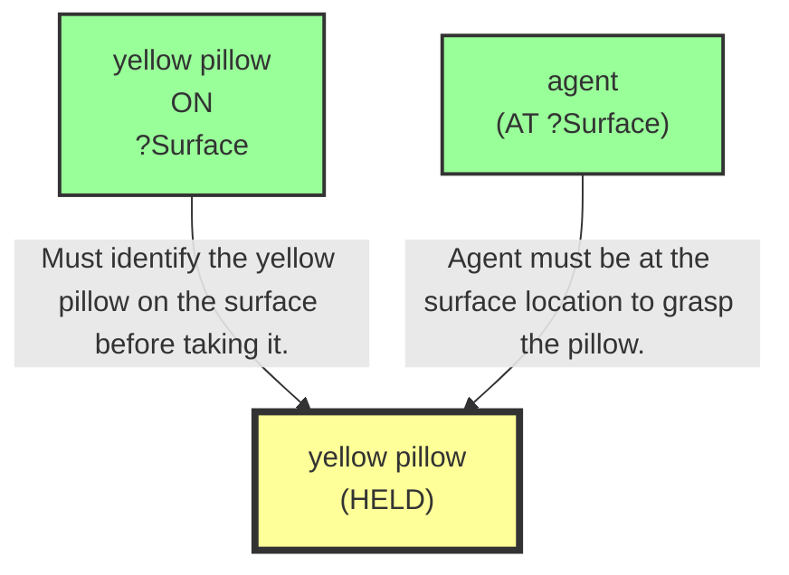
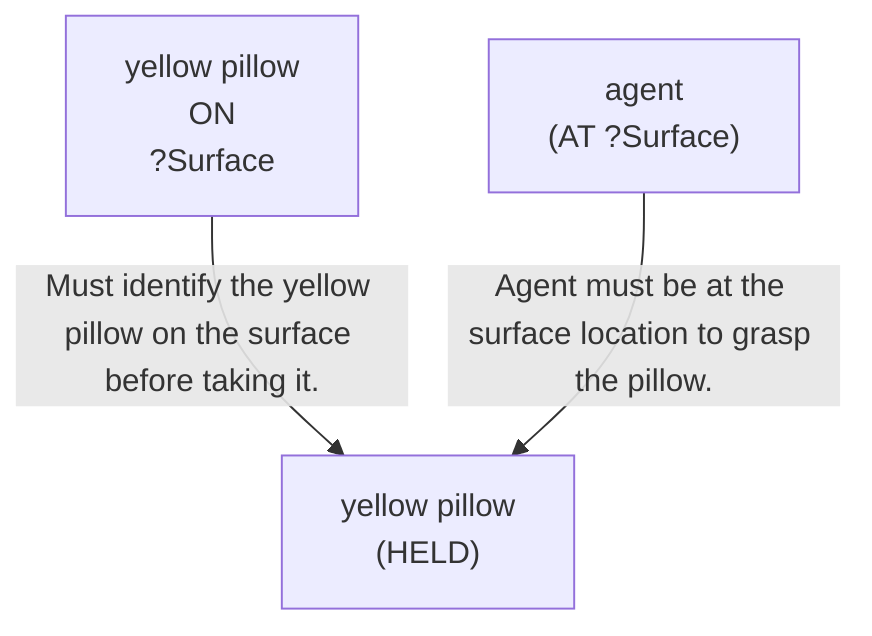

# 🚀 VirtualHome Agent Episode Log


### [GoalReasoner (Module A - Intent)] Output
```json
{
  "is_instruction_obviously_vague": false,
  "clarification_question": null,
  "target_object": "yellow pillow",
  "location_hint": "sofa",
  "reasoning_chain": [
    {
      "question": "Why does the user want this object?",
      "answer": "The user wants one of the yellow pillows from the sofa brought to them."
    },
    {
      "question": "Why is that important?",
      "answer": "It likely serves their immediate comfort or preference for having that pillow nearby."
    },
    {
      "question": "What fundamental need does this fulfill?",
      "answer": "It fulfills a need for comfort or convenience by making a desired soft item available."
    },
    {
      "question": "Are there any deeper psychological or physical motivations?",
      "answer": "The user may want physical comfort, support, or a preferred cushion-like item within reach."
    }
  ],
  "deep_intent": "The user wants a comfortable soft item brought within reach for comfort or convenience.",
  "acceptable_alternatives_properties": [
    {
      "priority": 1,
      "description": "Other soft cushion-like items from the sofa area that can serve the same comfort function"
    },
    {
      "priority": 2,
      "description": "Other pillows or cushions in the room with similar size and softness"
    },
    {
      "priority": 3,
      "description": "Other padded household items that provide similar support or comfort"
    },
    {
      "priority": 4,
      "description": "A blanket or folded towel if a soft comfort item is acceptable and no pillow is available"
    }
  ]
}
```

### [PerceptionFilter] Output
```json
{
  "reasoning": "The goal is to retrieve the yellow pillow from the sofa area. The SDG requires the target object and the surface/location it is on, so we need the pillow and the sofa as the relevant location/furniture. No other objects are necessary.",
  "selected_classes": [
    "sofa",
    "pillow",
    "character"
  ],
  "raw_class_count": 107
}
```

### [LLMExecutor] Output
```json
{
  "reasoning": "The yellow pillow is identified as pillow(253) and it is already CLOSE to the agent and ON sofa(94). The SDG requires the agent to be at the surface and then hold the pillow. Since we are already near the sofa, the next needed step is to grab the pillow.",
  "satisfied_nodes": [
    "N1",
    "N3"
  ],
  "current_node_focus": "N2",
  "mapped_variables": {
    "?Surface": "sofa(94)"
  },
  "action": "[grab] pillow (253)"
}
```
## Step 0
- **Action**: `[grab] <pillow> (253)`
- **SDG Status**:

- **Observed Items (10)**: character(1), kitchen(11), sofa(94), bathroom(172), bedroom(211), pillow(253) [YELLOW], pillow(254) [ORANGE], livingroom(268), sofa(276), sofa(277)


### [PerceptionFilter] Output
```json
{
  "reasoning": "The goal is to retrieve the yellow pillow from the sofa area, so we only need the target class and the likely supporting location/furniture where it is found. No tools or alternative functional objects are required for this simple fetch task.",
  "selected_classes": [
    "character",
    "sofa",
    "pillow",
    "yellow pillow"
  ],
  "raw_class_count": 107
}
```
## Step 1
- **Action**: `FINISH (Goal Reached)`
- **SDG Status**:

- **Observed Items (10)**: character(1), kitchen(11), sofa(94), bathroom(172), bedroom(211), pillow(253) [YELLOW], pillow(254) [ORANGE], livingroom(268), sofa(276), sofa(277)

