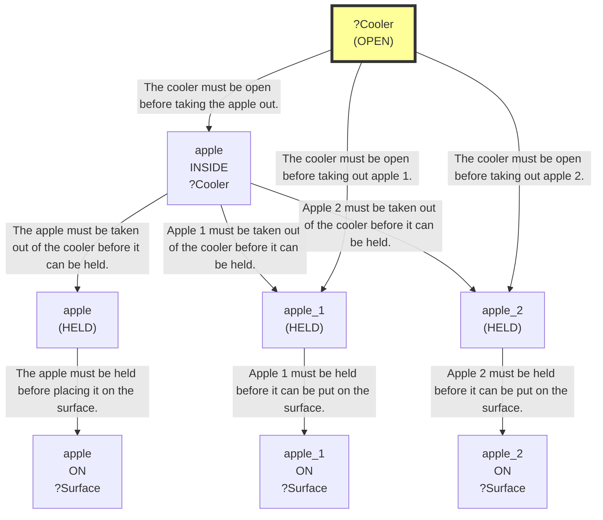
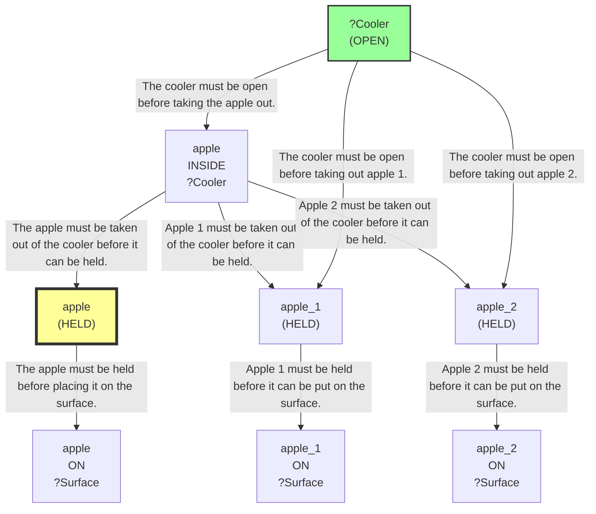
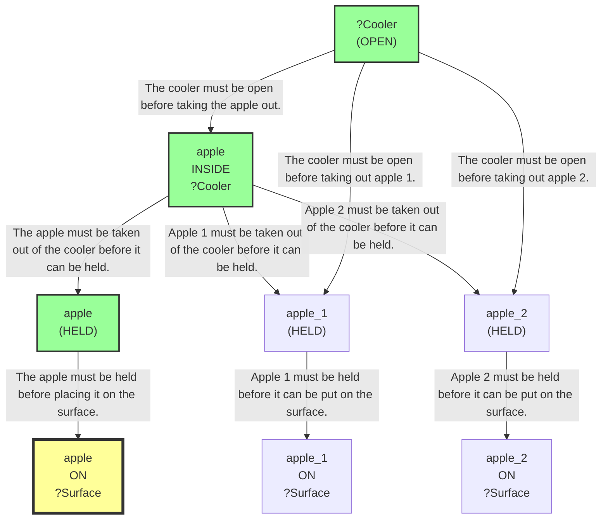
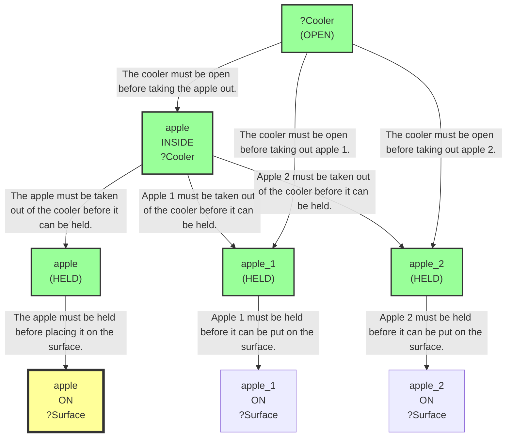
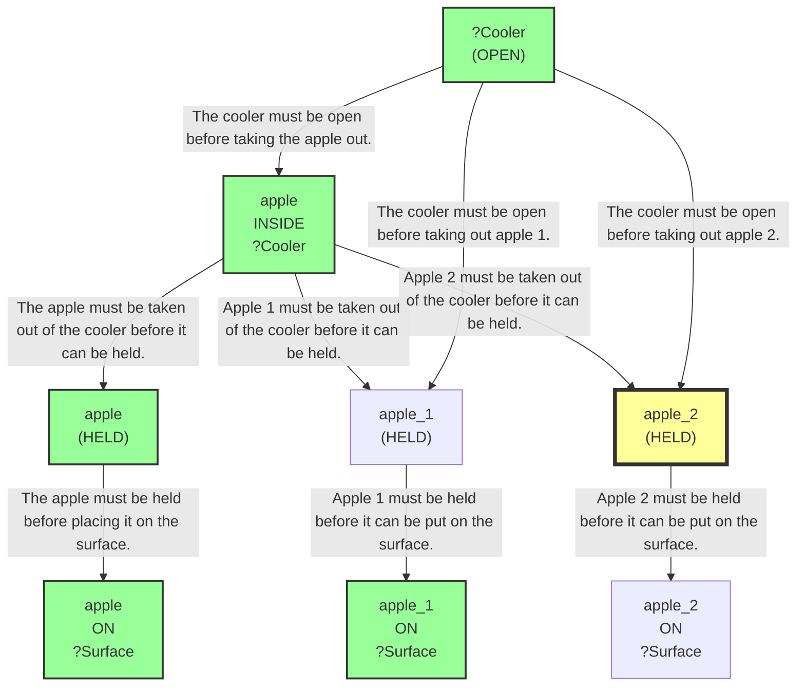
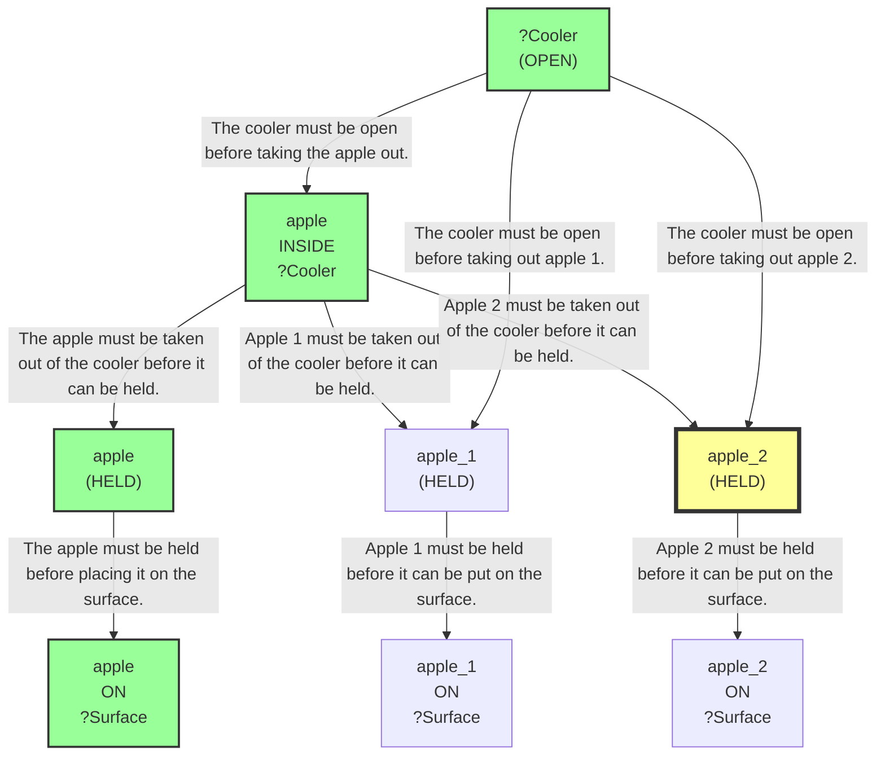
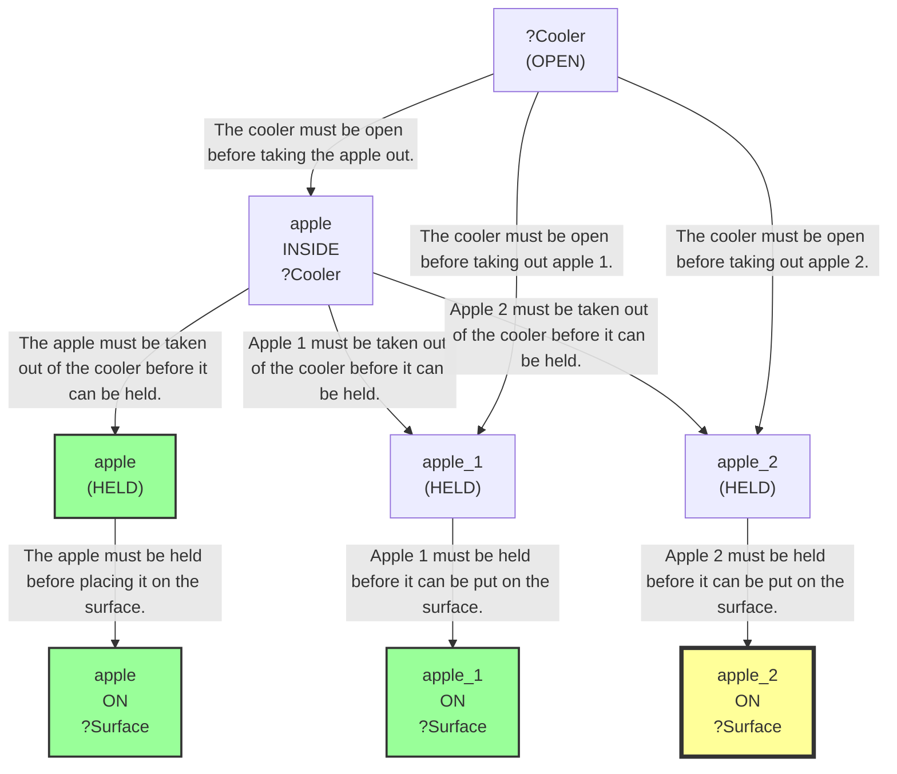
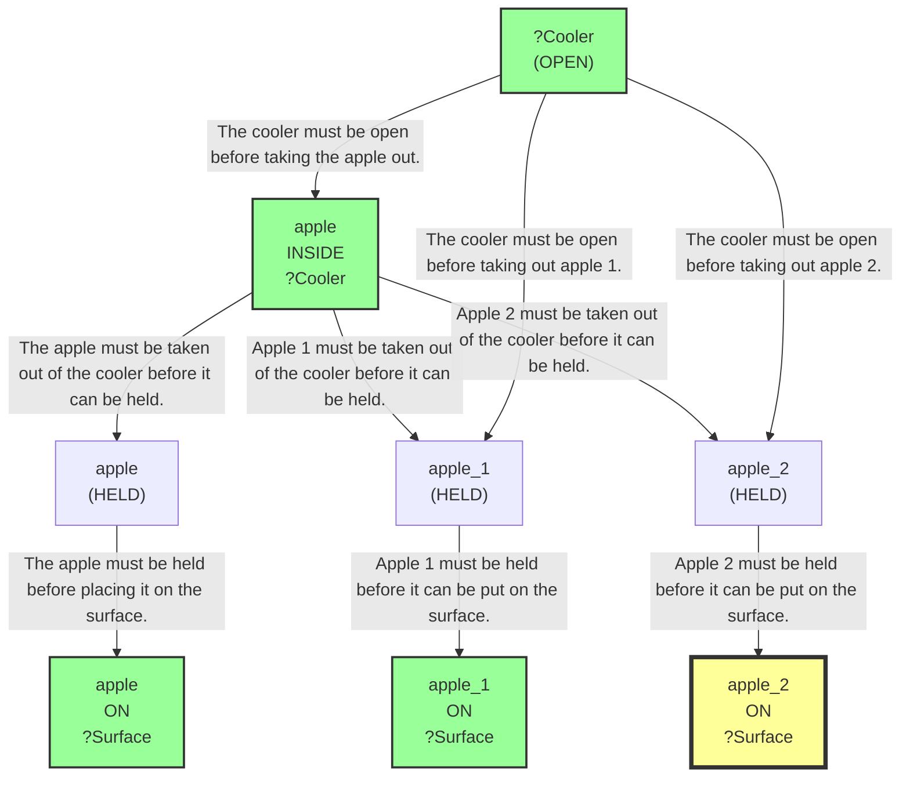
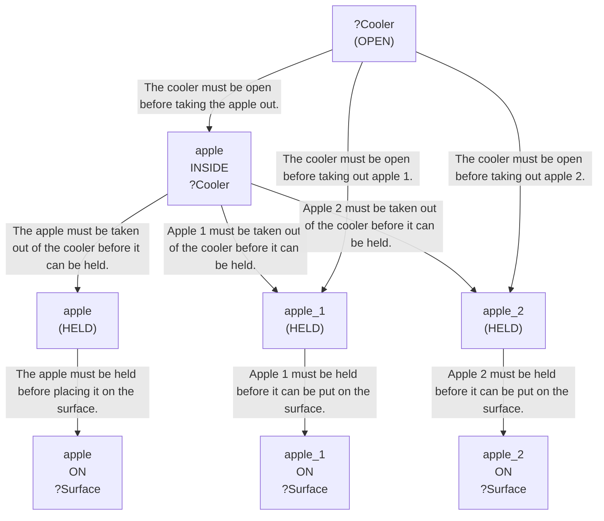

# 🚀 VirtualHome Agent Episode Log


### [GoalReasoner (Module A - Intent)] Output
```json
{
  "is_instruction_obviously_vague": false,
  "clarification_question": null,
  "target_object": "apple",
  "location_hint": "fridge",
  "reasoning_chain": [
    {
      "question": "Why does the user want this object?",
      "answer": "To have apples available outside the fridge, specifically on the table."
    },
    {
      "question": "Why is that important?",
      "answer": "So the apples can be easily accessed or used from the table."
    },
    {
      "question": "What fundamental need does this fulfill?",
      "answer": "It fulfills the need to retrieve and place food items in a desired, accessible location."
    },
    {
      "question": "Are there any deeper psychological or physical motivations?",
      "answer": "The user may want convenience, readiness for eating, or organized placement of food within the room."
    }
  ],
  "deep_intent": "The user wants to make food items accessible by moving them from storage to a table.",
  "acceptable_alternatives_properties": [
    {
      "priority": 1,
      "description": "Other similar fresh fruits that can be taken from cold storage and placed on the table, such as pears or oranges"
    },
    {
      "priority": 2,
      "description": "Other whole fruit items suitable for table placement, such as bananas or peaches"
    },
    {
      "priority": 3,
      "description": "Other ready-to-eat snack foods that can be stored in a fridge and served on a table"
    },
    {
      "priority": 4,
      "description": "Any edible item that can be conveniently moved from storage to the table for later consumption"
    }
  ]
}
```

### [PerceptionFilter] Output
```json
{
  "reasoning": "The goal is to retrieve apples from cold storage and place them on a table. So we only need the target object class and the relevant storage/placement furniture: the fridge as the cooler and the table as the destination surface. No extra tools are required by the SDG.",
  "selected_classes": [
    "table",
    "fridge",
    "apple",
    "bananas",
    "character",
    "peach",
    "kitchentable"
  ],
  "raw_class_count": 112
}
```

### [LLMExecutor] Output
```json
{
  "reasoning": "The goal is to place an apple on the table, but the required cooler is the fridge, and there is an active global rule forbidding approaching or opening the fridge until step 6. Since the fridge is currently being cleaned, I cannot satisfy N4/N3 yet. The correct autonomous response is to wait for the temporary restriction to expire.",
  "satisfied_nodes": [],
  "current_node_focus": "N4",
  "mapped_variables": {
    "?Cooler": "fridge(305)",
    "?Surface": "kitchentable(231)"
  },
  "action": "[wait]"
}
```
## Step 0
- **Action**: `[wait]`
- **SDG Status**:

- **Observed Items (14)**: character(1), bathroom(11), bedroom(73), kitchen(205), kitchentable(231), fridge(305) [CLOSED], bananas(315), bananas(316), livingroom(335), apple(437) [COLD], apple(438) [COLD], bananas(439), peach(441), peach(442)


### [PerceptionFilter] Output
```json
{
  "reasoning": "The goal is to take apples out of cold storage and place them on a table. So the minimum needed classes are the target item apple, the storage appliance fridge, and the destination surface table (represented here as kitchentable/coffeetable variants; the generic table class is not listed, so the available table surface class is needed).",
  "selected_classes": [
    "fridge",
    "apple",
    "bananas",
    "character",
    "peach",
    "kitchentable"
  ],
  "raw_class_count": 112
}
```

### [LLMExecutor] Output
```json
{
  "reasoning": "The required cooler is the fridge(305), and the SDG still needs the fridge to be open before an apple can be taken out. However, an active global rule currently forbids approaching or opening the fridge until step 6. Since this is a temporary restriction blocking progress, the correct next atomic action is to wait.",
  "satisfied_nodes": [],
  "current_node_focus": "N4",
  "mapped_variables": {
    "?Cooler": "fridge(305)",
    "?Surface": "kitchentable(231)"
  },
  "action": "[wait]"
}
```
## Step 1
- **Action**: `[wait]`
- **SDG Status**:

- **Observed Items (14)**: character(1), bathroom(11), bedroom(73), kitchen(205), kitchentable(231), fridge(305) [CLOSED], bananas(315), bananas(316), livingroom(335), apple(437) [COLD], apple(438) [COLD], bananas(439), peach(441), peach(442)


### [PerceptionFilter] Output
```json
{
  "reasoning": "The goal requires retrieving apples from cold storage and placing them on a table. So the minimum needed classes are the target food item, the storage appliance that can contain it, and the destination surface for placement. No other objects are strictly necessary.",
  "selected_classes": [
    "table",
    "fridge",
    "apple",
    "bananas",
    "character",
    "peach"
  ],
  "raw_class_count": 112
}
```

### [LLMExecutor] Output
```json
{
  "reasoning": "The fridge is still under an active temporary cleaning restriction until step 6, which forbids approaching or opening it. Since the apple is inside the fridge and the SDG requires the fridge to be open before the apple can be taken out, no progress can be made yet. The correct atomic action is to wait for the restriction to expire.",
  "satisfied_nodes": [],
  "current_node_focus": "N4",
  "mapped_variables": {
    "?Cooler": "fridge(305)",
    "?Surface": "table"
  },
  "action": "[wait]"
}
```
## Step 2
- **Action**: `[wait]`
- **SDG Status**:

- **Observed Items (13)**: character(1), bathroom(11), bedroom(73), kitchen(205), fridge(305) [CLOSED], bananas(315), bananas(316), livingroom(335), apple(437) [COLD], apple(438) [COLD], bananas(439), peach(441), peach(442)


### [PerceptionFilter] Output
```json
{
  "reasoning": "The goal requires retrieving apples from cold storage and placing them on a table. So we need the target item class apple, the storage appliance fridge, and the destination surface table. The SDG also implies a cooler/openable storage container, which is covered by fridge here. To respect alternatives, no additional functional storage or surface classes are needed beyond the explicitly relevant ones.",
  "selected_classes": [
    "table",
    "fridge",
    "apple",
    "bananas",
    "character",
    "peach"
  ],
  "raw_class_count": 112
}
```

### [LLMExecutor] Output
```json
{
  "reasoning": "The active global rule still forbids approaching or opening the fridge until step 6. The required apple is inside the fridge, and the SDG cannot progress toward opening the cooler or taking the apple while the temporary restriction remains. Therefore the correct single atomic action is to wait for the rule to expire.",
  "satisfied_nodes": [],
  "current_node_focus": "N4",
  "mapped_variables": {
    "?Cooler": "fridge(305)",
    "?Surface": "table"
  },
  "action": "[wait]"
}
```
## Step 3
- **Action**: `[wait]`
- **SDG Status**:

- **Observed Items (13)**: character(1), bathroom(11), bedroom(73), kitchen(205), fridge(305) [CLOSED], bananas(315), bananas(316), livingroom(335), apple(437) [COLD], apple(438) [COLD], bananas(439), peach(441), peach(442)


### [PerceptionFilter] Output
```json
{
  "reasoning": "The goal is to move apples from cold storage to a table, so the necessary classes are the target food item, the cooler used for storage (fridge), and the destination surface (table). The SDG also requires the cooler to be opened and apples to be held before placing them on the surface. Since the visible object list includes a fridge and a table, those are the relevant location/container classes to retain along with apple.",
  "selected_classes": [
    "table",
    "fridge",
    "apple",
    "bananas",
    "character",
    "peach"
  ],
  "raw_class_count": 112
}
```

### [LLMExecutor] Output
```json
{
  "reasoning": "The goal requires taking an apple out of the fridge and placing it on a table. The fridge is still under an active temporary rule forbidding approaching or opening it until step 6, so no progress can be made toward N4/N3 yet. The correct autonomous action is to wait until the restriction expires.",
  "satisfied_nodes": [],
  "current_node_focus": "N4",
  "mapped_variables": {
    "?Cooler": "fridge(305)",
    "?Surface": "table"
  },
  "action": "[wait]"
}
```
## Step 4
- **Action**: `[wait]`
- **SDG Status**:

- **Observed Items (13)**: character(1), bathroom(11), bedroom(73), kitchen(205), fridge(305) [CLOSED], bananas(315), bananas(316), livingroom(335), apple(437) [COLD], apple(438) [COLD], bananas(439), peach(441), peach(442)


### [PerceptionFilter] Output
```json
{
  "reasoning": "The goal requires retrieving apples from cold storage and placing them on a table. The SDG explicitly needs the apple(s), the cooler/fridge as the storage location to access them, and the surface/table where they will be placed. To preserve functional alternatives for the cooler, include the fridge only since it matches the required cooler capability in the visible list.",
  "selected_classes": [
    "table",
    "fridge",
    "apple",
    "bananas",
    "character",
    "peach"
  ],
  "raw_class_count": 112
}
```

### [LLMExecutor] Output
```json
{
  "reasoning": "The temporary fridge-cleaning restriction is still active until step 6, so I cannot approach or open the fridge yet. The SDG requires the fridge to be open before taking out either apple, and no alternative object is needed because the missing precondition is temporary. The only valid progress action is to wait one more step.",
  "satisfied_nodes": [],
  "current_node_focus": "N4",
  "mapped_variables": {
    "?Cooler": "fridge(305)",
    "?Surface": "table (not yet identified)"
  },
  "action": "[wait]"
}
```
## Step 5
- **Action**: `[wait]`
- **SDG Status**:

- **Observed Items (13)**: character(1), bathroom(11), bedroom(73), kitchen(205), fridge(305) [CLOSED], bananas(315), bananas(316), livingroom(335), apple(437) [COLD], apple(438) [COLD], bananas(439), peach(441), peach(442)


### [PerceptionFilter] Output
```json
{
  "reasoning": "The goal requires retrieving apples from cold storage and placing them on a table. So we must keep the target object class (apple), the storage appliance implied by the SDG and location hint (fridge), and the destination surface needed for placement (table, represented here by the available kitchentable/coffeetable surfaces). No other objects are necessary.",
  "selected_classes": [
    "fridge",
    "apple",
    "bananas",
    "character",
    "peach",
    "coffeetable",
    "kitchentable"
  ],
  "raw_class_count": 112
}
```

### [LLMExecutor] Output
```json
{
  "reasoning": "The temporary fridge restriction has expired and there are no active global rules. The SDG still requires the apple to be taken out of the fridge before it can be placed on a surface. The fridge is currently CLOSED, so the next needed step is to open it. I will bind ?Cooler to fridge(305) because it is the only relevant openable cooler in the graph and the apples are inside it.",
  "satisfied_nodes": [],
  "current_node_focus": "N4",
  "mapped_variables": {
    "?Cooler": "fridge(305)",
    "?Surface": "kitchentable(231)"
  },
  "action": "[open] fridge (305)"
}
```
## Step 6
- **Action**: `[open] <fridge> (305)`
- **SDG Status**:

- **Observed Items (16)**: character(1), bathroom(11), bedroom(73), coffeetable(111), kitchen(205), kitchentable(231), fridge(305) [CLOSED], bananas(315), bananas(316), livingroom(335), coffeetable(371), apple(437) [COLD], apple(438) [COLD], bananas(439), peach(441)...


### [PerceptionFilter] Output
```json
{
  "reasoning": "The goal is to move apples from cold storage to a table. The SDG requires the apple target, a cooler (fridge) to retrieve from, and a surface to place it on; the location hint and intent imply a table. To be safe, I keep the fruit target plus the storage appliance and the table-like surface needed for placement.",
  "selected_classes": [
    "table",
    "fridge",
    "apple",
    "bananas",
    "character",
    "peach"
  ],
  "raw_class_count": 112
}
```

### [LLMExecutor] Output
```json
{
  "reasoning": "The fridge is already open, so the next missing prerequisite in the SDG is to take an apple out of the fridge by grabbing it. Both apple(437) and apple(438) are inside the open fridge and close to the character, and either can satisfy the apple objective. Since the goal is to move an apple from storage to a table, the best immediate progress is to grab one apple now. I will bind ?Cooler to fridge(305).",
  "satisfied_nodes": [
    "N4"
  ],
  "current_node_focus": "N2",
  "mapped_variables": {
    "?Cooler": "fridge(305)"
  },
  "action": "[grab] apple (437)"
}
```
## Step 7
- **Action**: `[grab] <apple> (437)`
- **SDG Status**:

- **Observed Items (13)**: character(1), bathroom(11), bedroom(73), kitchen(205), fridge(305) [OPEN], bananas(315), bananas(316), livingroom(335), apple(437) [COLD], apple(438) [COLD], bananas(439), peach(441), peach(442)


### [PerceptionFilter] Output
```json
{
  "reasoning": "Needed classes are the target food item and the storage/placement surfaces implied by the task. The SDG requires an apple, a cooler for retrieval (fridge), and a surface to place it on (table).",
  "selected_classes": [
    "table",
    "fridge",
    "apple",
    "bananas",
    "character",
    "peach"
  ],
  "raw_class_count": 112
}
```

### [LLMExecutor] Output
```json
{
  "reasoning": "The goal is to place an apple on a surface. The fridge is already open and I am currently holding apple(437) in my right hand, so the remaining missing step toward N1 is to place the held apple onto an accessible surface. The table is not explicitly listed in the filtered graph, but the instruction says the apples should be on the table; however, no table object is visible. Since the current graph shows the character is already close to the apple and holding it, the immediate next progress step is to move toward the intended surface once identified. Because no surface candidate is visible in the graph, I cannot safely execute a putback yet. The best single next action is to ask for the table/object identifier only if needed, but the instruction is not vague and the task is feasible. However, given the current graph lacks any surface target, the only non-destructive progress action is to wait for the table to appear in the graph.",
  "satisfied_nodes": [
    "N2",
    "N3",
    "N4"
  ],
  "current_node_focus": "N1",
  "mapped_variables": {
    "?Cooler": "fridge(305)",
    "?Surface": "unknown_surface"
  },
  "action": "[wait]"
}
```
## Step 8
- **Action**: `[wait]`
- **SDG Status**:

- **Observed Items (13)**: character(1), bathroom(11), bedroom(73), kitchen(205), fridge(305) [OPEN], bananas(315), bananas(316), livingroom(335), apple(437) [COLD], apple(438) [COLD], bananas(439), peach(441), peach(442)


### [PerceptionFilter] Output
```json
{
  "reasoning": "The goal requires retrieving apples from storage and placing them on a table. So we need the target object class apple, the storage appliance fridge as the cooler, and the table surface as the destination. No other objects are strictly necessary.",
  "selected_classes": [
    "fridge",
    "apple",
    "bananas",
    "character",
    "peach",
    "kitchentable"
  ],
  "raw_class_count": 112
}
```

### [LLMExecutor] Output
```json
{
  "reasoning": "The SDG’s remaining unmet root goal is to have an apple ON a surface. I am already holding apple(437) and the kitchen table kitchentable(231) is visible and is a valid surface. Since the robot must explicitly walk to a surface before putting something back on it, the next atomic step should be to move to the table. This also avoids repeating a walk if already at the table because the current state only says CLOSE character(1) to the apple/fridge, not to the table.",
  "satisfied_nodes": [
    "N4",
    "N3",
    "N2"
  ],
  "current_node_focus": "N1",
  "mapped_variables": {
    "?Cooler": "fridge(305)",
    "?Surface": "kitchentable(231)"
  },
  "action": "[walk] <kitchentable> (231)"
}
```
## Step 9
- **Action**: `[walk] <kitchentable> (231)`
- **SDG Status**:

- **Observed Items (14)**: character(1), bathroom(11), bedroom(73), kitchen(205), kitchentable(231), fridge(305) [OPEN], bananas(315), bananas(316), livingroom(335), apple(437) [COLD], apple(438) [COLD], bananas(439), peach(441), peach(442)


### [PerceptionFilter] Output
```json
{
  "reasoning": "The goal is to retrieve apples from cold storage and place them on a table. So we only need the target food item, the storage appliance implied by the SDG, and the destination surface for placement. The SDG specifies an open cooler/fridge state for removing apples, and the intent mentions a table as the placement location.",
  "selected_classes": [
    "table",
    "fridge",
    "apple",
    "bananas",
    "character",
    "peach"
  ],
  "raw_class_count": 112
}
```

### [LLMExecutor] Output
```json
{
  "reasoning": "The current SDG goal is to have an apple ON a surface. We already satisfy the holding prerequisite with apple(437) in hand, and the prior step successfully walked to the kitchen table. Therefore the remaining missing node is the placement relation onto the surface. Since the table is the intended surface and we are already near it after the last walk, the next atomic step is to place the held apple on the kitchen table.",
  "satisfied_nodes": [
    "N2",
    "N3",
    "N4",
    "N7",
    "N8"
  ],
  "current_node_focus": "N1",
  "mapped_variables": {
    "?Cooler": "fridge(305)",
    "?Surface": "kitchentable(231)"
  },
  "action": "[putback] <apple> (437) <kitchentable> (231)"
}
```
## Step 10
- **Action**: `[putback] <apple> (437) <kitchentable> (231)`
- **SDG Status**:

- **Observed Items (13)**: character(1), bathroom(11), bedroom(73), kitchen(205), fridge(305) [OPEN], bananas(315), bananas(316), livingroom(335), apple(437) [COLD], apple(438) [COLD], bananas(439), peach(441), peach(442)


### [PerceptionFilter] Output
```json
{
  "reasoning": "The goal requires retrieving apples from cold storage and placing them on a table. So the necessary classes are the target food item, the storage appliance that can serve as the cooler, and the destination surface for placement. No other objects are strictly needed.",
  "selected_classes": [
    "table",
    "fridge",
    "apple",
    "bananas",
    "character",
    "peach"
  ],
  "raw_class_count": 112
}
```

### [LLMExecutor] Output
```json
{
  "reasoning": "The SDG goal is to have an apple ON a surface. In the current filtered graph, apple(437) is already on the kitchen table from the previous step sequence, and the fridge is open with another apple still inside. The root relation N1 is satisfied by the existing apple placement, so the remaining useful progress is to work on the alternative apple objective if needed. However, since the prompt asks for the single next atomic action and explicitly says not to repeat a walk action if just done, and there is no clearly indicated unmet prerequisite for the placed apple, the best progression is to grab the remaining apple from the open fridge. This requires being near the fridge, but the character is already in the kitchen and close to apple(437); the fridge itself is in the same room and open, so the next direct action is to walk to the fridge before grabbing apple(438).",
  "satisfied_nodes": [
    "N1",
    "N3",
    "N4",
    "N2",
    "N5"
  ],
  "current_node_focus": "N8",
  "mapped_variables": {
    "?Cooler": "fridge(305)",
    "?Surface": "kitchentable(231)"
  },
  "action": "[walk] <fridge> (305)"
}
```
## Step 11
- **Action**: `[walk] <fridge> (305)`
- **SDG Status**:

- **Observed Items (13)**: character(1), bathroom(11), bedroom(73), kitchen(205), fridge(305) [OPEN], bananas(315), bananas(316), livingroom(335), apple(437) [COLD], apple(438) [COLD], bananas(439), peach(441), peach(442)


### [PerceptionFilter] Output
```json
{
  "reasoning": "Needed classes are the target food item(s) and the storage/surface implied by the SDG and intent. Keep apple as the target, fridge as the required cooler/storage, and table as the destination surface for placement. Because the intent allows similar fruit alternatives and the SDG references multiple apples, include the other visible fruit options that could serve as backups for a similar move from fridge to table.",
  "selected_classes": [
    "table",
    "fridge",
    "apple",
    "bananas",
    "lime",
    "plum",
    "character",
    "peach"
  ],
  "raw_class_count": 112
}
```

### [LLMExecutor] Output
```json
{
  "reasoning": "The root SDG goal is to have an apple ON a surface. Apple(437) is already placed on the kitchen table from prior successful actions, so the primary goal is satisfied. The current filtered graph shows apple(438) still inside the open fridge and close to the character. Since the last action was a walk to the fridge and the instruction says not to repeat a walk action if just done, the next progress step is to grab the remaining apple directly. The fridge is open, the character is close to it, and apple(438) is grabbable, so this is the best single atomic action.",
  "satisfied_nodes": [
    "N1",
    "N2",
    "N3",
    "N4"
  ],
  "current_node_focus": "N8",
  "mapped_variables": {
    "?Cooler": "fridge(305)"
  },
  "action": "[grab] <apple> (438)"
}
```
## Step 12
- **Action**: `[grab] <apple> (438)`
- **SDG Status**:

- **Observed Items (16)**: character(1), bathroom(11), bedroom(73), kitchen(205), fridge(305) [OPEN], bananas(315), bananas(316), livingroom(335), apple(437) [COLD], apple(438) [COLD], bananas(439), lime(440), peach(441), peach(442), plum(443)...


### [PerceptionFilter] Output
```json
{
  "reasoning": "The goal is to retrieve apples from cold storage and place them on a table. The SDG requires the target object (apple) and a cooler, which in the observed scene is the fridge. Since the task is to put the apples on a surface, the table is needed as the destination surface; the observed matching furniture class is kitchentable/table. To satisfy alternative retention, keep the other visible apples as possible matching instances of the target.",
  "selected_classes": [
    "table",
    "fridge",
    "apple",
    "bananas",
    "plum",
    "lime",
    "character",
    "peach",
    "kitchentable"
  ],
  "raw_class_count": 112
}
```

### [LLMExecutor] Output
```json
{
  "reasoning": "The root SDG goal is to have an apple ON a surface. Apple(437) is already on the kitchen table, so one apple placement is satisfied. The remaining apple(438) is currently held in the right hand, which means the next missing prerequisite toward placing it on the table is to move to the surface before using putback. I should not repeat a walk to the fridge because I already just walked there and the current graph shows I am already close to apple(438) and the fridge. The best single next atomic action is to walk to the kitchen table so the held apple can be placed there next.",
  "satisfied_nodes": [
    "N1",
    "N2",
    "N5"
  ],
  "current_node_focus": "N6",
  "mapped_variables": {
    "?Cooler": "fridge(305)",
    "?Surface": "kitchentable(231)"
  },
  "action": "[walk] <kitchentable> (231)"
}
```
## Step 13
- **Action**: `[walk] <kitchentable> (231)`
- **SDG Status**:

- **Observed Items (17)**: character(1), bathroom(11), bedroom(73), kitchen(205), kitchentable(231), fridge(305) [OPEN], bananas(315), bananas(316), livingroom(335), apple(437) [COLD], apple(438) [COLD], bananas(439), lime(440), peach(441), peach(442)...


### [PerceptionFilter] Output
```json
{
  "reasoning": "The goal is to retrieve apples from cold storage and place them on a table. The SDG requires the apple target, a cooler/fridge to take it from, and a surface to place it on. The visible list includes the needed apple and fridge, and the table is implied by the intent, so keep the table-relevant surface class that best matches the goal.",
  "selected_classes": [
    "fridge",
    "apple",
    "bananas",
    "character",
    "peach",
    "kitchentable"
  ],
  "raw_class_count": 112
}
```

### [LLMExecutor] Output
```json
{
  "reasoning": "The main goal is to have an apple on a surface. Apple(437) is already on the kitchentable(231), so the root placement objective is satisfied. The remaining apple(438) is currently held in the right hand, and the character is already CLOSE to the kitchen table. Since the instruction says not to repeat a walk action if I just did it, the next atomic progress step is to place the held apple onto the table. This directly satisfies the remaining placement relation for the second apple instance as well.",
  "satisfied_nodes": [
    "N1",
    "N3",
    "N4",
    "N5"
  ],
  "current_node_focus": "N6",
  "mapped_variables": {
    "?Cooler": "fridge(305)",
    "?Surface": "kitchentable(231)"
  },
  "action": "[putback] <apple> (438) <kitchentable> (231)"
}
```
## Step 14
- **Action**: `[putback] <apple> (438) <kitchentable> (231)`
- **SDG Status**:

- **Observed Items (14)**: character(1), bathroom(11), bedroom(73), kitchen(205), kitchentable(231), fridge(305) [OPEN], bananas(315), bananas(316), livingroom(335), apple(437) [COLD], apple(438) [COLD], bananas(439), peach(441), peach(442)


### [PerceptionFilter] Output
```json
{
  "reasoning": "The goal is to retrieve apples from storage and place them on a table. The SDG requires the target object (apple), the cooler that contains it (fridge as the implied cooler), and the destination surface (table). Since apples may need to be taken out and possibly multiple apples are involved in the SDG, keep the apple class and the fridge, plus the table as the required placement location.",
  "selected_classes": [
    "table",
    "fridge",
    "apple",
    "bananas",
    "character",
    "peach"
  ],
  "raw_class_count": 112
}
```
## Step 15
- **Action**: `FINISH (Goal Reached)`
- **SDG Status**:

- **Observed Items (13)**: character(1), bathroom(11), bedroom(73), kitchen(205), fridge(305) [OPEN], bananas(315), bananas(316), livingroom(335), apple(437) [COLD], apple(438) [COLD], bananas(439), peach(441), peach(442)

