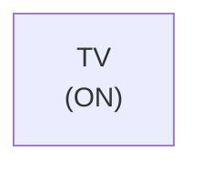

# 🚀 VirtualHome Agent Episode Log


### [GoalReasoner (Module A - Intent)] Output
```json
{
  "is_instruction_obviously_vague": true,
  "clarification_question": "Which TV should I turn on?",
  "target_object": "TV",
  "location_hint": null,
  "reasoning_chain": [
    {
      "question": "Why does the user want this object?",
      "answer": "To have the television powered on."
    },
    {
      "question": "Why is that important?",
      "answer": "So it can display content or be ready for use."
    },
    {
      "question": "What fundamental need does this fulfill?",
      "answer": "To enable access to visual entertainment or information."
    },
    {
      "question": "Are there any deeper psychological or physical motivations?",
      "answer": "The user likely wants to watch, listen to, or prepare the display for media use."
    }
  ],
  "deep_intent": "Enable access to visual entertainment or information.",
  "acceptable_alternatives_properties": [
    {
      "priority": 1,
      "description": "Other display devices that can provide visual media access, such as a monitor or projector."
    },
    {
      "priority": 2,
      "description": "Alternative household screens or media displays that can be powered on for viewing content."
    },
    {
      "priority": 3,
      "description": "Any indoor device that can present video or images for entertainment or information."
    },
    {
      "priority": 4,
      "description": "Other ways to access the same content, such as a tablet or laptop screen."
    }
  ]
}
```

### [PerceptionFilter] Output
```json
{
  "reasoning": "The goal is simply to turn on a TV, and the SDG only requires the TV in the ON state. Since the instruction is vague and asks which TV, but no specific location is given, only the target display device itself is strictly necessary. No backup display device is required by the SDG for this action.",
  "selected_classes": [
    "tv",
    "character",
    "door"
  ],
  "raw_class_count": 99
}
```
## Step 0
- **Action**: `FINISH (Goal Reached)`
- **SDG Status**:

- **Observed Items (9)**: character(1), bathroom(11), door(47) [OPEN], bedroom(50), kitchen(126), door(145) [OPEN], door(146) [OPEN], livingroom(261), tv(300) [OFF]

