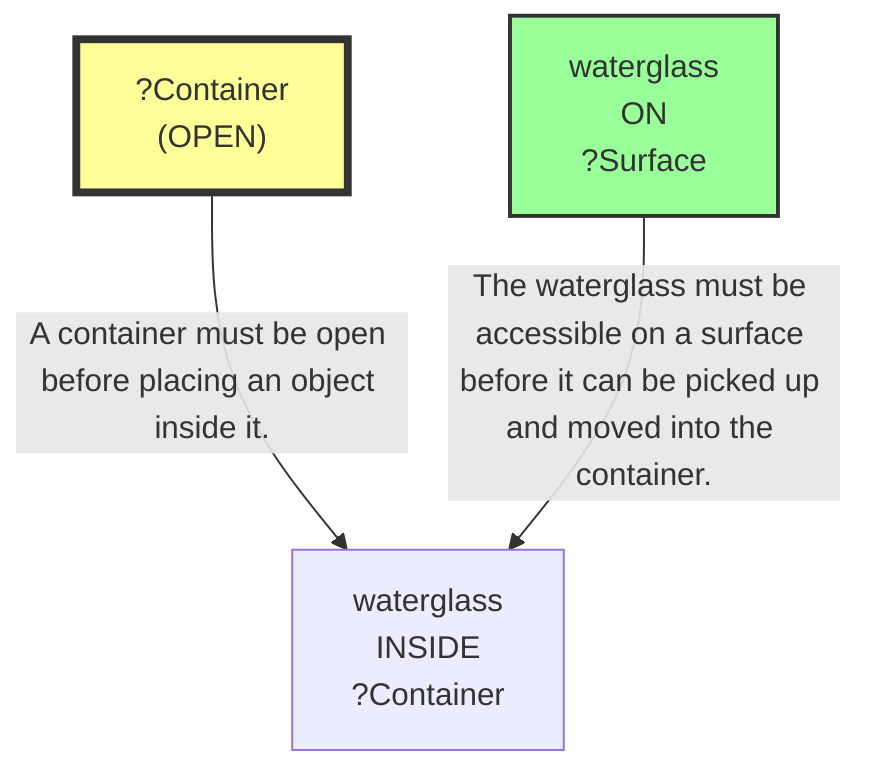
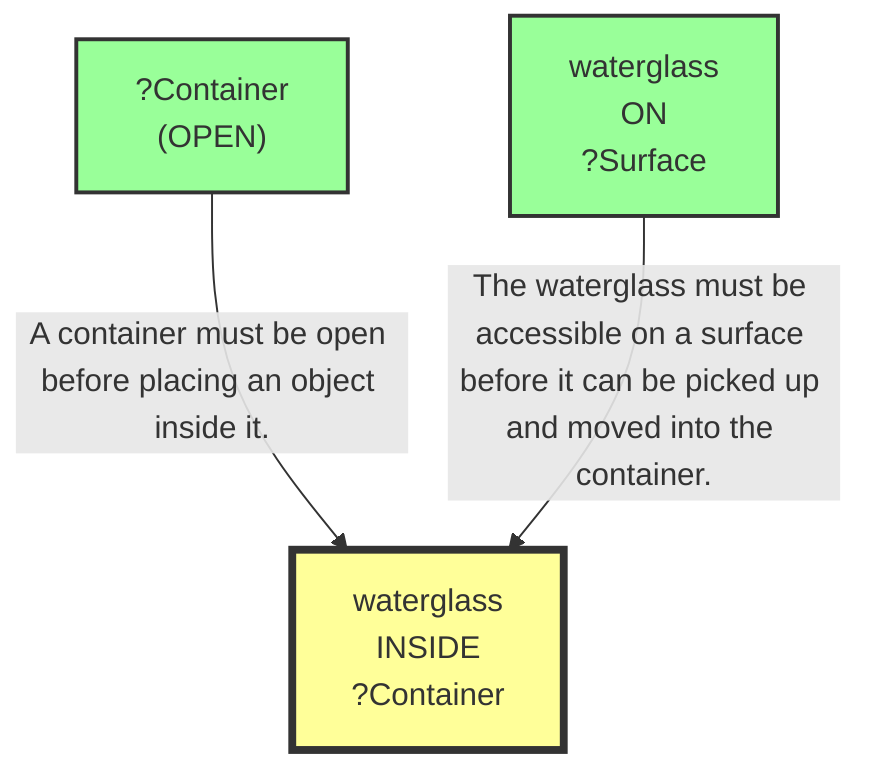
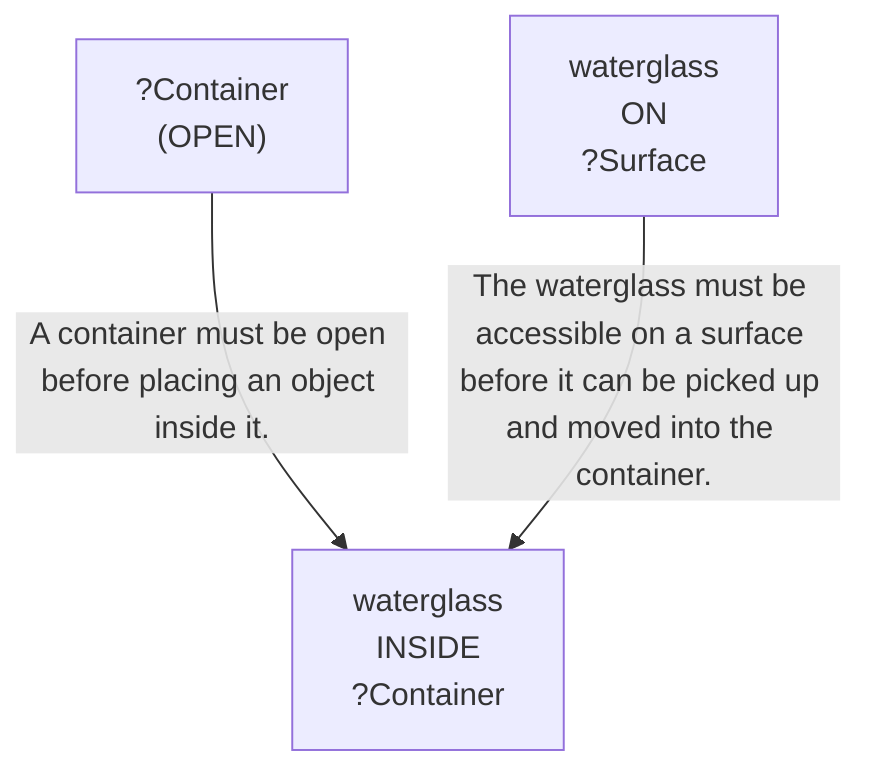

# 🚀 VirtualHome Agent Episode Log


### [GoalReasoner (Module A - Intent)] Output
```json
{
  "is_instruction_obviously_vague": false,
  "clarification_question": null,
  "target_object": "waterglass",
  "location_hint": "table",
  "reasoning_chain": [
    {
      "question": "Why does the user want this object?",
      "answer": "To move the waterglass from the table into the kitchencabinet."
    },
    {
      "question": "Why is that important?",
      "answer": "Likely to store it in an appropriate place and keep the table clear."
    },
    {
      "question": "What fundamental need does this fulfill?",
      "answer": "It helps organize household items and maintain a tidy environment."
    },
    {
      "question": "Are there any deeper psychological or physical motivations?",
      "answer": "The user may want reduced clutter, easier access to stored dishes, or a cleaner living space."
    }
  ],
  "deep_intent": "The user wants to organize and tidy a household item by storing it away properly.",
  "acceptable_alternatives_properties": [
    {
      "priority": 1,
      "description": "Other drinking glasses or similar cups that are on the table and can be stored in the cabinet."
    },
    {
      "priority": 2,
      "description": "Other small drinkware or kitchen vessels that belong in the cabinet, such as mugs or tumblers."
    },
    {
      "priority": 3,
      "description": "Other washable household items from the table that are meant to be put away in kitchen storage."
    },
    {
      "priority": 4,
      "description": "Other loose countertop items that can be safely stored to reduce clutter, if cabinet storage is intended for tidying."
    }
  ]
}
```

### [PerceptionFilter] Output
```json
{
  "reasoning": "The goal is to move the target waterglass from the table into the kitchencabinet. So the minimum required classes are the target object, the source surface/relevant table, and the destination storage container. The SDG also requires the container to be open, so the kitchencabinet must be included. No other objects are necessary.",
  "selected_classes": [
    "kitchentable",
    "waterglass",
    "cabinet",
    "mug",
    "kitchencabinet",
    "character"
  ],
  "raw_class_count": 99
}
```

### [LLMExecutor] Output
```json
{
  "reasoning": "The target waterglass is already on a surface (kitchentable(131)), so the accessible-source relation N3 is satisfied. To place it inside the kitchencabinet, the container must be open, but all available kitchencabinets are currently CLOSED and an active global rule forbids opening or putting anything inside the cabinet until step 6. Since this temporarily blocks the required precondition, the correct next atomic action is to wait for the rule to expire.",
  "satisfied_nodes": [
    "N3"
  ],
  "current_node_focus": "N2",
  "mapped_variables": {
    "?Container": "kitchencabinet(138)",
    "?Surface": "kitchentable(131)"
  },
  "action": "[wait]"
}
```
## Step 0
- **Action**: `[wait]`
- **SDG Status**:

- **Observed Items (19)**: character(1), kitchen(11), waterglass(64), kitchentable(131), kitchentable(135), kitchencabinet(138) [CLOSED], kitchencabinet(139) [CLOSED], kitchencabinet(140) [CLOSED], kitchencabinet(141) [CLOSED], kitchencabinet(142) [CLOSED], kitchencabinet(143) [CLOSED], kitchencabinet(144) [CLOSED], kitchencabinet(145) [CLOSED], livingroom(183), bedroom(241)...


### [PerceptionFilter] Output
```json
{
  "reasoning": "The goal is to move the target waterglass from the table into the kitchencabinet. So I must keep the target object, the source surface (table), and the destination storage furniture (kitchencabinet). The SDG also requires the container to be open, so the cabinet is needed as the relevant receptacle; no other tools are necessary.",
  "selected_classes": [
    "waterglass",
    "cabinet",
    "mug",
    "table",
    "kitchencabinet",
    "character"
  ],
  "raw_class_count": 99
}
```

### [LLMExecutor] Output
```json
{
  "reasoning": "The target waterglass is already known and currently inside the kitchen, but the required kitchencabinet cannot be opened or used yet because the active global rule forbids opening/putting anything inside the cabinet until step 6. The correct progress action is to wait for the temporary ban to expire. This preserves the plan toward N1 while respecting N2's blocked precondition.",
  "satisfied_nodes": [
    "N3"
  ],
  "current_node_focus": "N2",
  "mapped_variables": {
    "?Container": "kitchencabinet(138)"
  },
  "action": "[wait]"
}
```
## Step 1
- **Action**: `[wait]`
- **SDG Status**:

- **Observed Items (17)**: character(1), kitchen(11), waterglass(64), kitchencabinet(138) [CLOSED], kitchencabinet(139) [CLOSED], kitchencabinet(140) [CLOSED], kitchencabinet(141) [CLOSED], kitchencabinet(142) [CLOSED], kitchencabinet(143) [CLOSED], kitchencabinet(144) [CLOSED], kitchencabinet(145) [CLOSED], livingroom(183), bedroom(241), bathroom(285), bedroom(346)...


### [PerceptionFilter] Output
```json
{
  "reasoning": "The goal is to move the target waterglass from the table into the kitchencabinet. Minimal required classes are the target object, the source surface where it is located, and the destination storage container. Since the SDG requires the container to be open, the cabinet class is needed as the receptacle. The table class is needed to represent the source surface. No other tools are necessary.",
  "selected_classes": [
    "waterglass",
    "cabinet",
    "mug",
    "table",
    "kitchencabinet",
    "character"
  ],
  "raw_class_count": 99
}
```

### [LLMExecutor] Output
```json
{
  "reasoning": "The goal is to put the waterglass inside the kitchencabinet, but the only suitable container candidates are all kitchencabinets in the kitchen and they are currently CLOSED. However, an active global rule explicitly forbids opening the cabinet or putting anything inside it until step 6. Since that temporary ban still blocks the required precondition for N2 and therefore N1, the correct next atomic action is to wait one more step rather than attempt an impossible interaction. N3 is already satisfied because the waterglass exists in the kitchen and is accessible in the current scene.",
  "satisfied_nodes": [
    "N3"
  ],
  "current_node_focus": "N2",
  "mapped_variables": {
    "?Container": "kitchencabinet(138)",
    "?Surface": "kitchen(11)"
  },
  "action": "[wait]"
}
```
## Step 2
- **Action**: `[wait]`
- **SDG Status**:

- **Observed Items (17)**: character(1), kitchen(11), waterglass(64), kitchencabinet(138) [CLOSED], kitchencabinet(139) [CLOSED], kitchencabinet(140) [CLOSED], kitchencabinet(141) [CLOSED], kitchencabinet(142) [CLOSED], kitchencabinet(143) [CLOSED], kitchencabinet(144) [CLOSED], kitchencabinet(145) [CLOSED], livingroom(183), bedroom(241), bathroom(285), bedroom(346)...


### [PerceptionFilter] Output
```json
{
  "reasoning": "The goal is to move the target waterglass from a table into an open storage container. To accomplish this, I need the target object itself and the relevant storage receptacle implied by the intent (kitchencabinet/cabinet). The SDG also requires the container to be open, so the cabinet class is necessary as the destination and physical container.",
  "selected_classes": [
    "waterglass",
    "cabinet",
    "mug",
    "kitchencabinet",
    "character"
  ],
  "raw_class_count": 99
}
```

### [LLMExecutor] Output
```json
{
  "reasoning": "The required container for the waterglass is a kitchencabinet, but all cabinet instances in the current graph are CLOSED and the active global rule explicitly forbids opening any cabinet or putting anything inside until step 6. The prior three actions were waits for this temporary ban, and the ban is still active now, so the only valid progress action is to wait one more step. The waterglass relation needed for accessibility is already satisfied in the kitchen scene; N2 is the blocking node.",
  "satisfied_nodes": [
    "N3"
  ],
  "current_node_focus": "N2",
  "mapped_variables": {
    "?Container": "kitchencabinet(138)"
  },
  "action": "[wait]"
}
```
## Step 3
- **Action**: `[wait]`
- **SDG Status**:

- **Observed Items (17)**: character(1), kitchen(11), waterglass(64), kitchencabinet(138) [CLOSED], kitchencabinet(139) [CLOSED], kitchencabinet(140) [CLOSED], kitchencabinet(141) [CLOSED], kitchencabinet(142) [CLOSED], kitchencabinet(143) [CLOSED], kitchencabinet(144) [CLOSED], kitchencabinet(145) [CLOSED], livingroom(183), bedroom(241), bathroom(285), bedroom(346)...


### [PerceptionFilter] Output
```json
{
  "reasoning": "The goal is to move the target waterglass from the table into the kitchencabinet, so we need the target object, the table/surface it is on, and the destination cabinet. The SDG also requires the container to be open, so the kitchencabinet must be included. Because similar drinkware are acceptable alternatives for tidying/storing, include other cabinet-suitable drink vessels visible here as backups: mug and dishbowl if needed as analogous storage targets? However, only functional alternatives directly matching the target’s role should be kept, so mug is the main backup drinkware class. ",
  "selected_classes": [
    "kitchentable",
    "waterglass",
    "cabinet",
    "mug",
    "kitchencabinet",
    "character"
  ],
  "raw_class_count": 99
}
```

### [LLMExecutor] Output
```json
{
  "reasoning": "The goal is to place the waterglass into a kitchencabinet, but the active global rule still forbids opening any cabinet or putting anything inside until step 6. The SDG node N2 (container OPEN) is therefore still blocked, while N3 is already satisfied because the waterglass is on the kitchentable. Since the ban has not yet expired, the correct next atomic action remains to wait.",
  "satisfied_nodes": [
    "N3"
  ],
  "current_node_focus": "N2",
  "mapped_variables": {
    "?Container": "kitchencabinet(138)",
    "?Surface": "kitchentable(131)"
  },
  "action": "[wait]"
}
```
## Step 4
- **Action**: `[wait]`
- **SDG Status**:

- **Observed Items (19)**: character(1), kitchen(11), waterglass(64), kitchentable(131), kitchentable(135), kitchencabinet(138) [CLOSED], kitchencabinet(139) [CLOSED], kitchencabinet(140) [CLOSED], kitchencabinet(141) [CLOSED], kitchencabinet(142) [CLOSED], kitchencabinet(143) [CLOSED], kitchencabinet(144) [CLOSED], kitchencabinet(145) [CLOSED], livingroom(183), bedroom(241)...


### [PerceptionFilter] Output
```json
{
  "reasoning": "The goal is to move a waterglass from a table into a kitchen cabinet. The minimum needed classes are the target object, the likely source surface/furniture (table), and the destination storage receptacle (kitchencabinet). The SDG also requires the container to be open, but that is a state rather than an object class, so no extra class is needed beyond the cabinet itself.",
  "selected_classes": [
    "waterglass",
    "cabinet",
    "mug",
    "table",
    "kitchencabinet",
    "character"
  ],
  "raw_class_count": 99
}
```

### [LLMExecutor] Output
```json
{
  "reasoning": "The target waterglass is already accessible in the kitchen, satisfying N3. The required container is a kitchencabinet, but all cabinet instances are currently CLOSED and the active global rule forbids opening the cabinet or putting anything inside until step 6. That temporary ban still blocks N2 and therefore N1, so the only valid progress action is to wait one more step.",
  "satisfied_nodes": [
    "N3"
  ],
  "current_node_focus": "N2",
  "mapped_variables": {
    "?Container": "kitchencabinet(138)"
  },
  "action": "[wait]"
}
```
## Step 5
- **Action**: `[wait]`
- **SDG Status**:

- **Observed Items (17)**: character(1), kitchen(11), waterglass(64), kitchencabinet(138) [CLOSED], kitchencabinet(139) [CLOSED], kitchencabinet(140) [CLOSED], kitchencabinet(141) [CLOSED], kitchencabinet(142) [CLOSED], kitchencabinet(143) [CLOSED], kitchencabinet(144) [CLOSED], kitchencabinet(145) [CLOSED], livingroom(183), bedroom(241), bathroom(285), bedroom(346)...


### [PerceptionFilter] Output
```json
{
  "reasoning": "The goal is to move the target waterglass from the table into the kitchencabinet. I only need the target object, the source surface where it is located, and the destination storage container. The SDG also requires the container to be open, so the cabinet class must be kept. Alternative drinkware is not needed because the target is explicitly waterglass, and no other tools are required for this move.",
  "selected_classes": [
    "waterglass",
    "cabinet",
    "mug",
    "table",
    "kitchencabinet",
    "character"
  ],
  "raw_class_count": 99
}
```

### [LLMExecutor] Output
```json
{
  "reasoning": "The temporary ban is gone. To satisfy the SDG, the waterglass must end up inside an open container. The current graph shows waterglass(64) and several kitchencabinets, all closed. Since I cannot put into a closed container, the next atomic step is to walk to the best container candidate, a kitchen cabinet, so I can open it on the following step. The waterglass is not yet being moved; N3 is already satisfied by its presence in the kitchen, and N1 remains unsatisfied.",
  "satisfied_nodes": [
    "N3"
  ],
  "current_node_focus": "N2",
  "mapped_variables": {
    "?Container": "kitchencabinet(138)",
    "?Surface": "kitchen(11)"
  },
  "action": "[walk] <kitchencabinet> (138)"
}
```
## Step 6
- **Action**: `[walk] <kitchencabinet> (138)`
- **SDG Status**:

- **Observed Items (17)**: character(1), kitchen(11), waterglass(64), kitchencabinet(138) [CLOSED], kitchencabinet(139) [CLOSED], kitchencabinet(140) [CLOSED], kitchencabinet(141) [CLOSED], kitchencabinet(142) [CLOSED], kitchencabinet(143) [CLOSED], kitchencabinet(144) [CLOSED], kitchencabinet(145) [CLOSED], livingroom(183), bedroom(241), bathroom(285), bedroom(346)...


### [PerceptionFilter] Output
```json
{
  "reasoning": "The goal is to move the target waterglass from a table into a kitchen cabinet. The minimum needed objects are the target item itself and the destination storage container. The SDG also requires the container to be open, so the cabinet class must be kept. Since the intent explicitly mentions a kitchen cabinet, kitchencabinet is the relevant location/storage class.",
  "selected_classes": [
    "waterglass",
    "cabinet",
    "mug",
    "kitchencabinet",
    "character"
  ],
  "raw_class_count": 99
}
```

### [LLMExecutor] Output
```json
{
  "reasoning": "We are already at kitchencabinet(138) from the previous step, so the proximity requirement for opening it is satisfied. The SDG still needs the container to be OPEN before the waterglass can be put inside. The waterglass is already accessible in the kitchen, so the next missing prerequisite is to open the chosen cabinet.",
  "satisfied_nodes": [
    "N3"
  ],
  "current_node_focus": "N2",
  "mapped_variables": {
    "?Container": "kitchencabinet(138)",
    "?Surface": "kitchen(11)"
  },
  "action": "[open] kitchencabinet (138)"
}
```
## Step 7
- **Action**: `[open] <kitchencabinet> (138)`
- **SDG Status**:

- **Observed Items (17)**: character(1), kitchen(11), waterglass(64), kitchencabinet(138) [CLOSED], kitchencabinet(139) [CLOSED], kitchencabinet(140) [CLOSED], kitchencabinet(141) [CLOSED], kitchencabinet(142) [CLOSED], kitchencabinet(143) [CLOSED], kitchencabinet(144) [CLOSED], kitchencabinet(145) [CLOSED], livingroom(183), bedroom(241), bathroom(285), bedroom(346)...


### [PerceptionFilter] Output
```json
{
  "reasoning": "The target object is the waterglass, and the SDG requires it to be on a surface and moved into an open container. The goal specifically mentions the kitchencabinet, so the relevant location/receptacle is the cabinet. Since similar drinkware are acceptable backups, mug and dishbowl are retained as functional alternatives for storage in the cabinet.",
  "selected_classes": [
    "dishbowl",
    "waterglass",
    "cabinet",
    "mug",
    "kitchencabinet",
    "character"
  ],
  "raw_class_count": 99
}
```

### [LLMExecutor] Output
```json
{
  "reasoning": "The required container for the waterglass is kitchencabinet(138), and it is already OPEN, satisfying SDG node N2. The waterglass(64) is on the kitchen surface, so N3 is already satisfied and the object is accessible. The next missing step toward N1 is to grab the waterglass so it can later be put inside the open cabinet.",
  "satisfied_nodes": [
    "N2",
    "N3"
  ],
  "current_node_focus": "N1",
  "mapped_variables": {
    "?Container": "kitchencabinet(138)",
    "?Surface": "kitchen(11)"
  },
  "action": "[grab] <waterglass> (64)"
}
```
## Step 8
- **Action**: `[grab] <waterglass> (64)`
- **SDG Status**:

- **Observed Items (25)**: character(1), kitchen(11), waterglass(64), dishbowl(115), dishbowl(116), dishbowl(117), dishbowl(118), dishbowl(119), kitchencabinet(138) [OPEN], kitchencabinet(139) [CLOSED], kitchencabinet(140) [CLOSED], kitchencabinet(141) [CLOSED], kitchencabinet(142) [CLOSED], kitchencabinet(143) [CLOSED], kitchencabinet(144) [CLOSED]...


### [PerceptionFilter] Output
```json
{
  "reasoning": "The goal is to move the target waterglass from the table into the kitchencabinet, so we need the target object, the likely source surface, and the destination storage container. Because the SDG requires the container to be open before placing the item inside, the cabinet class must be included as the relevant receptacle. Alternative drinkware that could also satisfy the storing task should be retained as backups.",
  "selected_classes": [
    "dishbowl",
    "waterglass",
    "cabinet",
    "mug",
    "table",
    "kitchencabinet",
    "character"
  ],
  "raw_class_count": 99
}
```

### [LLMExecutor] Output
```json
{
  "reasoning": "The target waterglass(64) is already held in the right hand, and the chosen container kitchencabinet(138) is already OPEN, so the remaining unsatisfied SDG node is N1: put the waterglass inside the open cabinet. Because putin requires holding the object and being near the container, and we are already at the cabinet from the previous walk and the cabinet is open, the next atomic action should complete the placement.",
  "satisfied_nodes": [
    "N2",
    "N3"
  ],
  "current_node_focus": "N1",
  "mapped_variables": {
    "?Container": "kitchencabinet(138)",
    "?Surface": "kitchentable(131)"
  },
  "action": "[putin] <waterglass> (64) <kitchencabinet> (138)"
}
```
## Step 9
- **Action**: `[putin] <waterglass> (64) <kitchencabinet> (138)`
- **SDG Status**:

- **Observed Items (25)**: character(1), kitchen(11), waterglass(64), dishbowl(115), dishbowl(116), dishbowl(117), dishbowl(118), dishbowl(119), kitchencabinet(138) [OPEN], kitchencabinet(139) [CLOSED], kitchencabinet(140) [CLOSED], kitchencabinet(141) [CLOSED], kitchencabinet(142) [CLOSED], kitchencabinet(143) [CLOSED], kitchencabinet(144) [CLOSED]...


### [PerceptionFilter] Output
```json
{
  "reasoning": "The goal is to move the target waterglass from the table into the kitchencabinet, so we must keep the target object, the source surface, and the destination storage container. The SDG also requires the container to be open, so the cabinet must be included. No other objects are necessary.",
  "selected_classes": [
    "waterglass",
    "cabinet",
    "mug",
    "table",
    "kitchencabinet",
    "character"
  ],
  "raw_class_count": 99
}
```
## Step 10
- **Action**: `FINISH (Goal Reached)`
- **SDG Status**:

- **Observed Items (17)**: character(1), kitchen(11), waterglass(64), kitchencabinet(138) [OPEN], kitchencabinet(139) [CLOSED], kitchencabinet(140) [CLOSED], kitchencabinet(141) [CLOSED], kitchencabinet(142) [CLOSED], kitchencabinet(143) [CLOSED], kitchencabinet(144) [CLOSED], kitchencabinet(145) [CLOSED], livingroom(183), bedroom(241), bathroom(285), bedroom(346)...

