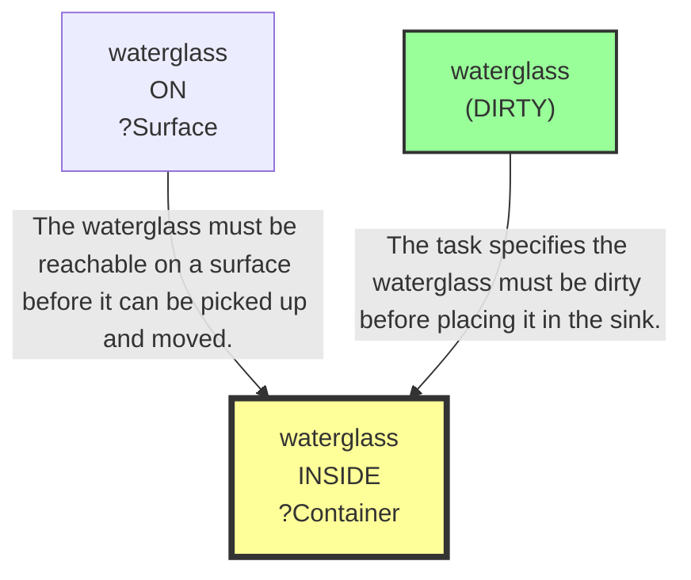
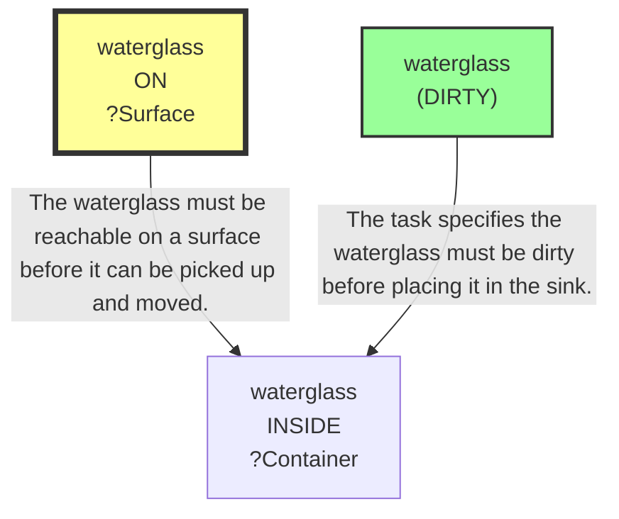
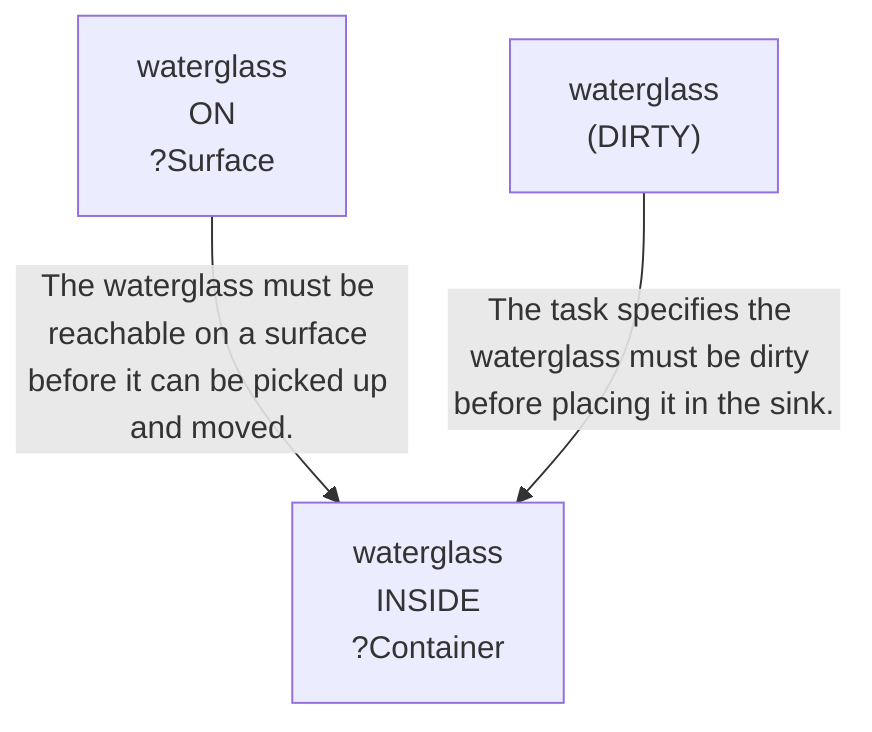

# 🚀 VirtualHome Agent Episode Log


### [GoalReasoner (Module A - Intent)] Output
```json
{
  "is_instruction_obviously_vague": false,
  "clarification_question": null,
  "target_object": "waterglass",
  "location_hint": "table",
  "reasoning_chain": [
    {
      "question": "Why does the user want this object?",
      "answer": "To remove the dirty glass from the table and place it in the sink."
    },
    {
      "question": "Why is that important?",
      "answer": "To clear the table and move the dirty item to a more appropriate place for washing."
    },
    {
      "question": "What fundamental need does this fulfill?",
      "answer": "To maintain a clean, organized indoor surface and manage dirty dishware."
    },
    {
      "question": "Are there any deeper psychological or physical motivations?",
      "answer": "Yes: reducing clutter, improving hygiene, and preparing the item for cleaning."
    }
  ],
  "deep_intent": "The user wants to reduce clutter and manage dirty dishware by moving it to a cleaning location.",
  "acceptable_alternatives_properties": [
    {
      "priority": 1,
      "description": "Other dirty drinkware or small used dishes on the table that can be moved to the sink."
    },
    {
      "priority": 2,
      "description": "Any dirty tableware items that belong in the sink for washing, such as cups or small bowls."
    },
    {
      "priority": 3,
      "description": "Other used kitchen items that are appropriately cleared from the table and placed with dishes to be cleaned."
    },
    {
      "priority": 4,
      "description": "If no drinkware is present, other clutter items on the table that can be tidied away to improve surface organization."
    }
  ]
}
```

### [PerceptionFilter] Output
```json
{
  "reasoning": "The goal is to move the dirty waterglass from the table to a cleaning location. I need the target object class (waterglass), the table/surface it is on for reachability, and the sink as the destination for washing. No other objects are strictly necessary.",
  "selected_classes": [
    "table",
    "sink",
    "waterglass",
    "character",
    "door"
  ],
  "raw_class_count": 99
}
```

### [LLMExecutor] Output
```json
{
  "reasoning": "The target waterglass is already DIRTY, satisfying N2. It is located INSIDE the kitchen, so N3 is not yet satisfied because we have not moved it to the sink. However, the active global rule forbids touching or moving utensils until step 6, and the waterglass is a utensil/drinkware item. Therefore I must wait for the temporary restriction to expire before I can walk/grab it or place it in the sink.",
  "satisfied_nodes": [
    "N2"
  ],
  "current_node_focus": "N3",
  "mapped_variables": {
    "?Container": "sink(155)"
  },
  "action": "[wait]"
}
```
## Step 0
- **Action**: `[wait]`
- **SDG Status**:

- **Observed Items (12)**: character(1), kitchen(11), door(47) [OPEN], waterglass(64) [DIRTY], sink(155), livingroom(183), bedroom(241), door(254) [OPEN], bathroom(285), door(305) [OPEN], sink(326), bedroom(346)


### [PerceptionFilter] Output
```json
{
  "reasoning": "The goal is to move the dirty waterglass from the table to the cleaning location. The minimum needed is the target object itself, the table/surface it is on, and the sink as the destination receptacle for dirty dishware. Since the SDG requires the waterglass to be inside a container after being on a surface, the sink is necessary as that container/location.",
  "selected_classes": [
    "table",
    "sink",
    "waterglass",
    "character",
    "door"
  ],
  "raw_class_count": 99
}
```

### [LLMExecutor] Output
```json
{
  "reasoning": "The required waterglass is already DIRTY (N2 satisfied), but it is a utensil/drinkware item and the active global rule temporarily forbids touching or moving utensils until step 6. Since the restriction still blocks the necessary grab/walk/putback sequence, the correct next action is to wait for the rule to expire.",
  "satisfied_nodes": [
    "N2"
  ],
  "current_node_focus": "N3",
  "mapped_variables": {
    "?Surface": "kitchen(11)",
    "?Container": "sink(155)"
  },
  "action": "[wait]"
}
```
## Step 1
- **Action**: `[wait]`
- **SDG Status**:

- **Observed Items (12)**: character(1), kitchen(11), door(47) [OPEN], waterglass(64) [DIRTY], sink(155), livingroom(183), bedroom(241), door(254) [OPEN], bathroom(285), door(305) [OPEN], sink(326), bedroom(346)


### [PerceptionFilter] Output
```json
{
  "reasoning": "The goal is to move a dirty waterglass from the table to the sink for washing. So the minimum needed classes are the target object itself, the source surface where it is located, and the destination cleaning receptacle. No other objects are necessary.",
  "selected_classes": [
    "table",
    "sink",
    "waterglass",
    "character",
    "door"
  ],
  "raw_class_count": 99
}
```

### [LLMExecutor] Output
```json
{
  "reasoning": "The target waterglass is already DIRTY, so N2 is satisfied. The active global rule temporarily forbids touching or moving utensils until step 6, and the waterglass is a utensil/drinkware item, so I still cannot walk to or grab it yet. The correct progression is to wait for the restriction to expire.",
  "satisfied_nodes": [
    "N2"
  ],
  "current_node_focus": "N1",
  "mapped_variables": {
    "?Surface": "kitchen(11)",
    "?Container": "sink(155)"
  },
  "action": "[wait]"
}
```
## Step 2
- **Action**: `[wait]`
- **SDG Status**:

- **Observed Items (12)**: character(1), kitchen(11), door(47) [OPEN], waterglass(64) [DIRTY], sink(155), livingroom(183), bedroom(241), door(254) [OPEN], bathroom(285), door(305) [OPEN], sink(326), bedroom(346)


### [PerceptionFilter] Output
```json
{
  "reasoning": "The goal is to move a dirty waterglass from the table to a cleaning location. The minimum needed objects are the target item itself, the table/surface it is on for reachability, and the sink as the destination for washing/clearing. The SDG also requires the waterglass to be dirty and inside a container, which the sink can satisfy as the cleaning receptacle.",
  "selected_classes": [
    "table",
    "sink",
    "waterglass",
    "character",
    "door"
  ],
  "raw_class_count": 99
}
```

### [LLMExecutor] Output
```json
{
  "reasoning": "The target waterglass is already DIRTY, so N2 is satisfied. However, the active global rule temporarily forbids touching or moving utensils, and the waterglass is a drinkware utensil-like object. Since the restriction is still active until step 6, I cannot legally walk to, grab, or move it yet. The correct progression is to wait for the temporary ban to expire.",
  "satisfied_nodes": [
    "N2"
  ],
  "current_node_focus": "N1",
  "mapped_variables": {
    "?Surface": "table",
    "?Container": "sink(155)"
  },
  "action": "[wait]"
}
```
## Step 3
- **Action**: `[wait]`
- **SDG Status**:

- **Observed Items (12)**: character(1), kitchen(11), door(47) [OPEN], waterglass(64) [DIRTY], sink(155), livingroom(183), bedroom(241), door(254) [OPEN], bathroom(285), door(305) [OPEN], sink(326), bedroom(346)


### [PerceptionFilter] Output
```json
{
  "reasoning": "The goal requires the dirty target drinkware and the place it should be moved to for washing. The SDG says the waterglass is on a surface, dirty, and needs to be inside a container. The needed physical location/receptacle for this task is the sink. No other tools are required to complete the movement task.",
  "selected_classes": [
    "sink",
    "character",
    "door",
    "waterglass"
  ],
  "raw_class_count": 99
}
```

### [LLMExecutor] Output
```json
{
  "reasoning": "The goal waterglass(64) is already DIRTY, so N2 is satisfied. The remaining unmet requirements are to move it from its current location toward the sink: N1 says it is ON a surface, but the filtered graph only shows it INSIDE the kitchen and the active global rule explicitly forbids touching or moving utensils until step 6. Because the restriction is still in effect, I cannot walk to or grab the waterglass yet. The correct next atomic action is to wait until the temporary ban expires.",
  "satisfied_nodes": [
    "N2"
  ],
  "current_node_focus": "N3",
  "mapped_variables": {
    "?Surface": "unknown surface in kitchen",
    "?Container": "sink(155)"
  },
  "action": "[wait]"
}
```
## Step 4
- **Action**: `[wait]`
- **SDG Status**:

- **Observed Items (12)**: character(1), kitchen(11), door(47) [OPEN], waterglass(64) [DIRTY], sink(155), livingroom(183), bedroom(241), door(254) [OPEN], bathroom(285), door(305) [OPEN], sink(326), bedroom(346)


### [PerceptionFilter] Output
```json
{
  "reasoning": "The goal is to move the dirty waterglass from the table to a cleaning location. We need the target object waterglass, the likely surface it is on (table), and the sink as the destination/cleaning location. To satisfy backup tool retention for washing-related capability, include dishwasher as an alternative cleaning appliance. A kitchen counter/table surface is relevant only insofar as the target is on a table; among visible locations, table and sink are necessary.",
  "selected_classes": [
    "table",
    "sink",
    "waterglass",
    "dishwasher",
    "character",
    "door"
  ],
  "raw_class_count": 99
}
```

### [LLMExecutor] Output
```json
{
  "reasoning": "The target waterglass(64) is already DIRTY, so N2 is satisfied. The remaining task is to move it from its current location inside the kitchen to the sink, but the active global rule still forbids touching or moving utensils until step 6. Since the restriction remains active and the previous action was also wait, the only valid progress action is to continue waiting until the ban expires.",
  "satisfied_nodes": [
    "N2"
  ],
  "current_node_focus": "N3",
  "mapped_variables": {
    "?Surface": "kitchen(11)",
    "?Container": "sink(155)"
  },
  "action": "[wait]"
}
```
## Step 5
- **Action**: `[wait]`
- **SDG Status**:

- **Observed Items (13)**: character(1), kitchen(11), door(47) [OPEN], waterglass(64) [DIRTY], sink(155), dishwasher(165) [CLOSED,OFF], livingroom(183), bedroom(241), door(254) [OPEN], bathroom(285), door(305) [OPEN], sink(326), bedroom(346)


### [PerceptionFilter] Output
```json
{
  "reasoning": "The goal is to move a dirty waterglass from the table to the sink. The minimum needed classes are the target object itself, the surface it is on (table), and the cleaning location (sink).",
  "selected_classes": [
    "table",
    "sink",
    "waterglass",
    "character",
    "door"
  ],
  "raw_class_count": 99
}
```

### [LLMExecutor] Output
```json
{
  "reasoning": "The utensil ban is no longer active, so I can proceed. The waterglass is already DIRTY, satisfying N2. It is currently inside the kitchen, but to move it to the sink I first need to be near it before I can grab it. The next atomic step is to walk to the waterglass.",
  "satisfied_nodes": [
    "N2"
  ],
  "current_node_focus": "N1",
  "mapped_variables": {
    "?Surface": "kitchen(11)"
  },
  "action": "[walk] waterglass (64)"
}
```
## Step 6
- **Action**: `[walk] <waterglass> (64)`
- **SDG Status**:

- **Observed Items (12)**: character(1), kitchen(11), door(47) [OPEN], waterglass(64) [DIRTY], sink(155), livingroom(183), bedroom(241), door(254) [OPEN], bathroom(285), door(305) [OPEN], sink(326), bedroom(346)


### [PerceptionFilter] Output
```json
{
  "reasoning": "The goal is to move a dirty waterglass from the table to a cleaning location. I only need the target object, the table/surface it is on, and the sink as the destination for washing. No other objects are necessary for this task.",
  "selected_classes": [
    "table",
    "sink",
    "waterglass",
    "character",
    "door"
  ],
  "raw_class_count": 99
}
```

### [LLMExecutor] Output
```json
{
  "reasoning": "The waterglass(64) is already DIRTY, so SDG node N2 is satisfied. I have just walked to the waterglass, and it is now CLOSE to the character, so the next required step toward placing it in the sink is to grab it. This progresses toward satisfying the INSIDE relation in N3 by enabling transport to the sink. The sink candidate in the graph is sink(155) in the kitchen, but that will only matter after picking up the glass.",
  "satisfied_nodes": [
    "N2"
  ],
  "current_node_focus": "N3",
  "mapped_variables": {
    "?Container": "sink(155)",
    "?Surface": "kitchen(11)"
  },
  "action": "[grab] <waterglass> (64)"
}
```
## Step 7
- **Action**: `[grab] <waterglass> (64)`
- **SDG Status**:

- **Observed Items (12)**: character(1), kitchen(11), door(47) [OPEN], waterglass(64) [DIRTY], sink(155), livingroom(183), bedroom(241), door(254) [OPEN], bathroom(285), door(305) [OPEN], sink(326), bedroom(346)


### [PerceptionFilter] Output
```json
{
  "reasoning": "Needed objects are the target dirty waterglass, the table surface it is on, and the sink as the cleaning/receptacle location. No additional tools are required for simply moving the glass from the table to the sink.",
  "selected_classes": [
    "table",
    "sink",
    "waterglass",
    "character",
    "door"
  ],
  "raw_class_count": 99
}
```

### [LLMExecutor] Output
```json
{
  "reasoning": "The waterglass(64) is already dirty, so N2 is satisfied. I am currently holding it in my right hand and am inside the kitchen, while the sink(155) is the best matching target container/surface for placing it. Since putback requires being near the surface, but I am already in the kitchen and holding the glass, the next progress step toward satisfying N3 is to move it onto the sink. However, because the system requires explicit proximity before putback and I have not walked to the sink yet, the correct next atomic action is to walk to the sink.",
  "satisfied_nodes": [
    "N2"
  ],
  "current_node_focus": "N1",
  "mapped_variables": {
    "?Surface": "sink(155)",
    "?Container": "sink(155)"
  },
  "action": "[walk] <sink> (155)"
}
```
## Step 8
- **Action**: `[walk] <sink> (155)`
- **SDG Status**:

- **Observed Items (12)**: character(1), kitchen(11), door(47) [OPEN], waterglass(64) [DIRTY], sink(155), livingroom(183), bedroom(241), door(254) [OPEN], bathroom(285), door(305) [OPEN], sink(326), bedroom(346)


### [PerceptionFilter] Output
```json
{
  "reasoning": "Needed classes are the target dirty waterglass, the table it is on, and the sink as the cleaning location. I also keep alternative nearby dishware that could satisfy the same dirty-drinkware/dish-clearing intent if needed, namely mug, dishbowl, and plate. The sink is the key receptacle for placing the dirty item for washing.",
  "selected_classes": [
    "table",
    "sink",
    "dishbowl",
    "mug",
    "waterglass",
    "plate",
    "character",
    "door"
  ],
  "raw_class_count": 99
}
```

### [LLMExecutor] Output
```json
{
  "reasoning": "The waterglass(64) is already DIRTY, so SDG node N2 is satisfied. I have already walked to the sink(155) in the previous step, and the character is CLOSE to it while holding the waterglass in the right hand. The remaining unmet SDG relation is N3: place the waterglass INSIDE the sink. Since the sink is a flat recipient/surface in this engine and is already nearby, the correct next atomic action is to put the held waterglass back onto the sink.",
  "satisfied_nodes": [
    "N2"
  ],
  "current_node_focus": "N3",
  "mapped_variables": {
    "?Container": "sink(155)"
  },
  "action": "[putback] <waterglass> (64) <sink> (155)"
}
```
## Step 9
- **Action**: `[putback] <waterglass> (64) <sink> (155)`
- **SDG Status**:

- **Observed Items (35)**: character(1), kitchen(11), door(47) [OPEN], waterglass(64) [DIRTY], plate(67), plate(68), plate(75), plate(76), plate(83), plate(84), plate(91), plate(103), plate(104), dishbowl(115), dishbowl(116)...


### [PerceptionFilter] Output
```json
{
  "reasoning": "The goal is to move a dirty waterglass from the table to the sink for washing. We need the target object (waterglass), the likely source surface implied by the goal (table / kitchentable), and the cleaning destination (sink). To preserve functional backups for washing/cleanup, dishwasher is also relevant as an alternative cleaning appliance if needed.",
  "selected_classes": [
    "sink",
    "waterglass",
    "dishwasher",
    "character",
    "door",
    "kitchentable"
  ],
  "raw_class_count": 99
}
```
## Step 10
- **Action**: `FINISH (Goal Reached)`
- **SDG Status**:

- **Observed Items (15)**: character(1), kitchen(11), door(47) [OPEN], waterglass(64) [DIRTY], kitchentable(131), kitchentable(135), sink(155), dishwasher(165) [CLOSED,OFF], livingroom(183), bedroom(241), door(254) [OPEN], bathroom(285), door(305) [OPEN], sink(326), bedroom(346)

