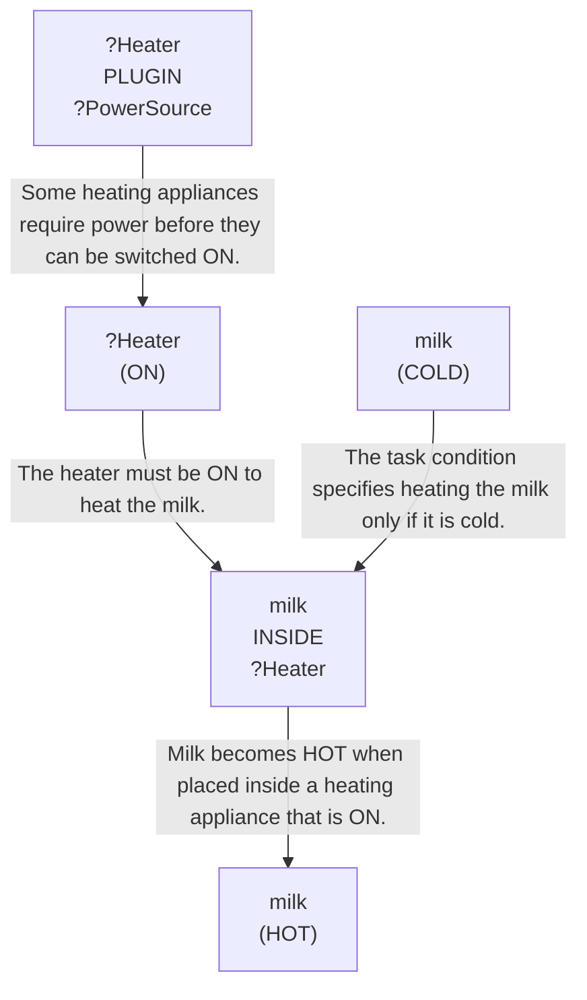

# 🚀 VirtualHome Agent Episode Log


### [GoalReasoner (Module A - Intent)] Output
```json
{
  "is_instruction_obviously_vague": false,
  "clarification_question": null,
  "target_object": "milk",
  "location_hint": null,
  "reasoning_chain": [
    {
      "question": "Why does the user want this object?",
      "answer": "To use the milk as part of a desired drinking or preparation condition."
    },
    {
      "question": "Why is that important?",
      "answer": "Because the milk is currently cold, and the user wants it warmed to a preferred temperature."
    },
    {
      "question": "What fundamental need does this fulfill?",
      "answer": "The need to have a beverage or ingredient at a suitable warm temperature."
    },
    {
      "question": "Are there any deeper psychological or physical motivations?",
      "answer": "Physical comfort, convenience, or readiness for consumption/preparation."
    }
  ],
  "deep_intent": "The user wants a cold liquid food item warmed to a suitable drinking or use temperature.",
  "acceptable_alternatives_properties": [
    {
      "priority": 1,
      "description": "Other cold drinkable dairy or non-dairy beverages that can be warmed, such as hot chocolate, cocoa, or plant-based milk."
    },
    {
      "priority": 2,
      "description": "Other refrigerated beverages intended to be served warm, such as coffee or tea."
    },
    {
      "priority": 3,
      "description": "Warmable liquid foods or drink mixes that provide the same comforting warm-drink function."
    },
    {
      "priority": 4,
      "description": "Other warm beverages that can satisfy the need for a warm drink, even if they are not milk-based."
    }
  ]
}
```

### [PerceptionFilter] Output
```json
{
  "reasoning": "The goal is to heat cold milk to a hot drinking/use temperature. Required objects are the target milk plus a heating appliance that can warm it, and a power source if the heater needs one. Since the SDG only says ?Heater and ?PowerSource, I should retain all plausible heater options present (microwave, stove, coffeemaker, toaster-oven-like heating is not present) and the matching power source. Milk itself must be kept.",
  "selected_classes": [
    "microwave",
    "milk",
    "powersocket",
    "coffeemaker",
    "character",
    "stove"
  ],
  "raw_class_count": 99
}
```
## Step 0
- **Action**: `FINISH (Goal Reached)`
- **SDG Status**:

- **Observed Items (13)**: character(1), kitchen(11), powersocket(57), stove(163) [OFF,CLOSED], coffeemaker(169) [OFF], microwave(171) [CLOSED,OFF], milk(176) [CLOSED,COLD], livingroom(183), powersocket(240), bedroom(241), powersocket(279), bathroom(285), bedroom(346)

