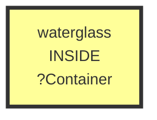
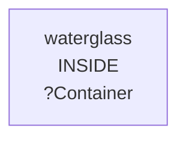

# 🚀 VirtualHome Agent Episode Log


### [GoalReasoner (Module A - Intent)] Output
```json
{
  "is_instruction_obviously_vague": false,
  "clarification_question": null,
  "target_object": "waterglass",
  "location_hint": "dishwasher",
  "reasoning_chain": [
    {
      "question": "Why does the user want this object?",
      "answer": "To have the used glass placed into the dishwasher."
    },
    {
      "question": "Why is that important?",
      "answer": "So the used glass is moved to the proper cleaning location."
    },
    {
      "question": "What fundamental need does this fulfill?",
      "answer": "It helps clean up after use and keep the space tidy."
    },
    {
      "question": "Are there any deeper psychological or physical motivations?",
      "answer": "The user likely wants to reduce clutter and prepare the item for washing."
    }
  ],
  "deep_intent": "The user wants to clean up after using a drinking vessel and prepare it for washing.",
  "acceptable_alternatives_properties": [
    {
      "priority": 1,
      "description": "Another used drinking vessel that can go in the dishwasher, such as a cup or mug"
    },
    {
      "priority": 2,
      "description": "Other dishwasher-safe used drinkware that serves the same cleaning purpose"
    },
    {
      "priority": 3,
      "description": "Other small used kitchen items that belong with dishes to be washed, if the exact item is unavailable"
    },
    {
      "priority": 4,
      "description": "A nearby used container that needs to be collected for cleaning, such as a bowl or plate"
    }
  ]
}
```

### [PerceptionFilter] Output
```json
{
  "reasoning": "The goal is to place a used waterglass into the dishwasher for cleaning. The minimum needed is the target object itself and the destination appliance. No extra tools or alternative receptacles are required beyond possible functional backups for washing, but since the task is specifically about a dishwasher and no alternative washing appliance is needed for the current state, only the exact target and dishwasher are kept.",
  "selected_classes": [
    "character",
    "mug",
    "dishwasher",
    "waterglass",
    "plate"
  ],
  "raw_class_count": 99
}
```

### [LLMExecutor] Output
```json
{
  "reasoning": "The SDG requires the target waterglass to be INSIDE some container. The best match for the user's intent and location hint is the dishwasher. The dishwasher is currently CLOSED, so it must be opened before the glass can be placed inside. I am not yet holding the target glass, and proximity to the dishwasher is required before opening it.",
  "satisfied_nodes": [],
  "current_node_focus": "N1",
  "mapped_variables": {
    "?Container": "dishwasher(165)"
  },
  "action": "[walk] <dishwasher> (165)"
}
```
## Step 0
- **Action**: `[walk] <dishwasher> (165)`
- **SDG Status**:

- **Observed Items (25)**: character(1), kitchen(11), waterglass(64) [EMPTY,DIRTY], plate(67), plate(68), waterglass(71) [EMPTY,CLEAN], waterglass(72) [DIRTY,FILLED_MILK], plate(75), plate(76), plate(83), plate(84), plate(91), plate(103), plate(104), dishwasher(165) [CLOSED,OFF]...


### [PerceptionFilter] Output
```json
{
  "reasoning": "The goal is to place a used waterglass into the dishwasher for cleaning. The required target is the waterglass itself, and the location/receptacle needed is the dishwasher. No additional tools are required for simply selecting the relevant objects.",
  "selected_classes": [
    "character",
    "mug",
    "dishwasher",
    "waterglass",
    "plate"
  ],
  "raw_class_count": 99
}
```

### [LLMExecutor] Output
```json
{
  "reasoning": "The goal is to place the target waterglass inside the dishwasher. We are already next to the dishwasher from the previous step, and it is currently CLOSED. Because the dishwasher is a container with CAN_OPEN, the next required atomic step is to open it before we can put the glass inside. The target waterglass(64) is dirty but that does not block placement into the dishwasher.",
  "satisfied_nodes": [],
  "current_node_focus": "N1",
  "mapped_variables": {
    "?Container": "dishwasher(165)"
  },
  "action": "[open] <dishwasher> (165)"
}
```
## Step 1
- **Action**: `[open] <dishwasher> (165)`
- **SDG Status**:

- **Observed Items (25)**: character(1), kitchen(11), waterglass(64) [EMPTY,DIRTY], plate(67), plate(68), waterglass(71) [EMPTY,CLEAN], waterglass(72) [DIRTY,FILLED_MILK], plate(75), plate(76), plate(83), plate(84), plate(91), plate(103), plate(104), dishwasher(165) [CLOSED,OFF]...


### [PerceptionFilter] Output
```json
{
  "reasoning": "The goal is to clean up a used waterglass by placing it with items that go to the dishwasher. The target object class must be kept, and the dishwasher is the relevant location/receptacle for washing. A mug is also retained as an acceptable alternative drinkware item that could fulfill the same cleanup purpose if needed.",
  "selected_classes": [
    "character",
    "mug",
    "dishwasher",
    "waterglass",
    "plate"
  ],
  "raw_class_count": 99
}
```

### [LLMExecutor] Output
```json
{
  "reasoning": "The dishwasher is already open and the target waterglass(64) is visible in the kitchen but not yet inside any container. To satisfy N1, the next step should be to move the glass into the dishwasher. The glass is not currently held, so I must first approach it before I can grab it; since the instruction explicitly says not to repeat a walk action if I just did it, the last movement was to the dishwasher, but the current graph does not show me near the glass. However, because the goal is to place the waterglass inside the dishwasher and the glass is in the same room, the immediate progress step is to walk to the waterglass so it can then be grabbed and placed in a subsequent action.",
  "satisfied_nodes": [],
  "current_node_focus": "N1",
  "mapped_variables": {
    "?Container": "dishwasher(165)"
  },
  "action": "[walk] <waterglass> (64)"
}
```
## Step 2
- **Action**: `[walk] <waterglass> (64)`
- **SDG Status**:

- **Observed Items (25)**: character(1), kitchen(11), waterglass(64) [EMPTY,DIRTY], plate(67), plate(68), waterglass(71) [EMPTY,CLEAN], waterglass(72) [DIRTY,FILLED_MILK], plate(75), plate(76), plate(83), plate(84), plate(91), plate(103), plate(104), dishwasher(165) [OPEN,OFF]...


### [PerceptionFilter] Output
```json
{
  "reasoning": "The goal is to move the used waterglass to the dishwasher for cleaning. I must keep the target object itself and the destination appliance needed for the task. No extra tools or unrelated furniture are required.",
  "selected_classes": [
    "character",
    "mug",
    "dishwasher",
    "waterglass",
    "plate"
  ],
  "raw_class_count": 99
}
```

### [LLMExecutor] Output
```json
{
  "reasoning": "The target waterglass(64) is the intended object and it is currently close to the character, but it is not yet inside the dishwasher. The dishwasher(165) is already open, so the remaining progress is to pick up the glass and place it into the dishwasher. Since the last successful action was walking to the glass, I should not repeat that walk. The next atomic step is to grab the waterglass.",
  "satisfied_nodes": [],
  "current_node_focus": "N1",
  "mapped_variables": {
    "?Container": "dishwasher(165)"
  },
  "action": "[grab] <waterglass> (64)"
}
```
## Step 3
- **Action**: `[grab] <waterglass> (64)`
- **SDG Status**:

- **Observed Items (25)**: character(1), kitchen(11), waterglass(64) [EMPTY,DIRTY], plate(67), plate(68), waterglass(71) [EMPTY,CLEAN], waterglass(72) [DIRTY,FILLED_MILK], plate(75), plate(76), plate(83), plate(84), plate(91), plate(103), plate(104), dishwasher(165) [OPEN,OFF]...


### [PerceptionFilter] Output
```json
{
  "reasoning": "The goal is to move a used waterglass to the dishwasher for cleaning. We must keep the target item and the relevant cleaning location/appliance. Since the SDG indicates the waterglass is inside some container, we also keep the waterglass itself and the dishwasher as the needed destination. A mug is a functional alternative drinkware class that could also be relevant as a backup if the exact glass is unavailable, but no other objects are necessary.",
  "selected_classes": [
    "character",
    "mug",
    "dishwasher",
    "waterglass",
    "plate"
  ],
  "raw_class_count": 99
}
```

### [LLMExecutor] Output
```json
{
  "reasoning": "The target waterglass(64) is already in hand, and the dishwasher(165) is open. The remaining gap for SDG node N1 is to place the waterglass inside the dishwasher. Because putting into a container requires being near the destination first, and we have not yet walked to the dishwasher in the current action chain immediately before this step, the next atomic action should be to walk to the dishwasher before attempting insertion on the following step.",
  "satisfied_nodes": [],
  "current_node_focus": "N1",
  "mapped_variables": {
    "?Container": "dishwasher(165)"
  },
  "action": "[walk] <dishwasher> (165)"
}
```
## Step 4
- **Action**: `[walk] <dishwasher> (165)`
- **SDG Status**:

- **Observed Items (25)**: character(1), kitchen(11), waterglass(64) [EMPTY,DIRTY], plate(67), plate(68), waterglass(71) [EMPTY,CLEAN], waterglass(72) [DIRTY,FILLED_MILK], plate(75), plate(76), plate(83), plate(84), plate(91), plate(103), plate(104), dishwasher(165) [OPEN,OFF]...


### [PerceptionFilter] Output
```json
{
  "reasoning": "Need the target drinkware class and the location/furniture where it should be placed for cleaning. Because the goal is to move a used waterglass into the dishwasher, keep the exact target object and the dishwasher. The SDG indicates the waterglass is inside some container, so no extra unrelated objects are needed.",
  "selected_classes": [
    "character",
    "mug",
    "dishwasher",
    "waterglass",
    "plate"
  ],
  "raw_class_count": 99
}
```

### [LLMExecutor] Output
```json
{
  "reasoning": "The target waterglass(64) is already in hand and the dishwasher(165) is open and close to the character. SDG node N1 requires the waterglass to be INSIDE some container, and the dishwasher is the best binding for ?Container. The next atomic step to make progress is to place the held glass into the dishwasher.",
  "satisfied_nodes": [],
  "current_node_focus": "N1",
  "mapped_variables": {
    "?Container": "dishwasher(165)"
  },
  "action": "[putin] <waterglass> (64) <dishwasher> (165)"
}
```
## Step 5
- **Action**: `[putin] <waterglass> (64) <dishwasher> (165)`
- **SDG Status**:

- **Observed Items (25)**: character(1), kitchen(11), waterglass(64) [EMPTY,DIRTY], plate(67), plate(68), waterglass(71) [EMPTY,CLEAN], waterglass(72) [DIRTY,FILLED_MILK], plate(75), plate(76), plate(83), plate(84), plate(91), plate(103), plate(104), dishwasher(165) [OPEN,OFF]...


### [PerceptionFilter] Output
```json
{
  "reasoning": "The goal is to move the target item, a waterglass, into the dishwasher for cleaning. Per the SDG, the target waterglass and the destination dishwasher are both required. No extra tools are needed for this simple placement task, and alternatives are not necessary unless the exact target were missing.",
  "selected_classes": [
    "character",
    "mug",
    "dishwasher",
    "waterglass",
    "plate"
  ],
  "raw_class_count": 99
}
```
## Step 6
- **Action**: `FINISH (Goal Reached)`
- **SDG Status**:

- **Observed Items (25)**: character(1), kitchen(11), waterglass(64) [EMPTY,DIRTY], plate(67), plate(68), waterglass(71) [EMPTY,CLEAN], waterglass(72) [DIRTY,FILLED_MILK], plate(75), plate(76), plate(83), plate(84), plate(91), plate(103), plate(104), dishwasher(165) [OPEN,OFF]...

