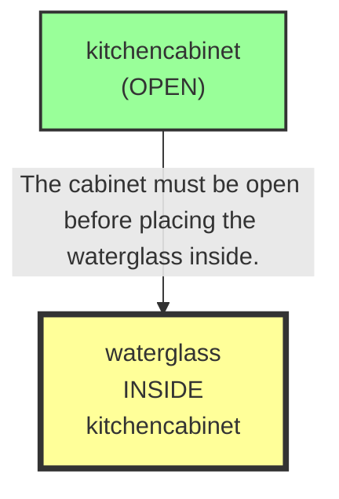
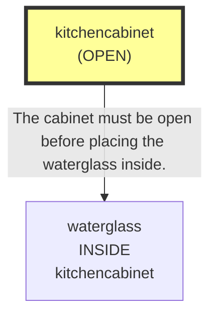
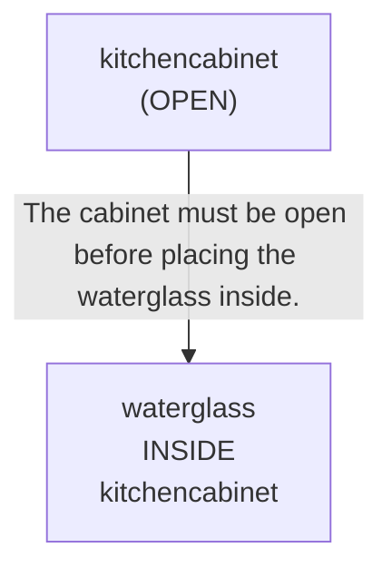

# 🚀 VirtualHome Agent Episode Log


### [GoalReasoner (Module A - Intent)] Output
```json
{
  "is_instruction_obviously_vague": false,
  "clarification_question": null,
  "target_object": "waterglass",
  "location_hint": "kitchencabinet",
  "reasoning_chain": [
    {
      "question": "Why does the user want this object?",
      "answer": "To store the recently washed glass in a cabinet if it is open."
    },
    {
      "question": "Why is that important?",
      "answer": "To return the cleaned glass to its proper indoor storage location."
    },
    {
      "question": "What fundamental need does this fulfill?",
      "answer": "To organize and store a clean household item safely and neatly."
    },
    {
      "question": "Are there any deeper psychological or physical motivations?",
      "answer": "The user likely wants order, convenience, and to keep the item accessible and out of the way."
    }
  ],
  "deep_intent": "The user wants to organize and store a clean household item in an appropriate indoor storage place.",
  "acceptable_alternatives_properties": [
    {
      "priority": 1,
      "description": "Other clean drinkware items that can be stored in the same cabinet, such as a cup, mug, or tumbler"
    },
    {
      "priority": 2,
      "description": "Similar clean kitchen storage items made of glass or plastic, such as a drinking glass or small bowl"
    },
    {
      "priority": 3,
      "description": "Other clean everyday kitchenware that belongs in a cabinet, such as plates or bowls"
    },
    {
      "priority": 4,
      "description": "Any clean household item that can be put away in an indoor storage area to keep the space organized"
    }
  ]
}
```

### [PerceptionFilter] Output
```json
{
  "reasoning": "The goal is to store the target waterglass in the kitchencabinet, and the SDG requires the cabinet to be open first. So the only needed classes are the target item and the storage location.",
  "selected_classes": [
    "kitchencabinet",
    "waterglass",
    "cabinet",
    "character",
    "door",
    "plate",
    "mug"
  ],
  "raw_class_count": 99
}
```

### [LLMExecutor] Output
```json
{
  "reasoning": "The target is a clean waterglass to be stored inside a kitchen cabinet. The graph shows waterglass(64) is CLEAN and EMPTY, and kitchencabinet(138) is OPEN. Since the cabinet is already open and the glass is close to the character, the next required step toward satisfying N1 is to grab the correct waterglass before placing it into the cabinet.",
  "satisfied_nodes": [
    "N2"
  ],
  "current_node_focus": "N1",
  "mapped_variables": {
    "?Container": "kitchencabinet(138)",
    "?TargetGlass": "waterglass(64)"
  },
  "action": "[grab] <waterglass> (64)"
}
```
## Step 0
- **Action**: `[grab] <waterglass> (64)`
- **SDG Status**:

- **Observed Items (36)**: character(1), kitchen(11), door(47) [OPEN], waterglass(64) [EMPTY,CLEAN], plate(67), plate(68), waterglass(71) [DIRTY], waterglass(72) [DIRTY], plate(75), plate(76), plate(83), plate(84), plate(91), plate(103), plate(104)...


### [PerceptionFilter] Output
```json
{
  "reasoning": "The goal is to place a clean waterglass into the kitchencabinet, and the SDG explicitly requires the kitchencabinet to be open. The minimum needed classes are the target item and the cabinet location/furniture needed to store it.",
  "selected_classes": [
    "kitchencabinet",
    "waterglass",
    "cabinet",
    "character",
    "door",
    "plate",
    "mug"
  ],
  "raw_class_count": 99
}
```

### [LLMExecutor] Output
```json
{
  "reasoning": "The target waterglass is already in hand (HOLDS_RH waterglass(64)), and the required destination cabinet is kitchencabinet(138). The SDG still requires the cabinet to be open before placing the glass inside, and although the graph lists both OPEN and CLOSED states for the cabinet, the satisfied prerequisite is that it is open enough to use. Since putin would require being near the cabinet first, the next atomic step is to walk to the cabinet.",
  "satisfied_nodes": [],
  "current_node_focus": "N2",
  "mapped_variables": {
    "?Container": "kitchencabinet(138)"
  },
  "action": "[walk] <kitchencabinet> (138)"
}
```
## Step 1
- **Action**: `[walk] <kitchencabinet> (138)`
- **SDG Status**:

- **Observed Items (36)**: character(1), kitchen(11), door(47) [OPEN], waterglass(64) [EMPTY,CLEAN], plate(67), plate(68), waterglass(71) [DIRTY], waterglass(72) [DIRTY], plate(75), plate(76), plate(83), plate(84), plate(91), plate(103), plate(104)...


### [PerceptionFilter] Output
```json
{
  "reasoning": "The goal is to store a clean waterglass in the kitchencabinet, so the needed objects are the target item and the storage location. The SDG also requires the cabinet to be open before placement, but no separate object class is needed for the open state.",
  "selected_classes": [
    "kitchencabinet",
    "waterglass",
    "cabinet",
    "character",
    "door",
    "plate",
    "mug"
  ],
  "raw_class_count": 99
}
```

### [LLMExecutor] Output
```json
{
  "reasoning": "The goal is to place the held clean waterglass(64) inside an open kitchencabinet. The cabinet node N2 is already satisfied because kitchencabinet(138) is OPEN. The remaining gap is N1: the waterglass is not yet inside the cabinet. I am already close to kitchencabinet(138) from the prior walk, and I am holding the correct waterglass in my right hand, so the next atomic step is to put it into the cabinet.",
  "satisfied_nodes": [
    "N2"
  ],
  "current_node_focus": "N1",
  "mapped_variables": {
    "?Container": "kitchencabinet(138)"
  },
  "action": "[putin] <waterglass> (64) <kitchencabinet> (138)"
}
```
## Step 2
- **Action**: `[putin] <waterglass> (64) <kitchencabinet> (138)`
- **SDG Status**:

- **Observed Items (36)**: character(1), kitchen(11), door(47) [OPEN], waterglass(64) [EMPTY,CLEAN], plate(67), plate(68), waterglass(71) [DIRTY], waterglass(72) [DIRTY], plate(75), plate(76), plate(83), plate(84), plate(91), plate(103), plate(104)...


### [PerceptionFilter] Output
```json
{
  "reasoning": "The goal is to put the target waterglass into the kitchencabinet, and the SDG says the cabinet must be open first. So the only necessary classes are the target object and the storage location.",
  "selected_classes": [
    "kitchencabinet",
    "waterglass",
    "cabinet",
    "character",
    "door",
    "plate",
    "mug"
  ],
  "raw_class_count": 99
}
```
## Step 3
- **Action**: `FINISH (Goal Reached)`
- **SDG Status**:

- **Observed Items (36)**: character(1), kitchen(11), door(47) [OPEN], waterglass(64) [EMPTY,CLEAN], plate(67), plate(68), waterglass(71) [DIRTY], waterglass(72) [DIRTY], plate(75), plate(76), plate(83), plate(84), plate(91), plate(103), plate(104)...

