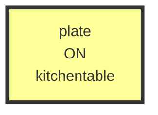
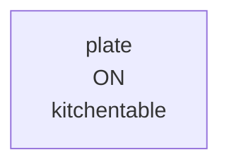

# 🚀 VirtualHome Agent Episode Log


### [GoalReasoner (Module A - Intent)] Output
```json
{
  "is_instruction_obviously_vague": false,
  "clarification_question": null,
  "target_object": "plate",
  "location_hint": "kitchen table",
  "reasoning_chain": [
    {
      "question": "Why does the user want this object moved?",
      "answer": "To place the used plate in a designated spot after use."
    },
    {
      "question": "Why is that important?",
      "answer": "To keep the current area tidy and organize used items."
    },
    {
      "question": "What fundamental need does this fulfill?",
      "answer": "It fulfills the need to manage used dishware and maintain an orderly indoor space."
    },
    {
      "question": "Are there any deeper psychological or physical motivations?",
      "answer": "It may reduce clutter, support cleanliness routines, and prepare the item for later washing or collection."
    }
  ],
  "deep_intent": "The user wants to organize used dishware and maintain tidiness in the indoor space.",
  "acceptable_alternatives_properties": [
    {
      "priority": 1,
      "description": "Other used dishware items that can be placed with the rest of the dishes, such as a bowl, cup, or utensil"
    },
    {
      "priority": 2,
      "description": "Other tableware or food-service items that belong with used dishes, such as a tray or serving dish"
    },
    {
      "priority": 3,
      "description": "Other household items that can be set down in a designated kitchen surface area to reduce clutter"
    },
    {
      "priority": 4,
      "description": "Any nearby item that needs to be returned to an appropriate indoor surface as part of cleanup or organization"
    }
  ]
}
```

### [PerceptionFilter] Output
```json
{
  "reasoning": "The goal is to organize a used plate at the kitchen table. The SDG explicitly requires the plate and the kitchen table location, so both must be kept. No extra tools are needed for this simple placement task.",
  "selected_classes": [
    "plate",
    "character",
    "kitchentable",
    "door"
  ],
  "raw_class_count": 99
}
```

### [LLMExecutor] Output
```json
{
  "reasoning": "The SDG requires the plate to be ON a kitchentable. The washed plate is currently near the character, but not on a table yet. Since putting an object onto a surface requires being explicitly walked to that destination first, and no table is currently selected as the target, the next step is to move next to the kitchen table. I will bind ?Container/?Surface to kitchentable(131), which is a valid flat surface for placing the plate.",
  "satisfied_nodes": [],
  "current_node_focus": "N1",
  "mapped_variables": {
    "?Surface": "kitchentable(131)"
  },
  "action": "[walk] <kitchentable> (131)"
}
```
## Step 0
- **Action**: `[walk] <kitchentable> (131)`
- **SDG Status**:

- **Observed Items (13)**: character(1), kitchen(11), door(47) [OPEN], plate(67), plate(68), kitchentable(131), kitchentable(135), livingroom(183), bedroom(241), door(254) [OPEN], bathroom(285), door(305) [OPEN], bedroom(346)


### [PerceptionFilter] Output
```json
{
  "reasoning": "The goal is to organize a used plate on the kitchen table. The only explicitly required target is the plate, and the location dependency requires the kitchen table. No extra tools or receptacles are necessary for simply moving/placing it.",
  "selected_classes": [
    "plate",
    "character",
    "kitchentable",
    "door"
  ],
  "raw_class_count": 99
}
```

### [LLMExecutor] Output
```json
{
  "reasoning": "The SDG requires a plate to be ON the kitchen table. We are already CLOSE to kitchentable(131) from the previous walk action, and the washed target plate is plate(67), which is also CLOSE to the character. Since putting onto a surface requires the object to be held first, the next atomic step should be to grab the correct plate before placing it on the table.",
  "satisfied_nodes": [],
  "current_node_focus": "N1",
  "mapped_variables": {
    "?Surface": "kitchentable(131)"
  },
  "action": "[grab] <plate> (67)"
}
```
## Step 1
- **Action**: `[grab] <plate> (67)`
- **SDG Status**:

- **Observed Items (13)**: character(1), kitchen(11), door(47) [OPEN], plate(67), plate(68), kitchentable(131), kitchentable(135), livingroom(183), bedroom(241), door(254) [OPEN], bathroom(285), door(305) [OPEN], bedroom(346)


### [PerceptionFilter] Output
```json
{
  "reasoning": "The goal is to organize a used plate onto the kitchen table area. The only strictly necessary classes are the target item itself and the destination location explicitly required by the SDG.",
  "selected_classes": [
    "plate",
    "character",
    "kitchentable",
    "door"
  ],
  "raw_class_count": 99
}
```

### [LLMExecutor] Output
```json
{
  "reasoning": "The target plate is already held in the right hand (HOLDS_RH plate(67)), so the remaining gap is to place it on the kitchen table to satisfy N1. The current graph shows two kitchen tables, and the last successful walk was to kitchentable(131), so the next required atomic action is to put the held plate onto that flat surface. No additional walk is needed because the instruction says not to repeat a walk action if I just did it.",
  "satisfied_nodes": [],
  "current_node_focus": "N1",
  "mapped_variables": {
    "?Surface": "kitchentable(131)"
  },
  "action": "[putback] <plate> (67) <kitchentable> (131)"
}
```
## Step 2
- **Action**: `[putback] <plate> (67) <kitchentable> (131)`
- **SDG Status**:

- **Observed Items (13)**: character(1), kitchen(11), door(47) [OPEN], plate(67), plate(68), kitchentable(131), kitchentable(135), livingroom(183), bedroom(241), door(254) [OPEN], bathroom(285), door(305) [OPEN], bedroom(346)


### [PerceptionFilter] Output
```json
{
  "reasoning": "The goal is to organize a used plate on the kitchen table area, so the only strictly necessary objects are the target plate and the referenced location surface kitchentable. No extra tools or alternate receptacles are required by the SDG.",
  "selected_classes": [
    "plate",
    "character",
    "kitchentable",
    "door"
  ],
  "raw_class_count": 99
}
```
## Step 3
- **Action**: `FINISH (Goal Reached)`
- **SDG Status**:

- **Observed Items (13)**: character(1), kitchen(11), door(47) [OPEN], plate(67), plate(68), kitchentable(131), kitchentable(135), livingroom(183), bedroom(241), door(254) [OPEN], bathroom(285), door(305) [OPEN], bedroom(346)

