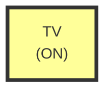
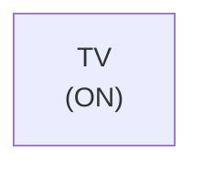

# 🚀 VirtualHome Agent Episode Log


### [GoalReasoner (Module A - Intent)] Output
```json
{
  "is_instruction_obviously_vague": false,
  "clarification_question": null,
  "target_object": "TV",
  "location_hint": null,
  "reasoning_chain": [
    {
      "question": "Why does the user want this object?",
      "answer": "To have the television powered on."
    },
    {
      "question": "Why is that important?",
      "answer": "So the device is in the desired operating state and can display content."
    },
    {
      "question": "What fundamental need does this fulfill?",
      "answer": "It enables access to visual and audio media."
    },
    {
      "question": "Are there any deeper psychological or physical motivations?",
      "answer": "The user likely wants entertainment, information, or background media."
    }
  ],
  "deep_intent": "The user wants to enable access to visual and audio media.",
  "acceptable_alternatives_properties": [
    {
      "priority": 1,
      "description": "Other household media devices that can provide similar visual and audio content, such as a monitor or projector."
    },
    {
      "priority": 2,
      "description": "Any screen-based device in the home that can display content, such as a computer monitor, tablet, or smart display."
    },
    {
      "priority": 3,
      "description": "Audio-visual entertainment devices that can serve the same purpose, such as a streaming device connected to a display."
    },
    {
      "priority": 4,
      "description": "Other household sources of entertainment or information, such as a radio or computer."
    }
  ]
}
```

### [PerceptionFilter] Output
```json
{
  "reasoning": "The goal is to have the TV powered on, so the only strictly necessary object class is the TV itself. No additional tool or location is required by the SDG or intent.",
  "selected_classes": [
    "computer",
    "character",
    "radio",
    "tv"
  ],
  "raw_class_count": 112
}
```

### [LLMExecutor] Output
```json
{
  "reasoning": "The SDG requires a TV to be ON. There are two TVs in the graph, and the prior action explicitly turned off tv (18), which is no longer present in the current graph. By memory alignment, the most likely corresponding target is the living room tv (426), which is currently OFF and has the required switch. Since switching an object requires being near it, the next step is to walk to that TV before turning it on.",
  "satisfied_nodes": [],
  "current_node_focus": "N1",
  "mapped_variables": {},
  "action": "[walk] <tv> (426)"
}
```
## Step 0
- **Action**: `[walk] <tv> (426)`
- **SDG Status**:

- **Observed Items (10)**: character(1), bathroom(11), bedroom(73), computer(174) [OFF], radio(176) [OFF], kitchen(205), tv(264) [OFF], livingroom(335), tv(426) [OFF], computer(433) [OFF]


### [PerceptionFilter] Output
```json
{
  "reasoning": "The goal is to turn the TV ON, so the only strictly necessary object class is the TV itself. No additional tools, locations, or alternate media devices are required by the SDG.",
  "selected_classes": [
    "computer",
    "character",
    "radio",
    "tv"
  ],
  "raw_class_count": 112
}
```

### [LLMExecutor] Output
```json
{
  "reasoning": "The goal is to satisfy N1: TV ON. The current graph shows tv(426) is OFF, has HAS_SWITCH and HAS_PLUG, and the character is already CLOSE to it. Since switching on requires being near the TV, and we already are, the next atomic step is to turn it on. tv(264) is also OFF in the kitchen, but past actions and proximity strongly align the target with tv(426), which was just walked to.",
  "satisfied_nodes": [],
  "current_node_focus": "N1",
  "mapped_variables": {},
  "action": "[switchon] <tv> (426)"
}
```
## Step 1
- **Action**: `[switchon] <tv> (426)`
- **SDG Status**:

- **Observed Items (10)**: character(1), bathroom(11), bedroom(73), computer(174) [OFF], radio(176) [OFF], kitchen(205), tv(264) [OFF], livingroom(335), tv(426) [OFF], computer(433) [OFF]


### [PerceptionFilter] Output
```json
{
  "reasoning": "The goal is to turn the TV on, so the essential object class is the TV itself. No additional tools or locations are required by the SDG, and alternatives like monitor or radio are not needed because the target object is explicitly TV.",
  "selected_classes": [
    "computer",
    "character",
    "radio",
    "tv"
  ],
  "raw_class_count": 112
}
```
## Step 2
- **Action**: `FINISH (Goal Reached)`
- **SDG Status**:

- **Observed Items (10)**: character(1), bathroom(11), bedroom(73), computer(174) [OFF], radio(176) [OFF], kitchen(205), tv(264) [OFF], livingroom(335), tv(426) [OFF,ON], computer(433) [OFF]

