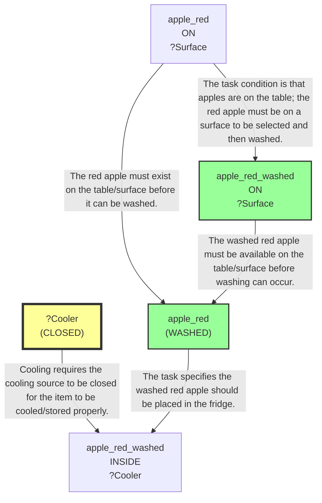
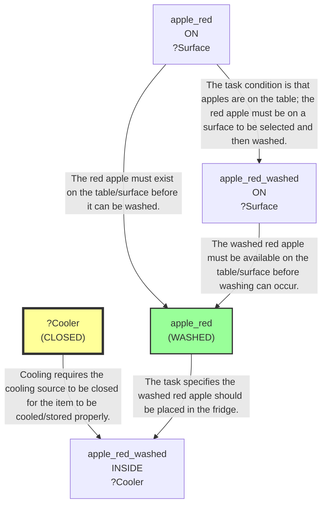
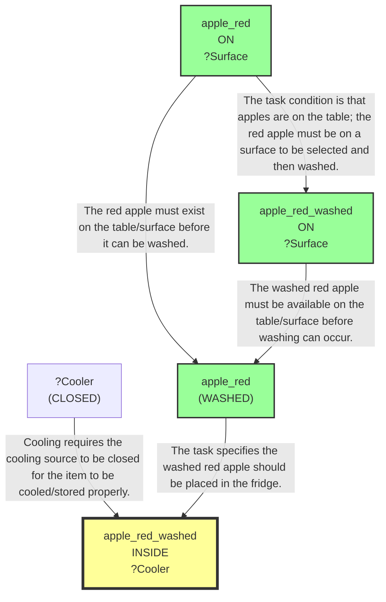
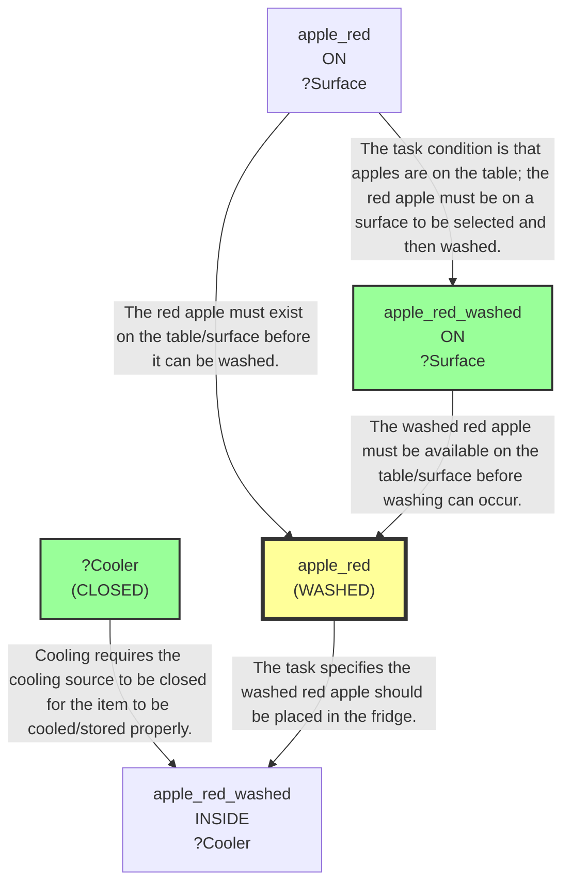
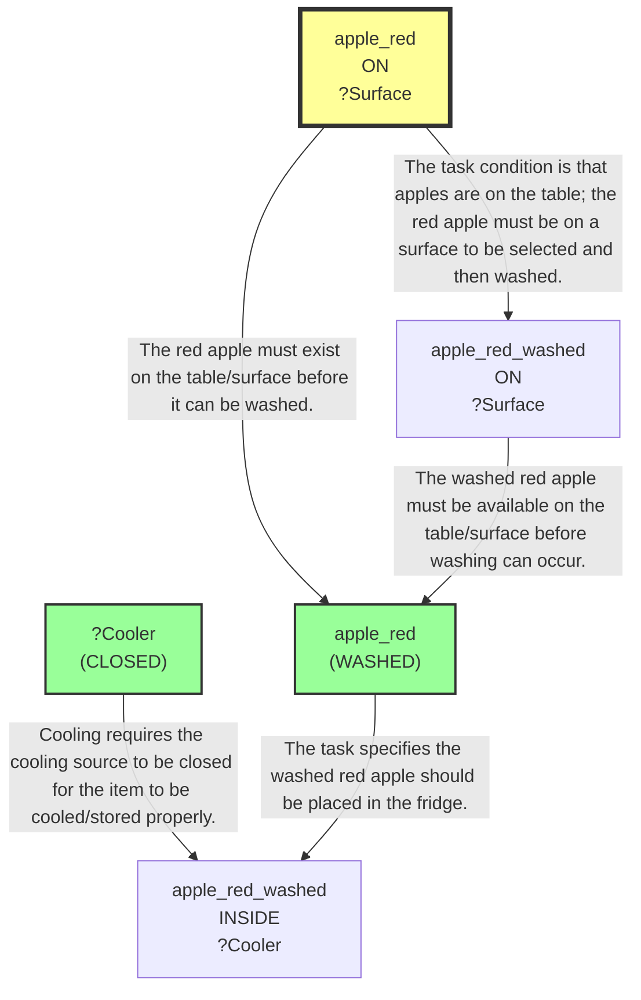
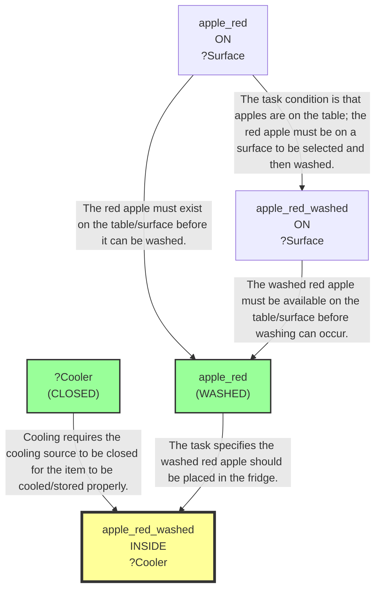
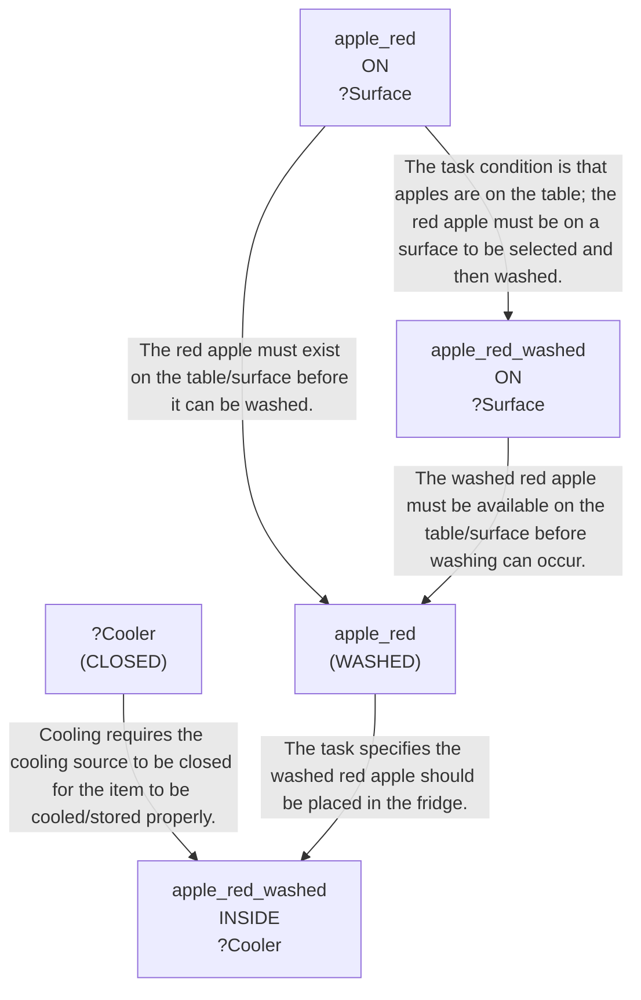

# 🚀 VirtualHome Agent Episode Log


### [GoalReasoner (Module A - Intent)] Output
```json
{
  "is_instruction_obviously_vague": false,
  "clarification_question": null,
  "target_object": "apple",
  "location_hint": "table",
  "reasoning_chain": [
    {
      "question": "Why does the user want this object?",
      "answer": "To move the washed red apple from the table into the fridge if apples are present."
    },
    {
      "question": "Why is that important?",
      "answer": "To ensure the specific apple is stored in the fridge rather than left on the table."
    },
    {
      "question": "What fundamental need does this fulfill?",
      "answer": "To preserve or store food in a cooler place."
    },
    {
      "question": "Are there any deeper psychological or physical motivations?",
      "answer": "The user likely wants the fruit kept fresh, chilled, or ready for later use."
    }
  ],
  "deep_intent": "The user wants to store food in a cool place to keep it fresh for later.",
  "acceptable_alternatives_properties": [
    {
      "priority": 1,
      "description": "Other washed fruits that can be refrigerated, such as pears, grapes, or berries"
    },
    {
      "priority": 2,
      "description": "Other fresh produce that benefits from refrigeration, such as oranges, peaches, or plums"
    },
    {
      "priority": 3,
      "description": "Any perishable food item that can be stored in a fridge to maintain freshness"
    },
    {
      "priority": 4,
      "description": "A different chilled snack or ready-to-eat fruit that serves the same fresh-food purpose"
    }
  ]
}
```

### [PerceptionFilter] Output
```json
{
  "reasoning": "The goal is to store the washed red apple in a cooler, so the needed classes are the apple itself, a fridge as the cooler, and the table/surface where the apple is currently located. Since the SDG requires the cooler to be closed, the fridge must be included. No extra tools are required for this storage task.",
  "selected_classes": [
    "peach",
    "character",
    "apple",
    "plum",
    "fridge",
    "table",
    "kitchentable"
  ],
  "raw_class_count": 97
}
```

### [LLMExecutor] Output
```json
{
  "reasoning": "The washed red apple exists as apple(113) and is already on the kitchen table, which satisfies the prerequisite for storing it in the fridge. The fridge(225) is the correct cooler and is currently CLOSED, matching the required end state. I need to move toward the fridge before I can open or place anything into it, and I have not just walked to it yet.",
  "satisfied_nodes": [
    "N3",
    "N5"
  ],
  "current_node_focus": "N2",
  "mapped_variables": {
    "?Cooler": "fridge(225)",
    "?Surface": "kitchentable(199)"
  },
  "action": "[walk] <fridge> (225)"
}
```
## Step 0
- **Action**: `[walk] <fridge> (225)`
- **SDG Status**:

- **Observed Items (15)**: character(1), bathroom(11), bedroom(50), apple(113) [RED,CLEAN], apple(114) [RED,DIRTY], peach(117), peach(118), plum(119), plum(120), kitchen(126), kitchentable(199), fridge(225) [CLOSED], apple(249) [CLEAN,GREEN], apple(250) [DIRTY,GREEN], livingroom(261)


### [PerceptionFilter] Output
```json
{
  "reasoning": "The goal is to store a washed red apple in a cool place, so the necessary classes are the apple itself, the cooling appliance that can be closed (fridge), and the surface/table where the apple is initially located. Because the SDG requires the apple to be washed before refrigeration, washing-related tools are also needed: sink and dishwashingliquid. A waterglass is included as a physical backup for holding/rinsing water if needed. The apple class is also retained as the exact target object class.",
  "selected_classes": [
    "peach",
    "sink",
    "character",
    "dishwashingliquid",
    "apple",
    "waterglass",
    "plum",
    "fridge",
    "table"
  ],
  "raw_class_count": 97
}
```

### [LLMExecutor] Output
```json
{
  "reasoning": "The washed red apple is already clean, and the fridge is the correct cooler. The fridge is currently CLOSED, which matches the required end state, but to place the apple inside it I must first be near the fridge and then open it before putting the apple in. Since I just walked to the fridge, the next atomic action should be to open it.",
  "satisfied_nodes": [
    "N5"
  ],
  "current_node_focus": "N2",
  "mapped_variables": {
    "?Cooler": "fridge(225)"
  },
  "action": "[open] <fridge> (225)"
}
```
## Step 1
- **Action**: `[open] <fridge> (225)`
- **SDG Status**:

- **Observed Items (19)**: character(1), bathroom(11), sink(28), waterglass(33), bedroom(50), waterglass(103), apple(113) [RED,CLEAN], apple(114) [RED,DIRTY], peach(117), peach(118), plum(119), plum(120), kitchen(126), dishwashingliquid(174), sink(219)...


### [PerceptionFilter] Output
```json
{
  "reasoning": "The goal is to store the apple in a cool place, so I need the target fruit and the cooling appliance that can contain it. The SDG also requires the apple to be washed and then placed inside a closed cooler, which matches a fridge. The location hint/table is relevant because the apple is on a surface before being moved.",
  "selected_classes": [
    "peach",
    "character",
    "apple",
    "plum",
    "fridge",
    "table"
  ],
  "raw_class_count": 97
}
```

### [LLMExecutor] Output
```json
{
  "reasoning": "The washed red apple is already satisfied as apple(113) with states RED and CLEAN. The fridge(225) is the correct cooler and is currently OPEN, so the remaining gap for N1 is to place the apple inside it and then later close it. Since I am adjacent to the fridge from the previous walk/open sequence and the apple is the intended item, the next atomic action should be to put the held apple into the open fridge. This will progress directly toward N1 while preserving the required cooled storage setup.",
  "satisfied_nodes": [
    "N3",
    "N4",
    "N5"
  ],
  "current_node_focus": "N1",
  "mapped_variables": {
    "?Cooler": "fridge(225)",
    "?Surface": "kitchen table"
  },
  "action": "[putin] <apple> (113) <fridge> (225)"
}
```
## Step 2
- **Action**: `[putin] <apple> (113) <fridge> (225)`
- **SDG Status**:

- **Observed Items (14)**: character(1), bathroom(11), bedroom(50), apple(113) [RED,CLEAN], apple(114) [RED,DIRTY], peach(117), peach(118), plum(119), plum(120), kitchen(126), fridge(225) [OPEN], apple(249) [CLEAN,GREEN], apple(250) [DIRTY,GREEN], livingroom(261)


### [PerceptionFilter] Output
```json
{
  "reasoning": "The goal is to place the washed red apple into a cooling storage appliance and keep it closed. The SDG explicitly requires the apple, the cooler (best match: fridge), and the surface/table where the apple starts. A sink is not required here because the apple is already washed in the SDG state, so the minimal needed classes are the target fruit, its starting surface, and the fridge.",
  "selected_classes": [
    "peach",
    "character",
    "apple",
    "plum",
    "fridge",
    "table"
  ],
  "raw_class_count": 97
}
```

### [LLMExecutor] Output
```json
{
  "reasoning": "The last attempt to put the apple into the fridge failed while the fridge is still OPEN. The SDG requires the washed red apple to be INSIDE the cooler and the cooler to be CLOSED, so the immediate next atomic action is to close the fridge. The washed red apple is currently apple(113) and the fridge is fridge(225).",
  "satisfied_nodes": [
    "N5"
  ],
  "current_node_focus": "N2",
  "mapped_variables": {
    "?Cooler": "fridge(225)",
    "?Surface": "kitchen table (implicit surface in kitchen)"
  },
  "action": "[close] <fridge> (225)"
}
```
## Step 3
- **Action**: `[close] <fridge> (225)`
- **SDG Status**:

- **Observed Items (14)**: character(1), bathroom(11), bedroom(50), apple(113) [RED,CLEAN], apple(114) [RED,DIRTY], peach(117), peach(118), plum(119), plum(120), kitchen(126), fridge(225) [OPEN], apple(249) [CLEAN,GREEN], apple(250) [DIRTY,GREEN], livingroom(261)


### [PerceptionFilter] Output
```json
{
  "reasoning": "The goal is to place the washed red apple into a cooling storage appliance. The SDG requires the apple, a cooler that can be closed, and the surface/table where the apple starts. From the observed objects, the necessary matching classes are apple, table (as the implied surface), and fridge (the likely cooler).",
  "selected_classes": [
    "peach",
    "character",
    "apple",
    "plum",
    "fridge",
    "table",
    "kitchentable"
  ],
  "raw_class_count": 97
}
```

### [LLMExecutor] Output
```json
{
  "reasoning": "The goal gap is that the washed red apple must be INSIDE the fridge, and the fridge must end CLOSED. The fridge is already closed now after the last successful close action, but the apple is still on the kitchen table and not inside the fridge. Since the prior putin failed, the most plausible issue is that the apple was not actually held at that moment; however, the current graph does not show any held object, so the next required step is to return to the apple and re-grab it before attempting to store it. I will bind the cooler to fridge(225), and the target washed apple to apple(113).",
  "satisfied_nodes": [
    "N2",
    "N3"
  ],
  "current_node_focus": "N5",
  "mapped_variables": {
    "?Cooler": "fridge(225)",
    "?Surface": "kitchentable(199)"
  },
  "action": "[walk] <apple> (113)"
}
```
## Step 4
- **Action**: `[walk] <apple> (113)`
- **SDG Status**:

- **Observed Items (15)**: character(1), bathroom(11), bedroom(50), apple(113) [RED,CLEAN], apple(114) [RED,DIRTY], peach(117), peach(118), plum(119), plum(120), kitchen(126), kitchentable(199), fridge(225) [CLOSED], apple(249) [CLEAN,GREEN], apple(250) [DIRTY,GREEN], livingroom(261)


### [PerceptionFilter] Output
```json
{
  "reasoning": "The goal is to store the washed red apple in a cool place, so we must keep the target apple and the cooling appliance that can contain it. The SDG also requires the cooler to be closed, so the fridge is necessary. Since the apple is specified as being on a surface/table before washing and transfer, the table-related surface should be retained as the implied location context.",
  "selected_classes": [
    "peach",
    "character",
    "apple",
    "plum",
    "fridge",
    "table"
  ],
  "raw_class_count": 97
}
```

### [LLMExecutor] Output
```json
{
  "reasoning": "The washed red apple needed for N1 is apple(113), and the current graph shows it is CLOSE to the character, so I am already near it. The fridge is already CLOSED, satisfying N2. Since the previous putin failed, the next logical atomic step is to grab the washed red apple before trying to store it again.",
  "satisfied_nodes": [
    "N2",
    "N5"
  ],
  "current_node_focus": "N4",
  "mapped_variables": {
    "?Cooler": "fridge(225)",
    "?Surface": "kitchen(126)"
  },
  "action": "[grab] <apple> (113)"
}
```
## Step 5
- **Action**: `[grab] <apple> (113)`
- **SDG Status**:

- **Observed Items (14)**: character(1), bathroom(11), bedroom(50), apple(113) [RED,CLEAN], apple(114) [RED,DIRTY], peach(117), peach(118), plum(119), plum(120), kitchen(126), fridge(225) [CLOSED], apple(249) [CLEAN,GREEN], apple(250) [DIRTY,GREEN], livingroom(261)


### [PerceptionFilter] Output
```json
{
  "reasoning": "The goal is to store the washed red apple in a cool place. The SDG requires the apple, a cooler that can be closed, and the apple being on a surface/table before transfer. The only clearly relevant cooling appliance present is the fridge. Since washing is already indicated by the SDG, no extra washing tool is needed for selection. The table/surface is implied by the goal and SDG, so the relevant location/object class to retain is table-like surface; among visible classes, kitchentable and table-like furniture are included only if needed for the apple-on-surface condition. To satisfy the exact target and cooling requirements, keep the apple and fridge, plus the table surface class if present.",
  "selected_classes": [
    "peach",
    "character",
    "apple",
    "plum",
    "fridge",
    "kitchentable"
  ],
  "raw_class_count": 97
}
```

### [LLMExecutor] Output
```json
{
  "reasoning": "The washed red apple required by N1 is currently already held in the right hand as apple(113), so the remaining gap is to place it inside the correct cooler, fridge(225), which is already CLOSED and therefore satisfies N2. Because putin requires being near the destination, and the previous action was not a walk to the fridge, the next atomic action should be to walk to the fridge before any further placement attempt.",
  "satisfied_nodes": [
    "N2",
    "N5"
  ],
  "current_node_focus": "N1",
  "mapped_variables": {
    "?Cooler": "fridge(225)"
  },
  "action": "[walk] <fridge> (225)"
}
```
## Step 6
- **Action**: `[walk] <fridge> (225)`
- **SDG Status**:

- **Observed Items (15)**: character(1), bathroom(11), bedroom(50), apple(113) [RED,CLEAN], apple(114) [RED,DIRTY], peach(117), peach(118), plum(119), plum(120), kitchen(126), kitchentable(199), fridge(225) [CLOSED], apple(249) [CLEAN,GREEN], apple(250) [DIRTY,GREEN], livingroom(261)


### [PerceptionFilter] Output
```json
{
  "reasoning": "The goal is to move the washed red apple from the table into a cooling storage place. The SDG requires the apple, a cooler that is closed, and a surface/table context. To satisfy the cooling/storage requirement while keeping alternatives as backups, I include all visible fridge-like cooling appliances and the required target fruit.",
  "selected_classes": [
    "microwave",
    "peach",
    "character",
    "apple",
    "plum",
    "fridge",
    "table",
    "kitchentable"
  ],
  "raw_class_count": 97
}
```

### [LLMExecutor] Output
```json
{
  "reasoning": "The washed red apple is currently held in the right hand (apple(113)), and the fridge(225) is already nearby and CLOSED, which satisfies the cooler-state requirement. The previous putin attempt failed, but the graph now confirms I am still holding the correct apple and am close to the fridge. Since the next gap toward N1 is to place the held washed apple inside the closed fridge, the next atomic action should be the placement action. However, the instruction requires walking to the destination before putin; I already did that in the previous step and should not repeat walk now.",
  "satisfied_nodes": [
    "N2",
    "N5"
  ],
  "current_node_focus": "N1",
  "mapped_variables": {
    "?Cooler": "fridge(225)"
  },
  "action": "[putin] <apple> (113) <fridge> (225)"
}
```
## Step 7
- **Action**: `[putin] <apple> (113) <fridge> (225)`
- **SDG Status**:

- **Observed Items (16)**: character(1), bathroom(11), bedroom(50), apple(113) [RED,CLEAN], apple(114) [RED,DIRTY], peach(117), peach(118), plum(119), plum(120), kitchen(126), kitchentable(199), fridge(225) [CLOSED], microwave(234) [CLOSED,OFF], apple(249) [CLEAN,GREEN], apple(250) [DIRTY,GREEN]...


### [PerceptionFilter] Output
```json
{
  "reasoning": "The goal is to move a washed red apple from a table into a cooling storage appliance. The SDG requires the apple, a cooler that can be closed, and the surface/table where the apple is currently located. Since the cooler is abstract, the visible physical match is a fridge. The exact target object class apple must be kept, and the location hint implies table as the relevant surface.",
  "selected_classes": [
    "peach",
    "character",
    "apple",
    "plum",
    "fridge",
    "table"
  ],
  "raw_class_count": 97
}
```
## Step 8
- **Action**: `FINISH (Goal Reached)`
- **SDG Status**:

- **Observed Items (14)**: character(1), bathroom(11), bedroom(50), apple(113) [RED,CLEAN], apple(114) [RED,DIRTY], peach(117), peach(118), plum(119), plum(120), kitchen(126), fridge(225) [CLOSED], apple(249) [CLEAN,GREEN], apple(250) [DIRTY,GREEN], livingroom(261)

