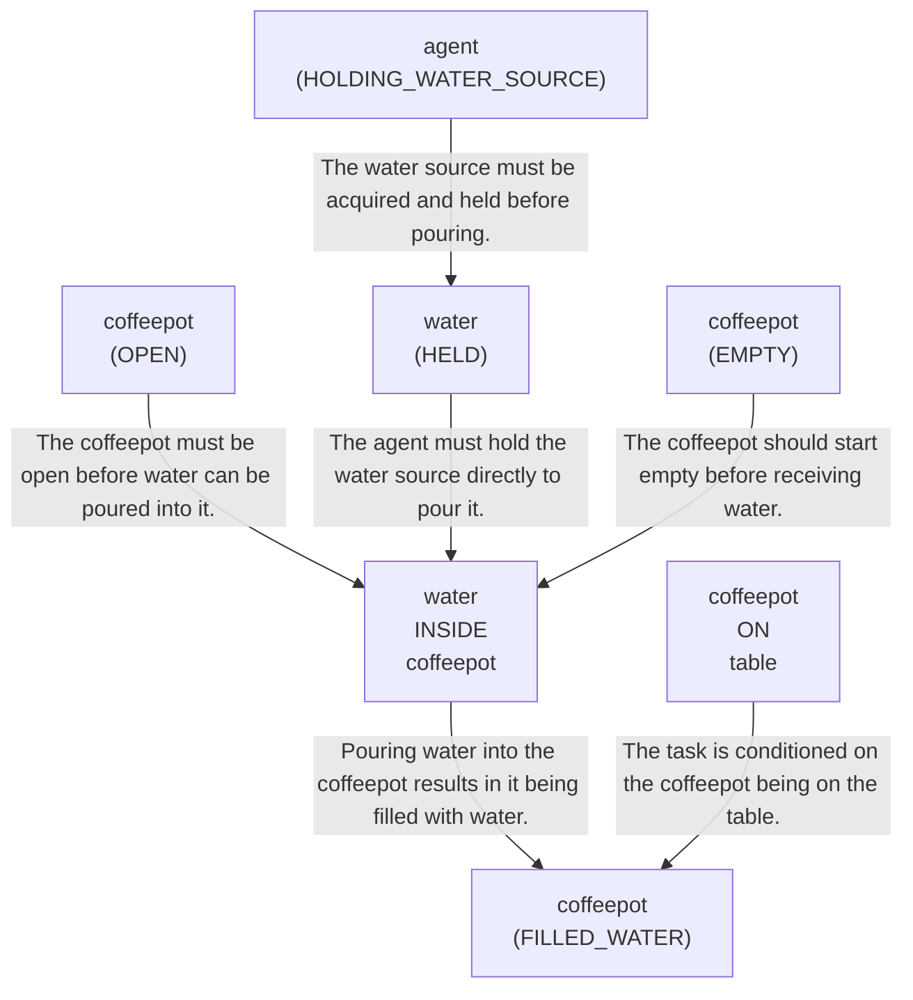

# 🚀 VirtualHome Agent Episode Log


### [GoalReasoner (Module A - Intent)] Output
```json
{
  "is_instruction_obviously_vague": false,
  "clarification_question": null,
  "target_object": "coffeepot",
  "location_hint": "table",
  "reasoning_chain": [
    {
      "question": "Why does the user want this object?",
      "answer": "To use the coffeepot to pour water."
    },
    {
      "question": "Why is that important?",
      "answer": "So the user gets two cups of water."
    },
    {
      "question": "What fundamental need does this fulfill?",
      "answer": "To obtain drinking water or prepare a beverage."
    },
    {
      "question": "Are there any deeper psychological or physical motivations?",
      "answer": "The user likely wants hydration or convenience in getting water ready for consumption."
    }
  ],
  "deep_intent": "Obtain two cups of water for drinking or beverage preparation",
  "acceptable_alternatives_properties": [
    {
      "priority": 1,
      "description": "A pitcher, jug, or bottle that can dispense two cups of water"
    },
    {
      "priority": 2,
      "description": "Any clean container suitable for pouring or measuring two cups of water"
    },
    {
      "priority": 3,
      "description": "A cup, mug, or glass filled with water that can provide the needed amount"
    },
    {
      "priority": 4,
      "description": "Other safe drinkable liquids in a similar amount if water is unavailable"
    }
  ]
}
```

### [PerceptionFilter] Output
```json
{
  "reasoning": "Need the target coffeepot and the table it must be on. Because the goal is to obtain two cups of water by pouring, the relevant water source/container options should be retained as backups: mug, waterglass, wineglass, dishbowl, and coffeemaker-related water handling is not required beyond the coffeepot itself. The sink and faucet are also relevant physical water sources if the agent needs to fill the container before pouring.",
  "selected_classes": [
    "coffeepot",
    "waterglass",
    "wineglass",
    "dishbowl",
    "faucet",
    "table",
    "sink",
    "mug",
    "character"
  ],
  "raw_class_count": 112
}
```
## Step 0
- **Action**: `FINISH (Goal Reached)`
- **SDG Status**:

- **Observed Items (17)**: character(1), bathroom(11), faucet(50) [OFF], waterglass(64), bedroom(73), mug(194), wineglass(197), wineglass(198), kitchen(205), sink(247), faucet(248) [OFF], dishbowl(288), wineglass(298), wineglass(299), coffeepot(307) [CLOSED]...

