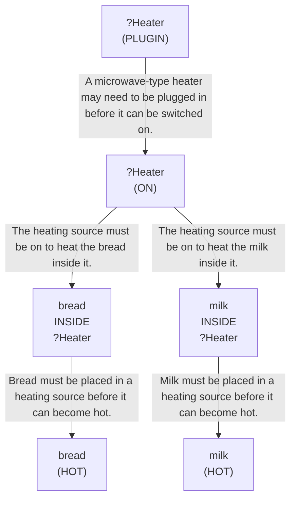

# 🚀 VirtualHome Agent Episode Log


### [GoalReasoner (Module A - Intent)] Output
```json
{
  "is_instruction_obviously_vague": false,
  "clarification_question": null,
  "target_object": "microwave",
  "location_hint": null,
  "reasoning_chain": [
    {
      "question": "Why does the user want this object?",
      "answer": "To heat the bread and milk."
    },
    {
      "question": "Why is that important?",
      "answer": "Warming the food and drink makes them ready to consume in the desired state."
    },
    {
      "question": "What fundamental need does this fulfill?",
      "answer": "The user wants to make food and drink more suitable for eating or drinking by increasing their temperature."
    },
    {
      "question": "Are there any deeper psychological or physical motivations?",
      "answer": "The likely physical motivation is to improve comfort, palatability, or usability of the food and drink."
    }
  ],
  "deep_intent": "The user wants to warm food and drink for consumption.",
  "acceptable_alternatives_properties": [
    {
      "priority": 1,
      "description": "Other heating appliances that can warm food and liquid, such as an oven, toaster oven, or stovetop-safe method."
    },
    {
      "priority": 2,
      "description": "Other indoor methods for warming edible items, such as a kettle, pot, or insulated warmer if suitable for the item."
    },
    {
      "priority": 3,
      "description": "Any safe appliance or container setup that can raise the temperature of the bread and milk without damaging them."
    },
    {
      "priority": 4,
      "description": "Other ready-to-consume warm foods or drinks that satisfy the same need for warmth and consumption comfort."
    }
  ]
}
```

### [PerceptionFilter] Output
```json
{
  "reasoning": "The goal is to warm bread and milk, so the target items bread and milk must be kept. The SDG requires a heating appliance that can be plugged in and turned on, so the microwave must be kept, along with the power socket as the implied location for plugging it in. Bread and milk are the items to place inside the heater.",
  "selected_classes": [
    "stove",
    "powersocket",
    "microwave",
    "milk",
    "toaster",
    "breadslice",
    "door",
    "character"
  ],
  "raw_class_count": 99
}
```
## Step 0
- **Action**: `FINISH (Goal Reached)`
- **SDG Status**:

- **Observed Items (17)**: character(1), kitchen(11), door(47) [OPEN], powersocket(57), stove(163) [OFF,CLOSED], toaster(166) [OFF], breadslice(167), microwave(171) [CLOSED,OFF], milk(176) [CLOSED], livingroom(183), powersocket(240), bedroom(241), door(254) [OPEN], powersocket(279), bathroom(285)...

