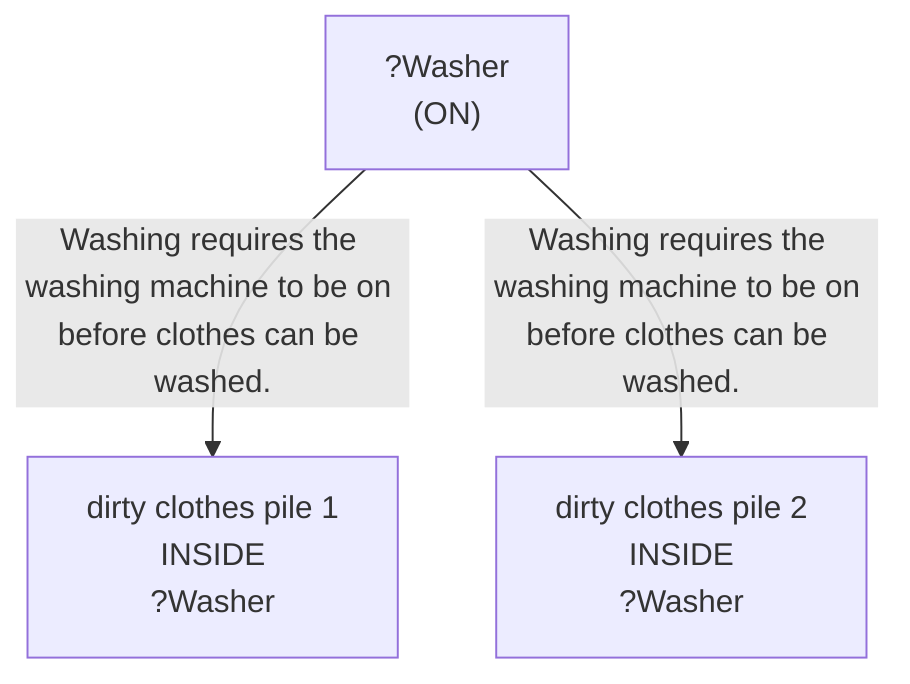

# 🚀 VirtualHome Agent Episode Log


### [GoalReasoner (Module A - Intent)] Output
```json
{
  "is_instruction_obviously_vague": false,
  "clarification_question": null,
  "target_object": "washing machine",
  "location_hint": null,
  "reasoning_chain": [
    {
      "question": "Why does the user want this object?",
      "answer": "To run a cleaning cycle for the dirty clothes."
    },
    {
      "question": "Why is that important?",
      "answer": "So the clothes on the floor can be cleaned and no longer remain dirty."
    },
    {
      "question": "What fundamental need does this fulfill?",
      "answer": "The user wants to clean soiled clothing."
    },
    {
      "question": "Are there any deeper psychological or physical motivations?",
      "answer": "Likely to maintain hygiene and reduce clutter from dirty laundry."
    }
  ],
  "deep_intent": "The user wants to clean dirty clothes.",
  "acceptable_alternatives_properties": [
    {
      "priority": 1,
      "description": "Other household laundry appliances or methods that can wash clothing, such as a different washer or a laundry service."
    },
    {
      "priority": 2,
      "description": "Manual washing options using a sink, tub, or basin with detergent."
    },
    {
      "priority": 3,
      "description": "Other fabric-cleaning methods for clothing, such as spot cleaning or a portable wash system."
    },
    {
      "priority": 4,
      "description": "Dry cleaning or other garment-cleaning services if machine washing is unavailable."
    }
  ]
}
```

### [PerceptionFilter] Output
```json
{
  "reasoning": "The goal is to clean dirty clothes, so the essential item is the washing machine. The SDG explicitly requires the washer to be ON and clothes inside it. No additional tools are required beyond the washing appliance itself for this task.",
  "selected_classes": [
    "floor",
    "character",
    "washingmachine",
    "sink"
  ],
  "raw_class_count": 112
}
```
## Step 0
- **Action**: `FINISH (Goal Reached)`
- **SDG Status**:

- **Observed Items (37)**: character(1), bathroom(11), floor(12), floor(13), floor(14), floor(15), floor(16), floor(17), washingmachine(72) [CLOSED,OFF], bedroom(73), floor(74), floor(75), floor(76), floor(77), floor(78)...

