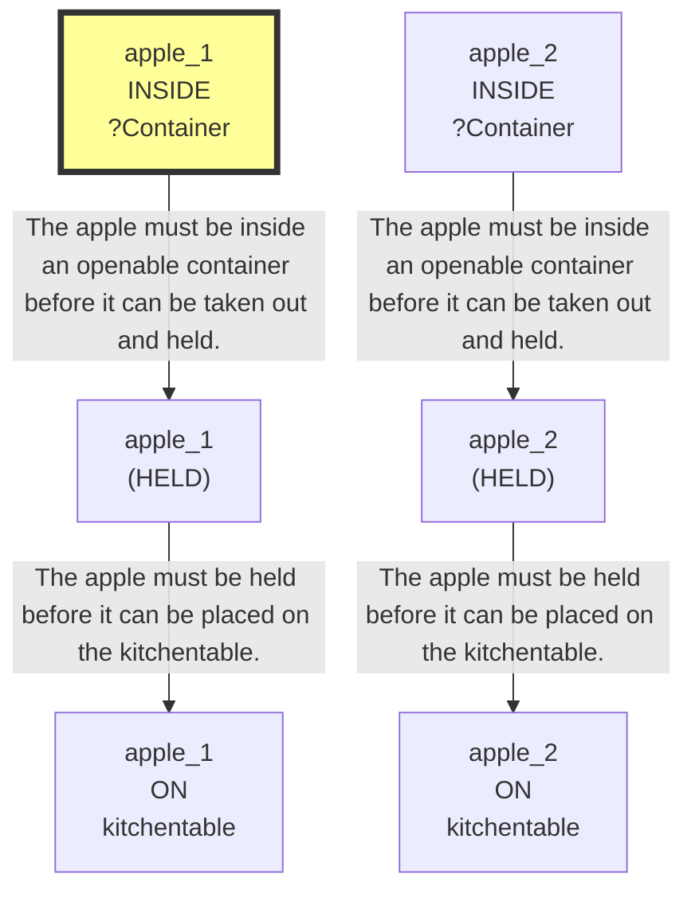
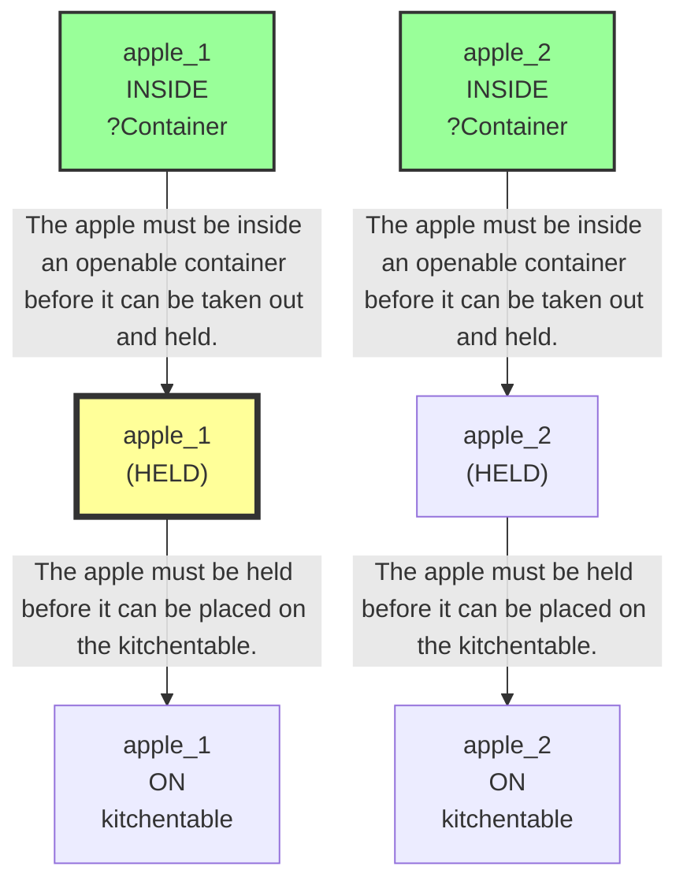
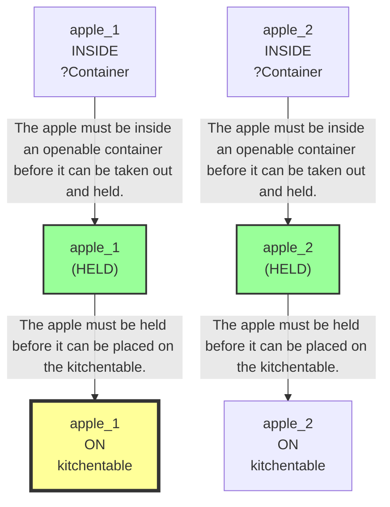
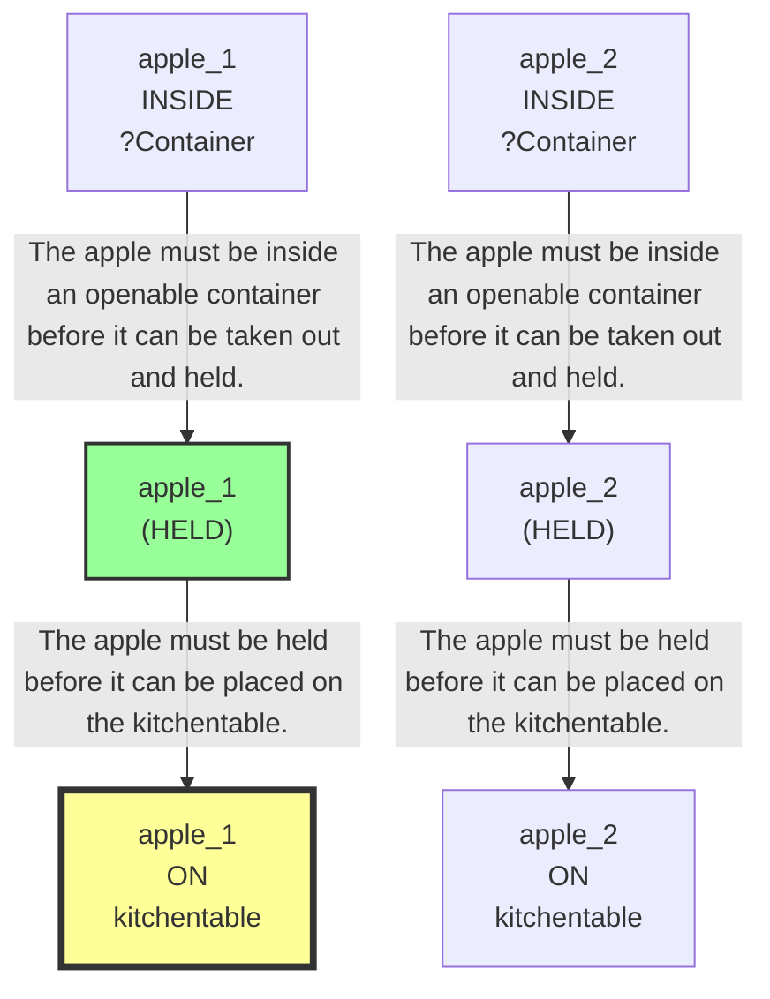
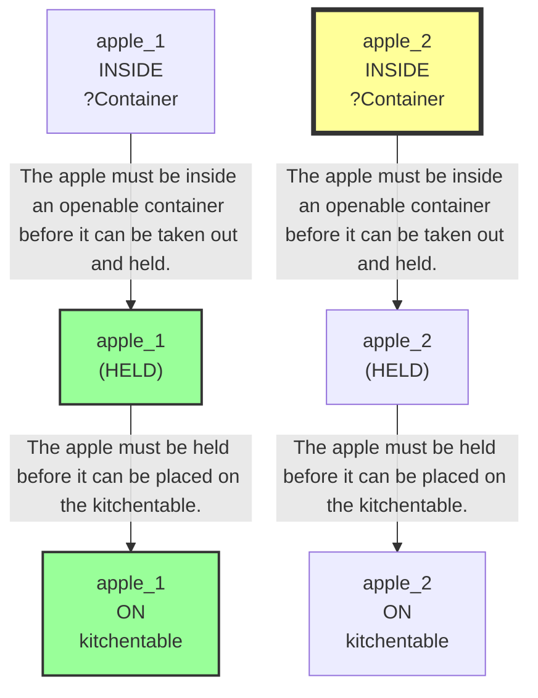
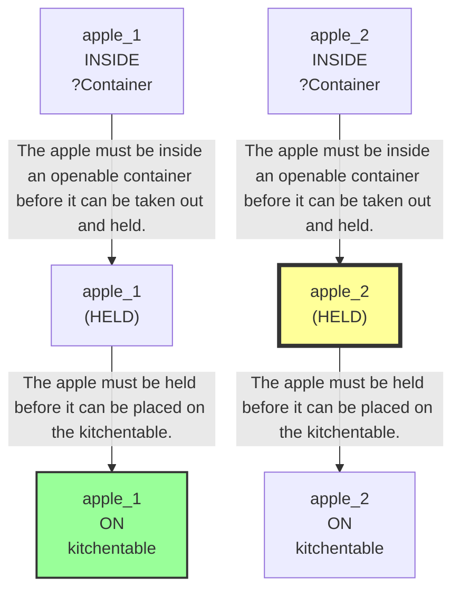
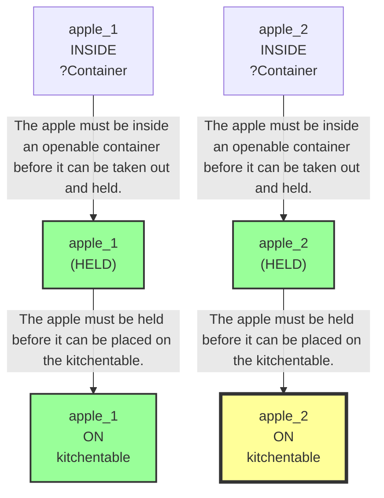
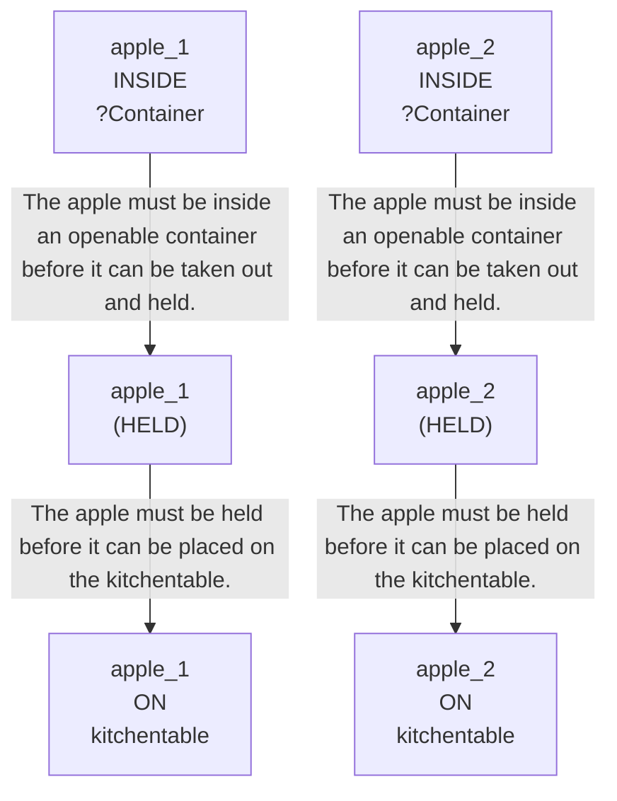

# 🚀 VirtualHome Agent Episode Log


### [GoalReasoner (Module A - Intent)] Output
```json
{
  "is_instruction_obviously_vague": false,
  "clarification_question": null,
  "target_object": "apple",
  "location_hint": "fridge / kitchen table",
  "reasoning_chain": [
    {
      "question": "Why does the user want this object?",
      "answer": "To have two apples removed from storage and placed on the kitchen table."
    },
    {
      "question": "Why is that important?",
      "answer": "So the apples are available in a desired location for use or access."
    },
    {
      "question": "What fundamental need does this fulfill?",
      "answer": "It fulfills the need to make food available for later consumption or use."
    },
    {
      "question": "Are there any deeper psychological or physical motivations?",
      "answer": "The primary motivation is likely to prepare accessible food, possibly to eat soon or to organize items for convenience."
    }
  ],
  "deep_intent": "The user wants to make food available for later consumption or use.",
  "acceptable_alternatives_properties": [
    {
      "priority": 1,
      "description": "Other ready-to-eat fruits in the fridge, such as pears, oranges, or bananas"
    },
    {
      "priority": 2,
      "description": "Other portable fresh produce items that can be placed on the kitchen table"
    },
    {
      "priority": 3,
      "description": "Similar snack foods kept in the fridge, such as yogurt cups or cut fruit"
    },
    {
      "priority": 4,
      "description": "Any edible items that can be conveniently set out for immediate access"
    }
  ]
}
```

### [PerceptionFilter] Output
```json
{
  "reasoning": "The goal is to retrieve two apples from storage and place them on the kitchen table. The minimal required classes are the target object apple, the storage/location furniture fridge, and the destination kitchentable. Because the SDG says the apples are inside an openable container, fridge is the relevant container here.",
  "selected_classes": [
    "bananas",
    "kitchentable",
    "fridge",
    "apple",
    "character"
  ],
  "raw_class_count": 112
}
```

### [LLMExecutor] Output
```json
{
  "reasoning": "The goal requires two apples to be placed on the kitchen table. Neither apple is held yet, and both are currently inside the closed fridge. The first necessary step is to get near the fridge so it can be opened and the apples can later be retrieved. I am mapping the container variable ?Container to fridge(305) because it is the only valid storage container containing the target apples.",
  "satisfied_nodes": [],
  "current_node_focus": "N3",
  "mapped_variables": {
    "?Container": "fridge(305)"
  },
  "action": "[walk] <fridge> (305)"
}
```
## Step 0
- **Action**: `[walk] <fridge> (305)`
- **SDG Status**:

- **Observed Items (12)**: character(1), bathroom(11), bedroom(73), kitchen(205), kitchentable(231), fridge(305) [CLOSED], bananas(315), bananas(316), livingroom(335), apple(437) [COLD], apple(438) [COLD], bananas(439)


### [PerceptionFilter] Output
```json
{
  "reasoning": "The goal is to retrieve two apples from storage and place them on the kitchen table. The SDG requires the apples, the fridge as the likely storage location, and the kitchen table as the destination. No additional tools are needed because the task is simple pick-and-place.",
  "selected_classes": [
    "bananas",
    "kitchentable",
    "fridge",
    "apple",
    "character"
  ],
  "raw_class_count": 112
}
```

### [LLMExecutor] Output
```json
{
  "reasoning": "I am already near the fridge, and it is closed. To retrieve the apples so they can eventually be placed on the kitchen table, the next required step is to open the fridge. This advances the prerequisite chain for both apples. I map ?Container to fridge(305) because it is the storage container holding the apples.",
  "satisfied_nodes": [],
  "current_node_focus": "N3",
  "mapped_variables": {
    "?Container": "fridge(305)"
  },
  "action": "[open] <fridge> (305)"
}
```
## Step 1
- **Action**: `[open] <fridge> (305)`
- **SDG Status**:

- **Observed Items (12)**: character(1), bathroom(11), bedroom(73), kitchen(205), kitchentable(231), fridge(305) [CLOSED], bananas(315), bananas(316), livingroom(335), apple(437) [COLD], apple(438) [COLD], bananas(439)


### [PerceptionFilter] Output
```json
{
  "reasoning": "The goal is to retrieve two apples from storage and place them on the kitchen table. The SDG requires the target objects apple and the location kitchentable. Because the apples are inside an openable container and must be taken out, the storage appliance fridge is needed as the likely container. No extra tools are required beyond the container and destination.",
  "selected_classes": [
    "bananas",
    "kitchentable",
    "fridge",
    "apple",
    "character"
  ],
  "raw_class_count": 112
}
```

### [LLMExecutor] Output
```json
{
  "reasoning": "The fridge is already open and both target apples are visible and close to the character. To satisfy the first prerequisite chain toward placing apple_1 on the kitchen table, I should pick up apple(437) next. It is the correct apple instance for apple_1, and grabbing it is the immediate step before walking to the table and placing it down.",
  "satisfied_nodes": [
    "N3",
    "N6"
  ],
  "current_node_focus": "N2",
  "mapped_variables": {
    "?Container": "fridge(305)"
  },
  "action": "[grab] <apple> (437)"
}
```
## Step 2
- **Action**: `[grab] <apple> (437)`
- **SDG Status**:

- **Observed Items (12)**: character(1), bathroom(11), bedroom(73), kitchen(205), kitchentable(231), fridge(305) [OPEN], bananas(315), bananas(316), livingroom(335), apple(437) [COLD], apple(438) [COLD], bananas(439)


### [PerceptionFilter] Output
```json
{
  "reasoning": "The goal is to retrieve two apples from storage and place them on the kitchen table. The SDG requires the target objects (apple) plus the location (kitchentable) and the storage container they are inside, which is inferred as the fridge from the location hint and task context. No other tools are necessary for this transfer task.",
  "selected_classes": [
    "bananas",
    "kitchentable",
    "fridge",
    "apple",
    "character"
  ],
  "raw_class_count": 112
}
```

### [LLMExecutor] Output
```json
{
  "reasoning": "Apple(437) is already held in the right hand, satisfying the prerequisite for placing apple_1 on the kitchen table. The next missing node for apple_1 is the ON relation to kitchentable(231), and per proximity rules I must first walk to the destination table before I can put it back. The other apple (438) is still inside the open fridge and can be handled afterward.",
  "satisfied_nodes": [
    "N2",
    "N5"
  ],
  "current_node_focus": "N1",
  "mapped_variables": {
    "?Container": "fridge(305)"
  },
  "action": "[walk] <kitchentable> (231)"
}
```
## Step 3
- **Action**: `[walk] <kitchentable> (231)`
- **SDG Status**:

- **Observed Items (12)**: character(1), bathroom(11), bedroom(73), kitchen(205), kitchentable(231), fridge(305) [OPEN], bananas(315), bananas(316), livingroom(335), apple(437) [COLD], apple(438) [COLD], bananas(439)


### [PerceptionFilter] Output
```json
{
  "reasoning": "The goal is to retrieve two apples from storage and place them on the kitchen table. The SDG indicates the apples are inside an openable container, and the location target is the kitchentable. So the minimum necessary classes are the target object apple, the storage appliance fridge, and the destination kitchentable.",
  "selected_classes": [
    "bananas",
    "kitchentable",
    "fridge",
    "apple",
    "character"
  ],
  "raw_class_count": 112
}
```

### [LLMExecutor] Output
```json
{
  "reasoning": "Apple(437) is already held and I am currently close to the kitchen table, so the next prerequisite/action to satisfy N1 is to place it on the table. This will complete the ON relation for apple_1. The second apple remains inside the open fridge for later retrieval.",
  "satisfied_nodes": [
    "N2"
  ],
  "current_node_focus": "N1",
  "mapped_variables": {
    "?Container": "fridge(305)"
  },
  "action": "[putback] <apple> (437) <kitchentable> (231)"
}
```
## Step 4
- **Action**: `[putback] <apple> (437) <kitchentable> (231)`
- **SDG Status**:

- **Observed Items (12)**: character(1), bathroom(11), bedroom(73), kitchen(205), kitchentable(231), fridge(305) [OPEN], bananas(315), bananas(316), livingroom(335), apple(437) [COLD], apple(438) [COLD], bananas(439)


### [PerceptionFilter] Output
```json
{
  "reasoning": "The goal is to move two apples from storage to the kitchen table. The SDG requires both target apples and the receptacle/location they are in or associated with. Since the apples are inside an unknown container, I must retain the fridge as the likely storage location and the kitchen table as the destination. No extra tools are needed for this transfer based on the SDG.",
  "selected_classes": [
    "bananas",
    "kitchentable",
    "fridge",
    "apple",
    "character"
  ],
  "raw_class_count": 112
}
```

### [LLMExecutor] Output
```json
{
  "reasoning": "Apple(437) is already on the kitchen table, so N1 is satisfied. The remaining unsatisfied chain is for apple_2: it is still inside the open fridge and must be grabbed before it can be placed on the table. I should now move to the second apple’s location first, because grab requires proximity and the instructions say not to repeat a walk action to the same destination if just done; I am already near the table but not necessarily near the fridge interior object. The best next step is to walk to apple(438) inside the open fridge.",
  "satisfied_nodes": [
    "N1",
    "N2"
  ],
  "current_node_focus": "N6",
  "mapped_variables": {
    "?Container": "fridge(305)"
  },
  "action": "[walk] <apple> (438)"
}
```
## Step 5
- **Action**: `[walk] <apple> (438)`
- **SDG Status**:

- **Observed Items (12)**: character(1), bathroom(11), bedroom(73), kitchen(205), kitchentable(231), fridge(305) [OPEN], bananas(315), bananas(316), livingroom(335), apple(437) [COLD], apple(438) [COLD], bananas(439)


### [PerceptionFilter] Output
```json
{
  "reasoning": "The goal is to retrieve two apples from storage and place them on the kitchen table. The SDG shows both apples start inside an openable container and must be held before being placed on the kitchen table. So the minimum needed classes are the target object and the relevant storage/location classes: apple, fridge, and kitchentable.",
  "selected_classes": [
    "bananas",
    "kitchentable",
    "fridge",
    "apple",
    "character"
  ],
  "raw_class_count": 112
}
```

### [LLMExecutor] Output
```json
{
  "reasoning": "Apple(437) is already on the kitchen table, so N1 is satisfied. The remaining unsatisfied goal chain is for apple_2: apple(438) is inside the open fridge and currently close to the character, so the next prerequisite is to grab it. I should not repeat a walk action because the graph already shows it is close, and grabbing is the immediate step toward later placing it on the kitchen table.",
  "satisfied_nodes": [
    "N1"
  ],
  "current_node_focus": "N5",
  "mapped_variables": {
    "?Container": "fridge(305)"
  },
  "action": "[grab] <apple> (438)"
}
```
## Step 6
- **Action**: `[grab] <apple> (438)`
- **SDG Status**:

- **Observed Items (12)**: character(1), bathroom(11), bedroom(73), kitchen(205), kitchentable(231), fridge(305) [OPEN], bananas(315), bananas(316), livingroom(335), apple(437) [COLD], apple(438) [COLD], bananas(439)


### [PerceptionFilter] Output
```json
{
  "reasoning": "The goal is to retrieve two apples from storage and place them on the kitchen table. So the essential classes are the target object apple, the storage location fridge, and the destination kitchentable. No extra tools are required beyond the ability to hold and move the apples.",
  "selected_classes": [
    "bananas",
    "kitchentable",
    "fridge",
    "apple",
    "character"
  ],
  "raw_class_count": 112
}
```

### [LLMExecutor] Output
```json
{
  "reasoning": "Apple(438) is already held in the right hand, so N5 is satisfied. The remaining missing node for apple_2 is to place it on the kitchen table, which requires being near the destination before using putback. I should not repeat a walk action if I just did it, and I am currently close to the kitchen table from the recent movement sequence. The next atomic step is therefore to place the held apple onto the kitchen table, satisfying N4.",
  "satisfied_nodes": [
    "N1",
    "N2",
    "N5"
  ],
  "current_node_focus": "N4",
  "mapped_variables": {
    "?Container": "fridge(305)"
  },
  "action": "[putback] <apple> (438) <kitchentable> (231)"
}
```
## Step 7
- **Action**: `[putback] <apple> (438) <kitchentable> (231)`
- **SDG Status**:

- **Observed Items (12)**: character(1), bathroom(11), bedroom(73), kitchen(205), kitchentable(231), fridge(305) [OPEN], bananas(315), bananas(316), livingroom(335), apple(437) [COLD], apple(438) [COLD], bananas(439)


### [PerceptionFilter] Output
```json
{
  "reasoning": "The goal is to retrieve two apples from storage and place them on the kitchen table. The SDG requires the apples themselves, the fridge as the likely storage container, and the kitchen table as the destination. No extra tools are required beyond moving the apples.",
  "selected_classes": [
    "bananas",
    "kitchentable",
    "fridge",
    "apple",
    "character"
  ],
  "raw_class_count": 112
}
```
## Step 8
- **Action**: `FINISH (Goal Reached)`
- **SDG Status**:

- **Observed Items (12)**: character(1), bathroom(11), bedroom(73), kitchen(205), kitchentable(231), fridge(305) [OPEN], bananas(315), bananas(316), livingroom(335), apple(437) [COLD], apple(438) [COLD], bananas(439)

