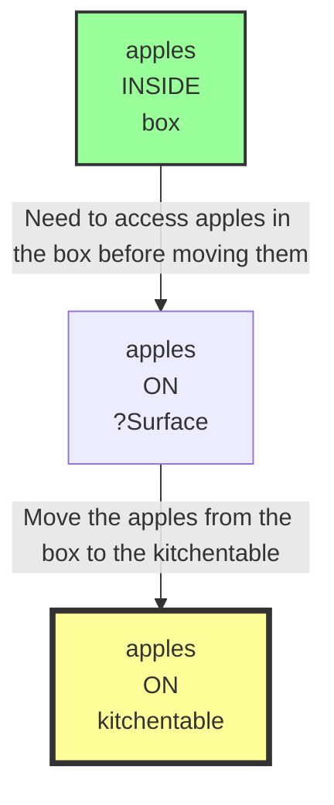
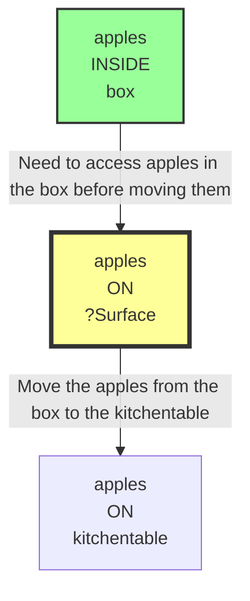
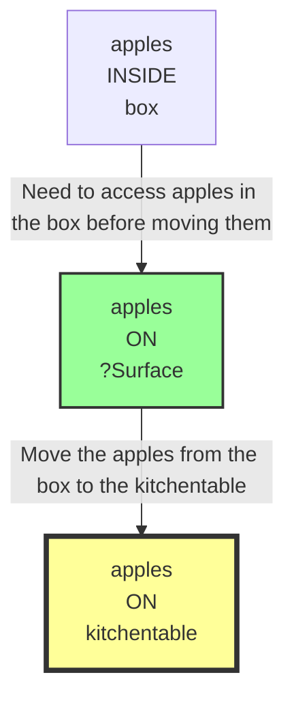
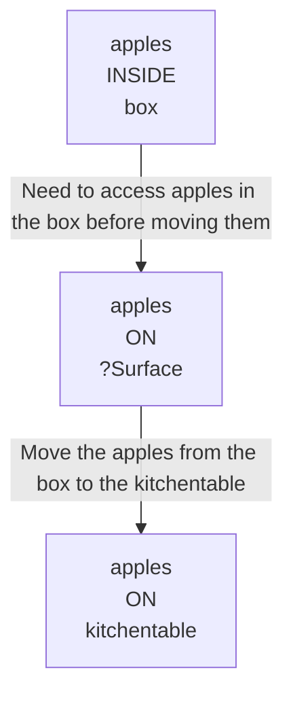

# 🚀 VirtualHome Agent Episode Log


### [GoalReasoner (Module A - Intent)] Output
```json
{
  "is_instruction_obviously_vague": false,
  "clarification_question": null,
  "target_object": "apples",
  "location_hint": "box",
  "reasoning_chain": [
    {
      "question": "Why does the user want this object?",
      "answer": "To move all apples from the box to the kitchen table if they are present."
    },
    {
      "question": "Why is that important?",
      "answer": "So the apples are gathered at a more convenient location for use, storage, or access."
    },
    {
      "question": "What fundamental need does this fulfill?",
      "answer": "It helps organize or relocate edible items for later handling."
    },
    {
      "question": "Are there any deeper psychological or physical motivations?",
      "answer": "The user may want to prepare food for easy access, reduce clutter, or manage household items efficiently."
    }
  ],
  "deep_intent": "The user wants to organize and relocate edible items for convenient access or later use.",
  "acceptable_alternatives_properties": [
    {
      "priority": 1,
      "description": "Other fresh fruits that can be moved and placed on the kitchen table, such as oranges, bananas, or pears"
    },
    {
      "priority": 2,
      "description": "Other similar produce items stored in the box that are meant for eating"
    },
    {
      "priority": 3,
      "description": "Ready-to-eat snack foods or packaged edible items that can be relocated for convenient access"
    },
    {
      "priority": 4,
      "description": "Other household food items that can be gathered to the kitchen table for later use"
    }
  ]
}
```

### [PerceptionFilter] Output
```json
{
  "reasoning": "The goal is to move apples from the box to the kitchen table. The required objects are the target item apples, the source location box, and the destination location kitchentable. No extra tools are needed because this is a simple relocation task.",
  "selected_classes": [
    "kitchentable",
    "box",
    "bananas",
    "character",
    "apple"
  ],
  "raw_class_count": 112
}
```

### [LLMExecutor] Output
```json
{
  "reasoning": "The apples we need are already in hand: apple(437) and apple(438) are both held by the character. The target container/surface for the SDG is the kitchentable(231) in the kitchen. Since putback requires being explicitly walked to the destination first, the next atomic step is to move to the kitchen table before placing any apple there. This advances N1 toward satisfying N3 after the apples are accessible from the box context.",
  "satisfied_nodes": [
    "N2"
  ],
  "current_node_focus": "N3",
  "mapped_variables": {},
  "action": "[walk] <kitchentable> (231)"
}
```
## Step 0
- **Action**: `[walk] <kitchentable> (231)`
- **SDG Status**:

- **Observed Items (15)**: character(1), bathroom(11), bedroom(73), box(192) [CLOSED], kitchen(205), kitchentable(231), box(287) [CLOSED], box(300) [CLOSED], bananas(315), bananas(316), livingroom(335), box(435) [CLOSED], apple(437), apple(438), bananas(439)


### [PerceptionFilter] Output
```json
{
  "reasoning": "The goal is to move apples from the box to the kitchen table. The only strictly necessary object classes are the target item apples, the source receptacle box, and the destination location kitchentable. No tool is required for simple relocation.",
  "selected_classes": [
    "kitchentable",
    "box",
    "apples",
    "bananas",
    "character",
    "apple"
  ],
  "raw_class_count": 112
}
```

### [LLMExecutor] Output
```json
{
  "reasoning": "The character is already holding both apples (437 and 438) and is close to the kitchentable(231), so the next progress-making step is to place one apple onto the kitchen table. This directly satisfies the ON relation for apples on a surface, advancing toward the final state of apples on the kitchentable. The box relation is already effectively bypassed because the apples are in hand and the task is relocation rather than keeping them in the box.",
  "satisfied_nodes": [
    "N2"
  ],
  "current_node_focus": "N1",
  "mapped_variables": {},
  "action": "[putback] <apple> (437) <kitchentable> (231)"
}
```
## Step 1
- **Action**: `[putback] <apple> (437) <kitchentable> (231)`
- **SDG Status**:

- **Observed Items (15)**: character(1), bathroom(11), bedroom(73), box(192) [CLOSED], kitchen(205), kitchentable(231), box(287) [CLOSED], box(300) [CLOSED], bananas(315), bananas(316), livingroom(335), box(435) [CLOSED], apple(437), apple(438), bananas(439)


### [PerceptionFilter] Output
```json
{
  "reasoning": "Need the target apples, the source location box, and the destination kitchen table. No tool is required because the task is just relocating items.",
  "selected_classes": [
    "kitchentable",
    "box",
    "apples",
    "bananas",
    "character",
    "apple"
  ],
  "raw_class_count": 112
}
```

### [LLMExecutor] Output
```json
{
  "reasoning": "One apple is already on the kitchentable, satisfying the ON relation for apple(437). The remaining accessible apple(438) is still held and close to the character, and the character is already close to the kitchentable(231). To further satisfy the goal of moving apples from the box to the kitchen table, the next atomic step is to place the held apple onto the kitchentable. This advances the relocation task without needing any additional walking.",
  "satisfied_nodes": [
    "N1"
  ],
  "current_node_focus": "N3",
  "mapped_variables": {
    "?Surface": "kitchentable(231)"
  },
  "action": "[putback] <apple> (438) <kitchentable> (231)"
}
```
## Step 2
- **Action**: `[putback] <apple> (438) <kitchentable> (231)`
- **SDG Status**:

- **Observed Items (15)**: character(1), bathroom(11), bedroom(73), box(192) [CLOSED], kitchen(205), kitchentable(231), box(287) [CLOSED], box(300) [CLOSED], bananas(315), bananas(316), livingroom(335), box(435) [CLOSED], apple(437), apple(438), bananas(439)


### [PerceptionFilter] Output
```json
{
  "reasoning": "Need the target apples, the source location box, the destination kitchentable, and the immediate movable item classes that match the goal’s allowed produce alternatives in case the visible items in the box are not all apples.",
  "selected_classes": [
    "kitchentable",
    "box",
    "plum",
    "lime",
    "apples",
    "peach",
    "bananas",
    "character",
    "bellpepper",
    "apple"
  ],
  "raw_class_count": 112
}
```
## Step 3
- **Action**: `FINISH (Goal Reached)`
- **SDG Status**:

- **Observed Items (26)**: character(1), bathroom(11), bedroom(73), box(192) [CLOSED], kitchen(205), kitchentable(231), box(287) [CLOSED], box(300) [CLOSED], bananas(315), bananas(316), bellpepper(320), bellpepper(321), bellpepper(322), bellpepper(323), bellpepper(324)...

