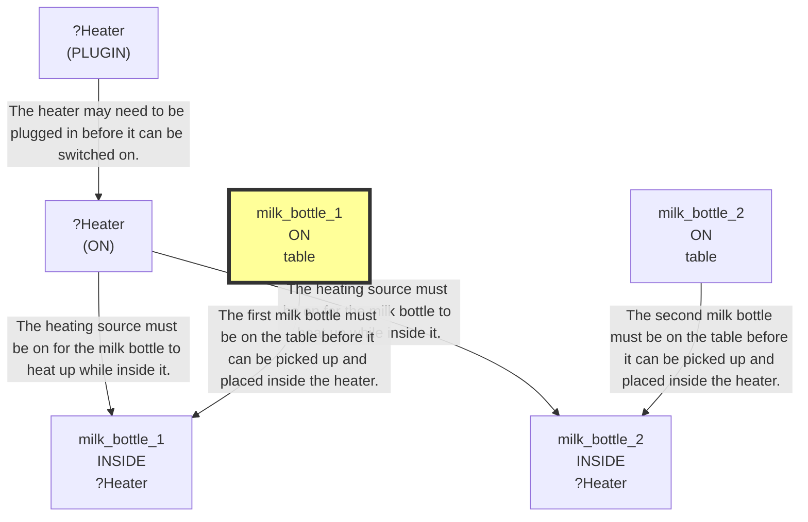
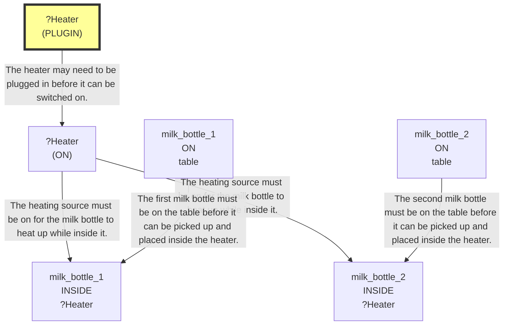
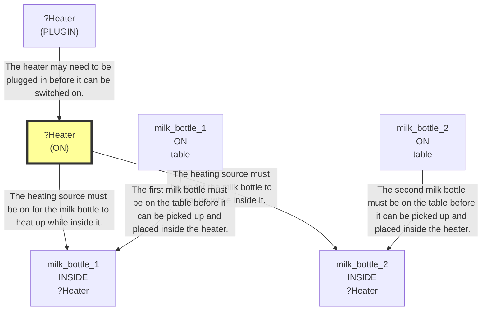
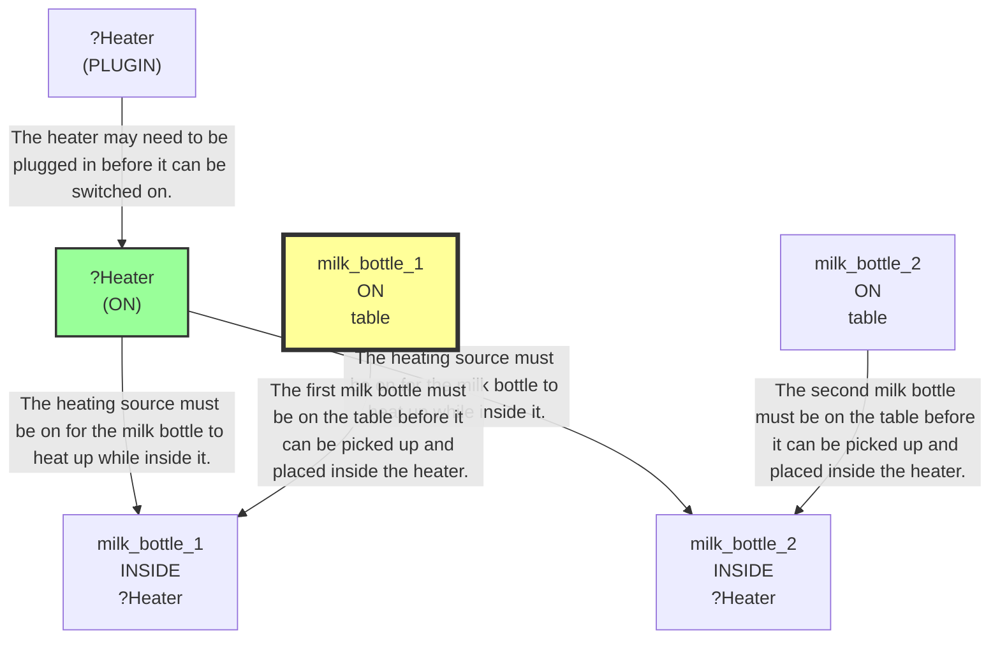
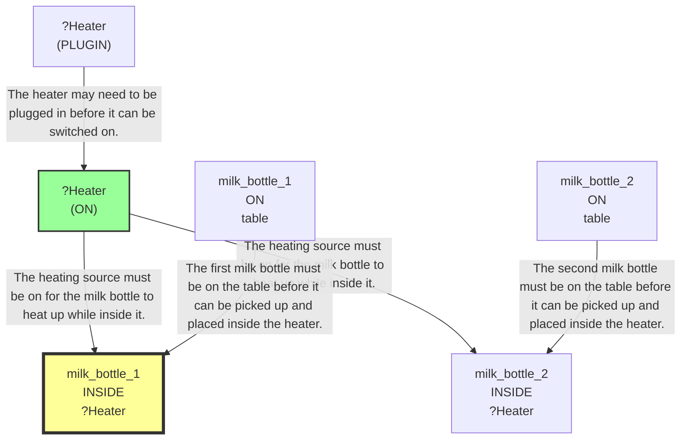
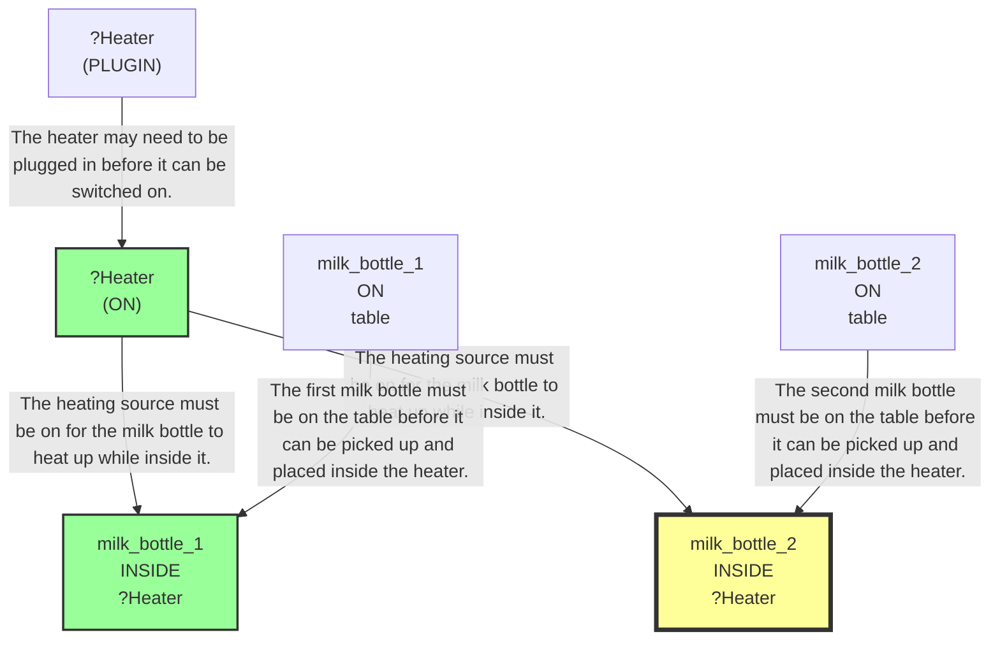
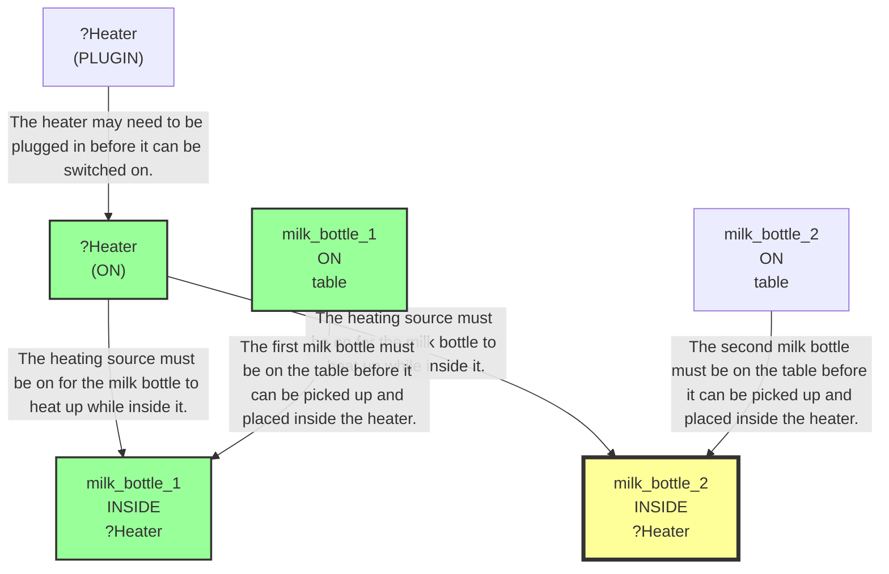
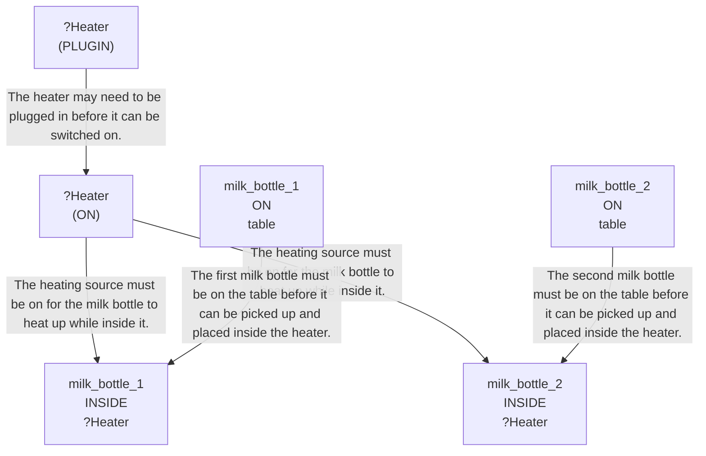

# 🚀 VirtualHome Agent Episode Log


### [GoalReasoner (Module A - Intent)] Output
```json
{
  "is_instruction_obviously_vague": false,
  "clarification_question": null,
  "target_object": "bottles of milk",
  "location_hint": "table",
  "reasoning_chain": [
    {
      "question": "Why does the user want this object?",
      "answer": "To warm the milk."
    },
    {
      "question": "Why is that important?",
      "answer": "So the milk becomes heated and ready for use or consumption."
    },
    {
      "question": "What fundamental need does this fulfill?",
      "answer": "It supports the need to have a warm beverage or food ingredient."
    },
    {
      "question": "Are there any deeper psychological or physical motivations?",
      "answer": "The user likely wants comfort, convenience, or a preferred temperature for drinking or preparing the milk."
    }
  ],
  "deep_intent": "The user wants to heat a beverage or food ingredient to a warm temperature.",
  "acceptable_alternatives_properties": [
    {
      "priority": 1,
      "description": "Other drink containers with similar liquid contents that can be safely warmed, such as a cup of milk or a mug of hot chocolate"
    },
    {
      "priority": 2,
      "description": "Other dairy or liquid beverage items that are typically heated, such as cream or a small carton of drinkable liquid"
    },
    {
      "priority": 3,
      "description": "Microwave-safe liquid foods or drinks that provide warmth and comfort, such as soup or broth"
    },
    {
      "priority": 4,
      "description": "Other warm consumable items that satisfy the same comfort/temperature goal, such as tea or coffee"
    }
  ]
}
```

### [PerceptionFilter] Output
```json
{
  "reasoning": "Need the target milk bottles, the location they are on (table), and all plausible heating appliances required by the SDG and alternatives retention: microwave and stove are the main heat tools, with fridge included as a possible source/related appliance for milk handling. Also need the power source implied by the heater state dependency: powersocket.",
  "selected_classes": [
    "character",
    "stove",
    "powersocket",
    "table",
    "mug",
    "milk",
    "fridge",
    "microwave"
  ],
  "raw_class_count": 99
}
```

### [LLMExecutor] Output
```json
{
  "reasoning": "The goal requires two milk bottles to be inside a heater, and the heater must be ON and plugged in. The current graph shows two close milk bottles (176, 177) in the kitchen, but no heater is explicitly listed. Since the task specifically targets milk bottles and the first prerequisite is to get them onto the table before heating, the next most progress-making step is to approach one of the milk bottles so it can be picked up. Because both bottles are already close, I will start with milk(176) as the first item to satisfy N5 before later grabbing the second bottle and finding the heater.",
  "satisfied_nodes": [],
  "current_node_focus": "N5",
  "mapped_variables": {
    "?Heater": "microwave(171)"
  },
  "action": "[walk] <milk> (176)"
}
```
## Step 0
- **Action**: `[walk] <milk> (176)`
- **SDG Status**:

- **Observed Items (15)**: character(1), kitchen(11), powersocket(57), fridge(162) [CLOSED], stove(163) [OFF,CLOSED], microwave(171) [CLOSED,OFF], milk(176) [CLOSED], milk(177) [CLOSED], livingroom(183), powersocket(240), bedroom(241), powersocket(279), bathroom(285), bedroom(346), mug(384)


### [PerceptionFilter] Output
```json
{
  "reasoning": "The goal is to warm milk, so we must keep the target milk and the heating appliance needed by the SDG. The SDG requires a heater that is plugged in and on; from the visible objects, microwave and stove are the functional heating alternatives to retain. The location hint and SDG explicitly mention the table, so it must be included as the required location/receptacle.",
  "selected_classes": [
    "character",
    "stove",
    "table",
    "mug",
    "milk",
    "microwave"
  ],
  "raw_class_count": 99
}
```

### [LLMExecutor] Output
```json
{
  "reasoning": "The task requires a heater that is ON and plugged in, with both milk bottles inside it. The filtered graph reveals the best heater candidate is microwave(171), which has HAS_PLUG and CAN_OPEN; it is currently CLOSED and OFF, so the next prerequisite toward heating is to open it before placing milk inside. I am already close to the milk bottles, but I have not yet interacted with the microwave. No SDG node is satisfied yet because the milk is not on the table, not inside the heater, and the heater is not on or plugged in.",
  "satisfied_nodes": [],
  "current_node_focus": "N4",
  "mapped_variables": {
    "?Heater": "microwave(171)"
  },
  "action": "[open] <microwave> (171)"
}
```
## Step 1
- **Action**: `[open] <microwave> (171)`
- **SDG Status**:

- **Observed Items (11)**: character(1), kitchen(11), stove(163) [OFF,CLOSED], microwave(171) [CLOSED,OFF], milk(176) [CLOSED], milk(177) [CLOSED], livingroom(183), bedroom(241), bathroom(285), bedroom(346), mug(384)


### [PerceptionFilter] Output
```json
{
  "reasoning": "The goal is to heat milk bottles. The SDG requires the target milk bottles, the heating appliance that can act as ?Heater, and the table where the bottles are currently located. Since alternatives and backups must be retained, both heating appliances visible in the scene are kept: microwave and stove.",
  "selected_classes": [
    "character",
    "stove",
    "table",
    "mug",
    "milk",
    "microwave"
  ],
  "raw_class_count": 99
}
```

### [LLMExecutor] Output
```json
{
  "reasoning": "The heater candidate is microwave(171), which is already open but still OFF. To satisfy the heater-on prerequisite (N3) for heating the milk bottles, the next progress-making step is to switch it on. It also has HAS_PLUG, so the power prerequisite N4 is relevant, but there is no separate plugged-in state shown yet; however, the immediate actionable step toward the SDG is turning the microwave on now that we are already close to it.",
  "satisfied_nodes": [],
  "current_node_focus": "N3",
  "mapped_variables": {
    "?Heater": "microwave(171)"
  },
  "action": "[switchon] <microwave> (171)"
}
```
## Step 2
- **Action**: `[switchon] <microwave> (171)`
- **SDG Status**:

- **Observed Items (11)**: character(1), kitchen(11), stove(163) [OFF,CLOSED], microwave(171) [OPEN,OFF], milk(176) [CLOSED], milk(177) [CLOSED], livingroom(183), bedroom(241), bathroom(285), bedroom(346), mug(384)


### [PerceptionFilter] Output
```json
{
  "reasoning": "The goal is to warm milk bottles on the table. The target object class is milk, and the SDG requires a heater appliance that is plugged in and on. Since the exact heater type is abstract, the visible physical heating alternatives to retain are microwave, stove, and coffeemaker. The location explicitly mentioned is table, so it must be kept.",
  "selected_classes": [
    "character",
    "stove",
    "table",
    "mug",
    "milk",
    "microwave",
    "coffeemaker"
  ],
  "raw_class_count": 99
}
```

### [LLMExecutor] Output
```json
{
  "reasoning": "The heater candidate microwave(171) is already ON and OPEN, so the heater prerequisite is satisfied. The remaining gap is to place the milk bottles inside it, but before I can do that I need to obtain the milk bottles themselves and they are currently not held. I should continue by approaching one milk bottle so it can be grabbed next. Since I just walked to milk earlier in the episode but the current graph shows I am only close to the microwave, the most direct next step toward satisfying N5/N6 is to walk to the milk bottle that is available in the kitchen. I will choose milk(176) as the first bottle to progress toward moving both bottles into the microwave.",
  "satisfied_nodes": [
    "N3"
  ],
  "current_node_focus": "N5",
  "mapped_variables": {
    "?Heater": "microwave(171)"
  },
  "action": "[walk] <milk> (176)"
}
```
## Step 3
- **Action**: `[walk] <milk> (176)`
- **SDG Status**:

- **Observed Items (12)**: character(1), kitchen(11), stove(163) [OFF,CLOSED], coffeemaker(169) [OFF], microwave(171) [OPEN,ON], milk(176) [CLOSED], milk(177) [CLOSED], livingroom(183), bedroom(241), bathroom(285), bedroom(346), mug(384)


### [PerceptionFilter] Output
```json
{
  "reasoning": "The goal is to warm milk, so we must keep the target milk and the heating appliance(s) needed to heat it. The SDG requires a heater that is ON and plugged in; among the visible objects, microwave and stove are the relevant heating alternatives. The location hint and SDG explicitly mention the table, so it must be retained as the place the milk bottles are on.",
  "selected_classes": [
    "character",
    "stove",
    "table",
    "mug",
    "milk",
    "microwave"
  ],
  "raw_class_count": 99
}
```

### [LLMExecutor] Output
```json
{
  "reasoning": "The heater candidate microwave(171) is already ON and has the required plug state available, so the remaining gap is moving both milk bottles into it. The current graph shows I am close to milk(176) and milk(177), but I am not holding either one yet. Since the last action was a walk to milk(176), I should not repeat another walk action immediately. The next atomic step toward N5/N6 is to grab one milk bottle, starting with milk(176), which is the first item needed before later placing both bottles inside the microwave.",
  "satisfied_nodes": [
    "N3"
  ],
  "current_node_focus": "N5",
  "mapped_variables": {
    "?Heater": "microwave(171)"
  },
  "action": "[grab] <milk> (176)"
}
```
## Step 4
- **Action**: `[grab] <milk> (176)`
- **SDG Status**:

- **Observed Items (11)**: character(1), kitchen(11), stove(163) [OFF,CLOSED], microwave(171) [OPEN,ON], milk(176) [CLOSED], milk(177) [CLOSED], livingroom(183), bedroom(241), bathroom(285), bedroom(346), mug(384)


### [PerceptionFilter] Output
```json
{
  "reasoning": "The goal is to warm milk, so the target item class is milk. The SDG requires a heater that is plugged in and on; among the visible objects, the only relevant heating appliances are microwave, stove, and coffeemaker as potential functional alternatives/backups. The milk is explicitly on the table, so table must be retained as the location reference.",
  "selected_classes": [
    "character",
    "stove",
    "table",
    "mug",
    "milk",
    "microwave",
    "coffeemaker"
  ],
  "raw_class_count": 99
}
```

### [LLMExecutor] Output
```json
{
  "reasoning": "Milk(176) is already held in the right hand, and the microwave(171) is the chosen heater candidate. The heater is already ON and OPEN, so the next missing SDG step toward heating the milk is to place the held milk bottle inside the microwave. Because putin requires being near the destination and we are not explicitly shown as close to the microwave in the current graph, the immediate next atomic action should be to walk to the microwave before any putin action.",
  "satisfied_nodes": [
    "N3"
  ],
  "current_node_focus": "N1",
  "mapped_variables": {
    "?Heater": "microwave(171)"
  },
  "action": "[walk] <microwave> (171)"
}
```
## Step 5
- **Action**: `[walk] <microwave> (171)`
- **SDG Status**:

- **Observed Items (12)**: character(1), kitchen(11), stove(163) [OFF,CLOSED], coffeemaker(169) [OFF], microwave(171) [OPEN,ON], milk(176) [CLOSED], milk(177) [CLOSED], livingroom(183), bedroom(241), bathroom(285), bedroom(346), mug(384)


### [PerceptionFilter] Output
```json
{
  "reasoning": "The goal is to warm milk bottles, so we must keep the target milk and the heating appliance required by the SDG. Because the heater is abstract, the visible matching heating tools should be retained as alternatives/backups: microwave, stove, and coffeemaker. The SDG also explicitly requires a table for the milk bottles to be on before heating, so table is included.",
  "selected_classes": [
    "character",
    "stove",
    "table",
    "mug",
    "milk",
    "microwave",
    "coffeemaker"
  ],
  "raw_class_count": 99
}
```

### [LLMExecutor] Output
```json
{
  "reasoning": "Milk(176) is already held in the right hand, and the microwave(171) is the selected heater. It is OPEN and ON, so the remaining gap for N1 is to place the milk inside it. Since I am already CLOSE to the microwave in the filtered graph, the next atomic action can be to put the held milk bottle into the microwave.",
  "satisfied_nodes": [
    "N3"
  ],
  "current_node_focus": "N1",
  "mapped_variables": {
    "?Heater": "microwave(171)"
  },
  "action": "[putin] <milk> (176) <microwave> (171)"
}
```
## Step 6
- **Action**: `[putin] <milk> (176) <microwave> (171)`
- **SDG Status**:

- **Observed Items (12)**: character(1), kitchen(11), stove(163) [OFF,CLOSED], coffeemaker(169) [OFF], microwave(171) [OPEN,ON], milk(176) [CLOSED], milk(177) [CLOSED], livingroom(183), bedroom(241), bathroom(285), bedroom(346), mug(384)


### [PerceptionFilter] Output
```json
{
  "reasoning": "The goal is to heat milk, so we must keep the target item class milk and the heating appliance options that can serve as the heater. The SDG requires the milk bottles to be on the table and inside a heater that is plugged in and on. Since the exact class 'heater' is not visible, the relevant heating alternatives in the environment are microwave and stove. The table is also required by the SDG as the placement location before heating.",
  "selected_classes": [
    "character",
    "stove",
    "table",
    "mug",
    "milk",
    "microwave"
  ],
  "raw_class_count": 99
}
```

### [LLMExecutor] Output
```json
{
  "reasoning": "Milk(176) is already inside the selected heater microwave(171), which is ON and OPEN, so N1 is satisfied. The remaining unmet requirements are to heat the second milk bottle, but milk(177) is still in the kitchen and has not yet been moved into the microwave. Since the microwave is already the correct heater and no additional heater setup is needed right now, the best next atomic step is to get the second bottle by walking to it before grabbing it.",
  "satisfied_nodes": [
    "N1",
    "N3"
  ],
  "current_node_focus": "N2",
  "mapped_variables": {
    "?Heater": "microwave(171)"
  },
  "action": "[walk] <milk> (177)"
}
```
## Step 7
- **Action**: `[walk] <milk> (177)`
- **SDG Status**:

- **Observed Items (11)**: character(1), kitchen(11), stove(163) [OFF,CLOSED], microwave(171) [OPEN,ON], milk(176) [HOT,CLOSED], milk(177) [CLOSED], livingroom(183), bedroom(241), bathroom(285), bedroom(346), mug(384)


### [PerceptionFilter] Output
```json
{
  "reasoning": "The goal is to heat milk, so the target object class milk must be kept. The SDG requires a heater appliance that is ON and plugged in; in the observed objects, microwave and stove are the relevant heating alternatives to retain as functional backups. The milk is specified to be on a table, so table must be kept for the location dependency.",
  "selected_classes": [
    "character",
    "stove",
    "table",
    "mug",
    "milk",
    "microwave"
  ],
  "raw_class_count": 99
}
```

### [LLMExecutor] Output
```json
{
  "reasoning": "Milk(176) is already inside the microwave and marked HOT, so N1 is satisfied. The heater microwave(171) is ON, satisfying N3, and it is already open. The remaining unmet SDG node that can be progressed without repeating the same walk is to obtain the second milk bottle and eventually place it inside the heater. The character is already close to milk(177), so the next atomic step is to grab it.",
  "satisfied_nodes": [
    "N1",
    "N3"
  ],
  "current_node_focus": "N2",
  "mapped_variables": {
    "?Heater": "microwave(171)"
  },
  "action": "[grab] <milk> (177)"
}
```
## Step 8
- **Action**: `[grab] <milk> (177)`
- **SDG Status**:

- **Observed Items (11)**: character(1), kitchen(11), stove(163) [OFF,CLOSED], microwave(171) [OPEN,ON], milk(176) [HOT,CLOSED], milk(177) [CLOSED], livingroom(183), bedroom(241), bathroom(285), bedroom(346), mug(384)


### [PerceptionFilter] Output
```json
{
  "reasoning": "The goal is to heat milk. The target object class present is milk, and the SDG requires a heater appliance that is ON and plugged in. From the visible objects, the matching heating appliances are microwave, stove, and coffeemaker as potential functional alternatives for warming liquid items. The milk bottles are indicated to be on the table, so table must be retained as the location.",
  "selected_classes": [
    "character",
    "stove",
    "table",
    "mug",
    "milk",
    "microwave",
    "coffeemaker"
  ],
  "raw_class_count": 99
}
```

### [LLMExecutor] Output
```json
{
  "reasoning": "Milk(177) is already held in the right hand and is close to the character. The current heater candidate microwave(171) is ON and OPEN, so the remaining gap for the SDG is to place the second milk bottle inside it. Since I just performed a grab and am already adjacent to milk(177), the next atomic step should be to walk to the microwave before any putin action. N1 is already satisfied by milk(176) inside the microwave; N3 is satisfied because the microwave is ON.",
  "satisfied_nodes": [
    "N1",
    "N3"
  ],
  "current_node_focus": "N2",
  "mapped_variables": {
    "?Heater": "microwave(171)"
  },
  "action": "[walk] <microwave> (171)"
}
```
## Step 9
- **Action**: `[walk] <microwave> (171)`
- **SDG Status**:

- **Observed Items (12)**: character(1), kitchen(11), stove(163) [OFF,CLOSED], coffeemaker(169) [OFF], microwave(171) [OPEN,ON], milk(176) [HOT,CLOSED], milk(177) [CLOSED], livingroom(183), bedroom(241), bathroom(285), bedroom(346), mug(384)


### [PerceptionFilter] Output
```json
{
  "reasoning": "The goal is to heat milk, so we need the target object class milk and at least one heating appliance. The SDG specifically requires a heater that is ON and plugged in; among the visible objects, the relevant heating appliances are microwave and stove, so both should be kept as functional alternatives. The milk bottles are indicated to be on the table, so table is also needed as the location/receptacle for the target items.",
  "selected_classes": [
    "character",
    "stove",
    "table",
    "mug",
    "milk",
    "microwave"
  ],
  "raw_class_count": 99
}
```

### [LLMExecutor] Output
```json
{
  "reasoning": "Milk(177) is already held, the heater candidate microwave(171) is open and ON, and milk(176) is already inside it. The remaining unmet core SDG step is to place the second milk bottle into the heater. Since the previous action was a walk to the microwave and we are currently close to it, the next atomic action is to put the held milk bottle into the microwave.",
  "satisfied_nodes": [
    "N1",
    "N3",
    "N5"
  ],
  "current_node_focus": "N2",
  "mapped_variables": {
    "?Heater": "microwave(171)"
  },
  "action": "[putin] <milk> (177) <microwave> (171)"
}
```
## Step 10
- **Action**: `[putin] <milk> (177) <microwave> (171)`
- **SDG Status**:

- **Observed Items (11)**: character(1), kitchen(11), stove(163) [OFF,CLOSED], microwave(171) [OPEN,ON], milk(176) [HOT,CLOSED], milk(177) [CLOSED], livingroom(183), bedroom(241), bathroom(285), bedroom(346), mug(384)


### [PerceptionFilter] Output
```json
{
  "reasoning": "The goal is to heat milk, so we need the target milk item and a valid heating appliance. The SDG specifically requires the milk bottles to be on the table before being placed inside the heater, and the heater to be plugged in and on. From the visible objects, the relevant heater options are microwave, stove, and coffeemaker as possible heating appliances/backups. The exact target class present is milk.",
  "selected_classes": [
    "character",
    "stove",
    "table",
    "mug",
    "milk",
    "microwave",
    "coffeemaker"
  ],
  "raw_class_count": 99
}
```
## Step 11
- **Action**: `FINISH (Goal Reached)`
- **SDG Status**:

- **Observed Items (12)**: character(1), kitchen(11), stove(163) [OFF,CLOSED], coffeemaker(169) [OFF], microwave(171) [OPEN,ON], milk(176) [HOT,CLOSED], milk(177) [HOT,CLOSED], livingroom(183), bedroom(241), bathroom(285), bedroom(346), mug(384)

