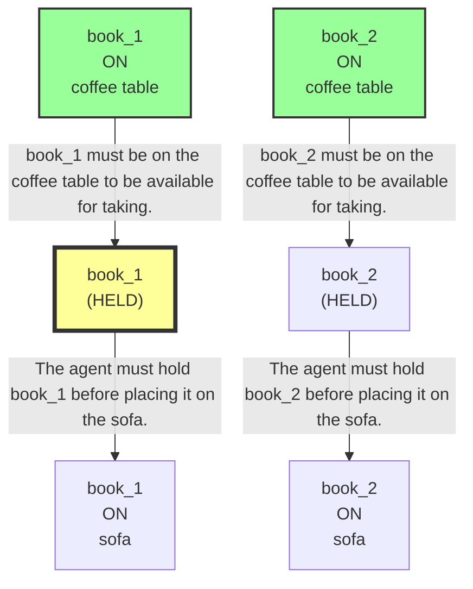
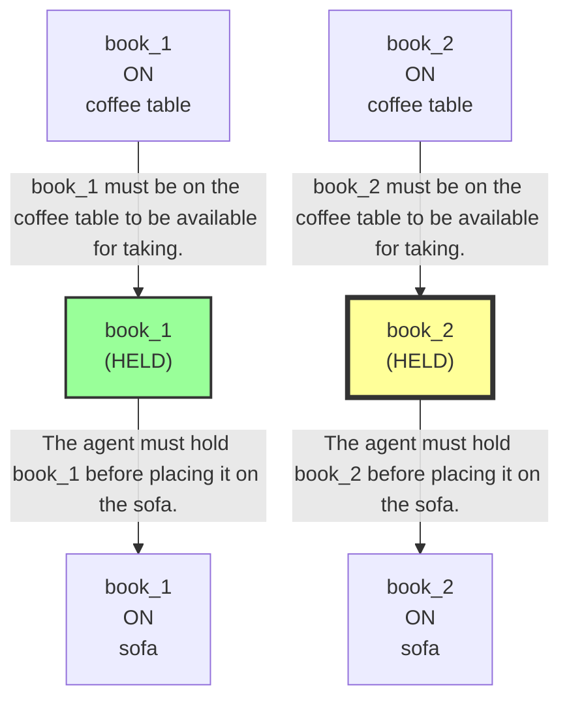
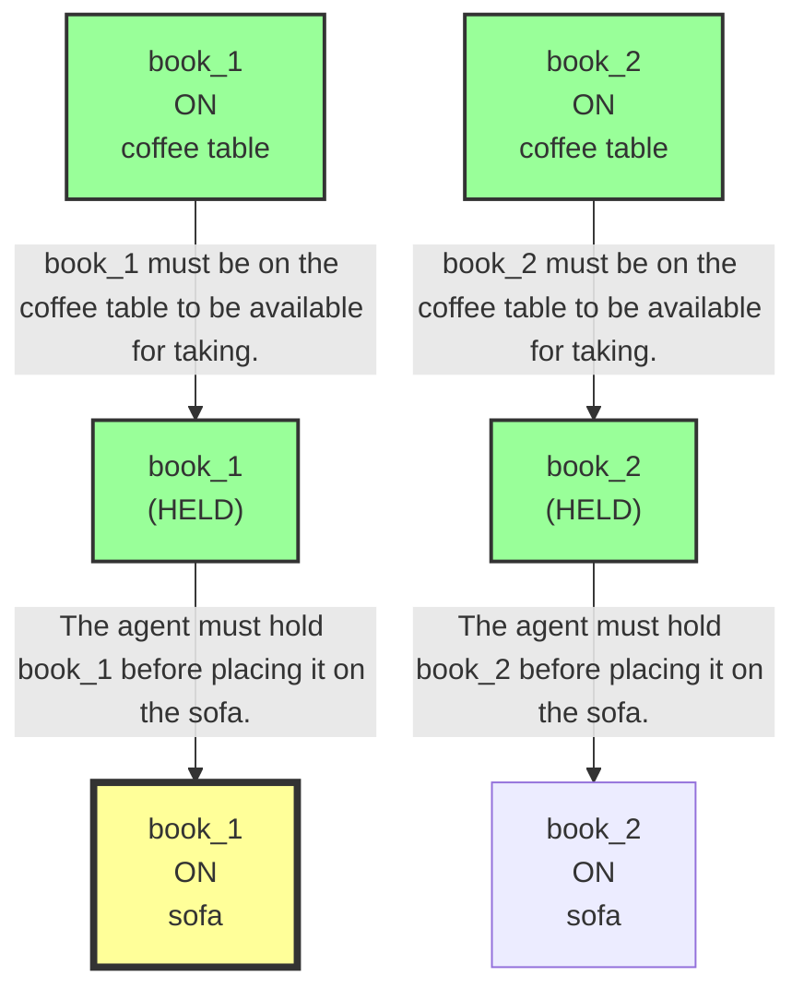
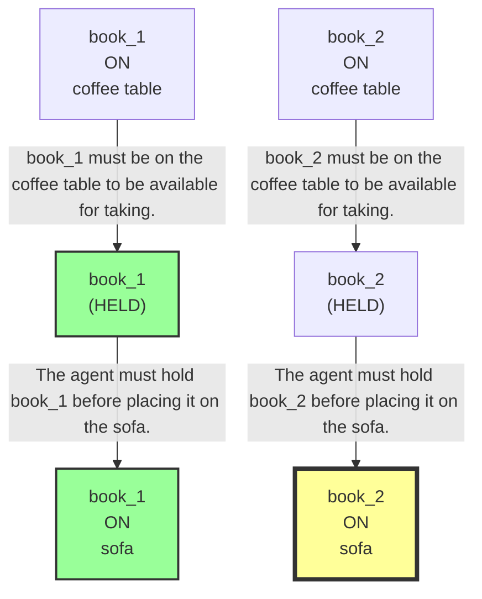
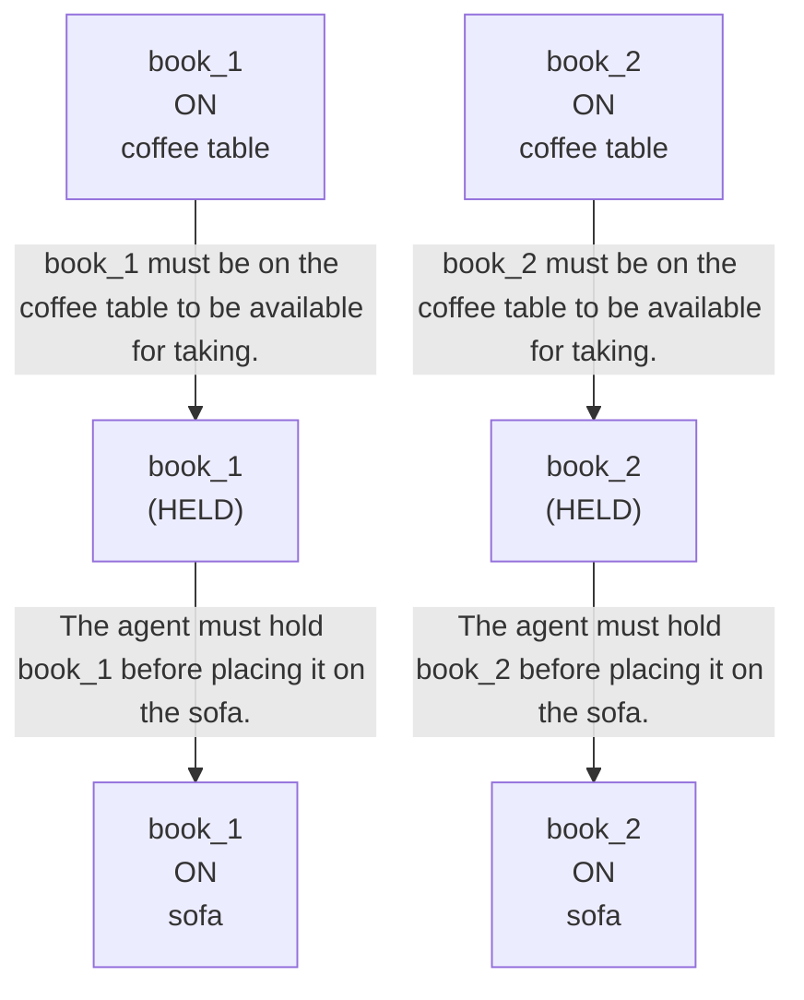

# 🚀 VirtualHome Agent Episode Log


### [GoalReasoner (Module A - Intent)] Output
```json
{
  "is_instruction_obviously_vague": false,
  "clarification_question": null,
  "target_object": "books",
  "location_hint": "coffee table",
  "reasoning_chain": [
    {
      "question": "Why does the user want this object?",
      "answer": "To move the books from the coffee table to the sofa."
    },
    {
      "question": "Why is that important?",
      "answer": "To change the books' location so they are placed where the user specified."
    },
    {
      "question": "What fundamental need does this fulfill?",
      "answer": "It fulfills the need to organize or relocate items within the room."
    },
    {
      "question": "Are there any deeper psychological or physical motivations?",
      "answer": "The user may want the nearby area cleared or the books made easier to access from the sofa."
    }
  ],
  "deep_intent": "The user wants to relocate items within the room to improve organization or accessibility.",
  "acceptable_alternatives_properties": [
    {
      "priority": 1,
      "description": "Other similarly sized readable items or documents that can be moved together from one surface to another"
    },
    {
      "priority": 2,
      "description": "Lightweight household reading materials such as magazines, notebooks, or papers"
    },
    {
      "priority": 3,
      "description": "Small portable household items that can be gathered and relocated as a set"
    },
    {
      "priority": 4,
      "description": "Any two nearby handheld items that the user may want consolidated onto the sofa if the exact books are unavailable"
    }
  ]
}
```

### [PerceptionFilter] Output
```json
{
  "reasoning": "The goal is to move books from the coffee table to the sofa, so the only required classes are the target item and both location furniture classes mentioned in the SDG: book, coffeetable, and sofa. No extra tools are needed because the task is simple relocation.",
  "selected_classes": [
    "paper",
    "coffeetable",
    "sofa",
    "book",
    "character"
  ],
  "raw_class_count": 112
}
```

### [LLMExecutor] Output
```json
{
  "reasoning": "The SDG requires two books to be on the sofa, and both book(190) and book(191) are currently on the coffee table and close to the character. To satisfy N3/N4 next, I need to hold the books before I can place them on the sofa. Since the character is already close to book(190), the best next atomic step is to grab the first book.",
  "satisfied_nodes": [
    "N5",
    "N6"
  ],
  "current_node_focus": "N3",
  "mapped_variables": {},
  "action": "[grab] <book> (190)"
}
```
## Step 0
- **Action**: `[grab] <book> (190)`
- **SDG Status**:

- **Observed Items (14)**: character(1), bathroom(11), bedroom(73), coffeetable(111), book(190) [CLOSED], book(191) [CLOSED], kitchen(205), paper(302), paper(303), livingroom(335), sofa(368), coffeetable(371), paper(450), paper(451)


### [PerceptionFilter] Output
```json
{
  "reasoning": "The goal is to move the books from the coffee table to the sofa. The SDG requires the books, the coffee table as the source location, and the sofa as the destination location. Since the target is books and there are two book instances, we keep the book class plus the relevant furniture locations.",
  "selected_classes": [
    "paper",
    "coffeetable",
    "sofa",
    "book",
    "character"
  ],
  "raw_class_count": 112
}
```

### [LLMExecutor] Output
```json
{
  "reasoning": "book(190) is already held in the right hand, and the SDG still requires book(191) to be held before either book can be placed on the sofa. The character is already close to book(191), so the next atomic step is to grab it. No walk is needed because proximity is already satisfied.",
  "satisfied_nodes": [
    "N3"
  ],
  "current_node_focus": "N4",
  "mapped_variables": {},
  "action": "[grab] <book> (191)"
}
```
## Step 1
- **Action**: `[grab] <book> (191)`
- **SDG Status**:

- **Observed Items (14)**: character(1), bathroom(11), bedroom(73), coffeetable(111), book(190) [CLOSED], book(191) [CLOSED], kitchen(205), paper(302), paper(303), livingroom(335), sofa(368), coffeetable(371), paper(450), paper(451)


### [PerceptionFilter] Output
```json
{
  "reasoning": "The goal is to move the target object class books from the coffee table to the sofa. The SDG requires the books themselves plus the two locations involved: coffee table as the source and sofa as the destination. No other tools or objects are necessary for this relocation task.",
  "selected_classes": [
    "paper",
    "coffeetable",
    "sofa",
    "book",
    "character"
  ],
  "raw_class_count": 112
}
```

### [LLMExecutor] Output
```json
{
  "reasoning": "Both required books are already held, satisfying N3 and N4. The next unmet SDG nodes are the placement relations N1/N2, which require being near the sofa before putting the books down. Since the target surface is the sofa and we are currently in the bedroom near the coffee table, the single next atomic step is to walk to the sofa in the living room.",
  "satisfied_nodes": [
    "N3",
    "N4",
    "N5",
    "N6"
  ],
  "current_node_focus": "N1",
  "mapped_variables": {},
  "action": "[walk] <sofa> (368)"
}
```
## Step 2
- **Action**: `[walk] <sofa> (368)`
- **SDG Status**:

- **Observed Items (14)**: character(1), bathroom(11), bedroom(73), coffeetable(111), book(190) [CLOSED], book(191) [CLOSED], kitchen(205), paper(302), paper(303), livingroom(335), sofa(368), coffeetable(371), paper(450), paper(451)


### [PerceptionFilter] Output
```json
{
  "reasoning": "The task is to move the target object class books from the coffee table to the sofa. The SDG explicitly requires holding the books and placing them on the sofa, so the needed classes are the target item, the source location, and the destination location. Since the visible list only contains book (not a separate books class), the exact visible match is included, along with coffee table and sofa.",
  "selected_classes": [
    "paper",
    "coffeetable",
    "sofa",
    "book",
    "character"
  ],
  "raw_class_count": 112
}
```

### [LLMExecutor] Output
```json
{
  "reasoning": "Both books are already held, and the character is now close to the sofa. The remaining unmet SDG nodes are the placement relations requiring book_1 and book_2 to be on the sofa. The single next atomic action should place one held book onto the sofa; since book(190) is in the right hand and the sofa is a valid flat surface, putting it back satisfies one of the two pending placement goals without violating proximity or hand constraints.",
  "satisfied_nodes": [
    "N3",
    "N4",
    "N5",
    "N6"
  ],
  "current_node_focus": "N1",
  "mapped_variables": {},
  "action": "[putback] <book> (190) <sofa> (368)"
}
```
## Step 3
- **Action**: `[putback] <book> (190) <sofa> (368)`
- **SDG Status**:

- **Observed Items (14)**: character(1), bathroom(11), bedroom(73), coffeetable(111), book(190) [CLOSED], book(191) [CLOSED], kitchen(205), paper(302), paper(303), livingroom(335), sofa(368), coffeetable(371), paper(450), paper(451)


### [PerceptionFilter] Output
```json
{
  "reasoning": "The goal is to move the books from the coffee table to the sofa. The SDG explicitly requires books and the two location/furniture items involved: coffee table and sofa. No extra tools are needed because the books can be picked up and placed directly.",
  "selected_classes": [
    "paper",
    "coffeetable",
    "sofa",
    "book",
    "character"
  ],
  "raw_class_count": 112
}
```

### [LLMExecutor] Output
```json
{
  "reasoning": "book(190) has already been placed on the sofa, satisfying N1. book(191) is still held in the left hand, and the character is already close to the sofa, so the remaining unmet goal is to place book(191) on the sofa. Since the sofa is a valid flat surface and proximity is satisfied, the next atomic step is to put back the held book onto the sofa.",
  "satisfied_nodes": [
    "N1",
    "N3"
  ],
  "current_node_focus": "N2",
  "mapped_variables": {
    "?TargetSurface": "sofa(368)"
  },
  "action": "[putback] <book> (191) <sofa> (368)"
}
```
## Step 4
- **Action**: `[putback] <book> (191) <sofa> (368)`
- **SDG Status**:

- **Observed Items (14)**: character(1), bathroom(11), bedroom(73), coffeetable(111), book(190) [CLOSED], book(191) [CLOSED], kitchen(205), paper(302), paper(303), livingroom(335), sofa(368), coffeetable(371), paper(450), paper(451)


### [PerceptionFilter] Output
```json
{
  "reasoning": "The goal is to move the books from the coffee table to the sofa. The SDG requires the target items (books), the source location (coffee table), and the destination location/furniture (sofa). No extra tools are needed for a simple relocation task.",
  "selected_classes": [
    "paper",
    "coffeetable",
    "sofa",
    "book",
    "character"
  ],
  "raw_class_count": 112
}
```
## Step 5
- **Action**: `FINISH (Goal Reached)`
- **SDG Status**:

- **Observed Items (14)**: character(1), bathroom(11), bedroom(73), coffeetable(111), book(190) [CLOSED], book(191) [CLOSED], kitchen(205), paper(302), paper(303), livingroom(335), sofa(368), coffeetable(371), paper(450), paper(451)

