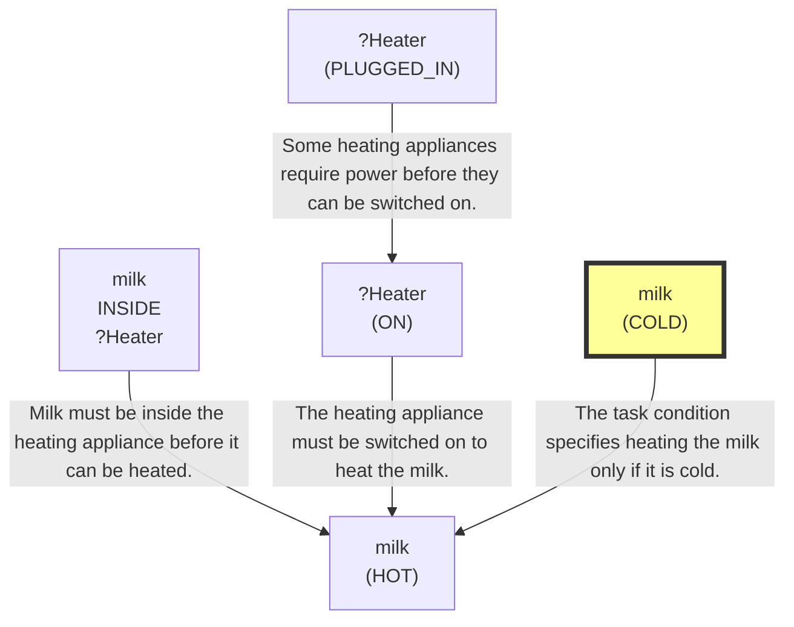
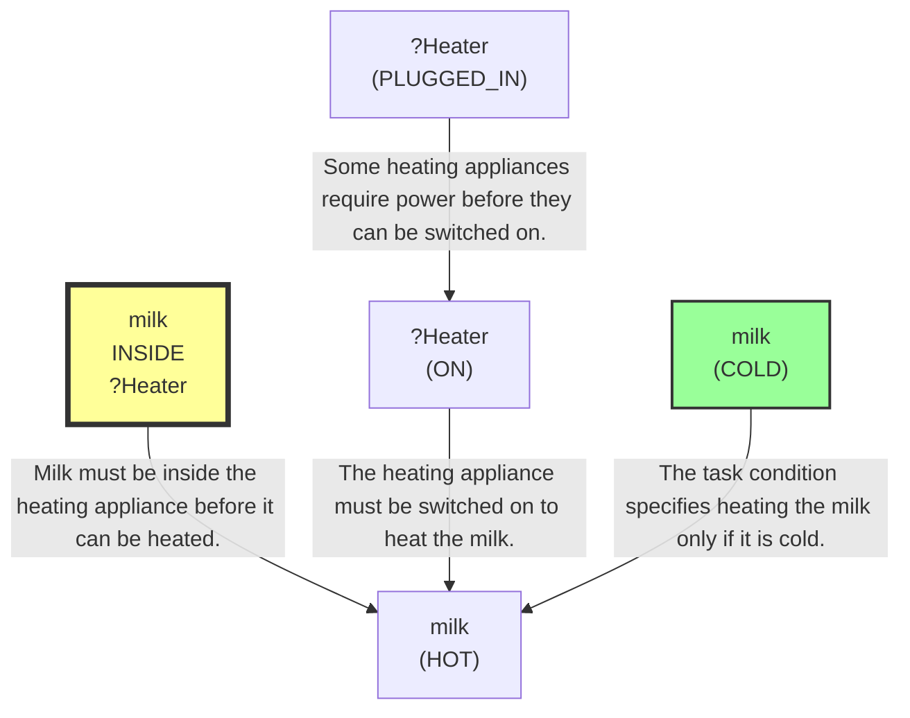
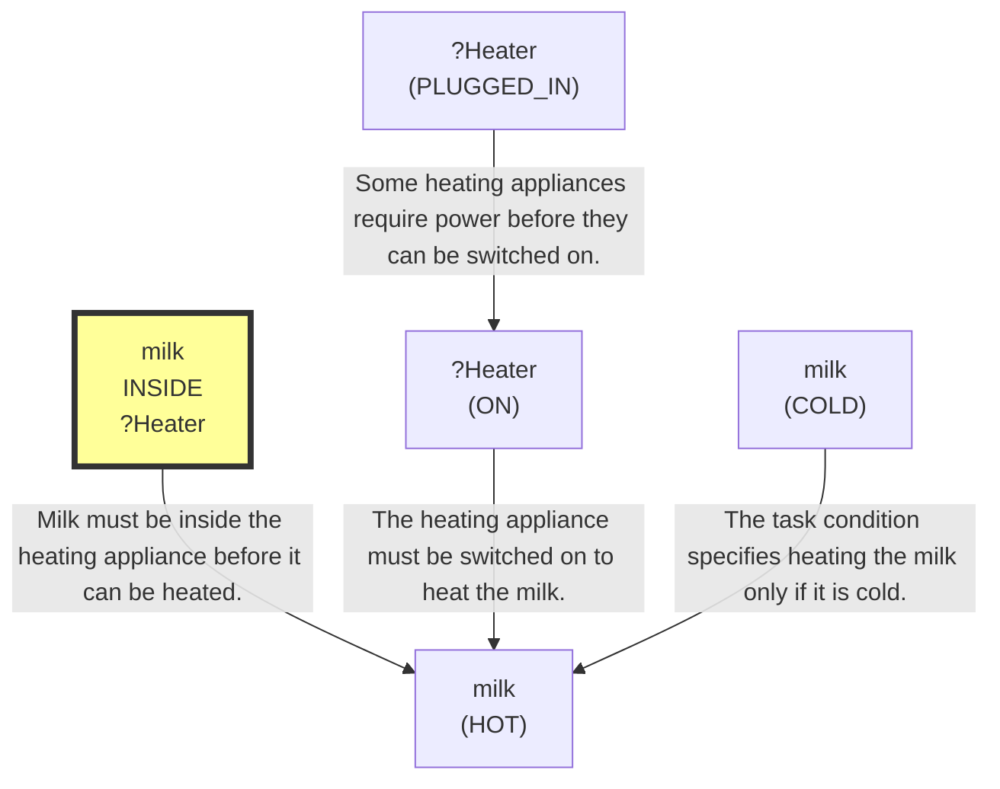
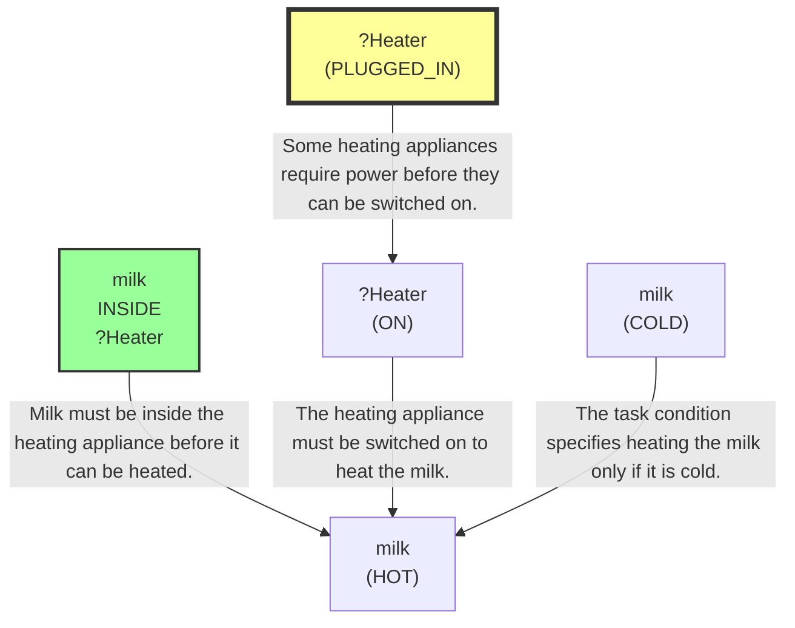
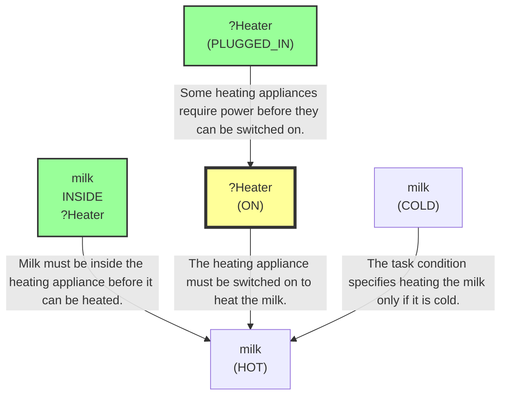
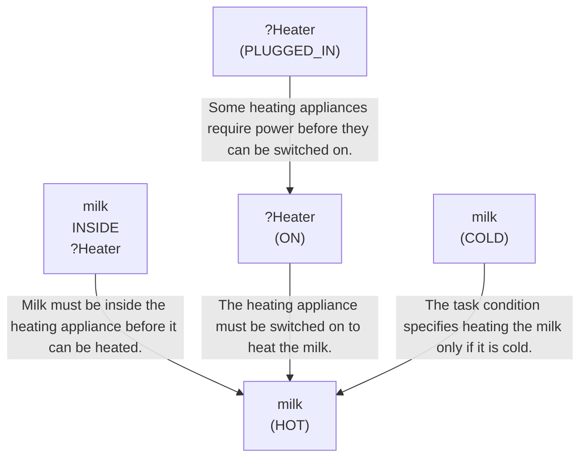

# 🚀 VirtualHome Agent Episode Log


### [GoalReasoner (Module A - Intent)] Output
```json
{
  "is_instruction_obviously_vague": false,
  "clarification_question": null,
  "target_object": "milk",
  "location_hint": null,
  "reasoning_chain": [
    {
      "question": "Why does the user want this object?",
      "answer": "To have the milk in a warmer state if it is currently cold."
    },
    {
      "question": "Why is that important?",
      "answer": "Because the user prefers or needs the milk heated before using or consuming it."
    },
    {
      "question": "What fundamental need does this fulfill?",
      "answer": "It fulfills the need to consume or use a beverage at a desired temperature."
    },
    {
      "question": "Are there any deeper psychological or physical motivations?",
      "answer": "The motivation is likely comfort, preference, or making the drink suitable for immediate consumption."
    }
  ],
  "deep_intent": "The user wants a beverage warmed to a desired temperature.",
  "acceptable_alternatives_properties": [
    {
      "priority": 1,
      "description": "Other pourable beverages that can be safely warmed, such as plant-based milk or prepared hot drinks."
    },
    {
      "priority": 2,
      "description": "Similar dairy or non-dairy drinks that are typically consumed warm, such as cocoa or warmed milk alternatives."
    },
    {
      "priority": 3,
      "description": "Ready-to-heat drinkable liquids that provide warmth and comfort."
    },
    {
      "priority": 4,
      "description": "Other warm beverages that satisfy the need for a heated drink, such as tea or broth."
    }
  ]
}
```

### [PerceptionFilter] Output
```json
{
  "reasoning": "The goal is to heat milk, so the target object milk must be kept. The SDG requires a heater/appliance that is plugged in and turned on; from the visible classes, microwave, stove, coffeemaker, and fridge are possible appliance candidates, but only microwave and stove are functional heaters for warming milk, so both are retained as backups. A power source is implied by the plugged-in requirement, so powersocket is kept as the relevant location/electrical support.",
  "selected_classes": [
    "microwave",
    "character",
    "stove",
    "powersocket",
    "milk"
  ],
  "raw_class_count": 99
}
```

### [LLMExecutor] Output
```json
{
  "reasoning": "The goal is to heat milk. The SDG requires a heater that is plugged in, turned on, and contains the milk. The microwave is the best heater candidate because it has HAS_PLUG and HAS_SWITCH, and the milk is available in the kitchen. Since I am not already holding the milk and must be near it to grab it, the next necessary step is to walk to the milk first.",
  "satisfied_nodes": [],
  "current_node_focus": "N5",
  "mapped_variables": {
    "?Heater": "microwave(171)"
  },
  "action": "[walk] <milk> (176)"
}
```
## Step 0
- **Action**: `[walk] <milk> (176)`
- **SDG Status**:

- **Observed Items (12)**: character(1), kitchen(11), powersocket(57), stove(163) [OFF,CLOSED], microwave(171) [CLOSED,OFF], milk(176) [CLOSED], livingroom(183), powersocket(240), bedroom(241), powersocket(279), bathroom(285), bedroom(346)


### [PerceptionFilter] Output
```json
{
  "reasoning": "The goal is to heat milk, and the SDG requires a heater that is on and plugged in, with the milk inside it. From the visible objects, the relevant heating appliances are the microwave, stove, coffeemaker, and possibly coffeepot as a container alternative, but the minimum necessary classes are the milk target and the heating appliances that can serve as the ?Heater capability plus power source support if needed.",
  "selected_classes": [
    "microwave",
    "character",
    "stove",
    "powersocket",
    "coffeemaker",
    "milk"
  ],
  "raw_class_count": 99
}
```

### [LLMExecutor] Output
```json
{
  "reasoning": "Milk is already close to the character, but to satisfy the SDG it must be placed inside a heater. The microwave is the best heater candidate because it has HAS_PLUG and HAS_SWITCH, and it is a valid container-like appliance for holding the milk. However, before I can grab milk, I should move near it only if needed; since the character is already CLOSE to the milk, the next step is to grab it.",
  "satisfied_nodes": [
    "N5"
  ],
  "current_node_focus": "N4",
  "mapped_variables": {
    "?Heater": "microwave(171)"
  },
  "action": "[grab] <milk> (176)"
}
```
## Step 1
- **Action**: `[grab] <milk> (176)`
- **SDG Status**:

- **Observed Items (13)**: character(1), kitchen(11), powersocket(57), stove(163) [OFF,CLOSED], coffeemaker(169) [OFF], microwave(171) [CLOSED,OFF], milk(176) [CLOSED], livingroom(183), powersocket(240), bedroom(241), powersocket(279), bathroom(285), bedroom(346)


### [PerceptionFilter] Output
```json
{
  "reasoning": "The goal is to heat milk. The SDG requires the milk plus a heating appliance that is on and plugged in. From the visible objects, the relevant heater options are microwave, stove, and coffeemaker; all should be kept as functional alternatives/backups. A power source is also needed for the plugged-in requirement, so powersocket is included. Milk is the target object.",
  "selected_classes": [
    "microwave",
    "character",
    "stove",
    "powersocket",
    "coffeemaker",
    "milk"
  ],
  "raw_class_count": 99
}
```

### [LLMExecutor] Output
```json
{
  "reasoning": "The milk is already held and close, so the next SDG gap is to place it into a suitable heater. Among available appliances, the microwave is the best match because it has HAS_PLUG and HAS_SWITCH, is present in the current room, and is close to the character. Since I am not already at the microwave, I must walk to it before any open/put actions. This progresses toward N4 (milk INSIDE heater) and prepares for later N3/N2.",
  "satisfied_nodes": [
    "N5"
  ],
  "current_node_focus": "N4",
  "mapped_variables": {
    "?Heater": "microwave(171)"
  },
  "action": "[walk] <microwave> (171)"
}
```
## Step 2
- **Action**: `[walk] <microwave> (171)`
- **SDG Status**:

- **Observed Items (13)**: character(1), kitchen(11), powersocket(57), stove(163) [OFF,CLOSED], coffeemaker(169) [OFF], microwave(171) [CLOSED,OFF], milk(176) [CLOSED], livingroom(183), powersocket(240), bedroom(241), powersocket(279), bathroom(285), bedroom(346)


### [PerceptionFilter] Output
```json
{
  "reasoning": "The goal is to heat milk, so we need the target object milk and all plausible heating appliances that can serve as the ?Heater in the SDG. Since the heater must be ON and PLUGGED_IN, we should keep the visible heating options: microwave, stove, coffeemaker, and fridge is not a heater so excluded. We also retain the power source needed by the SDG, powersocket. A container may be needed to place or hold the milk during heating, so mug and waterglass are kept as practical drinkable containers.",
  "selected_classes": [
    "waterglass",
    "microwave",
    "character",
    "stove",
    "powersocket",
    "coffeemaker",
    "mug",
    "milk"
  ],
  "raw_class_count": 99
}
```

### [LLMExecutor] Output
```json
{
  "reasoning": "Milk is already held and the character is already close to the microwave, which is the best available heater candidate because it has both CAN_OPEN and HAS_PLUG and is a valid container for inside placement. The next missing SDG requirement is to place the milk inside the heater (N4), but the microwave is currently CLOSED, so it must be opened first before any put-in action. This is the most direct step toward heating the milk.",
  "satisfied_nodes": [],
  "current_node_focus": "N4",
  "mapped_variables": {
    "?Heater": "microwave(171)"
  },
  "action": "[open] <microwave> (171)"
}
```
## Step 3
- **Action**: `[open] <microwave> (171)`
- **SDG Status**:

- **Observed Items (23)**: character(1), kitchen(11), powersocket(57), waterglass(64), waterglass(71), waterglass(72), waterglass(79), waterglass(80), waterglass(87), waterglass(88), waterglass(100), stove(163) [OFF,CLOSED], coffeemaker(169) [OFF], microwave(171) [CLOSED,OFF], milk(176) [CLOSED]...


### [PerceptionFilter] Output
```json
{
  "reasoning": "To heat cold milk, we need the target item milk and a valid heating appliance. The SDG requires the heater to be on and plugged in, so I kept the available heating options that can plausibly warm liquid and their backup alternatives: microwave, stove, and coffeemaker. A mug or waterglass is a possible container for warmed milk if needed, so it is retained as a functional backup vessel.",
  "selected_classes": [
    "waterglass",
    "microwave",
    "character",
    "stove",
    "coffeemaker",
    "mug",
    "milk"
  ],
  "raw_class_count": 99
}
```

### [LLMExecutor] Output
```json
{
  "reasoning": "The milk is already held and we are already close to the microwave, which is the selected heater. The microwave is open, so the remaining gap toward placing the milk inside the heater is to put the held milk into it. This directly advances N4 and keeps the heating sequence moving toward HOT.",
  "satisfied_nodes": [],
  "current_node_focus": "N4",
  "mapped_variables": {
    "?Heater": "microwave(171)"
  },
  "action": "[putin] <milk> (176) <microwave> (171)"
}
```
## Step 4
- **Action**: `[putin] <milk> (176) <microwave> (171)`
- **SDG Status**:

- **Observed Items (20)**: character(1), kitchen(11), waterglass(64), waterglass(71), waterglass(72), waterglass(79), waterglass(80), waterglass(87), waterglass(88), waterglass(100), stove(163) [OFF,CLOSED], coffeemaker(169) [OFF], microwave(171) [OPEN,OFF], milk(176) [CLOSED], livingroom(183)...


### [PerceptionFilter] Output
```json
{
  "reasoning": "To heat cold milk, we need the target object milk and a valid heating appliance matching the SDG’s ?Heater. From the visible classes, microwave and stove are the functional heating alternatives to retain. Since the heater must be plugged in, powersocket is also relevant as the power source. No other objects are required.",
  "selected_classes": [
    "microwave",
    "character",
    "stove",
    "powersocket",
    "milk"
  ],
  "raw_class_count": 99
}
```

### [LLMExecutor] Output
```json
{
  "reasoning": "The milk is already inside the microwave, and the microwave is open but still OFF and not yet confirmed plugged in. The SDG requires the heater to be plugged in and switched on to heat the milk. Since the microwave has HAS_PLUG, the next missing prerequisite is PLUGGED_IN, which must be done before switching it on.",
  "satisfied_nodes": [
    "N4"
  ],
  "current_node_focus": "N3",
  "mapped_variables": {
    "?Heater": "microwave(171)"
  },
  "action": "[plugin] <microwave> (171)"
}
```
## Step 5
- **Action**: `[plugin] <microwave> (171)`
- **SDG Status**:

- **Observed Items (12)**: character(1), kitchen(11), powersocket(57), stove(163) [OFF,CLOSED], microwave(171) [OPEN,OFF], milk(176) [CLOSED], livingroom(183), powersocket(240), bedroom(241), powersocket(279), bathroom(285), bedroom(346)


### [PerceptionFilter] Output
```json
{
  "reasoning": "To heat the target milk, we need the milk itself and a suitable heating appliance. The SDG says the heater must be ON and PLUGGED_IN, so a powered heater class is required. From the visible objects, microwave, stove, and coffeemaker are potential warming tools, so all viable heating alternatives should be retained. A container for holding the milk during heating is also needed, with mug, waterglass, and dishbowl as functional backups.",
  "selected_classes": [
    "waterglass",
    "dishbowl",
    "microwave",
    "character",
    "stove",
    "coffeemaker",
    "mug",
    "milk"
  ],
  "raw_class_count": 99
}
```

### [LLMExecutor] Output
```json
{
  "reasoning": "The milk is already inside the selected heater, and the microwave is already plugged in and open. The remaining missing SDG requirement before the milk can become HOT is to switch the heater ON. I am already close to the microwave, so the next atomic action is to turn it on.",
  "satisfied_nodes": [
    "N3",
    "N4"
  ],
  "current_node_focus": "N2",
  "mapped_variables": {
    "?Heater": "microwave(171)"
  },
  "action": "[switchon] <microwave> (171)"
}
```
## Step 6
- **Action**: `[switchon] <microwave> (171)`
- **SDG Status**:

- **Observed Items (28)**: character(1), kitchen(11), waterglass(64), waterglass(71), waterglass(72), waterglass(79), waterglass(80), waterglass(87), waterglass(88), waterglass(100), dishbowl(115), dishbowl(116), dishbowl(117), dishbowl(118), dishbowl(119)...


### [PerceptionFilter] Output
```json
{
  "reasoning": "The goal is to heat milk, so the target object is milk and the heating appliance must be included. The SDG requires a heater that is on and plugged in; from the visible objects, the relevant heating options are microwave, stove, coffeemaker, and toaster, but only microwave and stove are realistic backups for warming milk. A power source is also implied by the PLUGGED_IN requirement, so powersocket should be retained as the location/component needed for powering the heater.",
  "selected_classes": [
    "microwave",
    "character",
    "stove",
    "powersocket",
    "milk"
  ],
  "raw_class_count": 99
}
```
## Step 7
- **Action**: `FINISH (Goal Reached)`
- **SDG Status**:

- **Observed Items (12)**: character(1), kitchen(11), powersocket(57), stove(163) [OFF,CLOSED], microwave(171) [ON,PLUGGED_IN,OPEN], milk(176) [HOT,CLOSED], livingroom(183), powersocket(240), bedroom(241), powersocket(279), bathroom(285), bedroom(346)

