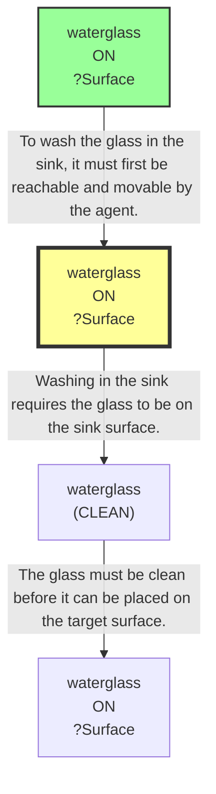
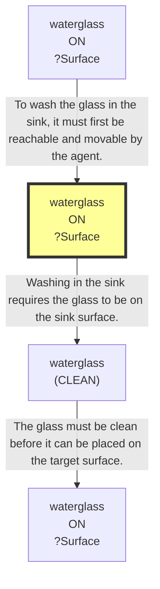
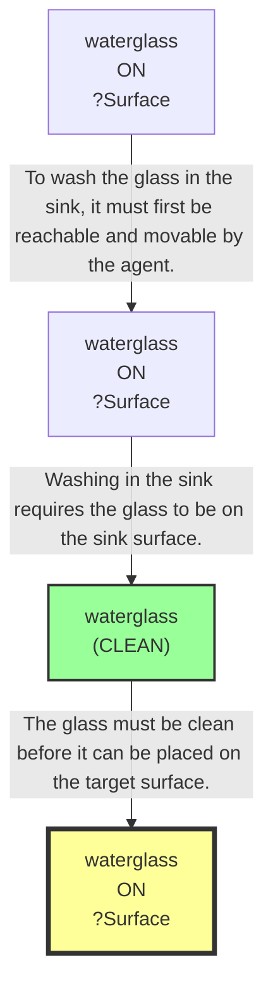
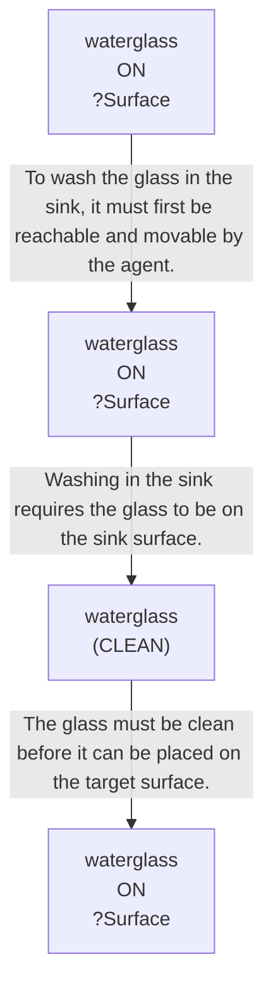

# 🚀 VirtualHome Agent Episode Log


### [GoalReasoner (Module A - Intent)] Output
```json
{
  "is_instruction_obviously_vague": false,
  "clarification_question": null,
  "target_object": "waterglass",
  "location_hint": "kitchentable",
  "reasoning_chain": [
    {
      "question": "Why does the user want this object?",
      "answer": "To have the glass cleaned and placed where it belongs."
    },
    {
      "question": "Why is that important?",
      "answer": "A dirty glass is not suitable for use, and placing it on the table makes it available in the expected location."
    },
    {
      "question": "What fundamental need does this fulfill?",
      "answer": "It fulfills the need for a clean drinking vessel to be ready for later use."
    },
    {
      "question": "Are there any deeper psychological or physical motivations?",
      "answer": "The user likely wants cleanliness, usability, and orderly placement of the item."
    }
  ],
  "deep_intent": "The user wants a clean, usable drinking vessel and orderly placement of it.",
  "acceptable_alternatives_properties": [
    {
      "priority": 1,
      "description": "Other clean drinking vessels, such as a cup or mug"
    },
    {
      "priority": 2,
      "description": "Any clean container suitable for drinking, such as a tumbler or small glass"
    },
    {
      "priority": 3,
      "description": "Other washed tableware that can serve a similar household use"
    },
    {
      "priority": 4,
      "description": "A different clean beverage container if the exact glass is unavailable"
    }
  ]
}
```

### [PerceptionFilter] Output
```json
{
  "reasoning": "The goal requires the target waterglass, plus a cleanable washing location and a final placement surface. The SDG implies the glass must be washed in a sink, so sink is required. The location hint and SDG indicate it should end on the kitchen table, so kitchentable is required. A wash tool is not explicitly needed because washing can be done with the sink itself in the visible options.",
  "selected_classes": [
    "mug",
    "kitchentable",
    "sink",
    "character",
    "waterglass"
  ],
  "raw_class_count": 99
}
```

### [LLMExecutor] Output
```json
{
  "reasoning": "The target waterglass(64) is already on kitchentable(131), so the placement relation is satisfied. The missing requirement is CLEAN. To clean it, the glass must first be reachable and movable by the agent, which is already implied by its current position on the nearby kitchen table, but washing requires holding it first. The next atomic step toward the SDG is to grab the waterglass so it can be washed at the sink in subsequent steps.",
  "satisfied_nodes": [
    "N4"
  ],
  "current_node_focus": "N3",
  "mapped_variables": {
    "?Surface": "kitchentable(131)"
  },
  "action": "[grab] waterglass (64)"
}
```
## Step 0
- **Action**: `[grab] <waterglass> (64)`
- **SDG Status**:

- **Observed Items (12)**: character(1), kitchen(11), waterglass(64), kitchentable(131), kitchentable(135), sink(155), livingroom(183), bedroom(241), bathroom(285), sink(326), bedroom(346), mug(384)


### [PerceptionFilter] Output
```json
{
  "reasoning": "The goal requires the target drinking vessel, plus a place to wash it and a place to set it afterward. The SDG implies cleaning in a sink and then placing it on the kitchen table. I also keep close alternative drinking vessels as backups in case the exact waterglass is unavailable.",
  "selected_classes": [
    "mug",
    "kitchentable",
    "sink",
    "character",
    "waterglass"
  ],
  "raw_class_count": 99
}
```

### [LLMExecutor] Output
```json
{
  "reasoning": "The waterglass is already held and is close to both the character and the kitchen table. The SDG requires the glass to be CLEAN before it can be placed on the target surface. The next missing prerequisite is to move it to a sink surface for washing. Since the sink is in the kitchen and the agent is already in the kitchen, the single next atomic step should be to walk to the kitchen sink(155) before washing in the following action.",
  "satisfied_nodes": [],
  "current_node_focus": "N3",
  "mapped_variables": {
    "?Surface": "sink(155)"
  },
  "action": "[walk] <sink> (155)"
}
```
## Step 1
- **Action**: `[walk] <sink> (155)`
- **SDG Status**:

- **Observed Items (12)**: character(1), kitchen(11), waterglass(64), kitchentable(131), kitchentable(135), sink(155), livingroom(183), bedroom(241), bathroom(285), sink(326), bedroom(346), mug(384)


### [PerceptionFilter] Output
```json
{
  "reasoning": "The task requires the target waterglass, a cleanable/wash-capable setup, and a valid place to put it. To satisfy the SDG, we need the waterglass itself, the sink for washing, and the kitchen table as the intended final surface. Since alternative drinking vessels are explicitly acceptable backups, keep mug and dishbowl as functional alternatives.",
  "selected_classes": [
    "mug",
    "dishbowl",
    "kitchentable",
    "sink",
    "character",
    "waterglass"
  ],
  "raw_class_count": 99
}
```

### [LLMExecutor] Output
```json
{
  "reasoning": "The waterglass(64) is already held and the agent is already close to sink(155). The next missing prerequisite for CLEAN is to wash the glass, and washing requires being holding the object and near a sink. Since both conditions are satisfied, the single next atomic action is to wash the waterglass at the sink.",
  "satisfied_nodes": [
    "N4"
  ],
  "current_node_focus": "N3",
  "mapped_variables": {
    "?Surface": "sink(155)"
  },
  "action": "[wash] <waterglass> (64)"
}
```
## Step 2
- **Action**: `[wash] <waterglass> (64)`
- **SDG Status**:

- **Observed Items (20)**: character(1), kitchen(11), waterglass(64), dishbowl(115), dishbowl(116), dishbowl(117), dishbowl(118), dishbowl(119), kitchentable(131), kitchentable(135), sink(155), dishbowl(172), dishbowl(180), livingroom(183), bedroom(241)...


### [PerceptionFilter] Output
```json
{
  "reasoning": "The goal requires the target drinking vessel and its necessary cleaning/placement support. From the SDG, the glass must be washed at a sink and then placed on the kitchen table. Alternative clean drinking vessels should be retained as backups, so mug is included. The needed location/receptacle classes are sink and kitchentable.",
  "selected_classes": [
    "mug",
    "kitchentable",
    "sink",
    "character",
    "waterglass"
  ],
  "raw_class_count": 99
}
```

### [LLMExecutor] Output
```json
{
  "reasoning": "The waterglass(64) is already CLEAN and currently held by the agent. The remaining SDG requirement is to place it ON the intended surface, which is inferred from the goal intent/location hint to be the kitchen table. Since putback requires being near the destination and the agent is currently near the sink, the next atomic step should be to walk to a kitchen table before placing the glass there. Among the available tables, kitchentable(131) is the best match to the location hint.",
  "satisfied_nodes": [
    "N2"
  ],
  "current_node_focus": "N1",
  "mapped_variables": {
    "?Surface": "kitchentable(131)"
  },
  "action": "[walk] <kitchentable> (131)"
}
```
## Step 3
- **Action**: `[walk] <kitchentable> (131)`
- **SDG Status**:

- **Observed Items (12)**: character(1), kitchen(11), waterglass(64) [CLEAN], kitchentable(131), kitchentable(135), sink(155), livingroom(183), bedroom(241), bathroom(285), sink(326), bedroom(346), mug(384)


### [PerceptionFilter] Output
```json
{
  "reasoning": "The goal requires the target drinking vessel, and the SDG indicates it must be cleaned using a sink before being placed on the kitchentable. To preserve functional alternatives and backups, I include other clean drinking vessels that could substitute if needed, plus the required location surfaces and washing tool/location (sink).",
  "selected_classes": [
    "mug",
    "dishbowl",
    "kitchentable",
    "sink",
    "character",
    "waterglass"
  ],
  "raw_class_count": 99
}
```

### [LLMExecutor] Output
```json
{
  "reasoning": "The waterglass(64) is already CLEAN and currently held in the right hand. The remaining SDG requirement is to satisfy the ON relation by placing it on the intended surface. The agent is already CLOSE to kitchentable(131), which best matches the location hint, so the next atomic action is to put the glass back onto that table.",
  "satisfied_nodes": [
    "N2"
  ],
  "current_node_focus": "N1",
  "mapped_variables": {
    "?Surface": "kitchentable(131)"
  },
  "action": "[putback] <waterglass> (64) <kitchentable> (131)"
}
```
## Step 4
- **Action**: `[putback] <waterglass> (64) <kitchentable> (131)`
- **SDG Status**:

- **Observed Items (20)**: character(1), kitchen(11), waterglass(64) [CLEAN], dishbowl(115), dishbowl(116), dishbowl(117), dishbowl(118), dishbowl(119), kitchentable(131), kitchentable(135), sink(155), dishbowl(172), dishbowl(180), livingroom(183), bedroom(241)...


### [PerceptionFilter] Output
```json
{
  "reasoning": "Need the target drinking vessel (waterglass), the cleaning location/equipment implied by the SDG (sink), and the destination surface from the goal hint (kitchentable). Include the alternative clean drinking vessels as backups per instructions (mug).",
  "selected_classes": [
    "mug",
    "kitchentable",
    "sink",
    "character",
    "waterglass"
  ],
  "raw_class_count": 99
}
```
## Step 5
- **Action**: `FINISH (Goal Reached)`
- **SDG Status**:

- **Observed Items (12)**: character(1), kitchen(11), waterglass(64) [CLEAN], kitchentable(131), kitchentable(135), sink(155), livingroom(183), bedroom(241), bathroom(285), sink(326), bedroom(346), mug(384)

