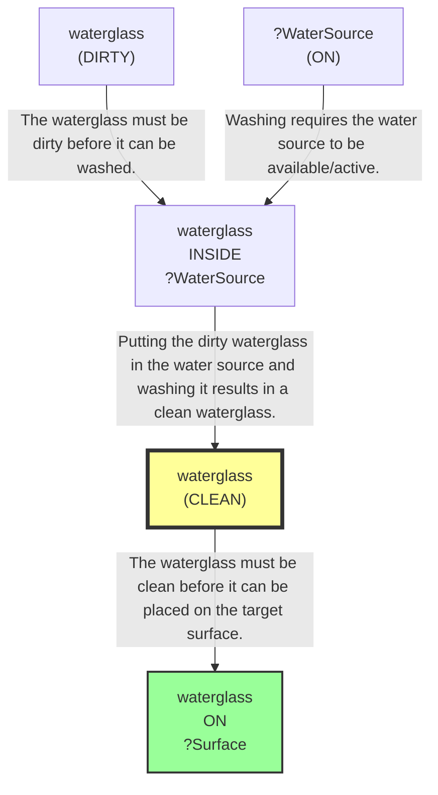
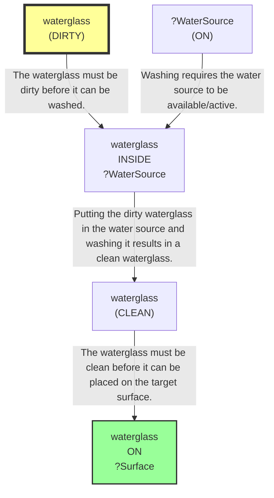
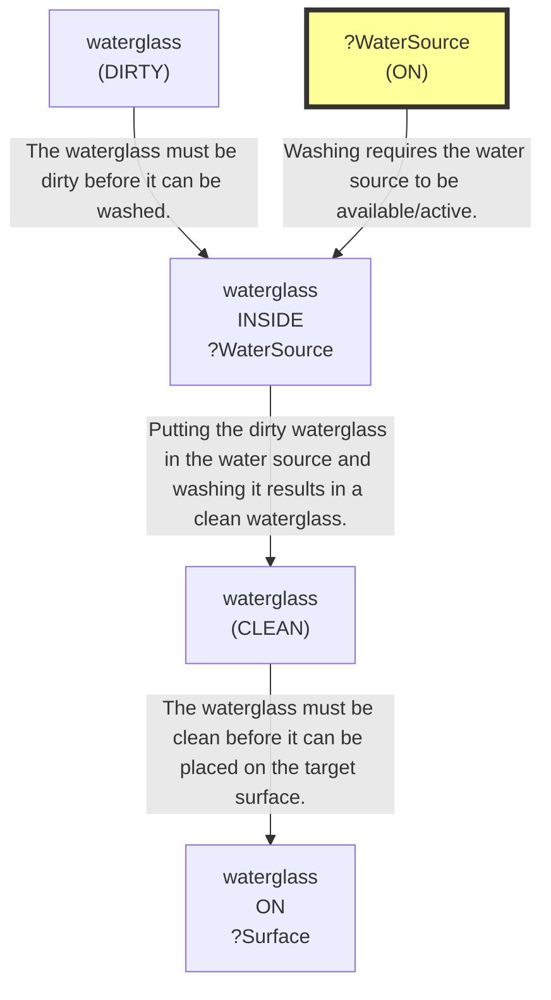
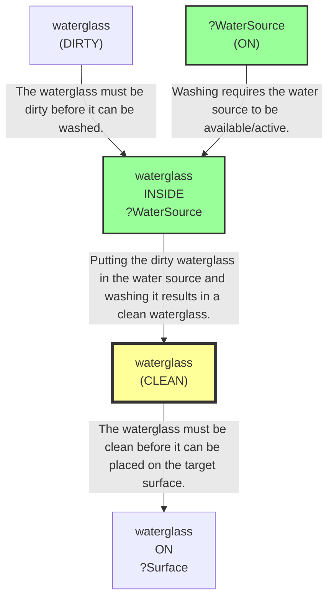
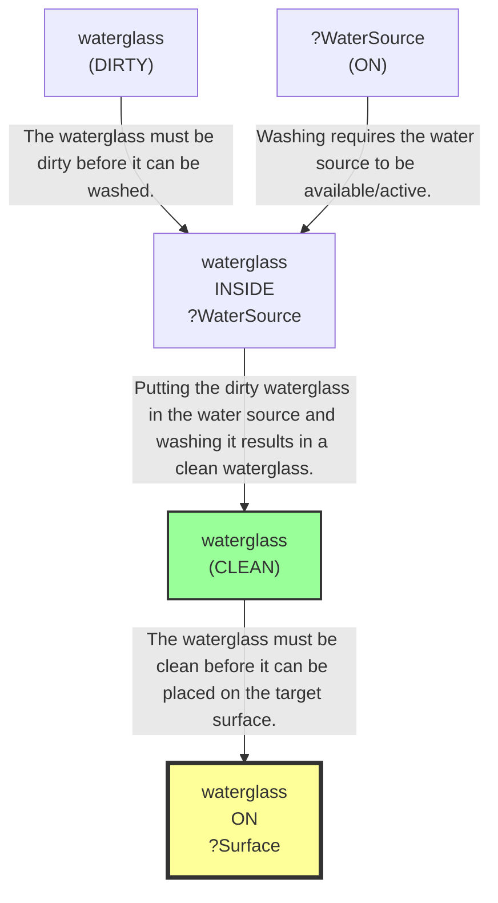
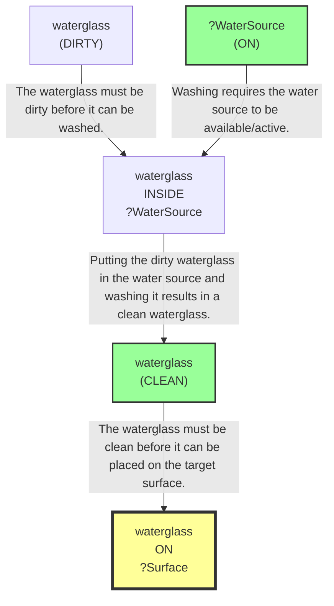
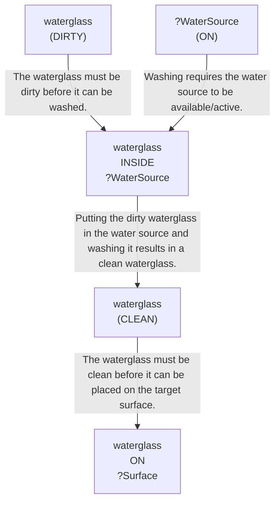

# 🚀 VirtualHome Agent Episode Log


### [GoalReasoner (Module A - Intent)] Output
```json
{
  "is_instruction_obviously_vague": false,
  "clarification_question": null,
  "target_object": "waterglass",
  "location_hint": "kitchentable",
  "reasoning_chain": [
    {
      "question": "Why does the user want this object?",
      "answer": "To have a waterglass that is clean and then placed on the kitchen table."
    },
    {
      "question": "Why is that important?",
      "answer": "So the glass can be ready for use in a clean, convenient location."
    },
    {
      "question": "What fundamental need does this fulfill?",
      "answer": "It fulfills the need to prepare a drinking vessel for immediate or future use."
    },
    {
      "question": "Are there any deeper psychological or physical motivations?",
      "answer": "The motivation is likely to restore cleanliness and ensure the item is available where it is wanted."
    }
  ],
  "deep_intent": "The user wants to ensure a drinking vessel is clean and conveniently positioned for use.",
  "acceptable_alternatives_properties": [
    {
      "priority": 1,
      "description": "Another clean drinking vessel, such as a cup or mug, placed on the kitchen table"
    },
    {
      "priority": 2,
      "description": "Any similarly sized clean container intended for drinking"
    },
    {
      "priority": 3,
      "description": "A clean reusable beverage container that can serve the same function"
    },
    {
      "priority": 4,
      "description": "A clean disposable cup if the goal is simply to have something ready for drinking"
    }
  ]
}
```

### [PerceptionFilter] Output
```json
{
  "reasoning": "The goal requires the target drinking vessel and the physical setup needed to clean it and place it on the kitchen table. The SDG implies a water source for washing and a surface for placement. To preserve alternatives and backups, I keep all visible cleaning-capable water sources relevant to washing and all plausible drinking-vessel alternatives, plus the target surface.",
  "selected_classes": [
    "sink",
    "faucet",
    "character",
    "waterglass",
    "dishbowl",
    "mug",
    "kitchentable"
  ],
  "raw_class_count": 99
}
```

### [LLMExecutor] Output
```json
{
  "reasoning": "The target waterglass(64) is already identified and it is on kitchentable(131), which satisfies the intended location. However, the SDG requires the glass to be CLEAN before being placed on the table, and the current graph shows no CLEAN or DIRTY state for the waterglass. Since the graph does not currently mark it dirty, the next progress-making step is to get close enough to inspect/handle it for cleaning workflow. The best immediate action is to walk to the waterglass so we can subsequently grab and wash it at the sink with faucet(156).",
  "satisfied_nodes": [
    "N1"
  ],
  "current_node_focus": "N3",
  "mapped_variables": {
    "?Surface": "kitchentable(131)",
    "?WaterSource": "sink(155)"
  },
  "action": "[walk] <waterglass> (64)"
}
```
## Step 0
- **Action**: `[walk] <waterglass> (64)`
- **SDG Status**:

- **Observed Items (22)**: character(1), kitchen(11), waterglass(64), dishbowl(115), dishbowl(116), dishbowl(117), dishbowl(118), dishbowl(119), kitchentable(131), kitchentable(135), sink(155), faucet(156) [OFF], dishbowl(172), dishbowl(180), livingroom(183)...


### [PerceptionFilter] Output
```json
{
  "reasoning": "The goal requires the target drinking vessel and the physical setup needed to make it clean and place it on the kitchen table. From the SDG, we need the waterglass itself, a water source capable of washing it (sink is the relevant active water source here), and the destination surface kitchentable. Since acceptable alternatives include other clean drinking vessels, mug is also retained as a functional backup. A dishwasher is kept as an alternative cleaning appliance in case it can serve as the washing tool instead of the sink.",
  "selected_classes": [
    "sink",
    "character",
    "waterglass",
    "mug",
    "kitchentable",
    "dishwasher"
  ],
  "raw_class_count": 99
}
```

### [LLMExecutor] Output
```json
{
  "reasoning": "The waterglass(64) is already close to the character and is on the kitchen table, but the SDG requires it to become CLEAN before the final placement state is considered satisfied. Since washing requires holding the object and being near a sink, the next progress-making step is to grab the waterglass so it can be washed at the kitchen sink next.",
  "satisfied_nodes": [
    "N1"
  ],
  "current_node_focus": "N4",
  "mapped_variables": {
    "?Surface": "kitchentable(131)",
    "?WaterSource": "sink(155)"
  },
  "action": "[grab] <waterglass> (64)"
}
```
## Step 1
- **Action**: `[grab] <waterglass> (64)`
- **SDG Status**:

- **Observed Items (13)**: character(1), kitchen(11), waterglass(64), kitchentable(131), kitchentable(135), sink(155), dishwasher(165) [CLOSED,OFF], livingroom(183), bedroom(241), bathroom(285), sink(326), bedroom(346), mug(384)


### [PerceptionFilter] Output
```json
{
  "reasoning": "The goal requires the target drinking vessel and the physical locations/receptacles involved in cleaning it and placing it on the kitchen table. From the SDG, a water source is needed; among the visible objects, the sink is the relevant water source. The target surface is the kitchen table. Since the task specifically concerns a waterglass, include that target class. No other objects are necessary.",
  "selected_classes": [
    "sink",
    "character",
    "waterglass",
    "mug",
    "kitchentable"
  ],
  "raw_class_count": 99
}
```

### [LLMExecutor] Output
```json
{
  "reasoning": "The waterglass(64) is already in hand, and the next missing prerequisite for cleaning is proximity to a water source. In the current graph, sink(155) is the kitchen sink and is the best binding for ?WaterSource. Since washing requires holding the object and being near the sink, the next atomic step is to walk to sink(155).",
  "satisfied_nodes": [],
  "current_node_focus": "N5",
  "mapped_variables": {
    "?WaterSource": "sink(155)",
    "?Surface": "kitchentable(131)"
  },
  "action": "[walk] <sink> (155)"
}
```
## Step 2
- **Action**: `[walk] <sink> (155)`
- **SDG Status**:

- **Observed Items (12)**: character(1), kitchen(11), waterglass(64), kitchentable(131), kitchentable(135), sink(155), livingroom(183), bedroom(241), bathroom(285), sink(326), bedroom(346), mug(384)


### [PerceptionFilter] Output
```json
{
  "reasoning": "The goal is to clean a waterglass and place it on the kitchen table. The minimum needed classes are the target object itself, a washing/water source to clean it, and the destination surface. Because the SDG requires an active water source and the environment includes multiple viable cleaning tools, I retain all matching alternatives for washing: sink, dishwasher, and washingmachine. The location hint requires the kitchen table.",
  "selected_classes": [
    "sink",
    "character",
    "waterglass",
    "mug",
    "washingmachine",
    "kitchentable",
    "dishwasher"
  ],
  "raw_class_count": 99
}
```

### [LLMExecutor] Output
```json
{
  "reasoning": "The waterglass(64) is already held and the character is already close to sink(155), which is the best binding for ?WaterSource. The SDG requires the glass to be washed so it becomes CLEAN, and washing is the next missing prerequisite before it can be placed on a kitchentable. Since we are already at the sink and holding the glass, the next atomic action is to wash the waterglass.",
  "satisfied_nodes": [
    "N2",
    "N5"
  ],
  "current_node_focus": "N3",
  "mapped_variables": {
    "?WaterSource": "sink(155)",
    "?Surface": "kitchentable(131)"
  },
  "action": "[wash] <waterglass> (64)"
}
```
## Step 3
- **Action**: `[wash] <waterglass> (64)`
- **SDG Status**:

- **Observed Items (14)**: character(1), kitchen(11), waterglass(64), kitchentable(131), kitchentable(135), sink(155), dishwasher(165) [CLOSED,OFF], livingroom(183), bedroom(241), bathroom(285), sink(326), washingmachine(345) [CLOSED,OFF], bedroom(346), mug(384)


### [PerceptionFilter] Output
```json
{
  "reasoning": "The goal is to have a clean waterglass placed on the kitchen table. The SDG requires the target object waterglass, a water source for washing, and a surface for placement. From the visible objects, the relevant water source is sink (a functional washing source), and the target surface is kitchentable. No other objects are strictly necessary.",
  "selected_classes": [
    "sink",
    "character",
    "waterglass",
    "mug",
    "kitchentable"
  ],
  "raw_class_count": 99
}
```

### [LLMExecutor] Output
```json
{
  "reasoning": "The waterglass(64) is now CLEAN, so SDG node N3 is satisfied. The remaining requirement is to place the clean waterglass on the kitchen table. Since the character is currently close to sink(155) and the waterglass is already held, the next atomic step toward N1 is to walk to the target surface kitchentable(131) before putting it back there.",
  "satisfied_nodes": [
    "N3"
  ],
  "current_node_focus": "N1",
  "mapped_variables": {
    "?Surface": "kitchentable(131)",
    "?WaterSource": "sink(155)"
  },
  "action": "[walk] <kitchentable> (131)"
}
```
## Step 4
- **Action**: `[walk] <kitchentable> (131)`
- **SDG Status**:

- **Observed Items (12)**: character(1), kitchen(11), waterglass(64) [CLEAN], kitchentable(131), kitchentable(135), sink(155), livingroom(183), bedroom(241), bathroom(285), sink(326), bedroom(346), mug(384)


### [PerceptionFilter] Output
```json
{
  "reasoning": "The goal requires the target drinking vessel and the location where it should end up. The SDG also requires a water source for washing/cleaning and a surface to place the clean glass on. Since alternatives and backups must be retained, I include all viable drinking vessels and all plausible water sources for washing that are present. The kitchen table is explicitly the destination surface.",
  "selected_classes": [
    "sink",
    "faucet",
    "character",
    "waterglass",
    "dishbowl",
    "mug",
    "kitchentable",
    "dishwasher"
  ],
  "raw_class_count": 99
}
```

### [LLMExecutor] Output
```json
{
  "reasoning": "The waterglass(64) is already CLEAN, so SDG node N3 is satisfied. The character is currently close to kitchentable(131), and the goal is to place the clean waterglass on that surface. Since placing on a surface requires the object to be held (it is) and the character to be near the surface (it is), the next atomic action is to put the waterglass back onto the kitchen table.",
  "satisfied_nodes": [
    "N3",
    "N5"
  ],
  "current_node_focus": "N1",
  "mapped_variables": {},
  "action": "[putback] <waterglass> (64) <kitchentable> (131)"
}
```
## Step 5
- **Action**: `[putback] <waterglass> (64) <kitchentable> (131)`
- **SDG Status**:

- **Observed Items (23)**: character(1), kitchen(11), waterglass(64) [CLEAN], dishbowl(115), dishbowl(116), dishbowl(117), dishbowl(118), dishbowl(119), kitchentable(131), kitchentable(135), sink(155), faucet(156) [OFF], dishwasher(165) [CLOSED,OFF], dishbowl(172), dishbowl(180)...


### [PerceptionFilter] Output
```json
{
  "reasoning": "The goal requires the target drinking vessel and a place to put it on. The SDG also requires a water source/appliance to wash it and the vessel must be clean before placement. I therefore keep the target class, the kitchen table, and all plausible washing sources available in the scene (sink, dishwasher, washingmachine) as physical backups.",
  "selected_classes": [
    "sink",
    "character",
    "waterglass",
    "mug",
    "washingmachine",
    "kitchentable",
    "dishwasher"
  ],
  "raw_class_count": 99
}
```
## Step 6
- **Action**: `FINISH (Goal Reached)`
- **SDG Status**:

- **Observed Items (14)**: character(1), kitchen(11), waterglass(64) [CLEAN], kitchentable(131), kitchentable(135), sink(155), dishwasher(165) [CLOSED,OFF], livingroom(183), bedroom(241), bathroom(285), sink(326), washingmachine(345) [CLOSED,OFF], bedroom(346), mug(384)

