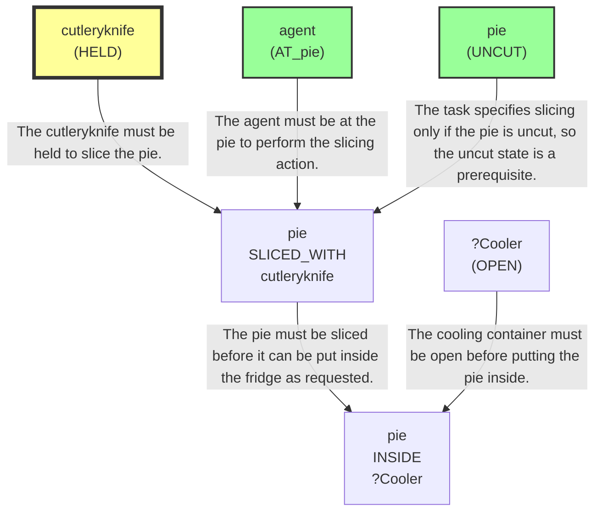
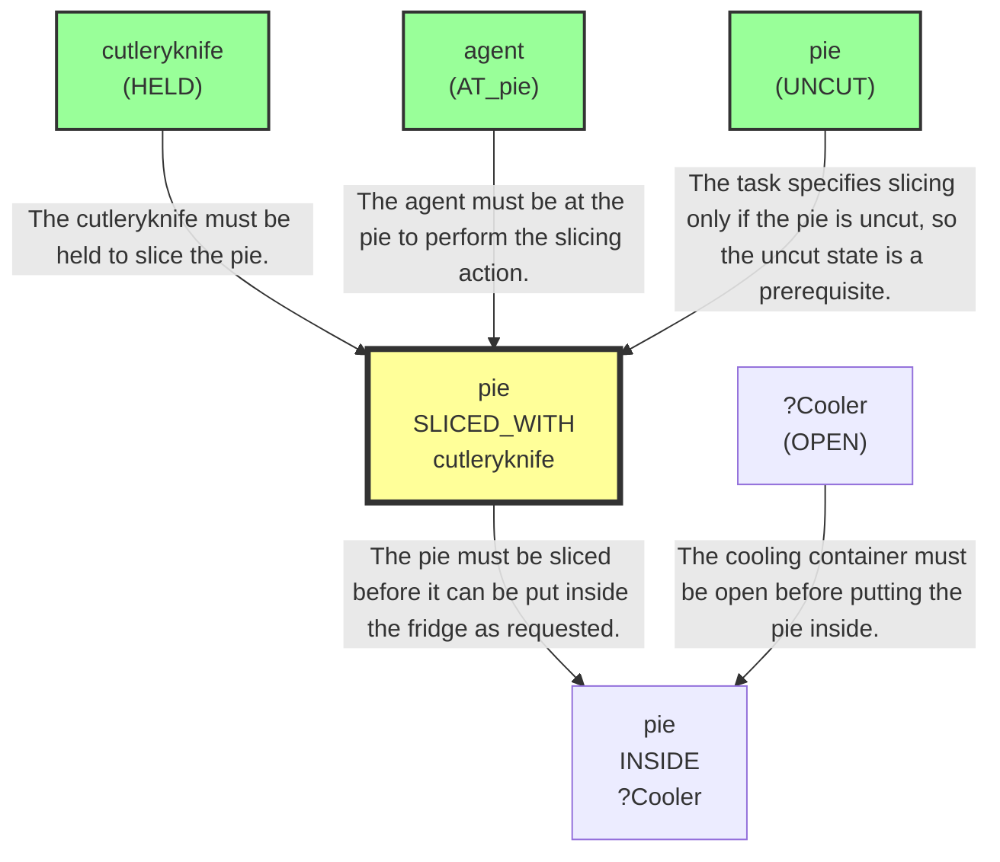
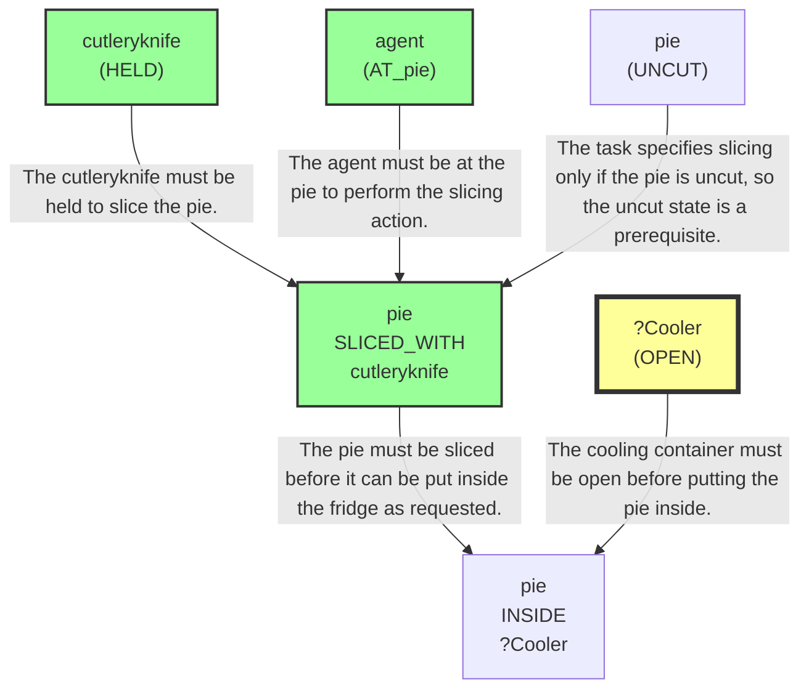
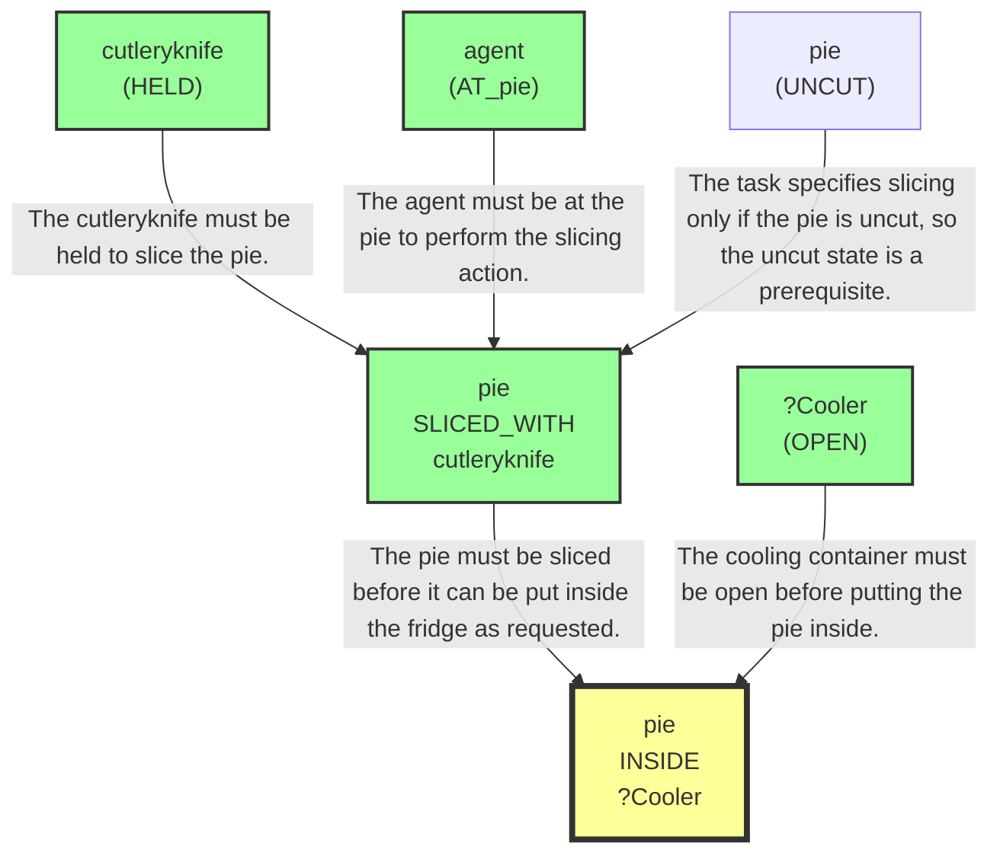
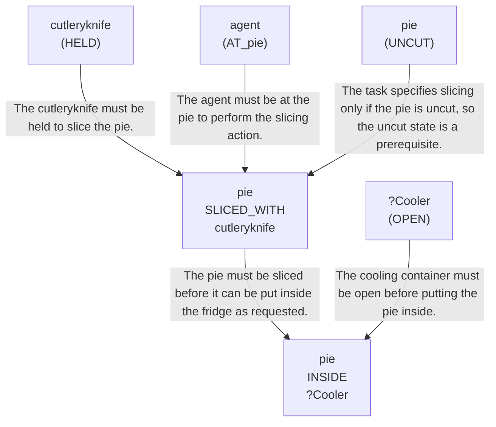

# 🚀 VirtualHome Agent Episode Log


### [GoalReasoner (Module A - Intent)] Output
```json
{
  "is_instruction_obviously_vague": false,
  "clarification_question": null,
  "target_object": "pie",
  "location_hint": "fridge",
  "reasoning_chain": [
    {
      "question": "Why does the user want this object?",
      "answer": "The user wants the pie to be prepared for storage after being divided into portions."
    },
    {
      "question": "Why is that important?",
      "answer": "Cutting it first makes it easier to handle, and placing it in the fridge helps preserve it."
    },
    {
      "question": "What fundamental need does this fulfill?",
      "answer": "It fulfills the need to store and preserve food."
    },
    {
      "question": "Are there any deeper psychological or physical motivations?",
      "answer": "The user likely wants to keep the food safe, maintain freshness, and make it ready for later consumption."
    }
  ],
  "deep_intent": "The user wants to preserve food for later use.",
  "acceptable_alternatives_properties": [
    {
      "priority": 1,
      "description": "Other ready-to-eat desserts or baked foods that can be cut into portions and refrigerated, such as cake or pastry"
    },
    {
      "priority": 2,
      "description": "Other baked goods that can be stored cold to maintain freshness, such as bread-based desserts or tarts"
    },
    {
      "priority": 3,
      "description": "Prepared sweet foods that can be chilled for later consumption"
    },
    {
      "priority": 4,
      "description": "Any food item that needs refrigeration to stay fresh, even if it is not a dessert"
    }
  ]
}
```

### [PerceptionFilter] Output
```json
{
  "reasoning": "The goal requires the pie itself, the cutting tool needed by the SDG, and the refrigerator as the cooling container. Since the task explicitly says the pie is to be stored in the fridge and must be sliced first, those are the only necessary classes to keep. The fridge is retained as the required location/receptacle, and cutleryknife is retained as the implicit tool for slicing.",
  "selected_classes": [
    "cutleryknife",
    "fridge",
    "character",
    "pie"
  ],
  "raw_class_count": 112
}
```

### [LLMExecutor] Output
```json
{
  "reasoning": "The pie is already close to the agent, and the required prerequisite for slicing is to hold the cutleryknife. The knife is also close to the agent, so the best next atomic step is to pick it up. This progresses toward satisfying N3, which then enables slicing the pie and eventually placing it inside the fridge after opening it.",
  "satisfied_nodes": [
    "N4",
    "N6"
  ],
  "current_node_focus": "N3",
  "mapped_variables": {},
  "action": "[grab] <cutleryknife> (271)"
}
```
## Step 0
- **Action**: `[grab] <cutleryknife> (271)`
- **SDG Status**:

- **Observed Items (8)**: character(1), bathroom(11), bedroom(73), kitchen(205), cutleryknife(271), fridge(305) [CLOSED], pie(319), livingroom(335)


### [PerceptionFilter] Output
```json
{
  "reasoning": "The goal requires the pie itself, the knife needed to slice it, and the cooling storage appliance implied by the SDG and location hint. Since the SDG specifies the cooler as a fridge and that it must be open, the fridge is necessary. No other tools or containers are required for this task.",
  "selected_classes": [
    "cutleryknife",
    "fridge",
    "character",
    "pie"
  ],
  "raw_class_count": 112
}
```

### [LLMExecutor] Output
```json
{
  "reasoning": "The knife is already held, and the pie is currently close to the agent, so the next prerequisite toward slicing (N2) is to perform the cut. The fridge is still closed, but opening it is not needed until after the pie is sliced. Current focus is satisfying the pie slicing relation before storage.",
  "satisfied_nodes": [
    "N3",
    "N4",
    "N6"
  ],
  "current_node_focus": "N2",
  "mapped_variables": {
    "?Cooler": "fridge(305)"
  },
  "action": "[cut] <pie> (319)"
}
```
## Step 1
- **Action**: `[cut] <pie> (319)`
- **SDG Status**:

- **Observed Items (8)**: character(1), bathroom(11), bedroom(73), kitchen(205), cutleryknife(271), fridge(305) [CLOSED], pie(319), livingroom(335)


### [PerceptionFilter] Output
```json
{
  "reasoning": "The goal requires the pie itself, the knife needed to slice it, and the fridge as the specified storage location/cooler. The SDG also requires the fridge/cooler to be open and the knife to be held, but those are states rather than object classes. No backup cooler is explicitly available beyond the fridge, so only the necessary physical classes are selected.",
  "selected_classes": [
    "cutleryknife",
    "fridge",
    "character",
    "pie"
  ],
  "raw_class_count": 112
}
```

### [LLMExecutor] Output
```json
{
  "reasoning": "The pie has already been sliced, and the knife is held, so N2 is satisfied and N3 is satisfied. The agent is already close to the pie, so N4 is satisfied. The remaining missing prerequisites are to open the fridge and place the pie inside it. Since the fridge is currently CLOSED, the next atomic step is to walk to the fridge before opening it, because proximity is required for [open].",
  "satisfied_nodes": [
    "N2",
    "N3",
    "N4"
  ],
  "current_node_focus": "N5",
  "mapped_variables": {
    "?Cooler": "fridge(305)"
  },
  "action": "[walk] <fridge> (305)"
}
```
## Step 2
- **Action**: `[walk] <fridge> (305)`
- **SDG Status**:

- **Observed Items (8)**: character(1), bathroom(11), bedroom(73), kitchen(205), cutleryknife(271), fridge(305) [CLOSED], pie(319) [SLICED], livingroom(335)


### [PerceptionFilter] Output
```json
{
  "reasoning": "The goal requires the pie itself, a cutleryknife to slice it, and the fridge as the cooler for storage. The SDG also requires the fridge/cooler to be open and the pie to be uncut before slicing, but those are states rather than object classes. No other tools or containers are necessary.",
  "selected_classes": [
    "cutleryknife",
    "fridge",
    "character",
    "pie"
  ],
  "raw_class_count": 112
}
```

### [LLMExecutor] Output
```json
{
  "reasoning": "The pie is already sliced, satisfying N2, and the knife is already held, satisfying N3. The agent is already at the fridge, so the next missing prerequisite toward putting the pie away is to open the fridge. The fridge is a valid cooler/container and is currently CLOSED, so opening it is the correct next atomic action before any attempt to put the pie inside.",
  "satisfied_nodes": [
    "N2",
    "N3",
    "N4"
  ],
  "current_node_focus": "N5",
  "mapped_variables": {
    "?Cooler": "fridge(305)"
  },
  "action": "[open] <fridge> (305)"
}
```
## Step 3
- **Action**: `[open] <fridge> (305)`
- **SDG Status**:

- **Observed Items (8)**: character(1), bathroom(11), bedroom(73), kitchen(205), cutleryknife(271), fridge(305) [CLOSED], pie(319) [SLICED], livingroom(335)


### [PerceptionFilter] Output
```json
{
  "reasoning": "The goal requires the pie itself, the knife needed to slice it, and the fridge as the storage location/cooler. Because the SDG specifies the fridge must be open and the pie is initially uncut, those relevant classes are retained. No other tools or furniture are necessary.",
  "selected_classes": [
    "cutleryknife",
    "fridge",
    "character",
    "pie"
  ],
  "raw_class_count": 112
}
```

### [LLMExecutor] Output
```json
{
  "reasoning": "The pie is already sliced, the knife is held, and the fridge is open. The remaining unmet prerequisite for the goal is to place the pie inside the cooler. Since the pie is currently in the kitchen and the agent is already close to the fridge area, the next needed atomic action is to walk to the pie so it can be grabbed before storing it.",
  "satisfied_nodes": [
    "N2",
    "N3",
    "N4",
    "N5"
  ],
  "current_node_focus": "N1",
  "mapped_variables": {
    "?Cooler": "fridge(305)"
  },
  "action": "[walk] <pie> (319)"
}
```
## Step 4
- **Action**: `[walk] <pie> (319)`
- **SDG Status**:

- **Observed Items (8)**: character(1), bathroom(11), bedroom(73), kitchen(205), cutleryknife(271), fridge(305) [OPEN], pie(319) [SLICED], livingroom(335)


### [PerceptionFilter] Output
```json
{
  "reasoning": "Needed items are the target food and the exact tools/storage locations required by the SDG: the pie itself, a cutleryknife to slice it, and the fridge as the cooler for storage. No other objects are necessary for this goal.",
  "selected_classes": [
    "cutleryknife",
    "fridge",
    "character",
    "pie"
  ],
  "raw_class_count": 112
}
```

### [LLMExecutor] Output
```json
{
  "reasoning": "The pie is already sliced and the fridge is open, so N2 and N5 are satisfied. The agent is already close to the pie, satisfying the proximity needed to grab it. The knife is still held, but that is acceptable for now because the next required step toward putting the pie inside the fridge is to pick up the pie before moving it into the open cooler. This directly progresses toward N1.",
  "satisfied_nodes": [
    "N2",
    "N3",
    "N4",
    "N5"
  ],
  "current_node_focus": "N1",
  "mapped_variables": {
    "?Cooler": "fridge(305)"
  },
  "action": "[grab] <pie> (319)"
}
```
## Step 5
- **Action**: `[grab] <pie> (319)`
- **SDG Status**:

- **Observed Items (8)**: character(1), bathroom(11), bedroom(73), kitchen(205), cutleryknife(271), fridge(305) [OPEN], pie(319) [SLICED], livingroom(335)


### [PerceptionFilter] Output
```json
{
  "reasoning": "The goal requires the pie itself, the exact tool for slicing it, and the cooling container for storage. The SDG specifically says the pie must be sliced with a cutleryknife, the agent must hold that knife, and the pie must end up inside an open fridge. So the minimum necessary classes are the target food, the knife tool, and the fridge location/receptacle.",
  "selected_classes": [
    "cutleryknife",
    "fridge",
    "character",
    "pie"
  ],
  "raw_class_count": 112
}
```

### [LLMExecutor] Output
```json
{
  "reasoning": "The pie is already sliced, the knife is held, and the fridge is open, so the only remaining unmet goal condition is placing the pie inside the fridge. The agent is currently holding the pie and is already close to the fridge area from the current graph context, so the next atomic step that progresses toward N1 is to put the pie into the open fridge.",
  "satisfied_nodes": [
    "N2",
    "N3",
    "N4",
    "N5"
  ],
  "current_node_focus": "N1",
  "mapped_variables": {
    "?Cooler": "fridge(305)"
  },
  "action": "[putin] <pie> (319) <fridge> (305)"
}
```
## Step 6
- **Action**: `[putin] <pie> (319) <fridge> (305)`
- **SDG Status**:

- **Observed Items (8)**: character(1), bathroom(11), bedroom(73), kitchen(205), cutleryknife(271), fridge(305) [OPEN], pie(319) [SLICED], livingroom(335)


### [PerceptionFilter] Output
```json
{
  "reasoning": "The goal requires the pie itself, a knife to slice it, and a refrigerator/cooler to store it. The SDG explicitly requires the pie to be inside a cooler and sliced with a held cutleryknife; the visible matching cooler is fridge. No other tools or locations are necessary beyond those.",
  "selected_classes": [
    "cutleryknife",
    "fridge",
    "character",
    "pie"
  ],
  "raw_class_count": 112
}
```
## Step 7
- **Action**: `FINISH (Goal Reached)`
- **SDG Status**:

- **Observed Items (8)**: character(1), bathroom(11), bedroom(73), kitchen(205), cutleryknife(271), fridge(305) [OPEN], pie(319) [SLICED,COLD], livingroom(335)

