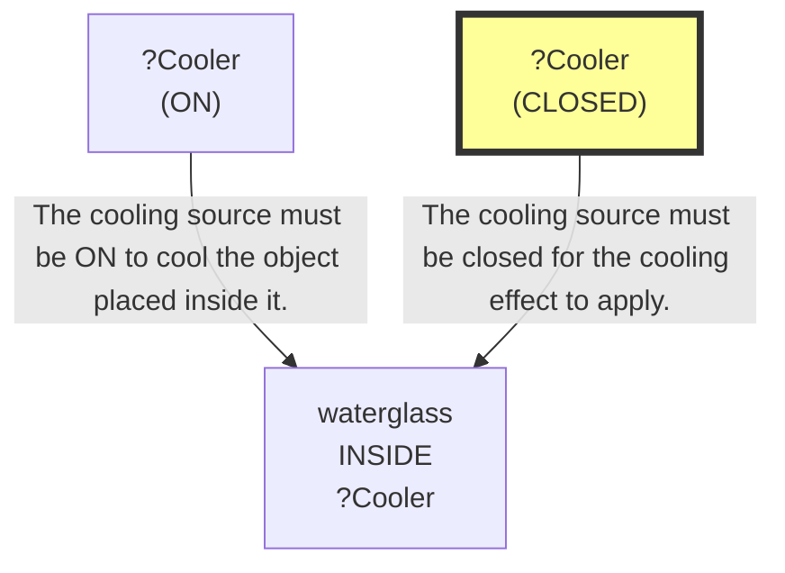
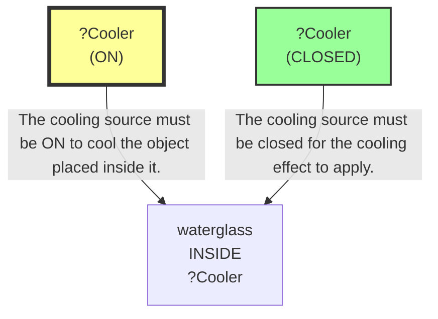
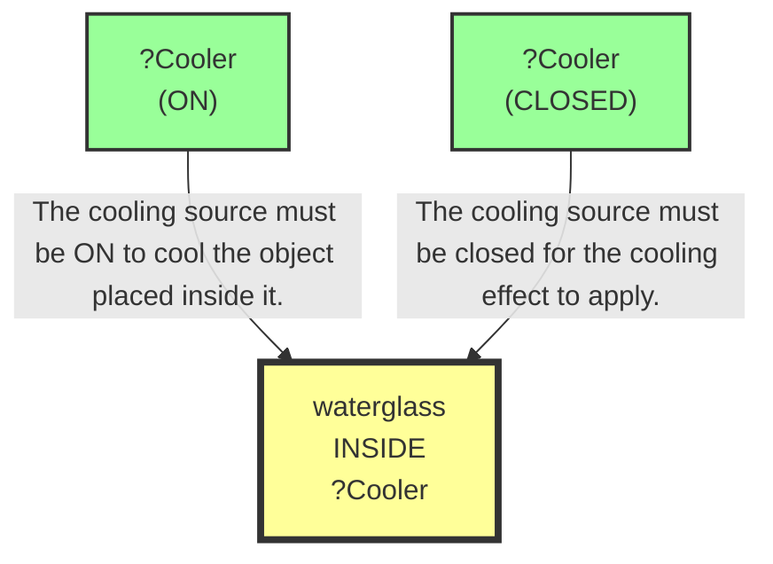
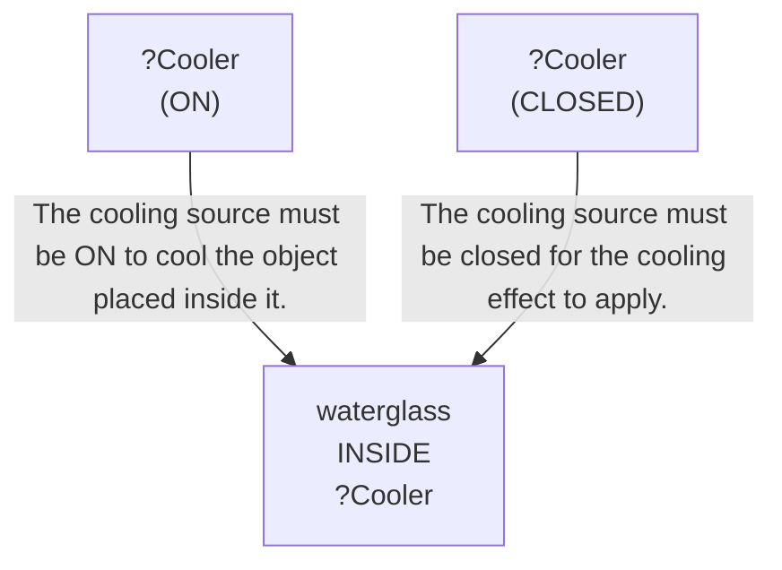

# 🚀 VirtualHome Agent Episode Log


### [GoalReasoner (Module A - Intent)] Output
```json
{
  "is_instruction_obviously_vague": false,
  "clarification_question": null,
  "target_object": "waterglass",
  "location_hint": "fridge",
  "reasoning_chain": [
    {
      "question": "Why does the user want this object in the fridge?",
      "answer": "To make the drink cold."
    },
    {
      "question": "Why is that important?",
      "answer": "A cold drink can be more refreshing or pleasant to consume."
    },
    {
      "question": "What fundamental need does this fulfill?",
      "answer": "It fulfills the need to have a cooled beverage available for drinking."
    },
    {
      "question": "Are there any deeper psychological or physical motivations?",
      "answer": "The user likely wants refreshment, thirst relief, or a more enjoyable drinking experience."
    }
  ],
  "deep_intent": "The user wants to cool a beverage for refreshment and drinkability.",
  "acceptable_alternatives_properties": [
    {
      "priority": 1,
      "description": "Any other drink container with a beverage that can be chilled, such as a bottle, mug, or cup of water or juice"
    },
    {
      "priority": 2,
      "description": "Other cold beverage options already stored in the fridge, such as milk, soda, or tea"
    },
    {
      "priority": 3,
      "description": "Ready-to-drink packaged beverages or fluids suitable for cooling and consumption"
    },
    {
      "priority": 4,
      "description": "Any refreshing drink that can satisfy thirst, even if it is not the original beverage"
    }
  ]
}
```

### [PerceptionFilter] Output
```json
{
  "reasoning": "The goal is to cool a beverage for drinking. The SDG requires a cooler that is ON and CLOSED, which matches a fridge. The target object is a waterglass. No extra tools are needed beyond the beverage container and the cooling appliance.",
  "selected_classes": [
    "fridge",
    "mug",
    "character",
    "juice",
    "waterglass",
    "milk"
  ],
  "raw_class_count": 99
}
```

### [LLMExecutor] Output
```json
{
  "reasoning": "The goal is to place the waterglass inside the cooling source, which is the fridge. The fridge is already identified as CLOSED and is the correct cooler candidate. Since the SDG requires the cooler to be ON and CLOSED, the immediate missing prerequisite is to get near the fridge so it can be opened and later switched on if needed. We are not already near the fridge, so the next atomic step is to walk to it.",
  "satisfied_nodes": [],
  "current_node_focus": "N3",
  "mapped_variables": {
    "?Cooler": "fridge(162)"
  },
  "action": "[walk] fridge (162)"
}
```
## Step 0
- **Action**: `[walk] <fridge> (162)`
- **SDG Status**:

- **Observed Items (11)**: character(1), kitchen(11), waterglass(64), fridge(162) [CLOSED], juice(173), juice(174), milk(176) [CLOSED], livingroom(183), bedroom(241), bedroom(346), mug(384)


### [PerceptionFilter] Output
```json
{
  "reasoning": "The goal is to cool a beverage for drinking. The SDG requires the drink container (waterglass) and a cooling appliance that can be ON and CLOSED, which in the visible objects is the fridge. No other tools or locations are necessary.",
  "selected_classes": [
    "fridge",
    "mug",
    "character",
    "juice",
    "waterglass",
    "milk"
  ],
  "raw_class_count": 99
}
```

### [LLMExecutor] Output
```json
{
  "reasoning": "We are already close to the fridge, which is the best match for ?Cooler because it is a container with HAS_SWITCH and CAN_OPEN. The SDG requires the waterglass to end up inside the cooler, and the cooler must be ON and CLOSED. Since the fridge is currently CLOSED and we are near it, the next atomic prerequisite is to open it before any switch or placement actions.",
  "satisfied_nodes": [],
  "current_node_focus": "N3",
  "mapped_variables": {
    "?Cooler": "fridge(162)"
  },
  "action": "[open] <fridge> (162)"
}
```
## Step 1
- **Action**: `[open] <fridge> (162)`
- **SDG Status**:

- **Observed Items (11)**: character(1), kitchen(11), waterglass(64), fridge(162) [CLOSED], juice(173), juice(174), milk(176) [CLOSED], livingroom(183), bedroom(241), bedroom(346), mug(384)


### [PerceptionFilter] Output
```json
{
  "reasoning": "The goal is to cool a beverage in a refrigerator. The SDG requires the cooling appliance to be ON and CLOSED, so the fridge must be kept. The target object is the waterglass, and acceptable alternatives imply other drink containers/beverages could also be relevant, but the minimum necessary selection is the target drink container plus the cooling appliance.",
  "selected_classes": [
    "fridge",
    "mug",
    "character",
    "juice",
    "waterglass",
    "milk"
  ],
  "raw_class_count": 99
}
```

### [LLMExecutor] Output
```json
{
  "reasoning": "The SDG requires the chosen cooler (?Cooler) to be ON and CLOSED, with the waterglass inside it. We are already near the fridge and it is currently OPEN, so the next prerequisite is to close it. Closing it moves us toward satisfying N3 while preserving the ability to later satisfy N2 and N1 in sequence.",
  "satisfied_nodes": [],
  "current_node_focus": "N3",
  "mapped_variables": {
    "?Cooler": "fridge(162)"
  },
  "action": "[close] <fridge> (162)"
}
```
## Step 2
- **Action**: `[close] <fridge> (162)`
- **SDG Status**:

- **Observed Items (11)**: character(1), kitchen(11), waterglass(64), fridge(162) [OPEN], juice(173), juice(174), milk(176) [CLOSED], livingroom(183), bedroom(241), bedroom(346), mug(384)


### [PerceptionFilter] Output
```json
{
  "reasoning": "The goal is to cool a beverage, so we need the target drink container and the cooling appliance that can hold it. The SDG requires a cooler that is ON and CLOSED, which matches the fridge. No other tools are needed beyond the drink container and the fridge as the cooling location.",
  "selected_classes": [
    "fridge",
    "mug",
    "character",
    "juice",
    "waterglass",
    "milk"
  ],
  "raw_class_count": 99
}
```

### [LLMExecutor] Output
```json
{
  "reasoning": "The SDG requires the chosen cooler to be ON and CLOSED, and the fridge(162) is already CLOSED and identified as the cooler. We are still near the fridge from the prior step, and the next missing prerequisite is N2: turn the fridge ON. After that, the waterglass can be placed inside it, but that is not the single next atomic action.",
  "satisfied_nodes": [
    "N3"
  ],
  "current_node_focus": "N2",
  "mapped_variables": {
    "?Cooler": "fridge(162)"
  },
  "action": "[switchon] <fridge> (162)"
}
```
## Step 3
- **Action**: `[switchon] <fridge> (162)`
- **SDG Status**:

- **Observed Items (11)**: character(1), kitchen(11), waterglass(64), fridge(162) [CLOSED], juice(173), juice(174), milk(176) [CLOSED], livingroom(183), bedroom(241), bedroom(346), mug(384)


### [PerceptionFilter] Output
```json
{
  "reasoning": "The goal is to cool a beverage for drinking, and the SDG requires a cooler that is ON and CLOSED. From the visible objects, the needed target beverage container is waterglass, and the only matching cooling appliance is fridge. No other tools or locations are required by the SDG.",
  "selected_classes": [
    "fridge",
    "mug",
    "character",
    "juice",
    "waterglass",
    "milk"
  ],
  "raw_class_count": 99
}
```

### [LLMExecutor] Output
```json
{
  "reasoning": "The current SDG focus is to satisfy N1 by getting the target drink container waterglass(64) inside the cooler fridge(162). The fridge already satisfies N2 (ON) and N3 (CLOSED), so the remaining prerequisite is to obtain the waterglass. It is not currently held and is located in the kitchen, so the next atomic step is to walk to it before grabbing. I choose the exact instance waterglass(64) because it matches the target object in the goal.",
  "satisfied_nodes": [
    "N2",
    "N3"
  ],
  "current_node_focus": "N1",
  "mapped_variables": {
    "?Cooler": "fridge(162)"
  },
  "action": "[walk] <waterglass> (64)"
}
```
## Step 4
- **Action**: `[walk] <waterglass> (64)`
- **SDG Status**:

- **Observed Items (11)**: character(1), kitchen(11), waterglass(64), fridge(162) [ON,CLOSED], juice(173), juice(174), milk(176) [CLOSED], livingroom(183), bedroom(241), bedroom(346), mug(384)


### [PerceptionFilter] Output
```json
{
  "reasoning": "The goal is to cool a beverage in a fridge, so the essential classes are the target drink container and the cooling appliance. The SDG requires the cooler to be ON and CLOSED, so the fridge must be retained. No other tools or locations are needed.",
  "selected_classes": [
    "fridge",
    "mug",
    "character",
    "juice",
    "waterglass",
    "milk"
  ],
  "raw_class_count": 99
}
```

### [LLMExecutor] Output
```json
{
  "reasoning": "The fridge(162) already satisfies the cooler requirements N2 (ON) and N3 (CLOSED). The remaining unmet node is N1: the waterglass must be inside the cooler. We have already walked to the waterglass in the previous step, and it is now close to the character, so the next atomic action is to grab it before we can walk back to the fridge and place it inside/on the cooler in later steps.",
  "satisfied_nodes": [
    "N2",
    "N3"
  ],
  "current_node_focus": "N1",
  "mapped_variables": {
    "?Cooler": "fridge(162)"
  },
  "action": "[grab] <waterglass> (64)"
}
```
## Step 5
- **Action**: `[grab] <waterglass> (64)`
- **SDG Status**:

- **Observed Items (11)**: character(1), kitchen(11), waterglass(64), fridge(162) [ON,CLOSED], juice(173), juice(174), milk(176) [CLOSED], livingroom(183), bedroom(241), bedroom(346), mug(384)


### [PerceptionFilter] Output
```json
{
  "reasoning": "The goal is to cool a beverage in the fridge. We must keep the target drink container and the cooling appliance that serves as the ?Cooler, plus backup drink-container alternatives mentioned by the intent. The visible classes include a fridge, and multiple drink containers that could hold a beverage to chill.",
  "selected_classes": [
    "fridge",
    "mug",
    "dishbowl",
    "juice",
    "character",
    "waterglass",
    "milk"
  ],
  "raw_class_count": 99
}
```

### [LLMExecutor] Output
```json
{
  "reasoning": "The target waterglass(64) is already held in the right hand, and the fridge(162) is the chosen cooler because it has CAN_OPEN, HAS_SWITCH, and is already ON and CLOSED, satisfying N2 and N3. The remaining unmet SDG node is N1: place the waterglass inside the fridge. Per the proximity and container rules, I must walk to the fridge before putting the held object into it. The next atomic step is therefore to move near the fridge.",
  "satisfied_nodes": [
    "N2",
    "N3"
  ],
  "current_node_focus": "N1",
  "mapped_variables": {
    "?Cooler": "fridge(162)"
  },
  "action": "[walk] <fridge> (162)"
}
```
## Step 6
- **Action**: `[walk] <fridge> (162)`
- **SDG Status**:

- **Observed Items (19)**: character(1), kitchen(11), waterglass(64), dishbowl(115), dishbowl(116), dishbowl(117), dishbowl(118), dishbowl(119), fridge(162) [ON,CLOSED], dishbowl(172), juice(173), juice(174), milk(176) [CLOSED], dishbowl(180), livingroom(183)...


### [PerceptionFilter] Output
```json
{
  "reasoning": "The goal is to cool a beverage for drinking, and the SDG says the waterglass must be inside a cooler that is ON and CLOSED. The only required object classes are the target drink container and the cooling appliance; no extra tools are needed. Since the location hint is fridge, include fridge as the cooler. A waterglass is the target object to cool.",
  "selected_classes": [
    "fridge",
    "mug",
    "character",
    "juice",
    "waterglass",
    "milk"
  ],
  "raw_class_count": 99
}
```

### [LLMExecutor] Output
```json
{
  "reasoning": "The SDG nodes N2 (fridge ON) and N3 (fridge CLOSED) are already satisfied. The remaining unmet node N1 requires the waterglass to be inside the fridge. We are already close to fridge(162), and the waterglass(64) is currently held in the right hand, so the next required atomic step is to place it into the fridge. Because the fridge is a container and must be open to use putin, but it is currently CLOSED, the correct immediate action is to open it before any putin action.",
  "satisfied_nodes": [
    "N2",
    "N3"
  ],
  "current_node_focus": "N1",
  "mapped_variables": {
    "?Cooler": "fridge(162)"
  },
  "action": "[open] <fridge> (162)"
}
```
## Step 7
- **Action**: `[open] <fridge> (162)`
- **SDG Status**:

- **Observed Items (11)**: character(1), kitchen(11), waterglass(64), fridge(162) [ON,CLOSED], juice(173), juice(174), milk(176) [CLOSED], livingroom(183), bedroom(241), bedroom(346), mug(384)


### [PerceptionFilter] Output
```json
{
  "reasoning": "The goal is to chill the target beverage container (waterglass) in a cooling appliance. The SDG requires a cooler that is ON and CLOSED, so the relevant physical class is the fridge. No extra tools or furniture are needed beyond the target and the cooling appliance.",
  "selected_classes": [
    "fridge",
    "mug",
    "character",
    "juice",
    "waterglass",
    "milk"
  ],
  "raw_class_count": 99
}
```

### [LLMExecutor] Output
```json
{
  "reasoning": "The fridge(162) is already the selected cooler and currently satisfies the required SDG states ON and OPEN in the graph. The remaining unmet node is N1: the held waterglass(64) must be inside the fridge. Since I am already close to the fridge and holding the waterglass, the next atomic action is to place it into the open fridge. Note: the user wants the glass in the fridge, so inserting it now progresses directly toward the goal.",
  "satisfied_nodes": [
    "N2",
    "N3"
  ],
  "current_node_focus": "N1",
  "mapped_variables": {
    "?Cooler": "fridge(162)"
  },
  "action": "[putin] <waterglass> (64) <fridge> (162)"
}
```
## Step 8
- **Action**: `[putin] <waterglass> (64) <fridge> (162)`
- **SDG Status**:

- **Observed Items (11)**: character(1), kitchen(11), waterglass(64), fridge(162) [ON,OPEN], juice(173), juice(174), milk(176) [CLOSED], livingroom(183), bedroom(241), bedroom(346), mug(384)


### [PerceptionFilter] Output
```json
{
  "reasoning": "The goal is to cool a beverage for drinking, and the SDG requires a cooling appliance that is ON and CLOSED. So we need the drink container target and the fridge as the cooler. No extra tools are required.",
  "selected_classes": [
    "fridge",
    "mug",
    "character",
    "juice",
    "waterglass",
    "milk"
  ],
  "raw_class_count": 99
}
```
## Step 9
- **Action**: `FINISH (Goal Reached)`
- **SDG Status**:

- **Observed Items (11)**: character(1), kitchen(11), waterglass(64) [COLD], fridge(162) [ON,OPEN], juice(173), juice(174), milk(176) [CLOSED], livingroom(183), bedroom(241), bedroom(346), mug(384)

