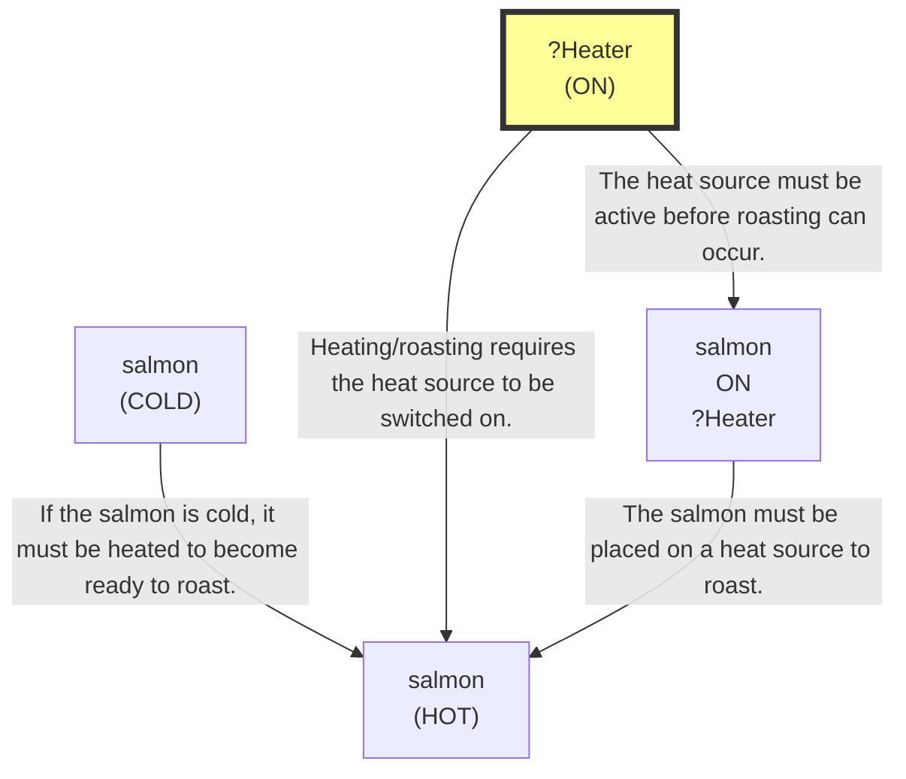
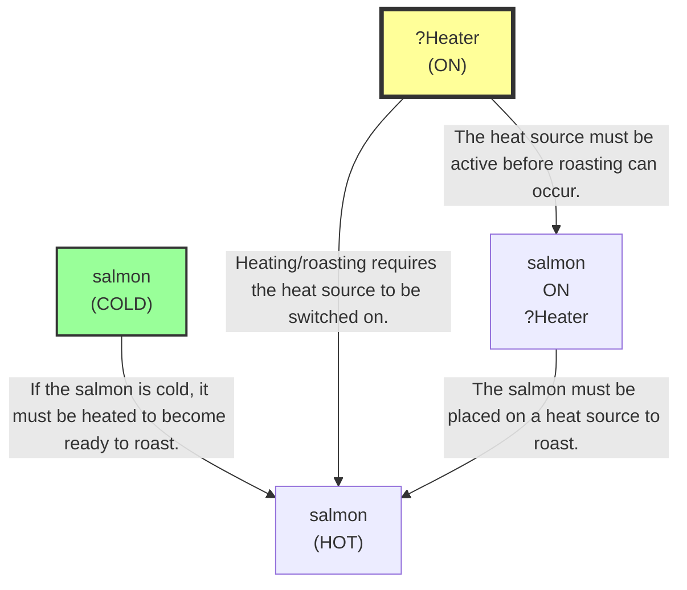
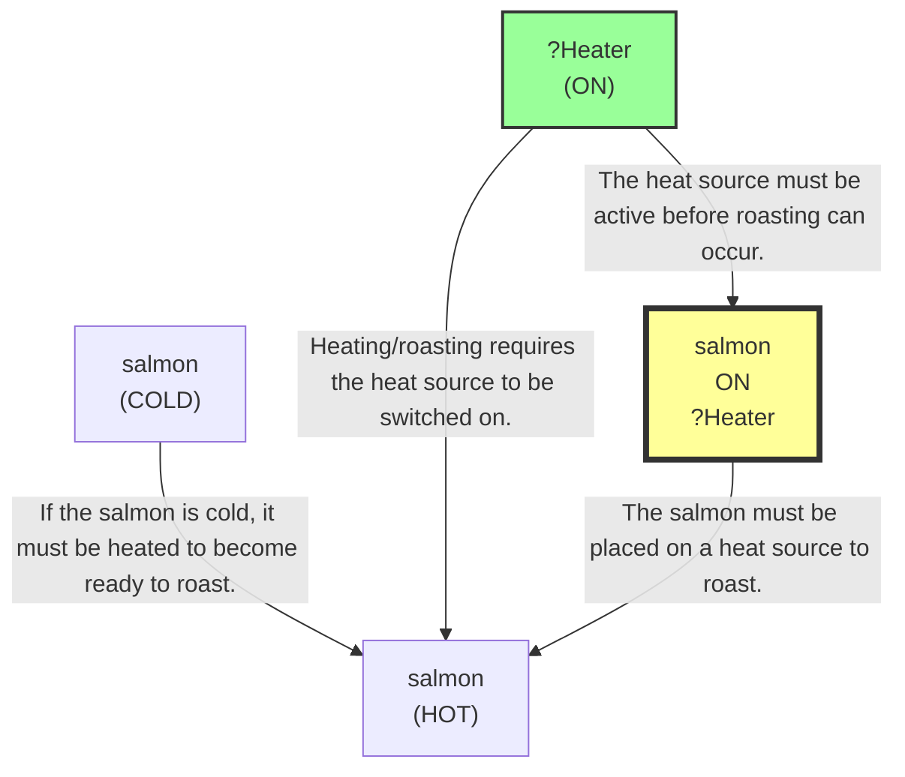
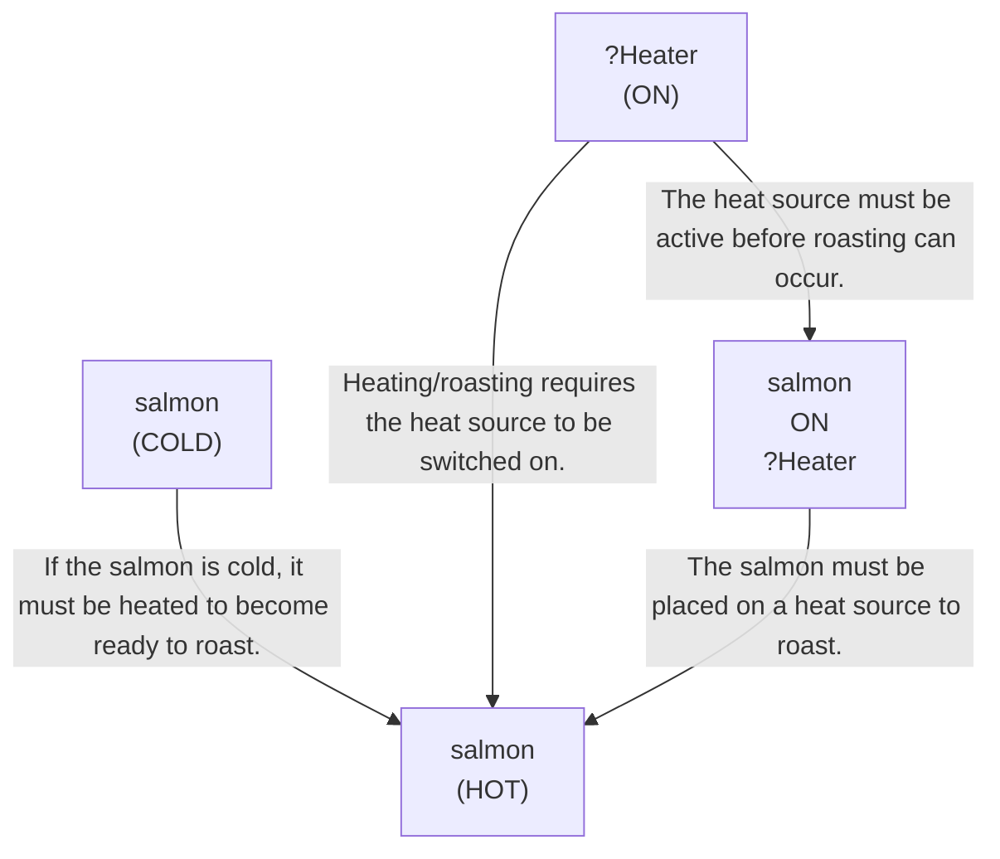

# 🚀 VirtualHome Agent Episode Log


### [GoalReasoner (Module A - Intent)] Output
```json
{
  "is_instruction_obviously_vague": false,
  "clarification_question": null,
  "target_object": "salmon",
  "location_hint": null,
  "reasoning_chain": [
    {
      "question": "Why does the user want this object?",
      "answer": "To prepare the salmon by applying heat if it is currently cold."
    },
    {
      "question": "Why is that important?",
      "answer": "Because the user wants the salmon to be served or consumed at a more suitable temperature/state."
    },
    {
      "question": "What fundamental need does this fulfill?",
      "answer": "To make food ready for eating and improve its palatability."
    },
    {
      "question": "Are there any deeper psychological or physical motivations?",
      "answer": "The user may want to satisfy hunger, ensure the food is warmed, or make it more enjoyable and edible."
    }
  ],
  "deep_intent": "The user wants to warm and prepare food for eating.",
  "acceptable_alternatives_properties": [
    {
      "priority": 1,
      "description": "Other ready-to-eat cooked foods that can be warmed or served hot, such as chicken, steak, or cooked vegetables."
    },
    {
      "priority": 2,
      "description": "Other seafood or protein dishes that can be heated and served similarly, such as fish fillets or shrimp."
    },
    {
      "priority": 3,
      "description": "Any cooked meal components that provide warmth and sustenance, such as rice, pasta, or soup."
    },
    {
      "priority": 4,
      "description": "Other foods that can satisfy hunger and be consumed at a comfortable temperature, such as sandwiches, bread-based items, or packaged meals."
    }
  ]
}
```

### [PerceptionFilter] Output
```json
{
  "reasoning": "The goal is to warm the salmon, so the target food must be kept along with a usable heat source and the appliance(s) needed to apply heat. Since the SDG requires a heater to be ON and the salmon to be ON that heater, the relevant physical heat-source options in the scene are the stove and microwave as functional alternatives, plus any container needed for heating if used.",
  "selected_classes": [
    "microwave",
    "plate",
    "salmon",
    "oventray",
    "stove",
    "character",
    "fryingpan"
  ],
  "raw_class_count": 99
}
```

### [LLMExecutor] Output
```json
{
  "reasoning": "The goal is to heat the salmon. The SDG requires salmon to transition from COLD to HOT by being ON a heater, and the heater must be ON first. The best heater candidate in the graph is stove(163), which has a switch and already has fryingpan(62) on it. The stove is currently OFF, so the next necessary step is to walk to the stove before switching it on. I am not yet at the stove, and proximity is required for switch actions.",
  "satisfied_nodes": [],
  "current_node_focus": "N3",
  "mapped_variables": {
    "?Heater": "stove(163)"
  },
  "action": "[walk] <stove> (163)"
}
```
## Step 0
- **Action**: `[walk] <stove> (163)`
- **SDG Status**:

- **Observed Items (23)**: character(1), kitchen(11), fryingpan(62), plate(67), plate(68), plate(75), plate(76), plate(83), plate(84), plate(91), plate(103), plate(104), stove(163) [OFF,CLOSED], oventray(164), microwave(171) [CLOSED,OFF]...


### [PerceptionFilter] Output
```json
{
  "reasoning": "The goal is to warm the salmon, so we need the target food plus a viable heat source and the state relation implied by the SDG. Since heating can be done with alternative appliances, keep all applicable heaters visible: stove, microwave, and oven tray/frying pan as cooking tools/surfaces are present. The salmon itself must be retained.",
  "selected_classes": [
    "microwave",
    "salmon",
    "oventray",
    "stove",
    "character",
    "fryingpan"
  ],
  "raw_class_count": 99
}
```

### [LLMExecutor] Output
```json
{
  "reasoning": "The robot is already close to the stove(163), which is the best heater candidate and is currently OFF. To progress toward making salmon hot, the next required node is to turn the heater ON. Proximity is satisfied, and the stove has HAS_SWITCH, so switching it on is the correct atomic step.",
  "satisfied_nodes": [
    "N1"
  ],
  "current_node_focus": "N3",
  "mapped_variables": {
    "?Heater": "stove(163)"
  },
  "action": "[switchon] <stove> (163)"
}
```
## Step 1
- **Action**: `[switchon] <stove> (163)`
- **SDG Status**:

- **Observed Items (10)**: character(1), kitchen(11), fryingpan(62), stove(163) [OFF,CLOSED], oventray(164), microwave(171) [CLOSED,OFF], salmon(181), livingroom(183), bedroom(241), bedroom(346)


### [PerceptionFilter] Output
```json
{
  "reasoning": "The goal is to warm salmon for eating, so we must keep the target food plus a valid heat source and its on-state capability. Since the SDG requires placing the salmon on a heater and turning it on, the relevant heater options visible are stove and microwave as alternative heating tools; other kitchen items are unnecessary.",
  "selected_classes": [
    "salmon",
    "microwave",
    "stove",
    "character"
  ],
  "raw_class_count": 99
}
```

### [LLMExecutor] Output
```json
{
  "reasoning": "The heater requirement is satisfied: stove(163) is already ON and the character is CLOSE to both the stove and the salmon. The remaining missing SDG node is to place the salmon ON the heater so it can become HOT. Since putback requires being at the destination, and we are already close to the stove, the next atomic action is to put the salmon onto the stove surface.",
  "satisfied_nodes": [
    "N3"
  ],
  "current_node_focus": "N4",
  "mapped_variables": {
    "?Heater": "stove(163)"
  },
  "action": "[putback] <salmon> (181) <stove> (163)"
}
```
## Step 2
- **Action**: `[putback] <salmon> (181) <stove> (163)`
- **SDG Status**:

- **Observed Items (8)**: character(1), kitchen(11), stove(163) [ON,CLOSED], microwave(171) [CLOSED,OFF], salmon(181), livingroom(183), bedroom(241), bedroom(346)


### [PerceptionFilter] Output
```json
{
  "reasoning": "The goal is to warm salmon for eating. The SDG requires the target food (salmon), a heat source that can be turned on, and the salmon placed on that heat source. From the visible objects, stove and microwave are the relevant heating alternatives to retain, along with the salmon itself. A fryingpan is also a needed cooking tool for heating salmon on a stove.",
  "selected_classes": [
    "microwave",
    "salmon",
    "stove",
    "character",
    "fryingpan"
  ],
  "raw_class_count": 99
}
```

### [LLMExecutor] Output
```json
{
  "reasoning": "The prior attempt to put the salmon onto the stove failed because the engine could not find the source object, even though salmon(181) is present and close in the filtered graph. The SDG still requires salmon to be placed ON the active heater (stove(163)) so it can become HOT. Since the stove is already ON and the robot is already close to it, the best next atomic step is to retry placing the salmon onto the stove surface.",
  "satisfied_nodes": [
    "N3"
  ],
  "current_node_focus": "N4",
  "mapped_variables": {
    "?Heater": "stove(163)"
  },
  "action": "[putback] <salmon> (181) <stove> (163)"
}
```
## Step 3
- **Action**: `[putback] <salmon> (181) <stove> (163)`
- **SDG Status**:

- **Observed Items (9)**: character(1), kitchen(11), fryingpan(62) [HOT], stove(163) [ON,CLOSED], microwave(171) [CLOSED,OFF], salmon(181), livingroom(183), bedroom(241), bedroom(346)


### [PerceptionFilter] Output
```json
{
  "reasoning": "The goal is to warm salmon for eating. The SDG requires the salmon plus a heat source that can be turned on and used for roasting/heating. From the visible classes, the relevant heat-source alternatives are stove, microwave, and coffeemaker is irrelevant; the required tools are the salmon and a viable heater. To keep backups, include all plausible heating appliances present.",
  "selected_classes": [
    "salmon",
    "microwave",
    "stove",
    "character"
  ],
  "raw_class_count": 99
}
```

### [LLMExecutor] Output
```json
{
  "reasoning": "The stove heater is already ON, satisfying node N3. The remaining gap is to place the salmon on the heater so it can become HOT (N4 leading to N2). The previous putback failed because the engine could not resolve the source object with the class-only action format; to follow the available action rules and the filtered graph, I should first grab the salmon, then later place it on the stove. Since the character is already CLOSE to salmon(181), grabbing is the correct next atomic step.",
  "satisfied_nodes": [
    "N3"
  ],
  "current_node_focus": "N4",
  "mapped_variables": {
    "?Heater": "stove(163)"
  },
  "action": "[grab] <salmon> (181)"
}
```
## Step 4
- **Action**: `[grab] <salmon> (181)`
- **SDG Status**:

- **Observed Items (8)**: character(1), kitchen(11), stove(163) [ON,CLOSED], microwave(171) [CLOSED,OFF], salmon(181), livingroom(183), bedroom(241), bedroom(346)


### [PerceptionFilter] Output
```json
{
  "reasoning": "The goal is to warm the target food, salmon, which requires the salmon itself plus a suitable heat source and a way to activate it. The SDG specifically indicates a heater that is ON and the salmon must be ON that heater. From the visible objects, the relevant heating appliances are the stove and microwave as alternative heat sources, and the fryingpan or oventray as likely physical supports for heating the salmon. The salmon itself must be kept.",
  "selected_classes": [
    "microwave",
    "salmon",
    "oventray",
    "stove",
    "character",
    "fryingpan"
  ],
  "raw_class_count": 99
}
```

### [LLMExecutor] Output
```json
{
  "reasoning": "The stove heater is already ON, satisfying N3. The character is holding salmon(181) in the right hand and is close to the stove, so the remaining missing SDG relation/state is to place the salmon ON the active heater so it can become HOT. Since putback to a surface requires being near the destination and we already are, the next atomic action is to place the held salmon onto the stove.",
  "satisfied_nodes": [
    "N3"
  ],
  "current_node_focus": "N4",
  "mapped_variables": {
    "?Heater": "stove(163)"
  },
  "action": "[putback] <salmon> (181) <stove> (163)"
}
```
## Step 5
- **Action**: `[putback] <salmon> (181) <stove> (163)`
- **SDG Status**:

- **Observed Items (10)**: character(1), kitchen(11), fryingpan(62) [HOT], stove(163) [ON,CLOSED], oventray(164), microwave(171) [CLOSED,OFF], salmon(181), livingroom(183), bedroom(241), bedroom(346)


### [PerceptionFilter] Output
```json
{
  "reasoning": "The goal is to warm salmon for eating. The SDG requires the salmon plus a heat source that can be turned on and used for roasting/heating. To satisfy alternative-tool retention, keep all plausible heating appliances visible (microwave, stove, toaster, coffeemaker is not relevant) and the salmon target itself. Sink/fridge are not required by the current SDG.",
  "selected_classes": [
    "microwave",
    "salmon",
    "toaster",
    "stove",
    "character"
  ],
  "raw_class_count": 99
}
```
## Step 6
- **Action**: `FINISH (Goal Reached)`
- **SDG Status**:

- **Observed Items (9)**: character(1), kitchen(11), stove(163) [ON,CLOSED], toaster(166) [OFF], microwave(171) [CLOSED,OFF], salmon(181) [HOT], livingroom(183), bedroom(241), bedroom(346)

