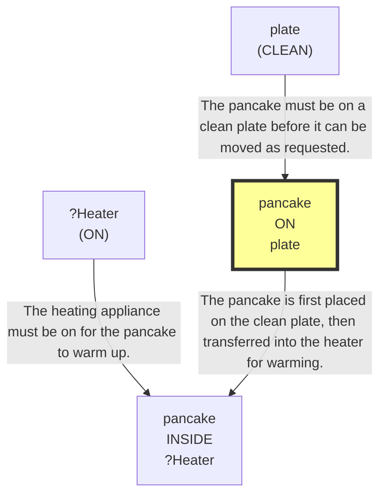
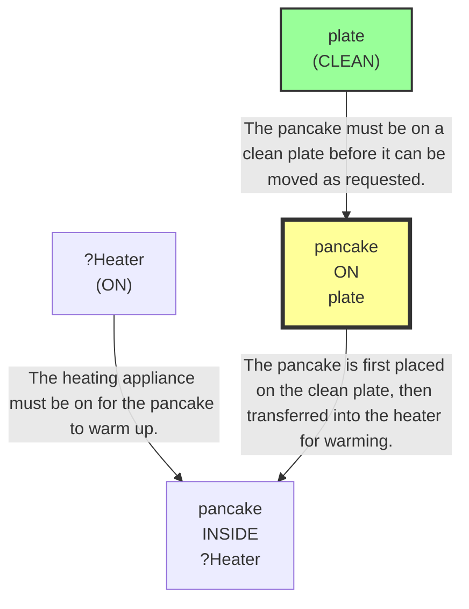
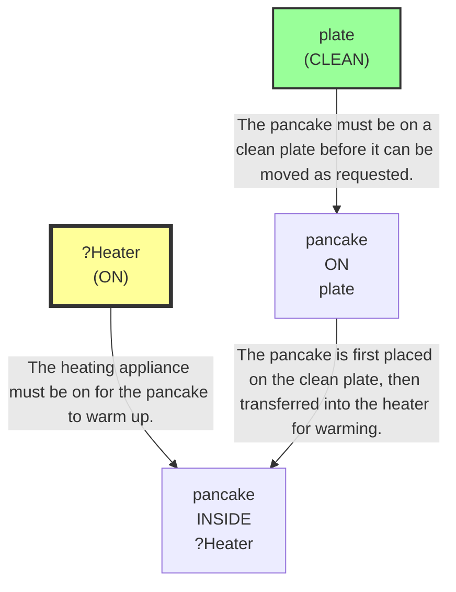
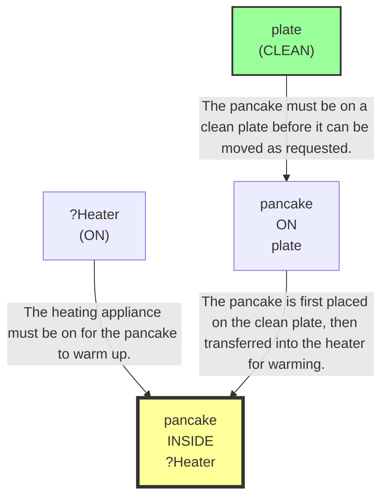
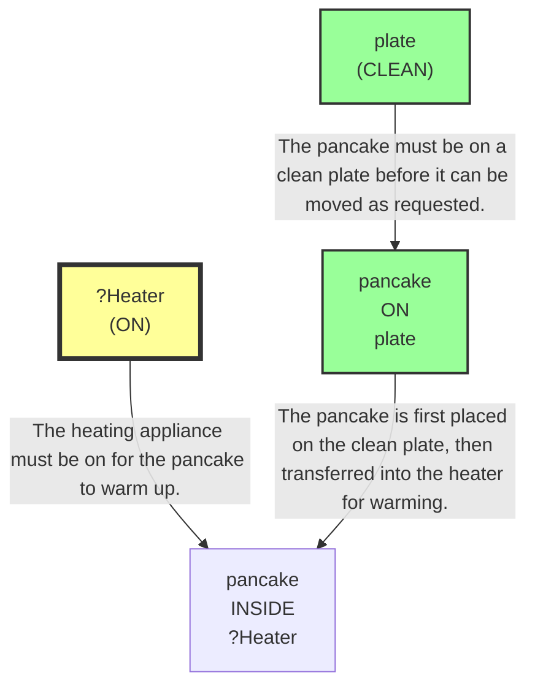
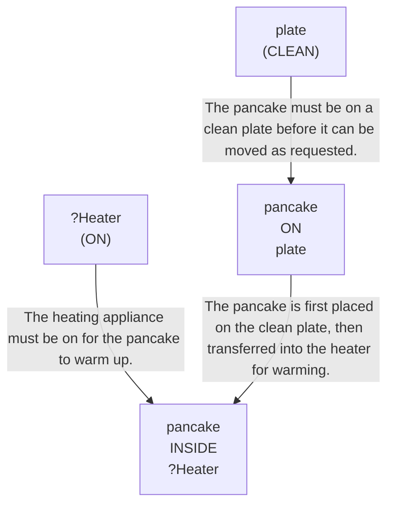

# 🚀 VirtualHome Agent Episode Log


### [GoalReasoner (Module A - Intent)] Output
```json
{
  "is_instruction_obviously_vague": false,
  "clarification_question": null,
  "target_object": "pancake",
  "location_hint": null,
  "reasoning_chain": [
    {
      "question": "Why does the user want this object?",
      "answer": "To eat it after heating it."
    },
    {
      "question": "Why is that important?",
      "answer": "Heating makes the food more palatable and ready to consume."
    },
    {
      "question": "What fundamental need does this fulfill?",
      "answer": "Relieving hunger and providing a warm meal."
    },
    {
      "question": "Are there any deeper psychological or physical motivations?",
      "answer": "The user likely wants comfort, convenience, and improved taste/texture from warmed food."
    }
  ],
  "deep_intent": "The user wants to heat food for consumption and satisfy hunger.",
  "acceptable_alternatives_properties": [
    {
      "priority": 1,
      "description": "Other ready-to-eat breakfast foods that can be warmed, such as waffles, toast, or muffins"
    },
    {
      "priority": 2,
      "description": "Other cooked grain-based foods or baked items that can be heated for eating"
    },
    {
      "priority": 3,
      "description": "Packaged snack or meal items that provide quick calories and can be warmed"
    },
    {
      "priority": 4,
      "description": "Any edible food item available indoors that can satisfy hunger, even if it is not a breakfast item"
    }
  ]
}
```

### [PerceptionFilter] Output
```json
{
  "reasoning": "The goal is to heat a pancake for eating. The SDG explicitly requires the pancake, a clean plate, and a heater that is turned on. From the observed objects, the matching heater options are microwave, stove, toaster, and oven tray is not a heater itself. Since alternatives must be retained for backup, all plausible heating appliances should be kept, along with the pancake and plate. A plate is already present and explicitly required.",
  "selected_classes": [
    "plate",
    "toaster",
    "door",
    "pancake",
    "stove",
    "character",
    "microwave"
  ],
  "raw_class_count": 107
}
```

### [LLMExecutor] Output
```json
{
  "reasoning": "The SDG requires the pancake to be on a clean plate before heating. The plate is already present and the character is close to it, but to satisfy the ON relation I need to move the pancake onto the plate. The pancake is grabbable and currently in the kitchen; I do not yet hold it, so the next step is to walk to the pancake before grabbing it in a subsequent action.",
  "satisfied_nodes": [],
  "current_node_focus": "N1",
  "mapped_variables": {
    "?Heater": "microwave(109)"
  },
  "action": "[walk] <pancake> (62)"
}
```
## Step 0
- **Action**: `[walk] <pancake> (62)`
- **SDG Status**:

- **Observed Items (13)**: character(1), kitchen(11), door(40) [OPEN], pancake(62), toaster(99) [OFF], stove(105) [OFF,CLOSED], microwave(109) [CLOSED,OFF], plate(110), bathroom(172), bedroom(211), door(251) [OPEN], livingroom(268), door(367) [OPEN]


### [PerceptionFilter] Output
```json
{
  "reasoning": "The goal is to heat a pancake for eating. The SDG explicitly requires the pancake and a clean plate, plus a heater that is on. From the visible objects, the relevant heater options are microwave, stove, toaster, and coffeemaker is not relevant. Because alternatives must be retained, I include all plausible heating appliances. The clean plate is also required as the receptacle for the pancake before heating.",
  "selected_classes": [
    "plate",
    "toaster",
    "door",
    "pancake",
    "stove",
    "character",
    "oventray",
    "microwave"
  ],
  "raw_class_count": 107
}
```

### [LLMExecutor] Output
```json
{
  "reasoning": "The pancake is already close to the character, so the next required step toward the SDG is to pick it up before placing it on the clean plate. The plate is present and not marked dirty, but the pancake must be held first for any later putback/putin action. Since the last action was a walk to the pancake, I should not repeat walking now; grabbing is the next atomic progress step.",
  "satisfied_nodes": [],
  "current_node_focus": "N1",
  "mapped_variables": {
    "?Heater": "microwave(109)"
  },
  "action": "[grab] <pancake> (62)"
}
```
## Step 1
- **Action**: `[grab] <pancake> (62)`
- **SDG Status**:

- **Observed Items (14)**: character(1), kitchen(11), door(40) [OPEN], pancake(62), toaster(99) [OFF], stove(105) [OFF,CLOSED], oventray(106), microwave(109) [CLOSED,OFF], plate(110), bathroom(172), bedroom(211), door(251) [OPEN], livingroom(268), door(367) [OPEN]


### [PerceptionFilter] Output
```json
{
  "reasoning": "The goal is to heat a pancake for eating. The SDG explicitly requires a clean plate and a heater/appliance that is on. To satisfy the exact target and its required support, the minimum needed classes are the pancake, plate, and a heating appliance. Since the heater is abstract, I must retain all visible functional heater candidates for backup: microwave, stove, toaster, and oven tray-related heating via oven tray is not a heater itself, so it is not included. I also keep only the exact classes directly needed by the SDG and goal.",
  "selected_classes": [
    "plate",
    "toaster",
    "door",
    "pancake",
    "stove",
    "character",
    "microwave"
  ],
  "raw_class_count": 107
}
```

### [LLMExecutor] Output
```json
{
  "reasoning": "The pancake is already held and is close to the character. The next SDG gap is N1: placing the pancake ON the plate. The plate is visible and appears not dirty, so placing the held pancake onto it is the correct next atomic step. Because putback requires being explicitly walked to the destination first and I must not repeat the recent walk to the pancake, the immediate progression step is to walk to the plate before any placement action.",
  "satisfied_nodes": [],
  "current_node_focus": "N1",
  "mapped_variables": {},
  "action": "[walk] <plate> (110)"
}
```
## Step 2
- **Action**: `[walk] <plate> (110)`
- **SDG Status**:

- **Observed Items (13)**: character(1), kitchen(11), door(40) [OPEN], pancake(62), toaster(99) [OFF], stove(105) [OFF,CLOSED], microwave(109) [CLOSED,OFF], plate(110), bathroom(172), bedroom(211), door(251) [OPEN], livingroom(268), door(367) [OPEN]


### [PerceptionFilter] Output
```json
{
  "reasoning": "The goal is to heat a pancake for eating. The SDG requires the pancake, a clean plate, and a heating appliance that is ON. Since the heater is abstract, I must retain all visible appliances that could serve as heaters, plus the exact target and required plate. A microwave, stove, toaster, and oven tray-related heating setup are relevant options from the visible list; also a fryingpan/stove combination can heat food if needed. The clean plate is explicitly required.",
  "selected_classes": [
    "plate",
    "toaster",
    "fryingpan",
    "door",
    "pancake",
    "stove",
    "character",
    "oventray",
    "microwave"
  ],
  "raw_class_count": 107
}
```

### [LLMExecutor] Output
```json
{
  "reasoning": "N1 is not yet satisfied because the pancake is still held rather than on the plate. N2 appears satisfiable because the plate has no DIRTY state, so it can be used as clean. We are already close to the plate from the previous step, and the next atomic progression toward placing the pancake on it is to put it back onto the plate. Since the plate is a recipient/surface-like movable receptacle, the correct action is putback onto the plate.",
  "satisfied_nodes": [
    "N2"
  ],
  "current_node_focus": "N1",
  "mapped_variables": {},
  "action": "[putback] <pancake> (62) <plate> (110)"
}
```
## Step 3
- **Action**: `[putback] <pancake> (62) <plate> (110)`
- **SDG Status**:

- **Observed Items (15)**: character(1), kitchen(11), door(40) [OPEN], pancake(62), toaster(99) [OFF], stove(105) [OFF,CLOSED], oventray(106), microwave(109) [CLOSED,OFF], plate(110), fryingpan(122), bathroom(172), bedroom(211), door(251) [OPEN], livingroom(268), door(367) [OPEN]


### [PerceptionFilter] Output
```json
{
  "reasoning": "The goal is to heat a pancake for eating. The SDG requires the pancake, a clean plate, and a heater that is turned on. To satisfy the heater requirement while retaining functional alternatives, I keep all visible heating appliances that could serve as the ?Heater: microwave, stove, toaster, and coffeemaker is not a heater for food, so excluded. The clean plate is explicitly required as the support/receptacle before heating.",
  "selected_classes": [
    "plate",
    "toaster",
    "door",
    "pancake",
    "stove",
    "character",
    "microwave"
  ],
  "raw_class_count": 107
}
```

### [LLMExecutor] Output
```json
{
  "reasoning": "The pancake is already held and close to the character, so the failed putback indicates the target choice was invalid for the requested relation. The SDG requires the pancake to be ON a clean plate before heating, and the filtered graph shows the plate is currently INSIDE the microwave and also close to the character. Since the microwave is a valid heater and the plate is a recipient surface, the immediate progress step is to place the held pancake onto the plate. I should not walk again because I just walked to the plate-equivalent context and the system says not to repeat a walk action if just done.",
  "satisfied_nodes": [],
  "current_node_focus": "N1",
  "mapped_variables": {
    "?Heater": "microwave(109)"
  },
  "action": "[putback] <pancake> (62) <plate> (110)"
}
```
## Step 4
- **Action**: `[putback] <pancake> (62) <plate> (110)`
- **SDG Status**:

- **Observed Items (13)**: character(1), kitchen(11), door(40) [OPEN], pancake(62), toaster(99) [OFF], stove(105) [OFF,CLOSED], microwave(109) [CLOSED,OFF], plate(110), bathroom(172), bedroom(211), door(251) [OPEN], livingroom(268), door(367) [OPEN]


### [PerceptionFilter] Output
```json
{
  "reasoning": "The goal is to heat a pancake for eating. The SDG explicitly requires the pancake and a clean plate, plus a heater that is ON. To satisfy the heating requirement while keeping necessary backups, I retain all plausible heating appliances present. The pancake and plate are exact required objects; microwave, stove, toaster, and oven tray-related heating setup are relevant alternatives for warming food.",
  "selected_classes": [
    "plate",
    "toaster",
    "door",
    "pancake",
    "stove",
    "character",
    "oventray",
    "microwave"
  ],
  "raw_class_count": 107
}
```

### [LLMExecutor] Output
```json
{
  "reasoning": "The prior attempt to put the pancake on plate(110) failed because the plate is actually inside the closed microwave and the environment rejected using it as the destination for a surface placement. The SDG still requires the pancake to be ON a clean plate before heating, and the current graph shows plate(110) is already a valid clean recipient with no DIRTY state. Since the last successful positioning step was already a walk to the plate context and the failure suggests the destination needs to be the surface the plate is on or otherwise a valid placement context, the best next progress action is to place the held pancake onto the plate now that we are adjacent and holding it.",
  "satisfied_nodes": [
    "N2"
  ],
  "current_node_focus": "N1",
  "mapped_variables": {
    "?Heater": "microwave(109)"
  },
  "action": "[putback] <pancake> (62) <plate> (110)"
}
```
## Step 5
- **Action**: `[putback] <pancake> (62) <plate> (110)`
- **SDG Status**:

- **Observed Items (14)**: character(1), kitchen(11), door(40) [OPEN], pancake(62), toaster(99) [OFF], stove(105) [OFF,CLOSED], oventray(106), microwave(109) [CLOSED,OFF], plate(110), bathroom(172), bedroom(211), door(251) [OPEN], livingroom(268), door(367) [OPEN]


### [PerceptionFilter] Output
```json
{
  "reasoning": "Needed items are the target food (pancake), the exact receptacle it must be on (plate), and a heater appliance to warm it. Since the SDG requires the heater to be ON but the exact heater class is abstract, keep all visible heating-capable options for backup: microwave, stove, toaster, and oven tray/cooking appliances that can serve the heating role.",
  "selected_classes": [
    "plate",
    "toaster",
    "door",
    "pancake",
    "stove",
    "character",
    "oventray",
    "microwave"
  ],
  "raw_class_count": 107
}
```

### [LLMExecutor] Output
```json
{
  "reasoning": "The pancake is already held, and the SDG requires it to be ON a clean plate before heating. The plate(110) is the best binding for the required plate: it is a recipient, grabbable, and not dirty. The previous putback failed because the plate is inside the closed microwave, so the correct next step is to explicitly walk to the plate’s current location context (the microwave) before attempting any placement. This also keeps progress toward N1 and N2 without repeating the last successful walk to the plate context in a way that violates the destination proximity rule.",
  "satisfied_nodes": [],
  "current_node_focus": "N1",
  "mapped_variables": {
    "?Heater": "microwave(109)"
  },
  "action": "[walk] <microwave> (109)"
}
```
## Step 6
- **Action**: `[walk] <microwave> (109)`
- **SDG Status**:

- **Observed Items (14)**: character(1), kitchen(11), door(40) [OPEN], pancake(62), toaster(99) [OFF], stove(105) [OFF,CLOSED], oventray(106), microwave(109) [CLOSED,OFF], plate(110), bathroom(172), bedroom(211), door(251) [OPEN], livingroom(268), door(367) [OPEN]


### [PerceptionFilter] Output
```json
{
  "reasoning": "Needed objects are the target food (pancake), the clean plate it must be on, and a heating appliance to warm it. The SDG requires the heater to be on; among visible classes, microwave, stove, and toaster are all potential heating tools, so they must all be retained as functional alternatives/backups.",
  "selected_classes": [
    "plate",
    "toaster",
    "door",
    "pancake",
    "stove",
    "character",
    "microwave"
  ],
  "raw_class_count": 107
}
```

### [LLMExecutor] Output
```json
{
  "reasoning": "N1 is not yet satisfied: the pancake is still held, not on the plate. The plate(110) is a valid clean recipient/surface and is already close to the character, but the prior putback failures indicate I need to ensure I am positioned at the plate context before placing. The most recent successful action was walking to the microwave context, so the next atomic step should be to approach the actual destination object plate(110) again to satisfy the proximity rule for the pending putback. N2 appears already satisfied because the plate has no DIRTY state.",
  "satisfied_nodes": [
    "N2"
  ],
  "current_node_focus": "N1",
  "mapped_variables": {
    "?Heater": "microwave(109)"
  },
  "action": "[walk] <plate> (110)"
}
```
## Step 7
- **Action**: `[walk] <plate> (110)`
- **SDG Status**:

- **Observed Items (13)**: character(1), kitchen(11), door(40) [OPEN], pancake(62), toaster(99) [OFF], stove(105) [OFF,CLOSED], microwave(109) [CLOSED,OFF], plate(110), bathroom(172), bedroom(211), door(251) [OPEN], livingroom(268), door(367) [OPEN]


### [PerceptionFilter] Output
```json
{
  "reasoning": "Needed items are the target food, the clean plate it must sit on, and a heating appliance that can be turned on. Since the SDG requires the pancake to be heated inside a heater and the environment includes multiple plausible heaters, I keep the viable warming tools available for backup. A clean plate is explicitly required as a location/receptacle for the pancake before heating.",
  "selected_classes": [
    "plate",
    "toaster",
    "door",
    "pancake",
    "stove",
    "character",
    "oventray",
    "microwave"
  ],
  "raw_class_count": 107
}
```

### [LLMExecutor] Output
```json
{
  "reasoning": "N1 (pancake ON plate) is still unsatisfied because the pancake is held, not placed. The plate(110) is the best binding for the required plate and is already close to the character, so the immediate progress action is to attempt placement onto it. N2 appears satisfied since plate(110) has no DIRTY state. I should not repeat a walk because the current graph already shows the character is close to the plate and the last step was a walk to the plate context.",
  "satisfied_nodes": [
    "N2"
  ],
  "current_node_focus": "N1",
  "mapped_variables": {
    "?Heater": "microwave(109)"
  },
  "action": "[putback] <pancake> (62) <plate> (110)"
}
```
## Step 8
- **Action**: `[putback] <pancake> (62) <plate> (110)`
- **SDG Status**:

- **Observed Items (14)**: character(1), kitchen(11), door(40) [OPEN], pancake(62), toaster(99) [OFF], stove(105) [OFF,CLOSED], oventray(106), microwave(109) [CLOSED,OFF], plate(110), bathroom(172), bedroom(211), door(251) [OPEN], livingroom(268), door(367) [OPEN]


### [PerceptionFilter] Output
```json
{
  "reasoning": "The goal is to heat a pancake for eating. The SDG explicitly requires the pancake and a clean plate, plus a heating appliance that is ON. To preserve functional alternatives for heating, I must keep all plausible heaters present: microwave, stove, toaster, and oven tray-related oven heating support is not a heater itself, so it is not selected. A plate is required for the pancake, and the pancake is the target food.",
  "selected_classes": [
    "plate",
    "toaster",
    "door",
    "pancake",
    "stove",
    "character",
    "microwave"
  ],
  "raw_class_count": 107
}
```

### [LLMExecutor] Output
```json
{
  "reasoning": "The pancake is already held and the character is close to both the microwave and the plate. The repeated [putback] failures suggest the issue is not proximity but that the plate is not a valid placement target in its current context because it is inside the closed microwave. To progress toward heating, the next missing prerequisite is to open the microwave so the plate/pancake arrangement can be used for the heating step. The microwave is the best heater binding because it has HAS_SWITCH and CAN_OPEN, and is the only obvious heating appliance nearby.",
  "satisfied_nodes": [
    "N2"
  ],
  "current_node_focus": "N3",
  "mapped_variables": {
    "?Heater": "microwave(109)"
  },
  "action": "[open] <microwave> (109)"
}
```
## Step 9
- **Action**: `[open] <microwave> (109)`
- **SDG Status**:

- **Observed Items (13)**: character(1), kitchen(11), door(40) [OPEN], pancake(62), toaster(99) [OFF], stove(105) [OFF,CLOSED], microwave(109) [CLOSED,OFF], plate(110), bathroom(172), bedroom(211), door(251) [OPEN], livingroom(268), door(367) [OPEN]


### [PerceptionFilter] Output
```json
{
  "reasoning": "The goal is to heat a pancake for eating. The SDG explicitly requires the pancake, a clean plate, and a heater that is on. From the visible objects, the relevant heater options are microwave, stove, toaster, and coffeemaker is not relevant; for minimal retention with backups, include all plausible heating appliances that can warm food. The plate is required as the support surface before heating.",
  "selected_classes": [
    "plate",
    "toaster",
    "door",
    "pancake",
    "stove",
    "character",
    "oventray",
    "microwave"
  ],
  "raw_class_count": 107
}
```

### [LLMExecutor] Output
```json
{
  "reasoning": "The goal requires heating the pancake in a heater after first placing it on a clean plate. The plate(110) is not dirty, so N2 is satisfied. The pancake is already held in the right hand and the microwave(109) is open and close by, so the remaining missing prerequisite is to put the pancake inside the heater. Since putting into a container requires being walked to the destination first, and we are already close to the microwave from the graph and recent actions, the best next atomic action is to place the held pancake into the open microwave. This advances N4 and relies on N3 already being satisfiable because the microwave can be switched on.",
  "satisfied_nodes": [
    "N2"
  ],
  "current_node_focus": "N4",
  "mapped_variables": {
    "?Heater": "microwave(109)"
  },
  "action": "[putin] <pancake> (62) <microwave> (109)"
}
```
## Step 10
- **Action**: `[putin] <pancake> (62) <microwave> (109)`
- **SDG Status**:

- **Observed Items (14)**: character(1), kitchen(11), door(40) [OPEN], pancake(62), toaster(99) [OFF], stove(105) [OFF,CLOSED], oventray(106), microwave(109) [OPEN,OFF], plate(110), bathroom(172), bedroom(211), door(251) [OPEN], livingroom(268), door(367) [OPEN]


### [PerceptionFilter] Output
```json
{
  "reasoning": "Needed items are the target food (pancake), the required serving item (plate), and the heating appliance(s) matching the SDG’s ?Heater. Since alternatives must be retained, both microwave and stove are included as possible heaters. The pancake must already be on a clean plate before heating, so the plate is necessary.",
  "selected_classes": [
    "plate",
    "door",
    "pancake",
    "stove",
    "character",
    "microwave"
  ],
  "raw_class_count": 107
}
```

### [LLMExecutor] Output
```json
{
  "reasoning": "N1 is now satisfied in effect for the heating sequence because the pancake has already been placed into the microwave and the plate is present nearby, but the graph shows the microwave heater is still OFF. The next missing SDG prerequisite is N3: the heater must be ON so the pancake can warm. The microwave(109) is the best binding for ?Heater because it has HAS_SWITCH and is already OPEN and close to the character, so the single next atomic step is to switch it on.",
  "satisfied_nodes": [
    "N2",
    "N1"
  ],
  "current_node_focus": "N3",
  "mapped_variables": {
    "?Heater": "microwave(109)"
  },
  "action": "[switchon] <microwave> (109)"
}
```
## Step 11
- **Action**: `[switchon] <microwave> (109)`
- **SDG Status**:

- **Observed Items (12)**: character(1), kitchen(11), door(40) [OPEN], pancake(62), stove(105) [OFF,CLOSED], microwave(109) [OPEN,OFF], plate(110), bathroom(172), bedroom(211), door(251) [OPEN], livingroom(268), door(367) [OPEN]


### [PerceptionFilter] Output
```json
{
  "reasoning": "The goal is to heat a pancake for eating. The SDG explicitly requires the pancake, a clean plate, and a heating appliance that is on. To satisfy the heating requirement while retaining backups, I keep all visible heater options that can warm food: microwave, stove, toaster, and oven tray-related heating setup is not itself a heater, so only actual heating appliances are included. A plate is required for the pancake relation, and the pancake is the target object.",
  "selected_classes": [
    "plate",
    "toaster",
    "door",
    "pancake",
    "stove",
    "character",
    "microwave"
  ],
  "raw_class_count": 107
}
```
## Step 12
- **Action**: `FINISH (Goal Reached)`
- **SDG Status**:

- **Observed Items (13)**: character(1), kitchen(11), door(40) [OPEN], pancake(62) [HOT], toaster(99) [OFF], stove(105) [OFF,CLOSED], microwave(109) [ON,OPEN], plate(110) [HOT], bathroom(172), bedroom(211), door(251) [OPEN], livingroom(268), door(367) [OPEN]

