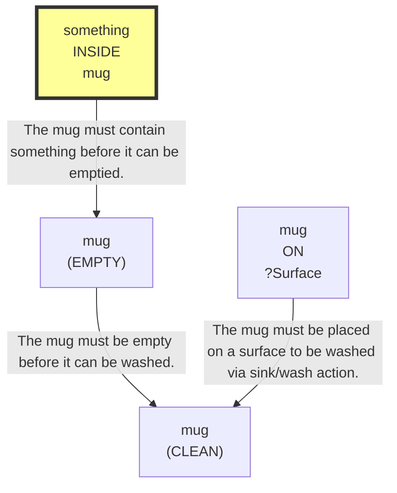
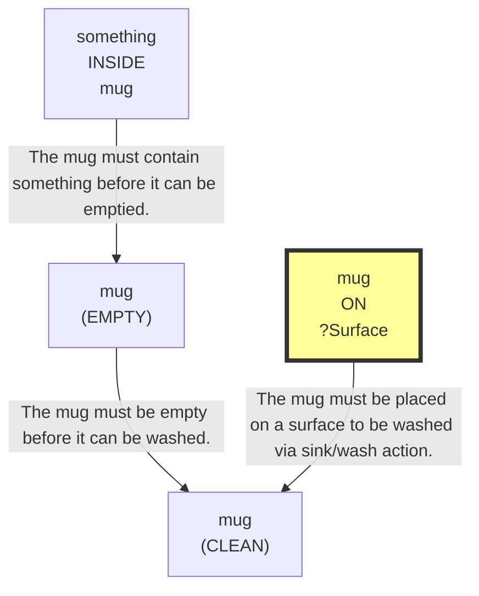
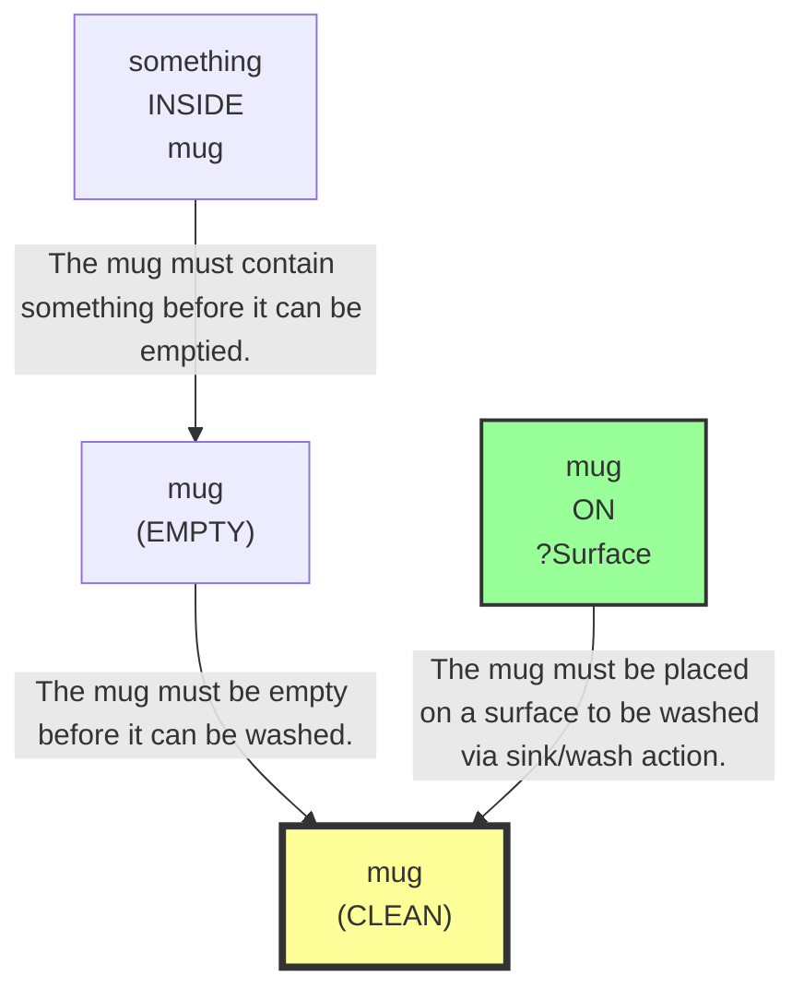
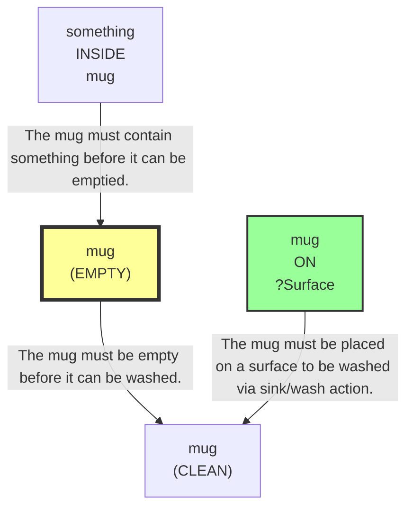
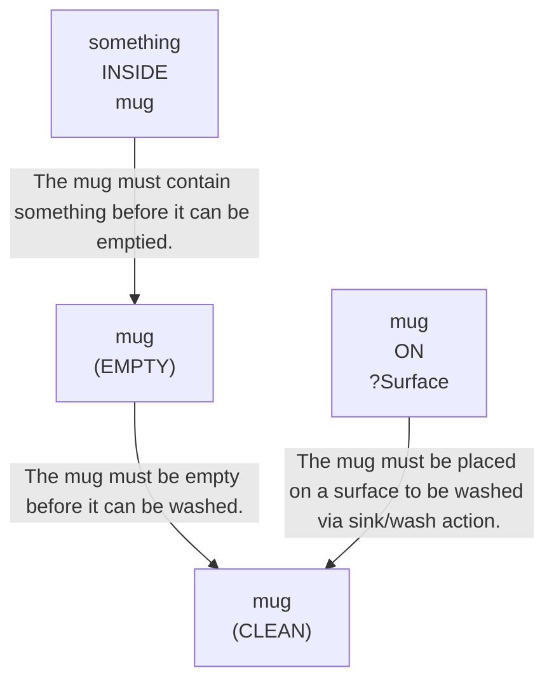

# 🚀 VirtualHome Agent Episode Log


### [GoalReasoner (Module A - Intent)] Output
```json
{
  "is_instruction_obviously_vague": false,
  "clarification_question": null,
  "target_object": "mug",
  "location_hint": null,
  "reasoning_chain": [
    {
      "question": "Why does the user want this object?",
      "answer": "Because they want the mug to be emptied and washed if it currently contains anything."
    },
    {
      "question": "Why is that important?",
      "answer": "To restore the mug to a clean, usable state."
    },
    {
      "question": "What fundamental need does this fulfill?",
      "answer": "It supports maintaining cleanliness and readiness for future use."
    },
    {
      "question": "Are there any deeper psychological or physical motivations?",
      "answer": "The user likely wants to remove residue or liquid, reduce mess, and have a clean drinking vessel available."
    }
  ],
  "deep_intent": "The user wants to clean and reset a drinking vessel for future use.",
  "acceptable_alternatives_properties": [
    {
      "priority": 1,
      "description": "Other small drinkware items that can be emptied and washed, such as a cup or glass"
    },
    {
      "priority": 2,
      "description": "Similar reusable beverage containers that can be cleaned, such as a tumbler or travel cup"
    },
    {
      "priority": 3,
      "description": "Other washable kitchen containers used for drinks or serving liquids"
    },
    {
      "priority": 4,
      "description": "Any household item intended to hold liquid that can be emptied and cleaned to restore usability"
    }
  ]
}
```

### [PerceptionFilter] Output
```json
{
  "reasoning": "The goal is to empty and wash the mug, so the mug itself must be kept. The SDG requires a surface for the mug and implies washing, so sink and washingsponge are needed, and dishwasher is an alternative washing tool that should be retained as a backup. A faucet is also relevant for water during washing. Because the mug must contain something before being emptied, we keep plausible fillable contents from the scene that could be inside it, and a waterglass/wineglass as alternative drinkware targets consistent with the intent.",
  "selected_classes": [
    "sink",
    "washingsponge",
    "waterglass",
    "mug",
    "wineglass",
    "faucet",
    "character",
    "coffeepot",
    "dishwasher",
    "milk"
  ],
  "raw_class_count": 107
}
```

### [LLMExecutor] Output
```json
{
  "reasoning": "The goal is to make the mug empty and then clean. In the current graph, mug(118) is already close to the character and is the target object. However, its contents are unknown, and N4 (something inside mug) would need to be handled before emptying/cleaning. The next atomic step toward satisfying the SDG is to inspect or retrieve the mug by grabbing it, since it is grabbable and close, which is necessary before any potential pouring/washing sequence.",
  "satisfied_nodes": [],
  "current_node_focus": "N4",
  "mapped_variables": {},
  "action": "[grab] <mug> (118)"
}
```
## Step 0
- **Action**: `[grab] <mug> (118)`
- **SDG Status**:

- **Observed Items (20)**: character(1), kitchen(11), milk(46) [CLOSED], sink(90), faucet(91) [OFF], dishwasher(104) [CLOSED,OFF], coffeepot(108) [CLOSED], washingsponge(111), mug(118), waterglass(123), waterglass(140), waterglass(141), waterglass(142), bathroom(172), faucet(195) [OFF]...


### [PerceptionFilter] Output
```json
{
  "reasoning": "The goal is to empty and wash the mug, so the target object mug must be kept. The SDG requires something inside the mug to allow emptying, and a washing setup to clean it: a sink or dishwasher, plus wash tools like dishwashingliquid and washingsponge. The mug must also be on a surface during washing, so relevant placement surfaces are kept minimally. Because the instructions require backups, I keep both main washing appliances and alternative drinkware targets that match the intent.",
  "selected_classes": [
    "sink",
    "washingsponge",
    "waterglass",
    "kitchencounter",
    "kitchentable",
    "mug",
    "table",
    "dishwashingliquid",
    "wineglass",
    "character",
    "dishwasher"
  ],
  "raw_class_count": 107
}
```

### [LLMExecutor] Output
```json
{
  "reasoning": "The mug is already held in the right hand, so N4 is not yet relevant until we know/handle any contents. Since the goal is to empty and wash the mug, the next necessary step is to move it to a place where it can be emptied or washed. The mug must be on a surface before washing per the SDG relation N3 -> N2, and the sink is the proper target area for washing/emptying. However, because putting something down requires being near the destination first, the next atomic action should be to walk to the sink. I choose sink(90) because it is the kitchen sink and the closest/appropriate washing location.",
  "satisfied_nodes": [],
  "current_node_focus": "N3",
  "mapped_variables": {
    "?Surface": "sink(90)"
  },
  "action": "[walk] <sink> (90)"
}
```
## Step 1
- **Action**: `[walk] <sink> (90)`
- **SDG Status**:

- **Observed Items (21)**: character(1), kitchen(11), kitchentable(72), kitchencounter(81) [CLOSED], sink(90), kitchencounter(92) [CLOSED], kitchencounter(93) [CLOSED], dishwasher(104) [CLOSED,OFF], washingsponge(111), dishwashingliquid(112), mug(118), waterglass(123), waterglass(140), waterglass(141), waterglass(142)...


### [PerceptionFilter] Output
```json
{
  "reasoning": "The goal is to empty and wash the mug, so the target object mug must be kept. The SDG implies the mug may contain something and must be placed on a surface to wash, so a sink and washing tools are needed. I retained the sink plus wash-related tools/receptacles that could serve as functional alternatives or backups for cleaning and holding the mug: dishwashingliquid and washingsponge, along with the mug itself.",
  "selected_classes": [
    "sink",
    "washingsponge",
    "mug",
    "dishwashingliquid",
    "character"
  ],
  "raw_class_count": 107
}
```

### [LLMExecutor] Output
```json
{
  "reasoning": "The mug is already held, and the next required SDG progress is to get it onto a washing surface so it can be cleaned and eventually emptied if needed. We are already close to sink(90), and the previous action was a walk to that sink, so the immediate next atomic step should not repeat walking. Since washing requires the object to be on a sink/surface first, the best next action is to place the mug into the sink area. Because the sink is a flat surface in this engine, the correct placement action is putback onto the sink.",
  "satisfied_nodes": [],
  "current_node_focus": "N3",
  "mapped_variables": {
    "?Surface": "sink(90)"
  },
  "action": "[putback] <mug> (118) <sink> (90)"
}
```
## Step 2
- **Action**: `[putback] <mug> (118) <sink> (90)`
- **SDG Status**:

- **Observed Items (10)**: character(1), kitchen(11), sink(90), washingsponge(111), dishwashingliquid(112), mug(118), bathroom(172), sink(196), bedroom(211), livingroom(268)


### [PerceptionFilter] Output
```json
{
  "reasoning": "The goal is to empty and wash the mug, so the mug itself must be kept. The SDG requires something inside the mug before emptying, and washing requires a cleaning setup: a sink and faucet for washing, plus dishwashingliquid and a washingsponge as needed tools. The mug must also be on a surface, so a counter or table surface is needed; the most relevant available surfaces are kitchencounter and kitchentable. Alternative drinkware targets mentioned in the intent should be retained as potential functional backups: waterglass and wineglass.",
  "selected_classes": [
    "sink",
    "washingsponge",
    "waterglass",
    "kitchencounter",
    "kitchentable",
    "mug",
    "dishwashingliquid",
    "wineglass",
    "faucet",
    "character"
  ],
  "raw_class_count": 107
}
```

### [LLMExecutor] Output
```json
{
  "reasoning": "The mug is already on the sink, so the SDG relation N3 is satisfied and the mug is in the correct place for washing. The remaining gap is to make it CLEAN; to do that, the faucet should be on before washing/rinsing. The faucet(91) is the closest relevant water source in the kitchen and is currently OFF, so the next atomic step is to switch it on.",
  "satisfied_nodes": [
    "N3"
  ],
  "current_node_focus": "N2",
  "mapped_variables": {
    "?Surface": "sink(90)"
  },
  "action": "[switchon] <faucet> (91)"
}
```
## Step 3
- **Action**: `[switchon] <faucet> (91)`
- **SDG Status**:

- **Observed Items (22)**: character(1), kitchen(11), kitchentable(72), kitchencounter(81) [CLOSED], sink(90), faucet(91) [OFF], kitchencounter(92) [CLOSED], kitchencounter(93) [CLOSED], washingsponge(111), dishwashingliquid(112), mug(118), waterglass(123), waterglass(140), waterglass(141), waterglass(142)...


### [PerceptionFilter] Output
```json
{
  "reasoning": "Need the target mug, plus a place to wash it and the tools/appliances implied by emptying and washing. Since the SDG requires the mug to be on a surface and cleaned, I keep sink and dishwasher as alternative washing options, along with faucet, dishwashingliquid, and washingsponge. I also keep the mug itself and a few drinkware alternatives that fit the goal.",
  "selected_classes": [
    "sink",
    "washingsponge",
    "waterglass",
    "mug",
    "tumbler",
    "dishwashingliquid",
    "wineglass",
    "faucet",
    "character",
    "travelcup",
    "dishwasher",
    "cup"
  ],
  "raw_class_count": 107
}
```

### [LLMExecutor] Output
```json
{
  "reasoning": "The mug is already on the sink and the faucet is on, so the object is positioned correctly for cleaning. The remaining gap toward the SDG is to make the mug CLEAN; the next atomic step is to wash the mug while it is near the sink and holding water from the faucet area. No additional walking is needed because the mug is already close to the sink.",
  "satisfied_nodes": [
    "N3"
  ],
  "current_node_focus": "N2",
  "mapped_variables": {
    "?Surface": "sink(90)"
  },
  "action": "[wash] <mug> (118)"
}
```
## Step 4
- **Action**: `[wash] <mug> (118)`
- **SDG Status**:

- **Observed Items (19)**: character(1), kitchen(11), sink(90), faucet(91) [ON], dishwasher(104) [CLOSED,OFF], washingsponge(111), dishwashingliquid(112), mug(118), waterglass(123), waterglass(140), waterglass(141), waterglass(142), bathroom(172), faucet(195) [OFF], sink(196)...


### [PerceptionFilter] Output
```json
{
  "reasoning": "To empty and wash the mug, we need the target mug itself plus the washing setup and likely cleaning tools. The SDG requires the mug to be on a surface and washed, so sink/faucet and a wash tool are needed. Because alternatives must be retained, I keep all plausible drinkware backups that can also be cleaned if needed.",
  "selected_classes": [
    "sink",
    "washingsponge",
    "waterglass",
    "mug",
    "dishwashingliquid",
    "wineglass",
    "faucet",
    "character"
  ],
  "raw_class_count": 107
}
```

### [LLMExecutor] Output
```json
{
  "reasoning": "The previous wash attempt failed because the mug is on the sink but not held. To satisfy N2, the next required step is to pick up the mug while it is close. No additional walking is needed since mug(118) is CLOSE to the character and already at the sink.",
  "satisfied_nodes": [
    "N3"
  ],
  "current_node_focus": "N1",
  "mapped_variables": {
    "?Surface": "sink(90)"
  },
  "action": "[grab] <mug> (118)"
}
```
## Step 5
- **Action**: `[grab] <mug> (118)`
- **SDG Status**:

- **Observed Items (18)**: character(1), kitchen(11), sink(90), faucet(91) [ON], washingsponge(111), dishwashingliquid(112), mug(118), waterglass(123), waterglass(140), waterglass(141), waterglass(142), bathroom(172), faucet(195) [OFF], sink(196), bedroom(211)...


### [PerceptionFilter] Output
```json
{
  "reasoning": "The goal is to empty and wash the mug, so I keep the target mug plus the physical washing setup needed to clean it: sink, faucet, dishwashingliquid, and washingsponge. The SDG also requires the mug to be on a surface, so I retain sink as the relevant surface/location. No other objects are necessary.",
  "selected_classes": [
    "sink",
    "washingsponge",
    "mug",
    "dishwashingliquid",
    "faucet",
    "character"
  ],
  "raw_class_count": 107
}
```

### [LLMExecutor] Output
```json
{
  "reasoning": "The mug is currently held in the right hand and the faucet is already on, so the remaining gap toward the goal is to clean it. The previous wash failed only because the mug was not held; that precondition is now satisfied. The mug is also close to the sink, so the next atomic action should be washing it at the sink to progress toward CLEAN.",
  "satisfied_nodes": [
    "N3"
  ],
  "current_node_focus": "N2",
  "mapped_variables": {
    "?Surface": "sink(90)"
  },
  "action": "[wash] <mug> (118)"
}
```
## Step 6
- **Action**: `[wash] <mug> (118)`
- **SDG Status**:

- **Observed Items (12)**: character(1), kitchen(11), sink(90), faucet(91) [ON], washingsponge(111), dishwashingliquid(112), mug(118), bathroom(172), faucet(195) [OFF], sink(196), bedroom(211), livingroom(268)


### [PerceptionFilter] Output
```json
{
  "reasoning": "The goal is to empty and wash the mug, so the needed classes are the target mug plus a washing setup. The SDG requires something inside the mug, and a surface/wash location. To support washing and emptying, keep sink, faucet, dishwasher, dishwashingliquid, and washingsponge as the necessary tools/appliances. A replacement drinkware alternative that matches the goal’s acceptable alternatives is waterglass.",
  "selected_classes": [
    "sink",
    "washingsponge",
    "waterglass",
    "mug",
    "dishwashingliquid",
    "faucet",
    "character",
    "dishwasher"
  ],
  "raw_class_count": 107
}
```
## Step 7
- **Action**: `FINISH (Goal Reached)`
- **SDG Status**:

- **Observed Items (17)**: character(1), kitchen(11), sink(90), faucet(91) [ON], dishwasher(104) [CLOSED,OFF], washingsponge(111), dishwashingliquid(112), mug(118) [CLEAN], waterglass(123), waterglass(140), waterglass(141), waterglass(142), bathroom(172), faucet(195) [OFF], sink(196)...

