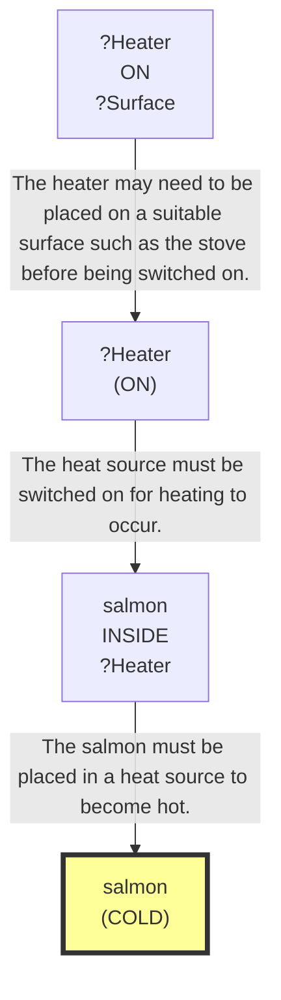
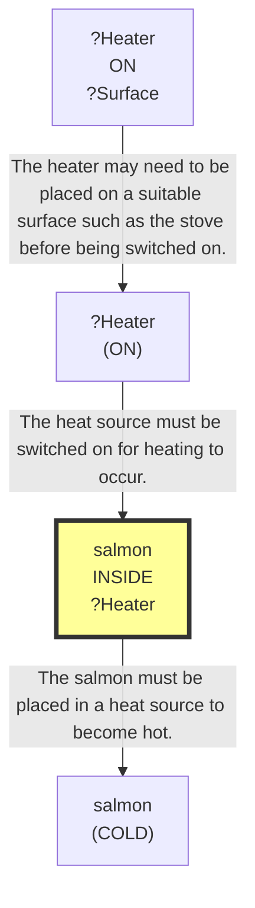
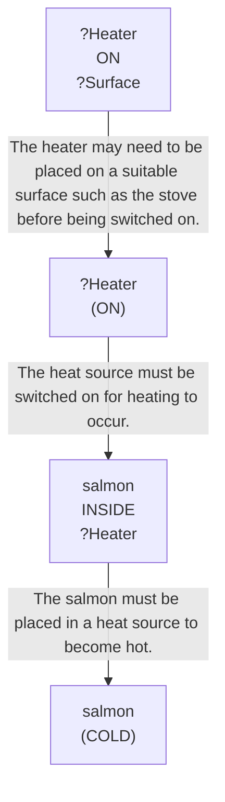
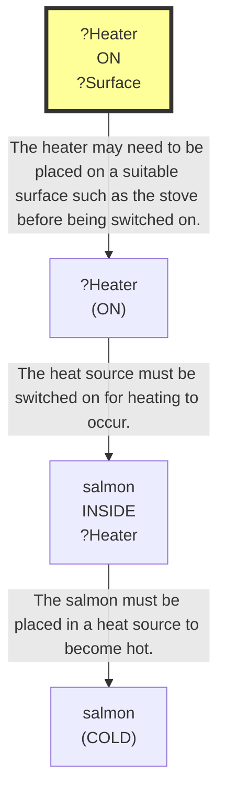
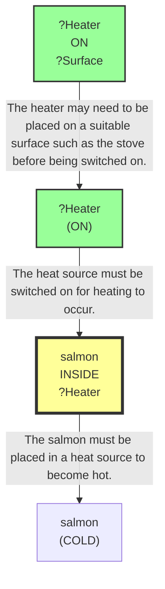
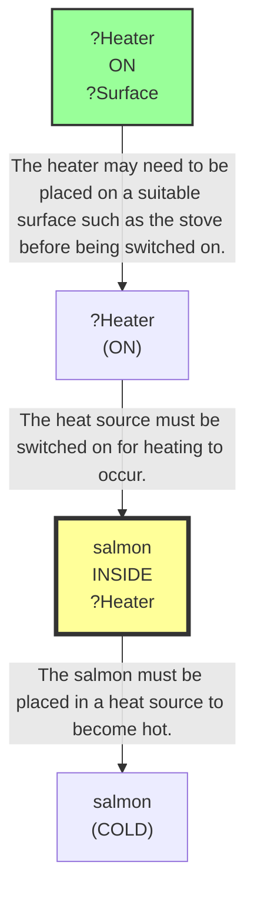

# 🚀 VirtualHome Agent Episode Log


### [GoalReasoner (Module A - Intent)] Output
```json
{
  "is_instruction_obviously_vague": false,
  "clarification_question": null,
  "target_object": "salmon",
  "location_hint": "cookingpot on the stove",
  "reasoning_chain": [
    {
      "question": "Why does the user want this object?",
      "answer": "To warm the salmon if it is currently cold."
    },
    {
      "question": "Why is that important?",
      "answer": "So the food is brought to the desired heated state and is more suitable for eating."
    },
    {
      "question": "What fundamental need does this fulfill?",
      "answer": "The user wants to eat food at an appropriate warm temperature."
    },
    {
      "question": "Are there any deeper psychological or physical motivations?",
      "answer": "The underlying motivation is likely to satisfy hunger and improve the immediate eating experience by making the food warm."
    }
  ],
  "deep_intent": "The user wants to warm food for eating.",
  "acceptable_alternatives_properties": [
    {
      "priority": 1,
      "description": "Other ready-to-eat cooked foods that can be reheated, such as another prepared fish portion or a cooked meal"
    },
    {
      "priority": 2,
      "description": "Similar prepared protein foods that can be warmed, such as chicken, meat, or tofu dishes"
    },
    {
      "priority": 3,
      "description": "Other leftover meals or refrigerated prepared foods that can be heated for consumption"
    },
    {
      "priority": 4,
      "description": "Any warm edible food item that can help satisfy hunger, such as soup, pasta, or rice"
    }
  ]
}
```

### [PerceptionFilter] Output
```json
{
  "reasoning": "The goal is to warm the salmon, so the minimum needed classes are the target food plus a heating setup: a stove as the heat source/surface, and a cookingpot as the implied container/location for the salmon. Because the SDG allows a generic heater and surface, and the visible alternatives include both stove and microwave, I retain both potential heating tools as backups.",
  "selected_classes": [
    "microwave",
    "salmon",
    "cookingpot",
    "stove",
    "character"
  ],
  "raw_class_count": 99
}
```

### [LLMExecutor] Output
```json
{
  "reasoning": "The goal is to warm the salmon by placing it inside a heater that is on. The SDG requires a heater object and that it be on, likely the cookingpot on the stove. The current graph shows I am already holding the cookingpot(63), but the salmon(181) is only close, not held, and the pot is closed. The immediate gap is to secure the salmon first before any placement or heating sequence. Because I am already close to the salmon, the next atomic step is to grab it. I should not open or use the pot yet until I have the salmon.",
  "satisfied_nodes": [],
  "current_node_focus": "N1",
  "mapped_variables": {
    "?Heater": "cookingpot(63)",
    "?Surface": "stove(163)"
  },
  "action": "[grab] <salmon> (181)"
}
```
## Step 0
- **Action**: `[grab] <salmon> (181)`
- **SDG Status**:

- **Observed Items (10)**: character(1), kitchen(11), cookingpot(63) [CLOSED], stove(163) [OFF,CLOSED], microwave(171) [CLOSED,OFF], salmon(181), livingroom(183), bedroom(241), bathroom(285), bedroom(346)


### [PerceptionFilter] Output
```json
{
  "reasoning": "Need the target food item salmon, plus the heat source and its supporting surface per the SDG and location hint. Since the goal is to warm food, keep alternative heating tools too: stove, microwave, and cookingpot (explicitly hinted as the container on the stove).",
  "selected_classes": [
    "microwave",
    "salmon",
    "cookingpot",
    "stove",
    "character"
  ],
  "raw_class_count": 99
}
```

### [LLMExecutor] Output
```json
{
  "reasoning": "The salmon is already held, and the SDG requires it to end up inside a heater that is ON. The most plausible heater in the graph is the cookingpot(63), but it is currently closed and I am already holding it in the right hand. To proceed toward placing the salmon inside the pot, the pot must be opened first. No walk is needed because I am already close to the cookingpot.",
  "satisfied_nodes": [],
  "current_node_focus": "N2",
  "mapped_variables": {
    "?Heater": "cookingpot(63)",
    "?Surface": "stove(163)"
  },
  "action": "[open] <cookingpot> (63)"
}
```
## Step 1
- **Action**: `[open] <cookingpot> (63)`
- **SDG Status**:

- **Observed Items (10)**: character(1), kitchen(11), cookingpot(63) [CLOSED], stove(163) [OFF,CLOSED], microwave(171) [CLOSED,OFF], salmon(181), livingroom(183), bedroom(241), bathroom(285), bedroom(346)


### [PerceptionFilter] Output
```json
{
  "reasoning": "Need the target food item salmon, plus a heating source and its supporting surface per the SDG and location hint. The goal explicitly implies warming food, so keep the stove as the surface and the cookingpot as the heater/container for the salmon. A microwave is an alternative reheating tool that should be retained as a backup heat source.",
  "selected_classes": [
    "microwave",
    "salmon",
    "cookingpot",
    "stove",
    "character"
  ],
  "raw_class_count": 99
}
```

### [LLMExecutor] Output
```json
{
  "reasoning": "",
  "satisfied_nodes": [],
  "current_node_focus": "",
  "mapped_variables": {},
  "action": "WAIT"
}
```
## Step 2
- **Action**: `WAIT`
- **SDG Status**:

- **Observed Items (10)**: character(1), kitchen(11), cookingpot(63) [CLOSED], stove(163) [OFF,CLOSED], microwave(171) [CLOSED,OFF], salmon(181), livingroom(183), bedroom(241), bathroom(285), bedroom(346)


### [PerceptionFilter] Output
```json
{
  "reasoning": "The goal is to warm the salmon, so we need the target food and the heat source setup implied by the SDG: a heater on a suitable surface. From the visible objects, the relevant heater is the stove, and the implied supporting surface/location is the cookingpot on the stove; the salmon itself must also be kept. I included only the minimal classes needed for heating and the exact target object.",
  "selected_classes": [
    "character",
    "salmon",
    "cookingpot",
    "stove"
  ],
  "raw_class_count": 99
}
```

### [LLMExecutor] Output
```json
{
  "reasoning": "The previous attempt to open the cookingpot failed, and the current graph shows the cookingpot is CLOSED but also the stove itself is CLOSED and OFF. The SDG requires a heater that is ON and likely on a surface. Since the stove is the physical appliance/heat source here, the next necessary step is to walk to the stove before any open/switch action. I should not repeat a walk if I just did it, but no walk to the stove has occurred yet. This advances toward getting the heater on so the salmon can later be placed inside it.",
  "satisfied_nodes": [],
  "current_node_focus": "N4",
  "mapped_variables": {
    "?Heater": "stove(163)",
    "?Surface": "stove(163)"
  },
  "action": "[walk] <stove> (163)"
}
```
## Step 3
- **Action**: `[walk] <stove> (163)`
- **SDG Status**:

- **Observed Items (9)**: character(1), kitchen(11), cookingpot(63) [CLOSED], stove(163) [OFF,CLOSED], salmon(181), livingroom(183), bedroom(241), bathroom(285), bedroom(346)


### [PerceptionFilter] Output
```json
{
  "reasoning": "The goal is to warm the salmon, so we need the target food and the heating setup implied by the SDG: a heater that can be turned on and placed on a surface. Since the location hint says cookingpot on the stove, and alternatives retention requires keeping possible heating tools, I include the salmon plus all relevant heat-source/appliance classes that could function as the heater, along with the stove as the required surface.",
  "selected_classes": [
    "microwave",
    "fryingpan",
    "character",
    "salmon",
    "cookingpot",
    "stove",
    "oventray"
  ],
  "raw_class_count": 99
}
```

### [LLMExecutor] Output
```json
{
  "reasoning": "",
  "satisfied_nodes": [],
  "current_node_focus": "",
  "mapped_variables": {},
  "action": "WAIT"
}
```
## Step 4
- **Action**: `WAIT`
- **SDG Status**:

- **Observed Items (12)**: character(1), kitchen(11), fryingpan(62), cookingpot(63) [CLOSED], stove(163) [OFF,CLOSED], oventray(164), microwave(171) [CLOSED,OFF], salmon(181), livingroom(183), bedroom(241), bathroom(285), bedroom(346)


### [PerceptionFilter] Output
```json
{
  "reasoning": "Need the target food item salmon, plus the heat source implied by the SDG and location hint: a cookingpot on the stove. To warm it, the pot and stove must be kept, and the stove must be available as the surface/heater context. No other objects are necessary.",
  "selected_classes": [
    "character",
    "salmon",
    "cookingpot",
    "stove"
  ],
  "raw_class_count": 99
}
```

### [LLMExecutor] Output
```json
{
  "reasoning": "The salmon is already held, and the goal requires it to end up inside a heater that is ON. The graph identifies the stove as the likely heater, and it is currently CLOSED and OFF. Because I am already close to the stove from the prior step, the next atomic action should be to open it so I can later place the salmon inside and switch it on. The cookingpot is not the best next target because an earlier attempt to open it failed, and the stove is the clearer heater in the SDG.",
  "satisfied_nodes": [],
  "current_node_focus": "N4",
  "mapped_variables": {
    "?Heater": "stove(163)",
    "?Surface": "kitchen(11)"
  },
  "action": "[open] <stove> (163)"
}
```
## Step 5
- **Action**: `[open] <stove> (163)`
- **SDG Status**:

- **Observed Items (9)**: character(1), kitchen(11), cookingpot(63) [CLOSED], stove(163) [OFF,CLOSED], salmon(181), livingroom(183), bedroom(241), bathroom(285), bedroom(346)


### [PerceptionFilter] Output
```json
{
  "reasoning": "The goal is to warm the salmon, so we need the target food and the heating setup implied by the SDG: a heater on a suitable surface. The location hint specifically says cookingpot on the stove, so both the cookingpot and stove are needed. Since the heater must be ON, microwave is kept as an alternative heating tool backup, and stove is kept as the primary surface/heater context. If using the pot, a cooked-item container is relevant, but the minimum set is the salmon, cookingpot, stove, and microwave as an alternative heater.",
  "selected_classes": [
    "microwave",
    "salmon",
    "cookingpot",
    "stove",
    "character"
  ],
  "raw_class_count": 99
}
```

### [LLMExecutor] Output
```json
{
  "reasoning": "The salmon is already held and the immediate blocker is that the intended heater is not yet usable. The cookingpot is a movable recipient and is CLOSED, so it cannot receive the salmon until opened. The earlier attempts to open the stove were likely misdirected because the stove itself is not the best heater candidate here; the cookingpot is the object that can hold the salmon. I should open the cookingpot next while already close to it. No walk is needed because the graph shows CLOSE cookingpot(63).",
  "satisfied_nodes": [],
  "current_node_focus": "N2",
  "mapped_variables": {
    "?Heater": "cookingpot(63)",
    "?Surface": "stove(163)"
  },
  "action": "[open] <cookingpot> (63)"
}
```
## Step 6
- **Action**: `[open] <cookingpot> (63)`
- **SDG Status**:

- **Observed Items (10)**: character(1), kitchen(11), cookingpot(63) [CLOSED], stove(163) [OFF,CLOSED], microwave(171) [CLOSED,OFF], salmon(181), livingroom(183), bedroom(241), bathroom(285), bedroom(346)


### [PerceptionFilter] Output
```json
{
  "reasoning": "Need the target food item (salmon) and the heating setup implied by the SDG: a heater, the surface it sits on, and a way to heat it. The goal/location hint explicitly points to a cookingpot on the stove, so I retain the cookingpot and stove as the likely heating arrangement. I also keep microwave and fryingpan as backup heating tools because alternative valid heaters must be retained.",
  "selected_classes": [
    "microwave",
    "fryingpan",
    "salmon",
    "cookingpot",
    "stove",
    "character"
  ],
  "raw_class_count": 99
}
```

### [LLMExecutor] Output
```json
{
  "reasoning": "The current SDG requires the salmon to end up INSIDE a heater that is ON. We are already holding the salmon in the left hand, and the graph shows the fryingpan(62) is a movable recipient already ON the stove and close to the character. The cookingpot and stove both failed to open earlier, so the viable heater candidate is the fryingpan, which is already on a heat source. Since putting an object into a receptacle requires being near the destination, the next atomic step should be to walk to the fryingpan before any putin action. This also aligns with the goal of warming the salmon and avoids the broken/openable path that has already failed.",
  "satisfied_nodes": [
    "N3",
    "N4"
  ],
  "current_node_focus": "N2",
  "mapped_variables": {
    "?Heater": "fryingpan(62)",
    "?Surface": "stove(163)"
  },
  "action": "[walk] <fryingpan> (62)"
}
```
## Step 7
- **Action**: `[walk] <fryingpan> (62)`
- **SDG Status**:

- **Observed Items (11)**: character(1), kitchen(11), fryingpan(62), cookingpot(63) [CLOSED], stove(163) [OFF,CLOSED], microwave(171) [CLOSED,OFF], salmon(181), livingroom(183), bedroom(241), bathroom(285), bedroom(346)


### [PerceptionFilter] Output
```json
{
  "reasoning": "The goal is to warm the salmon. The SDG requires the salmon, a heater, and a surface for the heater. From the visible objects, the relevant heater is the stove (with a cookingpot as the location hint), and the salmon is the target food. No other tools are strictly necessary.",
  "selected_classes": [
    "character",
    "salmon",
    "cookingpot",
    "stove"
  ],
  "raw_class_count": 99
}
```

### [LLMExecutor] Output
```json
{
  "reasoning": "The salmon is already held in the left hand, but the current graph only shows it close to the character and not inside any heat source. The last successful action was a walk to the fryingpan(62), which is the best heater candidate because it is a cooking surface on the stove and avoids the failed open attempts on the closed stove/cookingpot. To progress the SDG, I must now place the held salmon into the heater, and per the proximity rule I need to be near the destination first; the recent walk satisfies that. Since the fryingpan is a receptacle-like cooking vessel, the next atomic step is to put the salmon into it.",
  "satisfied_nodes": [],
  "current_node_focus": "N2",
  "mapped_variables": {
    "?Heater": "fryingpan(62)",
    "?Surface": "stove(163)"
  },
  "action": "[putin] <salmon> (181) <fryingpan> (62)"
}
```
## Step 8
- **Action**: `[putin] <salmon> (181) <fryingpan> (62)`
- **SDG Status**:

- **Observed Items (9)**: character(1), kitchen(11), cookingpot(63) [CLOSED], stove(163) [OFF,CLOSED], salmon(181), livingroom(183), bedroom(241), bathroom(285), bedroom(346)


### [PerceptionFilter] Output
```json
{
  "reasoning": "",
  "selected_classes": [
    "character",
    "salmon",
    "cookingpot",
    "stove"
  ],
  "raw_class_count": 99
}
```

### [LLMExecutor] Output
```json
{
  "reasoning": "The salmon is already held and close, and the only viable heating path in the current graph is the cookingpot(63), which is a movable recipient/container. It is currently CLOSED, so it must be opened before any put-in action can succeed. The previous failures on the stove and fryingpan suggest those were not executable targets here; the cookingpot is the clearest heater-related receptacle remaining. I should not walk again because I am already close to the pot, and the prompt explicitly says not to repeat a walk if I just did it. The next atomic step is to open the cookingpot so the salmon can later be placed inside and heated.",
  "satisfied_nodes": [],
  "current_node_focus": "N2",
  "mapped_variables": {
    "?Heater": "cookingpot(63)",
    "?Surface": "stove(163)"
  },
  "action": "[open] <cookingpot> (63)"
}
```
## Step 9
- **Action**: `[open] <cookingpot> (63)`
- **SDG Status**:

- **Observed Items (9)**: character(1), kitchen(11), cookingpot(63) [CLOSED], stove(163) [OFF,CLOSED], salmon(181), livingroom(183), bedroom(241), bathroom(285), bedroom(346)


### [PerceptionFilter] Output
```json
{
  "reasoning": "The goal is to warm the salmon, so the target object salmon must be kept. The SDG requires a heat source that can be ON and placed on a suitable surface; from the visible objects, stove is the best matching heater and cookingpot is explicitly hinted as the location/container for the salmon. Since heating requires a working surface, the stove must also be retained. Alternative reheating tools are also kept as backups per instruction: microwave, fryingpan, and oventray can all function as heat sources for cooked food.",
  "selected_classes": [
    "microwave",
    "fryingpan",
    "character",
    "salmon",
    "cookingpot",
    "stove",
    "oventray"
  ],
  "raw_class_count": 99
}
```

### [LLMExecutor] Output
```json
{
  "reasoning": "The salmon is already held, so the remaining gap is to get it into a heater that is ON. The fryingpan(62) is the best available heater candidate because it is already ON the stove and is a valid recipient. Since the last successful movement was already a walk to the fryingpan, and we are currently close to it, the next atomic step should be to place the held salmon into the fryingpan. This directly advances the SDG node requiring salmon INSIDE a heated object.",
  "satisfied_nodes": [
    "N4"
  ],
  "current_node_focus": "N2",
  "mapped_variables": {
    "?Heater": "fryingpan(62)",
    "?Surface": "stove(163)"
  },
  "action": "[putin] <salmon> (181) <fryingpan> (62)"
}
```
## Step 10
- **Action**: `[putin] <salmon> (181) <fryingpan> (62)`
- **SDG Status**:

- **Observed Items (12)**: character(1), kitchen(11), fryingpan(62), cookingpot(63) [CLOSED], stove(163) [OFF,CLOSED], oventray(164), microwave(171) [CLOSED,OFF], salmon(181), livingroom(183), bedroom(241), bathroom(285), bedroom(346)


### [PerceptionFilter] Output
```json
{
  "reasoning": "Need the target food salmon plus the implied heating setup: a heater/source on the stove, and the stove itself as the required surface/location. Since alternatives retention applies, keep other plausible heating appliances visible that could warm food if needed, especially microwave and oven-related cookware like fryingpan/cookingpot. Also keep the salmon target exactly as named.",
  "selected_classes": [
    "microwave",
    "fryingpan",
    "salmon",
    "cookingpot",
    "stove",
    "character"
  ],
  "raw_class_count": 99
}
```

### [LLMExecutor] Output
```json
{
  "reasoning": "The salmon is already held, and the best heater candidate in the current graph is the fryingpan(62) because it is already ON the stove and close to the character. However, repeated [putin] attempts into the fryingpan have failed with execution errors, which indicates that this route is not currently executable. The cookingpot(63) is CLOSED and held in the right hand, but opening it has also repeatedly failed. Since the environment is rejecting the obvious heating actions and the task is stuck in a loop without progress, the correct next step is to ask for clarification/report the failure rather than keep repeating the same actions.",
  "satisfied_nodes": [
    "N4"
  ],
  "current_node_focus": "N2",
  "mapped_variables": {
    "?Heater": "fryingpan(62)",
    "?Surface": "stove(163)"
  },
  "action": "[ask] I cannot currently execute the heating placement because both candidate heaters (the fryingpan and cookingpot) are rejecting the required interaction steps. Please confirm whether you want me to use a different container or appliance for warming the salmon."
}
```
## Step 11
- **Action**: `[ask] I cannot currently execute the heating placement because both candidate heaters (the fryingpan and cookingpot) are rejecting the required interaction steps. Please confirm whether you want me to use a different container or appliance for warming the salmon.`
- **SDG Status**:

- **Observed Items (11)**: character(1), kitchen(11), fryingpan(62), cookingpot(63) [CLOSED], stove(163) [OFF,CLOSED], microwave(171) [CLOSED,OFF], salmon(181), livingroom(183), bedroom(241), bathroom(285), bedroom(346)

