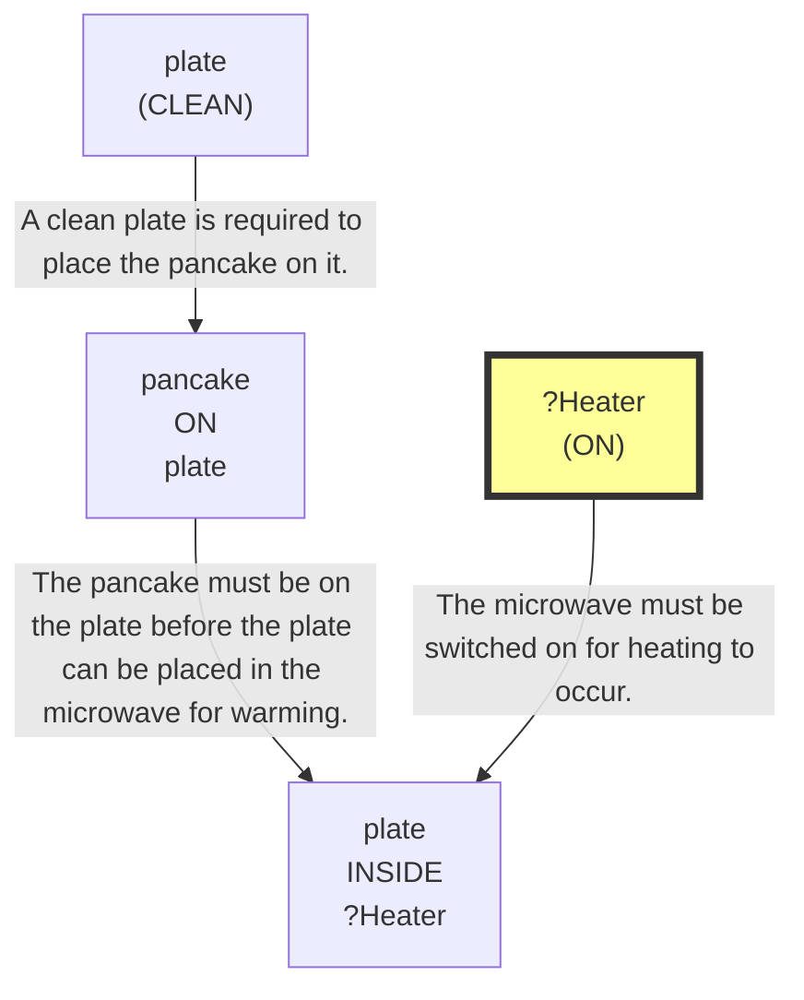
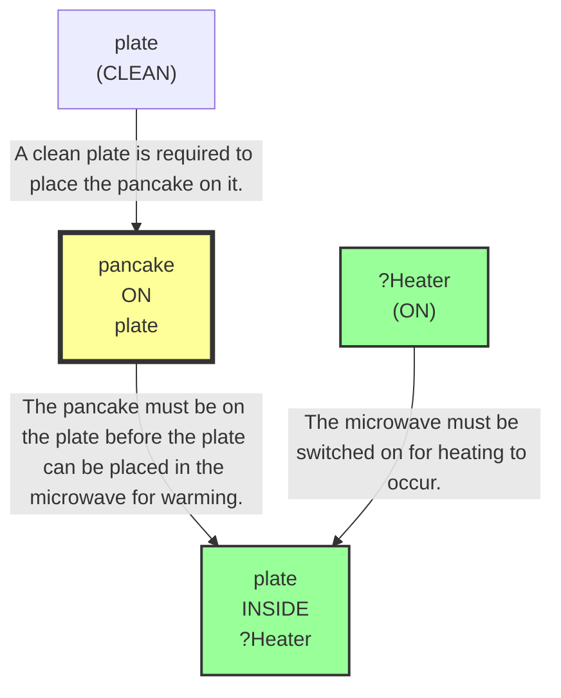
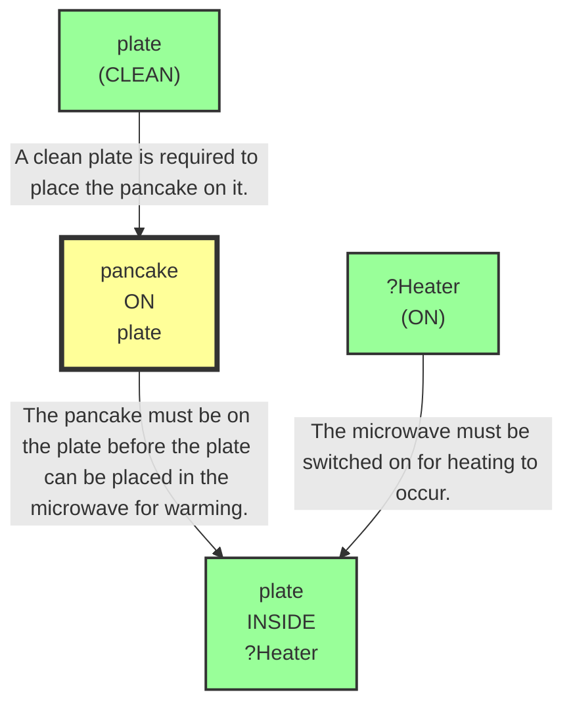

# 🚀 VirtualHome Agent Episode Log


### [GoalReasoner (Module A - Intent)] Output
```json
{
  "is_instruction_obviously_vague": false,
  "clarification_question": null,
  "target_object": "pancake",
  "location_hint": null,
  "reasoning_chain": [
    {
      "question": "Why does the user want this object?",
      "answer": "To heat the pancake so it is ready to eat."
    },
    {
      "question": "Why is that important?",
      "answer": "Warming the food can improve its temperature, texture, and immediate usability as a meal or snack."
    },
    {
      "question": "What fundamental need does this fulfill?",
      "answer": "It fulfills the need to have food prepared for consumption, supporting hunger relief and meal enjoyment."
    },
    {
      "question": "Are there any deeper psychological or physical motivations?",
      "answer": "The user likely wants convenient, edible food at a comfortable temperature without additional cooking effort."
    }
  ],
  "deep_intent": "The user wants to prepare food for immediate eating by making it warm and ready to consume.",
  "acceptable_alternatives_properties": [
    {
      "priority": 1,
      "description": "Other ready-to-eat breakfast foods that can be warmed in a microwave, such as waffles, crepes, or toast."
    },
    {
      "priority": 2,
      "description": "Other soft cooked foods or baked items that can be reheated and eaten warm, such as muffins or pastries."
    },
    {
      "priority": 3,
      "description": "Microwavable snack or meal items that provide quick warmth and convenience."
    },
    {
      "priority": 4,
      "description": "Any readily edible food item that can satisfy hunger even if it is not the same type of breakfast food."
    }
  ]
}
```

### [PerceptionFilter] Output
```json
{
  "reasoning": "The goal is to warm a pancake for eating. The SDG requires the pancake, a plate to hold it, a clean plate state, and a heater that is ON. The only matching heating appliance visible is the microwave. No other alternative heater is needed because the SDG specifically points to a microwave-like heater for warming. ",
  "selected_classes": [
    "character",
    "plate",
    "pancake",
    "microwave"
  ],
  "raw_class_count": 107
}
```

### [LLMExecutor] Output
```json
{
  "reasoning": "The plate is already inside the microwave, so the next missing prerequisite toward warming the pancake is to turn the microwave on. Since switching on requires being near the appliance, and we have not moved yet, the single next atomic action is to walk to the microwave.",
  "satisfied_nodes": [],
  "current_node_focus": "N3",
  "mapped_variables": {
    "?Heater": "microwave(109)"
  },
  "action": "[walk] <microwave> (109)"
}
```
## Step 0
- **Action**: `[walk] <microwave> (109)`
- **SDG Status**:

- **Observed Items (8)**: character(1), kitchen(11), pancake(62), microwave(109) [CLOSED,OFF], plate(110), bathroom(172), bedroom(211), livingroom(268)


### [PerceptionFilter] Output
```json
{
  "reasoning": "The goal is to warm a pancake for immediate eating. The SDG requires the pancake, a clean plate to hold it, and a heater that is on; the visible heater class matching this is a microwave. No other tools or locations are necessary beyond these required items.",
  "selected_classes": [
    "character",
    "plate",
    "pancake",
    "microwave"
  ],
  "raw_class_count": 107
}
```

### [LLMExecutor] Output
```json
{
  "reasoning": "The plate is already inside the microwave, and I am already close to the microwave from the previous successful walk. The next missing prerequisite for warming the pancake is to turn the microwave on. The microwave has a switch and is currently OFF, so switching it on directly progresses the SDG toward satisfying N3 and then N2.",
  "satisfied_nodes": [],
  "current_node_focus": "N3",
  "mapped_variables": {
    "?Heater": "microwave(109)"
  },
  "action": "[switchon] <microwave> (109)"
}
```
## Step 1
- **Action**: `[switchon] <microwave> (109)`
- **SDG Status**:

- **Observed Items (8)**: character(1), kitchen(11), pancake(62), microwave(109) [CLOSED,OFF], plate(110), bathroom(172), bedroom(211), livingroom(268)


### [PerceptionFilter] Output
```json
{
  "reasoning": "The goal is to warm a pancake for immediate eating. The SDG requires the pancake, a clean plate to hold it, and a heater that is on. The only visible heater matching the SDG is the microwave. The pancake and plate are explicit targets/relations, and the microwave is the required appliance/tool.",
  "selected_classes": [
    "character",
    "plate",
    "pancake",
    "microwave"
  ],
  "raw_class_count": 107
}
```

### [LLMExecutor] Output
```json
{
  "reasoning": "The microwave is already ON, satisfying N3. The plate is already inside the microwave, satisfying N2. However, the SDG still requires the pancake to be ON the plate, and the pancake is currently in the kitchen, not on the plate. To progress toward N1, the next needed step is to get to the pancake so it can be grabbed; since the last action was not a walk to the pancake, I should move to it now.",
  "satisfied_nodes": [
    "N2",
    "N3"
  ],
  "current_node_focus": "N1",
  "mapped_variables": {
    "?Heater": "microwave(109)"
  },
  "action": "[walk] <pancake> (62)"
}
```
## Step 2
- **Action**: `[walk] <pancake> (62)`
- **SDG Status**:

- **Observed Items (8)**: character(1), kitchen(11), pancake(62), microwave(109) [CLOSED,ON], plate(110), bathroom(172), bedroom(211), livingroom(268)


### [PerceptionFilter] Output
```json
{
  "reasoning": "The goal is to warm a pancake for eating. The SDG requires the pancake, a clean plate to hold it, and a heater that is on. Since the heater is abstract, the visible matching appliance is the microwave, which is the needed warming tool. Plate is explicitly required and must be retained; pancake is the target object.",
  "selected_classes": [
    "character",
    "plate",
    "pancake",
    "microwave"
  ],
  "raw_class_count": 107
}
```

### [LLMExecutor] Output
```json
{
  "reasoning": "The microwave is already ON, so N3 is satisfied. The plate is already inside the microwave, so N2 is satisfied. The remaining unmet prerequisite for the goal is placing the pancake on the plate (N1). I am currently close to the pancake after the previous walk, so the next atomic step is to grab it before I can carry it to the plate.",
  "satisfied_nodes": [
    "N2",
    "N3"
  ],
  "current_node_focus": "N1",
  "mapped_variables": {
    "?Heater": "microwave(109)"
  },
  "action": "[grab] <pancake> (62)"
}
```
## Step 3
- **Action**: `[grab] <pancake> (62)`
- **SDG Status**:

- **Observed Items (8)**: character(1), kitchen(11), pancake(62), microwave(109) [CLOSED,ON], plate(110), bathroom(172), bedroom(211), livingroom(268)


### [PerceptionFilter] Output
```json
{
  "reasoning": "The goal is to warm a pancake for eating. The SDG requires the pancake, a clean plate for it, and a heating appliance that is on; the visible matching heater is the microwave. To satisfy the exact goal and required state, only those classes are needed.",
  "selected_classes": [
    "character",
    "plate",
    "pancake",
    "microwave"
  ],
  "raw_class_count": 107
}
```

### [LLMExecutor] Output
```json
{
  "reasoning": "N3 is already satisfied because the microwave is ON. N2 is already satisfied because the plate is inside the microwave. N4 is satisfied by the current graph because the plate has no DIRTY state, so it is clean enough to use. The remaining unmet relation is N1: the pancake must be ON the plate. I am already holding the pancake, and the plate is the correct destination receptacle, but per the proximity rule I must first walk to the plate before I can place the pancake onto it. The single next action is therefore to move near the plate.",
  "satisfied_nodes": [
    "N2",
    "N3",
    "N4"
  ],
  "current_node_focus": "N1",
  "mapped_variables": {
    "?Heater": "microwave(109)"
  },
  "action": "[walk] <plate> (110)"
}
```
## Step 4
- **Action**: `[walk] <plate> (110)`
- **SDG Status**:

- **Observed Items (8)**: character(1), kitchen(11), pancake(62), microwave(109) [CLOSED,ON], plate(110), bathroom(172), bedroom(211), livingroom(268)


### [PerceptionFilter] Output
```json
{
  "reasoning": "The goal is to warm a pancake for eating. The SDG requires the pancake, a clean plate to hold it, and a heating appliance that is on. Since the heater abstractly maps to a microwave here, and alternatives must be retained for heating, I keep microwave and stove as possible heaters. A clean plate is required, and the pancake is the target object.",
  "selected_classes": [
    "pancake",
    "microwave",
    "plate",
    "stove",
    "character"
  ],
  "raw_class_count": 107
}
```

### [LLMExecutor] Output
```json
{
  "reasoning": "The microwave is already ON, and the plate is already inside it. I am currently holding the pancake and have just walked to the plate, so the remaining unmet SDG relation is to place the pancake on the plate (N1). Since putback requires being near the destination surface and the plate is a flat surface/recipient, the next atomic action is to put the pancake onto the plate.",
  "satisfied_nodes": [
    "N3",
    "N2",
    "N4"
  ],
  "current_node_focus": "N1",
  "mapped_variables": {
    "?Heater": "microwave(109)"
  },
  "action": "[putback] <pancake> (62) <plate> (110)"
}
```
## Step 5
- **Action**: `[putback] <pancake> (62) <plate> (110)`
- **SDG Status**:

- **Observed Items (9)**: character(1), kitchen(11), pancake(62), stove(105) [OFF,CLOSED], microwave(109) [CLOSED,ON], plate(110), bathroom(172), bedroom(211), livingroom(268)


### [PerceptionFilter] Output
```json
{
  "reasoning": "The goal is to warm a pancake for eating. The SDG requires the pancake itself, a clean plate to hold it, and a heating appliance that is ON. Since the heater is abstract, the visible matching appliance is microwave. No other tools are necessary for this task.",
  "selected_classes": [
    "character",
    "plate",
    "pancake",
    "microwave"
  ],
  "raw_class_count": 107
}
```

### [LLMExecutor] Output
```json
{
  "reasoning": "The remaining unmet SDG node is N1: the pancake must be ON the plate. I am already holding the pancake and am close to the plate from the previous successful walk. The plate is clean enough to use (no DIRTY state). The last attempted putback failed, but the physical setup still indicates the correct next step is to place the pancake onto the plate. Since the instruction says not to repeat a walk action if I just did it, and the destination is already nearby, I should retry the placement action.",
  "satisfied_nodes": [
    "N3",
    "N4",
    "N2"
  ],
  "current_node_focus": "N1",
  "mapped_variables": {},
  "action": "[putback] <pancake> (62) <plate> (110)"
}
```
## Step 6
- **Action**: `[putback] <pancake> (62) <plate> (110)`
- **SDG Status**:

- **Observed Items (8)**: character(1), kitchen(11), pancake(62), microwave(109) [CLOSED,ON], plate(110), bathroom(172), bedroom(211), livingroom(268)


### [PerceptionFilter] Output
```json
{
  "reasoning": "The goal is to warm a pancake for eating. The SDG requires the pancake, a clean plate to hold it, and a heater that is ON; the visible heater option is microwave. Since heating a food item in a microwave typically needs a microwave-safe dish, and the goal explicitly involves a plate, those are the minimum required classes. No other tools or locations are necessary.",
  "selected_classes": [
    "character",
    "plate",
    "pancake",
    "microwave"
  ],
  "raw_class_count": 107
}
```

### [LLMExecutor] Output
```json
{
  "reasoning": "The microwave is already ON, the plate is already inside the microwave, and the pancake is already in hand. The remaining unmet SDG node is N1: the pancake must be ON the plate. The previous attempts to put the pancake back onto the plate failed, but the graph still shows the correct setup and no alternative prerequisite is missing. Since the last action was already a walk to the plate, I should not repeat walking. The most direct next step is to retry placing the held pancake onto the plate.",
  "satisfied_nodes": [
    "N2",
    "N3",
    "N4"
  ],
  "current_node_focus": "N1",
  "mapped_variables": {
    "?Heater": "microwave(109)"
  },
  "action": "[putback] <pancake> (62) <plate> (110)"
}
```
## Step 7
- **Action**: `[putback] <pancake> (62) <plate> (110)`
- **SDG Status**:

- **Observed Items (8)**: character(1), kitchen(11), pancake(62), microwave(109) [CLOSED,ON], plate(110), bathroom(172), bedroom(211), livingroom(268)


### [PerceptionFilter] Output
```json
{
  "reasoning": "The goal is to warm a pancake for eating. The SDG explicitly requires the pancake on a clean plate inside a heater that is on. The heater is a microwave, so I keep the pancake, plate, and microwave. A clean plate is required by the graph, so the plate must be included. No other tools are necessary because microwaving is the heating method.",
  "selected_classes": [
    "character",
    "plate",
    "pancake",
    "microwave"
  ],
  "raw_class_count": 107
}
```

### [LLMExecutor] Output
```json
{
  "reasoning": "N3 is satisfied because the microwave is ON, and N2 is satisfied because the plate is inside the microwave. N4 is satisfied because the plate has no DIRTY state. The remaining goal is N1: the pancake must be ON the plate. However, repeated attempts to [putback] the pancake onto the plate failed with a general execution error, and the setup has not changed. Since the last action was a walk to the plate, I should not repeat walking. Per failure-handling rules, after repeated execution failure on the same intended action, the correct next step is to ask for help/report the issue.",
  "satisfied_nodes": [
    "N2",
    "N3",
    "N4"
  ],
  "current_node_focus": "N1",
  "mapped_variables": {
    "?Heater": "microwave(109)"
  },
  "action": "[ask] I am holding the pancake and the plate is already inside the ON microwave, but placing the pancake onto the plate has failed repeatedly with an execution error. The physical setup appears correct; please advise if the plate location or required interaction is different."
}
```
## Step 8
- **Action**: `[ask] I am holding the pancake and the plate is already inside the ON microwave, but placing the pancake onto the plate has failed repeatedly with an execution error. The physical setup appears correct; please advise if the plate location or required interaction is different.`
- **SDG Status**:

- **Observed Items (8)**: character(1), kitchen(11), pancake(62), microwave(109) [CLOSED,ON], plate(110), bathroom(172), bedroom(211), livingroom(268)

