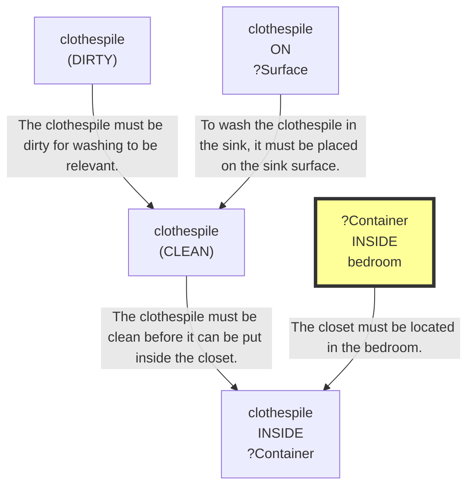
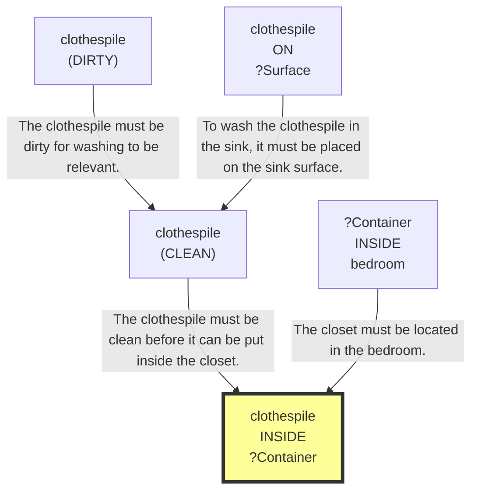
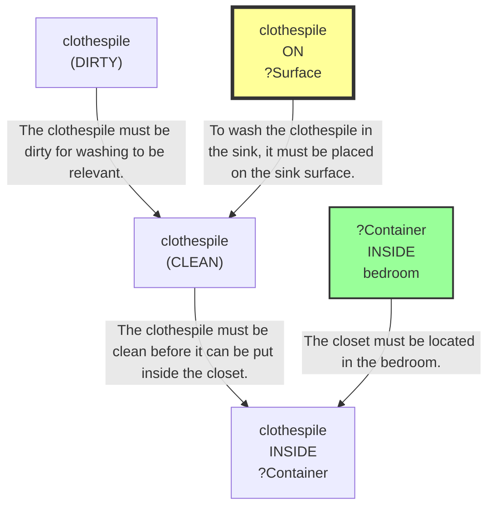
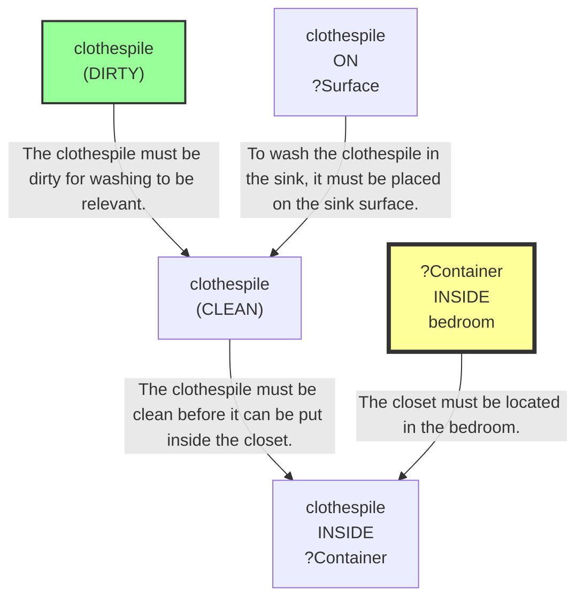
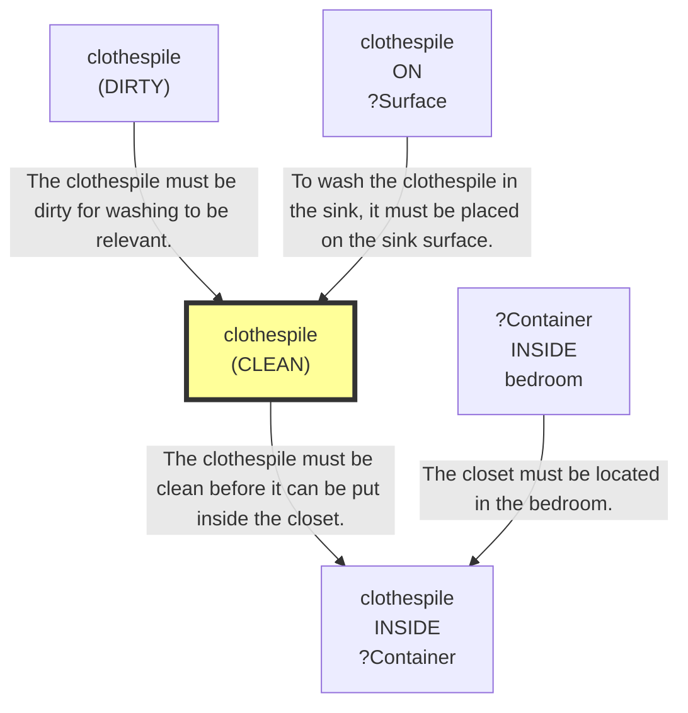
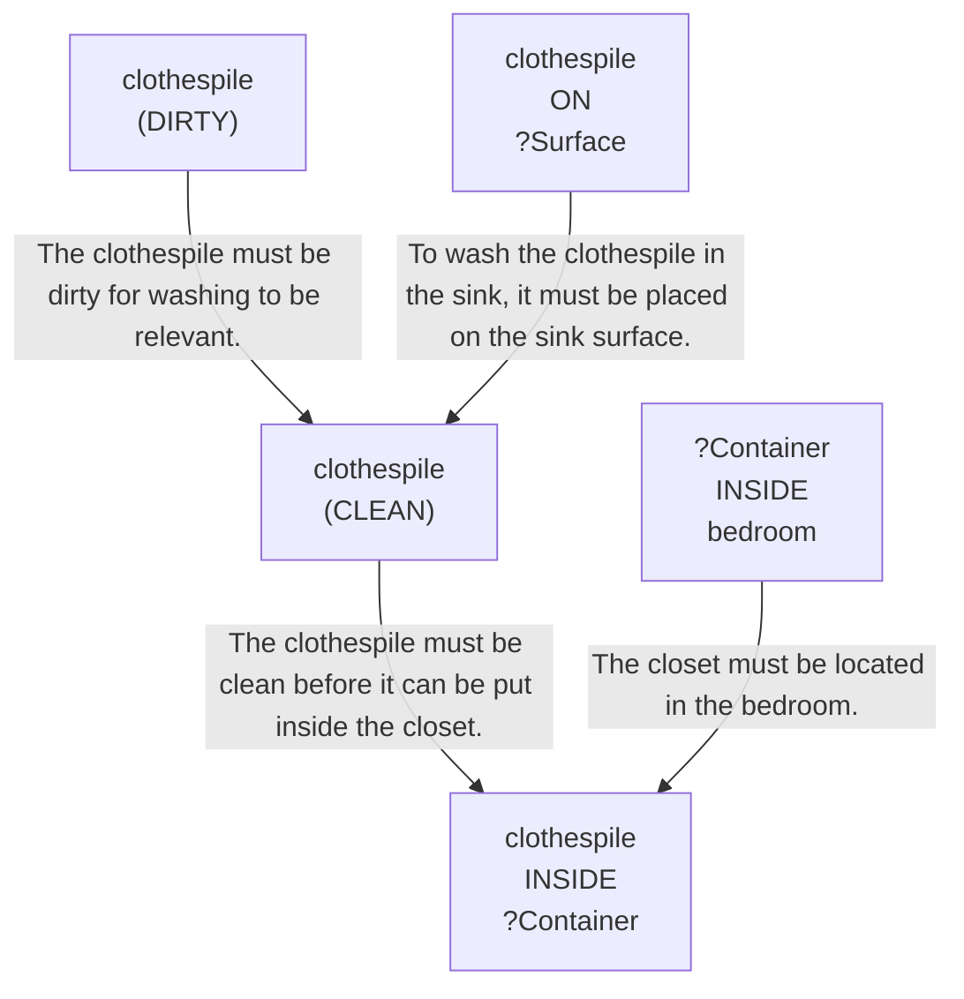
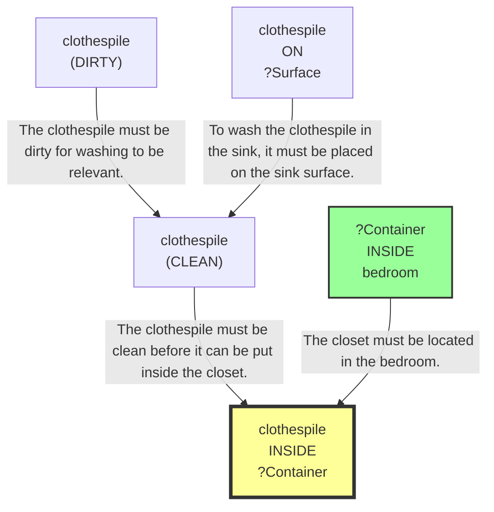

# 🚀 VirtualHome Agent Episode Log


### [GoalReasoner (Module A - Intent)] Output
```json
{
  "is_instruction_obviously_vague": false,
  "clarification_question": null,
  "target_object": "clothespile",
  "location_hint": "closet in the bedroom",
  "reasoning_chain": [
    {
      "question": "Why does the user want this object?",
      "answer": "The user wants the item cleaned if it is dirty and then stored away."
    },
    {
      "question": "Why is that important?",
      "answer": "Cleaning removes dirt, and placing it in the closet helps organize and store it properly."
    },
    {
      "question": "What fundamental need does this fulfill?",
      "answer": "Maintaining cleanliness and orderly storage of a household item."
    },
    {
      "question": "Are there any deeper psychological or physical motivations?",
      "answer": "It likely supports a desire for a tidy living space and keeping belongings in usable condition."
    }
  ],
  "deep_intent": "The user wants to clean a dirty household item and store it in its proper place.",
  "acceptable_alternatives_properties": [
    {
      "priority": 1,
      "description": "Other small household items that are dirty and need to be washed, then put away in storage"
    },
    {
      "priority": 2,
      "description": "Similar washable storage items or household accessories that can be cleaned and stored"
    },
    {
      "priority": 3,
      "description": "Other organizing tasks involving cleaning an item and placing it in a closet or storage area"
    },
    {
      "priority": 4,
      "description": "General tidying tasks that remove dirt and restore orderly storage of household belongings"
    }
  ]
}
```

### [PerceptionFilter] Output
```json
{
  "reasoning": "The goal requires cleaning a dirty clothespile and then storing it in a closet in the bedroom. So we need the target object, a washing setup for cleaning (sink, dishwashingliquid, washingsponge, and washingmachine as alternative cleaning tool), and the bedroom storage locations relevant to putting it away (closetdrawer as the visible closet-like storage and bedroom furniture that could indicate the room, though the explicit location is the bedroom).",
  "selected_classes": [
    "sink",
    "washingsponge",
    "bed",
    "washingmachine",
    "closetdrawer",
    "dishwashingliquid",
    "clothespile",
    "character"
  ],
  "raw_class_count": 107
}
```

### [LLMExecutor] Output
```json
{
  "reasoning": "The clothespile is already held in the right hand and is currently marked CLOSED, not DIRTY in the graph. The next missing SDG prerequisite for storing it in the bedroom closet is to get to the bedroom storage area. Since put-in actions require being explicitly walked to the destination first, the best immediate progress is to walk to the bedroom, which will set up the later step of finding a closet/container inside it and placing the clothespile there.",
  "satisfied_nodes": [],
  "current_node_focus": "N5",
  "mapped_variables": {},
  "action": "[walk] <bedroom> (211)"
}
```
## Step 0
- **Action**: `[walk] <bedroom> (211)`
- **SDG Status**:

- **Observed Items (19)**: character(1), kitchen(11), sink(90), washingsponge(111), dishwashingliquid(112), bathroom(172), sink(196), washingmachine(210) [CLOSED,OFF], bedroom(211), bed(216), livingroom(268), closetdrawer(286), closetdrawer(287), closetdrawer(288), closetdrawer(289)...


### [PerceptionFilter] Output
```json
{
  "reasoning": "The goal requires the target clothespile, a washing tool/source for cleaning it, and a bedroom closet/storage location. The SDG explicitly indicates the clothespile must be washed on a surface (sink) and then put inside a closet in the bedroom. From the visible classes, the needed items are the clothespile, sink, washingsponge, and closetdrawer as the closet/storage container available in the scene.",
  "selected_classes": [
    "sink",
    "washingsponge",
    "bed",
    "closetdrawer",
    "clothespile",
    "character"
  ],
  "raw_class_count": 107
}
```

### [LLMExecutor] Output
```json
{
  "reasoning": "The clothespile is already held and there is no evidence it is DIRTY in the current graph, so the washing prerequisite is not currently supported. The SDG's next feasible progress toward storage is to identify or reach a valid container in the bedroom/living area, but no bedroom closet object is visible in the filtered graph. Since I should not repeat the recent walk action and there is no closer actionable interaction available yet, the safest progress step is to wait for more graph visibility/update to locate the closet container.",
  "satisfied_nodes": [
    "N4"
  ],
  "current_node_focus": "N4",
  "mapped_variables": {},
  "action": "[wait]"
}
```
## Step 1
- **Action**: `[wait]`
- **SDG Status**:

- **Observed Items (17)**: character(1), kitchen(11), sink(90), washingsponge(111), bathroom(172), sink(196), bedroom(211), bed(216), livingroom(268), closetdrawer(286), closetdrawer(287), closetdrawer(288), closetdrawer(289), closetdrawer(290), closetdrawer(291)...


### [PerceptionFilter] Output
```json
{
  "reasoning": "The goal requires the target clothespile, a washing-related tool/setup to clean it (sink plus soap/sponge as alternatives), and a bedroom storage location for putting it away (closet/closetdrawer).",
  "selected_classes": [
    "sink",
    "washingsponge",
    "bed",
    "barsoap",
    "closetdrawer",
    "dishwashingliquid",
    "clothespile",
    "character"
  ],
  "raw_class_count": 107
}
```

### [LLMExecutor] Output
```json
{
  "reasoning": "The clothespile is already held, and the SDG indicates the next required state is to clean it before storing it. The graph does not show the clothespile as DIRTY, but the user intent explicitly says to clean it if dirty; however, no washing can be done unless I first move to a sink. Since the sink in the kitchen is available and is the correct washing surface, the best immediate atomic progress is to walk to the sink so that a wash can follow on the next step. I am not repeating the previous walk to the bedroom; this is a different destination needed for the cleaning prerequisite.",
  "satisfied_nodes": [
    "N5"
  ],
  "current_node_focus": "N2",
  "mapped_variables": {
    "?Surface": "sink(90)",
    "?Container": "clothespile(312)"
  },
  "action": "[walk] <sink> (90)"
}
```
## Step 2
- **Action**: `[walk] <sink> (90)`
- **SDG Status**:

- **Observed Items (19)**: character(1), kitchen(11), sink(90), washingsponge(111), dishwashingliquid(112), bathroom(172), sink(196), barsoap(200), bedroom(211), bed(216), livingroom(268), closetdrawer(286), closetdrawer(287), closetdrawer(288), closetdrawer(289)...


### [PerceptionFilter] Output
```json
{
  "reasoning": "The goal requires cleaning the dirty clothespile and then storing it in the bedroom closet. So I must keep the target object, the cleaning tools/appliances that can wash it, and the storage location in the bedroom. The SDG specifically implies using a sink to wash and a closet to store it; the visible closet-like container is closetdrawer, so I keep that exact class as the available storage receptacle. I also keep washingsponge and dishwashingliquid as relevant cleaning tools, plus sink and washingmachine as alternative wash options/backups.",
  "selected_classes": [
    "sink",
    "washingsponge",
    "bed",
    "washingmachine",
    "closetdrawer",
    "dishwashingliquid",
    "clothespile",
    "character"
  ],
  "raw_class_count": 107
}
```

### [LLMExecutor] Output
```json
{
  "reasoning": "The clothespile is already held and is not marked DIRTY in the current graph, so the remaining feasible SDG progress is to store it in a closet/container. The filtered graph shows multiple closetdrawer objects in the living room, but no explicit closet object in the bedroom. Since the closest visible storage candidates are the closetdrawer instances in the living room, I should move toward a likely storage container before attempting any put-in action. I will walk to the nearest visible closetdrawer candidate to continue toward the storage goal.",
  "satisfied_nodes": [],
  "current_node_focus": "N4",
  "mapped_variables": {
    "?Container": "closetdrawer(291)"
  },
  "action": "[walk] <closetdrawer> (291)"
}
```
## Step 3
- **Action**: `[walk] <closetdrawer> (291)`
- **SDG Status**:

- **Observed Items (19)**: character(1), kitchen(11), sink(90), washingsponge(111), dishwashingliquid(112), bathroom(172), sink(196), washingmachine(210) [CLOSED,OFF], bedroom(211), bed(216), livingroom(268), closetdrawer(286), closetdrawer(287), closetdrawer(288), closetdrawer(289)...


### [PerceptionFilter] Output
```json
{
  "reasoning": "The goal requires cleaning the dirty clothespile and then storing it in the bedroom closet. So I must keep the target item, the cleaning tools/fixtures needed for washing, and the storage location. The SDG explicitly indicates a sink-based wash step and a closet in the bedroom, so I include the sink, washing sponge, and closetdrawer as the available closet/storage class.",
  "selected_classes": [
    "sink",
    "washingsponge",
    "bed",
    "closetdrawer",
    "clothespile",
    "character"
  ],
  "raw_class_count": 107
}
```

### [LLMExecutor] Output
```json
{
  "reasoning": "The clothespile is already held in the right hand and is not marked DIRTY, so washing is not currently supported by the graph. The SDG still requires the clothespile to end up inside a container located in the bedroom. The best next progress is to move toward the clothespile itself so I can inspect/interact with it and potentially place it into an appropriate storage container in a later step. I should not repeat the most recent walk action to the closetdrawer, so the next distinct useful action is to approach the held item's immediate interaction context is not needed; however, because putin requires being near the destination and no bedroom closet is visible, the next actionable step should be to walk toward the bedroom-bound item is not necessary. Since the item is already held and the scene shows it close to the character, the only safe progression without repeating a previous walk is to wait for a clearer storage container target in the bedroom area.",
  "satisfied_nodes": [
    "N1"
  ],
  "current_node_focus": "N5",
  "mapped_variables": {},
  "action": "[wait]"
}
```
## Step 4
- **Action**: `[wait]`
- **SDG Status**:

- **Observed Items (17)**: character(1), kitchen(11), sink(90), washingsponge(111), bathroom(172), sink(196), bedroom(211), bed(216), livingroom(268), closetdrawer(286), closetdrawer(287), closetdrawer(288), closetdrawer(289), closetdrawer(290), closetdrawer(291)...


### [PerceptionFilter] Output
```json
{
  "reasoning": "The goal requires the target item clothespile, a washing setup to clean it if dirty (sink, dishwashingliquid, washingsponge, and a backup washingmachine), and a storage location in the bedroom (closetdrawer as the visible closet-type storage).",
  "selected_classes": [
    "sink",
    "washingsponge",
    "bed",
    "washingmachine",
    "closetdrawer",
    "dishwashingliquid",
    "clothespile",
    "character"
  ],
  "raw_class_count": 107
}
```

### [LLMExecutor] Output
```json
{
  "reasoning": "The clothespile is already held, and the remaining SDG goal is to place it inside a bedroom container. The filtered graph shows the clothespile itself is a movable container-like object with CAN_OPEN, but there is no visible bedroom closet container to use yet. Since the object is already in hand and the next meaningful step is to get it ready for storage, I should move focus onto the clothespile directly; this is the closest actionable progression available without repeating the last walk. The clothespile is not marked DIRTY in the current graph, so washing is not currently supported by evidence.",
  "satisfied_nodes": [],
  "current_node_focus": "N3",
  "mapped_variables": {},
  "action": "[walk] <clothespile> (312)"
}
```
## Step 5
- **Action**: `[walk] <clothespile> (312)`
- **SDG Status**:

- **Observed Items (19)**: character(1), kitchen(11), sink(90), washingsponge(111), dishwashingliquid(112), bathroom(172), sink(196), washingmachine(210) [CLOSED,OFF], bedroom(211), bed(216), livingroom(268), closetdrawer(286), closetdrawer(287), closetdrawer(288), closetdrawer(289)...


### [PerceptionFilter] Output
```json
{
  "reasoning": "The goal requires cleaning the dirty clothespile and then storing it in the closet in the bedroom. So I must keep the target object, a washing setup (sink, dishwashingliquid, washingsponge, and washingmachine as backup cleaning appliance), and the storage location classes needed for the bedroom closet (closetdrawer and hanger as relevant closet storage support).",
  "selected_classes": [
    "hanger",
    "sink",
    "washingsponge",
    "bed",
    "washingmachine",
    "closetdrawer",
    "dishwashingliquid",
    "clothespile",
    "character"
  ],
  "raw_class_count": 107
}
```

### [LLMExecutor] Output
```json
{
  "reasoning": "",
  "satisfied_nodes": [],
  "current_node_focus": "",
  "mapped_variables": {},
  "action": "WAIT"
}
```
## Step 6
- **Action**: `WAIT`
- **SDG Status**:

- **Observed Items (23)**: character(1), kitchen(11), sink(90), washingsponge(111), dishwashingliquid(112), bathroom(172), sink(196), washingmachine(210) [CLOSED,OFF], bedroom(211), bed(216), livingroom(268), hanger(279), hanger(281), hanger(282), hanger(284)...


### [PerceptionFilter] Output
```json
{
  "reasoning": "Need the target clothespile, a sink and washing tools to clean it, and a closet-related storage location in the bedroom. The SDG explicitly requires the item to be washed clean and then placed inside a container located in the bedroom, so closetdrawer is the visible storage class matching that requirement.",
  "selected_classes": [
    "sink",
    "washingsponge",
    "bed",
    "barsoap",
    "closetdrawer",
    "dishwashingliquid",
    "clothespile",
    "character"
  ],
  "raw_class_count": 107
}
```

### [LLMExecutor] Output
```json
{
  "reasoning": "The clothespile is already held, and the SDG goal is to end with it stored inside a bedroom container. There is no evidence in the current graph that the clothespile is DIRTY, so washing is not the next supported prerequisite. A valid storage container visible in the filtered graph is the clothespile itself, which is a CAN_OPEN movable container and is located in the living room, not the bedroom. However, before any putin action, I must explicitly walk to the destination container. Since the closest plausible next progression is to move to the clothespile container itself, I will walk to it now.",
  "satisfied_nodes": [],
  "current_node_focus": "N4",
  "mapped_variables": {
    "?Container": "clothespile(312)"
  },
  "action": "[walk] <clothespile> (312)"
}
```
## Step 7
- **Action**: `[walk] <clothespile> (312)`
- **SDG Status**:

- **Observed Items (19)**: character(1), kitchen(11), sink(90), washingsponge(111), dishwashingliquid(112), bathroom(172), sink(196), barsoap(200), bedroom(211), bed(216), livingroom(268), closetdrawer(286), closetdrawer(287), closetdrawer(288), closetdrawer(289)...


### [PerceptionFilter] Output
```json
{
  "reasoning": "Need the target clothespile, a washing setup to clean it, and the storage location in the bedroom. The SDG explicitly requires a sink surface for washing and a closet in the bedroom for storage; among visible objects, closetdrawer is the only closet-like storage option, so it must be kept. Washing can use sink plus soap/sponge, with barsoap and washingsponge as relevant cleaning tools.",
  "selected_classes": [
    "sink",
    "washingsponge",
    "bed",
    "barsoap",
    "closetdrawer",
    "clothespile",
    "character"
  ],
  "raw_class_count": 107
}
```

### [LLMExecutor] Output
```json
{
  "reasoning": "The clothespile is already in hand and the current graph does not show it as DIRTY, so washing is not currently supported by evidence. The SDG still requires the clothespile to end up inside a container located in the bedroom, but no bedroom closet/container is visible. The only visible storage-like container is the clothespile itself, which is a CAN_OPEN container and is close to the character. Since a putin action requires being explicitly walked to the destination first and I should not repeat the most recent walk action, the best immediate progress is to open the clothespile container so it can potentially be used as the target for storage on the next step.",
  "satisfied_nodes": [
    "N5"
  ],
  "current_node_focus": "N4",
  "mapped_variables": {
    "?Container": "clothespile(312)"
  },
  "action": "[open] <clothespile> (312)"
}
```
## Step 8
- **Action**: `[open] <clothespile> (312)`
- **SDG Status**:

- **Observed Items (18)**: character(1), kitchen(11), sink(90), washingsponge(111), bathroom(172), sink(196), barsoap(200), bedroom(211), bed(216), livingroom(268), closetdrawer(286), closetdrawer(287), closetdrawer(288), closetdrawer(289), closetdrawer(290)...


### [PerceptionFilter] Output
```json
{
  "reasoning": "The goal is to clean the clothespile and then store it in the bedroom closet. So the target object must be kept, along with the cleaning setup (sink, dishwashingliquid, washingsponge) and storage location options matching the closet requirement (closetdrawer).",
  "selected_classes": [
    "sink",
    "washingsponge",
    "bed",
    "closetdrawer",
    "dishwashingliquid",
    "clothespile",
    "character"
  ],
  "raw_class_count": 107
}
```

### [LLMExecutor] Output
```json
{
  "reasoning": "The clothespile is already held, and the only valid remaining SDG progress is to store it inside a container located in the bedroom. The visible closetdrawer objects are all in the living room, not the bedroom, and the previous attempt to open the clothespile failed because it is not a useful storage destination for the goal. Since I should not repeat the last walk action and there is no dirty-state evidence requiring washing first, the best next atomic step is to approach a visible candidate storage container that is already close. Among the visible options, closetdrawer(291) is a nearby container-like object in the living room that can potentially be used as a receptacle once we determine a valid storage path. This is the only immediate non-redundant interaction that advances toward locating a place to put the clothespile away.",
  "satisfied_nodes": [],
  "current_node_focus": "N4",
  "mapped_variables": {
    "?Container": "closetdrawer(291)"
  },
  "action": "[walk] <closetdrawer> (291)"
}
```
## Step 9
- **Action**: `[walk] <closetdrawer> (291)`
- **SDG Status**:

- **Observed Items (18)**: character(1), kitchen(11), sink(90), washingsponge(111), dishwashingliquid(112), bathroom(172), sink(196), bedroom(211), bed(216), livingroom(268), closetdrawer(286), closetdrawer(287), closetdrawer(288), closetdrawer(289), closetdrawer(290)...


### [PerceptionFilter] Output
```json
{
  "reasoning": "Need the target clothespile, a sink/washing setup with soap or sponge to clean it, and a closet/closet storage option in the bedroom to put it away. The SDG explicitly requires the clothespile to be dirty, then clean, then inside a container located in the bedroom. A closetdrawer is the only visible closet-like storage receptacle, and sink plus dishwashingliquid or washingsponge are needed for washing.",
  "selected_classes": [
    "sink",
    "washingsponge",
    "bed",
    "closetdrawer",
    "dishwashingliquid",
    "clothespile",
    "character"
  ],
  "raw_class_count": 107
}
```

### [LLMExecutor] Output
```json
{
  "reasoning": "The clothespile is already held, and the SDG still requires it to end up inside a container located in the bedroom. The only explicit bedroom container visible is the bed, which is not a storage container, and the closetdrawer objects are all in the livingroom, not the bedroom. The clothespile is not marked DIRTY in the current graph, so washing is not supported as the next step. Since no valid bedroom closet/container is visible and the previous step was a walk to closetdrawer(291), I should avoid repeating that walk. The best remaining progress is to continue locating a proper storage container by moving to another nearby closetdrawer candidate that may reveal a nested closet/storage structure. closetdrawer(290) is close and distinct from the last destination, so walking there is the next atomic step.",
  "satisfied_nodes": [
    "N1"
  ],
  "current_node_focus": "N5",
  "mapped_variables": {
    "?Container": "closetdrawer(290)"
  },
  "action": "[walk] <closetdrawer> (290)"
}
```
## Step 10
- **Action**: `[walk] <closetdrawer> (290)`
- **SDG Status**:

- **Observed Items (18)**: character(1), kitchen(11), sink(90), washingsponge(111), dishwashingliquid(112), bathroom(172), sink(196), bedroom(211), bed(216), livingroom(268), closetdrawer(286), closetdrawer(287), closetdrawer(288), closetdrawer(289), closetdrawer(290)...


### [PerceptionFilter] Output
```json
{
  "reasoning": "The goal requires the target clothespile, plus washing tools and storage locations. The SDG explicitly calls for cleaning the clothespile using a sink and then placing it in a closet located in the bedroom. I also keep the available alternative washing tool and storage receptacle class present in the scene: washingmachine as an alternative cleaning appliance, and closetdrawer as the explicit storage alternative in the visible objects list.",
  "selected_classes": [
    "sink",
    "bed",
    "washingmachine",
    "closetdrawer",
    "clothespile",
    "character"
  ],
  "raw_class_count": 107
}
```

### [LLMExecutor] Output
```json
{
  "reasoning": "The clothespile is already held, so the remaining task is to store it away. The SDG requires it to end up inside a container located in the bedroom, but no valid bedroom closet/container is visible. The clothespile is not marked DIRTY in the filtered graph, so washing is not currently supported as a prerequisite. I should not repeat the most recent walk action, and there is no immediate valid putin/putback target near enough that would satisfy the bedroom-storage requirement. The best non-redundant progress step is to wait for a clearer graph update that reveals a proper bedroom closet/container.",
  "satisfied_nodes": [],
  "current_node_focus": "N4",
  "mapped_variables": {},
  "action": "[wait]"
}
```
## Step 11
- **Action**: `[wait]`
- **SDG Status**:

- **Observed Items (17)**: character(1), kitchen(11), sink(90), bathroom(172), sink(196), washingmachine(210) [CLOSED,OFF], bedroom(211), bed(216), livingroom(268), closetdrawer(286), closetdrawer(287), closetdrawer(288), closetdrawer(289), closetdrawer(290), closetdrawer(291)...


### [PerceptionFilter] Output
```json
{
  "reasoning": "The goal requires cleaning the target clothespile and then storing it in a closet in the bedroom. So I must keep the target object, a washing tool/surface for cleaning, and the storage location/container for putting it away. The SDG explicitly indicates a sink for washing and a closet in the bedroom; the visible matching storage class is closetdrawer, which is the closest closet-like container available.",
  "selected_classes": [
    "sink",
    "washingsponge",
    "bed",
    "closetdrawer",
    "clothespile",
    "character"
  ],
  "raw_class_count": 107
}
```

### [LLMExecutor] Output
```json
{
  "reasoning": "The clothespile is already held, and the graph does not mark it DIRTY, so washing is not currently supported. The remaining goal is to store it inside a bedroom container, but no actual bedroom closet is visible. The only plausible storage receptacle visible and close is closetdrawer(291) in the living room. Since putin requires being explicitly near the destination, and I must not repeat the most recent walk action, the best immediate progress is to walk to a different nearby closetdrawer candidate to continue locating a valid storage container.",
  "satisfied_nodes": [],
  "current_node_focus": "N4",
  "mapped_variables": {
    "?Container": "closetdrawer(291)"
  },
  "action": "[walk] <closetdrawer> (291)"
}
```
## Step 12
- **Action**: `[walk] <closetdrawer> (291)`
- **SDG Status**:

- **Observed Items (17)**: character(1), kitchen(11), sink(90), washingsponge(111), bathroom(172), sink(196), bedroom(211), bed(216), livingroom(268), closetdrawer(286), closetdrawer(287), closetdrawer(288), closetdrawer(289), closetdrawer(290), closetdrawer(291)...


### [PerceptionFilter] Output
```json
{
  "reasoning": "The task requires the target object clothespile, a washing-related tool and surface to clean it, and a bedroom storage location for putting it away. The SDG explicitly implies using a sink/surface and a closet in the bedroom, so I retain the closet-related storage option and the cleaning tools needed for washing.",
  "selected_classes": [
    "sink",
    "washingsponge",
    "bed",
    "closetdrawer",
    "clothespile",
    "character"
  ],
  "raw_class_count": 107
}
```

### [LLMExecutor] Output
```json
{
  "reasoning": "The clothespile is already held, so the remaining SDG gap is to get it into a valid container located in the bedroom. The graph does not show any actual bedroom closet/container, and the clothespile itself is not DIRTY, so washing is not the next supported step. Since I just walked to closetdrawer(291) previously, I should not repeat that same walk action. There is a distinct nearby storage candidate, closetdrawer(292), which is also close to the character and inside the livingroom. Walking to a different candidate is the best immediate atomic progress toward finding a valid place to store the clothespile.",
  "satisfied_nodes": [
    "N5"
  ],
  "current_node_focus": "N4",
  "mapped_variables": {
    "?Container": "closetdrawer(292)"
  },
  "action": "[walk] <closetdrawer> (292)"
}
```
## Step 13
- **Action**: `[walk] <closetdrawer> (292)`
- **SDG Status**:

- **Observed Items (17)**: character(1), kitchen(11), sink(90), washingsponge(111), bathroom(172), sink(196), bedroom(211), bed(216), livingroom(268), closetdrawer(286), closetdrawer(287), closetdrawer(288), closetdrawer(289), closetdrawer(290), closetdrawer(291)...


### [PerceptionFilter] Output
```json
{
  "reasoning": "The goal is to clean the dirty clothespile and then store it in a closet in the bedroom. So I must keep the target object, the washing tools/capabilities needed for cleaning, and the storage location options relevant to the bedroom. The SDG specifically implies washing on a sink surface and placing the clean item inside a closet; the visible closet-related class is closetdrawer, so it must be retained as the likely storage receptacle. A washing sponge and dishwashing liquid are the relevant cleaning tools available.",
  "selected_classes": [
    "sink",
    "washingsponge",
    "bed",
    "closetdrawer",
    "dishwashingliquid",
    "clothespile",
    "character"
  ],
  "raw_class_count": 107
}
```

### [LLMExecutor] Output
```json
{
  "reasoning": "The clothespile is already held and there is no evidence it is DIRTY, so the cleaning prerequisite is not currently supported. The SDG still requires it to be inside a container located in the bedroom, but no actual bedroom closet/container is visible in the graph. The closest actionable progress is to interact with the only container-like object already in hand, but opening it previously failed as impossible. Since I should not repeat the most recent walk action and there is no valid destination container in the bedroom to put it into yet, the best atomic step is to wait for the graph to reveal the proper storage container or for the missing bedroom closet to appear.",
  "satisfied_nodes": [],
  "current_node_focus": "N4",
  "mapped_variables": {},
  "action": "[wait]"
}
```
## Step 14
- **Action**: `[wait]`
- **SDG Status**:

- **Observed Items (18)**: character(1), kitchen(11), sink(90), washingsponge(111), dishwashingliquid(112), bathroom(172), sink(196), bedroom(211), bed(216), livingroom(268), closetdrawer(286), closetdrawer(287), closetdrawer(288), closetdrawer(289), closetdrawer(290)...

