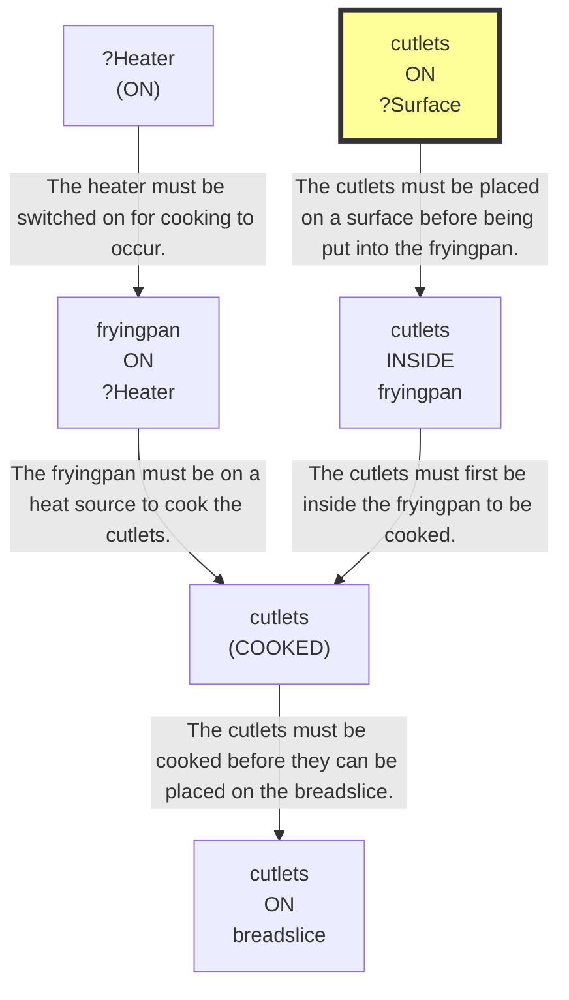
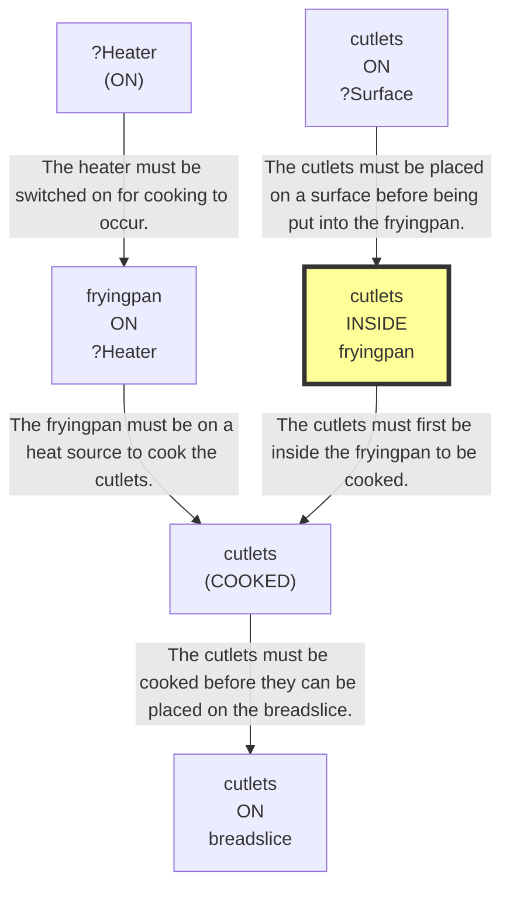

# 🚀 VirtualHome Agent Episode Log


### [GoalReasoner (Module A - Intent)] Output
```json
{
  "is_instruction_obviously_vague": false,
  "clarification_question": null,
  "target_object": "cutlets",
  "location_hint": null,
  "reasoning_chain": [
    {
      "question": "Why does the user want this object?",
      "answer": "To prepare and assemble the cutlets as food."
    },
    {
      "question": "Why is that important?",
      "answer": "So the food is cooked and ready to be eaten in the desired form."
    },
    {
      "question": "What fundamental need does this fulfill?",
      "answer": "It fulfills the need to eat and reduce hunger."
    },
    {
      "question": "Are there any deeper psychological or physical motivations?",
      "answer": "The user may want a convenient, warmed meal or assembled food item for immediate consumption."
    }
  ],
  "deep_intent": "The user wants to prepare food for eating and relieve hunger.",
  "acceptable_alternatives_properties": [
    {
      "priority": 1,
      "description": "Other ready-to-cook meat or protein items that can be cooked and placed on bread, such as patties or sliced cooked meat."
    },
    {
      "priority": 2,
      "description": "Other sandwich fillings that can be heated and served on bread, such as grilled chicken, fish fillets, or omelet portions."
    },
    {
      "priority": 3,
      "description": "Prepared protein foods or savory hot foods that can satisfy hunger, such as cooked leftovers or hot snack items."
    },
    {
      "priority": 4,
      "description": "Other ready-to-eat foods that provide calories and satiety, even if they are not served on bread."
    }
  ]
}
```

### [PerceptionFilter] Output
```json
{
  "reasoning": "The goal is to cook cutlets and place them on breadslice. The SDG requires the target food plus the cooking setup: a fryingpan, a heat source to turn on (stove or microwave as functional alternatives), and a surface to place the cutlets before cooking (table/counter). Breadslice is explicitly required for assembly.",
  "selected_classes": [
    "breadslice",
    "microwave",
    "kitchencounter",
    "kitchentable",
    "fryingpan",
    "table",
    "cutlets",
    "stove",
    "character"
  ],
  "raw_class_count": 99
}
```

### [LLMExecutor] Output
```json
{
  "reasoning": "The SDG requires the cutlets to be placed into the fryingpan before cooking can proceed. The fryingpan is already on the stove, but no cooking can happen until the cutlets are moved there. The character is currently near kitchentable(135), and the cutlets are not yet held, so the next atomic step toward N6 is to go to the cutlets first so they can later be grabbed.",
  "satisfied_nodes": [],
  "current_node_focus": "N3",
  "mapped_variables": {
    "?Heater": "stove(163)",
    "?Surface": "kitchentable(135)"
  },
  "action": "[walk] <cutlets> (175)"
}
```
## Step 0
- **Action**: `[walk] <cutlets> (175)`
- **SDG Status**:

- **Observed Items (15)**: character(1), kitchen(11), fryingpan(62), kitchentable(131), kitchentable(135), kitchencounter(136) [CLOSED], kitchencounter(137) [CLOSED], kitchencounter(146) [CLOSED], stove(163) [OFF,CLOSED], breadslice(167), microwave(171) [CLOSED,OFF], cutlets(175), livingroom(183), bedroom(241), bedroom(346)


### [PerceptionFilter] Output
```json
{
  "reasoning": "Needed items are the target food and the objects required by the SDG to cook and place it on bread: a fryingpan, a heater option to cook on (stove or microwave as backup heat sources), a surface to hold the cutlets before cooking (table/counter), and the breadslice for assembly.",
  "selected_classes": [
    "breadslice",
    "microwave",
    "kitchencounter",
    "kitchentable",
    "fryingpan",
    "cutlets",
    "stove",
    "character"
  ],
  "raw_class_count": 99
}
```

### [LLMExecutor] Output
```json
{
  "reasoning": "The cutlets are already close to the character, but to satisfy the cooking chain we need them held before they can be moved into the fryingpan. The fryingpan is not yet the focus because the immediate prerequisite is obtaining the cutlets from their current location. Next atomic step: grab the cutlets.",
  "satisfied_nodes": [],
  "current_node_focus": "N6",
  "mapped_variables": {},
  "action": "[grab] <cutlets> (175)"
}
```
## Step 1
- **Action**: `[grab] <cutlets> (175)`
- **SDG Status**:

- **Observed Items (15)**: character(1), kitchen(11), fryingpan(62), kitchentable(131), kitchentable(135), kitchencounter(136) [CLOSED], kitchencounter(137) [CLOSED], kitchencounter(146) [CLOSED], stove(163) [OFF,CLOSED], breadslice(167), microwave(171) [CLOSED,OFF], cutlets(175), livingroom(183), bedroom(241), bedroom(346)


### [PerceptionFilter] Output
```json
{
  "reasoning": "The goal is to cook cutlets and place them on breadslice. The SDG requires the target food, a fryingpan, and a heat source to cook it. A surface is also needed for the cutlets before going into the pan. To satisfy alternatives retention for heating/cooking, keep available heater options. To satisfy location retention, keep the breadslice needed for assembly.",
  "selected_classes": [
    "breadslice",
    "microwave",
    "kitchencounter",
    "kitchentable",
    "fryingpan",
    "table",
    "cutlets",
    "stove",
    "character",
    "counter"
  ],
  "raw_class_count": 99
}
```

### [LLMExecutor] Output
```json
{
  "reasoning": "The cutlets are already held in the right hand, and the SDG still requires them to be placed inside the fryingpan before cooking can proceed. The fryingpan is identified and is movable/recipient, but I am not yet close to it, and the rules require an explicit walk to the destination receptacle before any putin action. Next step should therefore move to the fryingpan on the stove to prepare for placing the cutlets inside.",
  "satisfied_nodes": [],
  "current_node_focus": "N6",
  "mapped_variables": {},
  "action": "[walk] <fryingpan> (62)"
}
```
## Step 2
- **Action**: `[walk] <fryingpan> (62)`
- **SDG Status**:

- **Observed Items (15)**: character(1), kitchen(11), fryingpan(62), kitchentable(131), kitchentable(135), kitchencounter(136) [CLOSED], kitchencounter(137) [CLOSED], kitchencounter(146) [CLOSED], stove(163) [OFF,CLOSED], breadslice(167), microwave(171) [CLOSED,OFF], cutlets(175), livingroom(183), bedroom(241), bedroom(346)


### [PerceptionFilter] Output
```json
{
  "reasoning": "Needed items are the target food and the tools/surfaces required by the SDG: cutlets must be cooked in a fryingpan on a heater, then placed on breadslice, and a surface is needed for handling/prep. I also keep all plausible heating alternatives and cooking-related receptacles that can serve the same function in case of backup use.",
  "selected_classes": [
    "breadslice",
    "microwave",
    "kitchencounter",
    "kitchentable",
    "fryingpan",
    "table",
    "cutlets",
    "stove",
    "character"
  ],
  "raw_class_count": 99
}
```

### [LLMExecutor] Output
```json
{
  "reasoning": "The cutlets are already held and we are already close to the fryingpan, which is on the stove. The next unmet SDG prerequisite is to place the cutlets into the fryingpan (N6), but per the rules, putin requires being explicitly walked to the destination first. Since the last successful action was walking to the fryingpan, the immediate next atomic action is to put the held cutlets into it.",
  "satisfied_nodes": [],
  "current_node_focus": "N6",
  "mapped_variables": {},
  "action": "[putin] <cutlets> (175) <fryingpan> (62)"
}
```
## Step 3
- **Action**: `[putin] <cutlets> (175) <fryingpan> (62)`
- **SDG Status**:

- **Observed Items (15)**: character(1), kitchen(11), fryingpan(62), kitchentable(131), kitchentable(135), kitchencounter(136) [CLOSED], kitchencounter(137) [CLOSED], kitchencounter(146) [CLOSED], stove(163) [OFF,CLOSED], breadslice(167), microwave(171) [CLOSED,OFF], cutlets(175), livingroom(183), bedroom(241), bedroom(346)


### [PerceptionFilter] Output
```json
{
  "reasoning": "Need the target food item cutlets, the breadslice they must end up on, and the cooking setup required by the SDG: fryingpan on a heater, with a heater class available (stove or microwave) and the cutlets placed on a surface before cooking. A kitchentable or similar surface is needed for the pre-cooking placement step.",
  "selected_classes": [
    "breadslice",
    "microwave",
    "kitchentable",
    "fryingpan",
    "cutlets",
    "stove",
    "character"
  ],
  "raw_class_count": 99
}
```

### [LLMExecutor] Output
```json
{
  "reasoning": "The cutlets are already held and we are already close to the fryingpan. The previous attempt to put them in failed, but the graph still shows the fryingpan is a valid recipient, and no additional prerequisite is missing for N6. Since the last action was a walk to the fryingpan, repeating walk is disallowed by the prompt. The next atomic step should be to place the held cutlets into the fryingpan to satisfy the INSIDE relation prerequisite for cooking.",
  "satisfied_nodes": [],
  "current_node_focus": "N6",
  "mapped_variables": {},
  "action": "[putin] <cutlets> (175) <fryingpan> (62)"
}
```
## Step 4
- **Action**: `[putin] <cutlets> (175) <fryingpan> (62)`
- **SDG Status**:

- **Observed Items (12)**: character(1), kitchen(11), fryingpan(62), kitchentable(131), kitchentable(135), stove(163) [OFF,CLOSED], breadslice(167), microwave(171) [CLOSED,OFF], cutlets(175), livingroom(183), bedroom(241), bedroom(346)


### [PerceptionFilter] Output
```json
{
  "reasoning": "The goal is to cook cutlets and place them on breadslice. The SDG requires the cutlets, the breadslice target, a fryingpan to cook in, a heater/appliance that can be on, and a surface to hold the cutlets before cooking. I keep all plausible cooking/heating options visible as backups: stove and microwave are relevant heaters, and a kitchencounter or kitchentable can serve as the required surface.",
  "selected_classes": [
    "breadslice",
    "microwave",
    "kitchencounter",
    "kitchentable",
    "fryingpan",
    "cutlets",
    "stove",
    "character"
  ],
  "raw_class_count": 99
}
```

### [LLMExecutor] Output
```json
{
  "reasoning": "The cutlets are already held and the fryingpan is already close, but the last two attempts to put them into the fryingpan failed with a generic execution impossibility. Since the fryingpan is a valid recipient, not dirty, and we have no alternative prerequisite missing in the graph, the immediate next step would normally be [putin]. However, because the environment rejected the same action twice without any state change, we should not keep looping. Per the failure-handling rule, we should report the physical execution problem and ask for clarification/assistance rather than repeat the failed action.",
  "satisfied_nodes": [],
  "current_node_focus": "N6",
  "mapped_variables": {},
  "action": "[ask] The cutlets are held and I am already close to the fryingpan, but putting them inside it has failed twice with a generic execution error. I cannot safely progress without resolving why the environment rejects the putin action."
}
```
## Step 5
- **Action**: `[ask] The cutlets are held and I am already close to the fryingpan, but putting them inside it has failed twice with a generic execution error. I cannot safely progress without resolving why the environment rejects the putin action.`
- **SDG Status**:

- **Observed Items (15)**: character(1), kitchen(11), fryingpan(62), kitchentable(131), kitchentable(135), kitchencounter(136) [CLOSED], kitchencounter(137) [CLOSED], kitchencounter(146) [CLOSED], stove(163) [OFF,CLOSED], breadslice(167), microwave(171) [CLOSED,OFF], cutlets(175), livingroom(183), bedroom(241), bedroom(346)

