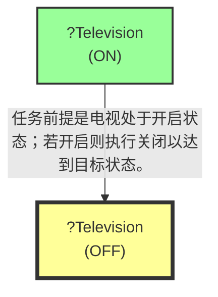

# 🚀 VirtualHome Agent Episode Log


### [GoalReasoner (Module A - Intent)] Output
```json
{
  "is_instruction_obviously_vague": false,
  "clarification_question": null,
  "target_object": "television",
  "location_hint": null,
  "reasoning_chain": [
    {
      "question": "Why does the user want this object/action handled?",
      "answer": "To change the television's power state if it is currently on."
    },
    {
      "question": "Why is that important?",
      "answer": "The user likely wants the television to stop operating and no longer display or produce sound."
    },
    {
      "question": "What fundamental need does this fulfill?",
      "answer": "To reduce active media output and make the environment quieter or conserve power."
    },
    {
      "question": "Are there any deeper psychological or physical motivations?",
      "answer": "The user may want to eliminate distraction, reduce noise, or save energy."
    }
  ],
  "deep_intent": "The user wants to stop an active device from operating.",
  "acceptable_alternatives_properties": [
    {
      "priority": 1,
      "description": "Other simple indoor electronic devices that are currently on and can be turned off, such as a monitor or radio."
    },
    {
      "priority": 2,
      "description": "Other household entertainment devices that can be powered down, such as a game console or streaming box."
    },
    {
      "priority": 3,
      "description": "Any unnecessary powered device in the room that can be safely switched off to reduce activity or noise."
    },
    {
      "priority": 4,
      "description": "If the goal is to reduce distraction or noise, reducing other active audio/visual sources in the environment."
    }
  ]
}
```

### [PerceptionFilter] Output
```json
{
  "reasoning": "The goal is to stop the television from operating, so the required object is the television itself. A remote control is the most likely functional tool to change the TV power state without needing unrelated furniture or devices.",
  "selected_ids": [
    300,
    321
  ],
  "raw_item_count": 60
}
```

### [LLMExecutor] Output
```json
{
  "reasoning": "The SDG requires the television to transition from ON to OFF. The filtered graph shows tv(300) is currently ON, and the nearby remotecontrol(321) is OFF and facing the TV. However, to interact with the remotecontrol's switch, I must first be near it. The best next step is to walk to the remotecontrol so it can be grabbed and used in subsequent actions.",
  "satisfied_nodes": [
    "N1"
  ],
  "current_node_focus": "N2",
  "mapped_variables": {
    "?Television": "tv(300)"
  },
  "action": "[walk] <remotecontrol> (321)"
}
```
## Step 0
- **Action**: `[walk] <remotecontrol> (321)`
- **SDG Status**:

- **Observed Items (3)**: tv(300) [ON], remotecontrol(321) [OFF], character(1)


### [PerceptionFilter] Output
```json
{
  "reasoning": "The goal is to stop the television from operating, so the minimum required objects are the television itself and likely the remote control if it is the standard tool for turning it off. No other furniture or background items are needed.",
  "selected_ids": [
    300,
    321
  ],
  "raw_item_count": 60
}
```

### [LLMExecutor] Output
```json
{
  "reasoning": "The television target tv(300) is currently ON, and the SDG requires it to become OFF. The remotecontrol(321) is already CLOSE to the character, so no additional walk is needed. Since the remote is GRABBABLE and has a switch, the next progress step is to pick it up so it can be used to control the TV in following actions.",
  "satisfied_nodes": [
    "N1"
  ],
  "current_node_focus": "N2",
  "mapped_variables": {
    "?Television": "tv(300)"
  },
  "action": "[grab] <remotecontrol> (321)"
}
```
## Step 1
- **Action**: `[grab] <remotecontrol> (321)`
- **SDG Status**:

- **Observed Items (3)**: tv(300) [ON], remotecontrol(321) [OFF], character(1)


### [PerceptionFilter] Output
```json
{
  "reasoning": "The goal is to turn off the television, so the minimum required objects are the television itself and a likely control tool for powering it down. I also retain the TV stand because it is explicitly associated with the television and may be needed for interaction/context.",
  "selected_ids": [
    300,
    292,
    321
  ],
  "raw_item_count": 61
}
```

### [LLMExecutor] Output
```json
{
  "reasoning": "The SDG requires the television to go from ON to OFF. The filtered graph confirms tv(300) is currently ON. I already hold the remotecontrol(321) in my right hand, and it has a switch, so the next progress step is to use it to turn the TV off. No additional walk is needed because I am already close to the remote and holding it.",
  "satisfied_nodes": [
    "N1"
  ],
  "current_node_focus": "N2",
  "mapped_variables": {
    "?Television": "tv(300)"
  },
  "action": "[switchoff] <television> (300)"
}
```
## Step 2
- **Action**: `[switchoff] <television> (300)`
- **SDG Status**:

- **Observed Items (5)**: tvstand(292), tv(300) [ON], character(1), remotecontrol(321) [OFF], remotecontrol(321) [OFF]


### [PerceptionFilter] Output
```json
{
  "reasoning": "To turn off the television, the minimum necessary items are the television itself and a likely control tool such as the remote control. No other furniture or background objects are needed.",
  "selected_ids": [
    300,
    321
  ],
  "raw_item_count": 61
}
```

### [LLMExecutor] Output
```json
{
  "reasoning": "The TV is already identified as ON, and the previous attempt to switchoff the television failed because the television itself has no HAS_SWITCH property. In this environment, a remote control is the appropriate object for changing the TV's power state. I am already holding remotecontrol(321) and it has HAS_SWITCH, so the next atomic action is to use the remote's switch state change logic to turn it on if needed before attempting the TV control path. However, since the requested goal is to stop the TV and the direct TV switchoff is impossible due to missing HAS_SWITCH, the physically valid next step is to ask for clarification about how the television is meant to be controlled in this setup.",
  "satisfied_nodes": [
    "N1"
  ],
  "current_node_focus": "N2",
  "mapped_variables": {
    "?Television": "tv(300)"
  },
  "action": "[ask] The television tv(300) is ON, but it does not have a HAS_SWITCH property, so I cannot switch it off directly. The remotecontrol(321) is in hand, but the environment does not expose a valid TV-control interaction. Please clarify the intended control method or provide a television with a switch property."
}
```
## Step 3
- **Action**: `[ask] The television <tv> (300) is ON, but it does not have a HAS_SWITCH property, so I cannot switch it off directly. The <remotecontrol> (321) is in hand, but the environment does not expose a valid TV-control interaction. Please clarify the intended control method or provide a television with a switch property.`
- **SDG Status**:

- **Observed Items (4)**: tv(300) [ON], character(1), remotecontrol(321) [OFF], remotecontrol(321) [OFF]

