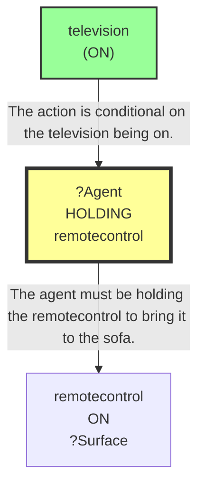
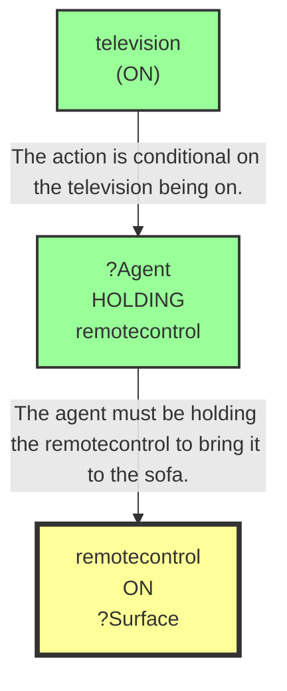
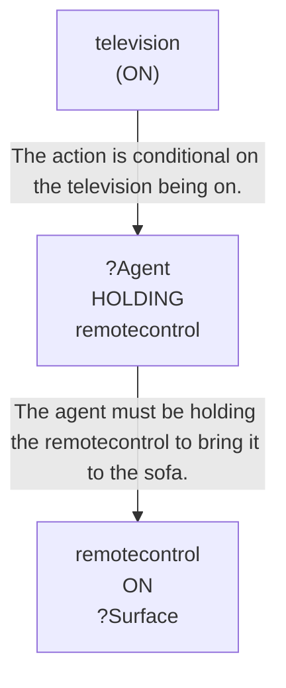

# 🚀 VirtualHome Agent Episode Log


### [GoalReasoner (Module A - Intent)] Output
```json
{
  "is_instruction_obviously_vague": false,
  "clarification_question": null,
  "target_object": "remote control",
  "location_hint": "sofa",
  "reasoning_chain": [
    {
      "question": "Why does the user want this object?",
      "answer": "To use it with the television if the television is on."
    },
    {
      "question": "Why is that important?",
      "answer": "It allows the user to control or interact with the television from the sofa."
    },
    {
      "question": "What fundamental need does this fulfill?",
      "answer": "It fulfills the need to conveniently operate a device from a nearby seated position."
    },
    {
      "question": "Are there any deeper psychological or physical motivations?",
      "answer": "The user likely wants easy access and reduced effort while staying seated, improving comfort and convenience."
    }
  ],
  "deep_intent": "The user wants convenient control of the television while seated.",
  "acceptable_alternatives_properties": [
    {
      "priority": 1,
      "description": "A different compatible remote or universal remote that can control the television"
    },
    {
      "priority": 2,
      "description": "Another handheld controller or input device that serves the same television-control function"
    },
    {
      "priority": 3,
      "description": "A control interface near the sofa, such as a tablet or phone running a TV-control app"
    },
    {
      "priority": 4,
      "description": "Any nearby method of operating the television without needing to stand up"
    }
  ]
}
```

### [PerceptionFilter] Output
```json
{
  "reasoning": "Need the target remote control and the television it will control, plus the sofa location mentioned in the intent. The SDG requires the remote to be held, and the goal is to use it while seated near the sofa.",
  "selected_ids": [
    288,
    300,
    321,
    1,
    85
  ],
  "raw_item_count": 316
}
```

### [LLMExecutor] Output
```json
{
  "reasoning": "The television is already ON, so N1 is satisfied. The remote control exists and is close to the agent, but N3 requires the agent to be HOLDING it before it can be placed on or used with the sofa. Since grab actions require proximity and the graph already indicates the remote is CLOSE, the next atomic step is to pick it up. This moves toward satisfying N3, which then supports N2 if needed.",
  "satisfied_nodes": [
    "N1"
  ],
  "current_node_focus": "N3",
  "mapped_variables": {},
  "action": "[grab] remotecontrol (321)"
}
```
## Step 0
- **Action**: `[grab] <remotecontrol> (321)`
- **SDG Status**:

- **Observed Items (5)**: character(1), sofa(85), sofa(288), tv(300) [OFF,ON], remotecontrol(321) [OFF]


### [PerceptionFilter] Output
```json
{
  "reasoning": "The goal requires the remote control to control the television while seated on the sofa. Per the SDG and location hint, I must keep the target remote control, the television, and the sofa. The visible remote control is the needed tool, and the sofa and TV are explicitly relevant locations/objects for the intent.",
  "selected_ids": [
    288,
    300,
    321,
    1,
    85
  ],
  "raw_item_count": 316
}
```

### [LLMExecutor] Output
```json
{
  "reasoning": "The television is already ON, so N1 is satisfied. The agent is already holding remotecontrol(321) in the right hand, satisfying N3. The remaining unmet requirement is N2: the remotecontrol should be ON and placed on a sofa surface. Since the agent is not already at a sofa and putback requires walking to the surface first, the next needed step is to walk to the best sofa candidate. I choose sofa(85) as the target surface binding because it is a valid sofa surface and there is no evidence that sofa(288) is better suited.",
  "satisfied_nodes": [
    "N1",
    "N3"
  ],
  "current_node_focus": "N2",
  "mapped_variables": {
    "?Surface": "sofa(85)"
  },
  "action": "[walk] <sofa> (85)"
}
```
## Step 1
- **Action**: `[walk] <sofa> (85)`
- **SDG Status**:

- **Observed Items (5)**: character(1), sofa(85), sofa(288), tv(300) [OFF,ON], remotecontrol(321) [OFF]


### [PerceptionFilter] Output
```json
{
  "reasoning": "Need the target remote control and the television it controls, plus the sofa location mentioned in the intent. No other objects are required for this goal.",
  "selected_ids": [
    288,
    300,
    321,
    1,
    85
  ],
  "raw_item_count": 316
}
```

### [LLMExecutor] Output
```json
{
  "reasoning": "N1 is already satisfied because the television tv(300) is ON. N3 is satisfied because the agent is currently holding remotecontrol(321) in the right hand. The remaining unmet node is N2: the remote control must be ON and placed on a sofa surface. Since the agent has already walked to sofa(85) and is close to it, the next atomic step is to put the held remote onto the sofa surface.",
  "satisfied_nodes": [
    "N1",
    "N3"
  ],
  "current_node_focus": "N2",
  "mapped_variables": {
    "?Surface": "sofa(85)"
  },
  "action": "[putback] <remotecontrol> (321) <sofa> (85)"
}
```
## Step 2
- **Action**: `[putback] <remotecontrol> (321) <sofa> (85)`
- **SDG Status**:

- **Observed Items (5)**: character(1), sofa(85), sofa(288), tv(300) [OFF,ON], remotecontrol(321) [OFF]


### [PerceptionFilter] Output
```json
{
  "reasoning": "The goal is to have the remote control for use with the television while seated on the sofa. The SDG requires the television, the remote control, and a surface/holding context; the sofa is explicitly the location hint and must be retained. No other objects are necessary.",
  "selected_ids": [
    288,
    300,
    321,
    1,
    85
  ],
  "raw_item_count": 316
}
```
## Step 3
- **Action**: `FINISH (Goal Reached)`
- **SDG Status**:

- **Observed Items (5)**: character(1), sofa(85), sofa(288), tv(300) [OFF,ON], remotecontrol(321) [OFF]

