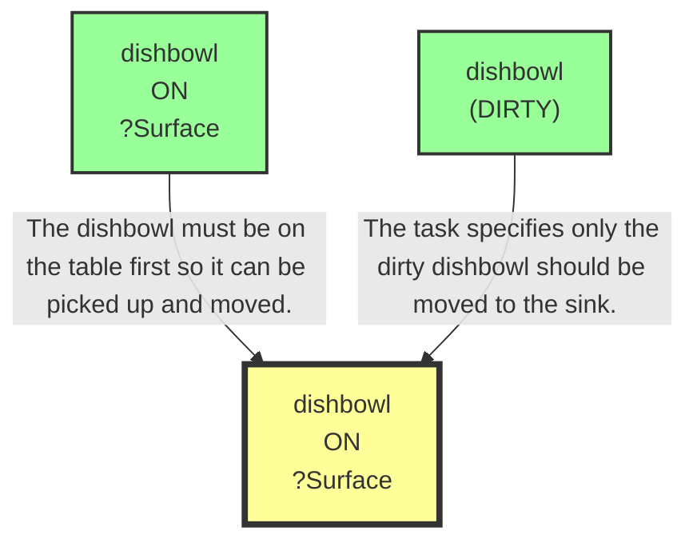
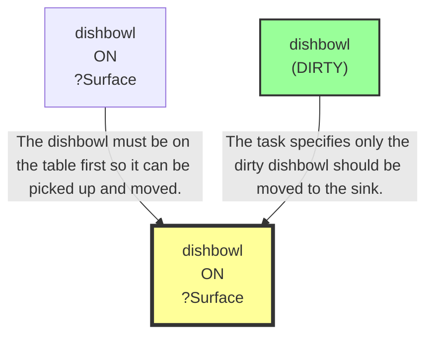
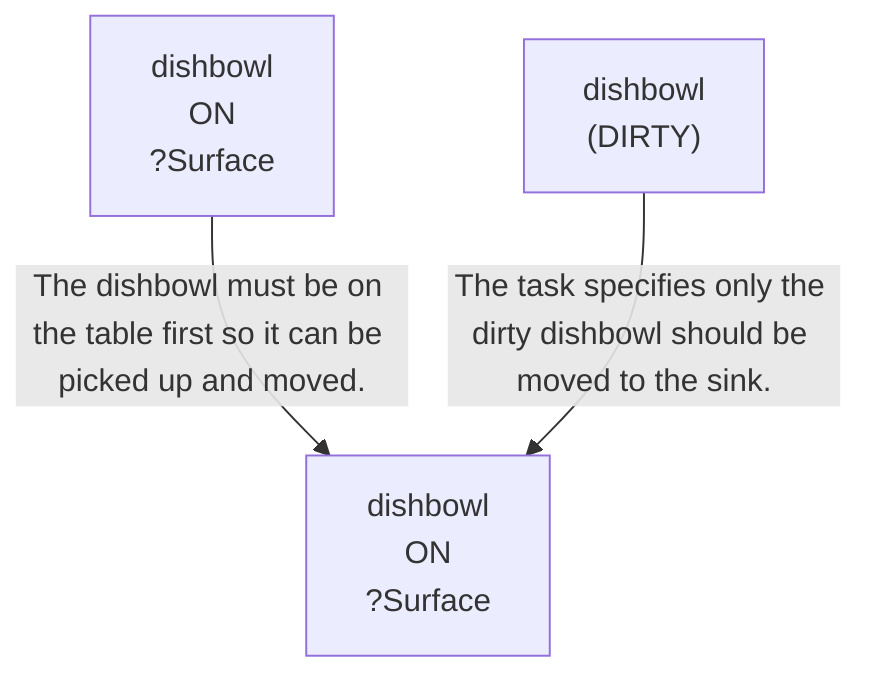

# 🚀 VirtualHome Agent Episode Log


### [GoalReasoner (Module A - Intent)] Output
```json
{
  "is_instruction_obviously_vague": false,
  "clarification_question": null,
  "target_object": "dishbowl",
  "location_hint": "table",
  "reasoning_chain": [
    {
      "question": "Why does the user want this object?",
      "answer": "To move the dirty dishbowl from the table to the sink."
    },
    {
      "question": "Why is that important?",
      "answer": "To relocate a used dish to the place where it belongs for cleaning or kitchen organization."
    },
    {
      "question": "What fundamental need does this fulfill?",
      "answer": "To keep the kitchen area tidy and support cleaning up after use."
    },
    {
      "question": "Are there any deeper psychological or physical motivations?",
      "answer": "The user may want to reduce clutter, maintain hygiene, and make the space more orderly."
    }
  ],
  "deep_intent": "The user wants to tidy the kitchen by moving a dirty used dish to the sink for cleaning.",
  "acceptable_alternatives_properties": [
    {
      "priority": 1,
      "description": "Other dirty dishes or bowls on the table that can be moved to the sink for washing"
    },
    {
      "priority": 2,
      "description": "Other used kitchenware such as plates, cups, or utensils that belong in the sink area"
    },
    {
      "priority": 3,
      "description": "Any dirty food-related items from the table that should be gathered for cleanup"
    },
    {
      "priority": 4,
      "description": "Other household items involved in a cleanup task, if the specific dishbowl is unavailable"
    }
  ]
}
```

### [PerceptionFilter] Output
```json
{
  "reasoning": "Needed items are the target dirty dishbowl on the table plus the relevant cleanup destination and supporting sink appliances. I keep all dishbowls as possible target/backup dishware, the table as the source location, and the sink/faucet/dishwasher as functional cleanup locations/tools.",
  "selected_ids": [
    121,
    165,
    199,
    219,
    220,
    228,
    170,
    171,
    172,
    173,
    177,
    178,
    184,
    1,
    126
  ],
  "raw_item_count": 116
}
```

### [LLMExecutor] Output
```json
{
  "reasoning": "The goal is to relocate the dirty dishbowl from the table toward the sink area. The required dishbowl is present as dishbowl(121), marked DIRTY and ON the kitchentable(199), and it is already CLOSE to the character. Since the robot must be near an object to grab it, the best next step is to pick up the dirty dishbowl first. This directly advances toward moving it to the sink. The sink is a surface, not a container, so later placement will require putback onto the sink rather than putin.",
  "satisfied_nodes": [
    "N1",
    "N2"
  ],
  "current_node_focus": "N3",
  "mapped_variables": {
    "?Surface": "kitchentable(199)"
  },
  "action": "[grab] <dishbowl> (121)"
}
```
## Step 0
- **Action**: `[grab] <dishbowl> (121)`
- **SDG Status**:

- **Observed Items (15)**: plate(170), plate(171), plate(172), plate(173), plate(177), plate(178), plate(184), kitchentable(199), sink(219), faucet(220) [OFF], dishwasher(228) [CLOSED,OFF], dishbowl(121) [DIRTY], dishbowl(165) [CLEAN], character(1), kitchen(126)


### [PerceptionFilter] Output
```json
{
  "reasoning": "Need the target dirty dishbowl on the kitchen table, plus the sink for the destination/cleanup location. The task is to move that dishbowl from the table to the sink, so I keep the dishbowl(s), the table, and the sink as the relevant objects. I also include the faucet because it is part of the washing area and a functional backup for cleanup.",
  "selected_ids": [
    165,
    121,
    199,
    219,
    220,
    170,
    171,
    172,
    173,
    177,
    178,
    184,
    1,
    126
  ],
  "raw_item_count": 117
}
```

### [LLMExecutor] Output
```json
{
  "reasoning": "The required dirty dishbowl(121) is already in hand from the previous successful grab, so the next missing step toward relocating it to the sink is to move to the sink. The sink is a surface, so before any eventual putback we must explicitly walk there. No other SDG node is yet satisfied beyond the dishbowl being the dirty target object; the on-table relation is no longer relevant since it has been picked up and moved off the table.",
  "satisfied_nodes": [
    "N2"
  ],
  "current_node_focus": "N3",
  "mapped_variables": {
    "?Surface": "sink(219)"
  },
  "action": "[walk] <sink> (219)"
}
```
## Step 1
- **Action**: `[walk] <sink> (219)`
- **SDG Status**:

- **Observed Items (15)**: plate(170), plate(171), plate(172), plate(173), plate(177), plate(178), plate(184), kitchentable(199), sink(219), faucet(220) [OFF], dishbowl(165) [CLEAN], character(1), dishbowl(121) [DIRTY], kitchen(126), dishbowl(121) [DIRTY]


### [PerceptionFilter] Output
```json
{
  "reasoning": "Need the dirty dishbowl target, the table it is on, and the sink where it should be moved. Since the goal is cleanup, no extra tools are strictly necessary for selection.",
  "selected_ids": [
    165,
    199,
    219,
    170,
    171,
    172,
    173,
    177,
    178,
    184,
    1,
    121,
    126
  ],
  "raw_item_count": 117
}
```

### [LLMExecutor] Output
```json
{
  "reasoning": "The dirty dishbowl(121) is already in the robot's right hand and the robot is already close to sink(219), which is the correct target surface for relocation. The SDG's remaining progress is to place the dirty dishbowl onto the sink. Since sink is a surface and not a container, the correct action is putback, not putin. This directly satisfies the intended move-to-sink objective.",
  "satisfied_nodes": [
    "N2"
  ],
  "current_node_focus": "N3",
  "mapped_variables": {
    "?Surface": "sink(219)"
  },
  "action": "[putback] <dishbowl> (121) <sink> (219)"
}
```
## Step 2
- **Action**: `[putback] <dishbowl> (121) <sink> (219)`
- **SDG Status**:

- **Observed Items (14)**: plate(170), plate(171), plate(172), plate(173), plate(177), plate(178), plate(184), kitchentable(199), sink(219), dishbowl(165) [CLEAN], character(1), dishbowl(121) [DIRTY], kitchen(126), dishbowl(121) [DIRTY]


### [PerceptionFilter] Output
```json
{
  "reasoning": "Need the target dirty dishbowl on the table, plus the table itself as the required location, and the sink as the destination for cleanup. I also keep the dishwasher as an alternative washing tool/receptacle in case the sink is not usable.",
  "selected_ids": [
    165,
    121,
    199,
    219,
    228,
    170,
    171,
    172,
    173,
    177,
    178,
    184,
    1,
    126
  ],
  "raw_item_count": 116
}
```
## Step 3
- **Action**: `FINISH (Goal Reached)`
- **SDG Status**:

- **Observed Items (14)**: plate(170), plate(171), plate(172), plate(173), plate(177), plate(178), plate(184), kitchentable(199), sink(219), dishwasher(228) [CLOSED,OFF], dishbowl(165) [CLEAN], dishbowl(121) [DIRTY], character(1), kitchen(126)

