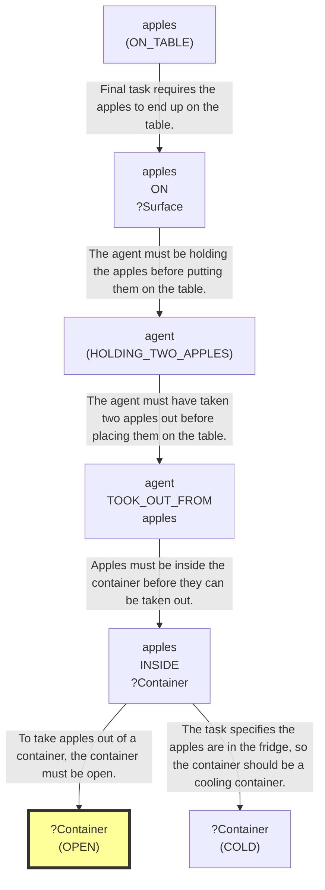
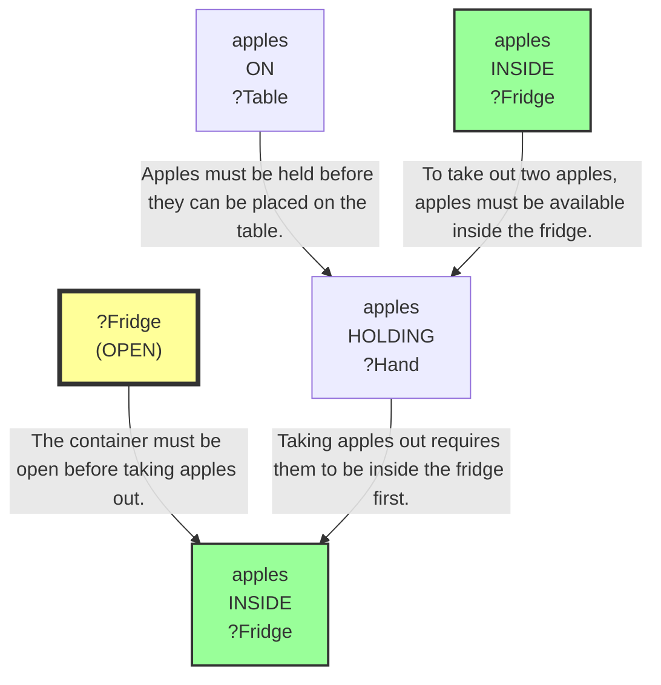
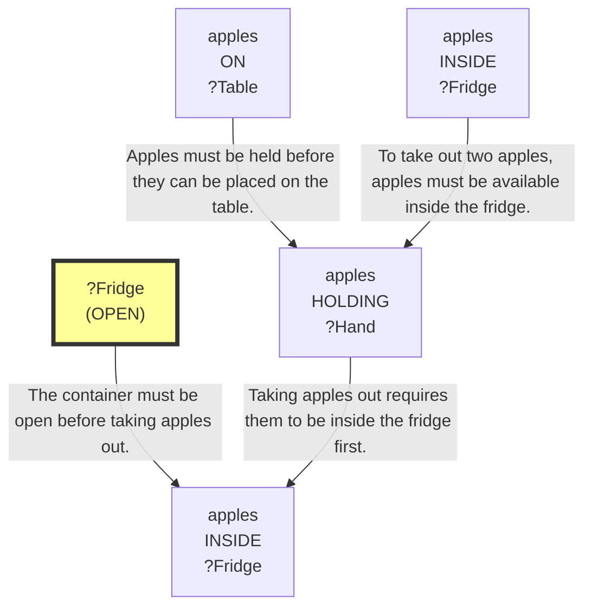
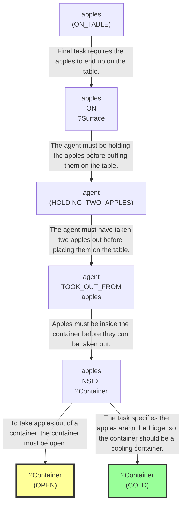
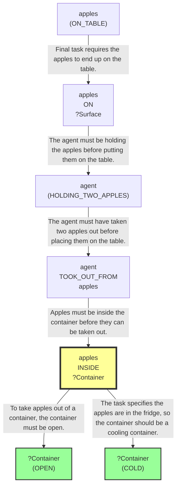
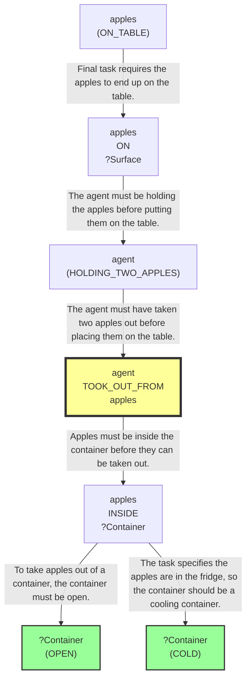
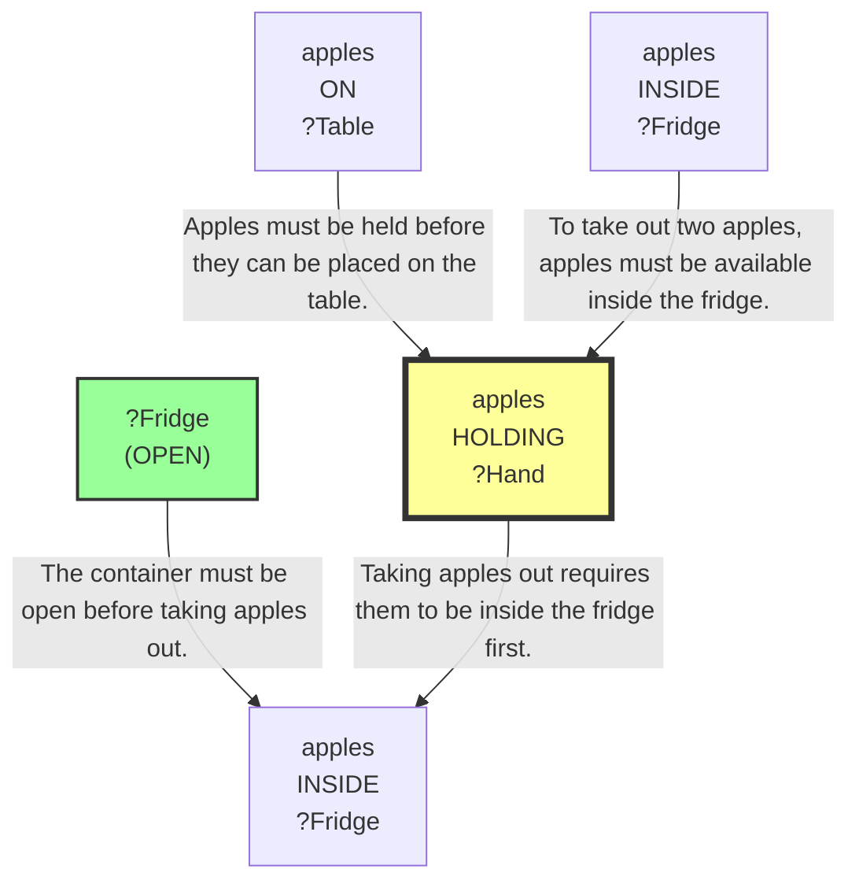
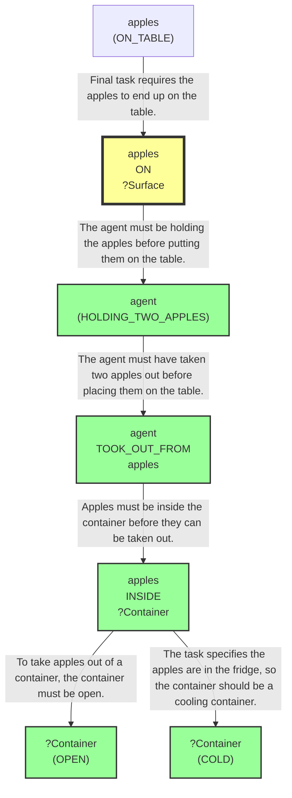

# 🚀 VirtualHome Agent Episode Log


### [GoalReasoner (Module A - Intent)] Output
```json
{
  "is_instruction_obviously_vague": false,
  "clarification_question": null,
  "target_object": "apples",
  "location_hint": "fridge",
  "reasoning_chain": [
    {
      "question": "Why does the user want this object?",
      "answer": "To move two apples from the fridge to the table."
    },
    {
      "question": "Why is that important?",
      "answer": "To make the apples accessible and place them where the user wants them."
    },
    {
      "question": "What fundamental need does this fulfill?",
      "answer": "It fulfills the need to obtain or prepare food for use or consumption."
    },
    {
      "question": "Are there any deeper psychological or physical motivations?",
      "answer": "The user may want to eat the apples soon, organize food placement, or make them available for others."
    }
  ],
  "deep_intent": "The user wants to make food available for use or consumption.",
  "acceptable_alternatives_properties": [
    {
      "priority": 1,
      "description": "Other similar whole fruits that can be taken from storage and placed on the table."
    },
    {
      "priority": 2,
      "description": "Other ready-to-eat produce items stored in the fridge, such as pears or oranges."
    },
    {
      "priority": 3,
      "description": "Any edible snack or fruit item that can be moved to the table for access."
    },
    {
      "priority": 4,
      "description": "Other food items that are commonly kept indoors and can be set out for consumption."
    }
  ]
}
```

### [LLMExecutor] Output
```json
{
  "reasoning": "The apples are specified to be in the fridge, and the required container state is OPEN, but the fridge is currently CLOSED and the active global rule says the fridge door is jammed and cannot be opened until step 6. Because this temporary rule blocks the necessary precondition, the correct next step is to wait for the jam to expire rather than attempting an impossible interaction now.",
  "satisfied_nodes": [],
  "current_node_focus": "N3",
  "mapped_variables": {
    "?Container": "fridge(225)",
    "?Surface": "kitchentable(199)"
  },
  "action": "[wait]"
}
```
## Step 0
- **Action**: `[wait]`
- **SDG Status**:

- **Observed Items (5)**: door(145) [OPEN], door(146) [OPEN], kitchentable(199), fridge(225) [CLOSED], character(1)


### [PerceptionFilter] Output
```json
{
  "reasoning": "Needed objects are the apples target, the fridge as the cold container they are inside, and the table surface where they must end up. The microwave and stove are alternative food-handling appliances but not necessary for this specific transfer task, so they are not included.",
  "selected_ids": [
    225,
    199,
    145,
    146,
    1
  ],
  "raw_item_count": 104
}
```

### [LLMExecutor] Output
```json
{
  "reasoning": "The required container for the apples is the fridge, but it is currently CLOSED and a temporary global rule states it is jammed and cannot be opened until step 6. Since this blocks the necessary precondition and we have only waited once so far, the correct next step is to wait for the jam to expire rather than attempting an impossible interaction.",
  "satisfied_nodes": [],
  "current_node_focus": "N3",
  "mapped_variables": {
    "?Container": "fridge(225)",
    "?Surface": "kitchentable(199)"
  },
  "action": "[wait]"
}
```

### [PerceptionFilter] Output
```json
{
  "reasoning": "The task requires the apples, the fridge they are inside, and the table they must be placed on. The SDG also requires a usable fridge state, so the fridge must be kept as the storage location. No extra tools are needed beyond the target food, source container, and destination surface.",
  "selected_ids": [
    225,
    199,
    145,
    146,
    1
  ],
  "raw_item_count": 104
}
```
## Step 1
- **Action**: `[wait]`
- **SDG Status**:

- **Observed Items (5)**: door(145) [OPEN], door(146) [OPEN], kitchentable(199), fridge(225) [CLOSED], character(1)


### [PerceptionFilter] Output
```json
{
  "reasoning": "Needed items are the apples, the fridge as the cold container they are inside, and the table where they must end up. The fridge is the required storage location and functional alternative cooling container; the table is the destination surface.",
  "selected_ids": [
    225,
    199,
    145,
    146,
    1
  ],
  "raw_item_count": 104
}
```

### [LLMExecutor] Output
```json
{
  "reasoning": "The SDG requires the fridge to be OPEN before apples can be taken out, but the active global rule states the fridge door is jammed and cannot be opened until step 6. Since this is a temporary blocking rule, the correct progress action is to wait for it to expire rather than attempt an impossible open interaction now.",
  "satisfied_nodes": [
    "N1",
    "N5"
  ],
  "current_node_focus": "N2",
  "mapped_variables": {
    "?Fridge": "fridge(225)",
    "?Table": "kitchentable(199)"
  },
  "action": "[wait]"
}
```
## Step 0
- **Action**: `[wait]`
- **SDG Status**:

- **Observed Items (5)**: door(145) [OPEN], door(146) [OPEN], kitchentable(199), fridge(225) [CLOSED], character(1)


### [LLMExecutor] Output
```json
{
  "reasoning": "The SDG requires the apples to be taken out of the fridge, but the fridge is currently CLOSED and the active global rule says it is jammed until step 6. Since this is a temporary block on the necessary precondition, the correct autonomous action is to wait until the jam expires rather than attempting to open it now. The table is available, but no progress can be made until the fridge can be opened.",
  "satisfied_nodes": [],
  "current_node_focus": "N3",
  "mapped_variables": {
    "?Container": "fridge(225)",
    "?Surface": "kitchentable(199)"
  },
  "action": "[wait]"
}
```
## Step 2
- **Action**: `[wait]`
- **SDG Status**:

- **Observed Items (5)**: door(145) [OPEN], door(146) [OPEN], kitchentable(199), fridge(225) [CLOSED], character(1)


### [PerceptionFilter] Output
```json
{
  "reasoning": "The goal requires the apples, the fridge they are inside, and the table they should be placed on. The SDG also requires the fridge to be open and the apples to be held before placement, so the fridge and table must be retained. No other objects are necessary.",
  "selected_ids": [
    225,
    199,
    145,
    146,
    1
  ],
  "raw_item_count": 104
}
```

### [PerceptionFilter] Output
```json
{
  "reasoning": "Need the apples, the fridge as the cold container they are inside, the table where they must end up, and the agent is implied to need the relevant food item only. Include the available alternative cooling/holding appliances for the fridge requirement and the target surface for placement.",
  "selected_ids": [
    225,
    199,
    241,
    242,
    248,
    145,
    146,
    1
  ],
  "raw_item_count": 104
}
```

### [LLMExecutor] Output
```json
{
  "reasoning": "The required fridge is still CLOSED, and the active global rule says it is temporarily jammed and cannot be opened until step 6. Since opening is the necessary next prerequisite for taking apples out and no other progress action is possible right now, the correct atomic action is to wait for the rule to expire.",
  "satisfied_nodes": [],
  "current_node_focus": "N2",
  "mapped_variables": {
    "?Fridge": "fridge(225)",
    "?Table": "kitchentable(199)"
  },
  "action": "[wait]"
}
```
## Step 1
- **Action**: `[wait]`
- **SDG Status**:

- **Observed Items (5)**: door(145) [OPEN], door(146) [OPEN], kitchentable(199), fridge(225) [CLOSED], character(1)


### [PerceptionFilter] Output
```json
{
  "reasoning": "Needed objects are the target apples, the fridge they are inside, and the table where they must be placed. The fridge is required as the storage location to open and retrieve the apples, and the table is the destination. No other tools are necessary for this task.",
  "selected_ids": [
    225,
    199,
    145,
    146,
    1
  ],
  "raw_item_count": 104
}
```

### [LLMExecutor] Output
```json
{
  "reasoning": "The SDG requires the apples to be taken from the fridge, and the active global rule still blocks opening the fridge until step 6. The current step is still before that expiry, so no physical progress toward the apples can be made yet. The correct atomic action is to wait for the temporary jam to expire.",
  "satisfied_nodes": [],
  "current_node_focus": "N3",
  "mapped_variables": {
    "?Container": "fridge(225)",
    "?Surface": "kitchentable(199)"
  },
  "action": "[wait]"
}
```
## Step 3
- **Action**: `[wait]`
- **SDG Status**:

- **Observed Items (8)**: door(145) [OPEN], door(146) [OPEN], kitchentable(199), fridge(225) [CLOSED], chicken(241), cutlets(242), poundcake(248), character(1)


### [LLMExecutor] Output
```json
{
  "reasoning": "The required fridge (225) is still CLOSED, and the active global rule explicitly says its door is jammed and cannot be opened until step 6. Since opening the fridge is a necessary prerequisite for obtaining the apples and no other physical progress toward the SDG is possible right now, the correct action is to wait for the temporary restriction to expire.",
  "satisfied_nodes": [],
  "current_node_focus": "N2",
  "mapped_variables": {
    "?Fridge": "fridge(225)",
    "?Table": "kitchentable(199)"
  },
  "action": "[wait]"
}
```
## Step 2
- **Action**: `[wait]`
- **SDG Status**:

- **Observed Items (5)**: door(145) [OPEN], door(146) [OPEN], kitchentable(199), fridge(225) [CLOSED], character(1)


### [PerceptionFilter] Output
```json
{
  "reasoning": "Needed objects are the target food and the physical appliance/location required by the SDG: the apples, the fridge as the cold container they come from, and the table where they must end up. No other tools are required for simply taking and placing the apples.",
  "selected_ids": [
    225,
    199,
    145,
    146,
    1
  ],
  "raw_item_count": 104
}
```

### [PerceptionFilter] Output
```json
{
  "reasoning": "Needed items are the target apples, the fridge they must come from, and the kitchentable where they should be placed. The SDG also requires the fridge to be open and the apples to be held before being set on the table, but those are action states rather than separate objects.",
  "selected_ids": [
    225,
    199,
    145,
    146,
    1
  ],
  "raw_item_count": 104
}
```

### [LLMExecutor] Output
```json
{
  "reasoning": "The goal requires taking apples out of the fridge, but the fridge is still CLOSED and the active global rule explicitly says it is jammed until step 6. Since this temporary block prevents satisfying the OPEN precondition for the container, the correct next atomic action is to wait one step for the jam to expire. No other progress can be made now.",
  "satisfied_nodes": [
    "N7"
  ],
  "current_node_focus": "N3",
  "mapped_variables": {
    "?Container": "fridge(225)",
    "?Surface": "kitchentable(199)"
  },
  "action": "[wait]"
}
```
## Step 4
- **Action**: `[wait]`
- **SDG Status**:

- **Observed Items (5)**: door(145) [OPEN], door(146) [OPEN], kitchentable(199), fridge(225) [CLOSED], character(1)


### [PerceptionFilter] Output
```json
{
  "reasoning": "Needed: the target apples, the fridge as the cold container they are inside, and the table where they must end up. The SDG also requires an open container, but the visible fridge is the relevant container to keep for this task.",
  "selected_ids": [
    225,
    199,
    145,
    146,
    1
  ],
  "raw_item_count": 104
}
```

### [LLMExecutor] Output
```json
{
  "reasoning": "The required fridge(225) is still CLOSED, but the active global rule says it is jammed and cannot be opened until step 6. No other SDG node can be progressed without opening the fridge first, so the only valid progress action is to wait for the temporary restriction to expire.",
  "satisfied_nodes": [],
  "current_node_focus": "N2",
  "mapped_variables": {
    "?Fridge": "fridge(225)",
    "?Table": "kitchentable(199)"
  },
  "action": "[wait]"
}
```
## Step 3
- **Action**: `[wait]`
- **SDG Status**:

- **Observed Items (5)**: door(145) [OPEN], door(146) [OPEN], kitchentable(199), fridge(225) [CLOSED], character(1)


### [LLMExecutor] Output
```json
{
  "reasoning": "The required container is the fridge(225), and the SDG needs it OPEN before apples can be taken out. The active global rule still says the fridge is jammed until step 6, so opening it is currently blocked. Since this is a temporary obstruction and no other progress is possible yet, the correct action is to wait one more step.",
  "satisfied_nodes": [],
  "current_node_focus": "N3",
  "mapped_variables": {
    "?Container": "fridge(225)",
    "?Surface": "kitchentable(199)"
  },
  "action": "[wait]"
}
```
## Step 5
- **Action**: `[wait]`
- **SDG Status**:

- **Observed Items (5)**: door(145) [OPEN], door(146) [OPEN], kitchentable(199), fridge(225) [CLOSED], character(1)


### [PerceptionFilter] Output
```json
{
  "reasoning": "The goal is to take apples from the fridge and place them on the kitchen table. Required items are the target apples, the fridge as the storage location, and the table as the destination. The SDG also requires the fridge to be open, so the fridge must be included. No other tools are necessary from the visible list.",
  "selected_ids": [
    225,
    199,
    145,
    146,
    1
  ],
  "raw_item_count": 104
}
```

### [PerceptionFilter] Output
```json
{
  "reasoning": "Need the target apples, the fridge as the implied cold container, and the table as the destination surface. SDG also requires the container be open, so fridge must be kept for access. No other tools are necessary.",
  "selected_ids": [
    225,
    199,
    145,
    146,
    1
  ],
  "raw_item_count": 104
}
```

### [LLMExecutor] Output
```json
{
  "reasoning": "The required fridge(225) is still CLOSED, and the active global rule says it is jammed until step 6. Because opening the fridge is the prerequisite for taking apples out and no other SDG node can be advanced yet, the only valid next atomic action is to wait one step.",
  "satisfied_nodes": [],
  "current_node_focus": "N2",
  "mapped_variables": {
    "?Fridge": "fridge(225)",
    "?Table": "kitchentable(199)",
    "?Hand": "character(1)"
  },
  "action": "[wait]"
}
```
## Step 4
- **Action**: `[wait]`
- **SDG Status**:

- **Observed Items (5)**: door(145) [OPEN], door(146) [OPEN], kitchentable(199), fridge(225) [CLOSED], character(1)


### [LLMExecutor] Output
```json
{
  "reasoning": "The temporary fridge jam is gone (no active global rules). The next missing precondition is that the fridge must be open before apples can be taken out. I am not already at the fridge, and opening/interacting with it requires proximity, so the single best next atomic action is to walk to the fridge.",
  "satisfied_nodes": [
    "N7"
  ],
  "current_node_focus": "N3",
  "mapped_variables": {
    "?Container": "fridge(225)",
    "?Surface": "kitchentable(199)"
  },
  "action": "[walk] <fridge> (225)"
}
```
## Step 6
- **Action**: `[walk] <fridge> (225)`
- **SDG Status**:

- **Observed Items (5)**: door(145) [OPEN], door(146) [OPEN], kitchentable(199), fridge(225) [CLOSED], character(1)


### [PerceptionFilter] Output
```json
{
  "reasoning": "The goal requires the apples, the fridge they are inside, and the table they must be placed on. The SDG also requires the fridge to be open before taking the apples out, so the fridge is necessary. No other tools are strictly required for this task.",
  "selected_ids": [
    225,
    199,
    145,
    146,
    1
  ],
  "raw_item_count": 104
}
```

### [PerceptionFilter] Output
```json
{
  "reasoning": "Need the target apples, the fridge as the implied cold container, and the table where the apples should end up. The SDG also requires an open container and acknowledges alternative cooling/food-access appliances, so I keep the fridge and the table only as the necessary location objects here.",
  "selected_ids": [
    225,
    199,
    145,
    146,
    1
  ],
  "raw_item_count": 104
}
```

### [LLMExecutor] Output
```json
{
  "reasoning": "The SDG cannot progress yet because the fridge must be OPEN before apples can be taken out, and the active global rule still says the fridge door is jammed until step 6. The current step is before that expiry, so no physical action toward the goal is possible right now. The correct atomic action is to wait one more step.",
  "satisfied_nodes": [],
  "current_node_focus": "N2",
  "mapped_variables": {
    "?Fridge": "fridge(225)",
    "?Table": "kitchentable(199)"
  },
  "action": "[wait]"
}
```
## Step 5
- **Action**: `[wait]`
- **SDG Status**:

- **Observed Items (5)**: door(145) [OPEN], door(146) [OPEN], kitchentable(199), fridge(225) [CLOSED], character(1)


### [LLMExecutor] Output
```json
{
  "reasoning": "The robot is already at the fridge from the previous step, and the next missing prerequisite in the SDG is to open the container so the apples can be taken out. The fridge is the correct bound container for ?Container because it is a cooling container and matches the location hint. Since it is closed and can be opened, the best next atomic action is to open it.",
  "satisfied_nodes": [
    "N7"
  ],
  "current_node_focus": "N3",
  "mapped_variables": {
    "?Container": "fridge(225)",
    "?Surface": "kitchentable(199)"
  },
  "action": "[open] <fridge> (225)"
}
```
## Step 7
- **Action**: `[open] <fridge> (225)`
- **SDG Status**:

- **Observed Items (5)**: door(145) [OPEN], door(146) [OPEN], kitchentable(199), fridge(225) [CLOSED], character(1)


### [PerceptionFilter] Output
```json
{
  "reasoning": "Need the two target apples plus the fridge as the cooling container and the table as the destination surface. The SDG also implies the fridge must be open to take the apples out. Keeping the apples, fridge, and table is the minimum needed to achieve the task.",
  "selected_ids": [
    113,
    114,
    225,
    199,
    145,
    146,
    1
  ],
  "raw_item_count": 106
}
```

### [PerceptionFilter] Output
```json
{
  "reasoning": "Need the target food and the storage/location appliance required by the SDG: apples and the fridge. The table is also required as the destination where the apples must be placed. No extra tools are necessary for this task.",
  "selected_ids": [
    225,
    199,
    145,
    146,
    1
  ],
  "raw_item_count": 104
}
```

### [LLMExecutor] Output
```json
{
  "reasoning": "The fridge is already open and the two required apples are inside it. The next missing SDG prerequisite is to take them out, which requires being near the apples and then grabbing them. We are already at the fridge from the prior step, so the best next atomic action is to grab one of the apples. I will choose apple(113) as the first of the two apples to satisfy the HOLDING_TWO_APPLES pathway.",
  "satisfied_nodes": [
    "N3",
    "N7"
  ],
  "current_node_focus": "N2",
  "mapped_variables": {
    "?Container": "fridge(225)",
    "?Surface": "kitchentable(199)"
  },
  "action": "[grab] <apple> (113)"
}
```
## Step 8
- **Action**: `[grab] <apple> (113)`
- **SDG Status**:

- **Observed Items (7)**: door(145) [OPEN], door(146) [OPEN], kitchentable(199), fridge(225) [OPEN], character(1), apple(113) [COLD], apple(114) [COLD]


### [LLMExecutor] Output
```json
{
  "reasoning": "The temporary jam rule has expired and there are no active global rules now. The SDG's first unmet prerequisite is that the fridge must be opened before the apples can be taken out. The fridge(225) is the only matching container in the filtered graph and is currently CLOSED, so the correct next atomic action is to open it.",
  "satisfied_nodes": [],
  "current_node_focus": "N2",
  "mapped_variables": {
    "?Fridge": "fridge(225)",
    "?Table": "kitchentable(199)"
  },
  "action": "[open] fridge (225)"
}
```
## Step 6
- **Action**: `[open] <fridge> (225)`
- **SDG Status**:

- **Observed Items (5)**: door(145) [OPEN], door(146) [OPEN], kitchentable(199), fridge(225) [CLOSED], character(1)


### [PerceptionFilter] Output
```json
{
  "reasoning": "Needed items are the apples themselves, the fridge as the cold container they are inside, and the table surface where they must end up. Since the SDG requires an open cooling container and a table placement, I keep the fridge and the kitchentable, along with both apple IDs because two apples must be handled.",
  "selected_ids": [
    113,
    114,
    225,
    199,
    145,
    146,
    1
  ],
  "raw_item_count": 107
}
```

### [LLMExecutor] Output
```json
{
  "reasoning": "The fridge is already open and one apple has been grabbed. The remaining missing prerequisite for placing two apples on the table is to take out the second apple from the fridge. Apple(114) is inside the open fridge and is near the agent, so the next atomic progress step is to grab it. This also advances toward HOLDING_TWO_APPLES and TOOK_OUT_FROM.",
  "satisfied_nodes": [
    "N3",
    "N7"
  ],
  "current_node_focus": "N6",
  "mapped_variables": {
    "?Container": "fridge(225)",
    "?Surface": "kitchentable(199)"
  },
  "action": "[grab] <apple> (114)"
}
```
## Step 9
- **Action**: `[grab] <apple> (114)`
- **SDG Status**:

- **Observed Items (8)**: door(145) [OPEN], door(146) [OPEN], kitchentable(199), fridge(225) [OPEN], character(1), apple(113) [COLD], apple(114) [COLD], apple(113) [COLD]


### [PerceptionFilter] Output
```json
{
  "reasoning": "Needed items are the target apples, the fridge because the apples are inside it and must be opened, and the kitchentable because the apples need to be placed there. The duplicated apple entries indicate the visible target fruit instances; selecting both apple IDs covers moving two apples.",
  "selected_ids": [
    113,
    114,
    225,
    199,
    145,
    146,
    1
  ],
  "raw_item_count": 107
}
```

### [PerceptionFilter] Output
```json
{
  "reasoning": "Need the two apples, the fridge as the cold container they are inside, and the table surface where they must end up. The SDG also requires an open container, so the fridge must be kept as the relevant appliance. A table is implied by the goal and is present as the kitchen table.",
  "selected_ids": [
    113,
    114,
    225,
    199,
    145,
    146,
    1
  ],
  "raw_item_count": 108
}
```

### [LLMExecutor] Output
```json
{
  "reasoning": "The fridge is already OPEN, so SDG node N2 is satisfied. The next unmet prerequisite for moving the apples to the table is to get an apple out of the fridge and into hand. Apple(114) is explicitly INSIDE fridge(225), matching the goal of taking apples from the fridge. We are already close to the apple and the fridge is open, so the best next atomic step is to grab the apple that is inside the fridge.",
  "satisfied_nodes": [
    "N2"
  ],
  "current_node_focus": "N3",
  "mapped_variables": {
    "?Fridge": "fridge(225)",
    "?Table": "kitchentable(199)"
  },
  "action": "[grab] <apple> (114)"
}
```
## Step 7
- **Action**: `[grab] <apple> (114)`
- **SDG Status**:

- **Observed Items (8)**: door(145) [OPEN], door(146) [OPEN], kitchentable(199), fridge(225) [OPEN], character(1), apple(113) [COLD], apple(114) [COLD], apple(113) [COLD]


### [LLMExecutor] Output
```json
{
  "reasoning": "The agent is already holding both required apples, and the fridge is open and cold. The next missing SDG prerequisite is to place the apples onto the table surface. Since putback requires explicitly walking to the surface first if not already there, and the last action was grabbing the second apple, the correct next atomic action is to walk to the kitchen table.",
  "satisfied_nodes": [
    "N2",
    "N3",
    "N5",
    "N6",
    "N7"
  ],
  "current_node_focus": "N4",
  "mapped_variables": {
    "?Container": "fridge(225)",
    "?Surface": "kitchentable(199)"
  },
  "action": "[walk] <kitchentable> (199)"
}
```
## Step 10
- **Action**: `[walk] <kitchentable> (199)`
- **SDG Status**:

- **Observed Items (9)**: door(145) [OPEN], door(146) [OPEN], kitchentable(199), fridge(225) [OPEN], character(1), apple(114) [COLD], apple(113) [COLD], apple(113) [COLD], apple(114) [COLD]


### [PerceptionFilter] Output
```json
{
  "reasoning": "The goal requires the apples plus the fridge because the apples are inside it and the fridge must be opened to retrieve them. The table is also required because the apples must be placed on it. No other tools are necessary.",
  "selected_ids": [
    113,
    114,
    225,
    199,
    145,
    146,
    1
  ],
  "raw_item_count": 107
}
```

### [PerceptionFilter] Output
```json
{
  "reasoning": "Needed items are the target apples, the fridge as the cold container they are inside, and the table where they must end up. Since the SDG requires the container to be open and the user wants two apples removed, I keep the fridge and the apples; the table is required as the destination surface.",
  "selected_ids": [
    113,
    114,
    225,
    199,
    145,
    146,
    1
  ],
  "raw_item_count": 108
}
```

### [LLMExecutor] Output
```json
{
  "reasoning": "The agent is already holding the two required apples and is now close to the kitchen table, so the next missing SDG step is to place the apples onto the table surface. This directly advances N4/N1 by satisfying the ON relation for the apples on the table. Since the table is a surface and not an openable container, the correct action is putback rather than putin.",
  "satisfied_nodes": [
    "N2",
    "N3",
    "N5",
    "N6",
    "N7"
  ],
  "current_node_focus": "N4",
  "mapped_variables": {
    "?Container": "fridge(225)",
    "?Surface": "kitchentable(199)"
  },
  "action": "[putback] <apple> (113) <kitchentable> (199)"
}
```
## Step 11
- **Action**: `[putback] <apple> (113) <kitchentable> (199)`
- **SDG Status**:

- **Observed Items (9)**: door(145) [OPEN], door(146) [OPEN], kitchentable(199), fridge(225) [OPEN], character(1), apple(114) [COLD], apple(113) [COLD], apple(113) [COLD], apple(114) [COLD]


### [PerceptionFilter] Output
```json
{
  "reasoning": "Need the target apples, the fridge as the cold container they are inside, the table as the destination surface, and the microwave/stove/dishwasher/sink are not required for this transfer task. Since the SDG requires an open cooling container and there may be multiple apples visible, keep both apples in case the two needed ones are among them, plus the fridge and table.",
  "selected_ids": [
    113,
    114,
    225,
    199,
    145,
    146,
    1
  ],
  "raw_item_count": 107
}
```

### [LLMExecutor] Output
```json
{
  "reasoning": "The SDG goal is to have the apples on the table. One apple (113) is already on the kitchen table, but the agent is still holding apple(114), and the task requires both apples to end up on the table. The agent is already close to the kitchen table, so the next progress-making atomic action is to place the held apple onto the table.",
  "satisfied_nodes": [
    "N2",
    "N3",
    "N6",
    "N7",
    "N4"
  ],
  "current_node_focus": "N1",
  "mapped_variables": {
    "?Container": "fridge(225)",
    "?Surface": "kitchentable(199)"
  },
  "action": "[putback] <apple> (114) <kitchentable> (199)"
}
```
## Step 12
- **Action**: `[putback] <apple> (114) <kitchentable> (199)`
- **SDG Status**:
```mermaid
graph TD
    N1["apples<br>(ON_TABLE)"]
    style N1 fill:#ff9,stroke:#333,stroke-width:4px
    N2["apples<br>INSIDE<br>?Container"]
    style N2 fill:#9f9,stroke:#333,stroke-width:2px
    N3["?Container<br>(OPEN)"]
    style N3 fill:#9f9,stroke:#333,stroke-width:2px
    N4["apples<br>ON<br>?Surface"]
    style N4 fill:#9f9,stroke:#333,stroke-width:2px
    N5["agent<br>(HOLDING_TWO_APPLES)"]
    N6["agent<br>TOOK_OUT_FROM<br>apples"]
    style N6 fill:#9f9,stroke:#333,stroke-width:2px
    N7["?Container<br>(COLD)"]
    style N7 fill:#9f9,stroke:#333,stroke-width:2px
    N2 -->|"To take apples out of a container, the container must be open."| N3
    N6 -->|"Apples must be inside the container before they can be taken out."| N2
    N5 -->|"The agent must have taken two apples out before placing them on the table."| N6
    N4 -->|"The agent must be holding the apples before putting them on the table."| N5
    N1 -->|"Final task requires the apples to end up on the table."| N4
    N2 -->|"The task specifies the apples are in the fridge, so the container should be a cooling container."| N7
```
- **Observed Items (8)**: door(145) [OPEN], door(146) [OPEN], kitchentable(199), fridge(225) [OPEN], apple(113) [COLD], character(1), apple(114) [COLD], apple(114) [COLD]


### [LLMExecutor] Output
```json
{
  "reasoning": "The fridge is already OPEN, so N2 is satisfied. The previous grab on apple(114) failed, and the filtered graph shows apple(113) is already held in the right hand while apple(114) is inside the open fridge and close to the character. The goal is to move two apples from the fridge to the table, so the next needed progress is to get the second apple into hand. I should attempt to grab the apple that is inside the fridge, which is apple(114).",
  "satisfied_nodes": [
    "N2",
    "N5"
  ],
  "current_node_focus": "N3",
  "mapped_variables": {
    "?Fridge": "fridge(225)",
    "?Table": "kitchentable(199)"
  },
  "action": "[grab] <apple> (114)"
}
```
## Step 8
- **Action**: `[grab] <apple> (114)`
- **SDG Status**:
```mermaid
graph TD
    N1["apples<br>INSIDE<br>?Fridge"]
    N2["?Fridge<br>(OPEN)"]
    style N2 fill:#9f9,stroke:#333,stroke-width:2px
    N3["apples<br>HOLDING<br>?Hand"]
    style N3 fill:#ff9,stroke:#333,stroke-width:4px
    N4["apples<br>ON<br>?Table"]
    N5["apples<br>INSIDE<br>?Fridge"]
    style N5 fill:#9f9,stroke:#333,stroke-width:2px
    N2 -->|"The container must be open before taking apples out."| N1
    N3 -->|"Taking apples out requires them to be inside the fridge first."| N1
    N4 -->|"Apples must be held before they can be placed on the table."| N3
    N5 -->|"To take out two apples, apples must be available inside the fridge."| N3
```
- **Observed Items (8)**: door(145) [OPEN], door(146) [OPEN], kitchentable(199), fridge(225) [OPEN], character(1), apple(113) [COLD], apple(114) [COLD], apple(113) [COLD]


### [PerceptionFilter] Output
```json
{
  "reasoning": "Needed objects are the apples to move, the fridge as the cold container they are inside, and the table as the destination surface. The SDG also requires an open container state, but that is a state/action requirement rather than an object ID.",
  "selected_ids": [
    113,
    114,
    225,
    199,
    145,
    146,
    1
  ],
  "raw_item_count": 106
}
```
## Step 13
- **Action**: `FINISH (Goal Reached)`
- **SDG Status**:
```mermaid
graph TD
    N1["apples<br>(ON_TABLE)"]
    N2["apples<br>INSIDE<br>?Container"]
    N3["?Container<br>(OPEN)"]
    N4["apples<br>ON<br>?Surface"]
    N5["agent<br>(HOLDING_TWO_APPLES)"]
    N6["agent<br>TOOK_OUT_FROM<br>apples"]
    N7["?Container<br>(COLD)"]
    N2 -->|"To take apples out of a container, the container must be open."| N3
    N6 -->|"Apples must be inside the container before they can be taken out."| N2
    N5 -->|"The agent must have taken two apples out before placing them on the table."| N6
    N4 -->|"The agent must be holding the apples before putting them on the table."| N5
    N1 -->|"Final task requires the apples to end up on the table."| N4
    N2 -->|"The task specifies the apples are in the fridge, so the container should be a cooling container."| N7
```
- **Observed Items (7)**: door(145) [OPEN], door(146) [OPEN], kitchentable(199), fridge(225) [OPEN], apple(113) [COLD], apple(114) [COLD], character(1)


### [PerceptionFilter] Output
```json
{
  "reasoning": "Need the apples, the fridge they are inside, and the table where they should be placed. The fridge is the required container to open/retrieve from, and the table is the destination surface. Two apples are present, so keeping both apple IDs is necessary.",
  "selected_ids": [
    225,
    199,
    113,
    114,
    145,
    146,
    1
  ],
  "raw_item_count": 107
}
```

### [LLMExecutor] Output
```json
{
  "reasoning": "The fridge is already OPEN, satisfying N2. The graph shows one apple is already held in the right hand (apple 114), and another apple is close to the character and still available to grab. Since the goal is to move two apples from the fridge to the table, the next unmet prerequisite is to get the second apple into hand before it can be placed on the table.",
  "satisfied_nodes": [
    "N2",
    "N1"
  ],
  "current_node_focus": "N3",
  "mapped_variables": {
    "?Fridge": "fridge(225)",
    "?Table": "kitchentable(199)",
    "?Hand": "character(1)"
  },
  "action": "[grab] <apple> (113)"
}
```
## Step 9
- **Action**: `[grab] <apple> (113)`
- **SDG Status**:
```mermaid
graph TD
    N1["apples<br>INSIDE<br>?Fridge"]
    style N1 fill:#9f9,stroke:#333,stroke-width:2px
    N2["?Fridge<br>(OPEN)"]
    style N2 fill:#9f9,stroke:#333,stroke-width:2px
    N3["apples<br>HOLDING<br>?Hand"]
    style N3 fill:#ff9,stroke:#333,stroke-width:4px
    N4["apples<br>ON<br>?Table"]
    N5["apples<br>INSIDE<br>?Fridge"]
    N2 -->|"The container must be open before taking apples out."| N1
    N3 -->|"Taking apples out requires them to be inside the fridge first."| N1
    N4 -->|"Apples must be held before they can be placed on the table."| N3
    N5 -->|"To take out two apples, apples must be available inside the fridge."| N3
```
- **Observed Items (8)**: door(145) [OPEN], door(146) [OPEN], kitchentable(199), fridge(225) [OPEN], apple(113) [COLD], character(1), apple(114) [COLD], apple(114) [COLD]


### [PerceptionFilter] Output
```json
{
  "reasoning": "The goal requires the apples, the fridge they are inside, and the table where they should be placed. The SDG also requires the fridge to be open and the apples to be held before placing them on the table, so those related items must be kept. Other kitchen objects are irrelevant.",
  "selected_ids": [
    225,
    199,
    113,
    114,
    145,
    146,
    1
  ],
  "raw_item_count": 108
}
```

### [LLMExecutor] Output
```json
{
  "reasoning": "The fridge is already OPEN, and both apples are now held: apple(114) in the right hand and apple(113) in the left hand. The remaining unmet SDG node is to place an apple on the table. Since the character is already CLOSE to kitchentable(199), the next atomic progress action is to put one held apple onto the table. I will place apple(114) on the table to satisfy the ON relation while preserving the other apple for the second placement later.",
  "satisfied_nodes": [
    "N1",
    "N2",
    "N3"
  ],
  "current_node_focus": "N4",
  "mapped_variables": {
    "?Fridge": "fridge(225)",
    "?Table": "kitchentable(199)",
    "?Hand": "character(1)"
  },
  "action": "[putback] <apple> (114) <kitchentable> (199)"
}
```
## Step 10
- **Action**: `[putback] <apple> (114) <kitchentable> (199)`
- **SDG Status**:
```mermaid
graph TD
    N1["apples<br>INSIDE<br>?Fridge"]
    style N1 fill:#9f9,stroke:#333,stroke-width:2px
    N2["?Fridge<br>(OPEN)"]
    style N2 fill:#9f9,stroke:#333,stroke-width:2px
    N3["apples<br>HOLDING<br>?Hand"]
    style N3 fill:#9f9,stroke:#333,stroke-width:2px
    N4["apples<br>ON<br>?Table"]
    style N4 fill:#ff9,stroke:#333,stroke-width:4px
    N5["apples<br>INSIDE<br>?Fridge"]
    N2 -->|"The container must be open before taking apples out."| N1
    N3 -->|"Taking apples out requires them to be inside the fridge first."| N1
    N4 -->|"Apples must be held before they can be placed on the table."| N3
    N5 -->|"To take out two apples, apples must be available inside the fridge."| N3
```
- **Observed Items (9)**: door(145) [OPEN], door(146) [OPEN], kitchentable(199), fridge(225) [OPEN], character(1), apple(113) [COLD], apple(114) [COLD], apple(114) [COLD], apple(113) [COLD]


### [PerceptionFilter] Output
```json
{
  "reasoning": "Need the apples, the fridge they are inside, and the table where they should be placed. The SDG requires the fridge to be open and the apples to move from inside the fridge to the table, so those are the minimum relevant objects.",
  "selected_ids": [
    225,
    114,
    113,
    199,
    145,
    146,
    1
  ],
  "raw_item_count": 107
}
```

### [LLMExecutor] Output
```json
{
  "reasoning": "The fridge is already open, so the open-container prerequisite is satisfied. One apple (114) is already on the kitchen table, and the character is holding apple(113) in the left hand. The remaining missing SDG progress is to ensure the second apple is also placed on the table. Since putback requires being near the surface and the character is already CLOSE to kitchentable(199), the best single next atomic action is to place the held apple(113) onto the table.",
  "satisfied_nodes": [
    "N2",
    "N4"
  ],
  "current_node_focus": "N4",
  "mapped_variables": {
    "?Fridge": "fridge(225)",
    "?Table": "kitchentable(199)",
    "?Hand": "character(1)"
  },
  "action": "[putback] <apple> (113) <kitchentable> (199)"
}
```
## Step 11
- **Action**: `[putback] <apple> (113) <kitchentable> (199)`
- **SDG Status**:
```mermaid
graph TD
    N1["apples<br>INSIDE<br>?Fridge"]
    N2["?Fridge<br>(OPEN)"]
    style N2 fill:#9f9,stroke:#333,stroke-width:2px
    N3["apples<br>HOLDING<br>?Hand"]
    N4["apples<br>ON<br>?Table"]
    style N4 fill:#ff9,stroke:#333,stroke-width:4px
    N5["apples<br>INSIDE<br>?Fridge"]
    N2 -->|"The container must be open before taking apples out."| N1
    N3 -->|"Taking apples out requires them to be inside the fridge first."| N1
    N4 -->|"Apples must be held before they can be placed on the table."| N3
    N5 -->|"To take out two apples, apples must be available inside the fridge."| N3
```
- **Observed Items (8)**: door(145) [OPEN], door(146) [OPEN], kitchentable(199), fridge(225) [OPEN], apple(114) [COLD], character(1), apple(113) [COLD], apple(113) [COLD]


### [PerceptionFilter] Output
```json
{
  "reasoning": "The goal requires the apples themselves, the fridge they are inside, and the table where they should be placed. The SDG also requires the fridge to be open and the apples to be held before placing them on the table, so no other tools are strictly necessary from the visible set.",
  "selected_ids": [
    113,
    114,
    225,
    199,
    145,
    146,
    1
  ],
  "raw_item_count": 106
}
```
## Step 12
- **Action**: `FINISH (Goal Reached)`
- **SDG Status**:
```mermaid
graph TD
    N1["apples<br>INSIDE<br>?Fridge"]
    N2["?Fridge<br>(OPEN)"]
    N3["apples<br>HOLDING<br>?Hand"]
    N4["apples<br>ON<br>?Table"]
    N5["apples<br>INSIDE<br>?Fridge"]
    N2 -->|"The container must be open before taking apples out."| N1
    N3 -->|"Taking apples out requires them to be inside the fridge first."| N1
    N4 -->|"Apples must be held before they can be placed on the table."| N3
    N5 -->|"To take out two apples, apples must be available inside the fridge."| N3
```
- **Observed Items (7)**: door(145) [OPEN], door(146) [OPEN], kitchentable(199), fridge(225) [OPEN], apple(114) [COLD], apple(113) [COLD], character(1)

