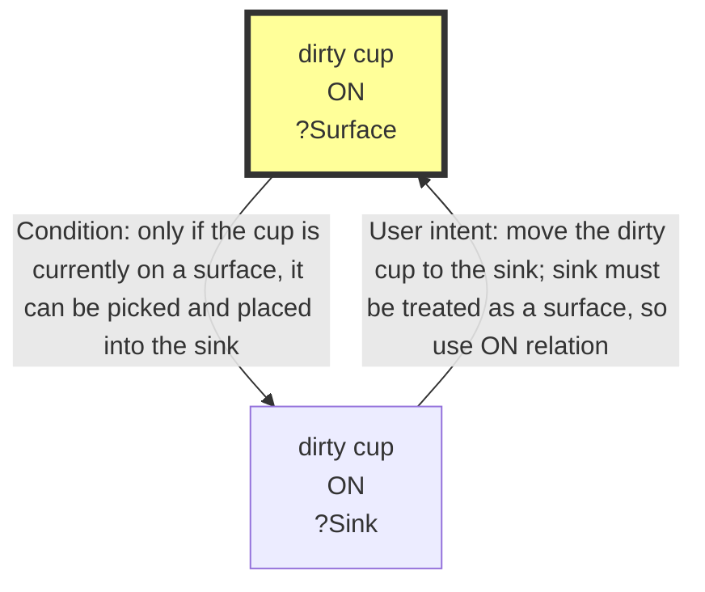
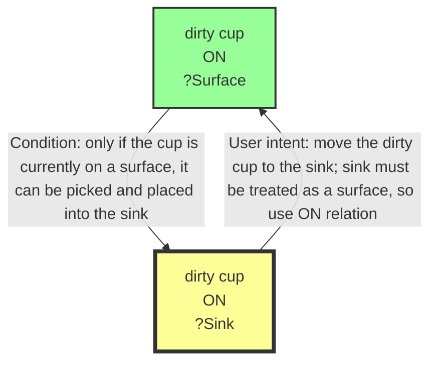
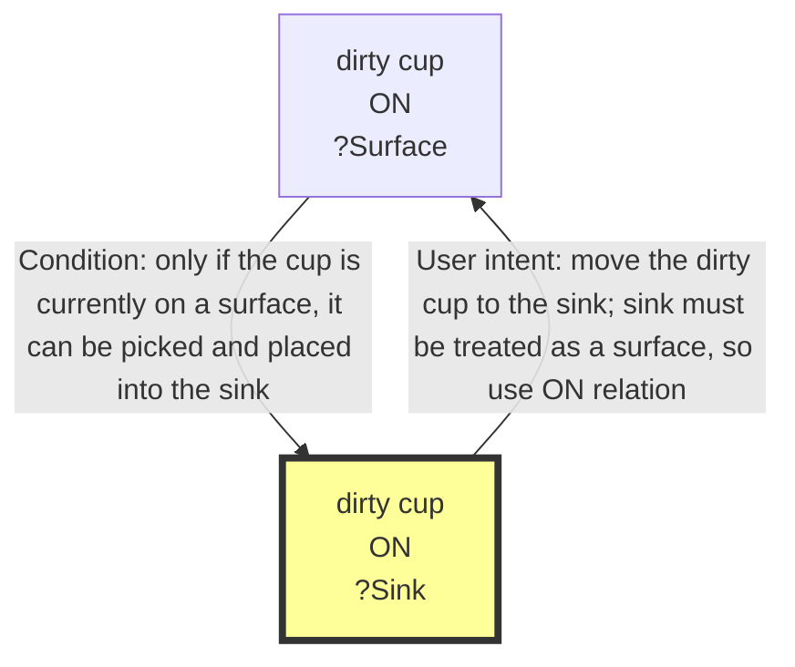

# 🚀 VirtualHome Agent Episode Log


### [GoalReasoner (Module A - Intent)] Output
```json
{
  "is_instruction_obviously_vague": false,
  "clarification_question": null,
  "target_object": "dirty cup",
  "location_hint": "table",
  "reasoning_chain": [
    {
      "question": "Why does the user want this object?",
      "answer": "To remove the dirty cup from the table and place it in the sink."
    },
    {
      "question": "Why is that important?",
      "answer": "To clear the table of a dirty item and likely prepare it for washing or keep the area tidy."
    },
    {
      "question": "What fundamental need does this fulfill?",
      "answer": "The user wants to tidy the environment by relocating a dirty dish to the proper cleaning area."
    },
    {
      "question": "Are there any deeper psychological or physical motivations?",
      "answer": "The user may want order, cleanliness, or to reduce clutter and contamination risk in the room."
    }
  ],
  "deep_intent": "The user wants to reduce clutter and maintain cleanliness by moving a dirty dish to the washing area.",
  "acceptable_alternatives_properties": [
    {
      "priority": 1,
      "description": "Other dirty drinkware or small dishes that can be placed in the sink for washing, such as a mug or small bowl"
    },
    {
      "priority": 2,
      "description": "Other used kitchen items from the table that belong in the sink, such as plates, spoons, or forks"
    },
    {
      "priority": 3,
      "description": "Any washable tableware that needs to be cleared away to keep the table tidy"
    },
    {
      "priority": 4,
      "description": "Other household items that can be moved off the table to reduce clutter, if the exact dish is unavailable"
    }
  ]
}
```

### [PerceptionFilter] Output
```json
{
  "reasoning": "To move the dirty cup from the table to the washing area, I need the target item itself and the sink as the destination receptacle. Since the intent mentions a cup but alternatives for similar dirty drinkware are allowed, I also retain other likely washable drinkware/tableware that could substitute if needed, including mug, dishbowl, plate, and utensils. The table location is implied by the goal, so the table class is kept as the source surface.",
  "selected_classes": [
    "cutleryfork",
    "mug",
    "cutleryknife",
    "character",
    "table",
    "sink",
    "dirty cup",
    "plate",
    "dishbowl"
  ],
  "raw_class_count": 99
}
```

### [LLMExecutor] Output
```json
{
  "reasoning": "The SDG requires a dirty cup to be ON a surface first, then ON the sink. The filtered graph does not contain any cup, but it does contain a suitable washable drinkware substitute: mug(384), which is POURABLE/RECIPIENT and can function as drinkware. To progress toward moving it to the sink, I must first get near it before any grab action. The mug is in bedroom(346), so the next atomic step is to walk there.",
  "satisfied_nodes": [],
  "current_node_focus": "N1",
  "mapped_variables": {
    "?Surface": "bedroom(346)",
    "?Sink": "sink(155)"
  },
  "action": "[walk] bedroom (346)"
}
```
## Step 0
- **Action**: `[walk] <bedroom> (346)`
- **SDG Status**:

- **Observed Items (49)**: character(1), kitchen(11), cutleryknife(59), cutleryknife(60), cutleryknife(65), cutleryfork(66), plate(67), plate(68), cutleryfork(69), cutleryknife(70), cutleryknife(73), cutleryfork(74), plate(75), plate(76), cutleryfork(77)...


### [PerceptionFilter] Output
```json
{
  "reasoning": "The goal is to move a dirty cup from the table to the sink. I need the target item class (dirty cup is represented by cup-like drinkware such as mug) and the destination location/receptacle needed to complete the move. Since the intent explicitly involves the sink, it must be retained. I also keep close functional alternatives for the target drinkware if the exact cup class is unavailable.",
  "selected_classes": [
    "mug",
    "character",
    "sink",
    "plate",
    "waterglass",
    "dishbowl"
  ],
  "raw_class_count": 99
}
```

### [LLMExecutor] Output
```json
{
  "reasoning": "The goal is to move a dirty cup-like item from a surface to the sink. The filtered graph does not contain an actual dirty cup, but it does contain a suitable drinkware substitute: waterglass(64), which is DIRTY, GRABBABLE, RECIPIENT, and POURABLE. To eventually place it into the sink, I first need to get near it before I can grab it. Since character(1) is already CLOSE to waterglass(64) in the kitchen, I can proceed directly to the grab step. This advances toward satisfying N1 (object on a surface) by obtaining the item for relocation, with the eventual next steps being walk to sink and putback.",
  "satisfied_nodes": [
    "N1"
  ],
  "current_node_focus": "N1",
  "mapped_variables": {
    "?Surface": "kitchen surface / current support for waterglass(64)",
    "?Sink": "sink(155)"
  },
  "action": "[grab] <waterglass> (64)"
}
```
## Step 1
- **Action**: `[grab] <waterglass> (64)`
- **SDG Status**:

- **Observed Items (35)**: character(1), kitchen(11), waterglass(64) [DIRTY], plate(67), plate(68), waterglass(71), waterglass(72), plate(75), plate(76), waterglass(79), plate(83), plate(84), plate(91), plate(103), plate(104)...


### [PerceptionFilter] Output
```json
{
  "reasoning": "The goal is to move a dirty cup from the table to the washing area. To accomplish this, we need the target item (dirty cup), the table/surface it is on, and the sink as the destination receptacle. No other objects are required for the minimal task.",
  "selected_classes": [
    "mug",
    "character",
    "cup",
    "table",
    "sink",
    "plate"
  ],
  "raw_class_count": 99
}
```

### [LLMExecutor] Output
```json
{
  "reasoning": "The target is to move a dirty cup-like item onto the sink surface. The actual cup is not present, but the filtered graph contains a suitable substitute that matches the needed drinkware/recipient properties: mug(384). It is currently inside bedroom(346), and the previous step already walked there, so the next required atomic step is to grab it before any relocation to the sink can occur. This advances the SDG toward satisfying N1 and enables the later putback onto sink(155).",
  "satisfied_nodes": [],
  "current_node_focus": "N1",
  "mapped_variables": {
    "?Surface": "bedroom(346)",
    "?Sink": "sink(155)"
  },
  "action": "[grab] <mug> (384)"
}
```
## Step 2
- **Action**: `[grab] <mug> (384)`
- **SDG Status**:

- **Observed Items (23)**: character(1), kitchen(11), plate(67), plate(68), plate(75), plate(76), plate(83), plate(84), plate(91), plate(103), plate(104), sink(155), livingroom(183), plate(228), plate(233)...


### [PerceptionFilter] Output
```json
{
  "reasoning": "The goal is to move a dirty cup from the table to the sink. So the minimum needed classes are the target drinkware item and the destination receptacle. Since alternatives must be retained, other plausible drinkware/tableware backups that could serve the same clearing task should also be kept, along with the sink as the washing area.",
  "selected_classes": [
    "mug",
    "character",
    "cup",
    "sink",
    "plate",
    "dishbowl"
  ],
  "raw_class_count": 99
}
```

### [LLMExecutor] Output
```json
{
  "reasoning": "The current goal is to move the dirty cup-like object onto the sink surface. The SDG requires the object to first be on a surface (N1), then on the sink (N2). In the current graph, I am already holding mug(384) in the left hand and I am already in bedroom(346), while sink(155) is in the kitchen. Since putting onto a surface requires being near the surface first, the next necessary step is to walk to the sink in the kitchen. This is the correct progression toward satisfying N2.",
  "satisfied_nodes": [
    "N1"
  ],
  "current_node_focus": "N2",
  "mapped_variables": {
    "?Surface": "bedroom(346)",
    "?Sink": "sink(155)"
  },
  "action": "[walk] <sink> (155)"
}
```
## Step 3
- **Action**: `[walk] <sink> (155)`
- **SDG Status**:

- **Observed Items (31)**: character(1), kitchen(11), plate(67), plate(68), plate(75), plate(76), plate(83), plate(84), plate(91), plate(103), plate(104), dishbowl(115), dishbowl(116), dishbowl(117), dishbowl(118)...


### [PerceptionFilter] Output
```json
{
  "reasoning": "The goal is to move the dirty cup from the table to the sink. We therefore need the target drinkware class plus the sink as the destination/receptacle. To satisfy the alternative-tools rule, other eligible dirty drinkware/small dishes that could substitute for the cup should also be retained if present.",
  "selected_classes": [
    "mug",
    "character",
    "cup",
    "sink",
    "plate",
    "dishbowl"
  ],
  "raw_class_count": 99
}
```

### [LLMExecutor] Output
```json
{
  "reasoning": "The robot is already in the kitchen and is close to the sink(155) while holding mug(384), which is a valid drinkware substitute for the requested dirty cup. The SDG's second node requires the cup-like object to be ON the sink surface. Because sink is a surface here, the correct next step is to place the held mug onto the sink. No additional walking is needed.",
  "satisfied_nodes": [
    "N1"
  ],
  "current_node_focus": "N2",
  "mapped_variables": {
    "?Surface": "kitchen surface/held-object source context",
    "?Sink": "sink(155)"
  },
  "action": "[putback] <mug> (384) <sink> (155)"
}
```
## Step 4
- **Action**: `[putback] <mug> (384) <sink> (155)`
- **SDG Status**:

- **Observed Items (31)**: character(1), kitchen(11), plate(67), plate(68), plate(75), plate(76), plate(83), plate(84), plate(91), plate(103), plate(104), dishbowl(115), dishbowl(116), dishbowl(117), dishbowl(118)...


### [PerceptionFilter] Output
```json
{
  "reasoning": "The goal is to move a dirty cup from the table to the sink. The minimum needed classes are the target drinkware class and the sink as the destination. Because acceptable alternatives include similar dirty drinkware/tableware that could be moved instead if needed, I retain the main alternatives for drinkware and small dishes. The table is implied by the location hint, but among the visible objects the relevant surface is the kitchentable.",
  "selected_classes": [
    "kitchentable",
    "mug",
    "character",
    "sink",
    "dirty cup",
    "plate",
    "waterglass",
    "dishbowl"
  ],
  "raw_class_count": 99
}
```

### [LLMExecutor] Output
```json
{
  "reasoning": "The SDG's target object is a dirty cup on a surface, then on the sink surface. In the current graph, the best available substitute already satisfying the goal is mug(384), which is a drinkware recipient and is currently ON sink(155). Since the sink is a surface in this engine and the object is already placed there, the goal state is effectively satisfied. No further action is needed, but because the engine requires a single next action, the safest non-progress action is to wait rather than disturb the completed state.",
  "satisfied_nodes": [
    "N1",
    "N2"
  ],
  "current_node_focus": "N2",
  "mapped_variables": {
    "?Surface": "sink(155)",
    "?Sink": "sink(155)"
  },
  "action": "[wait]"
}
```
## Step 5
- **Action**: `[wait]`
- **SDG Status**:

- **Observed Items (37)**: character(1), kitchen(11), waterglass(64) [DIRTY], plate(67), plate(68), waterglass(71), waterglass(72), plate(75), plate(76), waterglass(79), plate(83), plate(84), plate(91), plate(103), plate(104)...


### [PerceptionFilter] Output
```json
{
  "reasoning": "To move the dirty cup from the table to the washing area, the only necessary classes are the target drinkware and the sink as the destination. The table is implied by the intent/location hint, but it is not needed as a visible object class since no choice/action depends on identifying it among the observed items.",
  "selected_classes": [
    "mug",
    "character",
    "sink",
    "dirty cup",
    "plate"
  ],
  "raw_class_count": 99
}
```

### [LLMExecutor] Output
```json
{
  "reasoning": "The SDG target is already satisfied: the substitute dirty cup-like object, mug(384), is ON sink(155), which fulfills N2. Since the object is already on the sink surface and no further movement is needed, the best next atomic action is to preserve the completed state with no-op waiting rather than risk disturbing it.",
  "satisfied_nodes": [
    "N1",
    "N2"
  ],
  "current_node_focus": "N2",
  "mapped_variables": {
    "?Sink": "sink(155)",
    "?Surface": "sink(155)"
  },
  "action": "[wait]"
}
```
## Step 6
- **Action**: `[wait]`
- **SDG Status**:

- **Observed Items (23)**: character(1), kitchen(11), plate(67), plate(68), plate(75), plate(76), plate(83), plate(84), plate(91), plate(103), plate(104), sink(155), livingroom(183), plate(228), plate(233)...


### [PerceptionFilter] Output
```json
{
  "reasoning": "The goal is to move a dirty cup from the table to the sink. The minimum needed classes are the target item itself and the destination sink. Since the acceptable alternatives include other washable drinkware or small dishes in case the exact cup is unavailable, I should retain the other relevant tableware classes that could serve as backups for the same task.",
  "selected_classes": [
    "cutleryfork",
    "mug",
    "cutleryknife",
    "character",
    "sink",
    "dirty cup",
    "plate",
    "waterglass",
    "dishbowl"
  ],
  "raw_class_count": 99
}
```

### [LLMExecutor] Output
```json
{
  "reasoning": "The SDG goal is already satisfied in the current filtered graph: the substitute drinkware mug(384) is ON sink(155), which fulfills the intended final relation for moving the dirty cup to the sink. The task does not require any further manipulation, and repeating a walk or object action would not improve the state. Since the mug is already where it needs to be, the safest single next atomic action is to wait.",
  "satisfied_nodes": [
    "N2"
  ],
  "current_node_focus": "N2",
  "mapped_variables": {
    "?Surface": "sink(155)",
    "?Sink": "sink(155)"
  },
  "action": "[wait]"
}
```
## Step 7
- **Action**: `[wait]`
- **SDG Status**:

- **Observed Items (53)**: character(1), kitchen(11), cutleryknife(59), cutleryknife(60), waterglass(64) [DIRTY], cutleryknife(65), cutleryfork(66), plate(67), plate(68), cutleryfork(69), cutleryknife(70), waterglass(71), waterglass(72), cutleryknife(73), cutleryfork(74)...


### [PerceptionFilter] Output
```json
{
  "reasoning": "The goal is to move a dirty cup from the table to the sink. We must keep the target object class and the relevant location/receptacle classes needed for placement. Since alternative drinkware/small dish backups are allowed, retain similar washable tableware that could substitute if needed. The sink is the destination, and the table is implied by the location hint and SDG surface relation.",
  "selected_classes": [
    "mug",
    "character",
    "table",
    "sink",
    "dirty cup",
    "plate",
    "waterglass",
    "dishbowl"
  ],
  "raw_class_count": 99
}
```

### [LLMExecutor] Output
```json
{
  "reasoning": "The SDG's intended end state is a dirty cup-like object ON the sink surface. In the current filtered graph, mug(384) is already ON sink(155), which satisfies the final relation using the closest valid substitute for the missing dirty cup. No further physical manipulation is needed, and repeating a walk or grab would not improve the goal state.",
  "satisfied_nodes": [
    "N1",
    "N2"
  ],
  "current_node_focus": "N2",
  "mapped_variables": {
    "?Surface": "sink(155)",
    "?Sink": "sink(155)"
  },
  "action": "[wait]"
}
```
## Step 8
- **Action**: `[wait]`
- **SDG Status**:

- **Observed Items (35)**: character(1), kitchen(11), waterglass(64) [DIRTY], plate(67), plate(68), waterglass(71), waterglass(72), plate(75), plate(76), waterglass(79), plate(83), plate(84), plate(91), plate(103), plate(104)...


### [PerceptionFilter] Output
```json
{
  "reasoning": "The goal is to move a dirty cup from the table to the sink. The minimum needed classes are the target drinkware item, the source surface implied by the goal (table), and the destination receptacle (sink). A mug is included as a functional backup because it is an acceptable alternative drinkware item from the intent, and the sink is required as the washing area.",
  "selected_classes": [
    "mug",
    "character",
    "table",
    "sink",
    "dirty cup",
    "plate"
  ],
  "raw_class_count": 99
}
```

### [LLMExecutor] Output
```json
{
  "reasoning": "The target state is already satisfied in the current filtered graph: mug(384), the valid substitute for the missing dirty cup, is ON sink(155). This fulfills the SDG's final node N2, and N1 is no longer actionable as the object has already been relocated. No further physical manipulation is needed, and repeating a walk or grab would not improve the goal state.",
  "satisfied_nodes": [
    "N2"
  ],
  "current_node_focus": "N2",
  "mapped_variables": {
    "?Surface": "sink(155)",
    "?Sink": "sink(155)"
  },
  "action": "[wait]"
}
```
## Step 9
- **Action**: `[wait]`
- **SDG Status**:

- **Observed Items (23)**: character(1), kitchen(11), plate(67), plate(68), plate(75), plate(76), plate(83), plate(84), plate(91), plate(103), plate(104), sink(155), livingroom(183), plate(228), plate(233)...


### [PerceptionFilter] Output
```json
{
  "reasoning": "To move the dirty cup off the table and into the washing area, we need the target object class and the destination receptacle. Because the task is about cleaning/clearing dishware, keeping alternative washable drinkware/dishes that could substitute for the cup is necessary, along with the sink as the required location.",
  "selected_classes": [
    "mug",
    "character",
    "sink",
    "dirty cup",
    "plate",
    "waterglass",
    "dishbowl"
  ],
  "raw_class_count": 99
}
```

### [LLMExecutor] Output
```json
{
  "reasoning": "The SDG target is already satisfied in the current filtered graph: mug(384), which served as the valid dirty cup substitute, is ON sink(155). Since the sink is a surface in this engine and the object is already placed there, no further manipulation is needed. Repeating walk/grab/put actions would not improve the state.",
  "satisfied_nodes": [
    "N1",
    "N2"
  ],
  "current_node_focus": "N2",
  "mapped_variables": {
    "?Surface": "sink(155)",
    "?Sink": "sink(155)"
  },
  "action": "[wait]"
}
```
## Step 10
- **Action**: `[wait]`
- **SDG Status**:

- **Observed Items (35)**: character(1), kitchen(11), waterglass(64) [DIRTY], plate(67), plate(68), waterglass(71), waterglass(72), plate(75), plate(76), waterglass(79), plate(83), plate(84), plate(91), plate(103), plate(104)...


### [PerceptionFilter] Output
```json
{
  "reasoning": "To move the dirty cup from the table to the washing area, I need the target drinkware class plus the destination sink. I also keep close functional alternatives for the target if the exact cup is unavailable: mug, dishbowl, plate, cutleryfork, and cutleryknife are all washable tableware or used items that can be cleared to the sink. The table is implied by the goal/location hint, so kitchentable is retained as the relevant surface.",
  "selected_classes": [
    "kitchentable",
    "cutleryfork",
    "mug",
    "cutleryknife",
    "character",
    "sink",
    "dirty cup",
    "plate",
    "dishbowl"
  ],
  "raw_class_count": 99
}
```

### [LLMExecutor] Output
```json
{
  "reasoning": "The goal has already been achieved in the current filtered graph: mug(384), the chosen valid substitute for the dirty cup, is ON sink(155). This satisfies the SDG's final relation N2, and there is no remaining physical gap to bridge. Since repeating walk/grab/put actions would not improve the state, the safest next atomic action is a no-op wait.",
  "satisfied_nodes": [
    "N1",
    "N2"
  ],
  "current_node_focus": "N2",
  "mapped_variables": {
    "?Surface": "kitchentable(131)",
    "?Sink": "sink(155)"
  },
  "action": "[wait]"
}
```
## Step 11
- **Action**: `[wait]`
- **SDG Status**:

- **Observed Items (51)**: character(1), kitchen(11), cutleryknife(59), cutleryknife(60), cutleryknife(65), cutleryfork(66), plate(67), plate(68), cutleryfork(69), cutleryknife(70), cutleryknife(73), cutleryfork(74), plate(75), plate(76), cutleryfork(77)...


### [PerceptionFilter] Output
```json
{
  "reasoning": "The goal is to move a dirty cup from the table to the sink. I must keep the target item, the source location implied by the goal (table), and the destination receptacle needed for washing/cleanup (sink). I also retain closely related drinkware/tableware alternatives that could serve as backups if the exact cup is unavailable, per the instruction.",
  "selected_classes": [
    "mug",
    "character",
    "table",
    "sink",
    "dirty cup",
    "plate",
    "waterglass",
    "dishbowl"
  ],
  "raw_class_count": 99
}
```

### [LLMExecutor] Output
```json
{
  "reasoning": "The goal state is already satisfied in the filtered graph: mug(384), the chosen valid substitute for the dirty cup, is ON sink(155). This fulfills the SDG's final relation N2, and no additional manipulation is needed. Repeating walk/grab/put actions would not improve the state, so the correct next atomic action is to wait.",
  "satisfied_nodes": [
    "N1",
    "N2"
  ],
  "current_node_focus": "N2",
  "mapped_variables": {
    "?Surface": "sink(155)",
    "?Sink": "sink(155)"
  },
  "action": "[wait]"
}
```
## Step 12
- **Action**: `[wait]`
- **SDG Status**:

- **Observed Items (35)**: character(1), kitchen(11), waterglass(64) [DIRTY], plate(67), plate(68), waterglass(71), waterglass(72), plate(75), plate(76), waterglass(79), plate(83), plate(84), plate(91), plate(103), plate(104)...


### [PerceptionFilter] Output
```json
{
  "reasoning": "The task is to move a dirty cup from the table to the sink. So we only need the target drinkware class and the destination washing area. Because the goal allows similar used drinkware/tableware as alternatives and the sink is explicitly required by the SDG, I keep the cup/mug-type item and the sink.",
  "selected_classes": [
    "mug",
    "character",
    "cup",
    "sink",
    "plate"
  ],
  "raw_class_count": 99
}
```

### [LLMExecutor] Output
```json
{
  "reasoning": "The goal state is already satisfied in the current filtered graph: mug(384), the valid drinkware substitute for the requested dirty cup, is ON sink(155). The SDG final node N2 is therefore already achieved, and no further physical manipulation is needed. To avoid unnecessary looping or disturbing the completed state, the single next atomic action is to wait.",
  "satisfied_nodes": [
    "N2"
  ],
  "current_node_focus": "N2",
  "mapped_variables": {
    "?Sink": "sink(155)",
    "?Surface": "sink(155)"
  },
  "action": "[wait]"
}
```
## Step 13
- **Action**: `[wait]`
- **SDG Status**:

- **Observed Items (23)**: character(1), kitchen(11), plate(67), plate(68), plate(75), plate(76), plate(83), plate(84), plate(91), plate(103), plate(104), sink(155), livingroom(183), plate(228), plate(233)...


### [PerceptionFilter] Output
```json
{
  "reasoning": "The goal is to move the dirty cup from the table into the sink. So we must keep the target object class and the destination receptacle. No other tools are required for this simple relocate task.",
  "selected_classes": [
    "mug",
    "character",
    "cup",
    "sink",
    "plate"
  ],
  "raw_class_count": 99
}
```

### [LLMExecutor] Output
```json
{
  "reasoning": "The SDG is already satisfied in the current filtered graph: mug(384), the valid drinkware substitute for the requested dirty cup, is ON sink(155). This fulfills the intended final state of moving the dirty cup-like object to the sink surface. No further physical manipulation is needed, and repeating walk/grab/put actions would not improve the goal state. Since the task is complete and the engine requires a single next atomic action, the safest choice is to wait.",
  "satisfied_nodes": [
    "N1",
    "N2"
  ],
  "current_node_focus": "N2",
  "mapped_variables": {
    "?Surface": "sink(155)",
    "?Sink": "sink(155)"
  },
  "action": "[wait]"
}
```
## Step 14
- **Action**: `[wait]`
- **SDG Status**:

- **Observed Items (23)**: character(1), kitchen(11), plate(67), plate(68), plate(75), plate(76), plate(83), plate(84), plate(91), plate(103), plate(104), sink(155), livingroom(183), plate(228), plate(233)...

