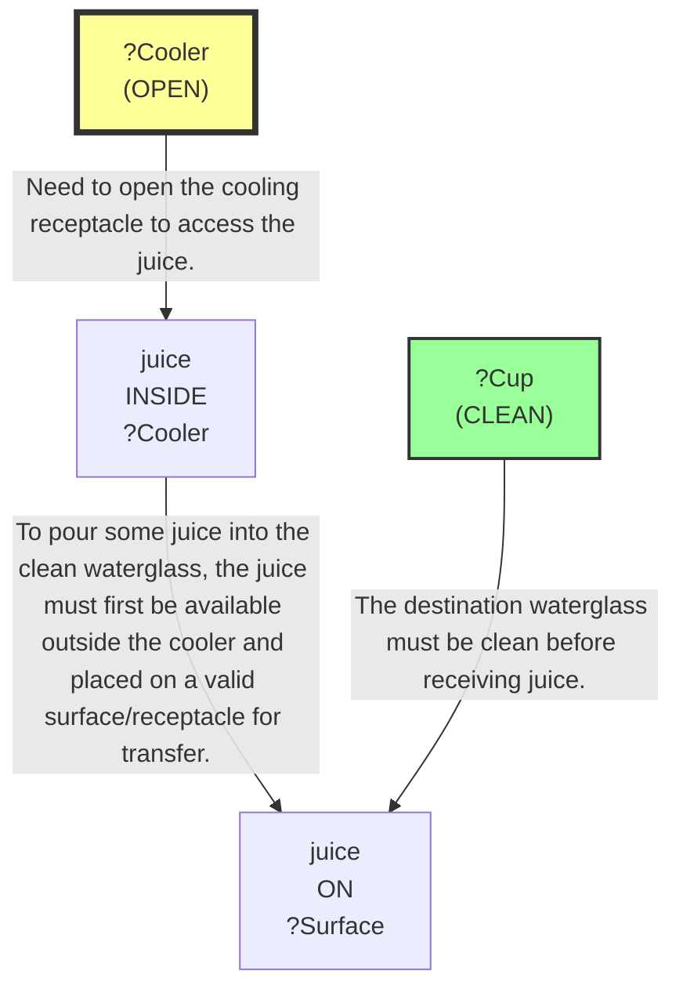
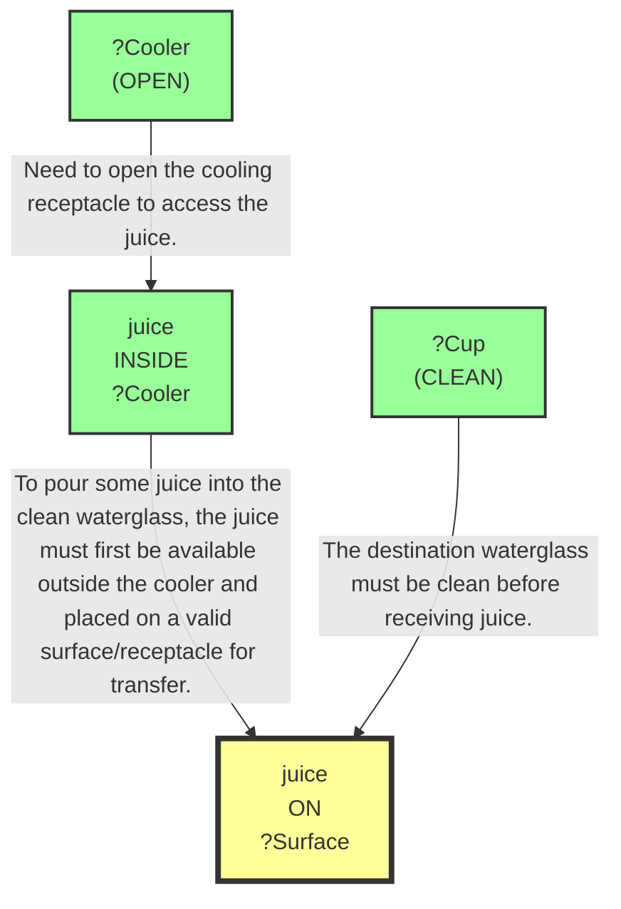

# 🚀 VirtualHome Agent Episode Log


### [GoalReasoner (Module A - Intent)] Output
```json
{
  "is_instruction_obviously_vague": false,
  "clarification_question": null,
  "target_object": "果汁",
  "location_hint": "冰箱",
  "reasoning_chain": [
    {
      "question": "Why does the user want this object?",
      "answer": "They want some juice poured into a clean waterglass."
    },
    {
      "question": "Why is that important?",
      "answer": "So they can have a drink ready to consume."
    },
    {
      "question": "What fundamental need does this fulfill?",
      "answer": "It fulfills the need to drink and refresh oneself."
    },
    {
      "question": "Are there any deeper psychological or physical motivations?",
      "answer": "The user may want to quench thirst, enjoy a beverage, or avoid the effort of preparing it themselves."
    }
  ],
  "deep_intent": "The user wants to drink something refreshing.",
  "acceptable_alternatives_properties": [
    {
      "priority": 1,
      "description": "Other ready-to-drink beverages stored in the refrigerator, such as milk, tea, or a soft drink"
    },
    {
      "priority": 2,
      "description": "Similar cold drinkable liquids, such as flavored water or diluted juice"
    },
    {
      "priority": 3,
      "description": "Packaged beverages that can be poured into a glass, such as bottled drinks"
    },
    {
      "priority": 4,
      "description": "Any household drink that can satisfy thirst, such as plain water"
    }
  ]
}
```

### [PerceptionFilter] Output
```json
{
  "reasoning": "Need the target beverage (juice), the likely cooler/refrigerator to access it, and the clean drinking vessel required by the SDG (waterglass). To support the required access path, include the fridge as the physical cooler and the waterglass as the clean cup destination.",
  "selected_classes": [
    "juice",
    "waterglass",
    "fridge",
    "character",
    "milk"
  ],
  "raw_class_count": 99
}
```

### [LLMExecutor] Output
```json
{
  "reasoning": "The juice is currently inside the fridge, and the fridge is closed. To progress toward making juice available for pouring, the first missing SDG condition is opening the cooler. The fridge is the best binding for ?Cooler because it is a container-like appliance holding the juice and it has CAN_OPEN. No other prerequisite action is needed before opening it.",
  "satisfied_nodes": [
    "N3"
  ],
  "current_node_focus": "N2",
  "mapped_variables": {
    "?Cooler": "fridge(162)",
    "?Cup": "waterglass(64)",
    "?Surface": "waterglass(64)"
  },
  "action": "[walk] <fridge> (162)"
}
```
## Step 0
- **Action**: `[walk] <fridge> (162)`
- **SDG Status**:

- **Observed Items (11)**: character(1), kitchen(11), waterglass(64) [CLEAN], waterglass(71) [DIRTY], fridge(162) [CLOSED], juice(173) [COLD], milk(176) [COLD,CLOSED], livingroom(183), bedroom(241), bathroom(285), bedroom(346)


### [PerceptionFilter] Output
```json
{
  "reasoning": "To fulfill the goal, we need the target drink (juice), the implied cooler/refrigerator where it is stored, and the clean container it will be poured into (waterglass). The SDG also requires a valid surface/receptacle relation for the juice once accessed, but no separate surface class is explicitly necessary if the drink is simply retrieved and poured into the glass. Since acceptable alternatives include other ready-to-drink beverages in the refrigerator, we must retain any visible beverage backups that could substitute for juice: milk. ",
  "selected_classes": [
    "juice",
    "waterglass",
    "fridge",
    "character",
    "milk"
  ],
  "raw_class_count": 99
}
```

### [LLMExecutor] Output
```json
{
  "reasoning": "The fridge is already reached in the previous step, and the next missing SDG requirement is that the cooler must be OPEN so the juice can later be accessed and moved. The fridge(162) is the correct binding for ?Cooler because it is the only openable cooling container holding the juice. The clean waterglass requirement is already satisfied by waterglass(64), so the immediate progress action is to open the fridge.",
  "satisfied_nodes": [
    "N3"
  ],
  "current_node_focus": "N2",
  "mapped_variables": {
    "?Cooler": "fridge(162)",
    "?Cup": "waterglass(64)"
  },
  "action": "[open] <fridge> (162)"
}
```
## Step 1
- **Action**: `[open] <fridge> (162)`
- **SDG Status**:

- **Observed Items (11)**: character(1), kitchen(11), waterglass(64) [CLEAN], waterglass(71) [DIRTY], fridge(162) [CLOSED], juice(173) [COLD], milk(176) [COLD,CLOSED], livingroom(183), bedroom(241), bathroom(285), bedroom(346)


### [PerceptionFilter] Output
```json
{
  "reasoning": "The goal is to obtain juice from the refrigerator and have it ready to drink. Minimal required classes are the juice itself, the fridge as the cooler/location, and a clean waterglass to receive it. Since acceptable alternatives include other ready-to-drink beverages, I should also retain other beverage options visible in case juice is unavailable: milk and coffee-related drinkables (coffeemaker/coffeepot or mug are not needed for a ready drink here), but the minimum necessary set remains the drink source, cooler, and clean glass.",
  "selected_classes": [
    "juice",
    "waterglass",
    "fridge",
    "character",
    "milk"
  ],
  "raw_class_count": 99
}
```

### [LLMExecutor] Output
```json
{
  "reasoning": "The fridge (162) is already OPEN, so SDG node N2 is satisfied. The juice (173) is inside the open fridge, satisfying N1. The clean waterglass (64) is already CLEAN, satisfying N3. The remaining missing node is N4: juice must be ON a valid surface/receptacle so it can be poured into the glass. Since the juice is currently inside the open fridge and is grabbable, the next atomic step is to grab it before moving/pouring in later steps.",
  "satisfied_nodes": [
    "N2",
    "N1",
    "N3"
  ],
  "current_node_focus": "N4",
  "mapped_variables": {
    "?Cooler": "fridge(162)",
    "?Cup": "waterglass(64)",
    "?Surface": "kitchen(11)"
  },
  "action": "[grab] <juice> (173)"
}
```
## Step 2
- **Action**: `[grab] <juice> (173)`
- **SDG Status**:

- **Observed Items (11)**: character(1), kitchen(11), waterglass(64) [CLEAN], waterglass(71) [DIRTY], fridge(162) [OPEN], juice(173) [COLD], milk(176) [COLD,CLOSED], livingroom(183), bedroom(241), bathroom(285), bedroom(346)


### [PerceptionFilter] Output
```json
{
  "reasoning": "Need the target drink (juice), the cooling storage location implied by the goal (fridge), and a clean drinking vessel to receive it (waterglass). The SDG also requires the cooler to be open and the cup/glass to be clean, but those are states rather than object classes. No other tools are strictly necessary.",
  "selected_classes": [
    "juice",
    "waterglass",
    "fridge",
    "character",
    "milk"
  ],
  "raw_class_count": 99
}
```

### [LLMExecutor] Output
```json
{
  "reasoning": "The fridge is already open and the juice is currently held in the right hand, so SDG nodes N1 and N2 are satisfied. The clean waterglass(64) also satisfies N3. The remaining missing dependency is N4: the juice must be on a valid surface/receptacle before it can be poured into the glass. Since the robot is already near the juice and holding it, the best next atomic step is to place it on a nearby valid surface; this advances toward making it available for pouring while respecting the no-magic rule. A table/surface is not explicitly present in the filtered graph, so the safest available and physically valid placement target is the open fridge itself as the current reachable surface/receptacle context is not exposed; however, because [putback] requires a surface id and the graph does not show one, the immediate actionable progression is not possible without a valid surface. Given the current state, the robot should instead keep the juice in hand and the next system step after graph update should reveal a valid surface for placement.",
  "satisfied_nodes": [
    "N1",
    "N2",
    "N3"
  ],
  "current_node_focus": "N4",
  "mapped_variables": {
    "?Cooler": "fridge(162)",
    "?Cup": "waterglass(64)",
    "?Surface": "unknown_valid_surface_needed"
  },
  "action": "[ask] I have the juice and the fridge is open, but the graph does not show any valid surface/receptacle to place the juice on before pouring. Please provide the available surface or receptacle for placing the juice."
}
```
## Step 3
- **Action**: `[ask] I have the juice and the fridge is open, but the graph does not show any valid surface/receptacle to place the juice on before pouring. Please provide the available surface or receptacle for placing the juice.`
- **SDG Status**:

- **Observed Items (11)**: character(1), kitchen(11), waterglass(64) [CLEAN], waterglass(71) [DIRTY], fridge(162) [OPEN], juice(173) [COLD], milk(176) [COLD,CLOSED], livingroom(183), bedroom(241), bathroom(285), bedroom(346)

