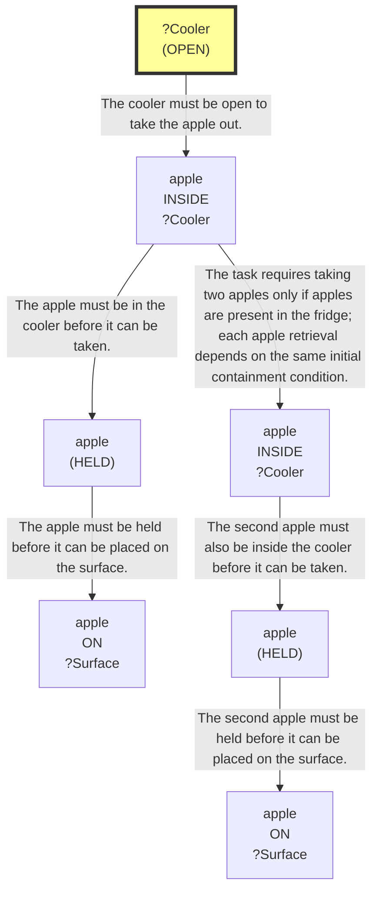
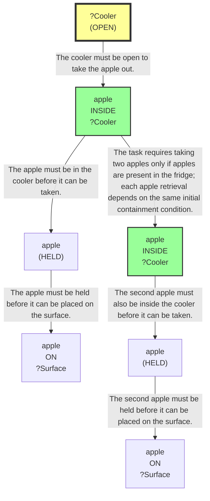
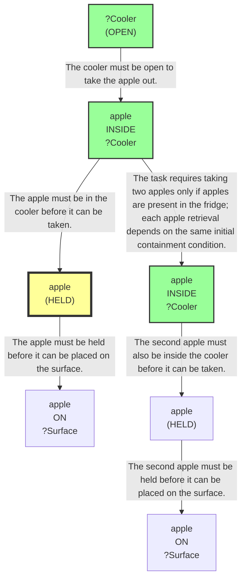
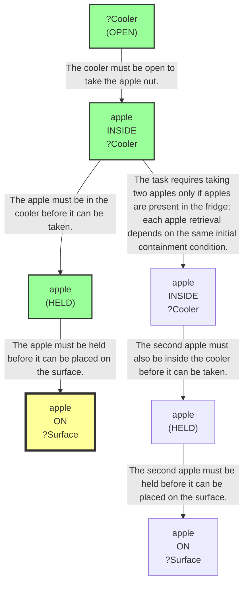

# 🚀 VirtualHome Agent Episode Log


### [GoalReasoner (Module A - Intent)] Output
```json
{
  "is_instruction_obviously_vague": false,
  "clarification_question": null,
  "target_object": "apple",
  "location_hint": "fridge",
  "reasoning_chain": [
    {
      "question": "Why does the user want this object?",
      "answer": "To have two apples moved from the fridge to the table."
    },
    {
      "question": "Why is that important?",
      "answer": "So the apples are placed in a convenient, accessible spot on the table."
    },
    {
      "question": "What fundamental need does this fulfill?",
      "answer": "It satisfies the need to retrieve and reposition food items for later use or consumption."
    },
    {
      "question": "Are there any deeper psychological or physical motivations?",
      "answer": "Likely to make the food easy to see, reach, or share, supporting convenience and readiness to eat."
    }
  ],
  "deep_intent": "The user wants food items made accessible by moving them from storage to a usable surface.",
  "acceptable_alternatives_properties": [
    {
      "priority": 1,
      "description": "Other similar fruit items available in the fridge that can be moved to the table, such as pears or oranges."
    },
    {
      "priority": 2,
      "description": "Other fresh produce items that are commonly stored in the fridge and can be placed on the table for easy access."
    },
    {
      "priority": 3,
      "description": "Ready-to-eat snack foods from the fridge that can be set on the table for convenient use."
    },
    {
      "priority": 4,
      "description": "Any other food items that can be safely retrieved from storage and placed on the table for later consumption."
    }
  ]
}
```

### [PerceptionFilter] Output
```json
{
  "reasoning": "The goal requires retrieving apples from storage and placing them on a table/surface. So the needed classes are the target food item and the storage/receptacle and surface involved. The SDG specifically requires a cooler/fridge that is open, and a surface to place the apples on. Since the visible list includes a fridge and a table, those are the relevant physical classes to retain.",
  "selected_classes": [
    "character",
    "table",
    "apple",
    "fridge"
  ],
  "raw_class_count": 112
}
```

### [LLMExecutor] Output
```json
{
  "reasoning": "The required cooler is the fridge, and the active global rule temporarily forbids approaching or opening it until step 6. Since opening the fridge is the next required precondition for retrieving the apples, I must wait for the cleaning restriction to expire before proceeding.",
  "satisfied_nodes": [],
  "current_node_focus": "N2",
  "mapped_variables": {
    "?Cooler": "fridge(305)",
    "?Surface": "table"
  },
  "action": "[wait]"
}
```
## Step 0
- **Action**: `[wait]`
- **SDG Status**:

- **Observed Items (8)**: character(1), bathroom(11), bedroom(73), kitchen(205), fridge(305) [CLOSED], livingroom(335), apple(437) [COLD], apple(438) [COLD]


### [PerceptionFilter] Output
```json
{
  "reasoning": "The goal is to retrieve apples from storage and place them on a table-like surface. The SDG requires an apple and an open cooler, which in the observed classes corresponds to a fridge. Since the task explicitly involves two apples, keep the apple class. The destination surface is implied by the SDG as ?Surface and by the intent as a table, so keep table-like surfaces needed for placement, with kitchentable as the relevant surface class present.",
  "selected_classes": [
    "kitchentable",
    "character",
    "apple",
    "fridge"
  ],
  "raw_class_count": 112
}
```

### [LLMExecutor] Output
```json
{
  "reasoning": "The SDG still requires opening the fridge before either apple can be taken out. However, the active global rule explicitly forbids approaching or opening the fridge until step 6, and the last action was already a wait at step 0. Since the restriction is temporary and still blocks the next required precondition, the correct next atomic action is to wait again.",
  "satisfied_nodes": [],
  "current_node_focus": "N2",
  "mapped_variables": {
    "?Cooler": "fridge(305)",
    "?Surface": "kitchentable(231)"
  },
  "action": "[wait]"
}
```
## Step 1
- **Action**: `[wait]`
- **SDG Status**:

- **Observed Items (9)**: character(1), bathroom(11), bedroom(73), kitchen(205), kitchentable(231), fridge(305) [CLOSED], livingroom(335), apple(437) [COLD], apple(438) [COLD]


### [PerceptionFilter] Output
```json
{
  "reasoning": "The goal is to retrieve apples from a fridge and place them on a table. The SDG requires the apple target, the cooler/fridge as the storage location, and a surface for placement (table). Because the intent allows similar food items as acceptable alternatives, related candidate food classes in the fridge should be retained only if they could substitute for apples; however, the task specifically names apples, so the minimum necessary set is the target food plus the storage and destination locations, and the fridge is the physical cooler referenced by the SDG.",
  "selected_classes": [
    "kitchentable",
    "character",
    "apple",
    "fridge"
  ],
  "raw_class_count": 112
}
```

### [LLMExecutor] Output
```json
{
  "reasoning": "The required fridge interaction is still blocked by an active global rule: do not approach or open the fridge until step 6. The previous actions were waits, and the restriction has not yet expired, so the only valid progress action is to wait one more step. The apple retrieval SDG cannot advance until the fridge becomes accessible.",
  "satisfied_nodes": [],
  "current_node_focus": "N2",
  "mapped_variables": {
    "?Cooler": "fridge(305)",
    "?Surface": "kitchentable(231)"
  },
  "action": "[wait]"
}
```
## Step 2
- **Action**: `[wait]`
- **SDG Status**:

- **Observed Items (9)**: character(1), bathroom(11), bedroom(73), kitchen(205), kitchentable(231), fridge(305) [CLOSED], livingroom(335), apple(437) [COLD], apple(438) [COLD]


### [PerceptionFilter] Output
```json
{
  "reasoning": "The task is to retrieve apples from storage and place them on a table. The SDG requires the target object apple, the cooler/refrigerator that contains it, and a surface for placement. Since the goal mentions a table, keep the table as the destination surface. The cooler capability is matched by fridge, and the target object class is apple.",
  "selected_classes": [
    "character",
    "table",
    "apple",
    "fridge"
  ],
  "raw_class_count": 112
}
```

### [LLMExecutor] Output
```json
{
  "reasoning": "The fridge is still under an active temporary cleaning restriction, so I cannot approach or open it yet. The SDG requires opening the fridge before taking the apples, and that precondition is currently blocked. The correct progress action is to wait until the restriction expires.",
  "satisfied_nodes": [],
  "current_node_focus": "N2",
  "mapped_variables": {
    "?Cooler": "fridge(305)",
    "?Surface": "table"
  },
  "action": "[wait]"
}
```
## Step 3
- **Action**: `[wait]`
- **SDG Status**:

- **Observed Items (8)**: character(1), bathroom(11), bedroom(73), kitchen(205), fridge(305) [CLOSED], livingroom(335), apple(437) [COLD], apple(438) [COLD]


### [PerceptionFilter] Output
```json
{
  "reasoning": "The goal is to retrieve apples from the fridge and place them on a table. The SDG requires the target object class (apple), the storage/cooler (fridge), and a surface to place them on (table). Since the task explicitly mentions moving two apples, the apple class is needed, and the table is the destination surface implied by the intent.",
  "selected_classes": [
    "character",
    "table",
    "apple",
    "fridge"
  ],
  "raw_class_count": 112
}
```

### [LLMExecutor] Output
```json
{
  "reasoning": "The fridge is still under an active temporary cleaning restriction that forbids approaching or opening it until step 6. The SDG requires the fridge to be open before either apple can be taken, so no physical progress is possible yet. The correct atomic action is to wait one step until the restriction expires.",
  "satisfied_nodes": [
    "N1",
    "N5"
  ],
  "current_node_focus": "N2",
  "mapped_variables": {
    "?Cooler": "fridge(305)",
    "?Surface": "table"
  },
  "action": "[wait]"
}
```
## Step 4
- **Action**: `[wait]`
- **SDG Status**:

- **Observed Items (8)**: character(1), bathroom(11), bedroom(73), kitchen(205), fridge(305) [CLOSED], livingroom(335), apple(437) [COLD], apple(438) [COLD]


### [PerceptionFilter] Output
```json
{
  "reasoning": "The goal requires retrieving apples from the fridge and placing them on a table. So we must keep the target item class (apple), the storage appliance implied by the SDG and location hint (fridge as the cooler), and the destination surface (table). The SDG also requires an open cooler and holding the apples, but those are states/actions rather than visible object classes.",
  "selected_classes": [
    "character",
    "fridge",
    "kitchentable",
    "table",
    "apple"
  ],
  "raw_class_count": 112
}
```

### [LLMExecutor] Output
```json
{
  "reasoning": "The SDG requires opening the fridge before either apple can be taken. Both apples are inside fridge(305), which is the correct ?Cooler binding, but an active global rule currently forbids approaching or opening the fridge until step 6. Since the restriction is temporary and has not yet expired, no physical progress is possible this step, so the correct atomic action is to wait.",
  "satisfied_nodes": [
    "N1",
    "N5"
  ],
  "current_node_focus": "N2",
  "mapped_variables": {
    "?Cooler": "fridge(305)",
    "?Surface": "kitchentable(231)"
  },
  "action": "[wait]"
}
```
## Step 5
- **Action**: `[wait]`
- **SDG Status**:

- **Observed Items (9)**: character(1), bathroom(11), bedroom(73), kitchen(205), kitchentable(231), fridge(305) [CLOSED], livingroom(335), apple(437) [COLD], apple(438) [COLD]


### [PerceptionFilter] Output
```json
{
  "reasoning": "The goal requires retrieving apples from storage and placing them on a table. The SDG explicitly requires the apple target, a cooler/fridge to take it from, and a surface for placing it. Since the target mentions two apples and the environment contains apples, only the needed classes are kept, along with the storage appliance and placement surface type.",
  "selected_classes": [
    "character",
    "table",
    "apple",
    "fridge"
  ],
  "raw_class_count": 112
}
```

### [LLMExecutor] Output
```json
{
  "reasoning": "The temporary fridge restriction is gone, and the next unsatisfied prerequisite for retrieving the apples is to open the cooler. The filtered graph shows fridge(305) is the correct ?Cooler binding and it is currently CLOSED. Since opening requires being near it, but the character is already CLOSE to fridge(305), the best single next atomic action is to open the fridge. This advances the SDG toward taking apple(437) and later apple(438) out to place them on the table/surface.",
  "satisfied_nodes": [],
  "current_node_focus": "N2",
  "mapped_variables": {
    "?Cooler": "fridge(305)",
    "?Surface": "table (not yet bound)"
  },
  "action": "[open] fridge (305)"
}
```
## Step 6
- **Action**: `[open] <fridge> (305)`
- **SDG Status**:

- **Observed Items (8)**: character(1), bathroom(11), bedroom(73), kitchen(205), fridge(305) [CLOSED], livingroom(335), apple(437) [COLD], apple(438) [COLD]


### [PerceptionFilter] Output
```json
{
  "reasoning": "The task requires retrieving apples from storage and placing them on a table. So the only necessary classes are the target food item and the storage/location/furniture implied by the SDG and intent: apple, fridge, and table. The cooler variable maps to fridge, and the surface maps to a table surface.",
  "selected_classes": [
    "character",
    "table",
    "apple",
    "fridge"
  ],
  "raw_class_count": 112
}
```

### [LLMExecutor] Output
```json
{
  "reasoning": "The fridge is already open, satisfying the cooler-open precondition. Both apples are inside fridge(305) and the character is already close to them, so the next unsatisfied SDG step is to hold an apple. I will grab one apple from inside the open fridge; apple(437) is a valid grabbable instance and matches the goal of moving apples to the table. After this, the next step should be to place it on the target surface.",
  "satisfied_nodes": [
    "N2",
    "N1",
    "N5"
  ],
  "current_node_focus": "N3",
  "mapped_variables": {
    "?Cooler": "fridge(305)",
    "?Surface": "table"
  },
  "action": "[grab] <apple> (437)"
}
```
## Step 7
- **Action**: `[grab] <apple> (437)`
- **SDG Status**:

- **Observed Items (8)**: character(1), bathroom(11), bedroom(73), kitchen(205), fridge(305) [OPEN], livingroom(335), apple(437) [COLD], apple(438) [COLD]


### [PerceptionFilter] Output
```json
{
  "reasoning": "The goal is to retrieve apples from storage and place them on a table. The SDG requires the target object apple, its storage location as a cooler/fridge, and a placement surface. Since the location hint and SDG indicate a fridge/cooler, and the goal explicitly mentions a table as the destination surface, both refrigerator and table must be retained. No other objects are necessary for this task.",
  "selected_classes": [
    "character",
    "table",
    "apple",
    "fridge"
  ],
  "raw_class_count": 112
}
```

### [LLMExecutor] Output
```json
{
  "reasoning": "The SDG’s next unmet prerequisite after holding one apple is to place it on a surface. The character is already holding apple(437), and the goal mentions moving apples from the fridge to the table. The table is not explicitly listed in the filtered graph, so I should use the available accessible surface only if identified; however, no table object is present. Since the next needed progress for the held apple is to put it on a surface, but there is no clearly mapped table/surface in the current graph, I should not guess and instead ask for clarification about which surface to use.",
  "satisfied_nodes": [
    "N1",
    "N2",
    "N3"
  ],
  "current_node_focus": "N4",
  "mapped_variables": {
    "?Cooler": "fridge(305)",
    "?Surface": "unknown"
  },
  "action": "[ask] Which surface should I place the apples on? The table is not visible in the current graph."
}
```
## Step 8
- **Action**: `[ask] Which surface should I place the apples on? The table is not visible in the current graph.`
- **SDG Status**:

- **Observed Items (8)**: character(1), bathroom(11), bedroom(73), kitchen(205), fridge(305) [OPEN], livingroom(335), apple(437) [COLD], apple(438) [COLD]

