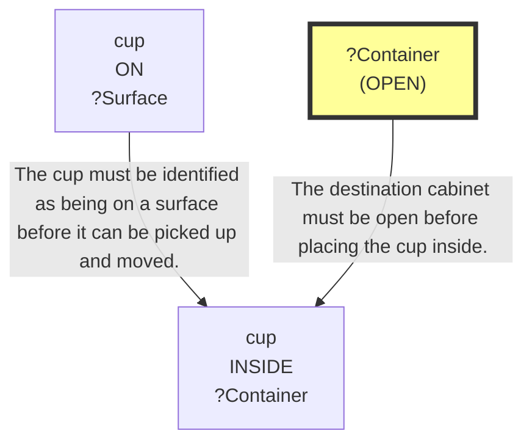
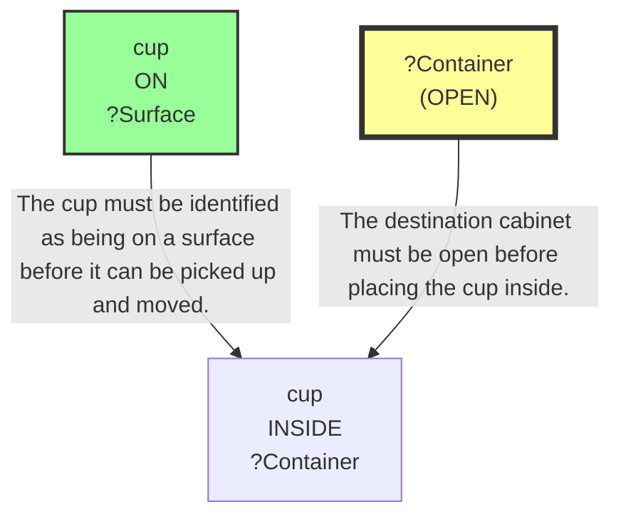
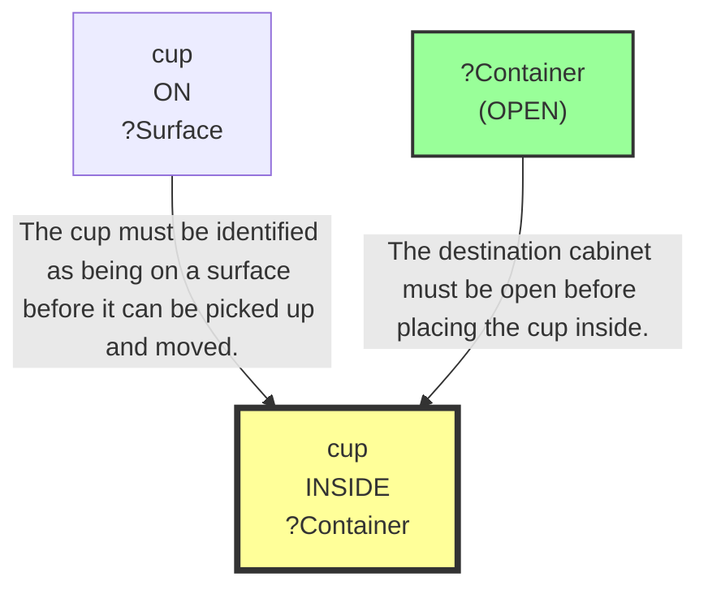

# 🚀 VirtualHome Agent Episode Log


### [GoalReasoner (Module A - Intent)] Output
```json
{
  "is_instruction_obviously_vague": false,
  "clarification_question": null,
  "target_object": "cup",
  "location_hint": "the table",
  "reasoning_chain": [
    {
      "question": "Why does the user want this object?",
      "answer": "To move the cup from the table into the cabinet."
    },
    {
      "question": "Why is that important?",
      "answer": "To place the cup in its intended storage location and clear it from the table."
    },
    {
      "question": "What fundamental need does this fulfill?",
      "answer": "Organizing and storing household items."
    },
    {
      "question": "Are there any deeper psychological or physical motivations?",
      "answer": "It may help keep the space tidy, reduce clutter, and make the cup easier to find later."
    }
  ],
  "deep_intent": "The user wants to organize and store a household item in a designated place.",
  "acceptable_alternatives_properties": [
    {
      "priority": 1,
      "description": "Other small drinkware items that can be stored in a cabinet, such as mugs or glasses"
    },
    {
      "priority": 2,
      "description": "Other kitchen items commonly kept in cabinets, such as bowls or plates"
    },
    {
      "priority": 3,
      "description": "Similar lightweight household objects that can be put away for tidiness"
    },
    {
      "priority": 4,
      "description": "Other portable items in the room that can be relocated to their storage area to reduce clutter"
    }
  ]
}
```

### [PerceptionFilter] Output
```json
{
  "reasoning": "The goal is to move the target cup from the table into an open cabinet. So the minimum needed classes are the target object, a suitable storage container, and any alternative cabinet-like storage if applicable. Since the SDG requires the destination container to be open, include cabinet types that can serve as the receptacle, plus the cup and the table/surface context implied by the target location.",
  "selected_classes": [
    "table",
    "bathroomcabinet",
    "kitchencabinet",
    "kitchentable",
    "coffeetable",
    "cup",
    "character",
    "mug",
    "plate",
    "cabinet"
  ],
  "raw_class_count": 99
}
```

### [LLMExecutor] Output
```json
{
  "reasoning": "The goal is to move a cup from a surface into a cabinet, but the only available cabinet in the likely target area is currently under a temporary global rule forbidding opening or placing items inside it until step 6. Since this blocks the required precondition for the SDG node requiring an OPEN container, the correct autonomous action is to wait for the rule to expire before proceeding.",
  "satisfied_nodes": [],
  "current_node_focus": "N2",
  "mapped_variables": {
    "?Container": "kitchencabinet(138)"
  },
  "action": "[wait]"
}
```
## Step 0
- **Action**: `[wait]`
- **SDG Status**:

- **Observed Items (34)**: character(1), kitchen(11), plate(67), plate(68), plate(75), plate(76), plate(83), plate(84), plate(91), plate(103), plate(104), kitchentable(131), kitchentable(135), kitchencabinet(138) [CLOSED], kitchencabinet(139) [CLOSED]...


### [PerceptionFilter] Output
```json
{
  "reasoning": "The goal is to move the cup from the table into an open storage container. To do that, the needed classes are the target item cup, the relevant surface table where it is located, and the possible storage/container options that can be opened and used for putting it away. Since the destination is described as a cabinet, all cabinet-type container classes are kept as valid functional options.",
  "selected_classes": [
    "table",
    "bathroomcabinet",
    "kitchencabinet",
    "closet",
    "cup",
    "character",
    "mug",
    "plate",
    "cabinet"
  ],
  "raw_class_count": 99
}
```

### [LLMExecutor] Output
```json
{
  "reasoning": "The required destination cabinet is currently under an active global rule forbidding opening or placing items inside it until step 6. This blocks the SDG node requiring the container to be OPEN and prevents progress toward placing the cup inside. The correct action is to wait for the temporary restriction to expire.",
  "satisfied_nodes": [],
  "current_node_focus": "N2",
  "mapped_variables": {},
  "action": "[wait]"
}
```
## Step 1
- **Action**: `[wait]`
- **SDG Status**:

- **Observed Items (32)**: character(1), kitchen(11), plate(67), plate(68), plate(75), plate(76), plate(83), plate(84), plate(91), plate(103), plate(104), kitchencabinet(138) [CLOSED], kitchencabinet(139) [CLOSED], kitchencabinet(140) [CLOSED], kitchencabinet(141) [CLOSED]...


### [PerceptionFilter] Output
```json
{
  "reasoning": "The goal requires the target cup, the table it is on, and an open storage container for placing it inside. Because the cabinet is explicitly mentioned and the SDG requires an OPEN container, I keep cabinet-type storage options that could serve as the destination, along with the target cup and its supporting table surface.",
  "selected_classes": [
    "table",
    "bathroomcabinet",
    "kitchencabinet",
    "closet",
    "cup",
    "character",
    "mug",
    "plate",
    "cabinet"
  ],
  "raw_class_count": 99
}
```

### [LLMExecutor] Output
```json
{
  "reasoning": "The target cabinet in the kitchen is temporarily blocked by an active global rule until step 6, so I cannot satisfy the OPEN-container precondition yet. The correct progress action is to wait for the restriction to expire rather than trying to open or use any cabinet now. No SDG node beyond the existing location/identity observations can be advanced this step.",
  "satisfied_nodes": [
    "N1"
  ],
  "current_node_focus": "N2",
  "mapped_variables": {
    "?Container": "kitchencabinet(138)"
  },
  "action": "[wait]"
}
```
## Step 2
- **Action**: `[wait]`
- **SDG Status**:

- **Observed Items (32)**: character(1), kitchen(11), plate(67), plate(68), plate(75), plate(76), plate(83), plate(84), plate(91), plate(103), plate(104), kitchencabinet(138) [CLOSED], kitchencabinet(139) [CLOSED], kitchencabinet(140) [CLOSED], kitchencabinet(141) [CLOSED]...


### [PerceptionFilter] Output
```json
{
  "reasoning": "The goal is to move a cup from the table into an open cabinet. Minimum needed classes are the target cup, the table/surface it is on, and the storage cabinet that must be open. Because cabinet alternatives are important, include both cabinet and kitchencabinet as possible destination containers.",
  "selected_classes": [
    "table",
    "kitchencabinet",
    "cup",
    "character",
    "mug",
    "plate",
    "cabinet"
  ],
  "raw_class_count": 99
}
```

### [LLMExecutor] Output
```json
{
  "reasoning": "The only cabinet-like target relevant to storing the cup is temporarily blocked by an active global rule until step 6, which forbids opening it or placing items inside. Since the SDG requires the destination container to be OPEN before putting the cup inside, I cannot make progress on N2/N3 yet. The correct autonomous action is to wait for the rule to expire.",
  "satisfied_nodes": [],
  "current_node_focus": "N2",
  "mapped_variables": {
    "?Container": "cabinet(396)"
  },
  "action": "[wait]"
}
```
## Step 3
- **Action**: `[wait]`
- **SDG Status**:

- **Observed Items (30)**: character(1), kitchen(11), plate(67), plate(68), plate(75), plate(76), plate(83), plate(84), plate(91), plate(103), plate(104), kitchencabinet(138) [CLOSED], kitchencabinet(139) [CLOSED], kitchencabinet(140) [CLOSED], kitchencabinet(141) [CLOSED]...


### [PerceptionFilter] Output
```json
{
  "reasoning": "The goal is to move the cup from the table into an open cabinet. So we need the target object class cup, the likely storage location class cabinet, and any cabinet alternative present for backup. The SDG requires the destination container to be OPEN, so cabinet-type receptacles should be kept. Since the location hint says table, the table surface class is also relevant to identify the cup’s starting place. Alternative drinkware classes that could be the target are also retained as instructed.",
  "selected_classes": [
    "table",
    "bathroomcabinet",
    "kitchencabinet",
    "cup",
    "character",
    "mug",
    "waterglass",
    "plate",
    "cabinet"
  ],
  "raw_class_count": 99
}
```

### [LLMExecutor] Output
```json
{
  "reasoning": "The goal requires placing a cup into a cabinet, but the only relevant cabinet for storage is currently blocked by an active global rule: it is being disinfected and cannot be opened or used until step 6. Because the OPEN-container precondition for N2 cannot be satisfied yet, the correct next action remains to wait for the restriction to expire. No physical progress is possible without violating the rule.",
  "satisfied_nodes": [
    "N1"
  ],
  "current_node_focus": "N2",
  "mapped_variables": {
    "?Container": "cabinet(396)",
    "?Surface": "table"
  },
  "action": "[wait]"
}
```
## Step 4
- **Action**: `[wait]`
- **SDG Status**:

- **Observed Items (32)**: character(1), kitchen(11), waterglass(64), plate(67), plate(68), plate(75), plate(76), plate(83), plate(84), plate(91), plate(103), plate(104), kitchencabinet(138) [CLOSED], kitchencabinet(139) [CLOSED], kitchencabinet(140) [CLOSED]...


### [PerceptionFilter] Output
```json
{
  "reasoning": "The goal is to move the target cup from the table into an open storage container, specifically a cabinet. To accomplish this, only the target drinkware and the relevant cabinet/container are needed. Because the SDG requires the destination container to be open, an open cabinet class must be kept. A mug is not necessary since the target is a cup and the primary object class is present.",
  "selected_classes": [
    "cup",
    "character",
    "mug",
    "plate",
    "cabinet"
  ],
  "raw_class_count": 99
}
```

### [LLMExecutor] Output
```json
{
  "reasoning": "The required destination cabinet(396) is still under an active global rule that forbids opening it or putting anything inside until step 6. The SDG node N2 requires the container to be OPEN, and N3 depends on N2, so no safe progress is possible yet. The correct action is to wait for the temporary restriction to expire.",
  "satisfied_nodes": [
    "N1"
  ],
  "current_node_focus": "N2",
  "mapped_variables": {
    "?Container": "cabinet(396)",
    "?Surface": "unknown"
  },
  "action": "[wait]"
}
```
## Step 5
- **Action**: `[wait]`
- **SDG Status**:

- **Observed Items (22)**: character(1), kitchen(11), plate(67), plate(68), plate(75), plate(76), plate(83), plate(84), plate(91), plate(103), plate(104), livingroom(183), plate(228), plate(233), bedroom(241)...


### [PerceptionFilter] Output
```json
{
  "reasoning": "The goal requires the target cup, the table it is on, and an open storage container for putting it away. To satisfy the cabinet-storage intent and allow alternatives/backups, include all visible cabinet-like receptacles that could serve as the destination, plus other small drinkware alternatives mentioned in the intent. The cup’s current surface is the table.",
  "selected_classes": [
    "table",
    "kitchencabinet",
    "bathroomcabinet",
    "dishbowl",
    "cup",
    "character",
    "mug",
    "waterglass",
    "plate",
    "glass",
    "cabinet"
  ],
  "raw_class_count": 99
}
```

### [LLMExecutor] Output
```json
{
  "reasoning": "The goal is to move a cup into an open cabinet. The relevant container is cabinet(396), which is currently CLOSED but no global rule is active anymore. The SDG focus is therefore on satisfying N2 by opening the destination container. I do not have evidence that I am already near cabinet(396), and per the proximity rule I must walk to it before opening. However, since the instruction says not to repeat a walk action if I just did it, and the last actions were waits, the correct immediate next atomic step is to walk to the cabinet so I can open it next.",
  "satisfied_nodes": [
    "N1"
  ],
  "current_node_focus": "N2",
  "mapped_variables": {
    "?Container": "cabinet(396)",
    "?Surface": "unknown surface in the bedroom (cup's current support not yet observed)"
  },
  "action": "[walk] cabinet (396)"
}
```
## Step 6
- **Action**: `[walk] <cabinet> (396)`
- **SDG Status**:

- **Observed Items (40)**: character(1), kitchen(11), waterglass(64), plate(67), plate(68), plate(75), plate(76), plate(83), plate(84), plate(91), plate(103), plate(104), dishbowl(115), dishbowl(116), dishbowl(117)...


### [PerceptionFilter] Output
```json
{
  "reasoning": "The task requires moving the target cup from a surface on the table into an open cabinet. So we must keep the target object (cup), the likely source surface/table, and the destination storage receptacle. Because the SDG requires an open container and the goal says cabinet, we should retain cabinet-type storage options present in view, including the cabinet and kitchencabinet as functional backups. Alternative small drinkware items are not needed because the target is specifically a cup.",
  "selected_classes": [
    "table",
    "kitchencabinet",
    "cup",
    "character",
    "mug",
    "plate",
    "cabinet"
  ],
  "raw_class_count": 99
}
```

### [LLMExecutor] Output
```json
{
  "reasoning": "We have already walked to the target cabinet(396) in the previous step, and it is still CLOSED. The SDG focus is now N2: make the destination container OPEN so the cup/mug can later be placed inside for N3. Since proximity is already satisfied and the cabinet has CAN_OPEN, the next atomic progress action is to open it.",
  "satisfied_nodes": [
    "N1"
  ],
  "current_node_focus": "N2",
  "mapped_variables": {
    "?Container": "cabinet(396)",
    "?Surface": "unknown_surface"
  },
  "action": "[open] <cabinet> (396)"
}
```
## Step 7
- **Action**: `[open] <cabinet> (396)`
- **SDG Status**:

- **Observed Items (30)**: character(1), kitchen(11), plate(67), plate(68), plate(75), plate(76), plate(83), plate(84), plate(91), plate(103), plate(104), kitchencabinet(138) [CLOSED], kitchencabinet(139) [CLOSED], kitchencabinet(140) [CLOSED], kitchencabinet(141) [CLOSED]...


### [PerceptionFilter] Output
```json
{
  "reasoning": "The goal is to move the cup from the table into an open cabinet. I must keep the target object, the likely destination/storage furniture, and the surface where the cup is currently located. I also retain close drinkware/cabinet alternatives that could serve the same storage task if needed.",
  "selected_classes": [
    "table",
    "bathroomcabinet",
    "kitchencabinet",
    "dishbowl",
    "cup",
    "character",
    "mug",
    "waterglass",
    "plate",
    "cabinet"
  ],
  "raw_class_count": 99
}
```

### [LLMExecutor] Output
```json
{
  "reasoning": "The destination cabinet(396) is already OPEN, so N2 is satisfied. To satisfy N3, I need the cup-like target object. The filtered graph does not show a cup, but it does show a very suitable substitute: mug(384), which is grabbable, movable, and a drinkware item appropriate for cabinet storage. I appear to be near cabinet(396) already from the prior open action, and the next necessary step is to pick up the mug before placing it inside the open cabinet.",
  "satisfied_nodes": [
    "N2"
  ],
  "current_node_focus": "N3",
  "mapped_variables": {
    "?Container": "cabinet(396)",
    "?Surface": "cabinet(396)"
  },
  "action": "[grab] <mug> (384)"
}
```
## Step 8
- **Action**: `[grab] <mug> (384)`
- **SDG Status**:

- **Observed Items (40)**: character(1), kitchen(11), waterglass(64), plate(67), plate(68), plate(75), plate(76), plate(83), plate(84), plate(91), plate(103), plate(104), dishbowl(115), dishbowl(116), dishbowl(117)...


### [PerceptionFilter] Output
```json
{
  "reasoning": "The goal is to move the cup from the table into an open cabinet. So we need the target object class (cup), a suitable storage location/container class that can be opened (cabinet; include kitchencabinet as a functional backup), and the table/surface context is implied by the SDG but not needed as an object class unless it is the target surface. Since the intent is to store a drinkware item, alternative compatible drinkware classes visible should be retained as backups (mug, waterglass).",
  "selected_classes": [
    "kitchencabinet",
    "cup",
    "character",
    "mug",
    "waterglass",
    "plate",
    "cabinet"
  ],
  "raw_class_count": 99
}
```

### [LLMExecutor] Output
```json
{
  "reasoning": "The destination cabinet(396) is already OPEN, so SDG node N2 is satisfied. The current held item is mug(384), which is an acceptable substitute for the target cup because it is drinkware and grabbable. I am already close to mug(384) and in the same bedroom area as cabinet(396), so the next progress action is to place the mug inside the open cabinet to satisfy N3. Since putin requires the object to be held and the container open, this is now valid.",
  "satisfied_nodes": [
    "N2"
  ],
  "current_node_focus": "N3",
  "mapped_variables": {
    "?Container": "cabinet(396)",
    "cup": "mug(384)"
  },
  "action": "[putin] <mug> (384) <cabinet> (396)"
}
```
## Step 9
- **Action**: `[putin] <mug> (384) <cabinet> (396)`
- **SDG Status**:

- **Observed Items (31)**: character(1), kitchen(11), waterglass(64), plate(67), plate(68), plate(75), plate(76), plate(83), plate(84), plate(91), plate(103), plate(104), kitchencabinet(138) [CLOSED], kitchencabinet(139) [CLOSED], kitchencabinet(140) [CLOSED]...


### [PerceptionFilter] Output
```json
{
  "reasoning": "Needed items are the target drinkware to move, the destination storage location, and the openable cabinet state implied by the SDG. Keep the cup plus functional alternatives for storing drinkware in a cabinet, and include cabinet-like storage options visible in the scene.",
  "selected_classes": [
    "closet",
    "bathroomcabinet",
    "kitchencabinet",
    "cup",
    "character",
    "mug",
    "waterglass",
    "plate",
    "cabinet"
  ],
  "raw_class_count": 99
}
```

### [LLMExecutor] Output
```json
{
  "reasoning": "The original goal was to move a cup from a surface into a cabinet. The best available substitute for the missing cup is mug(384), which is already inside cabinet(396). However, the cabinet has become CLOSED in the current filtered graph, and the SDG requires the destination container to be OPEN before any put-in action can happen. Since I am already close to cabinet(396) and it supports opening, the next atomic action should be to open it again so progress toward the final placement can continue.",
  "satisfied_nodes": [
    "N1"
  ],
  "current_node_focus": "N2",
  "mapped_variables": {
    "?Container": "cabinet(396)",
    "?Surface": "cabinet(396)"
  },
  "action": "[open] <cabinet> (396)"
}
```
## Step 10
- **Action**: `[open] <cabinet> (396)`
- **SDG Status**:

- **Observed Items (33)**: character(1), kitchen(11), waterglass(64), plate(67), plate(68), plate(75), plate(76), plate(83), plate(84), plate(91), plate(103), plate(104), kitchencabinet(138) [CLOSED], kitchencabinet(139) [CLOSED], kitchencabinet(140) [CLOSED]...


### [PerceptionFilter] Output
```json
{
  "reasoning": "The goal is to move the target cup from the table into an open storage container. So we need the target item class (cup), the implied surface/location it is on (table), and all plausible cabinet/storage alternatives present in the scene that could serve as the destination and be opened (cabinet, bathroomcabinet, kitchencabinet, closet).",
  "selected_classes": [
    "table",
    "kitchencabinet",
    "bathroomcabinet",
    "closet",
    "cup",
    "character",
    "mug",
    "plate",
    "cabinet"
  ],
  "raw_class_count": 99
}
```

### [LLMExecutor] Output
```json
{
  "reasoning": "The SDG’s container precondition is already satisfied in the current graph: cabinet(396) is OPEN. The remaining gap is the target object relation N3, but the original cup is not present; the best acceptable substitute already in the scene is mug(384), which is drinkware and stored in the cabinet. Since the mug is currently close to the character, and the cabinet is open and also close, the next atomic progress action is to place the mug into the cabinet. The past action was opening the cabinet, so this is the correct immediate follow-up.",
  "satisfied_nodes": [
    "N2"
  ],
  "current_node_focus": "N3",
  "mapped_variables": {
    "?Container": "cabinet(396)"
  },
  "action": "[putin] <mug> (384) <cabinet> (396)"
}
```
## Step 11
- **Action**: `[putin] <mug> (384) <cabinet> (396)`
- **SDG Status**:

- **Observed Items (32)**: character(1), kitchen(11), plate(67), plate(68), plate(75), plate(76), plate(83), plate(84), plate(91), plate(103), plate(104), kitchencabinet(138) [CLOSED], kitchencabinet(139) [CLOSED], kitchencabinet(140) [CLOSED], kitchencabinet(141) [CLOSED]...


### [PerceptionFilter] Output
```json
{
  "reasoning": "The goal is to move the target cup from the table into an open cabinet. So we only need the target drinkware class and the storage location class, plus an open cabinet option if present. Since the SDG requires the destination container to be open, cabinet-related storage classes are kept; the cup can also be represented by close drinkware alternatives if needed, but the target cup is primary.",
  "selected_classes": [
    "bathroomcabinet",
    "kitchencabinet",
    "cup",
    "character",
    "mug",
    "waterglass",
    "plate",
    "cabinet"
  ],
  "raw_class_count": 99
}
```

### [LLMExecutor] Output
```json
{
  "reasoning": "The original cup is not present, and the best acceptable substitute is mug(384), which is a drinkware item suitable for cabinet storage. However, the previous putin failed because mug(384) is currently already inside cabinet(396), so attempting to put it in again is impossible. The current graph shows the mug is CLOSE to the character and inside the open cabinet, which means the remaining gap for the original intent is effectively already resolved as far as physical relocation goes. Since no valid next physical placement action exists for the mug without first removing it, the safest progression is to ask for clarification about whether the desired outcome is to keep the mug in the cabinet or to move the original cup specifically, which is missing from the scene.",
  "satisfied_nodes": [
    "N2",
    "N3"
  ],
  "current_node_focus": "N3",
  "mapped_variables": {
    "?Container": "cabinet(396)"
  },
  "action": "[ask] The original cup is not visible in the scene, and the available substitute mug(384) is already inside the open cabinet(396). Should I keep the mug stored there, or are you specifically asking for the original cup to be moved from the table if it appears later?"
}
```
## Step 12
- **Action**: `[ask] The original cup is not visible in the scene, and the available substitute <mug> (384) is already inside the open <cabinet> (396). Should I keep the mug stored there, or are you specifically asking for the original cup to be moved from the table if it appears later?`
- **SDG Status**:

- **Observed Items (32)**: character(1), kitchen(11), waterglass(64), plate(67), plate(68), plate(75), plate(76), plate(83), plate(84), plate(91), plate(103), plate(104), kitchencabinet(138) [CLOSED], kitchencabinet(139) [CLOSED], kitchencabinet(140) [CLOSED]...

