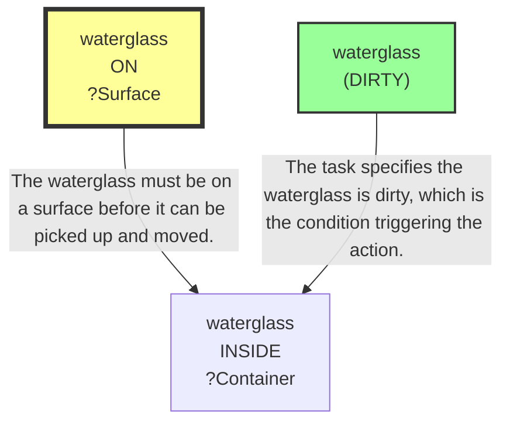
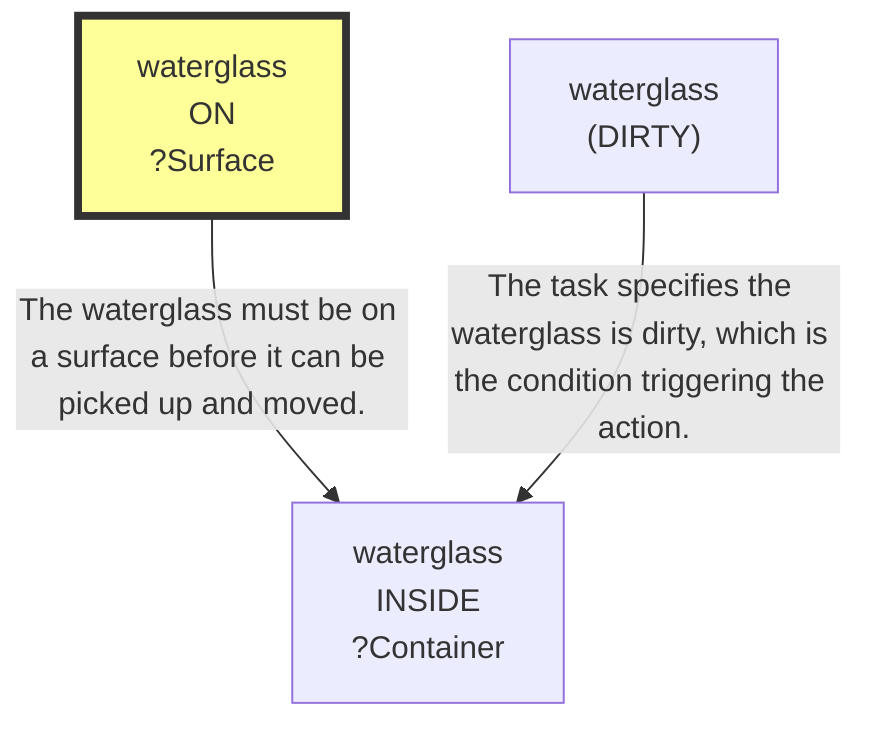
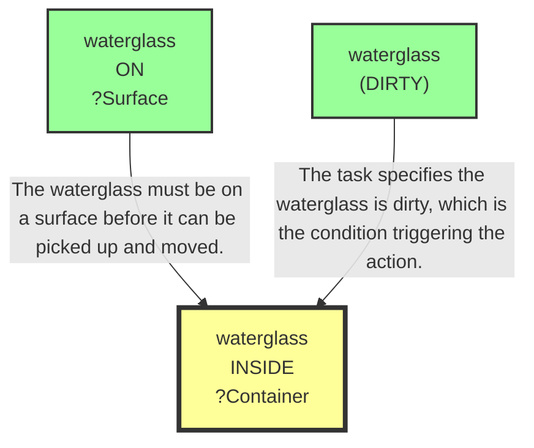
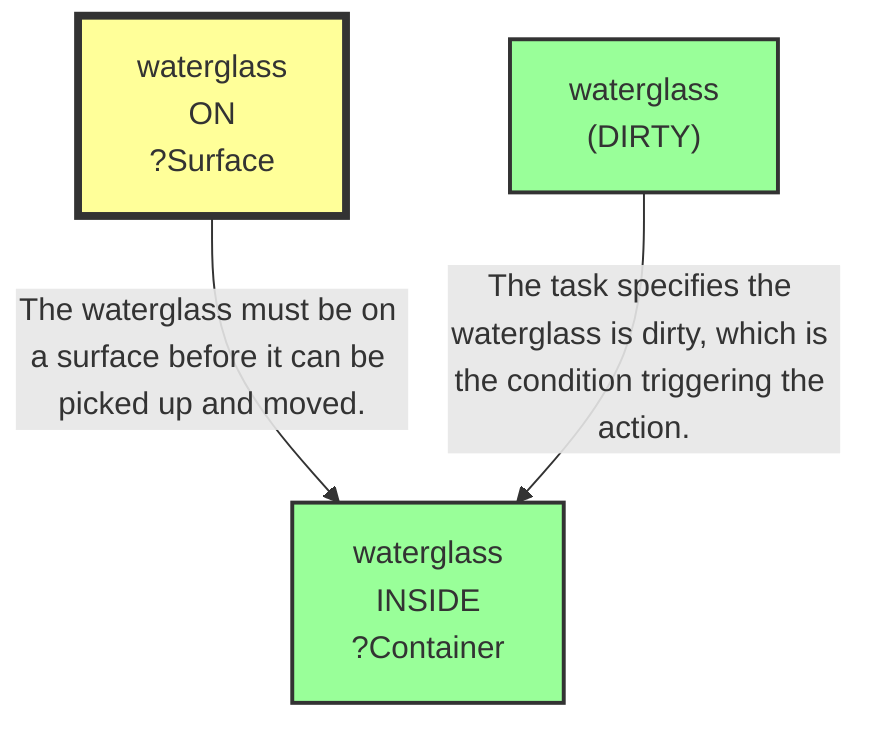

# 🚀 VirtualHome Agent Episode Log


### [GoalReasoner (Module A - Intent)] Output
```json
{
  "is_instruction_obviously_vague": false,
  "clarification_question": null,
  "target_object": "waterglass",
  "location_hint": "table",
  "reasoning_chain": [
    {
      "question": "Why does the user want this object moved?",
      "answer": "Because the glass is dirty and should be relocated for cleaning or proper dish handling."
    },
    {
      "question": "Why is that important?",
      "answer": "To keep the table clear and move the dirty item to an appropriate place for washing or disposal."
    },
    {
      "question": "What fundamental need does this fulfill?",
      "answer": "It fulfills the need to maintain cleanliness and organization in the living space."
    },
    {
      "question": "Are there any deeper psychological or physical motivations?",
      "answer": "It may reduce clutter, prevent mess from spreading, and support hygienic household habits."
    }
  ],
  "deep_intent": "The user wants to remove a dirty dish item from the table and place it where it can be cleaned.",
  "acceptable_alternatives_properties": [
    {
      "priority": 1,
      "description": "Other dirty drinkware or small dishes on the table that should be collected and moved to the sink."
    },
    {
      "priority": 2,
      "description": "Other washable kitchen items from the table that belong with dirty dishes, such as cups, mugs, or small plates."
    },
    {
      "priority": 3,
      "description": "Any dirty tableware that needs to be gathered for washing, including bowls or utensils."
    },
    {
      "priority": 4,
      "description": "Other clutter items on the table that can be cleared away if the specific glass is unavailable, though only if they are similarly removable household items."
    }
  ]
}
```

### [PerceptionFilter] Output
```json
{
  "reasoning": "The goal is to move the dirty waterglass from the table to a place where it can be cleaned. The minimum needed classes are the target object itself, the likely destination/cleaning location (sink), and the table surface implied by the location hint. Since the intent also allows alternative dirty tableware to be collected if needed, I keep the other likely washable drinkware/dish backups present on the table: mug, dishbowl, plate, and cutlery. I exclude unrelated furniture and appliances.",
  "selected_classes": [
    "character",
    "waterglass",
    "cutleryknife",
    "plate",
    "dishbowl",
    "cutleryfork",
    "mug",
    "table",
    "sink"
  ],
  "raw_class_count": 99
}
```

### [LLMExecutor] Output
```json
{
  "reasoning": "The target waterglass(64) is dirty, but it is located inside the kitchen and the active global rule temporarily forbids touching or moving any utensils. Since the required preconditions for manipulating the glass are blocked and the rule is explicitly temporary, the correct next step is to wait until the restriction expires.",
  "satisfied_nodes": [
    "N2"
  ],
  "current_node_focus": "N1",
  "mapped_variables": {
    "?Surface": "table"
  },
  "action": "[wait]"
}
```
## Step 0
- **Action**: `[wait]`
- **SDG Status**:

- **Observed Items (50)**: character(1), kitchen(11), cutleryknife(59), cutleryknife(60), waterglass(64) [DIRTY], cutleryknife(65), cutleryfork(66), plate(67), plate(68), cutleryfork(69), cutleryknife(70), cutleryknife(73), cutleryfork(74), plate(75), plate(76)...


### [PerceptionFilter] Output
```json
{
  "reasoning": "The goal is to remove a dirty waterglass from the table and place it where it can be cleaned. So we must keep the target item itself, the table/surface it is on, and the cleaning receptacle/appliance options needed for washing. Per the alternatives rule, we retain all plausible washing tools/locations available: sink, dishwasher, and washingmachine as functional cleaning destinations. Since the glass is dirty tableware, nearby compatible dishware alternatives are also retained as backups for the same kind of task: mug, plate, dishbowl, and cutlery for dirty dish handling.",
  "selected_classes": [
    "character",
    "waterglass",
    "cutleryknife",
    "plate",
    "dishwasher",
    "dishbowl",
    "cutleryfork",
    "washingmachine",
    "mug",
    "table",
    "sink"
  ],
  "raw_class_count": 99
}
```

### [LLMExecutor] Output
```json
{
  "reasoning": "The active global rule still forbids touching or moving any utensils in the kitchen, and the target waterglass(64) is a dish/kitchen item located in the kitchen. Since this is a temporary ban and it has not yet expired, I cannot progress with walk/grab/put actions toward the goal. The correct autonomous step is to wait until the restriction lifts.",
  "satisfied_nodes": [],
  "current_node_focus": "N1",
  "mapped_variables": {},
  "action": "[wait]"
}
```
## Step 1
- **Action**: `[wait]`
- **SDG Status**:

- **Observed Items (52)**: character(1), kitchen(11), cutleryknife(59), cutleryknife(60), waterglass(64) [DIRTY], cutleryknife(65), cutleryfork(66), plate(67), plate(68), cutleryfork(69), cutleryknife(70), cutleryknife(73), cutleryfork(74), plate(75), plate(76)...


### [PerceptionFilter] Output
```json
{
  "reasoning": "The goal is to move a dirty waterglass from the table to a place where it can be cleaned. The minimum needed includes the target item itself, the table surface it is on, and the likely cleaning receptacle/appliance. Because the SDG mentions the glass is inside/on a surface and dirty, we keep the sink as the primary washing location and the dishwasher as a backup washing appliance. Since the location hint is table, keep the table class as the relevant surface.",
  "selected_classes": [
    "character",
    "waterglass",
    "plate",
    "dishwasher",
    "mug",
    "table",
    "sink"
  ],
  "raw_class_count": 99
}
```

### [LLMExecutor] Output
```json
{
  "reasoning": "The active global rule still forbids touching or moving any utensils in the kitchen, and the target waterglass(64) is a kitchen dish item. This is a temporary restriction that blocks all progress toward grabbing or relocating the glass, so the correct next atomic action is to wait until the ban expires.",
  "satisfied_nodes": [
    "N2"
  ],
  "current_node_focus": "N1",
  "mapped_variables": {},
  "action": "[wait]"
}
```
## Step 2
- **Action**: `[wait]`
- **SDG Status**:

- **Observed Items (25)**: character(1), kitchen(11), waterglass(64) [DIRTY], plate(67), plate(68), plate(75), plate(76), plate(83), plate(84), plate(91), plate(103), plate(104), sink(155), dishwasher(165) [CLOSED,OFF], livingroom(183)...


### [PerceptionFilter] Output
```json
{
  "reasoning": "The goal is to move a dirty waterglass from the table to a place where it can be cleaned. The minimum needed objects are the target waterglass, the table surface it is on, and cleaning/dirty-dish destinations or tools: the sink and dishwasher are the relevant washing options, and I should retain both as backups. Since the item is dirty dishware, nearby compatible tableware types on the table that could serve as alternatives under the intent are also kept only if they are explicitly part of the task’s acceptable alternatives; from the observed list, mug, plate, dishbowl, and cutlery are the relevant washable dish items. ",
  "selected_classes": [
    "character",
    "waterglass",
    "cutleryknife",
    "plate",
    "dishwasher",
    "dishbowl",
    "cutleryfork",
    "mug",
    "table",
    "sink"
  ],
  "raw_class_count": 99
}
```

### [LLMExecutor] Output
```json
{
  "reasoning": "The active global rule still temporarily forbids touching or moving any utensils in the kitchen until step 6. The target waterglass is a kitchen dish item, so I cannot legally walk to, grab, or relocate it yet. Since this is a temporary restriction that blocks progress and has not expired, the correct single next action is to wait.",
  "satisfied_nodes": [
    "N2"
  ],
  "current_node_focus": "N1",
  "mapped_variables": {},
  "action": "[wait]"
}
```
## Step 3
- **Action**: `[wait]`
- **SDG Status**:

- **Observed Items (51)**: character(1), kitchen(11), cutleryknife(59), cutleryknife(60), waterglass(64) [DIRTY], cutleryknife(65), cutleryfork(66), plate(67), plate(68), cutleryfork(69), cutleryknife(70), cutleryknife(73), cutleryfork(74), plate(75), plate(76)...


### [PerceptionFilter] Output
```json
{
  "reasoning": "The goal is to move a dirty waterglass from the table to a place where it can be cleaned. The minimum needed objects are the target item itself, the table/surface it is on, and a cleaning destination/receptacle. Because alternative cleanup tools and receptacles should be retained, I include the sink and dishwasher as possible washing locations, and also other dirty tableware that may be relevant backups for collection.",
  "selected_classes": [
    "character",
    "waterglass",
    "cutleryknife",
    "plate",
    "dishwasher",
    "dishbowl",
    "cutleryfork",
    "mug",
    "table",
    "sink"
  ],
  "raw_class_count": 99
}
```

### [LLMExecutor] Output
```json
{
  "reasoning": "The required temporary kitchen-cleaning ban is still active and explicitly forbids touching or moving any utensils in the kitchen. The target waterglass(64) is a kitchen dish item, so I cannot walk to, grab, or relocate it yet. Since this is a temporary rule and not an impossible task, the correct single atomic action is to wait until the restriction expires.",
  "satisfied_nodes": [
    "N2"
  ],
  "current_node_focus": "N1",
  "mapped_variables": {},
  "action": "[wait]"
}
```
## Step 4
- **Action**: `[wait]`
- **SDG Status**:

- **Observed Items (51)**: character(1), kitchen(11), cutleryknife(59), cutleryknife(60), waterglass(64) [DIRTY], cutleryknife(65), cutleryfork(66), plate(67), plate(68), cutleryfork(69), cutleryknife(70), cutleryknife(73), cutleryfork(74), plate(75), plate(76)...


### [PerceptionFilter] Output
```json
{
  "reasoning": "The goal is to move the dirty waterglass from the table to a place where it can be cleaned. Minimum needed classes are the target object itself and the likely washing location/appliance. Because alternative washing options must be retained, include both sink and dishwasher as possible cleanup destinations. The table is implied by the location hint, but no separate table class is necessary since the glass is already specified as on a surface and the task is to relocate it, not manipulate the table itself.",
  "selected_classes": [
    "character",
    "waterglass",
    "plate",
    "dishwasher",
    "mug",
    "sink"
  ],
  "raw_class_count": 99
}
```

### [LLMExecutor] Output
```json
{
  "reasoning": "The active global rule is still in effect: kitchen cleaning is in progress and I must not touch or move any utensils until step 6. The target waterglass(64) is a kitchen dish item, so I cannot walk to, grab, or relocate it yet. This is a temporary restriction, so the correct autonomous next action is to wait.",
  "satisfied_nodes": [
    "N2"
  ],
  "current_node_focus": "N1",
  "mapped_variables": {
    "?Surface": "table"
  },
  "action": "[wait]"
}
```
## Step 5
- **Action**: `[wait]`
- **SDG Status**:

- **Observed Items (25)**: character(1), kitchen(11), waterglass(64) [DIRTY], plate(67), plate(68), plate(75), plate(76), plate(83), plate(84), plate(91), plate(103), plate(104), sink(155), dishwasher(165) [CLOSED,OFF], livingroom(183)...


### [PerceptionFilter] Output
```json
{
  "reasoning": "The goal is to remove the dirty waterglass from the table and place it where it can be cleaned. The minimum needed classes are the target object itself, the table surface it is on, and likely washing-related receptacles/appliances for cleaning. Because alternatives must be retained, I include all plausible dish-cleaning locations available here: sink, dishwasher, and washingmachine, along with the table surface class.",
  "selected_classes": [
    "character",
    "waterglass",
    "plate",
    "dishwasher",
    "washingmachine",
    "mug",
    "table",
    "sink"
  ],
  "raw_class_count": 99
}
```

### [LLMExecutor] Output
```json
{
  "reasoning": "The kitchen utensil ban has expired and there are no active global rules blocking progress. The SDG requires the dirty waterglass to be on some surface, and the filtered graph shows waterglass(64) is DIRTY and inside the kitchen, but no specific table surface is visible. The next necessary step toward eventually moving it for cleaning is to walk to the waterglass so it can be picked up next.",
  "satisfied_nodes": [
    "N2"
  ],
  "current_node_focus": "N1",
  "mapped_variables": {
    "?Surface": "kitchen(11)"
  },
  "action": "[walk] waterglass (64)"
}
```
## Step 6
- **Action**: `[walk] <waterglass> (64)`
- **SDG Status**:

- **Observed Items (26)**: character(1), kitchen(11), waterglass(64) [DIRTY], plate(67), plate(68), plate(75), plate(76), plate(83), plate(84), plate(91), plate(103), plate(104), sink(155), dishwasher(165) [CLOSED,OFF], livingroom(183)...


### [PerceptionFilter] Output
```json
{
  "reasoning": "The goal is to move a dirty waterglass from the table to a place where it can be cleaned. The minimum necessary classes are the target item itself, the table/surface it is on, and the cleaning destination/appliance. Because alternatives and backups must be retained, I keep other drinkware and small dishware that could also serve as valid removable dirty table items, plus both sink and dishwasher as washing options.",
  "selected_classes": [
    "character",
    "waterglass",
    "cutleryknife",
    "kitchentable",
    "plate",
    "dishwasher",
    "coffeetable",
    "dishbowl",
    "cutleryfork",
    "mug",
    "table",
    "sink"
  ],
  "raw_class_count": 99
}
```

### [LLMExecutor] Output
```json
{
  "reasoning": "The target waterglass(64) is already the correct dirty item, and the previous step walked me adjacent to it. To move toward the cleaning task, the next required atomic step is to pick it up. I am not holding anything, so grabbing is allowed and necessary before any later walk or put action toward the sink.",
  "satisfied_nodes": [
    "N2",
    "N1"
  ],
  "current_node_focus": "N3",
  "mapped_variables": {
    "?Surface": "kitchentable(131)",
    "?Container": "sink(155)"
  },
  "action": "[grab] <waterglass> (64)"
}
```
## Step 7
- **Action**: `[grab] <waterglass> (64)`
- **SDG Status**:

- **Observed Items (54)**: character(1), kitchen(11), cutleryknife(59), cutleryknife(60), waterglass(64) [DIRTY], cutleryknife(65), cutleryfork(66), plate(67), plate(68), cutleryfork(69), cutleryknife(70), cutleryknife(73), cutleryfork(74), plate(75), plate(76)...


### [PerceptionFilter] Output
```json
{
  "reasoning": "The goal is to move the dirty waterglass from the table to a place where it can be cleaned. I must keep the target object, the likely source surface (table), and all plausible cleaning/receptacle options needed for washing or temporary placement. Since the SDG says the glass is dirty and inside some container/area after being on a surface, the relevant physical cleanup locations are the sink and dishwasher. The table is included because it is the hinted location and the source surface implied by the task.",
  "selected_classes": [
    "character",
    "waterglass",
    "plate",
    "dishwasher",
    "mug",
    "table",
    "sink"
  ],
  "raw_class_count": 99
}
```

### [LLMExecutor] Output
```json
{
  "reasoning": "The target waterglass(64) is already in hand (HOLDS_RH) and is dirty, so the next missing step toward relocating it for cleaning is to move to a valid destination. Since the goal is to place the dirty glass where it can be cleaned, the best immediate receptacle in the current graph is the kitchen sink(155), which is a RECIPIENT surface. Per the sink rule, I must walk to the sink before any putback action. No container needs to be opened.",
  "satisfied_nodes": [
    "N2"
  ],
  "current_node_focus": "N1",
  "mapped_variables": {
    "?Surface": "sink(155)"
  },
  "action": "[walk] <sink> (155)"
}
```
## Step 8
- **Action**: `[walk] <sink> (155)`
- **SDG Status**:

- **Observed Items (25)**: character(1), kitchen(11), waterglass(64) [DIRTY], plate(67), plate(68), plate(75), plate(76), plate(83), plate(84), plate(91), plate(103), plate(104), sink(155), dishwasher(165) [CLOSED,OFF], livingroom(183)...


### [PerceptionFilter] Output
```json
{
  "reasoning": "The goal is to move the dirty target item, a waterglass, from the table to a place where it can be cleaned. So I must keep the target object class and the likely cleaning receptacle/appliance options. For washing/cleaning dirty dishes, the relevant physical options in view are sink and dishwasher; both should be retained as functional alternatives. The table is the implied location of the glass, so the table class is also needed for locating it.",
  "selected_classes": [
    "character",
    "waterglass",
    "plate",
    "dishwasher",
    "mug",
    "table",
    "sink"
  ],
  "raw_class_count": 99
}
```

### [LLMExecutor] Output
```json
{
  "reasoning": "The waterglass(64) is already in hand and I have just walked to the sink(155), so the remaining step toward placing the dirty glass where it can be cleaned is to put it on the sink surface. The sink is a recipient surface, not a container, so the correct action is putback rather than putin.",
  "satisfied_nodes": [
    "N2",
    "N1"
  ],
  "current_node_focus": "N3",
  "mapped_variables": {
    "?Surface": "sink(155)",
    "?Container": "sink(155)"
  },
  "action": "[putback] <waterglass> (64) <sink> (155)"
}
```
## Step 9
- **Action**: `[putback] <waterglass> (64) <sink> (155)`
- **SDG Status**:

- **Observed Items (25)**: character(1), kitchen(11), waterglass(64) [DIRTY], plate(67), plate(68), plate(75), plate(76), plate(83), plate(84), plate(91), plate(103), plate(104), sink(155), dishwasher(165) [CLOSED,OFF], livingroom(183)...


### [PerceptionFilter] Output
```json
{
  "reasoning": "The goal is to move a dirty waterglass from the table to a place where it can be cleaned. The only strictly necessary classes are the target item and the likely cleaning receptacles/appliances that can receive dirty dishware. Because alternative tools and backups must be retained, include all plausible washing locations: sink, dishwasher, and washingmachine if used for cleaning household items in this environment. The table is implied by the location hint, so the waterglass must be present, but the surface itself is not needed as an object class unless directly selected for action.",
  "selected_classes": [
    "character",
    "waterglass",
    "plate",
    "dishwasher",
    "washingmachine",
    "mug",
    "sink"
  ],
  "raw_class_count": 99
}
```

### [LLMExecutor] Output
```json
{
  "reasoning": "The SDG root condition is to have the dirty waterglass removed from the table/surface context and placed where it can be cleaned. The current graph already shows waterglass(64) is DIRTY and currently ON sink(155), which is an appropriate cleaning location. No further manipulation is needed to satisfy the goal progression represented here, and repeating a walk would not advance the state.",
  "satisfied_nodes": [
    "N2",
    "N3"
  ],
  "current_node_focus": "N1",
  "mapped_variables": {
    "?Surface": "sink(155)"
  },
  "action": "[wait]"
}
```
## Step 10
- **Action**: `[wait]`
- **SDG Status**:

- **Observed Items (26)**: character(1), kitchen(11), waterglass(64) [DIRTY], plate(67), plate(68), plate(75), plate(76), plate(83), plate(84), plate(91), plate(103), plate(104), sink(155), dishwasher(165) [CLOSED,OFF], livingroom(183)...


### [PerceptionFilter] Output
```json
{
  "reasoning": "The goal is to move a dirty waterglass from the table to a place where it can be cleaned. I must keep the target object, the likely source surface (table), and all plausible cleaning/holding locations or tools for dirty dish handling: sink, dishwasher, and possible supporting table/kitchen surfaces if needed. I also retain alternative drinkware/small dish classes only if they could substitute as similarly handled dirty tableware, but the minimum set focuses on the target and wash locations.",
  "selected_classes": [
    "character",
    "waterglass",
    "plate",
    "dishwasher",
    "mug",
    "table",
    "sink"
  ],
  "raw_class_count": 99
}
```

### [LLMExecutor] Output
```json
{
  "reasoning": "The dirty waterglass(64) is already on the sink(155), which is an appropriate cleaning location and satisfies the move-away-from-table objective represented by the SDG. No further action is needed to progress the goal, and the last action was a wait after the relocation. Since the instruction says not to repeat a walk action if just done, the safest single next atomic action is to wait.",
  "satisfied_nodes": [
    "N2",
    "N3"
  ],
  "current_node_focus": "N1",
  "mapped_variables": {
    "?Surface": "sink(155)",
    "?Container": "sink(155)"
  },
  "action": "[wait]"
}
```
## Step 11
- **Action**: `[wait]`
- **SDG Status**:

- **Observed Items (25)**: character(1), kitchen(11), waterglass(64) [DIRTY], plate(67), plate(68), plate(75), plate(76), plate(83), plate(84), plate(91), plate(103), plate(104), sink(155), dishwasher(165) [CLOSED,OFF], livingroom(183)...


### [PerceptionFilter] Output
```json
{
  "reasoning": "The goal is to move the dirty waterglass from the table to a place where it can be washed. The minimum needed classes are the target item and the washing destination. Because the intent mentions dirty drinkware and other washable tableware as acceptable alternatives, I should retain nearby dish-related alternatives that could also be collected if the exact glass is unavailable. The table/surface is implied by the SDG and location hint, so it is relevant as the source location.",
  "selected_classes": [
    "character",
    "waterglass",
    "cutleryknife",
    "plate",
    "dishwasher",
    "dishbowl",
    "cutleryfork",
    "mug",
    "sink"
  ],
  "raw_class_count": 99
}
```

### [LLMExecutor] Output
```json
{
  "reasoning": "The target dirty waterglass(64) has already been moved off the table and is now ON sink(155), which matches the goal of relocating it to a place where it can be cleaned. No additional physical manipulation is required, and repeating the same walk would not advance the SDG. Since there is no active global rule and the task is already effectively satisfied, the safest next atomic action is to wait.",
  "satisfied_nodes": [
    "N1",
    "N2"
  ],
  "current_node_focus": "N3",
  "mapped_variables": {
    "?Surface": "sink(155)",
    "?Container": "none"
  },
  "action": "[wait]"
}
```
## Step 12
- **Action**: `[wait]`
- **SDG Status**:

- **Observed Items (51)**: character(1), kitchen(11), cutleryknife(59), cutleryknife(60), waterglass(64) [DIRTY], cutleryknife(65), cutleryfork(66), plate(67), plate(68), cutleryfork(69), cutleryknife(70), cutleryknife(73), cutleryfork(74), plate(75), plate(76)...


### [PerceptionFilter] Output
```json
{
  "reasoning": "The goal is to remove a dirty waterglass from a table and place it where it can be cleaned. The minimum needed is the target object itself, plus the likely table surface it is on, and cleaning-related receptacles/appliances needed for washing. Because alternatives must be retained, I include all plausible dish-cleaning options and tableware backups that could serve as the destination or support the task.",
  "selected_classes": [
    "character",
    "waterglass",
    "cutleryknife",
    "fridge",
    "kitchentable",
    "plate",
    "dishwasher",
    "coffeetable",
    "dishbowl",
    "cutleryfork",
    "mug",
    "table",
    "sink"
  ],
  "raw_class_count": 99
}
```

### [LLMExecutor] Output
```json
{
  "reasoning": "The goal is already satisfied in the current filtered graph: the dirty waterglass(64) is not on the table and is already placed on the sink(155), which is an appropriate cleaning location. The SDG nodes N1 (waterglass ON some surface) and N2 (waterglass DIRTY) are satisfied, and N3 is also consistent with the current state because the glass is placed at the sink as the destination for cleaning. There is no remaining physical action that would advance the goal, and repeating a walk would not help.",
  "satisfied_nodes": [
    "N1",
    "N2",
    "N3"
  ],
  "current_node_focus": "N3",
  "mapped_variables": {
    "?Surface": "sink(155)",
    "?Container": "sink(155)"
  },
  "action": "[wait]"
}
```
## Step 13
- **Action**: `[wait]`
- **SDG Status**:

- **Observed Items (55)**: character(1), kitchen(11), cutleryknife(59), cutleryknife(60), waterglass(64) [DIRTY], cutleryknife(65), cutleryfork(66), plate(67), plate(68), cutleryfork(69), cutleryknife(70), cutleryknife(73), cutleryfork(74), plate(75), plate(76)...


### [PerceptionFilter] Output
```json
{
  "reasoning": "Need the target object waterglass, plus the likely destination/cleaning location implied by the task: the table it is on and the sink where dirty dishware can be washed. Since the goal is to move dirty tableware for cleaning, keep alternative washable drinkware/tableware in case the target is unavailable or for related handling: mug, dishbowl, plate, cutleryfork, and cutleryknife. Include dishwasher as an alternative cleaning appliance per the task’s cleaning intent.",
  "selected_classes": [
    "character",
    "waterglass",
    "cutleryknife",
    "plate",
    "dishwasher",
    "dishbowl",
    "cutleryfork",
    "mug",
    "table",
    "sink"
  ],
  "raw_class_count": 99
}
```

### [LLMExecutor] Output
```json
{
  "reasoning": "The dirty waterglass(64) is already on the sink(155), which is the appropriate destination for removing it from the table and preparing it for cleaning. The SDG requirement to have the waterglass DIRTY is satisfied, and its current placement ON sink is consistent with the intended relocation. There is no remaining necessary physical action that advances the goal, and repeating walk would not help.",
  "satisfied_nodes": [
    "N1",
    "N2",
    "N3"
  ],
  "current_node_focus": "N3",
  "mapped_variables": {
    "?Surface": "sink(155)",
    "?Container": "sink(155)"
  },
  "action": "[wait]"
}
```
## Step 14
- **Action**: `[wait]`
- **SDG Status**:

- **Observed Items (51)**: character(1), kitchen(11), cutleryknife(59), cutleryknife(60), waterglass(64) [DIRTY], cutleryknife(65), cutleryfork(66), plate(67), plate(68), cutleryfork(69), cutleryknife(70), cutleryknife(73), cutleryfork(74), plate(75), plate(76)...

