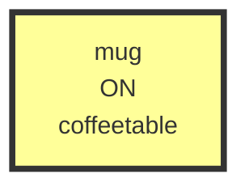
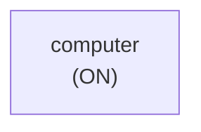
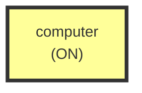

# 🚀 VirtualHome Agent Episode Log


### [GoalReasoner (Module A - Intent)] Output
```json
{
  "is_instruction_obviously_vague": false,
  "clarification_question": null,
  "target_object": "book",
  "location_hint": "sofa",
  "reasoning_chain": [
    {
      "question": "Why does the user want this object?",
      "answer": "To relocate the book from an unorganized place to the sofa."
    },
    {
      "question": "Why is that important?",
      "answer": "To place the book in a more organized or intended location."
    },
    {
      "question": "What fundamental need does this fulfill?",
      "answer": "It fulfills the need to organize or tidy up a misplaced item."
    },
    {
      "question": "Are there any deeper psychological or physical motivations?",
      "answer": "The user likely wants to reduce clutter and improve order in the room."
    }
  ],
  "deep_intent": "The user wants to organize misplaced items by moving them to a designated resting place.",
  "acceptable_alternatives_properties": [
    {
      "priority": 1,
      "description": "Other similarly misplaced reading materials or paper items that can be tidied up in the same way, such as magazines or notebooks"
    },
    {
      "priority": 2,
      "description": "Small portable household items that are out of place and can be set aside together for organization"
    },
    {
      "priority": 3,
      "description": "Loose personal items found in disorganized areas that contribute to clutter and can be gathered"
    },
    {
      "priority": 4,
      "description": "Any movable household object that needs to be put away to reduce clutter"
    }
  ]
}
```

### [RoboStateMultiTaskController] Output
```json
{
  "action": "[walk] <kitchen> (11)",
  "active_task_id": "task_2",
  "task_context": {
    "active_task_id": "task_2",
    "pending_task_ids": [
      "task_1",
      "task_3"
    ],
    "satisfied_task_ids": []
  },
  "source": "room_frontier"
}
```
## Step 0
- **Action**: `[walk] <kitchen> (11)`
- **Action Success**: `True`
- **Action Message**: {'0': {'message': 'Success'}}
- **Active Task**: `task_2`
- **Decision Source**: `room_frontier`
- **Task Progress**: E1_11=pending, E1_03=pending, E1_07=pending
- **SDG Status**:

- **Observed Items (38)**: floor(242), floor(243), floor(244), floor(245), ceiling(246), ceiling(247), ceiling(248), ceiling(249), wall(250), wall(251), wall(252), wall(253), door(254) [OPEN], ceilinglamp(255), tablelamp(256) [ON]...


### [RoboStateMultiTaskController] Output
```json
{
  "action": "[walk] <livingroom> (183)",
  "active_task_id": "task_2",
  "task_context": {
    "active_task_id": "task_2",
    "pending_task_ids": [
      "task_1",
      "task_3"
    ],
    "satisfied_task_ids": []
  },
  "source": "room_frontier"
}
```
## Step 1
- **Action**: `[walk] <livingroom> (183)`
- **Action Success**: `True`
- **Action Message**: {'0': {'message': 'Success'}}
- **Active Task**: `task_2`
- **Decision Source**: `room_frontier`
- **Task Progress**: E1_11=pending, E1_03=pending, E1_07=pending
- **SDG Status**:

- **Observed Items (192)**: floor(242), floor(243), floor(244), floor(245), ceiling(246), ceiling(247), ceiling(248), ceiling(249), wall(250), wall(251), wall(252), wall(253), door(254) [OPEN], ceilinglamp(255), tablelamp(256) [ON]...


### [PerceptionFilter] Output
```json
{
  "reasoning": "The goal is to move the target object book to the designated location sofa. Per the SDG and goal, only the target object and the destination location are strictly needed; no tools or alternate receptacles are required for this simple relocation task.",
  "selected_classes": [
    "sofa",
    "book",
    "character"
  ],
  "raw_class_count": 66
}
```

### [LLMExecutor] Output
```json
{
  "reasoning": "The active task is to place a book on the sofa. We are already in the living room, and the sofa is the correct destination surface. No book is currently held, so the next required step is to approach a suitable book before grabbing it. Among the visible books, book(105) is already near the character, making it the best candidate to move onto the sofa.",
  "satisfied_nodes": [],
  "current_node_focus": "N1",
  "mapped_variables": {
    "?TargetBook": "book(105)",
    "?Destination": "sofa(214)"
  },
  "action": "[walk] <book> (105)"
}
```

### [RoboStateMultiTaskController] Output
```json
{
  "action": "[walk] <book> (105)",
  "active_task_id": "task_2",
  "task_context": {
    "active_task_id": "task_2",
    "pending_task_ids": [
      "task_1",
      "task_3"
    ],
    "satisfied_task_ids": []
  },
  "source": "llm_executor"
}
```
## Step 2
- **Action**: `[walk] <book> (105)`
- **Action Success**: `True`
- **Action Message**: {'0': {'message': 'Success'}}
- **Active Task**: `task_2`
- **Decision Source**: `llm_executor`
- **Task Progress**: E1_11=pending, E1_03=pending, E1_07=pending
- **SDG Status**:

- **Observed Items (11)**: book(275) [CLOSED], character(1), kitchen(11), livingroom(183), bedroom(241), bathroom(285), bedroom(346), sofa(214), book(229) [CLOSED], book(230) [CLOSED], book(105) [CLOSED]


### [PerceptionFilter] Output
```json
{
  "reasoning": "Reused cached class selection.",
  "selected_classes": [
    "sofa",
    "book",
    "character"
  ],
  "raw_class_count": 66
}
```

### [LLMExecutor] Output
```json
{
  "reasoning": "The active SDG requires book ON sofa. The current graph shows multiple books; book(105) is the closest and already in the living room, while the sofa(214) is also in the living room and close to the character. Since to place an object on a surface I must first be near the destination, and I am not yet holding any book, the correct next step is to walk to the sofa before attempting to grab and place the book there.",
  "satisfied_nodes": [],
  "current_node_focus": "N1",
  "mapped_variables": {},
  "action": "[walk] <sofa> (214)"
}
```

### [RoboStateMultiTaskController] Output
```json
{
  "action": "[walk] <sofa> (214)",
  "active_task_id": "task_2",
  "task_context": {
    "active_task_id": "task_2",
    "pending_task_ids": [
      "task_1",
      "task_3"
    ],
    "satisfied_task_ids": []
  },
  "source": "llm_executor"
}
```
## Step 3
- **Action**: `[walk] <sofa> (214)`
- **Action Success**: `True`
- **Action Message**: {'0': {'message': 'Success'}}
- **Active Task**: `task_2`
- **Decision Source**: `llm_executor`
- **Task Progress**: E1_11=pending, E1_03=pending, E1_07=pending
- **SDG Status**:

- **Observed Items (11)**: book(275) [CLOSED], character(1), kitchen(11), livingroom(183), bedroom(241), bathroom(285), bedroom(346), sofa(214), book(229) [CLOSED], book(230) [CLOSED], book(105) [CLOSED]


### [PerceptionFilter] Output
```json
{
  "reasoning": "Reused cached class selection.",
  "selected_classes": [
    "sofa",
    "book",
    "character"
  ],
  "raw_class_count": 66
}
```

### [LLMExecutor] Output
```json
{
  "reasoning": "The SDG requires book ON sofa. I am already close to the sofa, but I am not holding any book yet. The current graph shows three candidate books, all movable and grabbable; book(105) is the best match because it is already close to the character in the living room, making it the most immediately accessible. To place it on the sofa, I must first be near the book before grabbing it. Since I just walked to the sofa, the next atomic step should be to walk to the chosen book.",
  "satisfied_nodes": [],
  "current_node_focus": "N1",
  "mapped_variables": {
    "?Book": "book(105)",
    "?TargetSurface": "sofa(214)"
  },
  "action": "[walk] <book> (105)"
}
```

### [RoboStateMultiTaskController] Output
```json
{
  "action": "[walk] <book> (105)",
  "active_task_id": "task_2",
  "task_context": {
    "active_task_id": "task_2",
    "pending_task_ids": [
      "task_1",
      "task_3"
    ],
    "satisfied_task_ids": []
  },
  "source": "llm_executor"
}
```
## Step 4
- **Action**: `[walk] <book> (105)`
- **Action Success**: `True`
- **Action Message**: {'0': {'message': 'Success'}}
- **Active Task**: `task_2`
- **Decision Source**: `llm_executor`
- **Task Progress**: E1_11=pending, E1_03=pending, E1_07=pending
- **SDG Status**:

- **Observed Items (11)**: book(275) [CLOSED], character(1), kitchen(11), livingroom(183), bedroom(241), bathroom(285), bedroom(346), sofa(214), book(229) [CLOSED], book(230) [CLOSED], book(105) [CLOSED]


### [PerceptionFilter] Output
```json
{
  "reasoning": "Reused cached class selection.",
  "selected_classes": [
    "sofa",
    "book",
    "character"
  ],
  "raw_class_count": 66
}
```

### [LLMExecutor] Output
```json
{
  "reasoning": "The SDG requires the book to be ON the sofa. We currently have a nearby book candidate, book(105), and the sofa(214) is already close to the character. However, to place the book we must first be holding it, and the latest graph does not show book(105) as held. The next required step is to approach the book before grabbing it, since grab requires proximity and the last walk to book was already attempted earlier but we do not have confirmation of possession. I will re-approach the book(105) to enable a legal grab in the next step.",
  "satisfied_nodes": [],
  "current_node_focus": "N1",
  "mapped_variables": {},
  "action": "[walk] <book> (105)"
}
```

### [RoboStateMultiTaskController] Output
```json
{
  "action": "[walk] <book> (105)",
  "active_task_id": "task_2",
  "task_context": {
    "active_task_id": "task_2",
    "pending_task_ids": [
      "task_1",
      "task_3"
    ],
    "satisfied_task_ids": []
  },
  "source": "llm_executor"
}
```
## Step 5
- **Action**: `[walk] <book> (105)`
- **Action Success**: `True`
- **Action Message**: {'0': {'message': 'Success'}}
- **Active Task**: `task_2`
- **Decision Source**: `llm_executor`
- **Task Progress**: E1_11=pending, E1_03=pending, E1_07=pending
- **SDG Status**:

- **Observed Items (11)**: book(275) [CLOSED], character(1), kitchen(11), livingroom(183), bedroom(241), bathroom(285), bedroom(346), sofa(214), book(229) [CLOSED], book(230) [CLOSED], book(105) [CLOSED]


### [PerceptionFilter] Output
```json
{
  "reasoning": "Reused cached class selection.",
  "selected_classes": [
    "sofa",
    "book",
    "character"
  ],
  "raw_class_count": 66
}
```

### [LLMExecutor] Output
```json
{
  "reasoning": "The goal is to place a book on the sofa. The current graph shows book(105) is the relevant nearby book and the character is already close to it in the living room, while the sofa(214) is also in the living room. The book is not yet on the sofa, so the next progress step is to pick up the book before transporting it. I should not repeat a walk action because the last actions were repeated walks to the same book, and the instruction says not to repeat a walk if just done. Since I am already close enough to the book per the graph, the best next atomic action is to grab it.",
  "satisfied_nodes": [],
  "current_node_focus": "N1",
  "mapped_variables": {},
  "action": "[grab] <book> (105)"
}
```

### [RoboStateMultiTaskController] Output
```json
{
  "action": "[grab] <book> (105)",
  "active_task_id": "task_2",
  "task_context": {
    "active_task_id": "task_2",
    "pending_task_ids": [
      "task_1",
      "task_3"
    ],
    "satisfied_task_ids": []
  },
  "source": "llm_executor"
}
```
## Step 6
- **Action**: `[grab] <book> (105)`
- **Action Success**: `True`
- **Action Message**: {'0': {'message': 'Success'}}
- **Active Task**: `task_2`
- **Decision Source**: `llm_executor`
- **Task Progress**: E1_11=pending, E1_03=pending, E1_07=pending
- **SDG Status**:

- **Observed Items (11)**: book(275) [CLOSED], character(1), kitchen(11), livingroom(183), bedroom(241), bathroom(285), bedroom(346), sofa(214), book(229) [CLOSED], book(230) [CLOSED], book(105) [CLOSED]


### [PerceptionFilter] Output
```json
{
  "reasoning": "Reused cached class selection.",
  "selected_classes": [
    "sofa",
    "book",
    "character"
  ],
  "raw_class_count": 66
}
```

### [LLMExecutor] Output
```json
{
  "reasoning": "The active goal is to place a book on the sofa. I am already holding book(105) and am in the livingroom, but the SDG requires the book to be ON the sofa. Because putback requires being near the destination and the last walk to the sofa was earlier, the correct next atomic step is to walk to the sofa again before placing the book. This also avoids violating the proximity rule.",
  "satisfied_nodes": [],
  "current_node_focus": "N1",
  "mapped_variables": {
    "?TargetSurface": "sofa(214)"
  },
  "action": "[walk] <sofa> (214)"
}
```

### [RoboStateMultiTaskController] Output
```json
{
  "action": "[walk] <sofa> (214)",
  "active_task_id": "task_2",
  "task_context": {
    "active_task_id": "task_2",
    "pending_task_ids": [
      "task_1",
      "task_3"
    ],
    "satisfied_task_ids": []
  },
  "source": "llm_executor"
}
```
## Step 7
- **Action**: `[walk] <sofa> (214)`
- **Action Success**: `True`
- **Action Message**: {'0': {'message': 'Success'}}
- **Active Task**: `task_2`
- **Decision Source**: `llm_executor`
- **Task Progress**: E1_11=pending, E1_03=pending, E1_07=pending
- **SDG Status**:

- **Observed Items (11)**: book(275) [CLOSED], character(1), kitchen(11), livingroom(183), bedroom(241), bathroom(285), bedroom(346), sofa(214), book(229) [CLOSED], book(230) [CLOSED], book(105) [CLOSED]


### [PerceptionFilter] Output
```json
{
  "reasoning": "Reused cached class selection.",
  "selected_classes": [
    "sofa",
    "book",
    "character"
  ],
  "raw_class_count": 66
}
```

### [LLMExecutor] Output
```json
{
  "reasoning": "The active goal is to have the book on the sofa. The current graph shows the character is already close to sofa(214) and holding book(105), so the remaining gap is to place the held book onto the sofa. Since putback requires being near the destination and we already are, the next atomic action is to put the book back on the sofa.",
  "satisfied_nodes": [],
  "current_node_focus": "N1",
  "mapped_variables": {},
  "action": "[putback] <book> (105) <sofa> (214)"
}
```

### [RoboStateMultiTaskController] Output
```json
{
  "action": "[putback] <book> (105) <sofa> (214)",
  "active_task_id": "task_2",
  "task_context": {
    "active_task_id": "task_2",
    "pending_task_ids": [
      "task_1",
      "task_3"
    ],
    "satisfied_task_ids": []
  },
  "source": "llm_executor"
}
```
## Step 8
- **Action**: `[putback] <book> (105) <sofa> (214)`
- **Action Success**: `True`
- **Action Message**: {'0': {'message': 'Success'}}
- **Active Task**: `task_2`
- **Decision Source**: `llm_executor`
- **Task Progress**: E1_11=pending, E1_03=done, E1_07=pending
- **SDG Status**:

- **Observed Items (11)**: book(275) [CLOSED], character(1), kitchen(11), livingroom(183), bedroom(241), bathroom(285), bedroom(346), sofa(214), book(229) [CLOSED], book(230) [CLOSED], book(105) [CLOSED]


### [GoalReasoner (Module A - Intent)] Output
```json
{
  "is_instruction_obviously_vague": false,
  "clarification_question": null,
  "target_object": "mug",
  "location_hint": "coffeetable",
  "reasoning_chain": [
    {
      "question": "Why does the user want this object?",
      "answer": "To keep it in a consistent place rather than elsewhere."
    },
    {
      "question": "Why is that important?",
      "answer": "To maintain an orderly or preferred arrangement in the living area."
    },
    {
      "question": "What fundamental need does this fulfill?",
      "answer": "The need to keep an item stored in a specific location."
    },
    {
      "question": "Are there any deeper psychological or physical motivations?",
      "answer": "It may be for convenience, tidiness, or to avoid misplacing the item."
    }
  ],
  "deep_intent": "The user wants an item kept in a specific location.",
  "acceptable_alternatives_properties": [
    {
      "priority": 1,
      "description": "Other small everyday personal items that can be kept in a fixed spot, such as a cup, glass, or small bowl"
    },
    {
      "priority": 2,
      "description": "Similar tabletop household items that are commonly stored in one place, such as a coaster, remote, or candle"
    },
    {
      "priority": 3,
      "description": "Any lightweight household object that can be designated a permanent resting location"
    },
    {
      "priority": 4,
      "description": "Other portable items that can be kept nearby for convenience, even if they are not tabletop objects"
    }
  ]
}
```

### [PerceptionFilter] Output
```json
{
  "reasoning": "Need the target item mug and the required location coffeetable to keep it in a fixed spot. Include close functional alternatives mentioned in the goal for a similar stored tabletop item: cup-like or small bowl containers, and other lightweight household items that could serve as the kept object.",
  "selected_classes": [
    "waterglass",
    "photoframe",
    "dishbowl",
    "book",
    "folder",
    "coffeetable",
    "candle",
    "mug",
    "character",
    "plate",
    "remote"
  ],
  "raw_class_count": 66
}
```

### [LLMExecutor] Output
```json
{
  "reasoning": "The active SDG requires mug(384) to be ON coffeetable(215). The mug is currently in the kitchen, while the character is already close to the coffeetable in the living room. To satisfy the relation, the next step must be to move to the mug before grabbing it. I will not manipulate the already-satisfied task's objects. The coffeetable is a valid flat surface for putback, and the mug is grabbable and portable.",
  "satisfied_nodes": [],
  "current_node_focus": "N1",
  "mapped_variables": {
    "?Object": "mug(384)",
    "?TargetSurface": "coffeetable(215)"
  },
  "action": "[walk] <mug> (384)"
}
```

### [RoboStateMultiTaskController] Output
```json
{
  "action": "[walk] <mug> (384)",
  "active_task_id": "task_3",
  "task_context": {
    "active_task_id": "task_3",
    "pending_task_ids": [
      "task_1"
    ],
    "satisfied_task_ids": [
      "task_2"
    ]
  },
  "source": "llm_executor"
}
```
## Step 9
- **Action**: `[walk] <mug> (384)`
- **Action Success**: `True`
- **Action Message**: {'0': {'message': 'Success'}}
- **Active Task**: `task_3`
- **Decision Source**: `llm_executor`
- **Task Progress**: E1_11=pending, E1_03=done, E1_07=pending
- **SDG Status**:

- **Observed Items (43)**: plate(273), book(275) [CLOSED], folder(276) [CLOSED], folder(277) [CLOSED], character(1), kitchen(11), livingroom(183), bedroom(241), bathroom(285), bedroom(346), waterglass(64), plate(67), plate(68), waterglass(71), waterglass(72)...


### [PerceptionFilter] Output
```json
{
  "reasoning": "Reused cached class selection.",
  "selected_classes": [
    "waterglass",
    "photoframe",
    "dishbowl",
    "book",
    "folder",
    "coffeetable",
    "candle",
    "mug",
    "character",
    "plate",
    "remote"
  ],
  "raw_class_count": 66
}
```

### [LLMExecutor] Output
```json
{
  "reasoning": "The active task is to place the mug on the coffeetable. The mug(384) is already close to the character, and the coffeetable(215) is also close. To satisfy the ON relation, I must first get near the destination surface before I can put the mug there. Since the previous action was already walking to the mug, the next atomic step should be to walk to the coffeetable so the subsequent putback can be executed legally.",
  "satisfied_nodes": [],
  "current_node_focus": "N1",
  "mapped_variables": {
    "?TargetObject": "mug(384)",
    "?TargetSurface": "coffeetable(215)"
  },
  "action": "[walk] <coffeetable> (215)"
}
```

### [RoboStateMultiTaskController] Output
```json
{
  "action": "[walk] <coffeetable> (215)",
  "active_task_id": "task_3",
  "task_context": {
    "active_task_id": "task_3",
    "pending_task_ids": [
      "task_1"
    ],
    "satisfied_task_ids": [
      "task_2"
    ]
  },
  "source": "llm_executor"
}
```
## Step 10
- **Action**: `[walk] <coffeetable> (215)`
- **Action Success**: `True`
- **Action Message**: {'0': {'message': 'Success'}}
- **Active Task**: `task_3`
- **Decision Source**: `llm_executor`
- **Task Progress**: E1_11=pending, E1_03=done, E1_07=pending
- **SDG Status**:

- **Observed Items (43)**: plate(273), book(275) [CLOSED], folder(276) [CLOSED], folder(277) [CLOSED], character(1), kitchen(11), livingroom(183), bedroom(241), bathroom(285), bedroom(346), waterglass(64), plate(67), plate(68), waterglass(71), waterglass(72)...


### [PerceptionFilter] Output
```json
{
  "reasoning": "Reused cached class selection.",
  "selected_classes": [
    "waterglass",
    "photoframe",
    "dishbowl",
    "book",
    "folder",
    "coffeetable",
    "candle",
    "mug",
    "character",
    "plate",
    "remote"
  ],
  "raw_class_count": 66
}
```

### [LLMExecutor] Output
```json
{
  "reasoning": "The active SDG requires mug(384) to be ON coffeetable(215). The mug is currently close to the character and the coffeetable is also close, but the mug is not yet on the table. Since I must be near the destination before placing an object onto a surface, the next atomic step is to grab the mug first.",
  "satisfied_nodes": [],
  "current_node_focus": "N1",
  "mapped_variables": {
    "?Item": "mug(384)",
    "?Surface": "coffeetable(215)"
  },
  "action": "[grab] <mug> (384)"
}
```

### [RoboStateMultiTaskController] Output
```json
{
  "action": "[grab] <mug> (384)",
  "active_task_id": "task_3",
  "task_context": {
    "active_task_id": "task_3",
    "pending_task_ids": [
      "task_1"
    ],
    "satisfied_task_ids": [
      "task_2"
    ]
  },
  "source": "llm_executor"
}
```
## Step 11
- **Action**: `[grab] <mug> (384)`
- **Action Success**: `True`
- **Action Message**: {'0': {'message': 'Success'}}
- **Active Task**: `task_3`
- **Decision Source**: `llm_executor`
- **Task Progress**: E1_11=pending, E1_03=done, E1_07=pending
- **SDG Status**:

- **Observed Items (43)**: plate(273), book(275) [CLOSED], folder(276) [CLOSED], folder(277) [CLOSED], character(1), kitchen(11), livingroom(183), bedroom(241), bathroom(285), bedroom(346), waterglass(64), plate(67), plate(68), waterglass(71), waterglass(72)...


### [PerceptionFilter] Output
```json
{
  "reasoning": "Reused cached class selection.",
  "selected_classes": [
    "waterglass",
    "photoframe",
    "dishbowl",
    "book",
    "folder",
    "coffeetable",
    "candle",
    "mug",
    "character",
    "plate",
    "remote"
  ],
  "raw_class_count": 66
}
```

### [LLMExecutor] Output
```json
{
  "reasoning": "The active SDG requires mug(384) to be ON coffeetable(215). I am currently holding the mug and am already close to the coffeetable, so the next required step is to place it on that surface. This will satisfy the only SDG node.",
  "satisfied_nodes": [],
  "current_node_focus": "N1",
  "mapped_variables": {
    "?Container": "coffeetable(215)"
  },
  "action": "[putback] <mug> (384) <coffeetable> (215)"
}
```

### [RoboStateMultiTaskController] Output
```json
{
  "action": "[putback] <mug> (384) <coffeetable> (215)",
  "active_task_id": "task_3",
  "task_context": {
    "active_task_id": "task_3",
    "pending_task_ids": [
      "task_1"
    ],
    "satisfied_task_ids": [
      "task_2"
    ]
  },
  "source": "llm_executor"
}
```
## Step 12
- **Action**: `[putback] <mug> (384) <coffeetable> (215)`
- **Action Success**: `True`
- **Action Message**: {'0': {'message': 'Success'}}
- **Active Task**: `task_3`
- **Decision Source**: `llm_executor`
- **Task Progress**: E1_11=pending, E1_03=done, E1_07=done
- **SDG Status**:

- **Observed Items (43)**: plate(273), book(275) [CLOSED], folder(276) [CLOSED], folder(277) [CLOSED], character(1), kitchen(11), livingroom(183), bedroom(241), bathroom(285), bedroom(346), waterglass(64), plate(67), plate(68), waterglass(71), waterglass(72)...


### [GoalReasoner (Module A - Intent)] Output
```json
{
  "is_instruction_obviously_vague": false,
  "clarification_question": null,
  "target_object": "computer",
  "location_hint": null,
  "reasoning_chain": [
    {
      "question": "Why does the user want this object?",
      "answer": "To have the computer powered on instead of remaining off."
    },
    {
      "question": "Why is that important?",
      "answer": "Because a powered-on computer can be used for tasks the user intends to do."
    },
    {
      "question": "What fundamental need does this fulfill?",
      "answer": "It enables access to computing functionality and device availability."
    },
    {
      "question": "Are there any deeper psychological or physical motivations?",
      "answer": "The user likely wants the system to be operational so they can continue using it without interruption."
    }
  ],
  "deep_intent": "The user wants to make the computer operational and available for use.",
  "acceptable_alternatives_properties": [
    {
      "priority": 1,
      "description": "Other powered-on computing devices that can provide similar access to digital tasks, such as a laptop or tablet"
    },
    {
      "priority": 2,
      "description": "A different computer system or terminal that is already on and usable"
    },
    {
      "priority": 3,
      "description": "Any nearby electronic device that can fulfill the same computing task, if the original computer cannot be powered on"
    },
    {
      "priority": 4,
      "description": "A household device with comparable functionality for the needed task, such as a smart display or gaming console if it supports the intended use"
    }
  ]
}
```

### [RoboStateMultiTaskController] Output
```json
{
  "action": "[walk] <bathroom> (285)",
  "active_task_id": "task_1",
  "task_context": {
    "active_task_id": "task_1",
    "pending_task_ids": [],
    "satisfied_task_ids": [
      "task_2",
      "task_3"
    ]
  },
  "source": "room_frontier"
}
```
## Step 13
- **Action**: `[walk] <bathroom> (285)`
- **Action Success**: `True`
- **Action Message**: {'0': {'message': 'Success'}}
- **Active Task**: `task_1`
- **Decision Source**: `room_frontier`
- **Task Progress**: E1_11=pending, E1_03=done, E1_07=done
- **SDG Status**:

- **Observed Items (245)**: floor(242), floor(243), floor(244), floor(245), ceiling(246), ceiling(247), ceiling(248), ceiling(249), wall(250), wall(251), wall(252), wall(253), door(254) [OPEN], ceilinglamp(255), tablelamp(256) [ON]...


### [RoboStateMultiTaskController] Output
```json
{
  "action": "[walk] <bedroom> (346)",
  "active_task_id": "task_1",
  "task_context": {
    "active_task_id": "task_1",
    "pending_task_ids": [],
    "satisfied_task_ids": [
      "task_2",
      "task_3"
    ]
  },
  "source": "room_frontier"
}
```
## Step 14
- **Action**: `[walk] <bedroom> (346)`
- **Action Success**: `True`
- **Action Message**: {'0': {'message': 'Success'}}
- **Active Task**: `task_1`
- **Decision Source**: `room_frontier`
- **Task Progress**: E1_11=pending, E1_03=done, E1_07=done
- **SDG Status**:

- **Observed Items (305)**: floor(242), floor(243), floor(244), floor(245), ceiling(246), ceiling(247), ceiling(248), ceiling(249), wall(250), wall(251), wall(252), wall(253), door(254) [OPEN], ceilinglamp(255), tablelamp(256) [ON]...


### [PerceptionFilter] Output
```json
{
  "reasoning": "The goal and SDG require only the computer to be in the ON state. To make a computer operational, the exact target class 'computer' must be kept. No additional tools or locations are implied by the SDG, and alternative computing devices are not needed because the task is specifically about this computer being powered on.",
  "selected_classes": [
    "character",
    "computer"
  ],
  "raw_class_count": 91
}
```

### [LLMExecutor] Output
```json
{
  "reasoning": "The active goal is to make the computer ON. The filtered graph shows the target computer(397) is in the same room as the character: both are inside bedroom(346). Since interacting with a switch requires proximity, and we are already in the correct room, the next step is to walk to the computer itself before attempting to switch it on.",
  "satisfied_nodes": [],
  "current_node_focus": "N1",
  "mapped_variables": {},
  "action": "[walk] <computer> (397)"
}
```

### [RoboStateMultiTaskController] Output
```json
{
  "action": "[walk] <computer> (397)",
  "active_task_id": "task_1",
  "task_context": {
    "active_task_id": "task_1",
    "pending_task_ids": [],
    "satisfied_task_ids": [
      "task_2",
      "task_3"
    ]
  },
  "source": "llm_executor"
}
```
## Step 15
- **Action**: `[walk] <computer> (397)`
- **Action Success**: `True`
- **Action Message**: {'0': {'message': 'Success'}}
- **Active Task**: `task_1`
- **Decision Source**: `llm_executor`
- **Task Progress**: E1_11=pending, E1_03=done, E1_07=done
- **SDG Status**:

- **Observed Items (7)**: character(1), kitchen(11), livingroom(183), bedroom(241), bathroom(285), bedroom(346), computer(397) [OFF]


### [PerceptionFilter] Output
```json
{
  "reasoning": "Reused cached class selection.",
  "selected_classes": [
    "character",
    "computer"
  ],
  "raw_class_count": 91
}
```

### [LLMExecutor] Output
```json
{
  "reasoning": "The active task is to make the computer ON, and the current graph shows the character is already CLOSE to computer(397), which has HAS_SWITCH and is currently OFF. Since the proximity requirement is already satisfied and no plug-related condition is mentioned, the next atomic step is to switch it on.",
  "satisfied_nodes": [],
  "current_node_focus": "N1",
  "mapped_variables": {},
  "action": "[switchon] <computer> (397)"
}
```

### [RoboStateMultiTaskController] Output
```json
{
  "action": "[switchon] <computer> (397)",
  "active_task_id": "task_1",
  "task_context": {
    "active_task_id": "task_1",
    "pending_task_ids": [],
    "satisfied_task_ids": [
      "task_2",
      "task_3"
    ]
  },
  "source": "llm_executor"
}
```
## Step 16
- **Action**: `[switchon] <computer> (397)`
- **Action Success**: `True`
- **Action Message**: Faked switch operation in Python layer (bypassed Unity failure)
- **Active Task**: `task_1`
- **Decision Source**: `llm_executor`
- **Task Progress**: E1_11=done, E1_03=done, E1_07=done
- **SDG Status**:

- **Observed Items (7)**: character(1), kitchen(11), livingroom(183), bedroom(241), bathroom(285), bedroom(346), computer(397) [OFF]

