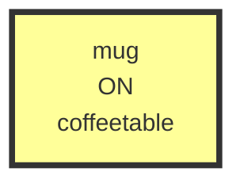
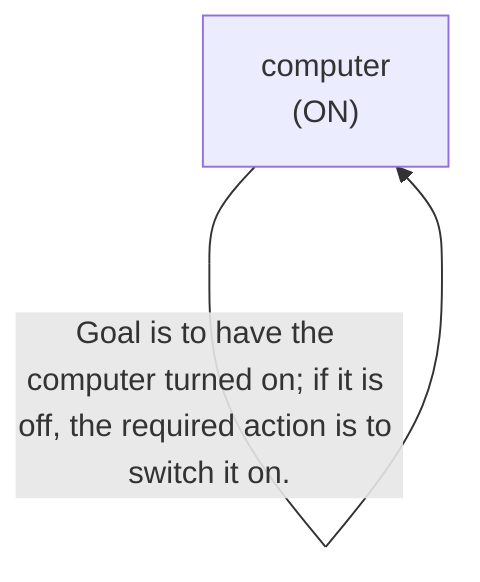
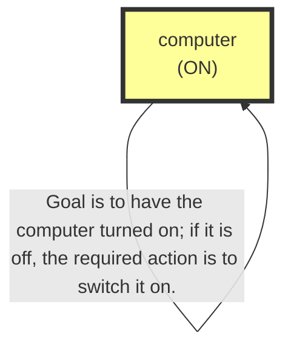

# 🚀 VirtualHome Agent Episode Log


### [GoalReasoner (Module A - Intent)] Output
```json
{
  "is_instruction_obviously_vague": false,
  "clarification_question": null,
  "target_object": "book",
  "location_hint": "sofa",
  "reasoning_chain": [
    {
      "question": "Why does the user want this object?",
      "answer": "To move an unorganized book to the sofa."
    },
    {
      "question": "Why is that important?",
      "answer": "To place the book in a more desired or organized location."
    },
    {
      "question": "What fundamental need does this fulfill?",
      "answer": "It supports tidying up and organizing the living space."
    },
    {
      "question": "Are there any deeper psychological or physical motivations?",
      "answer": "It may reduce clutter, make the space feel orderly, and keep the book accessible in a preferred resting area."
    }
  ],
  "deep_intent": "The user wants to organize a misplaced household item by moving it to a designated seating area.",
  "acceptable_alternatives_properties": [
    {
      "priority": 1,
      "description": "Other small portable reading materials or similar loose household items that can be tidied and placed on the sofa."
    },
    {
      "priority": 2,
      "description": "Other books or magazines that are out of place and can be grouped in the same resting area."
    },
    {
      "priority": 3,
      "description": "Other lightweight personal items found indoors that contribute to clutter and can be relocated for organization."
    },
    {
      "priority": 4,
      "description": "Nearby portable items that help restore order in the living space, even if they are not reading materials."
    }
  ]
}
```

### [RoboStateMultiTaskController] Output
```json
{
  "action": "[walk] <kitchen> (11)",
  "active_task_id": "task_2",
  "task_context": {
    "active_task_id": "task_2",
    "pending_task_ids": [
      "task_1",
      "task_3"
    ],
    "satisfied_task_ids": []
  },
  "source": "room_frontier"
}
```
## Step 0
- **Action**: `[walk] <kitchen> (11)`
- **Action Success**: `True`
- **Action Message**: {'0': {'message': 'Success'}}
- **Active Task**: `task_2`
- **Decision Source**: `room_frontier`
- **Task Progress**: E1_11=pending, E1_03=pending, E1_07=pending
- **SDG Status**:

- **Observed Items (38)**: floor(242), floor(243), floor(244), floor(245), ceiling(246), ceiling(247), ceiling(248), ceiling(249), wall(250), wall(251), wall(252), wall(253), door(254) [OPEN], ceilinglamp(255), tablelamp(256) [ON]...


### [RoboStateMultiTaskController] Output
```json
{
  "action": "[walk] <livingroom> (183)",
  "active_task_id": "task_2",
  "task_context": {
    "active_task_id": "task_2",
    "pending_task_ids": [
      "task_1",
      "task_3"
    ],
    "satisfied_task_ids": []
  },
  "source": "room_frontier"
}
```
## Step 1
- **Action**: `[walk] <livingroom> (183)`
- **Action Success**: `True`
- **Action Message**: {'0': {'message': 'Success'}}
- **Active Task**: `task_2`
- **Decision Source**: `room_frontier`
- **Task Progress**: E1_11=pending, E1_03=pending, E1_07=pending
- **SDG Status**:

- **Observed Items (192)**: floor(242), floor(243), floor(244), floor(245), ceiling(246), ceiling(247), ceiling(248), ceiling(249), wall(250), wall(251), wall(252), wall(253), door(254) [OPEN], ceilinglamp(255), tablelamp(256) [ON]...


### [PerceptionFilter] Output
```json
{
  "reasoning": "The goal is to place the book on the sofa. The only strictly necessary classes are the target object and the destination furniture. No tools or alternative functional items are required for simply moving the book.",
  "selected_classes": [
    "sofa",
    "book",
    "character",
    "door"
  ],
  "raw_class_count": 66
}
```

### [LLMExecutor] Output
```json
{
  "reasoning": "The SDG requires a book to be ON the sofa. I am already in the living room, and the closest valid target object available for the active task is book(105), which is already near the character. The sofa(214) is also in the living room and is the correct destination surface. To progress toward placing the book on the sofa, the next atomic step is to walk to the book so it can be grabbed afterward.",
  "satisfied_nodes": [],
  "current_node_focus": "N1",
  "mapped_variables": {
    "?Book": "book(105)",
    "?Destination": "sofa(214)"
  },
  "action": "[walk] <book> (105)"
}
```

### [RoboStateMultiTaskController] Output
```json
{
  "action": "[walk] <book> (105)",
  "active_task_id": "task_2",
  "task_context": {
    "active_task_id": "task_2",
    "pending_task_ids": [
      "task_1",
      "task_3"
    ],
    "satisfied_task_ids": []
  },
  "source": "llm_executor"
}
```
## Step 2
- **Action**: `[walk] <book> (105)`
- **Action Success**: `True`
- **Action Message**: {'0': {'message': 'Success'}}
- **Active Task**: `task_2`
- **Decision Source**: `llm_executor`
- **Task Progress**: E1_11=pending, E1_03=pending, E1_07=pending
- **SDG Status**:

- **Observed Items (13)**: door(254) [OPEN], book(275) [CLOSED], character(1), kitchen(11), livingroom(183), bedroom(241), bathroom(285), bedroom(346), door(47) [OPEN], sofa(214), book(229) [CLOSED], book(230) [CLOSED], book(105) [CLOSED]


### [PerceptionFilter] Output
```json
{
  "reasoning": "Reused cached class selection.",
  "selected_classes": [
    "sofa",
    "book",
    "character",
    "door"
  ],
  "raw_class_count": 66
}
```

### [LLMExecutor] Output
```json
{
  "reasoning": "The active task is to place a book on the sofa. The current graph shows book(105) is already in the livingroom and close to the character, while sofa(214) is also in the livingroom and close to the character. Since I need to put the book onto the sofa, the next required step is to walk explicitly to the destination sofa before any putback action. The closest valid target for satisfying N1 is sofa(214).",
  "satisfied_nodes": [],
  "current_node_focus": "N1",
  "mapped_variables": {},
  "action": "[walk] <sofa> (214)"
}
```

### [RoboStateMultiTaskController] Output
```json
{
  "action": "[walk] <sofa> (214)",
  "active_task_id": "task_2",
  "task_context": {
    "active_task_id": "task_2",
    "pending_task_ids": [
      "task_1",
      "task_3"
    ],
    "satisfied_task_ids": []
  },
  "source": "llm_executor"
}
```
## Step 3
- **Action**: `[walk] <sofa> (214)`
- **Action Success**: `True`
- **Action Message**: {'0': {'message': 'Success'}}
- **Active Task**: `task_2`
- **Decision Source**: `llm_executor`
- **Task Progress**: E1_11=pending, E1_03=pending, E1_07=pending
- **SDG Status**:

- **Observed Items (13)**: door(254) [OPEN], book(275) [CLOSED], character(1), kitchen(11), livingroom(183), bedroom(241), bathroom(285), bedroom(346), door(47) [OPEN], sofa(214), book(229) [CLOSED], book(230) [CLOSED], book(105) [CLOSED]


### [PerceptionFilter] Output
```json
{
  "reasoning": "Reused cached class selection.",
  "selected_classes": [
    "sofa",
    "book",
    "character",
    "door"
  ],
  "raw_class_count": 66
}
```

### [LLMExecutor] Output
```json
{
  "reasoning": "The active goal is to place a book on the sofa. The current graph shows book(105) is already in the living room and close to the character, and the sofa(214) is also close. Since the last action was already [walk] to the sofa, the next atomic step should be to pick up the target book that is nearest and available. Book(105) is the best bind for the required book because it matches the goal and is close to the agent. After this, the next step would be to walk to the sofa if not already adjacent enough for placement, then put it on the sofa.",
  "satisfied_nodes": [],
  "current_node_focus": "N1",
  "mapped_variables": {
    "?TargetBook": "book(105)",
    "?Destination": "sofa(214)"
  },
  "action": "[grab] <book> (105)"
}
```

### [RoboStateMultiTaskController] Output
```json
{
  "action": "[grab] <book> (105)",
  "active_task_id": "task_2",
  "task_context": {
    "active_task_id": "task_2",
    "pending_task_ids": [
      "task_1",
      "task_3"
    ],
    "satisfied_task_ids": []
  },
  "source": "llm_executor"
}
```
## Step 4
- **Action**: `[grab] <book> (105)`
- **Action Success**: `True`
- **Action Message**: {'0': {'message': 'Success'}}
- **Active Task**: `task_2`
- **Decision Source**: `llm_executor`
- **Task Progress**: E1_11=pending, E1_03=pending, E1_07=pending
- **SDG Status**:

- **Observed Items (13)**: door(254) [OPEN], book(275) [CLOSED], character(1), kitchen(11), livingroom(183), bedroom(241), bathroom(285), bedroom(346), door(47) [OPEN], sofa(214), book(229) [CLOSED], book(230) [CLOSED], book(105) [CLOSED]


### [PerceptionFilter] Output
```json
{
  "reasoning": "Reused cached class selection.",
  "selected_classes": [
    "sofa",
    "book",
    "character",
    "door"
  ],
  "raw_class_count": 66
}
```

### [LLMExecutor] Output
```json
{
  "reasoning": "The active task is to place the book on the sofa. The current graph shows the robot is already close to sofa(214) and is holding book(105). To satisfy N1, the next required atomic step is to place the held book onto the sofa surface. This directly establishes the ON(book, sofa) relation.",
  "satisfied_nodes": [],
  "current_node_focus": "N1",
  "mapped_variables": {},
  "action": "[putback] <book> (105) <sofa> (214)"
}
```

### [RoboStateMultiTaskController] Output
```json
{
  "action": "[putback] <book> (105) <sofa> (214)",
  "active_task_id": "task_2",
  "task_context": {
    "active_task_id": "task_2",
    "pending_task_ids": [
      "task_1",
      "task_3"
    ],
    "satisfied_task_ids": []
  },
  "source": "llm_executor"
}
```
## Step 5
- **Action**: `[putback] <book> (105) <sofa> (214)`
- **Action Success**: `True`
- **Action Message**: {'0': {'message': 'Success'}}
- **Active Task**: `task_2`
- **Decision Source**: `llm_executor`
- **Task Progress**: E1_11=pending, E1_03=done, E1_07=pending
- **SDG Status**:

- **Observed Items (13)**: door(254) [OPEN], book(275) [CLOSED], character(1), kitchen(11), livingroom(183), bedroom(241), bathroom(285), bedroom(346), door(47) [OPEN], sofa(214), book(229) [CLOSED], book(230) [CLOSED], book(105) [CLOSED]


### [GoalReasoner (Module A - Intent)] Output
```json
{
  "is_instruction_obviously_vague": false,
  "clarification_question": null,
  "target_object": "mug",
  "location_hint": "coffeetable",
  "reasoning_chain": [
    {
      "question": "Why does the user want this object?",
      "answer": "To keep the mug positioned on the coffeetable."
    },
    {
      "question": "Why is that important?",
      "answer": "To maintain the mug in a specific, stable location in the room."
    },
    {
      "question": "What fundamental need does this fulfill?",
      "answer": "To organize or store a household item in a designated place."
    },
    {
      "question": "Are there any deeper psychological or physical motivations?",
      "answer": "It may reduce clutter, make the mug easy to find, and support an orderly environment."
    }
  ],
  "deep_intent": "The user wants to keep a household item stored in a designated place.",
  "acceptable_alternatives_properties": [
    {
      "priority": 1,
      "description": "Other drinkware items, such as a cup or tumbler, kept on the same table"
    },
    {
      "priority": 2,
      "description": "Other small tabletop items used for beverages or serving, such as a glass or coaster set"
    },
    {
      "priority": 3,
      "description": "Other everyday household items that can be neatly placed on the table, such as a bowl or small dish"
    },
    {
      "priority": 4,
      "description": "Any small personal item that can be stored on a tabletop to keep the area organized"
    }
  ]
}
```

### [PerceptionFilter] Output
```json
{
  "reasoning": "The goal is to keep the mug on the coffeetable, so the only strictly necessary classes are the target mug and the location coffeetable. No additional tools or backup receptacles are required for this placement task.",
  "selected_classes": [
    "mug",
    "character",
    "coffeetable"
  ],
  "raw_class_count": 66
}
```

### [LLMExecutor] Output
```json
{
  "reasoning": "The active task is to place the mug on the coffeetable. The SDG node N1 is not yet satisfied because the mug is currently inside the kitchen, while the character is already close to the coffeetable. To satisfy the required proximity rule before interacting with the mug, the next step must be to walk to the mug's location in the kitchen. This does not repeat the immediately previous action and is the necessary prerequisite for grabbing the mug next.",
  "satisfied_nodes": [],
  "current_node_focus": "N1",
  "mapped_variables": {
    "?Object": "mug(384)",
    "?TargetSurface": "coffeetable(215)"
  },
  "action": "[walk] <mug> (384)"
}
```

### [RoboStateMultiTaskController] Output
```json
{
  "action": "[walk] <mug> (384)",
  "active_task_id": "task_3",
  "task_context": {
    "active_task_id": "task_3",
    "pending_task_ids": [
      "task_1"
    ],
    "satisfied_task_ids": [
      "task_2"
    ]
  },
  "source": "llm_executor"
}
```
## Step 6
- **Action**: `[walk] <mug> (384)`
- **Action Success**: `True`
- **Action Message**: {'0': {'message': 'Success'}}
- **Active Task**: `task_3`
- **Decision Source**: `llm_executor`
- **Task Progress**: E1_11=pending, E1_03=done, E1_07=pending
- **SDG Status**:

- **Observed Items (8)**: character(1), kitchen(11), livingroom(183), bedroom(241), bathroom(285), bedroom(346), mug(384), coffeetable(215)


### [PerceptionFilter] Output
```json
{
  "reasoning": "Reused cached class selection.",
  "selected_classes": [
    "mug",
    "character",
    "coffeetable"
  ],
  "raw_class_count": 66
}
```

### [LLMExecutor] Output
```json
{
  "reasoning": "The active goal is to have the mug ON the coffeetable. I am already close to the mug and holding nothing, but the mug is currently in the kitchen while the coffeetable is in the livingroom. To place the mug on the table, I must first pick it up before moving it. Since I just walked to the mug and do not need to repeat that walk, the next atomic step is to grab the mug.",
  "satisfied_nodes": [],
  "current_node_focus": "N1",
  "mapped_variables": {
    "?TargetObject": "mug(384)",
    "?TargetSurface": "coffeetable(215)"
  },
  "action": "[grab] <mug> (384)"
}
```

### [RoboStateMultiTaskController] Output
```json
{
  "action": "[grab] <mug> (384)",
  "active_task_id": "task_3",
  "task_context": {
    "active_task_id": "task_3",
    "pending_task_ids": [
      "task_1"
    ],
    "satisfied_task_ids": [
      "task_2"
    ]
  },
  "source": "llm_executor"
}
```
## Step 7
- **Action**: `[grab] <mug> (384)`
- **Action Success**: `True`
- **Action Message**: {'0': {'message': 'Success'}}
- **Active Task**: `task_3`
- **Decision Source**: `llm_executor`
- **Task Progress**: E1_11=pending, E1_03=done, E1_07=pending
- **SDG Status**:

- **Observed Items (8)**: character(1), kitchen(11), livingroom(183), bedroom(241), bathroom(285), bedroom(346), mug(384), coffeetable(215)


### [PerceptionFilter] Output
```json
{
  "reasoning": "Reused cached class selection.",
  "selected_classes": [
    "mug",
    "character",
    "coffeetable"
  ],
  "raw_class_count": 66
}
```

### [LLMExecutor] Output
```json
{
  "reasoning": "The active SDG requires the mug to be ON the coffeetable. I am already holding mug(384), and the coffeetable(215) is currently close to the character, so the next needed step is to place the mug onto that surface. Because putback/putin requires being at the destination and the table is a flat surface, the correct next atomic action is to put the mug back on the coffeetable.",
  "satisfied_nodes": [],
  "current_node_focus": "N1",
  "mapped_variables": {
    "?TargetSurface": "coffeetable(215)"
  },
  "action": "[putback] <mug> (384) <coffeetable> (215)"
}
```

### [RoboStateMultiTaskController] Output
```json
{
  "action": "[putback] <mug> (384) <coffeetable> (215)",
  "active_task_id": "task_3",
  "task_context": {
    "active_task_id": "task_3",
    "pending_task_ids": [
      "task_1"
    ],
    "satisfied_task_ids": [
      "task_2"
    ]
  },
  "source": "llm_executor"
}
```
## Step 8
- **Action**: `[putback] <mug> (384) <coffeetable> (215)`
- **Action Success**: `True`
- **Action Message**: {'0': {'message': 'Success'}}
- **Active Task**: `task_3`
- **Decision Source**: `llm_executor`
- **Task Progress**: E1_11=pending, E1_03=done, E1_07=done
- **SDG Status**:

- **Observed Items (8)**: character(1), kitchen(11), livingroom(183), bedroom(241), bathroom(285), bedroom(346), mug(384), coffeetable(215)


### [GoalReasoner (Module A - Intent)] Output
```json
{
  "is_instruction_obviously_vague": false,
  "clarification_question": null,
  "target_object": "computer",
  "location_hint": null,
  "reasoning_chain": [
    {
      "question": "Why does the user want this object?",
      "answer": "To have the computer in an on state."
    },
    {
      "question": "Why is that important?",
      "answer": "Because the computer cannot be used while it remains off."
    },
    {
      "question": "What fundamental need does this fulfill?",
      "answer": "To make the computer available for use."
    },
    {
      "question": "Are there any deeper psychological or physical motivations?",
      "answer": "The user likely wants to restore access to digital functionality and continue a task that requires the computer."
    }
  ],
  "deep_intent": "The user wants to restore access to computing functionality.",
  "acceptable_alternatives_properties": [
    {
      "priority": 1,
      "description": "Other powered-on computing devices that can provide the needed digital access, such as a laptop or tablet."
    },
    {
      "priority": 2,
      "description": "A different computer system or terminal that is already on and usable."
    },
    {
      "priority": 3,
      "description": "Any nearby device that can perform the same digital task, such as a desktop computer or all-in-one computer."
    },
    {
      "priority": 4,
      "description": "A shared household device with internet or app access that can temporarily fulfill the same function."
    }
  ]
}
```

### [RoboStateMultiTaskController] Output
```json
{
  "action": "[walk] <bathroom> (285)",
  "active_task_id": "task_1",
  "task_context": {
    "active_task_id": "task_1",
    "pending_task_ids": [],
    "satisfied_task_ids": [
      "task_2",
      "task_3"
    ]
  },
  "source": "room_frontier"
}
```
## Step 9
- **Action**: `[walk] <bathroom> (285)`
- **Action Success**: `True`
- **Action Message**: {'0': {'message': 'Success'}}
- **Active Task**: `task_1`
- **Decision Source**: `room_frontier`
- **Task Progress**: E1_11=pending, E1_03=done, E1_07=done
- **SDG Status**:

- **Observed Items (245)**: floor(242), floor(243), floor(244), floor(245), ceiling(246), ceiling(247), ceiling(248), ceiling(249), wall(250), wall(251), wall(252), wall(253), door(254) [OPEN], ceilinglamp(255), tablelamp(256) [ON]...


### [RoboStateMultiTaskController] Output
```json
{
  "action": "[walk] <bedroom> (346)",
  "active_task_id": "task_1",
  "task_context": {
    "active_task_id": "task_1",
    "pending_task_ids": [],
    "satisfied_task_ids": [
      "task_2",
      "task_3"
    ]
  },
  "source": "room_frontier"
}
```
## Step 10
- **Action**: `[walk] <bedroom> (346)`
- **Action Success**: `True`
- **Action Message**: {'0': {'message': 'Success'}}
- **Active Task**: `task_1`
- **Decision Source**: `room_frontier`
- **Task Progress**: E1_11=pending, E1_03=done, E1_07=done
- **SDG Status**:

- **Observed Items (305)**: floor(242), floor(243), floor(244), floor(245), ceiling(246), ceiling(247), ceiling(248), ceiling(249), wall(250), wall(251), wall(252), wall(253), door(254) [OPEN], ceilinglamp(255), tablelamp(256) [ON]...


### [PerceptionFilter] Output
```json
{
  "reasoning": "The goal is to restore the computer to an ON state. The only strictly necessary target class is the computer itself; no extra tools or locations are required by the SDG for turning it on, though nearby alternatives are not needed because the task is specifically about the computer state.",
  "selected_classes": [
    "character",
    "desk",
    "computer"
  ],
  "raw_class_count": 91
}
```

### [LLMExecutor] Output
```json
{
  "reasoning": "The active goal is to make the computer ON. The current graph shows computer(397) is in the same room as the character (both inside bedroom(346)) and has the HAS_SWITCH property, so the next needed step is to interact with it directly. Since switch actions require proximity, and the character is already in the correct room, the best next atomic action is to walk to the computer to satisfy proximity before switching it on.",
  "satisfied_nodes": [],
  "current_node_focus": "N1",
  "mapped_variables": {},
  "action": "[walk] <computer> (397)"
}
```

### [RoboStateMultiTaskController] Output
```json
{
  "action": "[walk] <computer> (397)",
  "active_task_id": "task_1",
  "task_context": {
    "active_task_id": "task_1",
    "pending_task_ids": [],
    "satisfied_task_ids": [
      "task_2",
      "task_3"
    ]
  },
  "source": "llm_executor"
}
```
## Step 11
- **Action**: `[walk] <computer> (397)`
- **Action Success**: `True`
- **Action Message**: {'0': {'message': 'Success'}}
- **Active Task**: `task_1`
- **Decision Source**: `llm_executor`
- **Task Progress**: E1_11=pending, E1_03=done, E1_07=done
- **SDG Status**:

- **Observed Items (9)**: desk(281) [CLOSED], character(1), kitchen(11), livingroom(183), bedroom(241), bathroom(285), bedroom(346), desk(393) [CLOSED], computer(397) [OFF]


### [PerceptionFilter] Output
```json
{
  "reasoning": "Reused cached class selection.",
  "selected_classes": [
    "character",
    "desk",
    "computer"
  ],
  "raw_class_count": 91
}
```

### [LLMExecutor] Output
```json
{
  "reasoning": "The active SDG has one node: computer(397) must be ON. The filtered graph shows the character is already CLOSE to computer(397), and the computer has HAS_SWITCH and is currently OFF. Since proximity is already satisfied, the correct next atomic action is to switch it on.",
  "satisfied_nodes": [],
  "current_node_focus": "N1",
  "mapped_variables": {},
  "action": "[switchon] <computer> (397)"
}
```

### [RoboStateMultiTaskController] Output
```json
{
  "action": "[switchon] <computer> (397)",
  "active_task_id": "task_1",
  "task_context": {
    "active_task_id": "task_1",
    "pending_task_ids": [],
    "satisfied_task_ids": [
      "task_2",
      "task_3"
    ]
  },
  "source": "llm_executor"
}
```
## Step 12
- **Action**: `[switchon] <computer> (397)`
- **Action Success**: `True`
- **Action Message**: Faked switch operation in Python layer (bypassed Unity failure)
- **Active Task**: `task_1`
- **Decision Source**: `llm_executor`
- **Task Progress**: E1_11=done, E1_03=done, E1_07=done
- **SDG Status**:

- **Observed Items (9)**: desk(281) [CLOSED], character(1), kitchen(11), livingroom(183), bedroom(241), bathroom(285), bedroom(346), desk(393) [CLOSED], computer(397) [OFF]

