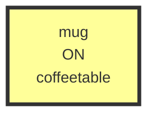
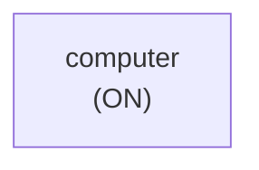
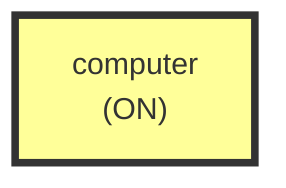

# 🚀 VirtualHome Agent Episode Log


### [GoalReasoner (Module A - Intent)] Output
```json
{
  "is_instruction_obviously_vague": false,
  "clarification_question": null,
  "target_object": "book",
  "location_hint": "sofa",
  "reasoning_chain": [
    {
      "question": "Why does the user want this object?",
      "answer": "To move it from an unorganized place to the sofa."
    },
    {
      "question": "Why is that important?",
      "answer": "To improve the organization or placement of the book within the room."
    },
    {
      "question": "What fundamental need does this fulfill?",
      "answer": "The user wants to organize or tidy the physical environment."
    },
    {
      "question": "Are there any deeper psychological or physical motivations?",
      "answer": "It may reduce clutter, make the book easier to find or use later, or create a more orderly space."
    }
  ],
  "deep_intent": "The user wants to organize the room by relocating an out-of-place item to the sofa area.",
  "acceptable_alternatives_properties": [
    {
      "priority": 1,
      "description": "Other similarly misplaced reading materials, such as magazines or notebooks, moved to the sofa area."
    },
    {
      "priority": 2,
      "description": "Other small household items that are out of place and can be tidied to a nearby seating area."
    },
    {
      "priority": 3,
      "description": "Any portable clutter items that can be gathered into a more orderly spot in the room."
    },
    {
      "priority": 4,
      "description": "Other household objects that can be relocated to reduce clutter, even if they are not reading materials."
    }
  ]
}
```

### [RoboStateMultiTaskController] Output
```json
{
  "action": "[walk] <kitchen> (11)",
  "active_task_id": "task_2",
  "task_context": {
    "active_task_id": "task_2",
    "pending_task_ids": [
      "task_1",
      "task_3"
    ],
    "satisfied_task_ids": []
  },
  "source": "room_frontier"
}
```
## Step 0
- **Action**: `[walk] <kitchen> (11)`
- **Action Success**: `True`
- **Action Message**: {'0': {'message': 'Success'}}
- **Active Task**: `task_2`
- **Decision Source**: `room_frontier`
- **Task Progress**: E1_11=pending, E1_03=pending, E1_07=pending
- **SDG Status**:

- **Observed Items (38)**: floor(242), floor(243), floor(244), floor(245), ceiling(246), ceiling(247), ceiling(248), ceiling(249), wall(250), wall(251), wall(252), wall(253), door(254) [OPEN], ceilinglamp(255), tablelamp(256) [ON]...


### [RoboStateMultiTaskController] Output
```json
{
  "action": "[walk] <livingroom> (183)",
  "active_task_id": "task_2",
  "task_context": {
    "active_task_id": "task_2",
    "pending_task_ids": [
      "task_1",
      "task_3"
    ],
    "satisfied_task_ids": []
  },
  "source": "room_frontier"
}
```
## Step 1
- **Action**: `[walk] <livingroom> (183)`
- **Action Success**: `True`
- **Action Message**: {'0': {'message': 'Success'}}
- **Active Task**: `task_2`
- **Decision Source**: `room_frontier`
- **Task Progress**: E1_11=pending, E1_03=pending, E1_07=pending
- **SDG Status**:

- **Observed Items (192)**: floor(242), floor(243), floor(244), floor(245), ceiling(246), ceiling(247), ceiling(248), ceiling(249), wall(250), wall(251), wall(252), wall(253), door(254) [OPEN], ceilinglamp(255), tablelamp(256) [ON]...


### [PerceptionFilter] Output
```json
{
  "reasoning": "The goal is to place the book on the sofa. The SDG explicitly requires the book and the sofa, so only those target/location classes are needed; no tools or alternative appliances are relevant.",
  "selected_classes": [
    "sofa",
    "book",
    "character"
  ],
  "raw_class_count": 66
}
```

### [LLMExecutor] Output
```json
{
  "reasoning": "The active goal is to place a book ON the sofa. We are currently in the living room, and the sofa is also in the living room. The closest suitable target book is book(105), which is already close to the character and is a valid grabbable item. Since we need to eventually put a held book onto the sofa, the next atomic step should be to move next to the book before grabbing it. This respects the proximity rule and progresses directly toward the SDG node N1.",
  "satisfied_nodes": [],
  "current_node_focus": "N1",
  "mapped_variables": {},
  "action": "[walk] <book> (105)"
}
```

### [RoboStateMultiTaskController] Output
```json
{
  "action": "[walk] <book> (105)",
  "active_task_id": "task_2",
  "task_context": {
    "active_task_id": "task_2",
    "pending_task_ids": [
      "task_1",
      "task_3"
    ],
    "satisfied_task_ids": []
  },
  "source": "llm_executor"
}
```
## Step 2
- **Action**: `[walk] <book> (105)`
- **Action Success**: `True`
- **Action Message**: {'0': {'message': 'Success'}}
- **Active Task**: `task_2`
- **Decision Source**: `llm_executor`
- **Task Progress**: E1_11=pending, E1_03=pending, E1_07=pending
- **SDG Status**:

- **Observed Items (11)**: book(275) [CLOSED], character(1), kitchen(11), livingroom(183), bedroom(241), bathroom(285), bedroom(346), sofa(214), book(229) [CLOSED], book(230) [CLOSED], book(105) [CLOSED]


### [PerceptionFilter] Output
```json
{
  "reasoning": "Reused cached class selection.",
  "selected_classes": [
    "sofa",
    "book",
    "character"
  ],
  "raw_class_count": 66
}
```

### [LLMExecutor] Output
```json
{
  "reasoning": "The active task is to place a book on the sofa. The current graph shows sofa(214) is in the living room and the character is already close to both the sofa and book(105). Since the book must be on the sofa and the next required step toward that relation is to pick up the book, I should grab the nearest/accessible matching book that is already close. Book(105) is the best choice because it is explicitly close to the character, whereas the other books are not. I will therefore grab book(105) as the immediate step before walking to the sofa and putting it down.",
  "satisfied_nodes": [],
  "current_node_focus": "N1",
  "mapped_variables": {},
  "action": "[grab] <book> (105)"
}
```

### [RoboStateMultiTaskController] Output
```json
{
  "action": "[grab] <book> (105)",
  "active_task_id": "task_2",
  "task_context": {
    "active_task_id": "task_2",
    "pending_task_ids": [
      "task_1",
      "task_3"
    ],
    "satisfied_task_ids": []
  },
  "source": "llm_executor"
}
```
## Step 3
- **Action**: `[grab] <book> (105)`
- **Action Success**: `True`
- **Action Message**: {'0': {'message': 'Success'}}
- **Active Task**: `task_2`
- **Decision Source**: `llm_executor`
- **Task Progress**: E1_11=pending, E1_03=pending, E1_07=pending
- **SDG Status**:

- **Observed Items (11)**: book(275) [CLOSED], character(1), kitchen(11), livingroom(183), bedroom(241), bathroom(285), bedroom(346), sofa(214), book(229) [CLOSED], book(230) [CLOSED], book(105) [CLOSED]


### [PerceptionFilter] Output
```json
{
  "reasoning": "Reused cached class selection.",
  "selected_classes": [
    "sofa",
    "book",
    "character"
  ],
  "raw_class_count": 66
}
```

### [LLMExecutor] Output
```json
{
  "reasoning": "The active goal is to place a book on the sofa. I am already holding book(105) and the sofa(214) is nearby, so the next required step is to move to the sofa before I can put the book down. This progresses directly toward satisfying N1 (book ON sofa).",
  "satisfied_nodes": [],
  "current_node_focus": "N1",
  "mapped_variables": {
    "?TargetSurface": "sofa(214)"
  },
  "action": "[walk] <sofa> (214)"
}
```

### [RoboStateMultiTaskController] Output
```json
{
  "action": "[walk] <sofa> (214)",
  "active_task_id": "task_2",
  "task_context": {
    "active_task_id": "task_2",
    "pending_task_ids": [
      "task_1",
      "task_3"
    ],
    "satisfied_task_ids": []
  },
  "source": "llm_executor"
}
```
## Step 4
- **Action**: `[walk] <sofa> (214)`
- **Action Success**: `True`
- **Action Message**: {'0': {'message': 'Success'}}
- **Active Task**: `task_2`
- **Decision Source**: `llm_executor`
- **Task Progress**: E1_11=pending, E1_03=pending, E1_07=pending
- **SDG Status**:

- **Observed Items (11)**: book(275) [CLOSED], character(1), kitchen(11), livingroom(183), bedroom(241), bathroom(285), bedroom(346), sofa(214), book(229) [CLOSED], book(230) [CLOSED], book(105) [CLOSED]


### [PerceptionFilter] Output
```json
{
  "reasoning": "Reused cached class selection.",
  "selected_classes": [
    "sofa",
    "book",
    "character"
  ],
  "raw_class_count": 66
}
```

### [LLMExecutor] Output
```json
{
  "reasoning": "The active SDG requires book(105) to be ON the sofa(214). I am already close to the sofa and holding book(105) in my right hand, so the next atomic step is to place the held book onto the sofa. This directly advances N1 toward satisfaction.",
  "satisfied_nodes": [],
  "current_node_focus": "N1",
  "mapped_variables": {},
  "action": "[putback] <book> (105) <sofa> (214)"
}
```

### [RoboStateMultiTaskController] Output
```json
{
  "action": "[putback] <book> (105) <sofa> (214)",
  "active_task_id": "task_2",
  "task_context": {
    "active_task_id": "task_2",
    "pending_task_ids": [
      "task_1",
      "task_3"
    ],
    "satisfied_task_ids": []
  },
  "source": "llm_executor"
}
```
## Step 5
- **Action**: `[putback] <book> (105) <sofa> (214)`
- **Action Success**: `True`
- **Action Message**: {'0': {'message': 'Success'}}
- **Active Task**: `task_2`
- **Decision Source**: `llm_executor`
- **Task Progress**: E1_11=pending, E1_03=done, E1_07=pending
- **SDG Status**:

- **Observed Items (11)**: book(275) [CLOSED], character(1), kitchen(11), livingroom(183), bedroom(241), bathroom(285), bedroom(346), sofa(214), book(229) [CLOSED], book(230) [CLOSED], book(105) [CLOSED]


### [GoalReasoner (Module A - Intent)] Output
```json
{
  "is_instruction_obviously_vague": false,
  "clarification_question": null,
  "target_object": "mug",
  "location_hint": "coffeetable",
  "reasoning_chain": [
    {
      "question": "Why does the user want this object?",
      "answer": "To keep the mug in a specific place rather than elsewhere."
    },
    {
      "question": "Why is that important?",
      "answer": "Because the user wants the mug to remain on the coffeetable consistently."
    },
    {
      "question": "What fundamental need does this fulfill?",
      "answer": "It fulfills a need for organization and predictable object placement in the living area."
    },
    {
      "question": "Are there any deeper psychological or physical motivations?",
      "answer": "It may support convenience, reduce clutter, or make the mug easy to find and use."
    }
  ],
  "deep_intent": "The user wants a household item kept in a consistent, designated location for organization and convenience.",
  "acceptable_alternatives_properties": [
    {
      "priority": 1,
      "description": "Other small everyday items that can be kept on the coffeetable, such as a cup, glass, or bottle."
    },
    {
      "priority": 2,
      "description": "Similar tabletop items used for daily convenience, such as a coaster, remote, or small dish."
    },
    {
      "priority": 3,
      "description": "Other regularly used household objects that benefit from fixed placement, such as a book or phone."
    },
    {
      "priority": 4,
      "description": "Any small portable item that the user wants kept in a specific spot for easy access and reduced clutter."
    }
  ]
}
```

### [PerceptionFilter] Output
```json
{
  "reasoning": "The goal and SDG require the mug and the coffeetable as the designated placement location. No tools or alternative appliances are needed because this is a placement/organization task, not a manipulation requiring other equipment.",
  "selected_classes": [
    "mug",
    "book",
    "character",
    "coffeetable"
  ],
  "raw_class_count": 66
}
```

### [LLMExecutor] Output
```json
{
  "reasoning": "The active goal is to have the mug on the coffeetable. The mug(384) is currently in the kitchen, while the coffeetable(215) is in the livingroom and the character is already close to the coffeetable. Since placing an object on a surface requires first walking to that surface before any putback action, the next step is to move to the coffeetable. The mug is not yet held, so this is only the first step toward satisfying N1.",
  "satisfied_nodes": [],
  "current_node_focus": "N1",
  "mapped_variables": {
    "?TargetSurface": "coffeetable(215)"
  },
  "action": "[walk] <coffeetable> (215)"
}
```

### [RoboStateMultiTaskController] Output
```json
{
  "action": "[walk] <coffeetable> (215)",
  "active_task_id": "task_3",
  "task_context": {
    "active_task_id": "task_3",
    "pending_task_ids": [
      "task_1"
    ],
    "satisfied_task_ids": [
      "task_2"
    ]
  },
  "source": "llm_executor"
}
```
## Step 6
- **Action**: `[walk] <coffeetable> (215)`
- **Action Success**: `True`
- **Action Message**: {'0': {'message': 'Success'}}
- **Active Task**: `task_3`
- **Decision Source**: `llm_executor`
- **Task Progress**: E1_11=pending, E1_03=done, E1_07=pending
- **SDG Status**:

- **Observed Items (12)**: book(275) [CLOSED], character(1), kitchen(11), livingroom(183), bedroom(241), bathroom(285), bedroom(346), mug(384), coffeetable(215), book(229) [CLOSED], book(230) [CLOSED], book(105) [CLOSED]


### [PerceptionFilter] Output
```json
{
  "reasoning": "Reused cached class selection.",
  "selected_classes": [
    "mug",
    "book",
    "character",
    "coffeetable"
  ],
  "raw_class_count": 66
}
```

### [LLMExecutor] Output
```json
{
  "reasoning": "The active SDG requires mug(384) to be ON coffeetable(215). The mug is currently in the kitchen, while the character is already close to the coffeetable in the living room. To place the mug on the table, I must first go to the mug before grabbing it; the next atomic step is therefore to walk to the mug. This progresses toward satisfying the ON relation by enabling a subsequent grab and putback onto the coffeetable.",
  "satisfied_nodes": [],
  "current_node_focus": "N1",
  "mapped_variables": {
    "?Object": "mug(384)",
    "?Target": "coffeetable(215)"
  },
  "action": "[walk] <mug> (384)"
}
```

### [RoboStateMultiTaskController] Output
```json
{
  "action": "[walk] <mug> (384)",
  "active_task_id": "task_3",
  "task_context": {
    "active_task_id": "task_3",
    "pending_task_ids": [
      "task_1"
    ],
    "satisfied_task_ids": [
      "task_2"
    ]
  },
  "source": "llm_executor"
}
```
## Step 7
- **Action**: `[walk] <mug> (384)`
- **Action Success**: `True`
- **Action Message**: {'0': {'message': 'Success'}}
- **Active Task**: `task_3`
- **Decision Source**: `llm_executor`
- **Task Progress**: E1_11=pending, E1_03=done, E1_07=pending
- **SDG Status**:

- **Observed Items (12)**: book(275) [CLOSED], character(1), kitchen(11), livingroom(183), bedroom(241), bathroom(285), bedroom(346), mug(384), coffeetable(215), book(229) [CLOSED], book(230) [CLOSED], book(105) [CLOSED]


### [PerceptionFilter] Output
```json
{
  "reasoning": "Reused cached class selection.",
  "selected_classes": [
    "mug",
    "book",
    "character",
    "coffeetable"
  ],
  "raw_class_count": 66
}
```

### [LLMExecutor] Output
```json
{
  "reasoning": "The active goal is to place the mug on the coffeetable. The character is already close to mug(384), but to put it on the coffeetable I must first hold it. The mug is grabbable and not dirty, so the next atomic step is to grab it. Current SDG node N1 is not yet satisfied because the mug is not on the coffeetable.",
  "satisfied_nodes": [],
  "current_node_focus": "N1",
  "mapped_variables": {},
  "action": "[grab] <mug> (384)"
}
```

### [RoboStateMultiTaskController] Output
```json
{
  "action": "[grab] <mug> (384)",
  "active_task_id": "task_3",
  "task_context": {
    "active_task_id": "task_3",
    "pending_task_ids": [
      "task_1"
    ],
    "satisfied_task_ids": [
      "task_2"
    ]
  },
  "source": "llm_executor"
}
```
## Step 8
- **Action**: `[grab] <mug> (384)`
- **Action Success**: `True`
- **Action Message**: {'0': {'message': 'Success'}}
- **Active Task**: `task_3`
- **Decision Source**: `llm_executor`
- **Task Progress**: E1_11=pending, E1_03=done, E1_07=pending
- **SDG Status**:

- **Observed Items (12)**: book(275) [CLOSED], character(1), kitchen(11), livingroom(183), bedroom(241), bathroom(285), bedroom(346), mug(384), coffeetable(215), book(229) [CLOSED], book(230) [CLOSED], book(105) [CLOSED]


### [PerceptionFilter] Output
```json
{
  "reasoning": "Reused cached class selection.",
  "selected_classes": [
    "mug",
    "book",
    "character",
    "coffeetable"
  ],
  "raw_class_count": 66
}
```

### [LLMExecutor] Output
```json
{
  "reasoning": "The active goal is to place the mug on the coffeetable. The mug is already held in the right hand, and the coffeetable is currently close to the character. Since putback requires being at the destination and the last action was grabbing the mug, the next atomic step should be to walk to the coffeetable before placing it.",
  "satisfied_nodes": [],
  "current_node_focus": "N1",
  "mapped_variables": {},
  "action": "[walk] <coffeetable> (215)"
}
```

### [RoboStateMultiTaskController] Output
```json
{
  "action": "[walk] <coffeetable> (215)",
  "active_task_id": "task_3",
  "task_context": {
    "active_task_id": "task_3",
    "pending_task_ids": [
      "task_1"
    ],
    "satisfied_task_ids": [
      "task_2"
    ]
  },
  "source": "llm_executor"
}
```
## Step 9
- **Action**: `[walk] <coffeetable> (215)`
- **Action Success**: `True`
- **Action Message**: {'0': {'message': 'Success'}}
- **Active Task**: `task_3`
- **Decision Source**: `llm_executor`
- **Task Progress**: E1_11=pending, E1_03=done, E1_07=pending
- **SDG Status**:

- **Observed Items (12)**: book(275) [CLOSED], character(1), kitchen(11), livingroom(183), bedroom(241), bathroom(285), bedroom(346), mug(384), coffeetable(215), book(229) [CLOSED], book(230) [CLOSED], book(105) [CLOSED]


### [PerceptionFilter] Output
```json
{
  "reasoning": "Reused cached class selection.",
  "selected_classes": [
    "mug",
    "book",
    "character",
    "coffeetable"
  ],
  "raw_class_count": 66
}
```

### [LLMExecutor] Output
```json
{
  "reasoning": "The active SDG requires the mug to be ON the coffeetable. The character is already close to both the mug and the coffeetable, and the mug is currently held in the right hand. The next atomic step should place the mug onto the coffeetable. Since the destination is a flat surface, [putback] is the correct action.",
  "satisfied_nodes": [],
  "current_node_focus": "N1",
  "mapped_variables": {
    "?Object": "mug(384)",
    "?Surface": "coffeetable(215)"
  },
  "action": "[putback] <mug> (384) <coffeetable> (215)"
}
```

### [RoboStateMultiTaskController] Output
```json
{
  "action": "[putback] <mug> (384) <coffeetable> (215)",
  "active_task_id": "task_3",
  "task_context": {
    "active_task_id": "task_3",
    "pending_task_ids": [
      "task_1"
    ],
    "satisfied_task_ids": [
      "task_2"
    ]
  },
  "source": "llm_executor"
}
```
## Step 10
- **Action**: `[putback] <mug> (384) <coffeetable> (215)`
- **Action Success**: `True`
- **Action Message**: {'0': {'message': 'Success'}}
- **Active Task**: `task_3`
- **Decision Source**: `llm_executor`
- **Task Progress**: E1_11=pending, E1_03=done, E1_07=done
- **SDG Status**:

- **Observed Items (12)**: book(275) [CLOSED], character(1), kitchen(11), livingroom(183), bedroom(241), bathroom(285), bedroom(346), mug(384), coffeetable(215), book(229) [CLOSED], book(230) [CLOSED], book(105) [CLOSED]


### [GoalReasoner (Module A - Intent)] Output
```json
{
  "is_instruction_obviously_vague": false,
  "clarification_question": null,
  "target_object": "computer",
  "location_hint": null,
  "reasoning_chain": [
    {
      "question": "Why does the user want this object?",
      "answer": "To have the computer on and usable."
    },
    {
      "question": "Why is that important?",
      "answer": "Because the computer being off prevents it from being used for the intended task."
    },
    {
      "question": "What fundamental need does this fulfill?",
      "answer": "Restoring access to a functioning computing device."
    },
    {
      "question": "Are there any deeper psychological or physical motivations?",
      "answer": "The user likely wants to continue work, interaction, or another activity that requires the computer to be powered on."
    }
  ],
  "deep_intent": "The user wants to ensure a computing device is powered on and available for use.",
  "acceptable_alternatives_properties": [
    {
      "priority": 1,
      "description": "Any other powered-on computer or similar computing device that can provide access to the needed functions."
    },
    {
      "priority": 2,
      "description": "Another available laptop, desktop, or tablet that can perform the same task."
    },
    {
      "priority": 3,
      "description": "A shared or replacement device with equivalent computing capability."
    },
    {
      "priority": 4,
      "description": "A non-computer method of completing the task, if the needed activity can be done another way."
    }
  ]
}
```

### [RoboStateMultiTaskController] Output
```json
{
  "action": "[walk] <bathroom> (285)",
  "active_task_id": "task_1",
  "task_context": {
    "active_task_id": "task_1",
    "pending_task_ids": [],
    "satisfied_task_ids": [
      "task_2",
      "task_3"
    ]
  },
  "source": "room_frontier"
}
```
## Step 11
- **Action**: `[walk] <bathroom> (285)`
- **Action Success**: `True`
- **Action Message**: {'0': {'message': 'Success'}}
- **Active Task**: `task_1`
- **Decision Source**: `room_frontier`
- **Task Progress**: E1_11=pending, E1_03=done, E1_07=done
- **SDG Status**:

- **Observed Items (245)**: floor(242), floor(243), floor(244), floor(245), ceiling(246), ceiling(247), ceiling(248), ceiling(249), wall(250), wall(251), wall(252), wall(253), door(254) [OPEN], ceilinglamp(255), tablelamp(256) [ON]...


### [RoboStateMultiTaskController] Output
```json
{
  "action": "[walk] <bedroom> (346)",
  "active_task_id": "task_1",
  "task_context": {
    "active_task_id": "task_1",
    "pending_task_ids": [],
    "satisfied_task_ids": [
      "task_2",
      "task_3"
    ]
  },
  "source": "room_frontier"
}
```
## Step 12
- **Action**: `[walk] <bedroom> (346)`
- **Action Success**: `True`
- **Action Message**: {'0': {'message': 'Success'}}
- **Active Task**: `task_1`
- **Decision Source**: `room_frontier`
- **Task Progress**: E1_11=pending, E1_03=done, E1_07=done
- **SDG Status**:

- **Observed Items (305)**: floor(242), floor(243), floor(244), floor(245), ceiling(246), ceiling(247), ceiling(248), ceiling(249), wall(250), wall(251), wall(252), wall(253), door(254) [OPEN], ceilinglamp(255), tablelamp(256) [ON]...


### [PerceptionFilter] Output
```json
{
  "reasoning": "The goal is to have a computer powered on and usable, so the only strictly necessary visible class is the computer itself. The SDG only requires the computer to be ON, with no extra tools or locations needed.",
  "selected_classes": [
    "character",
    "desk",
    "computer"
  ],
  "raw_class_count": 91
}
```

### [LLMExecutor] Output
```json
{
  "reasoning": "The active goal is to make the computer ON. The current graph shows computer(397) is in the same bedroom as the character and is OFF with HAS_SWITCH. Since switching requires proximity, and we are already inside bedroom(346) facing the computer, the next atomic step is to turn it on.",
  "satisfied_nodes": [],
  "current_node_focus": "N1",
  "mapped_variables": {},
  "action": "[switchon] <computer> (397)"
}
```

### [RoboStateMultiTaskController] Output
```json
{
  "action": "[walk] <computer> (397)",
  "active_task_id": "task_1",
  "task_context": {
    "active_task_id": "task_1",
    "pending_task_ids": [],
    "satisfied_task_ids": [
      "task_2",
      "task_3"
    ]
  },
  "source": "llm_executor_repaired"
}
```
## Step 13
- **Action**: `[walk] <computer> (397)`
- **Action Success**: `True`
- **Action Message**: {'0': {'message': 'Success'}}
- **Active Task**: `task_1`
- **Decision Source**: `llm_executor_repaired`
- **Task Progress**: E1_11=pending, E1_03=done, E1_07=done
- **SDG Status**:

- **Observed Items (9)**: desk(281) [CLOSED], character(1), kitchen(11), livingroom(183), bedroom(241), bathroom(285), bedroom(346), desk(393) [CLOSED], computer(397) [OFF]


### [PerceptionFilter] Output
```json
{
  "reasoning": "Reused cached class selection.",
  "selected_classes": [
    "character",
    "desk",
    "computer"
  ],
  "raw_class_count": 91
}
```

### [LLMExecutor] Output
```json
{
  "reasoning": "The active SDG requires computer(397) to be ON. The filtered graph shows the character is already CLOSE to computer(397), and the computer has HAS_SWITCH and is currently OFF. Therefore the next atomic step is to switch it on. No additional walking is needed.",
  "satisfied_nodes": [],
  "current_node_focus": "N1",
  "mapped_variables": {},
  "action": "[switchon] <computer> (397)"
}
```

### [RoboStateMultiTaskController] Output
```json
{
  "action": "[switchon] <computer> (397)",
  "active_task_id": "task_1",
  "task_context": {
    "active_task_id": "task_1",
    "pending_task_ids": [],
    "satisfied_task_ids": [
      "task_2",
      "task_3"
    ]
  },
  "source": "llm_executor"
}
```
## Step 14
- **Action**: `[switchon] <computer> (397)`
- **Action Success**: `True`
- **Action Message**: Faked switch operation in Python layer (bypassed Unity failure)
- **Active Task**: `task_1`
- **Decision Source**: `llm_executor`
- **Task Progress**: E1_11=done, E1_03=done, E1_07=done
- **SDG Status**:

- **Observed Items (9)**: desk(281) [CLOSED], character(1), kitchen(11), livingroom(183), bedroom(241), bathroom(285), bedroom(346), desk(393) [CLOSED], computer(397) [OFF]

