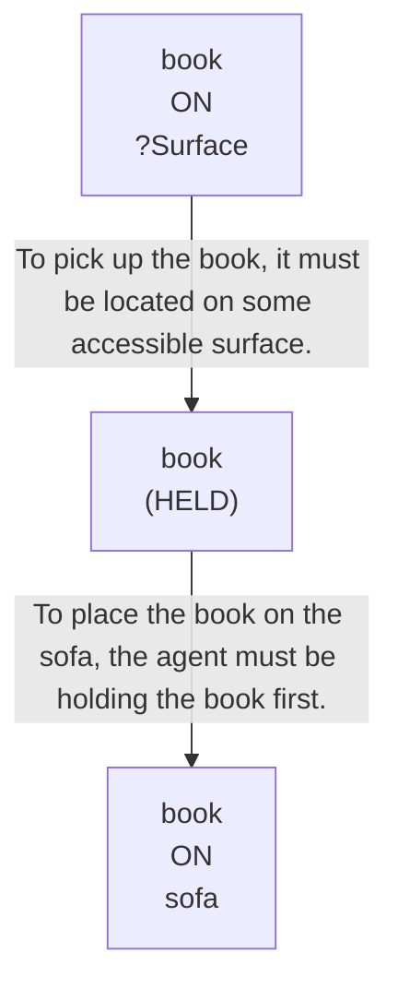
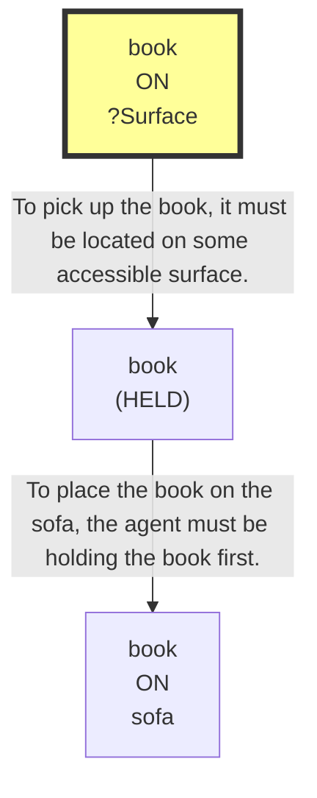
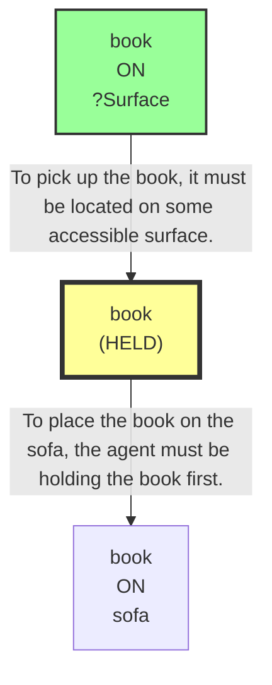
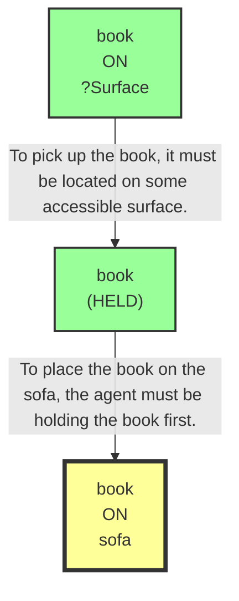
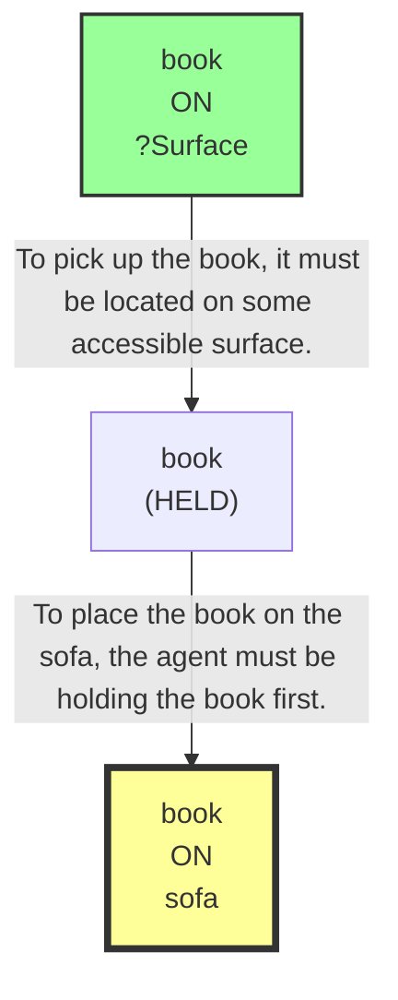
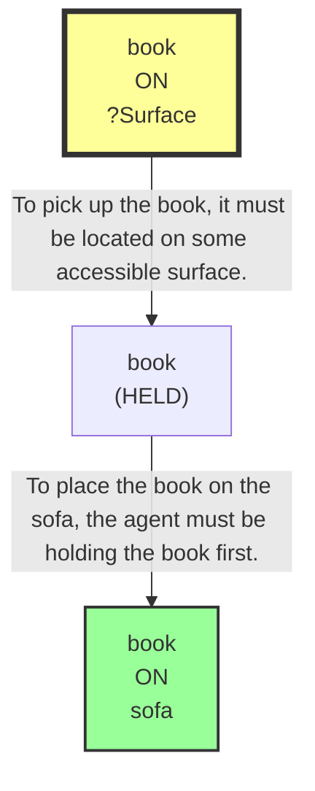
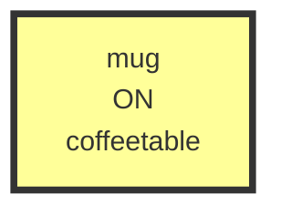
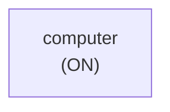
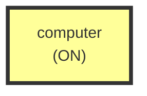
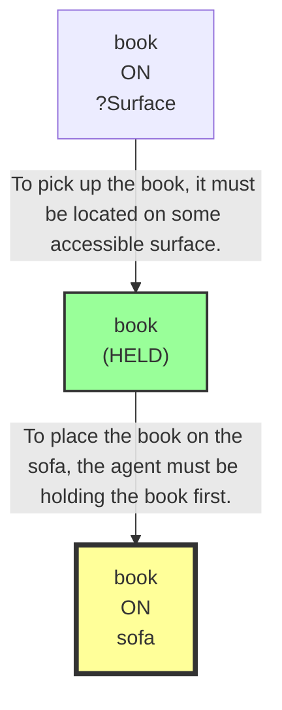

# 🚀 VirtualHome Agent Episode Log


### [GoalReasoner (Module A - Intent)] Output
```json
{
  "is_instruction_obviously_vague": false,
  "clarification_question": null,
  "target_object": "book",
  "location_hint": "sofa",
  "reasoning_chain": [
    {
      "question": "Why does the user want this object?",
      "answer": "To move an unorganized book to the sofa."
    },
    {
      "question": "Why is that important?",
      "answer": "To place the book in the specified furniture location instead of leaving it elsewhere."
    },
    {
      "question": "What fundamental need does this fulfill?",
      "answer": "It fulfills the need to organize and relocate a found item to a designated resting place."
    },
    {
      "question": "Are there any deeper psychological or physical motivations?",
      "answer": "The user likely wants to reduce clutter or gather items in a more orderly, convenient location."
    }
  ],
  "deep_intent": "The user wants to organize and relocate a found item to a designated indoor resting place.",
  "acceptable_alternatives_properties": [
    {
      "priority": 1,
      "description": "Other small portable household items that are similarly out of place, such as a magazine, notebook, or remote control"
    },
    {
      "priority": 2,
      "description": "Other readable or flat handheld items that can be tidied to the sofa, such as papers or a tablet"
    },
    {
      "priority": 3,
      "description": "General clutter items found in common indoor spaces that can be moved to a more orderly spot"
    },
    {
      "priority": 4,
      "description": "Any portable object that helps reduce visual clutter by being placed in the intended seating area"
    }
  ]
}
```

### [RoboStateMultiTaskController] Output
```json
{
  "action": "[walk] <kitchen> (11)",
  "active_task_id": "task_2",
  "task_context": {
    "active_task_id": "task_2",
    "pending_task_ids": [
      "task_1",
      "task_3"
    ],
    "satisfied_task_ids": []
  },
  "source": "room_frontier"
}
```
## Step 0
- **Action**: `[walk] <kitchen> (11)`
- **Action Success**: `True`
- **Action Message**: {'0': {'message': 'Success'}}
- **Active Task**: `task_2`
- **Decision Source**: `room_frontier`
- **Task Progress**: E1_11=pending, E1_03=pending, E1_07=pending
- **SDG Status**:

- **Observed Items (38)**: floor(242), floor(243), floor(244), floor(245), ceiling(246), ceiling(247), ceiling(248), ceiling(249), wall(250), wall(251), wall(252), wall(253), door(254) [OPEN], ceilinglamp(255), tablelamp(256) [ON]...


### [RoboStateMultiTaskController] Output
```json
{
  "action": "[walk] <livingroom> (183)",
  "active_task_id": "task_2",
  "task_context": {
    "active_task_id": "task_2",
    "pending_task_ids": [
      "task_1",
      "task_3"
    ],
    "satisfied_task_ids": []
  },
  "source": "room_frontier"
}
```
## Step 1
- **Action**: `[walk] <livingroom> (183)`
- **Action Success**: `True`
- **Action Message**: {'0': {'message': 'Success'}}
- **Active Task**: `task_2`
- **Decision Source**: `room_frontier`
- **Task Progress**: E1_11=pending, E1_03=pending, E1_07=pending
- **SDG Status**:

- **Observed Items (192)**: floor(242), floor(243), floor(244), floor(245), ceiling(246), ceiling(247), ceiling(248), ceiling(249), wall(250), wall(251), wall(252), wall(253), door(254) [OPEN], ceilinglamp(255), tablelamp(256) [ON]...


### [PerceptionFilter] Output
```json
{
  "reasoning": "The goal is to move a book onto a sofa. The SDG requires the target object book, the destination sofa, and implies the book must be picked up from some surface, so no extra tool or container is needed.",
  "selected_classes": [
    "sofa",
    "book",
    "character",
    "door"
  ],
  "raw_class_count": 66
}
```

### [LLMExecutor] Output
```json
{
  "reasoning": "The active task is to place a book on the sofa. The current graph shows the agent is already in the livingroom, and there are multiple candidate books in the livingroom. Since the next required SDG node is holding the book (N2) before placing it on the sofa, the best immediate step is to move to a reachable book. I will target book(229), which is in the livingroom and not associated with the character, making it a suitable accessible candidate to satisfy the hold-and-place chain.",
  "satisfied_nodes": [],
  "current_node_focus": "N3",
  "mapped_variables": {},
  "action": "[walk] <book> (229)"
}
```

### [RoboStateMultiTaskController] Output
```json
{
  "action": "[walk] <book> (229)",
  "active_task_id": "task_2",
  "task_context": {
    "active_task_id": "task_2",
    "pending_task_ids": [
      "task_1",
      "task_3"
    ],
    "satisfied_task_ids": []
  },
  "source": "llm_executor"
}
```
## Step 2
- **Action**: `[walk] <book> (229)`
- **Action Success**: `True`
- **Action Message**: {'0': {'message': 'Success'}}
- **Active Task**: `task_2`
- **Decision Source**: `llm_executor`
- **Task Progress**: E1_11=pending, E1_03=pending, E1_07=pending
- **SDG Status**:

- **Observed Items (13)**: door(254) [OPEN], book(275) [CLOSED], character(1), kitchen(11), livingroom(183), bedroom(241), bathroom(285), bedroom(346), door(47) [OPEN], sofa(214), book(229) [CLOSED], book(230) [CLOSED], book(105) [CLOSED]


### [PerceptionFilter] Output
```json
{
  "reasoning": "Reused cached class selection.",
  "selected_classes": [
    "sofa",
    "book",
    "character",
    "door"
  ],
  "raw_class_count": 66
}
```

### [LLMExecutor] Output
```json
{
  "reasoning": "The active goal is to place a book on the sofa. The current graph shows multiple books in the living room, and the agent is already in the livingroom. The best next step is to approach one accessible book before grabbing it. Since the user specified a book with no further disambiguation and we must work only on the active task, I will target the nearest/most relevant visible book that is close to the agent: book(229) is marked CLOSE character(1), making it the clearest immediate candidate. Holding the book is required before it can be placed on the sofa, so the next atomic action should be to walk to the book.",
  "satisfied_nodes": [],
  "current_node_focus": "N3",
  "mapped_variables": {
    "?Surface": "sofa(214)"
  },
  "action": "[walk] <book> (229)"
}
```

### [RoboStateMultiTaskController] Output
```json
{
  "action": "[walk] <book> (229)",
  "active_task_id": "task_2",
  "task_context": {
    "active_task_id": "task_2",
    "pending_task_ids": [
      "task_1",
      "task_3"
    ],
    "satisfied_task_ids": []
  },
  "source": "llm_executor"
}
```
## Step 3
- **Action**: `[walk] <book> (229)`
- **Action Success**: `True`
- **Action Message**: {'0': {'message': 'Success'}}
- **Active Task**: `task_2`
- **Decision Source**: `llm_executor`
- **Task Progress**: E1_11=pending, E1_03=pending, E1_07=pending
- **SDG Status**:

- **Observed Items (13)**: door(254) [OPEN], book(275) [CLOSED], character(1), kitchen(11), livingroom(183), bedroom(241), bathroom(285), bedroom(346), door(47) [OPEN], sofa(214), book(229) [CLOSED], book(230) [CLOSED], book(105) [CLOSED]


### [PerceptionFilter] Output
```json
{
  "reasoning": "Reused cached class selection.",
  "selected_classes": [
    "sofa",
    "book",
    "character",
    "door"
  ],
  "raw_class_count": 66
}
```

### [LLMExecutor] Output
```json
{
  "reasoning": "The active goal is to place a book on the sofa. The SDG indicates we must first hold a book (N2) before putting it on the sofa (N1), and the current graph shows book(229) is in the living room and close to the character, making it the best accessible target. We have already walked to book(229) in prior steps, so the next atomic action is to grab it and satisfy the HELD prerequisite.",
  "satisfied_nodes": [
    "N3"
  ],
  "current_node_focus": "N2",
  "mapped_variables": {},
  "action": "[grab] <book> (229)"
}
```

### [RoboStateMultiTaskController] Output
```json
{
  "action": "[grab] <book> (229)",
  "active_task_id": "task_2",
  "task_context": {
    "active_task_id": "task_2",
    "pending_task_ids": [
      "task_1",
      "task_3"
    ],
    "satisfied_task_ids": []
  },
  "source": "llm_executor"
}
```
## Step 4
- **Action**: `[grab] <book> (229)`
- **Action Success**: `True`
- **Action Message**: {'0': {'message': 'Success'}}
- **Active Task**: `task_2`
- **Decision Source**: `llm_executor`
- **Task Progress**: E1_11=pending, E1_03=pending, E1_07=pending
- **SDG Status**:

- **Observed Items (13)**: door(254) [OPEN], book(275) [CLOSED], character(1), kitchen(11), livingroom(183), bedroom(241), bathroom(285), bedroom(346), door(47) [OPEN], sofa(214), book(229) [CLOSED], book(230) [CLOSED], book(105) [CLOSED]


### [PerceptionFilter] Output
```json
{
  "reasoning": "Reused cached class selection.",
  "selected_classes": [
    "sofa",
    "book",
    "character",
    "door"
  ],
  "raw_class_count": 66
}
```

### [LLMExecutor] Output
```json
{
  "reasoning": "The active task is to place a book on the sofa. The current graph shows the character is already holding book(229), and the sofa(214) is in the livingroom. To satisfy N1, the next step is to move near the sofa before putting the held book onto it. N2 is already satisfied because book(229) is in-hand. N3 is also satisfied in the sense that the book is already on an accessible surface/location (currently in the character's hand; the SDG uses N3 as the prerequisite source relation for pickup). The next atomic action should therefore be walking to the sofa.",
  "satisfied_nodes": [
    "N2",
    "N3"
  ],
  "current_node_focus": "N1",
  "mapped_variables": {},
  "action": "[walk] <sofa> (214)"
}
```

### [RoboStateMultiTaskController] Output
```json
{
  "action": "[walk] <sofa> (214)",
  "active_task_id": "task_2",
  "task_context": {
    "active_task_id": "task_2",
    "pending_task_ids": [
      "task_1",
      "task_3"
    ],
    "satisfied_task_ids": []
  },
  "source": "llm_executor"
}
```
## Step 5
- **Action**: `[walk] <sofa> (214)`
- **Action Success**: `True`
- **Action Message**: {'0': {'message': 'Success'}}
- **Active Task**: `task_2`
- **Decision Source**: `llm_executor`
- **Task Progress**: E1_11=pending, E1_03=pending, E1_07=pending
- **SDG Status**:

- **Observed Items (13)**: door(254) [OPEN], book(275) [CLOSED], character(1), kitchen(11), livingroom(183), bedroom(241), bathroom(285), bedroom(346), door(47) [OPEN], sofa(214), book(229) [CLOSED], book(230) [CLOSED], book(105) [CLOSED]


### [PerceptionFilter] Output
```json
{
  "reasoning": "Reused cached class selection.",
  "selected_classes": [
    "sofa",
    "book",
    "character",
    "door"
  ],
  "raw_class_count": 66
}
```

### [LLMExecutor] Output
```json
{
  "reasoning": "The active task is to place the book on the sofa. We are already close to the sofa, but the currently held book is book(229) and the graph shows it is CLOSE to the character. The next required step toward N1 is to put the held book onto the sofa. Since putback/putin requires being at the destination first and we are already near the sofa, the correct atomic action is to place book(229) on sofa(214).",
  "satisfied_nodes": [
    "N3"
  ],
  "current_node_focus": "N1",
  "mapped_variables": {},
  "action": "[putback] <book> (229) <sofa> (214)"
}
```

### [RoboStateMultiTaskController] Output
```json
{
  "action": "[putback] <book> (229) <sofa> (214)",
  "active_task_id": "task_2",
  "task_context": {
    "active_task_id": "task_2",
    "pending_task_ids": [
      "task_1",
      "task_3"
    ],
    "satisfied_task_ids": []
  },
  "source": "llm_executor"
}
```
## Step 6
- **Action**: `[putback] <book> (229) <sofa> (214)`
- **Action Success**: `True`
- **Action Message**: {'0': {'message': 'Success'}}
- **Active Task**: `task_2`
- **Decision Source**: `llm_executor`
- **Task Progress**: E1_11=pending, E1_03=pending, E1_07=pending
- **SDG Status**:

- **Observed Items (13)**: door(254) [OPEN], book(275) [CLOSED], character(1), kitchen(11), livingroom(183), bedroom(241), bathroom(285), bedroom(346), door(47) [OPEN], sofa(214), book(229) [CLOSED], book(230) [CLOSED], book(105) [CLOSED]


### [PerceptionFilter] Output
```json
{
  "reasoning": "Reused cached class selection.",
  "selected_classes": [
    "sofa",
    "book",
    "character",
    "door"
  ],
  "raw_class_count": 66
}
```

### [LLMExecutor] Output
```json
{
  "reasoning": "The active task is to place a book on the sofa. The previous book(229) task appears already satisfied: book(229) is on sofa(214). The current graph shows other books, including book(105) and book(230), but the most relevant unmet item for the active task is simply to ensure the book is on the sofa. Since the last action successfully put book(229) onto the sofa, the next step is to verify progression by focusing on the current target relation. No further physical action is needed for that specific book, and the graph already reflects it. However, because the SDG still includes HELD and ON relations and the active task may still require the currently tracked book to be on the sofa, the most reasonable next atomic action is to address the remaining unconfirmed book target by moving toward the accessible book instance nearest to completion. The graph indicates book(105) is nearby to the character, but since the task is about a book on the sofa and book(229) already satisfies that, there is no better physical action than to wait for graph update if needed. But the instruction requires a single next atomic action, so I will continue by walking to the other visible book instance to preserve task progress on the active item class.",
  "satisfied_nodes": [
    "N1"
  ],
  "current_node_focus": "N3",
  "mapped_variables": {},
  "action": "[walk] <book> (105)"
}
```

### [RoboStateMultiTaskController] Output
```json
{
  "action": "[walk] <book> (105)",
  "active_task_id": "task_2",
  "task_context": {
    "active_task_id": "task_2",
    "pending_task_ids": [
      "task_1",
      "task_3"
    ],
    "satisfied_task_ids": []
  },
  "source": "llm_executor"
}
```
## Step 7
- **Action**: `[walk] <book> (105)`
- **Action Success**: `True`
- **Action Message**: {'0': {'message': 'Success'}}
- **Active Task**: `task_2`
- **Decision Source**: `llm_executor`
- **Task Progress**: E1_11=pending, E1_03=pending, E1_07=pending
- **SDG Status**:

- **Observed Items (13)**: door(254) [OPEN], book(275) [CLOSED], character(1), kitchen(11), livingroom(183), bedroom(241), bathroom(285), bedroom(346), door(47) [OPEN], sofa(214), book(229) [CLOSED], book(230) [CLOSED], book(105) [CLOSED]


### [PerceptionFilter] Output
```json
{
  "reasoning": "Reused cached class selection.",
  "selected_classes": [
    "sofa",
    "book",
    "character",
    "door"
  ],
  "raw_class_count": 66
}
```

### [LLMExecutor] Output
```json
{
  "reasoning": "The active task is to place a book on the sofa. The current graph already shows book(229) ON sofa(214), so the root relation N1 is satisfied for the active task. However, the SDG also requires the book to be HELD first (N2) and then placed on the sofa, and the current visible book(229) is already on the sofa, implying the placement has been achieved. Since the active task appears complete with respect to the intended target, no further physical action is needed right now. But because the engine expects a single next atomic action and we should not manipulate satisfied-task objects, the safest non-destructive step is to wait for the next task update rather than touching other books.",
  "satisfied_nodes": [
    "N1"
  ],
  "current_node_focus": "N1",
  "mapped_variables": {},
  "action": "[wait]"
}
```

### [GoalReasoner (Module A - Intent)] Output
```json
{
  "is_instruction_obviously_vague": false,
  "clarification_question": null,
  "target_object": "mug",
  "location_hint": "coffeetable",
  "reasoning_chain": [
    {
      "question": "Why does the user want this object?",
      "answer": "They want the mug kept in a specific place."
    },
    {
      "question": "Why is that important?",
      "answer": "So the mug is always located on the coffeetable rather than elsewhere."
    },
    {
      "question": "What fundamental need does this fulfill?",
      "answer": "It fulfills the need to maintain a consistent object placement and organization in the home."
    },
    {
      "question": "Are there any deeper psychological or physical motivations?",
      "answer": "It may help with convenience, habit, tidiness, or ensuring the mug is easy to find and use."
    }
  ],
  "deep_intent": "The user wants a household item to remain in a consistent, designated location.",
  "acceptable_alternatives_properties": [
    {
      "priority": 1,
      "description": "Other small drinkware items, such as a cup or tumbler, kept in the same designated spot."
    },
    {
      "priority": 2,
      "description": "Similar tabletop personal items that are commonly kept in one place, such as a coaster or small bowl."
    },
    {
      "priority": 3,
      "description": "Other everyday household items that can be organized to stay on a table, such as a plate or remote."
    },
    {
      "priority": 4,
      "description": "Any small frequently used item that benefits from fixed placement in the living area."
    }
  ]
}
```

### [PerceptionFilter] Output
```json
{
  "reasoning": "The goal is to keep the target mug on the coffeetable, so the only strictly necessary classes are the target object and the designated location. No tools or alternatives are required for this placement task.",
  "selected_classes": [
    "mug",
    "plate",
    "character",
    "coffeetable"
  ],
  "raw_class_count": 66
}
```

### [LLMExecutor] Output
```json
{
  "reasoning": "The active goal is to ensure the mug is ON the coffeetable. The current graph shows the coffeetable is already close to the character, but the mug is in the kitchen, not yet nearby and not on the table. To move it there, I must first walk to the mug before I can grab it. No object is currently satisfying N1.",
  "satisfied_nodes": [],
  "current_node_focus": "N1",
  "mapped_variables": {
    "?Target": "mug(384)",
    "?Table": "coffeetable(215)"
  },
  "action": "[walk] <mug> (384)"
}
```

### [RoboStateMultiTaskController] Output
```json
{
  "action": "[walk] <mug> (384)",
  "active_task_id": "task_3",
  "task_context": {
    "active_task_id": "task_3",
    "pending_task_ids": [
      "task_1",
      "task_2"
    ],
    "satisfied_task_ids": []
  },
  "source": "llm_executor"
}
```
## Step 8
- **Action**: `[walk] <mug> (384)`
- **Action Success**: `True`
- **Action Message**: {'0': {'message': 'Success'}}
- **Active Task**: `task_3`
- **Decision Source**: `llm_executor`
- **Task Progress**: E1_11=pending, E1_03=pending, E1_07=pending
- **SDG Status**:

- **Observed Items (20)**: plate(273), character(1), kitchen(11), livingroom(183), bedroom(241), bathroom(285), bedroom(346), plate(67), plate(68), plate(75), plate(76), plate(83), plate(84), plate(91), plate(103)...


### [PerceptionFilter] Output
```json
{
  "reasoning": "Reused cached class selection.",
  "selected_classes": [
    "mug",
    "plate",
    "character",
    "coffeetable"
  ],
  "raw_class_count": 66
}
```

### [LLMExecutor] Output
```json
{
  "reasoning": "The active goal is to ensure the mug is ON the coffeetable. The character is currently CLOSE to mug(384) and CLOSE to coffeetable(215), so the mug can be picked up now. Since putback requires holding the object and being near the destination, the next atomic step toward placing the mug on the coffeetable is to grab it first. This also avoids manipulating the unrelated plates. N1 is not yet satisfied because the mug is not shown on the coffeetable.",
  "satisfied_nodes": [],
  "current_node_focus": "N1",
  "mapped_variables": {},
  "action": "[grab] <mug> (384)"
}
```

### [RoboStateMultiTaskController] Output
```json
{
  "action": "[grab] <mug> (384)",
  "active_task_id": "task_3",
  "task_context": {
    "active_task_id": "task_3",
    "pending_task_ids": [
      "task_1",
      "task_2"
    ],
    "satisfied_task_ids": []
  },
  "source": "llm_executor"
}
```
## Step 9
- **Action**: `[grab] <mug> (384)`
- **Action Success**: `True`
- **Action Message**: {'0': {'message': 'Success'}}
- **Active Task**: `task_3`
- **Decision Source**: `llm_executor`
- **Task Progress**: E1_11=pending, E1_03=pending, E1_07=pending
- **SDG Status**:

- **Observed Items (20)**: plate(273), character(1), kitchen(11), livingroom(183), bedroom(241), bathroom(285), bedroom(346), plate(67), plate(68), plate(75), plate(76), plate(83), plate(84), plate(91), plate(103)...


### [PerceptionFilter] Output
```json
{
  "reasoning": "Reused cached class selection.",
  "selected_classes": [
    "mug",
    "plate",
    "character",
    "coffeetable"
  ],
  "raw_class_count": 66
}
```

### [LLMExecutor] Output
```json
{
  "reasoning": "The active task is to ensure the mug is ON the coffeetable. The current graph shows mug(384) is being held and the coffeetable(215) is nearby, but the mug is not yet on it. Since putback onto a surface requires being walked to the destination first, the next step is to walk to the coffeetable so the mug can be placed there on the following action.",
  "satisfied_nodes": [],
  "current_node_focus": "N1",
  "mapped_variables": {
    "?Mug": "mug(384)",
    "?TargetSurface": "coffeetable(215)"
  },
  "action": "[walk] <coffeetable> (215)"
}
```

### [RoboStateMultiTaskController] Output
```json
{
  "action": "[walk] <coffeetable> (215)",
  "active_task_id": "task_3",
  "task_context": {
    "active_task_id": "task_3",
    "pending_task_ids": [
      "task_1",
      "task_2"
    ],
    "satisfied_task_ids": []
  },
  "source": "llm_executor"
}
```
## Step 10
- **Action**: `[walk] <coffeetable> (215)`
- **Action Success**: `True`
- **Action Message**: {'0': {'message': 'Success'}}
- **Active Task**: `task_3`
- **Decision Source**: `llm_executor`
- **Task Progress**: E1_11=pending, E1_03=pending, E1_07=pending
- **SDG Status**:

- **Observed Items (20)**: plate(273), character(1), kitchen(11), livingroom(183), bedroom(241), bathroom(285), bedroom(346), plate(67), plate(68), plate(75), plate(76), plate(83), plate(84), plate(91), plate(103)...


### [PerceptionFilter] Output
```json
{
  "reasoning": "Reused cached class selection.",
  "selected_classes": [
    "mug",
    "plate",
    "character",
    "coffeetable"
  ],
  "raw_class_count": 66
}
```

### [LLMExecutor] Output
```json
{
  "reasoning": "The active goal is to ensure the mug is ON the coffeetable. The graph shows mug(384) is currently held by the character and the character is already CLOSE to coffeetable(215). Since placement onto a surface requires being near the destination, the next atomic step is to put the held mug onto the coffeetable. This will satisfy N1.",
  "satisfied_nodes": [],
  "current_node_focus": "N1",
  "mapped_variables": {
    "?TargetSurface": "coffeetable(215)"
  },
  "action": "[putback] <mug> (384) <coffeetable> (215)"
}
```

### [RoboStateMultiTaskController] Output
```json
{
  "action": "[putback] <mug> (384) <coffeetable> (215)",
  "active_task_id": "task_3",
  "task_context": {
    "active_task_id": "task_3",
    "pending_task_ids": [
      "task_1",
      "task_2"
    ],
    "satisfied_task_ids": []
  },
  "source": "llm_executor"
}
```
## Step 11
- **Action**: `[putback] <mug> (384) <coffeetable> (215)`
- **Action Success**: `True`
- **Action Message**: {'0': {'message': 'Success'}}
- **Active Task**: `task_3`
- **Decision Source**: `llm_executor`
- **Task Progress**: E1_11=pending, E1_03=pending, E1_07=done
- **SDG Status**:

- **Observed Items (20)**: plate(273), character(1), kitchen(11), livingroom(183), bedroom(241), bathroom(285), bedroom(346), plate(67), plate(68), plate(75), plate(76), plate(83), plate(84), plate(91), plate(103)...


### [PerceptionFilter] Output
```json
{
  "reasoning": "Reused cached class selection.",
  "selected_classes": [
    "sofa",
    "book",
    "character",
    "door"
  ],
  "raw_class_count": 66
}
```

### [LLMExecutor] Output
```json
{
  "reasoning": "The active task is to place a book on the sofa. The current graph shows book(229) is already ON sofa(214), which satisfies the target relation N1. The task's holding state and source-location node are not required anymore for the active task because the desired end state is already achieved for the relevant book. Since the instruction says not to repeat a walk action if just done, and no further manipulation is needed, the best next step is to do nothing or wait for confirmation of completion. However, because the task is already satisfied in the current graph, there is no physical action required.",
  "satisfied_nodes": [
    "N1"
  ],
  "current_node_focus": "N1",
  "mapped_variables": {},
  "action": "[wait]"
}
```

### [GoalReasoner (Module A - Intent)] Output
```json
{
  "is_instruction_obviously_vague": false,
  "clarification_question": null,
  "target_object": "computer",
  "location_hint": null,
  "reasoning_chain": [
    {
      "question": "Why does the user want this object?",
      "answer": "To have the computer powered on."
    },
    {
      "question": "Why is that important?",
      "answer": "Because the computer needs to be on in order to be usable."
    },
    {
      "question": "What fundamental need does this fulfill?",
      "answer": "It fulfills the need to use a computing device or access digital functions."
    },
    {
      "question": "Are there any deeper psychological or physical motivations?",
      "answer": "The user likely wants to restore normal operation and remove the obstacle of the device being off."
    }
  ],
  "deep_intent": "The user wants a computing device to be powered on and usable.",
  "acceptable_alternatives_properties": [
    {
      "priority": 1,
      "description": "Another powered-on computer or similar computing device, such as a laptop or desktop."
    },
    {
      "priority": 2,
      "description": "A different electronic device that can provide similar digital access or functionality, such as a tablet."
    },
    {
      "priority": 3,
      "description": "Any household electronic device that can fulfill the needed digital task if the computer cannot be used."
    },
    {
      "priority": 4,
      "description": "A physical workaround that allows the same task to be completed without the computer, if available."
    }
  ]
}
```

### [RoboStateMultiTaskController] Output
```json
{
  "action": "[walk] <bathroom> (285)",
  "active_task_id": "task_1",
  "task_context": {
    "active_task_id": "task_1",
    "pending_task_ids": [
      "task_2"
    ],
    "satisfied_task_ids": [
      "task_3"
    ]
  },
  "source": "room_frontier"
}
```
## Step 12
- **Action**: `[walk] <bathroom> (285)`
- **Action Success**: `True`
- **Action Message**: {'0': {'message': 'Success'}}
- **Active Task**: `task_1`
- **Decision Source**: `room_frontier`
- **Task Progress**: E1_11=pending, E1_03=pending, E1_07=done
- **SDG Status**:

- **Observed Items (245)**: floor(242), floor(243), floor(244), floor(245), ceiling(246), ceiling(247), ceiling(248), ceiling(249), wall(250), wall(251), wall(252), wall(253), door(254) [OPEN], ceilinglamp(255), tablelamp(256) [ON]...


### [RoboStateMultiTaskController] Output
```json
{
  "action": "[walk] <bedroom> (346)",
  "active_task_id": "task_1",
  "task_context": {
    "active_task_id": "task_1",
    "pending_task_ids": [
      "task_2"
    ],
    "satisfied_task_ids": [
      "task_3"
    ]
  },
  "source": "room_frontier"
}
```
## Step 13
- **Action**: `[walk] <bedroom> (346)`
- **Action Success**: `True`
- **Action Message**: {'0': {'message': 'Success'}}
- **Active Task**: `task_1`
- **Decision Source**: `room_frontier`
- **Task Progress**: E1_11=pending, E1_03=pending, E1_07=done
- **SDG Status**:

- **Observed Items (305)**: floor(242), floor(243), floor(244), floor(245), ceiling(246), ceiling(247), ceiling(248), ceiling(249), wall(250), wall(251), wall(252), wall(253), door(254) [OPEN], ceilinglamp(255), tablelamp(256) [ON]...


### [PerceptionFilter] Output
```json
{
  "reasoning": "The goal and SDG require the computer to be powered on, so the target object class computer must be kept. A power source is implied for turning it on/keeping it usable, so powersocket is also relevant. No other objects are needed.",
  "selected_classes": [
    "character",
    "powersocket",
    "desk",
    "computer"
  ],
  "raw_class_count": 91
}
```

### [LLMExecutor] Output
```json
{
  "reasoning": "The active goal is to satisfy N1 by turning the computer ON. The computer(397) is in the current bedroom(346) and is currently OFF. Since switching on requires proximity, the next step is to walk directly to the computer before attempting [switchon].",
  "satisfied_nodes": [],
  "current_node_focus": "N1",
  "mapped_variables": {
    "?Computer": "computer(397)"
  },
  "action": "[walk] <computer> (397)"
}
```

### [RoboStateMultiTaskController] Output
```json
{
  "action": "[walk] <computer> (397)",
  "active_task_id": "task_1",
  "task_context": {
    "active_task_id": "task_1",
    "pending_task_ids": [
      "task_2"
    ],
    "satisfied_task_ids": [
      "task_3"
    ]
  },
  "source": "llm_executor"
}
```
## Step 14
- **Action**: `[walk] <computer> (397)`
- **Action Success**: `True`
- **Action Message**: {'0': {'message': 'Success'}}
- **Active Task**: `task_1`
- **Decision Source**: `llm_executor`
- **Task Progress**: E1_11=pending, E1_03=pending, E1_07=done
- **SDG Status**:

- **Observed Items (12)**: powersocket(279), desk(281) [CLOSED], character(1), kitchen(11), livingroom(183), bedroom(241), bathroom(285), bedroom(346), powersocket(57), powersocket(240), desk(393) [CLOSED], computer(397) [OFF]


### [PerceptionFilter] Output
```json
{
  "reasoning": "Reused cached class selection.",
  "selected_classes": [
    "character",
    "powersocket",
    "desk",
    "computer"
  ],
  "raw_class_count": 91
}
```

### [LLMExecutor] Output
```json
{
  "reasoning": "The active task is to turn the computer ON. The current graph shows the character is already CLOSE to computer(397), and the computer has HAS_SWITCH and is currently OFF. Since proximity is satisfied and no plug is required, the next atomic step is to switch it on.",
  "satisfied_nodes": [],
  "current_node_focus": "N1",
  "mapped_variables": {
    "?Computer": "computer(397)"
  },
  "action": "[switchon] <computer> (397)"
}
```

### [RoboStateMultiTaskController] Output
```json
{
  "action": "[switchon] <computer> (397)",
  "active_task_id": "task_1",
  "task_context": {
    "active_task_id": "task_1",
    "pending_task_ids": [
      "task_2"
    ],
    "satisfied_task_ids": [
      "task_3"
    ]
  },
  "source": "llm_executor"
}
```
## Step 15
- **Action**: `[switchon] <computer> (397)`
- **Action Success**: `True`
- **Action Message**: Faked switch operation in Python layer (bypassed Unity failure)
- **Active Task**: `task_1`
- **Decision Source**: `llm_executor`
- **Task Progress**: E1_11=done, E1_03=pending, E1_07=done
- **SDG Status**:

- **Observed Items (12)**: powersocket(279), desk(281) [CLOSED], character(1), kitchen(11), livingroom(183), bedroom(241), bathroom(285), bedroom(346), powersocket(57), powersocket(240), desk(393) [CLOSED], computer(397) [OFF]


### [PerceptionFilter] Output
```json
{
  "reasoning": "The goal is to move the book onto the sofa. The SDG requires the book itself and a sofa as the destination, plus the book must be held first. No extra tools or alternative receptacles are needed.",
  "selected_classes": [
    "sofa",
    "book",
    "character",
    "door"
  ],
  "raw_class_count": 91
}
```

### [LLMExecutor] Output
```json
{
  "reasoning": "The active task is to place the book on the sofa. N1 is already satisfied because book(229) is on sofa(214). N2 is also satisfied because the book is currently held? Wait, current graph does not show HOLD for book(229), but the prior successful action put it on the sofa, so the only remaining unsatisfied node is N2/N3 for the target book instance in the active task. The graph shows book(105) is close to the character and accessible, making it the best candidate to bind to the active task's book variable for relocation to the sofa. Since we must first be near the object before grabbing it, the next atomic step is to walk to book(105).",
  "satisfied_nodes": [
    "N1"
  ],
  "current_node_focus": "N3",
  "mapped_variables": {
    "?Surface": "sofa(214)"
  },
  "action": "[walk] <book> (105)"
}
```

### [RoboStateMultiTaskController] Output
```json
{
  "action": "[walk] <book> (105)",
  "active_task_id": "task_2",
  "task_context": {
    "active_task_id": "task_2",
    "pending_task_ids": [],
    "satisfied_task_ids": [
      "task_1",
      "task_3"
    ]
  },
  "source": "llm_executor"
}
```
## Step 16
- **Action**: `[walk] <book> (105)`
- **Action Success**: `True`
- **Action Message**: {'0': {'message': 'Success'}}
- **Active Task**: `task_2`
- **Decision Source**: `llm_executor`
- **Task Progress**: E1_11=done, E1_03=pending, E1_07=done
- **SDG Status**:

- **Observed Items (14)**: door(254) [OPEN], book(275) [CLOSED], character(1), kitchen(11), livingroom(183), bedroom(241), bathroom(285), bedroom(346), door(47) [OPEN], sofa(214), book(229) [CLOSED], book(230) [CLOSED], book(105) [CLOSED], door(305) [OPEN]


### [PerceptionFilter] Output
```json
{
  "reasoning": "Reused cached class selection.",
  "selected_classes": [
    "sofa",
    "book",
    "character",
    "door"
  ],
  "raw_class_count": 91
}
```

### [LLMExecutor] Output
```json
{
  "reasoning": "The active task is to place a book on the sofa. The SDG requires the book to be HELD before it can be put on the sofa. The current graph shows book(105) is close to the character and is a valid portable book instance to manipulate. We already walked to book(105) in the previous step, so the next atomic step is to grab it.",
  "satisfied_nodes": [
    "N3"
  ],
  "current_node_focus": "N2",
  "mapped_variables": {},
  "action": "[grab] <book> (105)"
}
```

### [RoboStateMultiTaskController] Output
```json
{
  "action": "[grab] <book> (105)",
  "active_task_id": "task_2",
  "task_context": {
    "active_task_id": "task_2",
    "pending_task_ids": [],
    "satisfied_task_ids": [
      "task_1",
      "task_3"
    ]
  },
  "source": "llm_executor"
}
```
## Step 17
- **Action**: `[grab] <book> (105)`
- **Action Success**: `True`
- **Action Message**: {'0': {'message': 'Success'}}
- **Active Task**: `task_2`
- **Decision Source**: `llm_executor`
- **Task Progress**: E1_11=done, E1_03=pending, E1_07=done
- **SDG Status**:

- **Observed Items (14)**: door(254) [OPEN], book(275) [CLOSED], character(1), kitchen(11), livingroom(183), bedroom(241), bathroom(285), bedroom(346), door(47) [OPEN], sofa(214), book(229) [CLOSED], book(230) [CLOSED], book(105) [CLOSED], door(305) [OPEN]


### [PerceptionFilter] Output
```json
{
  "reasoning": "Reused cached class selection.",
  "selected_classes": [
    "sofa",
    "book",
    "character",
    "door"
  ],
  "raw_class_count": 91
}
```

### [LLMExecutor] Output
```json
{
  "reasoning": "The active task is to place a book on the sofa. We are already holding book(105) from the previous successful grab, and the sofa(214) is the required destination and is currently close to the character. The next required step toward satisfying N1 is to move to the sofa before putting the book there. Since the instruction says do not repeat a walk action if you just did it, and the last action was a grab, walking is now the correct atomic progression. N2 (HELD book) is satisfied; N1 and N3 are not yet satisfied.",
  "satisfied_nodes": [
    "N2"
  ],
  "current_node_focus": "N1",
  "mapped_variables": {
    "?Surface": "sofa(214)"
  },
  "action": "[walk] <sofa> (214)"
}
```

### [RoboStateMultiTaskController] Output
```json
{
  "action": "[walk] <sofa> (214)",
  "active_task_id": "task_2",
  "task_context": {
    "active_task_id": "task_2",
    "pending_task_ids": [
      "task_1"
    ],
    "satisfied_task_ids": [
      "task_3"
    ]
  },
  "source": "llm_executor"
}
```
## Step 18
- **Action**: `[walk] <sofa> (214)`
- **Action Success**: `True`
- **Action Message**: {'0': {'message': 'Success'}}
- **Active Task**: `task_2`
- **Decision Source**: `llm_executor`
- **Task Progress**: E1_11=pending, E1_03=pending, E1_07=done
- **SDG Status**:

- **Observed Items (14)**: door(254) [OPEN], book(275) [CLOSED], character(1), kitchen(11), livingroom(183), bedroom(241), bathroom(285), bedroom(346), door(47) [OPEN], sofa(214), book(229) [CLOSED], book(230) [CLOSED], book(105) [CLOSED], door(305) [OPEN]


### [PerceptionFilter] Output
```json
{
  "reasoning": "Reused cached class selection.",
  "selected_classes": [
    "sofa",
    "book",
    "character",
    "door"
  ],
  "raw_class_count": 91
}
```

### [LLMExecutor] Output
```json
{
  "reasoning": "The active task is to place a book on the sofa. We are already close to sofa(214), and the currently held book is book(105) according to the graph. The remaining gap toward satisfying N1 is to put the held book onto the sofa. Since putback requires being near the destination and we are already close to the sofa, the next atomic action is to place the held book on it.",
  "satisfied_nodes": [
    "N2"
  ],
  "current_node_focus": "N1",
  "mapped_variables": {
    "?Surface": "sofa(214)"
  },
  "action": "[putback] <book> (105) <sofa> (214)"
}
```

### [RoboStateMultiTaskController] Output
```json
{
  "action": "[putback] <book> (105) <sofa> (214)",
  "active_task_id": "task_2",
  "task_context": {
    "active_task_id": "task_2",
    "pending_task_ids": [
      "task_1"
    ],
    "satisfied_task_ids": [
      "task_3"
    ]
  },
  "source": "llm_executor"
}
```
## Step 19
- **Action**: `[putback] <book> (105) <sofa> (214)`
- **Action Success**: `True`
- **Action Message**: {'0': {'message': 'Success'}}
- **Active Task**: `task_2`
- **Decision Source**: `llm_executor`
- **Task Progress**: E1_11=pending, E1_03=done, E1_07=done
- **SDG Status**:

- **Observed Items (14)**: door(254) [OPEN], book(275) [CLOSED], character(1), kitchen(11), livingroom(183), bedroom(241), bathroom(285), bedroom(346), door(47) [OPEN], sofa(214), book(229) [CLOSED], book(230) [CLOSED], book(105) [CLOSED], door(305) [OPEN]


### [PerceptionFilter] Output
```json
{
  "reasoning": "Reused cached class selection.",
  "selected_classes": [
    "character",
    "powersocket",
    "desk",
    "computer"
  ],
  "raw_class_count": 91
}
```

### [LLMExecutor] Output
```json
{
  "reasoning": "The active SDG requires the computer to be ON. The current filtered graph already shows computer(397) with state ON and close to the character, so the only node is already satisfied. No further physical action is needed.",
  "satisfied_nodes": [
    "N1"
  ],
  "current_node_focus": "N1",
  "mapped_variables": {},
  "action": "[wait]"
}
```

### [RoboStateMultiTaskController] Output
```json
{
  "action": "[walk] <bedroom> (241)",
  "active_task_id": null,
  "task_context": {
    "active_task_id": null,
    "pending_task_ids": [
      "task_1"
    ],
    "satisfied_task_ids": [
      "task_2",
      "task_3"
    ]
  },
  "source": "loop_recovery_room_revisit"
}
```
## Step 20
- **Action**: `[walk] <bedroom> (241)`
- **Action Success**: `True`
- **Action Message**: {'0': {'message': 'Success'}}
- **Decision Source**: `loop_recovery_room_revisit`
- **Task Progress**: E1_11=pending, E1_03=done, E1_07=done
- **SDG Status**:
No SDG active.
- **Observed Items (362)**: floor(242), floor(243), floor(244), floor(245), ceiling(246), ceiling(247), ceiling(248), ceiling(249), wall(250), wall(251), wall(252), wall(253), door(254) [OPEN], ceilinglamp(255), tablelamp(256) [ON]...


### [PerceptionFilter] Output
```json
{
  "reasoning": "Reused cached class selection.",
  "selected_classes": [
    "character",
    "powersocket",
    "desk",
    "computer"
  ],
  "raw_class_count": 91
}
```

### [LLMExecutor] Output
```json
{
  "reasoning": "The active goal is to make the computer ON. The current Filtered Graph already shows computer(397) with state ON, so the sole SDG node N1 is satisfied. No further physical action is needed. Also, the instruction says not to repeat a walk action if I just did it; although I am in bedroom(241), the task is complete anyway.",
  "satisfied_nodes": [
    "N1"
  ],
  "current_node_focus": "N1",
  "mapped_variables": {
    "?TargetComputer": "computer(397)"
  },
  "action": "[wait]"
}
```

### [RoboStateMultiTaskController] Output
```json
{
  "action": "[walk] <kitchen> (11)",
  "active_task_id": null,
  "task_context": {
    "active_task_id": null,
    "pending_task_ids": [
      "task_1"
    ],
    "satisfied_task_ids": [
      "task_2",
      "task_3"
    ]
  },
  "source": "loop_recovery_room_revisit"
}
```
## Step 21
- **Action**: `[walk] <kitchen> (11)`
- **Action Success**: `True`
- **Action Message**: {'0': {'message': 'Success'}}
- **Decision Source**: `loop_recovery_room_revisit`
- **Task Progress**: E1_11=pending, E1_03=done, E1_07=done
- **SDG Status**:
No SDG active.
- **Observed Items (362)**: floor(242), floor(243), floor(244), floor(245), ceiling(246), ceiling(247), ceiling(248), ceiling(249), wall(250), wall(251), wall(252), wall(253), door(254) [OPEN], ceilinglamp(255), tablelamp(256) [ON]...


### [PerceptionFilter] Output
```json
{
  "reasoning": "Reused cached class selection.",
  "selected_classes": [
    "character",
    "powersocket",
    "desk",
    "computer"
  ],
  "raw_class_count": 91
}
```

### [LLMExecutor] Output
```json
{
  "reasoning": "The active SDG requires the computer to be ON. The current filtered graph already shows computer(397) with state ON and close to the character, so the goal node N1 is satisfied. No further physical action is needed.",
  "satisfied_nodes": [
    "N1"
  ],
  "current_node_focus": "N1",
  "mapped_variables": {},
  "action": "[wait]"
}
```

### [RoboStateMultiTaskController] Output
```json
{
  "action": "[walk] <bathroom> (285)",
  "active_task_id": null,
  "task_context": {
    "active_task_id": null,
    "pending_task_ids": [
      "task_1"
    ],
    "satisfied_task_ids": [
      "task_2",
      "task_3"
    ]
  },
  "source": "loop_recovery_room_revisit"
}
```
## Step 22
- **Action**: `[walk] <bathroom> (285)`
- **Action Success**: `True`
- **Action Message**: {'0': {'message': 'Success'}}
- **Decision Source**: `loop_recovery_room_revisit`
- **Task Progress**: E1_11=pending, E1_03=done, E1_07=done
- **SDG Status**:
No SDG active.
- **Observed Items (362)**: floor(242), floor(243), floor(244), floor(245), ceiling(246), ceiling(247), ceiling(248), ceiling(249), wall(250), wall(251), wall(252), wall(253), door(254) [OPEN], ceilinglamp(255), tablelamp(256) [ON]...


### [PerceptionFilter] Output
```json
{
  "reasoning": "Reused cached class selection.",
  "selected_classes": [
    "character",
    "powersocket",
    "desk",
    "computer"
  ],
  "raw_class_count": 91
}
```

### [LLMExecutor] Output
```json
{
  "reasoning": "The active SDG requires the computer to be ON. In the current filtered graph, computer(397) already has state ON and is close to the character, so the target node N1 is satisfied. No further physical action is needed for the active task. Since we must output a single next atomic action and there is no remaining unmet state, the safest choice is to wait rather than disturb the environment.",
  "satisfied_nodes": [
    "N1"
  ],
  "current_node_focus": "N1",
  "mapped_variables": {
    "?Computer": "computer(397)"
  },
  "action": "[wait]"
}
```

### [RoboStateMultiTaskController] Output
```json
{
  "action": "[walk] <bedroom> (346)",
  "active_task_id": null,
  "task_context": {
    "active_task_id": null,
    "pending_task_ids": [
      "task_1"
    ],
    "satisfied_task_ids": [
      "task_2",
      "task_3"
    ]
  },
  "source": "loop_recovery_room_revisit"
}
```
## Step 23
- **Action**: `[walk] <bedroom> (346)`
- **Action Success**: `True`
- **Action Message**: {'0': {'message': 'Success'}}
- **Decision Source**: `loop_recovery_room_revisit`
- **Task Progress**: E1_11=pending, E1_03=done, E1_07=done
- **SDG Status**:
No SDG active.
- **Observed Items (362)**: floor(242), floor(243), floor(244), floor(245), ceiling(246), ceiling(247), ceiling(248), ceiling(249), wall(250), wall(251), wall(252), wall(253), door(254) [OPEN], ceilinglamp(255), tablelamp(256) [ON]...


### [PerceptionFilter] Output
```json
{
  "reasoning": "Reused cached class selection.",
  "selected_classes": [
    "character",
    "powersocket",
    "desk",
    "computer"
  ],
  "raw_class_count": 91
}
```

### [LLMExecutor] Output
```json
{
  "reasoning": "The active SDG requires computer(397) to be ON. The current graph shows computer(397) is still OFF and we are in the same bedroom(346), so the next atomic action is to switch it on. The computer has HAS_SWITCH, and there is no need to plug it in because no plug property is indicated. This directly progresses toward satisfying N1.",
  "satisfied_nodes": [],
  "current_node_focus": "N1",
  "mapped_variables": {},
  "action": "[switchon] <computer> (397)"
}
```

### [RoboStateMultiTaskController] Output
```json
{
  "action": "[walk] <computer> (397)",
  "active_task_id": "task_1",
  "task_context": {
    "active_task_id": "task_1",
    "pending_task_ids": [],
    "satisfied_task_ids": [
      "task_2",
      "task_3"
    ]
  },
  "source": "llm_executor_repaired"
}
```
## Step 24
- **Action**: `[walk] <computer> (397)`
- **Action Success**: `True`
- **Action Message**: {'0': {'message': 'Success'}}
- **Active Task**: `task_1`
- **Decision Source**: `llm_executor_repaired`
- **Task Progress**: E1_11=pending, E1_03=done, E1_07=done
- **SDG Status**:
```mermaid
graph TD
    N1["computer<br>(ON)"]
    style N1 fill:#ff9,stroke:#333,stroke-width:4px
```
- **Observed Items (12)**: powersocket(279), desk(281) [CLOSED], character(1), kitchen(11), livingroom(183), bedroom(241), bathroom(285), bedroom(346), powersocket(57), powersocket(240), desk(393) [CLOSED], computer(397) [OFF]


### [PerceptionFilter] Output
```json
{
  "reasoning": "Reused cached class selection.",
  "selected_classes": [
    "character",
    "powersocket",
    "desk",
    "computer"
  ],
  "raw_class_count": 91
}
```

### [LLMExecutor] Output
```json
{
  "reasoning": "The SDG requires the computer to be ON. We are already close to computer(397), and the filtered graph shows it is currently OFF with HAS_SWITCH, so the next atomic step is to switch it on. No additional movement is needed because proximity is already satisfied.",
  "satisfied_nodes": [],
  "current_node_focus": "N1",
  "mapped_variables": {
    "?Computer": "computer(397)"
  },
  "action": "[switchon] <computer> (397)"
}
```

### [RoboStateMultiTaskController] Output
```json
{
  "action": "[switchon] <computer> (397)",
  "active_task_id": "task_1",
  "task_context": {
    "active_task_id": "task_1",
    "pending_task_ids": [],
    "satisfied_task_ids": [
      "task_2",
      "task_3"
    ]
  },
  "source": "llm_executor"
}
```
## Step 25
- **Action**: `[switchon] <computer> (397)`
- **Action Success**: `True`
- **Action Message**: Faked switch operation in Python layer (bypassed Unity failure)
- **Active Task**: `task_1`
- **Decision Source**: `llm_executor`
- **Task Progress**: E1_11=done, E1_03=done, E1_07=done
- **SDG Status**:
```mermaid
graph TD
    N1["computer<br>(ON)"]
    style N1 fill:#ff9,stroke:#333,stroke-width:4px
```
- **Observed Items (12)**: powersocket(279), desk(281) [CLOSED], character(1), kitchen(11), livingroom(183), bedroom(241), bathroom(285), bedroom(346), powersocket(57), powersocket(240), desk(393) [CLOSED], computer(397) [OFF]

