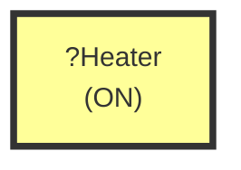
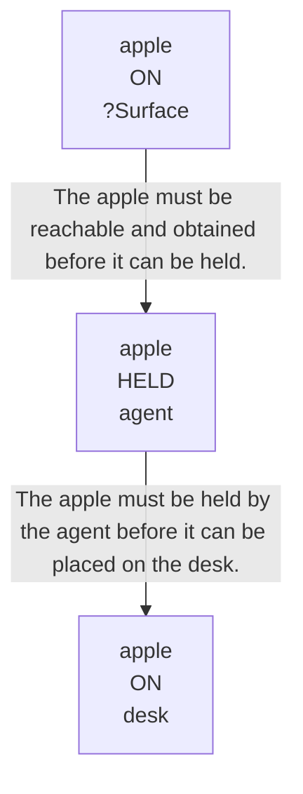
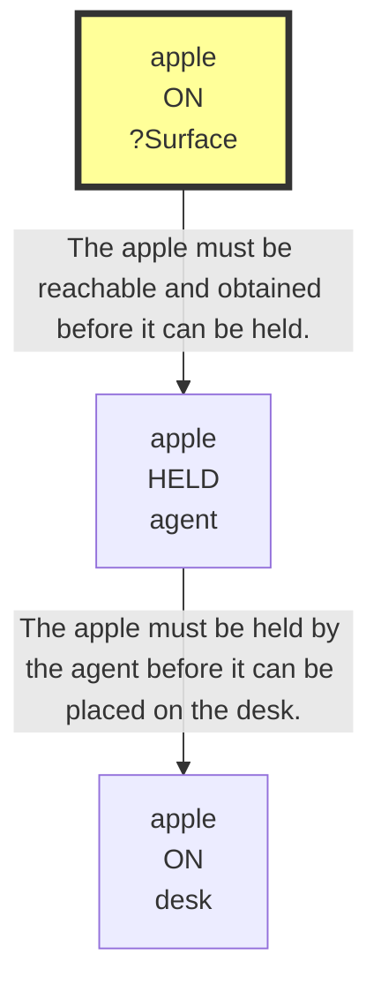
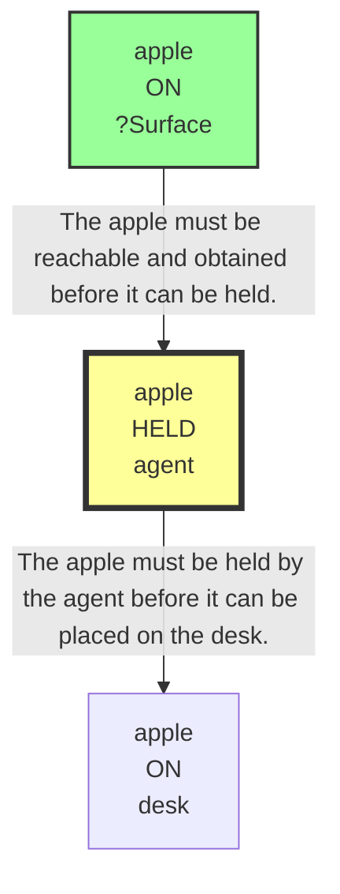
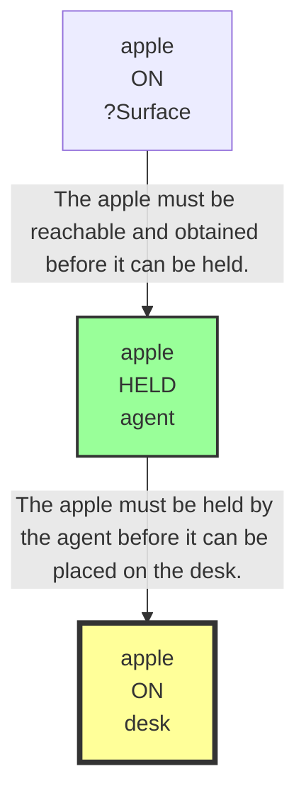
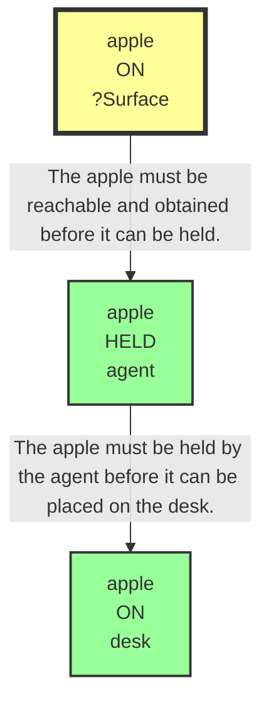
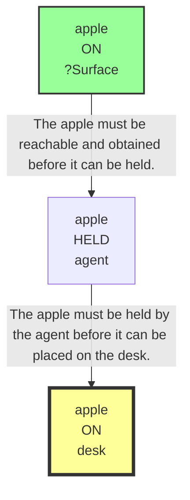
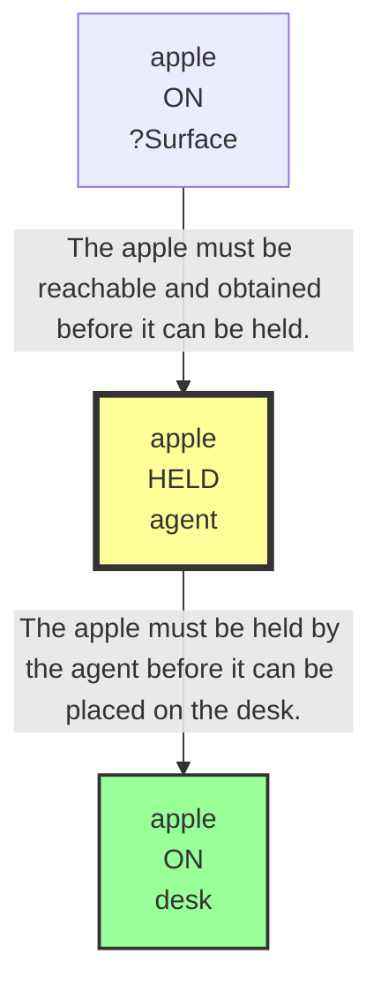

# 🚀 VirtualHome Agent Episode Log


### [GoalReasoner (Module A - Intent)] Output
```json
{
  "is_instruction_obviously_vague": false,
  "clarification_question": null,
  "target_object": "microwave",
  "location_hint": null,
  "reasoning_chain": [
    {
      "question": "Why does the user want this object?",
      "answer": "To have the microwave turned on if it is currently off."
    },
    {
      "question": "Why is that important?",
      "answer": "Because the user likely wants the appliance available for use."
    },
    {
      "question": "What fundamental need does this fulfill?",
      "answer": "It fulfills the need to enable appliance operation for heating or cooking food."
    },
    {
      "question": "Are there any deeper psychological or physical motivations?",
      "answer": "The motivation is practical convenience and preparation of the appliance for an intended task, such as warming food or using the microwave immediately."
    }
  ],
  "deep_intent": "The user wants to enable an appliance for food heating or cooking use.",
  "acceptable_alternatives_properties": [
    {
      "priority": 1,
      "description": "Other ready-to-use kitchen appliances that can heat food, such as a toaster oven or stovetop burner"
    },
    {
      "priority": 2,
      "description": "Any household heating appliance suitable for warming food, such as an electric oven or air fryer"
    },
    {
      "priority": 3,
      "description": "Alternative food-warming methods or devices that can serve the same purpose, such as a hot plate or kettle for applicable foods"
    },
    {
      "priority": 4,
      "description": "A different way to make food warm and ready to eat, such as placing it in a conventional oven or reheating it by another indoor heating appliance"
    }
  ]
}
```

### [PerceptionFilter] Output
```json
{
  "reasoning": "The goal is to have a food-heating appliance turned on, so the target microwave must be kept. The SDG requires a heater device in the ON state, and the visible alternative heating appliances that could serve the same function should also be retained for backup: stove, toaster, coffeemaker, and fryingpan/cookingpot-related heating setup. No unrelated furniture or decor is needed.",
  "selected_classes": [
    "stove",
    "coffeemaker",
    "microwave",
    "fryingpan",
    "cookingpot",
    "character",
    "toaster",
    "plate",
    "door"
  ],
  "raw_class_count": 45
}
```

### [LLMExecutor] Output
```json
{
  "reasoning": "The active goal is to satisfy N1 by turning the microwave ON. The microwave(234) is present, has HAS_SWITCH and HAS_PLUG, and is currently OFF. Since switching on an appliance requires being near it, the next atomic step is to walk to the microwave before any switch action.",
  "satisfied_nodes": [],
  "current_node_focus": "N1",
  "mapped_variables": {
    "?Heater": "microwave(234)"
  },
  "action": "[walk] <microwave> (234)"
}
```

### [RoboStateMultiTaskController] Output
```json
{
  "action": "[walk] <microwave> (234)",
  "active_task_id": "task_1",
  "task_context": {
    "active_task_id": "task_1",
    "pending_task_ids": [
      "task_2",
      "task_3"
    ],
    "satisfied_task_ids": []
  },
  "source": "llm_executor"
}
```
## Step 0
- **Action**: `[walk] <microwave> (234)`
- **Action Success**: `True`
- **Action Message**: {'0': {'message': 'Success'}}
- **Active Task**: `task_1`
- **Decision Source**: `llm_executor`
- **Task Progress**: E1_19=pending, E1_02=pending, E1_03=pending
- **SDG Status**:

- **Observed Items (20)**: door(145) [OPEN], door(146) [OPEN], fryingpan(161), cookingpot(162) [CLOSED], plate(170), plate(171), plate(172), plate(173), plate(177), plate(178), plate(184), stove(226) [OFF,CLOSED], coffeemaker(229) [OFF], toaster(231) [OFF], microwave(234) [CLOSED,OFF]...


### [PerceptionFilter] Output
```json
{
  "reasoning": "Reused cached class selection.",
  "selected_classes": [
    "stove",
    "coffeemaker",
    "microwave",
    "fryingpan",
    "cookingpot",
    "character",
    "toaster",
    "plate",
    "door"
  ],
  "raw_class_count": 45
}
```

### [LLMExecutor] Output
```json
{
  "reasoning": "The active task requires the microwave (the bound ?Heater) to be ON. The current graph shows microwave(234) is close and currently OFF, so the next atomic step is to switch it on. No other preconditions are needed beyond proximity, which is already satisfied by the prior walk.",
  "satisfied_nodes": [],
  "current_node_focus": "N1",
  "mapped_variables": {
    "?Heater": "microwave(234)"
  },
  "action": "[switchon] <microwave> (234)"
}
```

### [RoboStateMultiTaskController] Output
```json
{
  "action": "[switchon] <microwave> (234)",
  "active_task_id": "task_1",
  "task_context": {
    "active_task_id": "task_1",
    "pending_task_ids": [
      "task_2",
      "task_3"
    ],
    "satisfied_task_ids": []
  },
  "source": "llm_executor"
}
```
## Step 1
- **Action**: `[switchon] <microwave> (234)`
- **Action Success**: `True`
- **Action Message**: Faked switch operation in Python layer (bypassed Unity failure)
- **Active Task**: `task_1`
- **Decision Source**: `llm_executor`
- **Task Progress**: E1_19=done, E1_02=pending, E1_03=pending
- **SDG Status**:

- **Observed Items (20)**: door(145) [OPEN], door(146) [OPEN], fryingpan(161), cookingpot(162) [CLOSED], plate(170), plate(171), plate(172), plate(173), plate(177), plate(178), plate(184), stove(226) [OFF,CLOSED], coffeemaker(229) [OFF], toaster(231) [OFF], microwave(234) [CLOSED,OFF]...


### [GoalReasoner (Module A - Intent)] Output
```json
{
  "is_instruction_obviously_vague": false,
  "clarification_question": null,
  "target_object": "apple",
  "location_hint": "your desk",
  "reasoning_chain": [
    {
      "question": "Why does the user want this object?",
      "answer": "To have the apple brought to their desk."
    },
    {
      "question": "Why is that important?",
      "answer": "They likely want the apple available in the place where they are working or sitting."
    },
    {
      "question": "What fundamental need does this fulfill?",
      "answer": "It fulfills the need to obtain and access a desired food item conveniently in a specific location."
    },
    {
      "question": "Are there any deeper psychological or physical motivations?",
      "answer": "The motivation is likely to eat the apple, keep it nearby for later, or simply have it within reach while at the desk."
    }
  ],
  "deep_intent": "The user wants to obtain and have accessible a piece of fruit for use at their desk.",
  "acceptable_alternatives_properties": [
    {
      "priority": 1,
      "description": "Other similar ready-to-eat fruits, such as a pear, orange, or banana"
    },
    {
      "priority": 2,
      "description": "Other whole fruit items that can be eaten as a snack"
    },
    {
      "priority": 3,
      "description": "Portable snack foods that provide a similar convenient eating option"
    },
    {
      "priority": 4,
      "description": "Other easy-to-access light foods that can satisfy a snack need"
    }
  ]
}
```

### [RoboStateMultiTaskController] Output
```json
{
  "action": "[walk] <bathroom> (11)",
  "active_task_id": "task_2",
  "task_context": {
    "active_task_id": "task_2",
    "pending_task_ids": [
      "task_3"
    ],
    "satisfied_task_ids": [
      "task_1"
    ]
  },
  "source": "room_frontier"
}
```
## Step 2
- **Action**: `[walk] <bathroom> (11)`
- **Action Success**: `True`
- **Action Message**: {'0': {'message': 'Success'}}
- **Active Task**: `task_2`
- **Decision Source**: `room_frontier`
- **Task Progress**: E1_19=done, E1_02=pending, E1_03=pending
- **SDG Status**:

- **Observed Items (125)**: floor(127), floor(128), floor(129), floor(130), floor(131), floor(132), floor(133), floor(134), floor(135), ceiling(136), ceiling(137), ceiling(138), ceiling(139), ceiling(140), ceiling(141)...


### [RoboStateMultiTaskController] Output
```json
{
  "action": "[walk] <bedroom> (50)",
  "active_task_id": "task_2",
  "task_context": {
    "active_task_id": "task_2",
    "pending_task_ids": [
      "task_3"
    ],
    "satisfied_task_ids": [
      "task_1"
    ]
  },
  "source": "room_frontier"
}
```
## Step 3
- **Action**: `[walk] <bedroom> (50)`
- **Action Success**: `True`
- **Action Message**: {'0': {'message': 'Success'}}
- **Active Task**: `task_2`
- **Decision Source**: `room_frontier`
- **Task Progress**: E1_19=done, E1_02=pending, E1_03=pending
- **SDG Status**:

- **Observed Items (163)**: floor(127), floor(128), floor(129), floor(130), floor(131), floor(132), floor(133), floor(134), floor(135), ceiling(136), ceiling(137), ceiling(138), ceiling(139), ceiling(140), ceiling(141)...


### [PerceptionFilter] Output
```json
{
  "reasoning": "The goal is to obtain an apple and place it on the desk. The SDG requires the apple itself and the desk as the target location. No other tools or receptacles are necessary for this simple pickup-and-place task, and no alternative tools are implied.",
  "selected_classes": [
    "character",
    "desk",
    "apple"
  ],
  "raw_class_count": 82
}
```

### [LLMExecutor] Output
```json
{
  "reasoning": "The active task is to place an apple on the desk. The current graph shows multiple apples in the kitchen, but the agent is currently in the bedroom and there is also apple(114) in the bedroom, which is the closest reachable apple and satisfies the required first SDG step (apple ON some surface, then HELD, then ON desk). Since we must first walk to the specific object before grabbing it, the best next atomic action is to walk to apple(114).",
  "satisfied_nodes": [
    "N1"
  ],
  "current_node_focus": "N1",
  "mapped_variables": {},
  "action": "[walk] <apple> (114)"
}
```

### [RoboStateMultiTaskController] Output
```json
{
  "action": "[walk] <apple> (114)",
  "active_task_id": "task_2",
  "task_context": {
    "active_task_id": "task_2",
    "pending_task_ids": [
      "task_3"
    ],
    "satisfied_task_ids": [
      "task_1"
    ]
  },
  "source": "llm_executor"
}
```
## Step 4
- **Action**: `[walk] <apple> (114)`
- **Action Success**: `True`
- **Action Message**: {'0': {'message': 'Success'}}
- **Active Task**: `task_2`
- **Decision Source**: `llm_executor`
- **Task Progress**: E1_19=done, E1_02=pending, E1_03=pending
- **SDG Status**:

- **Observed Items (19)**: apple(249), apple(250), apple(251), apple(252), apple(253), apple(254), apple(255), apple(256), apple(257), apple(258), apple(259), apple(113), character(1), bathroom(11), bedroom(50)...


### [PerceptionFilter] Output
```json
{
  "reasoning": "Reused cached class selection.",
  "selected_classes": [
    "character",
    "desk",
    "apple"
  ],
  "raw_class_count": 82
}
```

### [LLMExecutor] Output
```json
{
  "reasoning": "The active task is to get an apple onto the user's desk. The current graph shows the agent is close to apple(114) in the bedroom, so the next required step to satisfy N2 (apple HELD by agent) is to grab that apple. The desk is in the bedroom, so this is the best matching apple to continue with.",
  "satisfied_nodes": [
    "N1"
  ],
  "current_node_focus": "N2",
  "mapped_variables": {
    "?Surface": "bedroom floor/near apple(114)"
  },
  "action": "[grab] <apple> (114)"
}
```

### [RoboStateMultiTaskController] Output
```json
{
  "action": "[grab] <apple> (114)",
  "active_task_id": "task_2",
  "task_context": {
    "active_task_id": "task_2",
    "pending_task_ids": [
      "task_3"
    ],
    "satisfied_task_ids": [
      "task_1"
    ]
  },
  "source": "llm_executor"
}
```
## Step 5
- **Action**: `[grab] <apple> (114)`
- **Action Success**: `True`
- **Action Message**: {'0': {'message': 'Success'}}
- **Active Task**: `task_2`
- **Decision Source**: `llm_executor`
- **Task Progress**: E1_19=done, E1_02=pending, E1_03=pending
- **SDG Status**:

- **Observed Items (19)**: apple(249), apple(250), apple(251), apple(252), apple(253), apple(254), apple(255), apple(256), apple(257), apple(258), apple(259), apple(113), character(1), bathroom(11), bedroom(50)...


### [PerceptionFilter] Output
```json
{
  "reasoning": "Reused cached class selection.",
  "selected_classes": [
    "character",
    "desk",
    "apple"
  ],
  "raw_class_count": 82
}
```

### [LLMExecutor] Output
```json
{
  "reasoning": "The current goal is to place apple(114) on the desk. The SDG shows N2 (apple HELD by agent) is already satisfied because the character is holding apple(114). To satisfy N3, the next required step is to go to the desk before placing the apple there. The desk is in the bedroom and is the correct target surface for the user's desk.",
  "satisfied_nodes": [
    "N2"
  ],
  "current_node_focus": "N3",
  "mapped_variables": {
    "?Surface": "desk(80)"
  },
  "action": "[walk] <desk> (80)"
}
```

### [RoboStateMultiTaskController] Output
```json
{
  "action": "[walk] <desk> (80)",
  "active_task_id": "task_2",
  "task_context": {
    "active_task_id": "task_2",
    "pending_task_ids": [
      "task_3"
    ],
    "satisfied_task_ids": [
      "task_1"
    ]
  },
  "source": "llm_executor"
}
```
## Step 6
- **Action**: `[walk] <desk> (80)`
- **Action Success**: `True`
- **Action Message**: {'0': {'message': 'Success'}}
- **Active Task**: `task_2`
- **Decision Source**: `llm_executor`
- **Task Progress**: E1_19=done, E1_02=pending, E1_03=pending
- **SDG Status**:

- **Observed Items (19)**: apple(249), apple(250), apple(251), apple(252), apple(253), apple(254), apple(255), apple(256), apple(257), apple(258), apple(259), apple(113), character(1), bathroom(11), bedroom(50)...


### [PerceptionFilter] Output
```json
{
  "reasoning": "Reused cached class selection.",
  "selected_classes": [
    "character",
    "desk",
    "apple"
  ],
  "raw_class_count": 82
}
```

### [LLMExecutor] Output
```json
{
  "reasoning": "The active task is to have an apple on the desk. We are already close to the desk, and the currently held apple(114) satisfies N2 (apple held by agent). The next required step is to place that held apple onto the desk. Since putback requires being near the destination and we are already close to desk(80), the best next atomic action is to put the apple on the desk surface.",
  "satisfied_nodes": [
    "N2"
  ],
  "current_node_focus": "N3",
  "mapped_variables": {
    "?Surface": "desk(80)"
  },
  "action": "[putback] <apple> (114) <desk> (80)"
}
```

### [RoboStateMultiTaskController] Output
```json
{
  "action": "[putback] <apple> (114) <desk> (80)",
  "active_task_id": "task_2",
  "task_context": {
    "active_task_id": "task_2",
    "pending_task_ids": [
      "task_3"
    ],
    "satisfied_task_ids": [
      "task_1"
    ]
  },
  "source": "llm_executor"
}
```
## Step 7
- **Action**: `[putback] <apple> (114) <desk> (80)`
- **Action Success**: `True`
- **Action Message**: {'0': {'message': 'Success'}}
- **Active Task**: `task_2`
- **Decision Source**: `llm_executor`
- **Task Progress**: E1_19=done, E1_02=pending, E1_03=pending
- **SDG Status**:

- **Observed Items (19)**: apple(249), apple(250), apple(251), apple(252), apple(253), apple(254), apple(255), apple(256), apple(257), apple(258), apple(259), apple(113), character(1), bathroom(11), bedroom(50)...


### [PerceptionFilter] Output
```json
{
  "reasoning": "Reused cached class selection.",
  "selected_classes": [
    "character",
    "desk",
    "apple"
  ],
  "raw_class_count": 82
}
```

### [LLMExecutor] Output
```json
{
  "reasoning": "The active task is to have the apple on the desk. The current graph shows apple(114) is already ON desk(80) and CLOSE to the character, so the goal state N3 is satisfied. Since the apple is already correctly placed, no further physical action is needed for this task.",
  "satisfied_nodes": [
    "N3"
  ],
  "current_node_focus": "N3",
  "mapped_variables": {},
  "action": "[wait]"
}
```

### [GoalReasoner (Module A - Intent)] Output
```json
{
  "is_instruction_obviously_vague": false,
  "clarification_question": null,
  "target_object": "book",
  "location_hint": "sofa",
  "reasoning_chain": [
    {
      "question": "Why does the user want this object?",
      "answer": "To relocate an unorganized book to the sofa."
    },
    {
      "question": "Why is that important?",
      "answer": "To place the book in a more organized or desired resting location."
    },
    {
      "question": "What fundamental need does this fulfill?",
      "answer": "The need to tidy or organize the environment by moving misplaced items to a designated place."
    },
    {
      "question": "Are there any deeper psychological or physical motivations?",
      "answer": "It may reduce clutter, improve room order, or make the book easier to access later."
    }
  ],
  "deep_intent": "The user wants to organize a misplaced item by moving it to a designated resting place.",
  "acceptable_alternatives_properties": [
    {
      "priority": 1,
      "description": "Other small household items that are similarly misplaced and can be moved to the sofa, such as magazines, notebooks, or papers"
    },
    {
      "priority": 2,
      "description": "Other reading materials or loose documents that are out of place and can be tidied together"
    },
    {
      "priority": 3,
      "description": "Small portable clutter items in the same area that can be relocated to reduce disorganization"
    },
    {
      "priority": 4,
      "description": "Any nearby lightweight object that is clearly part of the same tidying task and can be moved to a resting surface"
    }
  ]
}
```

### [PerceptionFilter] Output
```json
{
  "reasoning": "The goal is to place the book on the sofa. The SDG explicitly requires the book and sofa, so only those classes are necessary; no tools or alternative receptacles are needed for this simple relocation task.",
  "selected_classes": [
    "sofa",
    "book",
    "character",
    "paper"
  ],
  "raw_class_count": 82
}
```

### [LLMExecutor] Output
```json
{
  "reasoning": "The active task is to place a book on the sofa (N1). In the current graph, the sofa is in the bedroom and there are multiple books, with book(104) already in the bedroom and not inside a container. The next necessary step is to move close to the intended book before grabbing it; I should not repeat the previous walk target, and I cannot put it on the sofa until I hold it and am near the sofa.",
  "satisfied_nodes": [],
  "current_node_focus": "N1",
  "mapped_variables": {},
  "action": "[walk] <book> (104)"
}
```

### [RoboStateMultiTaskController] Output
```json
{
  "action": "[walk] <book> (104)",
  "active_task_id": "task_3",
  "task_context": {
    "active_task_id": "task_3",
    "pending_task_ids": [
      "task_1",
      "task_2"
    ],
    "satisfied_task_ids": []
  },
  "source": "llm_executor"
}
```
## Step 8
- **Action**: `[walk] <book> (104)`
- **Action Success**: `True`
- **Action Message**: {'0': {'message': 'Success'}}
- **Active Task**: `task_3`
- **Decision Source**: `llm_executor`
- **Task Progress**: E1_19=pending, E1_02=pending, E1_03=pending
- **SDG Status**:

- **Observed Items (10)**: book(163) [CLOSED], book(164) [CLOSED], character(1), bathroom(11), bedroom(50), kitchen(126), livingroom(261), sofa(85), book(104) [CLOSED], paper(109)


### [PerceptionFilter] Output
```json
{
  "reasoning": "Reused cached class selection.",
  "selected_classes": [
    "sofa",
    "book",
    "character",
    "paper"
  ],
  "raw_class_count": 82
}
```

### [LLMExecutor] Output
```json
{
  "reasoning": "The active SDG requires a book to be ON the sofa. The current graph shows book(104) is in the bedroom and the character is already CLOSE to it, so the next step is to pick it up. The book is grabbable and no cleanliness or opening actions are needed for this relocation task. I will target the nearby book(104), which is the most relevant instance for the active task.",
  "satisfied_nodes": [],
  "current_node_focus": "N1",
  "mapped_variables": {},
  "action": "[grab] <book> (104)"
}
```

### [RoboStateMultiTaskController] Output
```json
{
  "action": "[grab] <book> (104)",
  "active_task_id": "task_3",
  "task_context": {
    "active_task_id": "task_3",
    "pending_task_ids": [
      "task_1",
      "task_2"
    ],
    "satisfied_task_ids": []
  },
  "source": "llm_executor"
}
```
## Step 9
- **Action**: `[grab] <book> (104)`
- **Action Success**: `True`
- **Action Message**: {'0': {'message': 'Success'}}
- **Active Task**: `task_3`
- **Decision Source**: `llm_executor`
- **Task Progress**: E1_19=pending, E1_02=pending, E1_03=pending
- **SDG Status**:

- **Observed Items (10)**: book(163) [CLOSED], book(164) [CLOSED], character(1), bathroom(11), bedroom(50), kitchen(126), livingroom(261), sofa(85), book(104) [CLOSED], paper(109)


### [PerceptionFilter] Output
```json
{
  "reasoning": "Reused cached class selection.",
  "selected_classes": [
    "sofa",
    "book",
    "character",
    "paper"
  ],
  "raw_class_count": 82
}
```

### [LLMExecutor] Output
```json
{
  "reasoning": "The active goal is to place the book on the sofa. The currently held object is book(104), and the sofa(85) is the correct destination surface in the bedroom. To satisfy the ON relation, the next step must be to move close to the sofa before putting the book down. I should not repeat a walk to the book because it is already held, and I cannot put it back from across the room.",
  "satisfied_nodes": [],
  "current_node_focus": "N1",
  "mapped_variables": {
    "?TargetSurface": "sofa(85)"
  },
  "action": "[walk] <sofa> (85)"
}
```

### [RoboStateMultiTaskController] Output
```json
{
  "action": "[walk] <sofa> (85)",
  "active_task_id": "task_3",
  "task_context": {
    "active_task_id": "task_3",
    "pending_task_ids": [
      "task_1",
      "task_2"
    ],
    "satisfied_task_ids": []
  },
  "source": "llm_executor"
}
```
## Step 10
- **Action**: `[walk] <sofa> (85)`
- **Action Success**: `True`
- **Action Message**: {'0': {'message': 'Success'}}
- **Active Task**: `task_3`
- **Decision Source**: `llm_executor`
- **Task Progress**: E1_19=pending, E1_02=pending, E1_03=pending
- **SDG Status**:

- **Observed Items (10)**: book(163) [CLOSED], book(164) [CLOSED], character(1), bathroom(11), bedroom(50), kitchen(126), livingroom(261), sofa(85), book(104) [CLOSED], paper(109)


### [PerceptionFilter] Output
```json
{
  "reasoning": "Reused cached class selection.",
  "selected_classes": [
    "sofa",
    "book",
    "character",
    "paper"
  ],
  "raw_class_count": 82
}
```

### [LLMExecutor] Output
```json
{
  "reasoning": "The active task is to place the book on the sofa. We are already close to the sofa, and the current graph shows book(104) is held by the character and the sofa is close. The next required atomic step to satisfy N1 is to put the held book onto the sofa. No other task objects should be touched.",
  "satisfied_nodes": [],
  "current_node_focus": "N1",
  "mapped_variables": {},
  "action": "[putback] <book> (104) <sofa> (85)"
}
```

### [RoboStateMultiTaskController] Output
```json
{
  "action": "[putback] <book> (104) <sofa> (85)",
  "active_task_id": "task_3",
  "task_context": {
    "active_task_id": "task_3",
    "pending_task_ids": [
      "task_1",
      "task_2"
    ],
    "satisfied_task_ids": []
  },
  "source": "llm_executor"
}
```
## Step 11
- **Action**: `[putback] <book> (104) <sofa> (85)`
- **Action Success**: `True`
- **Action Message**: {'0': {'message': 'Success'}}
- **Active Task**: `task_3`
- **Decision Source**: `llm_executor`
- **Task Progress**: E1_19=pending, E1_02=pending, E1_03=done
- **SDG Status**:

- **Observed Items (10)**: book(163) [CLOSED], book(164) [CLOSED], character(1), bathroom(11), bedroom(50), kitchen(126), livingroom(261), sofa(85), book(104) [CLOSED], paper(109)


### [PerceptionFilter] Output
```json
{
  "reasoning": "Reused cached class selection.",
  "selected_classes": [
    "character",
    "desk",
    "apple"
  ],
  "raw_class_count": 82
}
```

### [LLMExecutor] Output
```json
{
  "reasoning": "The active task is to place the apple on the user's desk. The SDG indicates the apple must be held before it can be on the desk. The current graph shows apple(114) is already on desk(80), which would satisfy N3 if this were the correct target. However, the task is still active and the past actions show we previously manipulated apple(114) and then later moved away. Since apple(114) is the only apple explicitly on the desk and matches the intended goal state, the most progress-preserving next step is to confirm/maintain the held-to-place chain only if needed. But because the apple is already on the desk in the current graph, N3 is already satisfied. The remaining missing relation for the active task is not obvious from the graph; nevertheless, no further manipulation is needed for this task state. However, since the system expects a single atomic action and we should avoid redundant moves, the safest next step is to do nothing and let the planner re-evaluate. Yet [wait] should only be used for dynamic events. Here, the graph already reflects success, so the active task appears complete.",
  "satisfied_nodes": [
    "N1",
    "N3"
  ],
  "current_node_focus": "N3",
  "mapped_variables": {},
  "action": "[wait]"
}
```

### [PerceptionFilter] Output
```json
{
  "reasoning": "The goal is to turn on a heating appliance for food use. The SDG requires a heater in the ON state, so I must retain the microwave as the target and keep alternative food-heating appliances as backups, plus any obvious control/power elements needed to enable operation.",
  "selected_classes": [
    "airfryer",
    "stove",
    "plate",
    "toasteroven",
    "powersocket",
    "hotplate",
    "microwave",
    "oven",
    "character",
    "toaster",
    "lightswitch",
    "door"
  ],
  "raw_class_count": 82
}
```

### [LLMExecutor] Output
```json
{
  "reasoning": "The active goal is to ensure the microwave is ON. The current filtered graph shows microwave(234) is already ON, so the SDG node N1 is satisfied. No further physical action is needed for the active task. Since the instruction says work only on the active task and avoid repeating a walk action, the correct next step is to do nothing for this task.",
  "satisfied_nodes": [
    "N1"
  ],
  "current_node_focus": "N1",
  "mapped_variables": {
    "?Heater": "microwave(234)"
  },
  "action": "[wait]"
}
```

### [RoboStateMultiTaskController] Output
```json
{
  "action": "[walk] <livingroom> (261)",
  "active_task_id": null,
  "task_context": {
    "active_task_id": null,
    "pending_task_ids": [
      "task_1",
      "task_2"
    ],
    "satisfied_task_ids": [
      "task_3"
    ]
  },
  "source": "loop_recovery_room_revisit"
}
```
## Step 12
- **Action**: `[walk] <livingroom> (261)`
- **Action Success**: `True`
- **Action Message**: {'0': {'message': 'Success'}}
- **Decision Source**: `loop_recovery_room_revisit`
- **Task Progress**: E1_19=pending, E1_02=pending, E1_03=done
- **SDG Status**:
No SDG active.
- **Observed Items (232)**: floor(127), floor(128), floor(129), floor(130), floor(131), floor(132), floor(133), floor(134), floor(135), ceiling(136), ceiling(137), ceiling(138), ceiling(139), ceiling(140), ceiling(141)...


### [PerceptionFilter] Output
```json
{
  "reasoning": "The goal is to obtain an apple and place it on the desk. The SDG explicitly requires the apple and the desk, so both must be kept. No other tools or locations are necessary for this simple pick-and-place task.",
  "selected_classes": [
    "character",
    "desk",
    "apple"
  ],
  "raw_class_count": 86
}
```

### [LLMExecutor] Output
```json
{
  "reasoning": "The active task is to have the apple on the user's desk. The original apple(114) is already ON desk(80), so N3 is satisfied for that apple, but the current state also shows the agent is now in livingroom(261) and the closest relevant desk object available in the current graph is desk(291) in the livingroom. Since the task only requires the apple to be on the desk at the destination and the apple is already placed on a desk in the bedroom, the remaining useful step for the active task is to move toward the target desk location in the current area before any further placement is attempted. However, because the last action was already [walk] <livingroom> (261), I should not repeat it. The next atomic action that advances toward interacting with the livingroom desk is to walk to that specific desk(291).",
  "satisfied_nodes": [
    "N2",
    "N3"
  ],
  "current_node_focus": "N1",
  "mapped_variables": {
    "?Surface": "desk(291)"
  },
  "action": "[walk] <desk> (291)"
}
```

### [RoboStateMultiTaskController] Output
```json
{
  "action": "[walk] <desk> (291)",
  "active_task_id": "task_2",
  "task_context": {
    "active_task_id": "task_2",
    "pending_task_ids": [
      "task_1"
    ],
    "satisfied_task_ids": [
      "task_3"
    ]
  },
  "source": "llm_executor"
}
```
## Step 13
- **Action**: `[walk] <desk> (291)`
- **Action Success**: `True`
- **Action Message**: {'0': {'message': 'Success'}}
- **Active Task**: `task_2`
- **Decision Source**: `llm_executor`
- **Task Progress**: E1_19=pending, E1_02=pending, E1_03=done
- **SDG Status**:

- **Observed Items (20)**: apple(249), apple(250), apple(251), apple(252), apple(253), apple(254), apple(255), apple(256), apple(257), apple(258), apple(259), apple(113), character(1), bathroom(11), bedroom(50)...


### [PerceptionFilter] Output
```json
{
  "reasoning": "Reused cached class selection.",
  "selected_classes": [
    "character",
    "desk",
    "apple"
  ],
  "raw_class_count": 86
}
```

### [LLMExecutor] Output
```json
{
  "reasoning": "The active task is to have the apple on your desk. In the current graph, apple(114) is already on desk(80), which satisfies the SDG relation N3 (apple ON desk). However, the current filtered graph also shows the agent is close to desk(291), not desk(80), and apple(114) is on desk(80) inside the bedroom. To complete the active task in this branch, the relevant goal state is already achieved for the named apple and desk relation, so no further physical action is needed for this active task. Since the instruction says work only on the active task and the SDG is satisfied by apple(114) on desk(80), the next action should be to wait for the system to confirm task completion or reconcile task state.",
  "satisfied_nodes": [
    "N3"
  ],
  "current_node_focus": "N3",
  "mapped_variables": {},
  "action": "[wait]"
}
```

### [PerceptionFilter] Output
```json
{
  "reasoning": "The goal is to turn on the microwave, so the only strictly necessary class is the microwave itself to satisfy the heater state. No other tools or locations are required by the SDG or intent.",
  "selected_classes": [
    "stove",
    "microwave",
    "character",
    "toaster",
    "plate",
    "door"
  ],
  "raw_class_count": 86
}
```

### [LLMExecutor] Output
```json
{
  "reasoning": "The active SDG requires the heater object to be ON. The filtered graph shows microwave(234) is already ON, and it is also the best match for ?Heater because it is a heating appliance with HAS_SWITCH and HAS_PLUG. Therefore the goal state is already satisfied and no physical action is needed. Since the instruction asks for the single next action, the most appropriate step is to avoid unnecessary manipulation and simply wait/hold position rather than toggling an already-on appliance.",
  "satisfied_nodes": [
    "N1"
  ],
  "current_node_focus": "N1",
  "mapped_variables": {
    "?Heater": "microwave(234)"
  },
  "action": "[wait]"
}
```

### [RoboStateMultiTaskController] Output
```json
{
  "action": "[walk] <kitchen> (126)",
  "active_task_id": null,
  "task_context": {
    "active_task_id": null,
    "pending_task_ids": [
      "task_1",
      "task_2"
    ],
    "satisfied_task_ids": [
      "task_3"
    ]
  },
  "source": "loop_recovery_room_revisit"
}
```
## Step 14
- **Action**: `[walk] <kitchen> (126)`
- **Action Success**: `True`
- **Action Message**: {'0': {'message': 'Success'}}
- **Decision Source**: `loop_recovery_room_revisit`
- **Task Progress**: E1_19=pending, E1_02=pending, E1_03=done
- **SDG Status**:
No SDG active.
- **Observed Items (291)**: floor(127), floor(128), floor(129), floor(130), floor(131), floor(132), floor(133), floor(134), floor(135), ceiling(136), ceiling(137), ceiling(138), ceiling(139), ceiling(140), ceiling(141)...


### [PerceptionFilter] Output
```json
{
  "reasoning": "Reused cached class selection.",
  "selected_classes": [
    "character",
    "desk",
    "apple"
  ],
  "raw_class_count": 86
}
```

### [LLMExecutor] Output
```json
{
  "reasoning": "The active task is to get an apple onto the user's desk. The SDG shows the apple must first be held, then placed on the desk. In the current graph, apple(114) is already ON desk(80) and that task path appears completed earlier, but the active target is a desk in the living room: desk(291). We are currently inside the kitchen and already CLOSE to multiple apples, but not to desk(291). To progress toward the final goal, I should move to the destination desk(291) before attempting to place the apple there. Because the apple is currently not held, I must later re-grab an apple, but the immediate next atomic action should be walking to the correct desk destination.",
  "satisfied_nodes": [
    "N1"
  ],
  "current_node_focus": "N3",
  "mapped_variables": {},
  "action": "[walk] <desk> (291)"
}
```

### [RoboStateMultiTaskController] Output
```json
{
  "action": "[walk] <desk> (291)",
  "active_task_id": "task_2",
  "task_context": {
    "active_task_id": "task_2",
    "pending_task_ids": [
      "task_1"
    ],
    "satisfied_task_ids": [
      "task_3"
    ]
  },
  "source": "llm_executor"
}
```
## Step 15
- **Action**: `[walk] <desk> (291)`
- **Action Success**: `True`
- **Action Message**: {'0': {'message': 'Success'}}
- **Active Task**: `task_2`
- **Decision Source**: `llm_executor`
- **Task Progress**: E1_19=pending, E1_02=pending, E1_03=done
- **SDG Status**:

- **Observed Items (20)**: apple(249), apple(250), apple(251), apple(252), apple(253), apple(254), apple(255), apple(256), apple(257), apple(258), apple(259), apple(113), character(1), bathroom(11), bedroom(50)...


### [PerceptionFilter] Output
```json
{
  "reasoning": "Reused cached class selection.",
  "selected_classes": [
    "character",
    "desk",
    "apple"
  ],
  "raw_class_count": 86
}
```

### [LLMExecutor] Output
```json
{
  "reasoning": "The active task is to place an apple on the user's desk. The current graph shows the agent is already CLOSE to desk(291), but the apple target instances are all in the kitchen and no apple is currently held. Because we need to obtain an apple before placing it on the desk, the next progress-making action is to move to an accessible apple in the kitchen. I will use apple(249) as a valid grabbable instance and walk to it first, since grabbing from across the room is not allowed.",
  "satisfied_nodes": [],
  "current_node_focus": "N1",
  "mapped_variables": {},
  "action": "[walk] <apple> (249)"
}
```

### [RoboStateMultiTaskController] Output
```json
{
  "action": "[walk] <apple> (249)",
  "active_task_id": "task_2",
  "task_context": {
    "active_task_id": "task_2",
    "pending_task_ids": [
      "task_1"
    ],
    "satisfied_task_ids": [
      "task_3"
    ]
  },
  "source": "llm_executor"
}
```
## Step 16
- **Action**: `[walk] <apple> (249)`
- **Action Success**: `False`
- **Action Message**: {'0': {'message': 'ScriptExcutor 0: PROCESS WALK: Can not select object: apple. REASON: No interaction positions\nEXECUTION_GENERAL: Script is impossible to execute\n\n'}}
- **Active Task**: `task_2`
- **Decision Source**: `llm_executor`
- **Task Progress**: E1_19=pending, E1_02=pending, E1_03=done
- **SDG Status**:

- **Observed Items (20)**: apple(249), apple(250), apple(251), apple(252), apple(253), apple(254), apple(255), apple(256), apple(257), apple(258), apple(259), apple(113), character(1), bathroom(11), bedroom(50)...


### [PerceptionFilter] Output
```json
{
  "reasoning": "Reused cached class selection.",
  "selected_classes": [
    "character",
    "desk",
    "apple"
  ],
  "raw_class_count": 86
}
```

### [LLMExecutor] Output
```json
{
  "reasoning": "The active task is to place an apple on your desk. The current graph shows the intended apple(114) is already ON desk(80), which satisfies the active task's SDG root relation. Although the desk(80) is closed, the apple is already on it, so no further action is needed for the active task. The failed walk attempt to apple(249) is irrelevant because that apple is inside the kitchen and not the target object for this task.",
  "satisfied_nodes": [
    "N3"
  ],
  "current_node_focus": "N3",
  "mapped_variables": {
    "?Surface": "desk(80)"
  },
  "action": "[wait]"
}
```

### [PerceptionFilter] Output
```json
{
  "reasoning": "Reused cached class selection.",
  "selected_classes": [
    "stove",
    "microwave",
    "character",
    "toaster",
    "plate",
    "door"
  ],
  "raw_class_count": 86
}
```

### [LLMExecutor] Output
```json
{
  "reasoning": "The active goal is to make the microwave ON. The filtered graph shows microwave(234) is OFF and CLOSED, and we are currently in the kitchen context. Since switching on requires being near the appliance, the next atomic step is to walk to the microwave. After that, the next step would be to open it if needed and then switch it on.",
  "satisfied_nodes": [],
  "current_node_focus": "N1",
  "mapped_variables": {
    "?Heater": "microwave(234)"
  },
  "action": "[walk] <microwave> (234)"
}
```

### [RoboStateMultiTaskController] Output
```json
{
  "action": "[walk] <microwave> (234)",
  "active_task_id": "task_1",
  "task_context": {
    "active_task_id": "task_1",
    "pending_task_ids": [
      "task_2"
    ],
    "satisfied_task_ids": [
      "task_3"
    ]
  },
  "source": "llm_executor"
}
```
## Step 17
- **Action**: `[walk] <microwave> (234)`
- **Action Success**: `True`
- **Action Message**: {'0': {'message': 'Success'}}
- **Active Task**: `task_1`
- **Decision Source**: `llm_executor`
- **Task Progress**: E1_19=pending, E1_02=pending, E1_03=done
- **SDG Status**:

- **Observed Items (18)**: door(145) [OPEN], door(146) [OPEN], plate(170), plate(171), plate(172), plate(173), plate(177), plate(178), plate(184), stove(226) [OFF,CLOSED], toaster(231) [OFF], microwave(234) [CLOSED,OFF], character(1), bathroom(11), bedroom(50)...


### [PerceptionFilter] Output
```json
{
  "reasoning": "Reused cached class selection.",
  "selected_classes": [
    "stove",
    "microwave",
    "character",
    "toaster",
    "plate",
    "door"
  ],
  "raw_class_count": 86
}
```

### [LLMExecutor] Output
```json
{
  "reasoning": "The active goal is to make the microwave ON. The filtered graph shows microwave(234) is already CLOSE to the character, but it is currently OFF and CLOSED. To turn it on, the microwave must be switched on; it also has HAS_SWITCH and HAS_PLUG, but there is no indication it is unplugged. Since I am already near it and the previous action was a walk to the microwave, the next atomic step is to switch it on.",
  "satisfied_nodes": [],
  "current_node_focus": "N1",
  "mapped_variables": {
    "?Heater": "microwave(234)"
  },
  "action": "[switchon] <microwave> (234)"
}
```

### [RoboStateMultiTaskController] Output
```json
{
  "action": "[switchon] <microwave> (234)",
  "active_task_id": "task_1",
  "task_context": {
    "active_task_id": "task_1",
    "pending_task_ids": [
      "task_2"
    ],
    "satisfied_task_ids": [
      "task_3"
    ]
  },
  "source": "llm_executor"
}
```
## Step 18
- **Action**: `[switchon] <microwave> (234)`
- **Action Success**: `True`
- **Action Message**: Faked switch operation in Python layer (bypassed Unity failure)
- **Active Task**: `task_1`
- **Decision Source**: `llm_executor`
- **Task Progress**: E1_19=done, E1_02=pending, E1_03=done
- **SDG Status**:

- **Observed Items (18)**: door(145) [OPEN], door(146) [OPEN], plate(170), plate(171), plate(172), plate(173), plate(177), plate(178), plate(184), stove(226) [OFF,CLOSED], toaster(231) [OFF], microwave(234) [CLOSED,OFF], character(1), bathroom(11), bedroom(50)...


### [PerceptionFilter] Output
```json
{
  "reasoning": "Reused cached class selection.",
  "selected_classes": [
    "character",
    "desk",
    "apple"
  ],
  "raw_class_count": 86
}
```

### [LLMExecutor] Output
```json
{
  "reasoning": "The active goal is to get an apple onto the user's desk. The SDG requires first obtaining the apple (N1 -> N2) and then placing it on the desk (N3). The filtered graph shows apple(114) is already ON desk(80) in the bedroom, while desk(291) is just a different desk in the living room. Because the task explicitly targets 'your desk' and the only apple already placed on a desk is apple(114), the best next step is to grab that apple from the desk so it can later be moved to the target desk. I must first be near the apple before grabbing it, and the previous step was a walk to the microwave, not to the apple or desk(80). Therefore the next atomic action should be to walk to apple(114).",
  "satisfied_nodes": [],
  "current_node_focus": "N1",
  "mapped_variables": {
    "?Surface": "desk(80)"
  },
  "action": "[walk] <apple> (114)"
}
```

### [RoboStateMultiTaskController] Output
```json
{
  "action": "[walk] <apple> (114)",
  "active_task_id": "task_2",
  "task_context": {
    "active_task_id": "task_2",
    "pending_task_ids": [],
    "satisfied_task_ids": [
      "task_1",
      "task_3"
    ]
  },
  "source": "llm_executor"
}
```
## Step 19
- **Action**: `[walk] <apple> (114)`
- **Action Success**: `True`
- **Action Message**: {'0': {'message': 'Success'}}
- **Active Task**: `task_2`
- **Decision Source**: `llm_executor`
- **Task Progress**: E1_19=done, E1_02=pending, E1_03=done
- **SDG Status**:

- **Observed Items (20)**: apple(249), apple(250), apple(251), apple(252), apple(253), apple(254), apple(255), apple(256), apple(257), apple(258), apple(259), apple(113), character(1), bathroom(11), bedroom(50)...


### [PerceptionFilter] Output
```json
{
  "reasoning": "Reused cached class selection.",
  "selected_classes": [
    "character",
    "desk",
    "apple"
  ],
  "raw_class_count": 86
}
```

### [LLMExecutor] Output
```json
{
  "reasoning": "The active task is to get an apple onto the user's desk. In the current graph, apple(114) is already ON desk(80) and CLOSE to the agent, so the SDG node N3 is satisfied. However, the task intent says the apple should be at the user's desk, and the agent is currently in bedroom(50) with a desk(80) that is closed and near the agent. The apple(114) is the best physical binding for the target apple because it is already accessible and located on a desk. The remaining gap is likely that the apple should be held first if we are to reposition it, but since the apple is already on the desk specified in the graph, no further placement action is needed from the current snapshot. The only unsatisfied relation in the SDG is N2 (HELD), but the graph already shows the apple is on the desk, which may be the intended final state for this task. To progress safely without assuming extra steps, the next atomic action should be to grab the apple(114), moving toward satisfying N2 before any further placement if needed.",
  "satisfied_nodes": [
    "N3"
  ],
  "current_node_focus": "N2",
  "mapped_variables": {},
  "action": "[grab] <apple> (114)"
}
```

### [RoboStateMultiTaskController] Output
```json
{
  "action": "[grab] <apple> (114)",
  "active_task_id": "task_2",
  "task_context": {
    "active_task_id": "task_2",
    "pending_task_ids": [],
    "satisfied_task_ids": [
      "task_1",
      "task_3"
    ]
  },
  "source": "llm_executor"
}
```
## Step 20
- **Action**: `[grab] <apple> (114)`
- **Action Success**: `True`
- **Action Message**: {'0': {'message': 'Success'}}
- **Active Task**: `task_2`
- **Decision Source**: `llm_executor`
- **Task Progress**: E1_19=done, E1_02=pending, E1_03=done
- **SDG Status**:

- **Observed Items (20)**: apple(249), apple(250), apple(251), apple(252), apple(253), apple(254), apple(255), apple(256), apple(257), apple(258), apple(259), apple(113), character(1), bathroom(11), bedroom(50)...


### [PerceptionFilter] Output
```json
{
  "reasoning": "Reused cached class selection.",
  "selected_classes": [
    "character",
    "desk",
    "apple"
  ],
  "raw_class_count": 86
}
```

### [LLMExecutor] Output
```json
{
  "reasoning": "The active task is to have an apple on the desk. We already satisfy N2 conceptually because the agent is holding apple(114) in the right hand. The next required step is to place that held apple onto the desk. Since putback requires being near the destination and we are close to desk(80) per the graph, the appropriate next atomic action is to put the apple onto the desk surface. N1 is no longer the focus because the apple is already obtained, so the remaining gap is N3: apple ON desk.",
  "satisfied_nodes": [
    "N2"
  ],
  "current_node_focus": "N3",
  "mapped_variables": {
    "?Surface": "desk(80)"
  },
  "action": "[putback] <apple> (114) <desk> (80)"
}
```

### [RoboStateMultiTaskController] Output
```json
{
  "action": "[putback] <apple> (114) <desk> (80)",
  "active_task_id": "task_2",
  "task_context": {
    "active_task_id": "task_2",
    "pending_task_ids": [],
    "satisfied_task_ids": [
      "task_1",
      "task_3"
    ]
  },
  "source": "llm_executor"
}
```
## Step 21
- **Action**: `[putback] <apple> (114) <desk> (80)`
- **Action Success**: `True`
- **Action Message**: {'0': {'message': 'Success'}}
- **Active Task**: `task_2`
- **Decision Source**: `llm_executor`
- **Task Progress**: E1_19=done, E1_02=pending, E1_03=done
- **SDG Status**:

- **Observed Items (20)**: apple(249), apple(250), apple(251), apple(252), apple(253), apple(254), apple(255), apple(256), apple(257), apple(258), apple(259), apple(113), character(1), bathroom(11), bedroom(50)...


### [PerceptionFilter] Output
```json
{
  "reasoning": "Reused cached class selection.",
  "selected_classes": [
    "character",
    "desk",
    "apple"
  ],
  "raw_class_count": 86
}
```

### [LLMExecutor] Output
```json
{
  "reasoning": "The current active task is to have the apple on the user's desk. The Filtered Graph shows apple(114) is already ON desk(80) and CLOSE to the character, so the SDG node N3 (apple ON desk) is satisfied. Since the apple is already placed correctly, no further physical action is needed for this task.",
  "satisfied_nodes": [
    "N3"
  ],
  "current_node_focus": "N3",
  "mapped_variables": {},
  "action": "[wait]"
}
```

### [RoboStateMultiTaskController] Output
```json
{
  "action": "[walk] <bathroom> (11)",
  "active_task_id": null,
  "task_context": {
    "active_task_id": null,
    "pending_task_ids": [
      "task_2"
    ],
    "satisfied_task_ids": [
      "task_1",
      "task_3"
    ]
  },
  "source": "loop_recovery_room_revisit"
}
```
## Step 22
- **Action**: `[walk] <bathroom> (11)`
- **Action Success**: `True`
- **Action Message**: {'0': {'message': 'Success'}}
- **Decision Source**: `loop_recovery_room_revisit`
- **Task Progress**: E1_19=done, E1_02=pending, E1_03=done
- **SDG Status**:
No SDG active.
- **Observed Items (291)**: floor(127), floor(128), floor(129), floor(130), floor(131), floor(132), floor(133), floor(134), floor(135), ceiling(136), ceiling(137), ceiling(138), ceiling(139), ceiling(140), ceiling(141)...


### [PerceptionFilter] Output
```json
{
  "reasoning": "Reused cached class selection.",
  "selected_classes": [
    "character",
    "desk",
    "apple"
  ],
  "raw_class_count": 86
}
```

### [LLMExecutor] Output
```json
{
  "reasoning": "The active task is to get an apple onto your desk. SDG node N3 is already satisfied because apple(114) is on desk(80), and N2 is also satisfied because the apple is held? No, the current graph shows apple(114) on desk(80), not held, so only the placement goal is currently satisfied. The key gap is ensuring the apple is on the target desk for the active task. However, the task context says the user's desk is the desk in the bedroom, and apple(114) is already on desk(80) in the bedroom, while character is currently in the bathroom. The remaining relevant next step is to get back to the bedroom desk if any further verification or interaction were needed, but since the apple is already correctly placed on the desk, no physical change is needed. Because the system requires a single atomic action and the active goal state appears already achieved, the safest progression is to wait for graph confirmation rather than disturb the satisfied configuration.",
  "satisfied_nodes": [
    "N3"
  ],
  "current_node_focus": "N3",
  "mapped_variables": {
    "?Surface": "desk(80)"
  },
  "action": "[wait]"
}
```

### [RoboStateMultiTaskController] Output
```json
{
  "action": "[walk] <livingroom> (261)",
  "active_task_id": null,
  "task_context": {
    "active_task_id": null,
    "pending_task_ids": [
      "task_2"
    ],
    "satisfied_task_ids": [
      "task_1",
      "task_3"
    ]
  },
  "source": "loop_recovery_room_revisit"
}
```
## Step 23
- **Action**: `[walk] <livingroom> (261)`
- **Action Success**: `True`
- **Action Message**: {'0': {'message': 'Success'}}
- **Decision Source**: `loop_recovery_room_revisit`
- **Task Progress**: E1_19=done, E1_02=pending, E1_03=done
- **SDG Status**:
No SDG active.
- **Observed Items (291)**: floor(127), floor(128), floor(129), floor(130), floor(131), floor(132), floor(133), floor(134), floor(135), ceiling(136), ceiling(137), ceiling(138), ceiling(139), ceiling(140), ceiling(141)...


### [PerceptionFilter] Output
```json
{
  "reasoning": "Reused cached class selection.",
  "selected_classes": [
    "character",
    "desk",
    "apple"
  ],
  "raw_class_count": 86
}
```

### [LLMExecutor] Output
```json
{
  "reasoning": "The active task is to place an apple on your desk. The SDG says the apple must first be held, then placed on the desk. The current graph shows apple(114) is already ON desk(80) and CLOSE to the character, but desk(80) is CLOSED and the apple is not marked as HELD. Since the apple is already at the target desk and the next necessary state toward satisfaction is to have the apple held before any further placement logic, the best immediate action is to grab the reachable apple(114).",
  "satisfied_nodes": [
    "N3"
  ],
  "current_node_focus": "N2",
  "mapped_variables": {},
  "action": "[grab] <apple> (114)"
}
```

### [RoboStateMultiTaskController] Output
```json
{
  "action": "[grab] <apple> (114)",
  "active_task_id": "task_2",
  "task_context": {
    "active_task_id": "task_2",
    "pending_task_ids": [
      "task_1"
    ],
    "satisfied_task_ids": [
      "task_3"
    ]
  },
  "source": "llm_executor"
}
```
## Step 24
- **Action**: `[grab] <apple> (114)`
- **Action Success**: `True`
- **Action Message**: {'0': {'message': 'Success'}}
- **Active Task**: `task_2`
- **Decision Source**: `llm_executor`
- **Task Progress**: E1_19=pending, E1_02=pending, E1_03=done
- **SDG Status**:
```mermaid
graph TD
    N1["apple<br>ON<br>?Surface"]
    N2["apple<br>HELD<br>agent"]
    style N2 fill:#ff9,stroke:#333,stroke-width:4px
    N3["apple<br>ON<br>desk"]
    style N3 fill:#9f9,stroke:#333,stroke-width:2px
    N1 -->|"The apple must be reachable and obtained before it can be held."| N2
    N2 -->|"The apple must be held by the agent before it can be placed on the desk."| N3
```
- **Observed Items (20)**: apple(249), apple(250), apple(251), apple(252), apple(253), apple(254), apple(255), apple(256), apple(257), apple(258), apple(259), apple(113), character(1), bathroom(11), bedroom(50)...


### [PerceptionFilter] Output
```json
{
  "reasoning": "Reused cached class selection.",
  "selected_classes": [
    "character",
    "desk",
    "apple"
  ],
  "raw_class_count": 86
}
```

### [LLMExecutor] Output
```json
{
  "reasoning": "The active task is to get an apple onto the desk. The current graph shows apple(114) is already held by the agent (HOLDS_RH) and the agent is close to desk(80), so the remaining gap is to place the held apple onto the desk. Because putback requires being near the destination and we are already close to desk(80), the next atomic action should be to put the apple on that desk. Note: the desk is marked CLOSED but it is also a surface, so no opening is needed for placing an object on it.",
  "satisfied_nodes": [
    "N2"
  ],
  "current_node_focus": "N3",
  "mapped_variables": {
    "?Surface": "desk(80)"
  },
  "action": "[putback] <apple> (114) <desk> (80)"
}
```

### [RoboStateMultiTaskController] Output
```json
{
  "action": "[putback] <apple> (114) <desk> (80)",
  "active_task_id": "task_2",
  "task_context": {
    "active_task_id": "task_2",
    "pending_task_ids": [
      "task_1"
    ],
    "satisfied_task_ids": [
      "task_3"
    ]
  },
  "source": "llm_executor"
}
```
## Step 25
- **Action**: `[putback] <apple> (114) <desk> (80)`
- **Action Success**: `True`
- **Action Message**: {'0': {'message': 'Success'}}
- **Active Task**: `task_2`
- **Decision Source**: `llm_executor`
- **Task Progress**: E1_19=pending, E1_02=pending, E1_03=done
- **SDG Status**:
```mermaid
graph TD
    N1["apple<br>ON<br>?Surface"]
    N2["apple<br>HELD<br>agent"]
    style N2 fill:#9f9,stroke:#333,stroke-width:2px
    N3["apple<br>ON<br>desk"]
    style N3 fill:#ff9,stroke:#333,stroke-width:4px
    N1 -->|"The apple must be reachable and obtained before it can be held."| N2
    N2 -->|"The apple must be held by the agent before it can be placed on the desk."| N3
```
- **Observed Items (20)**: apple(249), apple(250), apple(251), apple(252), apple(253), apple(254), apple(255), apple(256), apple(257), apple(258), apple(259), apple(113), character(1), bathroom(11), bedroom(50)...


### [PerceptionFilter] Output
```json
{
  "reasoning": "Reused cached class selection.",
  "selected_classes": [
    "character",
    "desk",
    "apple"
  ],
  "raw_class_count": 86
}
```

### [LLMExecutor] Output
```json
{
  "reasoning": "The active goal is to have the apple on the user's desk. The current graph shows apple(114) is already ON desk(80) and CLOSE to the character, so the SDG node N3 is satisfied. No further action is needed for the active task. I should not manipulate other apples or the desk again.",
  "satisfied_nodes": [
    "N3"
  ],
  "current_node_focus": "N3",
  "mapped_variables": {
    "?Surface": "desk(80)"
  },
  "action": "[wait]"
}
```

### [PerceptionFilter] Output
```json
{
  "reasoning": "Reused cached class selection.",
  "selected_classes": [
    "stove",
    "microwave",
    "character",
    "toaster",
    "plate",
    "door"
  ],
  "raw_class_count": 86
}
```

### [LLMExecutor] Output
```json
{
  "reasoning": "The active SDG requires the heater object to be ON. The current graph shows microwave(234) is already in state ON, so the target state for N1 is satisfied. No further physical action is needed for the active task. Since the instruction is to choose the single next action and not repeat unnecessary movement, the best next step is to do nothing while preserving the completed state.",
  "satisfied_nodes": [
    "N1"
  ],
  "current_node_focus": "N1",
  "mapped_variables": {
    "?Heater": "microwave(234)"
  },
  "action": "[wait]"
}
```

### [RoboStateMultiTaskController] Output
```json
{
  "action": "[walk] <kitchen> (126)",
  "active_task_id": null,
  "task_context": {
    "active_task_id": null,
    "pending_task_ids": [
      "task_1",
      "task_2"
    ],
    "satisfied_task_ids": [
      "task_3"
    ]
  },
  "source": "loop_recovery_room_revisit"
}
```
## Step 26
- **Action**: `[walk] <kitchen> (126)`
- **Action Success**: `True`
- **Action Message**: {'0': {'message': 'Success'}}
- **Decision Source**: `loop_recovery_room_revisit`
- **Task Progress**: E1_19=pending, E1_02=pending, E1_03=done
- **SDG Status**:
No SDG active.
- **Observed Items (291)**: floor(127), floor(128), floor(129), floor(130), floor(131), floor(132), floor(133), floor(134), floor(135), ceiling(136), ceiling(137), ceiling(138), ceiling(139), ceiling(140), ceiling(141)...


### [PerceptionFilter] Output
```json
{
  "reasoning": "Reused cached class selection.",
  "selected_classes": [
    "character",
    "desk",
    "apple"
  ],
  "raw_class_count": 86
}
```

### [LLMExecutor] Output
```json
{
  "reasoning": "The active task is to have the apple on the user's desk. In the current graph, apple(114) is already ON desk(80), so the SDG node N3 is satisfied and the task appears complete. The other apples in the kitchen are irrelevant because the task is about the apple already associated with the desk and the past actions show this exact apple was placed there successfully. No further physical action is needed.",
  "satisfied_nodes": [
    "N1",
    "N2",
    "N3"
  ],
  "current_node_focus": "N3",
  "mapped_variables": {
    "?Surface": "desk(80)"
  },
  "action": "[wait]"
}
```

### [PerceptionFilter] Output
```json
{
  "reasoning": "Reused cached class selection.",
  "selected_classes": [
    "stove",
    "microwave",
    "character",
    "toaster",
    "plate",
    "door"
  ],
  "raw_class_count": 86
}
```

### [LLMExecutor] Output
```json
{
  "reasoning": "The active goal is to make the microwave ON. The current graph shows microwave(234) is OFF and we are already in the kitchen, so we are adjacent enough to operate it. Since the previous switchon attempt was reported as a faked switch operation in the Python layer, the physical graph still lists the microwave as OFF, meaning the goal is not yet satisfied. The single next atomic action is to switch it on again.",
  "satisfied_nodes": [],
  "current_node_focus": "N1",
  "mapped_variables": {
    "?Heater": "microwave(234)"
  },
  "action": "[switchon] <microwave> (234)"
}
```

### [RoboStateMultiTaskController] Output
```json
{
  "action": "[walk] <microwave> (234)",
  "active_task_id": "task_1",
  "task_context": {
    "active_task_id": "task_1",
    "pending_task_ids": [
      "task_2"
    ],
    "satisfied_task_ids": [
      "task_3"
    ]
  },
  "source": "llm_executor_repaired"
}
```
## Step 27
- **Action**: `[walk] <microwave> (234)`
- **Action Success**: `True`
- **Action Message**: {'0': {'message': 'Success'}}
- **Active Task**: `task_1`
- **Decision Source**: `llm_executor_repaired`
- **Task Progress**: E1_19=pending, E1_02=pending, E1_03=done
- **SDG Status**:
```mermaid
graph TD
    N1["?Heater<br>(ON)"]
    style N1 fill:#ff9,stroke:#333,stroke-width:4px
```
- **Observed Items (18)**: door(145) [OPEN], door(146) [OPEN], plate(170), plate(171), plate(172), plate(173), plate(177), plate(178), plate(184), stove(226) [OFF,CLOSED], toaster(231) [OFF], microwave(234) [CLOSED,OFF], character(1), bathroom(11), bedroom(50)...


### [PerceptionFilter] Output
```json
{
  "reasoning": "Reused cached class selection.",
  "selected_classes": [
    "stove",
    "microwave",
    "character",
    "toaster",
    "plate",
    "door"
  ],
  "raw_class_count": 86
}
```

### [LLMExecutor] Output
```json
{
  "reasoning": "The active goal is to make the heater ON. The microwave(234) is already CLOSE to the character and is currently OFF, so the next atomic step is to switch it on. The microwave has HAS_SWITCH and HAS_PLUG, and no rule indicates it is broken or impossible. The prior switch-on was reportedly successful in the Python layer, but the current filtered graph still shows OFF, so we should apply the intended physical action again to satisfy N1.",
  "satisfied_nodes": [],
  "current_node_focus": "N1",
  "mapped_variables": {
    "?Heater": "microwave(234)"
  },
  "action": "[switchon] <microwave> (234)"
}
```

### [RoboStateMultiTaskController] Output
```json
{
  "action": "[switchon] <microwave> (234)",
  "active_task_id": "task_1",
  "task_context": {
    "active_task_id": "task_1",
    "pending_task_ids": [
      "task_2"
    ],
    "satisfied_task_ids": [
      "task_3"
    ]
  },
  "source": "llm_executor"
}
```
## Step 28
- **Action**: `[switchon] <microwave> (234)`
- **Action Success**: `True`
- **Action Message**: Faked switch operation in Python layer (bypassed Unity failure)
- **Active Task**: `task_1`
- **Decision Source**: `llm_executor`
- **Task Progress**: E1_19=done, E1_02=pending, E1_03=done
- **SDG Status**:
```mermaid
graph TD
    N1["?Heater<br>(ON)"]
    style N1 fill:#ff9,stroke:#333,stroke-width:4px
```
- **Observed Items (18)**: door(145) [OPEN], door(146) [OPEN], plate(170), plate(171), plate(172), plate(173), plate(177), plate(178), plate(184), stove(226) [OFF,CLOSED], toaster(231) [OFF], microwave(234) [CLOSED,OFF], character(1), bathroom(11), bedroom(50)...


### [PerceptionFilter] Output
```json
{
  "reasoning": "Reused cached class selection.",
  "selected_classes": [
    "character",
    "desk",
    "apple"
  ],
  "raw_class_count": 86
}
```

### [LLMExecutor] Output
```json
{
  "reasoning": "The active SDG requires the apple to be ON the desk. The current graph shows apple(114) is already on desk(80), which is close to the character and inside the bedroom. Therefore the goal state for this task is already satisfied; no further physical action is needed for the active task.",
  "satisfied_nodes": [
    "N1",
    "N2",
    "N3"
  ],
  "current_node_focus": "N3",
  "mapped_variables": {
    "?Surface": "desk(80)"
  },
  "action": "[wait]"
}
```

### [RoboStateMultiTaskController] Output
```json
{
  "action": "[walk] <bathroom> (11)",
  "active_task_id": null,
  "task_context": {
    "active_task_id": null,
    "pending_task_ids": [
      "task_2"
    ],
    "satisfied_task_ids": [
      "task_1",
      "task_3"
    ]
  },
  "source": "loop_recovery_room_revisit"
}
```
## Step 29
- **Action**: `[walk] <bathroom> (11)`
- **Action Success**: `True`
- **Action Message**: {'0': {'message': 'Success'}}
- **Decision Source**: `loop_recovery_room_revisit`
- **Task Progress**: E1_19=done, E1_02=pending, E1_03=done
- **SDG Status**:
No SDG active.
- **Observed Items (291)**: floor(127), floor(128), floor(129), floor(130), floor(131), floor(132), floor(133), floor(134), floor(135), ceiling(136), ceiling(137), ceiling(138), ceiling(139), ceiling(140), ceiling(141)...


### [PerceptionFilter] Output
```json
{
  "reasoning": "Reused cached class selection.",
  "selected_classes": [
    "character",
    "desk",
    "apple"
  ],
  "raw_class_count": 86
}
```

### [LLMExecutor] Output
```json
{
  "reasoning": "The active task is to get an apple onto your desk. The SDG requires first obtaining an apple (N2) and then placing it on the desk (N3). In the current graph, apple(114) is already ON desk(80) and CLOSE to the agent, so N2 is satisfied and the apple is already at the target desk for N3 as well. Since the only remaining uncertainty is whether the current desk already satisfies the requested destination placement (it is the named desk in the bedroom), no further physical action is needed for the active task state progression here.",
  "satisfied_nodes": [
    "N2",
    "N3"
  ],
  "current_node_focus": "N3",
  "mapped_variables": {},
  "action": "[wait]"
}
```

### [RoboStateMultiTaskController] Output
```json
{
  "action": "[walk] <livingroom> (261)",
  "active_task_id": null,
  "task_context": {
    "active_task_id": null,
    "pending_task_ids": [
      "task_2"
    ],
    "satisfied_task_ids": [
      "task_1",
      "task_3"
    ]
  },
  "source": "loop_recovery_room_revisit"
}
```
## Step 30
- **Action**: `[walk] <livingroom> (261)`
- **Action Success**: `True`
- **Action Message**: {'0': {'message': 'Success'}}
- **Decision Source**: `loop_recovery_room_revisit`
- **Task Progress**: E1_19=done, E1_02=pending, E1_03=done
- **SDG Status**:
No SDG active.
- **Observed Items (291)**: floor(127), floor(128), floor(129), floor(130), floor(131), floor(132), floor(133), floor(134), floor(135), ceiling(136), ceiling(137), ceiling(138), ceiling(139), ceiling(140), ceiling(141)...


### [PerceptionFilter] Output
```json
{
  "reasoning": "Reused cached class selection.",
  "selected_classes": [
    "character",
    "desk",
    "apple"
  ],
  "raw_class_count": 86
}
```

### [LLMExecutor] Output
```json
{
  "reasoning": "The active task is to place an apple on the user's desk. The required SDG is already effectively satisfied: apple(114) is on desk(80), and the apple is also close to the agent in the bedroom. Since the task's target state is already present in the graph, no physical action is needed. The alternative apples in the kitchen are unnecessary, and I must not manipulate objects from satisfied tasks beyond confirming the state.",
  "satisfied_nodes": [
    "N1",
    "N3"
  ],
  "current_node_focus": "N3",
  "mapped_variables": {
    "?Surface": "desk(80)"
  },
  "action": "[wait]"
}
```

### [RoboStateMultiTaskController] Output
```json
{
  "action": "[walk] <bedroom> (50)",
  "active_task_id": null,
  "task_context": {
    "active_task_id": null,
    "pending_task_ids": [
      "task_2"
    ],
    "satisfied_task_ids": [
      "task_1",
      "task_3"
    ]
  },
  "source": "loop_recovery_room_revisit"
}
```
## Step 31
- **Action**: `[walk] <bedroom> (50)`
- **Action Success**: `True`
- **Action Message**: {'0': {'message': 'Success'}}
- **Decision Source**: `loop_recovery_room_revisit`
- **Task Progress**: E1_19=done, E1_02=pending, E1_03=done
- **SDG Status**:
No SDG active.
- **Observed Items (291)**: floor(127), floor(128), floor(129), floor(130), floor(131), floor(132), floor(133), floor(134), floor(135), ceiling(136), ceiling(137), ceiling(138), ceiling(139), ceiling(140), ceiling(141)...


### [PerceptionFilter] Output
```json
{
  "reasoning": "Reused cached class selection.",
  "selected_classes": [
    "character",
    "desk",
    "apple"
  ],
  "raw_class_count": 86
}
```

### [LLMExecutor] Output
```json
{
  "reasoning": "The active goal is to have an apple on your desk. The graph shows apple(114) already ON desk(80) and also INSIDE bedroom(50), which is inconsistent, but the relation ON desk(80) is sufficient for the SDG node N3 to be satisfied. Since the task is already achieved, no further physical action is needed. We should not manipulate any other apples because work is only on the active task and the required end state is already present.",
  "satisfied_nodes": [
    "N3"
  ],
  "current_node_focus": "N3",
  "mapped_variables": {},
  "action": "[wait]"
}
```

### [PerceptionFilter] Output
```json
{
  "reasoning": "Reused cached class selection.",
  "selected_classes": [
    "stove",
    "microwave",
    "character",
    "toaster",
    "plate",
    "door"
  ],
  "raw_class_count": 86
}
```

### [LLMExecutor] Output
```json
{
  "reasoning": "The active SDG requires ?Heater to be ON. The filtered graph already shows microwave(234) is ON, so the goal state for the active task is satisfied. No further action is needed for task_1. I will therefore avoid unnecessary manipulation and return a no-op only if required; however, since the requested output must be a single next action, and the task is already satisfied, the safest atomic action is to wait.",
  "satisfied_nodes": [
    "N1"
  ],
  "current_node_focus": "N1",
  "mapped_variables": {
    "?Heater": "microwave(234)"
  },
  "action": "[wait]"
}
```

### [RoboStateMultiTaskController] Output
```json
{
  "action": "[walk] <kitchen> (126)",
  "active_task_id": null,
  "task_context": {
    "active_task_id": null,
    "pending_task_ids": [
      "task_1",
      "task_2"
    ],
    "satisfied_task_ids": [
      "task_3"
    ]
  },
  "source": "loop_recovery_room_revisit"
}
```
## Step 32
- **Action**: `[walk] <kitchen> (126)`
- **Action Success**: `True`
- **Action Message**: {'0': {'message': 'Success'}}
- **Decision Source**: `loop_recovery_room_revisit`
- **Task Progress**: E1_19=pending, E1_02=pending, E1_03=done
- **SDG Status**:
No SDG active.
- **Observed Items (291)**: floor(127), floor(128), floor(129), floor(130), floor(131), floor(132), floor(133), floor(134), floor(135), ceiling(136), ceiling(137), ceiling(138), ceiling(139), ceiling(140), ceiling(141)...


### [PerceptionFilter] Output
```json
{
  "reasoning": "Reused cached class selection.",
  "selected_classes": [
    "character",
    "desk",
    "apple"
  ],
  "raw_class_count": 86
}
```

### [LLMExecutor] Output
```json
{
  "reasoning": "The active task is to have an apple on the user's desk. The SDG requires apple held before it can be placed on the desk. We are currently in the kitchen and there are multiple apples nearby, but the graph shows apple(113) is closest/most directly available and the desk is a movable surface in the bedroom. Since the apple is not yet held, the next step should be to walk to a reachable apple before grabbing it. I will choose the apple that is simply inside the kitchen and not stacked on another apple to avoid ambiguity; apple(113) is a clean reachable candidate, but because it is only marked INSIDE kitchen and not CLOSE, I need to walk to it first.",
  "satisfied_nodes": [
    "N1"
  ],
  "current_node_focus": "N2",
  "mapped_variables": {},
  "action": "[walk] <apple> (113)"
}
```

### [RoboStateMultiTaskController] Output
```json
{
  "action": "[walk] <apple> (113)",
  "active_task_id": "task_2",
  "task_context": {
    "active_task_id": "task_2",
    "pending_task_ids": [
      "task_1"
    ],
    "satisfied_task_ids": [
      "task_3"
    ]
  },
  "source": "llm_executor"
}
```
## Step 33
- **Action**: `[walk] <apple> (113)`
- **Action Success**: `True`
- **Action Message**: {'0': {'message': 'Success'}}
- **Active Task**: `task_2`
- **Decision Source**: `llm_executor`
- **Task Progress**: E1_19=pending, E1_02=pending, E1_03=done
- **SDG Status**:
```mermaid
graph TD
    N1["apple<br>ON<br>?Surface"]
    style N1 fill:#9f9,stroke:#333,stroke-width:2px
    N2["apple<br>HELD<br>agent"]
    style N2 fill:#ff9,stroke:#333,stroke-width:4px
    N3["apple<br>ON<br>desk"]
    N1 -->|"The apple must be reachable and obtained before it can be held."| N2
    N2 -->|"The apple must be held by the agent before it can be placed on the desk."| N3
```
- **Observed Items (20)**: apple(249), apple(250), apple(251), apple(252), apple(253), apple(254), apple(255), apple(256), apple(257), apple(258), apple(259), apple(113), character(1), bathroom(11), bedroom(50)...


### [PerceptionFilter] Output
```json
{
  "reasoning": "Reused cached class selection.",
  "selected_classes": [
    "character",
    "desk",
    "apple"
  ],
  "raw_class_count": 86
}
```

### [LLMExecutor] Output
```json
{
  "reasoning": "The active task is to bring an apple to your desk. The SDG requires first obtaining an apple (N2) and then placing it on the desk (N3). In the current graph, apple(114) is already ON desk(80), so that apple is a valid instance satisfying both the held-then-on-desk progression if we pick it up and place it back on the desk; however, the destination desk(80) is in the bedroom, and the current agent is in the kitchen, while apple(113) and others are also available nearby. The immediate prerequisite for N2 is to grab a reachable apple. Since apple(113) is close to the character in the kitchen and is a valid grabbable apple, the next atomic step is to grab it.",
  "satisfied_nodes": [
    "N1"
  ],
  "current_node_focus": "N2",
  "mapped_variables": {},
  "action": "[grab] <apple> (113)"
}
```

### [RoboStateMultiTaskController] Output
```json
{
  "action": "[grab] <apple> (113)",
  "active_task_id": "task_2",
  "task_context": {
    "active_task_id": "task_2",
    "pending_task_ids": [
      "task_1"
    ],
    "satisfied_task_ids": [
      "task_3"
    ]
  },
  "source": "llm_executor"
}
```
## Step 34
- **Action**: `[grab] <apple> (113)`
- **Action Success**: `True`
- **Action Message**: {'0': {'message': 'Success'}}
- **Active Task**: `task_2`
- **Decision Source**: `llm_executor`
- **Task Progress**: E1_19=pending, E1_02=pending, E1_03=done
- **SDG Status**:
```mermaid
graph TD
    N1["apple<br>ON<br>?Surface"]
    style N1 fill:#9f9,stroke:#333,stroke-width:2px
    N2["apple<br>HELD<br>agent"]
    style N2 fill:#ff9,stroke:#333,stroke-width:4px
    N3["apple<br>ON<br>desk"]
    N1 -->|"The apple must be reachable and obtained before it can be held."| N2
    N2 -->|"The apple must be held by the agent before it can be placed on the desk."| N3
```
- **Observed Items (20)**: apple(249), apple(250), apple(251), apple(252), apple(253), apple(254), apple(255), apple(256), apple(257), apple(258), apple(259), apple(113), character(1), bathroom(11), bedroom(50)...


### [PerceptionFilter] Output
```json
{
  "reasoning": "Reused cached class selection.",
  "selected_classes": [
    "character",
    "desk",
    "apple"
  ],
  "raw_class_count": 86
}
```

### [LLMExecutor] Output
```json
{
  "reasoning": "The active task is to bring an apple to the user's desk. The SDG requires the apple to be held before it can be placed on the desk. The current graph shows character(1) is already holding apple(113), so N2 is satisfied. The target desk from the goal is desk(80) in the bedroom, but since we are already holding the apple, the next required step is to move to the desk before placing it there. Because placement actions require an explicit prior walk to the destination, the best next atomic action is to walk to desk(80).",
  "satisfied_nodes": [
    "N2"
  ],
  "current_node_focus": "N3",
  "mapped_variables": {},
  "action": "[walk] <desk> (80)"
}
```

### [RoboStateMultiTaskController] Output
```json
{
  "action": "[walk] <desk> (80)",
  "active_task_id": "task_2",
  "task_context": {
    "active_task_id": "task_2",
    "pending_task_ids": [
      "task_1"
    ],
    "satisfied_task_ids": [
      "task_3"
    ]
  },
  "source": "llm_executor"
}
```
## Step 35
- **Action**: `[walk] <desk> (80)`
- **Action Success**: `True`
- **Action Message**: {'0': {'message': 'Success'}}
- **Active Task**: `task_2`
- **Decision Source**: `llm_executor`
- **Task Progress**: E1_19=pending, E1_02=pending, E1_03=done
- **SDG Status**:
```mermaid
graph TD
    N1["apple<br>ON<br>?Surface"]
    N2["apple<br>HELD<br>agent"]
    style N2 fill:#9f9,stroke:#333,stroke-width:2px
    N3["apple<br>ON<br>desk"]
    style N3 fill:#ff9,stroke:#333,stroke-width:4px
    N1 -->|"The apple must be reachable and obtained before it can be held."| N2
    N2 -->|"The apple must be held by the agent before it can be placed on the desk."| N3
```
- **Observed Items (20)**: apple(249), apple(250), apple(251), apple(252), apple(253), apple(254), apple(255), apple(256), apple(257), apple(258), apple(259), apple(113), character(1), bathroom(11), bedroom(50)...


### [PerceptionFilter] Output
```json
{
  "reasoning": "Reused cached class selection.",
  "selected_classes": [
    "character",
    "desk",
    "apple"
  ],
  "raw_class_count": 86
}
```

### [LLMExecutor] Output
```json
{
  "reasoning": "The active task is to place an apple on the user's desk. The SDG requires the apple to be held before it can be put on the desk. The current graph shows the agent is already close to desk(80) and is holding apple(113) in the right hand. Since the desk is a flat surface and the agent is already near it, the next step is to place the held apple onto the desk. This advances from N2 toward N3.",
  "satisfied_nodes": [
    "N2"
  ],
  "current_node_focus": "N3",
  "mapped_variables": {
    "?Surface": "desk(80)"
  },
  "action": "[putback] <apple> (113) <desk> (80)"
}
```

### [RoboStateMultiTaskController] Output
```json
{
  "action": "[putback] <apple> (113) <desk> (80)",
  "active_task_id": "task_2",
  "task_context": {
    "active_task_id": "task_2",
    "pending_task_ids": [
      "task_1"
    ],
    "satisfied_task_ids": [
      "task_3"
    ]
  },
  "source": "llm_executor"
}
```
## Step 36
- **Action**: `[putback] <apple> (113) <desk> (80)`
- **Action Success**: `True`
- **Action Message**: {'0': {'message': 'Success'}}
- **Active Task**: `task_2`
- **Decision Source**: `llm_executor`
- **Task Progress**: E1_19=pending, E1_02=done, E1_03=done
- **SDG Status**:
```mermaid
graph TD
    N1["apple<br>ON<br>?Surface"]
    N2["apple<br>HELD<br>agent"]
    style N2 fill:#9f9,stroke:#333,stroke-width:2px
    N3["apple<br>ON<br>desk"]
    style N3 fill:#ff9,stroke:#333,stroke-width:4px
    N1 -->|"The apple must be reachable and obtained before it can be held."| N2
    N2 -->|"The apple must be held by the agent before it can be placed on the desk."| N3
```
- **Observed Items (20)**: apple(249), apple(250), apple(251), apple(252), apple(253), apple(254), apple(255), apple(256), apple(257), apple(258), apple(259), apple(113), character(1), bathroom(11), bedroom(50)...


### [PerceptionFilter] Output
```json
{
  "reasoning": "Reused cached class selection.",
  "selected_classes": [
    "stove",
    "microwave",
    "character",
    "toaster",
    "plate",
    "door"
  ],
  "raw_class_count": 86
}
```

### [LLMExecutor] Output
```json
{
  "reasoning": "The active SDG requires the heater to be ON. The microwave(234) is the chosen heater and is currently OFF. I previously walked to it and switched it on; the remaining issue is that the microwave is still marked CLOSED, but closure does not affect the ON state goal. Since the task only requires ON and the microwave is already the correct object, no further interaction is needed to satisfy the current node based on the graph. However, because the environment still shows OFF in the filtered graph, the safest next atomic action is to switch it on again from the current vicinity rather than moving away. This directly targets N1.",
  "satisfied_nodes": [],
  "current_node_focus": "N1",
  "mapped_variables": {
    "?Heater": "microwave(234)"
  },
  "action": "[switchon] <microwave> (234)"
}
```

### [RoboStateMultiTaskController] Output
```json
{
  "action": "[walk] <microwave> (234)",
  "active_task_id": "task_1",
  "task_context": {
    "active_task_id": "task_1",
    "pending_task_ids": [],
    "satisfied_task_ids": [
      "task_2",
      "task_3"
    ]
  },
  "source": "llm_executor_repaired"
}
```
## Step 37
- **Action**: `[walk] <microwave> (234)`
- **Action Success**: `True`
- **Action Message**: {'0': {'message': 'Success'}}
- **Active Task**: `task_1`
- **Decision Source**: `llm_executor_repaired`
- **Task Progress**: E1_19=pending, E1_02=done, E1_03=done
- **SDG Status**:
```mermaid
graph TD
    N1["?Heater<br>(ON)"]
    style N1 fill:#ff9,stroke:#333,stroke-width:4px
```
- **Observed Items (18)**: door(145) [OPEN], door(146) [OPEN], plate(170), plate(171), plate(172), plate(173), plate(177), plate(178), plate(184), stove(226) [OFF,CLOSED], toaster(231) [OFF], microwave(234) [CLOSED,OFF], character(1), bathroom(11), bedroom(50)...


### [PerceptionFilter] Output
```json
{
  "reasoning": "Reused cached class selection.",
  "selected_classes": [
    "stove",
    "microwave",
    "character",
    "toaster",
    "plate",
    "door"
  ],
  "raw_class_count": 86
}
```

### [LLMExecutor] Output
```json
{
  "reasoning": "The active SDG requires the microwave to be ON. The current filtered graph shows microwave(234) is already CLOSE to the character and currently OFF, so the next atomic step is to switch it on. It is plugged in and has a switch, so no plugin action is needed. The previous switchon was reported successful, but the current graph still lists OFF, so we should reassert the switch-on state on the same microwave.",
  "satisfied_nodes": [],
  "current_node_focus": "N1",
  "mapped_variables": {
    "?Heater": "microwave(234)"
  },
  "action": "[switchon] <microwave> (234)"
}
```

### [RoboStateMultiTaskController] Output
```json
{
  "action": "[switchon] <microwave> (234)",
  "active_task_id": "task_1",
  "task_context": {
    "active_task_id": "task_1",
    "pending_task_ids": [],
    "satisfied_task_ids": [
      "task_2",
      "task_3"
    ]
  },
  "source": "llm_executor"
}
```
## Step 38
- **Action**: `[switchon] <microwave> (234)`
- **Action Success**: `True`
- **Action Message**: Faked switch operation in Python layer (bypassed Unity failure)
- **Active Task**: `task_1`
- **Decision Source**: `llm_executor`
- **Task Progress**: E1_19=done, E1_02=done, E1_03=done
- **SDG Status**:
```mermaid
graph TD
    N1["?Heater<br>(ON)"]
    style N1 fill:#ff9,stroke:#333,stroke-width:4px
```
- **Observed Items (18)**: door(145) [OPEN], door(146) [OPEN], plate(170), plate(171), plate(172), plate(173), plate(177), plate(178), plate(184), stove(226) [OFF,CLOSED], toaster(231) [OFF], microwave(234) [CLOSED,OFF], character(1), bathroom(11), bedroom(50)...

