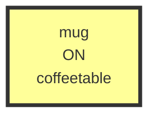
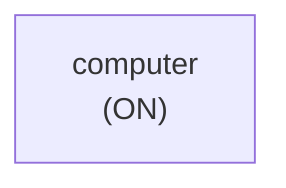
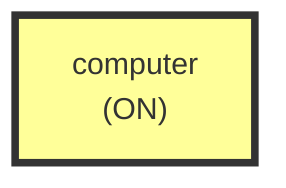

# 🚀 VirtualHome Agent Episode Log


### [GoalReasoner (Module A - Intent)] Output
```json
{
  "is_instruction_obviously_vague": false,
  "clarification_question": null,
  "target_object": "book",
  "location_hint": "sofa",
  "reasoning_chain": [
    {
      "question": "Why does the user want this object?",
      "answer": "To relocate an unorganized book to the sofa."
    },
    {
      "question": "Why is that important?",
      "answer": "To place the book in the desired resting or storage area."
    },
    {
      "question": "What fundamental need does this fulfill?",
      "answer": "It fulfills the need to organize or reposition reading material within the home."
    },
    {
      "question": "Are there any deeper psychological or physical motivations?",
      "answer": "Likely to tidy the space by moving misplaced items to a preferred spot for later use or access."
    }
  ],
  "deep_intent": "The user wants to organize or relocate a misplaced household item to a preferred seating area.",
  "acceptable_alternatives_properties": [
    {
      "priority": 1,
      "description": "Other loose reading materials or paper items that are similarly misplaced, such as magazines, notebooks, or documents."
    },
    {
      "priority": 2,
      "description": "Other small portable household items that belong on the sofa area, such as a remote control or cushion."
    },
    {
      "priority": 3,
      "description": "General clutter items from the same room that can be tidied into an organized resting area."
    },
    {
      "priority": 4,
      "description": "Items intended for casual use or temporary placement in the living area, even if they are not reading materials."
    }
  ]
}
```

### [RoboStateMultiTaskController] Output
```json
{
  "action": "[walk] <kitchen> (11)",
  "active_task_id": "task_2",
  "task_context": {
    "active_task_id": "task_2",
    "pending_task_ids": [
      "task_1",
      "task_3"
    ],
    "satisfied_task_ids": []
  },
  "source": "room_frontier"
}
```
## Step 0
- **Action**: `[walk] <kitchen> (11)`
- **Action Success**: `True`
- **Action Message**: {'0': {'message': 'Success'}}
- **Active Task**: `task_2`
- **Decision Source**: `room_frontier`
- **Task Progress**: E1_11=pending, E1_03=pending, E1_07=pending
- **SDG Status**:

- **Observed Items (38)**: floor(242), floor(243), floor(244), floor(245), ceiling(246), ceiling(247), ceiling(248), ceiling(249), wall(250), wall(251), wall(252), wall(253), door(254) [OPEN], ceilinglamp(255), tablelamp(256) [ON]...


### [RoboStateMultiTaskController] Output
```json
{
  "action": "[walk] <livingroom> (183)",
  "active_task_id": "task_2",
  "task_context": {
    "active_task_id": "task_2",
    "pending_task_ids": [
      "task_1",
      "task_3"
    ],
    "satisfied_task_ids": []
  },
  "source": "room_frontier"
}
```
## Step 1
- **Action**: `[walk] <livingroom> (183)`
- **Action Success**: `True`
- **Action Message**: {'0': {'message': 'Success'}}
- **Active Task**: `task_2`
- **Decision Source**: `room_frontier`
- **Task Progress**: E1_11=pending, E1_03=pending, E1_07=pending
- **SDG Status**:

- **Observed Items (192)**: floor(242), floor(243), floor(244), floor(245), ceiling(246), ceiling(247), ceiling(248), ceiling(249), wall(250), wall(251), wall(252), wall(253), door(254) [OPEN], ceilinglamp(255), tablelamp(256) [ON]...


### [PerceptionFilter] Output
```json
{
  "reasoning": "The goal is to place the book on the sofa, so only the target object and the destination location are necessary. No extra tools or alternative receptacles are required for a simple relocation task.",
  "selected_classes": [
    "sofa",
    "book",
    "character"
  ],
  "raw_class_count": 66
}
```

### [LLMExecutor] Output
```json
{
  "reasoning": "The active goal is to place a book on the sofa. We are already in the livingroom, and the sofa is present. Among the books, book(105) is the best candidate because it is explicitly close to the character, suggesting it is the most accessible to grab next. To move it onto the sofa, the next atomic step must be to walk to the book before any grab or placement action. This advances toward satisfying N1 by approaching the target item.",
  "satisfied_nodes": [],
  "current_node_focus": "N1",
  "mapped_variables": {
    "?TargetBook": "book(105)",
    "?Destination": "sofa(214)"
  },
  "action": "[walk] <book> (105)"
}
```

### [RoboStateMultiTaskController] Output
```json
{
  "action": "[walk] <book> (105)",
  "active_task_id": "task_2",
  "task_context": {
    "active_task_id": "task_2",
    "pending_task_ids": [
      "task_1",
      "task_3"
    ],
    "satisfied_task_ids": []
  },
  "source": "llm_executor"
}
```
## Step 2
- **Action**: `[walk] <book> (105)`
- **Action Success**: `True`
- **Action Message**: {'0': {'message': 'Success'}}
- **Active Task**: `task_2`
- **Decision Source**: `llm_executor`
- **Task Progress**: E1_11=pending, E1_03=pending, E1_07=pending
- **SDG Status**:

- **Observed Items (11)**: book(275) [CLOSED], character(1), kitchen(11), livingroom(183), bedroom(241), bathroom(285), bedroom(346), sofa(214), book(229) [CLOSED], book(230) [CLOSED], book(105) [CLOSED]


### [PerceptionFilter] Output
```json
{
  "reasoning": "Reused cached class selection.",
  "selected_classes": [
    "sofa",
    "book",
    "character"
  ],
  "raw_class_count": 66
}
```

### [LLMExecutor] Output
```json
{
  "reasoning": "The active goal is to place a book ON the sofa. The current graph shows book(105) is already close to the character in the living room, and the sofa(214) is also close. Since putback onto a surface requires being near the destination and the book must be held first, the next progress-making action is to grab the nearby book(105).",
  "satisfied_nodes": [],
  "current_node_focus": "N1",
  "mapped_variables": {},
  "action": "[grab] <book> (105)"
}
```

### [RoboStateMultiTaskController] Output
```json
{
  "action": "[grab] <book> (105)",
  "active_task_id": "task_2",
  "task_context": {
    "active_task_id": "task_2",
    "pending_task_ids": [
      "task_1",
      "task_3"
    ],
    "satisfied_task_ids": []
  },
  "source": "llm_executor"
}
```
## Step 3
- **Action**: `[grab] <book> (105)`
- **Action Success**: `True`
- **Action Message**: {'0': {'message': 'Success'}}
- **Active Task**: `task_2`
- **Decision Source**: `llm_executor`
- **Task Progress**: E1_11=pending, E1_03=pending, E1_07=pending
- **SDG Status**:

- **Observed Items (11)**: book(275) [CLOSED], character(1), kitchen(11), livingroom(183), bedroom(241), bathroom(285), bedroom(346), sofa(214), book(229) [CLOSED], book(230) [CLOSED], book(105) [CLOSED]


### [PerceptionFilter] Output
```json
{
  "reasoning": "Reused cached class selection.",
  "selected_classes": [
    "sofa",
    "book",
    "character"
  ],
  "raw_class_count": 66
}
```

### [LLMExecutor] Output
```json
{
  "reasoning": "The active goal is to place the held book onto the sofa. The character is already close to sofa(214) and is holding book(105) in the right hand, so the next required step is to place the book on the sofa surface. The sofa is a valid flat surface, so [putback] is the correct action.",
  "satisfied_nodes": [],
  "current_node_focus": "N1",
  "mapped_variables": {},
  "action": "[putback] <book> (105) <sofa> (214)"
}
```

### [RoboStateMultiTaskController] Output
```json
{
  "action": "[putback] <book> (105) <sofa> (214)",
  "active_task_id": "task_2",
  "task_context": {
    "active_task_id": "task_2",
    "pending_task_ids": [
      "task_1",
      "task_3"
    ],
    "satisfied_task_ids": []
  },
  "source": "llm_executor"
}
```
## Step 4
- **Action**: `[putback] <book> (105) <sofa> (214)`
- **Action Success**: `True`
- **Action Message**: {'0': {'message': 'Success'}}
- **Active Task**: `task_2`
- **Decision Source**: `llm_executor`
- **Task Progress**: E1_11=pending, E1_03=done, E1_07=pending
- **SDG Status**:

- **Observed Items (11)**: book(275) [CLOSED], character(1), kitchen(11), livingroom(183), bedroom(241), bathroom(285), bedroom(346), sofa(214), book(229) [CLOSED], book(230) [CLOSED], book(105) [CLOSED]


### [GoalReasoner (Module A - Intent)] Output
```json
{
  "is_instruction_obviously_vague": false,
  "clarification_question": null,
  "target_object": "mug",
  "location_hint": "coffeetable",
  "reasoning_chain": [
    {
      "question": "Why does the user want this object?",
      "answer": "They want the mug kept in a specific place."
    },
    {
      "question": "Why is that important?",
      "answer": "To ensure the mug remains on the coffee table instead of elsewhere."
    },
    {
      "question": "What fundamental need does this fulfill?",
      "answer": "It fulfills the need for organized placement and consistent object location."
    },
    {
      "question": "Are there any deeper psychological or physical motivations?",
      "answer": "It may reflect a preference for tidiness, accessibility, or maintaining a stable home environment."
    }
  ],
  "deep_intent": "The user wants an object kept in a specific designated location.",
  "acceptable_alternatives_properties": [
    {
      "priority": 1,
      "description": "Other small household items that can be kept on the coffee table, such as a cup, bowl, or coaster"
    },
    {
      "priority": 2,
      "description": "Other tabletop items that can remain in a fixed spot, such as a remote or book"
    },
    {
      "priority": 3,
      "description": "Any small indoor objects that can be organized and left in one place"
    },
    {
      "priority": 4,
      "description": "Other household items whose main need is stable placement rather than movement"
    }
  ]
}
```

### [PerceptionFilter] Output
```json
{
  "reasoning": "The goal is to keep the mug on the coffeetable, so the only strictly necessary classes are the target object and its required location. No additional tools or receptacles are implied.",
  "selected_classes": [
    "book",
    "character",
    "coffeetable",
    "mug",
    "door"
  ],
  "raw_class_count": 66
}
```

### [LLMExecutor] Output
```json
{
  "reasoning": "The active goal is to ensure the mug is ON the coffeetable. The current graph shows mug(384) is in the kitchen, while the coffeetable(215) is in the living room and the character is already close to the coffeetable. Since placing requires first being near the destination, the next atomic step should be to walk to the coffeetable before any putback action. This does not manipulate any satisfied-task objects.",
  "satisfied_nodes": [],
  "current_node_focus": "N1",
  "mapped_variables": {
    "?Mug": "mug(384)",
    "?Table": "coffeetable(215)"
  },
  "action": "[walk] <coffeetable> (215)"
}
```

### [RoboStateMultiTaskController] Output
```json
{
  "action": "[walk] <coffeetable> (215)",
  "active_task_id": "task_3",
  "task_context": {
    "active_task_id": "task_3",
    "pending_task_ids": [
      "task_1"
    ],
    "satisfied_task_ids": [
      "task_2"
    ]
  },
  "source": "llm_executor"
}
```
## Step 5
- **Action**: `[walk] <coffeetable> (215)`
- **Action Success**: `True`
- **Action Message**: {'0': {'message': 'Success'}}
- **Active Task**: `task_3`
- **Decision Source**: `llm_executor`
- **Task Progress**: E1_11=pending, E1_03=done, E1_07=pending
- **SDG Status**:

- **Observed Items (14)**: door(254) [OPEN], book(275) [CLOSED], character(1), kitchen(11), livingroom(183), bedroom(241), bathroom(285), bedroom(346), door(47) [OPEN], mug(384), coffeetable(215), book(229) [CLOSED], book(230) [CLOSED], book(105) [CLOSED]


### [PerceptionFilter] Output
```json
{
  "reasoning": "Reused cached class selection.",
  "selected_classes": [
    "book",
    "character",
    "coffeetable",
    "mug",
    "door"
  ],
  "raw_class_count": 66
}
```

### [LLMExecutor] Output
```json
{
  "reasoning": "The active SDG requires mug(384) to be ON coffeetable(215). I am already close to the coffeetable, but the mug is currently in the kitchen, so the next step is to go to the mug before grabbing it. I should not attempt to grab across the room, and I should not manipulate any satisfied-task objects.",
  "satisfied_nodes": [],
  "current_node_focus": "N1",
  "mapped_variables": {},
  "action": "[walk] <mug> (384)"
}
```

### [RoboStateMultiTaskController] Output
```json
{
  "action": "[walk] <mug> (384)",
  "active_task_id": "task_3",
  "task_context": {
    "active_task_id": "task_3",
    "pending_task_ids": [
      "task_1"
    ],
    "satisfied_task_ids": [
      "task_2"
    ]
  },
  "source": "llm_executor"
}
```
## Step 6
- **Action**: `[walk] <mug> (384)`
- **Action Success**: `True`
- **Action Message**: {'0': {'message': 'Success'}}
- **Active Task**: `task_3`
- **Decision Source**: `llm_executor`
- **Task Progress**: E1_11=pending, E1_03=done, E1_07=pending
- **SDG Status**:

- **Observed Items (14)**: door(254) [OPEN], book(275) [CLOSED], character(1), kitchen(11), livingroom(183), bedroom(241), bathroom(285), bedroom(346), door(47) [OPEN], mug(384), coffeetable(215), book(229) [CLOSED], book(230) [CLOSED], book(105) [CLOSED]


### [PerceptionFilter] Output
```json
{
  "reasoning": "Reused cached class selection.",
  "selected_classes": [
    "book",
    "character",
    "coffeetable",
    "mug",
    "door"
  ],
  "raw_class_count": 66
}
```

### [LLMExecutor] Output
```json
{
  "reasoning": "The goal is to have mug(384) on coffeetable(215). The current graph shows the mug is close to the character and the character is already close to the coffeetable, so the mug should be retrievable without another walk. Since the mug is grabbable and the target is a flat surface, the next progress-making step is to grab the mug before placing it on the coffee table.",
  "satisfied_nodes": [],
  "current_node_focus": "N1",
  "mapped_variables": {
    "?TargetObject": "mug(384)",
    "?Surface": "coffeetable(215)"
  },
  "action": "[grab] <mug> (384)"
}
```

### [RoboStateMultiTaskController] Output
```json
{
  "action": "[grab] <mug> (384)",
  "active_task_id": "task_3",
  "task_context": {
    "active_task_id": "task_3",
    "pending_task_ids": [
      "task_1"
    ],
    "satisfied_task_ids": [
      "task_2"
    ]
  },
  "source": "llm_executor"
}
```
## Step 7
- **Action**: `[grab] <mug> (384)`
- **Action Success**: `True`
- **Action Message**: {'0': {'message': 'Success'}}
- **Active Task**: `task_3`
- **Decision Source**: `llm_executor`
- **Task Progress**: E1_11=pending, E1_03=done, E1_07=pending
- **SDG Status**:

- **Observed Items (14)**: door(254) [OPEN], book(275) [CLOSED], character(1), kitchen(11), livingroom(183), bedroom(241), bathroom(285), bedroom(346), door(47) [OPEN], mug(384), coffeetable(215), book(229) [CLOSED], book(230) [CLOSED], book(105) [CLOSED]


### [PerceptionFilter] Output
```json
{
  "reasoning": "Reused cached class selection.",
  "selected_classes": [
    "book",
    "character",
    "coffeetable",
    "mug",
    "door"
  ],
  "raw_class_count": 66
}
```

### [LLMExecutor] Output
```json
{
  "reasoning": "The active SDG requires mug(384) to be ON coffeetable(215). The mug is already held in the right hand and the coffee table is close to the character. Since putback requires being explicitly near the destination first, the next atomic step is to walk to the coffee table so the mug can be placed there on the following action.",
  "satisfied_nodes": [],
  "current_node_focus": "N1",
  "mapped_variables": {},
  "action": "[walk] <coffeetable> (215)"
}
```

### [RoboStateMultiTaskController] Output
```json
{
  "action": "[walk] <coffeetable> (215)",
  "active_task_id": "task_3",
  "task_context": {
    "active_task_id": "task_3",
    "pending_task_ids": [
      "task_1"
    ],
    "satisfied_task_ids": [
      "task_2"
    ]
  },
  "source": "llm_executor"
}
```
## Step 8
- **Action**: `[walk] <coffeetable> (215)`
- **Action Success**: `True`
- **Action Message**: {'0': {'message': 'Success'}}
- **Active Task**: `task_3`
- **Decision Source**: `llm_executor`
- **Task Progress**: E1_11=pending, E1_03=done, E1_07=pending
- **SDG Status**:

- **Observed Items (14)**: door(254) [OPEN], book(275) [CLOSED], character(1), kitchen(11), livingroom(183), bedroom(241), bathroom(285), bedroom(346), door(47) [OPEN], mug(384), coffeetable(215), book(229) [CLOSED], book(230) [CLOSED], book(105) [CLOSED]


### [PerceptionFilter] Output
```json
{
  "reasoning": "Reused cached class selection.",
  "selected_classes": [
    "book",
    "character",
    "coffeetable",
    "mug",
    "door"
  ],
  "raw_class_count": 66
}
```

### [LLMExecutor] Output
```json
{
  "reasoning": "The active goal is to have the mug on the coffeetable. The mug is already held and the character is already close to the coffeetable, so the next needed atomic step is to place the mug onto that surface. The coffeetable is a flat surface, so [putback] is the correct action.",
  "satisfied_nodes": [],
  "current_node_focus": "N1",
  "mapped_variables": {},
  "action": "[putback] <mug> (384) <coffeetable> (215)"
}
```

### [RoboStateMultiTaskController] Output
```json
{
  "action": "[putback] <mug> (384) <coffeetable> (215)",
  "active_task_id": "task_3",
  "task_context": {
    "active_task_id": "task_3",
    "pending_task_ids": [
      "task_1"
    ],
    "satisfied_task_ids": [
      "task_2"
    ]
  },
  "source": "llm_executor"
}
```
## Step 9
- **Action**: `[putback] <mug> (384) <coffeetable> (215)`
- **Action Success**: `True`
- **Action Message**: {'0': {'message': 'Success'}}
- **Active Task**: `task_3`
- **Decision Source**: `llm_executor`
- **Task Progress**: E1_11=pending, E1_03=done, E1_07=done
- **SDG Status**:

- **Observed Items (14)**: door(254) [OPEN], book(275) [CLOSED], character(1), kitchen(11), livingroom(183), bedroom(241), bathroom(285), bedroom(346), door(47) [OPEN], mug(384), coffeetable(215), book(229) [CLOSED], book(230) [CLOSED], book(105) [CLOSED]


### [GoalReasoner (Module A - Intent)] Output
```json
{
  "is_instruction_obviously_vague": false,
  "clarification_question": null,
  "target_object": "computer",
  "location_hint": null,
  "reasoning_chain": [
    {
      "question": "Why does the user want this object?",
      "answer": "To have the device powered on and usable."
    },
    {
      "question": "Why is that important?",
      "answer": "Because an off computer cannot be interacted with or used for tasks."
    },
    {
      "question": "What fundamental need does this fulfill?",
      "answer": "The need to operate a computing device and access its functions."
    },
    {
      "question": "Are there any deeper psychological or physical motivations?",
      "answer": "The user likely wants to continue work, communication, or another digital activity that requires the computer to be on."
    }
  ],
  "deep_intent": "The user wants to make a computing device operational.",
  "acceptable_alternatives_properties": [
    {
      "priority": 1,
      "description": "Another powered-on computer or similar computing device that can provide the same function"
    },
    {
      "priority": 2,
      "description": "A laptop, desktop, or tablet that is already on and usable"
    },
    {
      "priority": 3,
      "description": "Any indoor electronic device that can perform the needed digital task"
    },
    {
      "priority": 4,
      "description": "Access to a shared or nearby computer that is already powered on"
    }
  ]
}
```

### [RoboStateMultiTaskController] Output
```json
{
  "action": "[walk] <bathroom> (285)",
  "active_task_id": "task_1",
  "task_context": {
    "active_task_id": "task_1",
    "pending_task_ids": [],
    "satisfied_task_ids": [
      "task_2",
      "task_3"
    ]
  },
  "source": "room_frontier"
}
```
## Step 10
- **Action**: `[walk] <bathroom> (285)`
- **Action Success**: `True`
- **Action Message**: {'0': {'message': 'Success'}}
- **Active Task**: `task_1`
- **Decision Source**: `room_frontier`
- **Task Progress**: E1_11=pending, E1_03=done, E1_07=done
- **SDG Status**:

- **Observed Items (245)**: floor(242), floor(243), floor(244), floor(245), ceiling(246), ceiling(247), ceiling(248), ceiling(249), wall(250), wall(251), wall(252), wall(253), door(254) [OPEN], ceilinglamp(255), tablelamp(256) [ON]...


### [RoboStateMultiTaskController] Output
```json
{
  "action": "[walk] <bedroom> (346)",
  "active_task_id": "task_1",
  "task_context": {
    "active_task_id": "task_1",
    "pending_task_ids": [],
    "satisfied_task_ids": [
      "task_2",
      "task_3"
    ]
  },
  "source": "room_frontier"
}
```
## Step 11
- **Action**: `[walk] <bedroom> (346)`
- **Action Success**: `True`
- **Action Message**: {'0': {'message': 'Success'}}
- **Active Task**: `task_1`
- **Decision Source**: `room_frontier`
- **Task Progress**: E1_11=pending, E1_03=done, E1_07=done
- **SDG Status**:

- **Observed Items (305)**: floor(242), floor(243), floor(244), floor(245), ceiling(246), ceiling(247), ceiling(248), ceiling(249), wall(250), wall(251), wall(252), wall(253), door(254) [OPEN], ceilinglamp(255), tablelamp(256) [ON]...


### [PerceptionFilter] Output
```json
{
  "reasoning": "The goal and SDG require a computer that is ON and usable. Since the object list includes a computer, and no additional tools or locations are needed to satisfy the stated state, only the computer class is necessary.",
  "selected_classes": [
    "character",
    "desk",
    "door",
    "computer"
  ],
  "raw_class_count": 91
}
```

### [LLMExecutor] Output
```json
{
  "reasoning": "The active goal is to make the computer operational, and the only unsatisfied SDG node is N1: computer ON. The current filtered graph shows computer(397) is in the same room as the character (both inside bedroom(346)), so proximity is sufficient for interaction. Since the computer has HAS_SWITCH and is currently OFF, the next atomic action to satisfy the goal is to switch it on.",
  "satisfied_nodes": [],
  "current_node_focus": "N1",
  "mapped_variables": {},
  "action": "[switchon] <computer> (397)"
}
```

### [RoboStateMultiTaskController] Output
```json
{
  "action": "[walk] <computer> (397)",
  "active_task_id": "task_1",
  "task_context": {
    "active_task_id": "task_1",
    "pending_task_ids": [],
    "satisfied_task_ids": [
      "task_2",
      "task_3"
    ]
  },
  "source": "llm_executor_repaired"
}
```
## Step 12
- **Action**: `[walk] <computer> (397)`
- **Action Success**: `True`
- **Action Message**: {'0': {'message': 'Success'}}
- **Active Task**: `task_1`
- **Decision Source**: `llm_executor_repaired`
- **Task Progress**: E1_11=pending, E1_03=done, E1_07=done
- **SDG Status**:

- **Observed Items (12)**: door(254) [OPEN], desk(281) [CLOSED], character(1), kitchen(11), livingroom(183), bedroom(241), bathroom(285), bedroom(346), door(47) [OPEN], door(305) [OPEN], desk(393) [CLOSED], computer(397) [OFF]


### [PerceptionFilter] Output
```json
{
  "reasoning": "Reused cached class selection.",
  "selected_classes": [
    "character",
    "desk",
    "door",
    "computer"
  ],
  "raw_class_count": 91
}
```

### [LLMExecutor] Output
```json
{
  "reasoning": "The active SDG has one unmet node: the computer must be ON. The current graph shows character(1) is already CLOSE to computer(397), and the computer has HAS_SWITCH with state OFF. Since we are already near it, the next atomic step is to switch it on.",
  "satisfied_nodes": [],
  "current_node_focus": "N1",
  "mapped_variables": {},
  "action": "[switchon] <computer> (397)"
}
```

### [RoboStateMultiTaskController] Output
```json
{
  "action": "[switchon] <computer> (397)",
  "active_task_id": "task_1",
  "task_context": {
    "active_task_id": "task_1",
    "pending_task_ids": [],
    "satisfied_task_ids": [
      "task_2",
      "task_3"
    ]
  },
  "source": "llm_executor"
}
```
## Step 13
- **Action**: `[switchon] <computer> (397)`
- **Action Success**: `True`
- **Action Message**: Faked switch operation in Python layer (bypassed Unity failure)
- **Active Task**: `task_1`
- **Decision Source**: `llm_executor`
- **Task Progress**: E1_11=done, E1_03=done, E1_07=done
- **SDG Status**:

- **Observed Items (12)**: door(254) [OPEN], desk(281) [CLOSED], character(1), kitchen(11), livingroom(183), bedroom(241), bathroom(285), bedroom(346), door(47) [OPEN], door(305) [OPEN], desk(393) [CLOSED], computer(397) [OFF]

