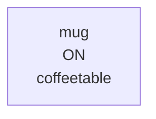
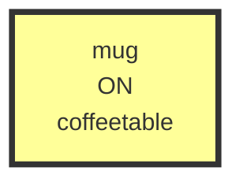
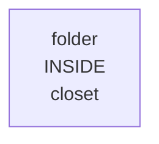
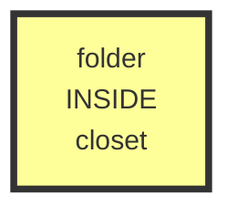

# 🚀 VirtualHome Agent Episode Log


### [GoalReasoner (Module A - Intent)] Output
```json
{
  "is_instruction_obviously_vague": false,
  "clarification_question": null,
  "target_object": "mug",
  "location_hint": "coffeetable",
  "reasoning_chain": [
    {
      "question": "Why does the user want this object?",
      "answer": "To keep the mug in a specific place."
    },
    {
      "question": "Why is that important?",
      "answer": "To ensure the mug remains on the coffeetable rather than elsewhere."
    },
    {
      "question": "What fundamental need does this fulfill?",
      "answer": "It fulfills the need to organize or maintain the mug's location in the home."
    },
    {
      "question": "Are there any deeper psychological or physical motivations?",
      "answer": "The user may want convenience, tidiness, or easy access to the mug."
    }
  ],
  "deep_intent": "The user wants the mug to remain in a fixed location for organization and convenience.",
  "acceptable_alternatives_properties": [
    {
      "priority": 1,
      "description": "Other handheld drink containers or cups that can similarly be kept on the coffeetable."
    },
    {
      "priority": 2,
      "description": "Similar tabletop items used for drinking or holding beverages, such as a glass or tumbler."
    },
    {
      "priority": 3,
      "description": "Other small household items that can be placed and kept on the coffeetable for organization."
    },
    {
      "priority": 4,
      "description": "Any nearby storage or resting spot for a drink container, such as a tray or coaster area, if the exact placement is not possible."
    }
  ]
}
```

### [RoboStateMultiTaskController] Output
```json
{
  "action": "[walk] <livingroom> (183)",
  "active_task_id": "E1_07",
  "task_context": {
    "active_task_id": "E1_07",
    "pending_task_ids": [
      "E1_03",
      "E1_15"
    ],
    "satisfied_task_ids": []
  },
  "source": "room_frontier"
}
```
## Step 0
- **Action**: `[walk] <livingroom> (183)`
- **Action Success**: `True`
- **Action Message**: {'0': {'message': 'Success'}}
- **Active Task**: `E1_07`
- **Decision Source**: `room_frontier`
- **Task Progress**: E1_03=pending, E1_07=pending, E1_15=pending
- **SDG Status**:

- **Observed Items (160)**: wall(12), wall(13), wall(14), wall(15), wall(16), wall(17), wall(18), wall(19), wall(20), wall(21), floor(22), floor(23), floor(24), floor(25), floor(26)...


### [PerceptionFilter] Output
```json
{
  "reasoning": "The goal is to keep the mug on the coffeetable, so the only strictly necessary classes are the target container and the specified location. No extra tool or backup is required for this placement task.",
  "selected_classes": [
    "coffeetable",
    "mug",
    "character"
  ],
  "raw_class_count": 60
}
```

### [LLMExecutor] Output
```json
{
  "reasoning": "The active goal is to make the mug be ON the coffeetable. The character is already CLOSE to the coffeetable, but the mug is currently INSIDE the kitchen, so the first necessary step is to go to the mug. I will move to mug(384) so it can be grabbed next. The coffeetable is already identified as the correct target surface for later placement.",
  "satisfied_nodes": [],
  "current_node_focus": "N1",
  "mapped_variables": {},
  "action": "[walk] <mug> (384)"
}
```

### [RoboStateMultiTaskController] Output
```json
{
  "action": "[walk] <mug> (384)",
  "active_task_id": "E1_07",
  "task_context": {
    "active_task_id": "E1_07",
    "pending_task_ids": [
      "E1_03",
      "E1_15"
    ],
    "satisfied_task_ids": []
  },
  "source": "llm_executor"
}
```
## Step 1
- **Action**: `[walk] <mug> (384)`
- **Action Success**: `True`
- **Action Message**: {'0': {'message': 'Success'}}
- **Active Task**: `E1_07`
- **Decision Source**: `llm_executor`
- **Task Progress**: E1_03=pending, E1_07=pending, E1_15=pending
- **SDG Status**:

- **Observed Items (8)**: mug(384), character(1), kitchen(11), livingroom(183), bedroom(241), bathroom(285), bedroom(346), coffeetable(215)


### [PerceptionFilter] Output
```json
{
  "reasoning": "Reused cached class selection.",
  "selected_classes": [
    "coffeetable",
    "mug",
    "character"
  ],
  "raw_class_count": 60
}
```

### [LLMExecutor] Output
```json
{
  "reasoning": "The active goal is to have mug(384) ON coffeetable(215). I have already walked to the mug and it is currently CLOSE to the character, so the next required step is to grab it before moving it to the coffeetable. The mug is grabbable and there is no indication it is dirty or otherwise blocked.",
  "satisfied_nodes": [],
  "current_node_focus": "N1",
  "mapped_variables": {
    "?TargetObject": "mug(384)",
    "?TargetSurface": "coffeetable(215)"
  },
  "action": "[grab] <mug> (384)"
}
```

### [RoboStateMultiTaskController] Output
```json
{
  "action": "[grab] <mug> (384)",
  "active_task_id": "E1_07",
  "task_context": {
    "active_task_id": "E1_07",
    "pending_task_ids": [
      "E1_03",
      "E1_15"
    ],
    "satisfied_task_ids": []
  },
  "source": "llm_executor"
}
```
## Step 2
- **Action**: `[grab] <mug> (384)`
- **Action Success**: `True`
- **Action Message**: {'0': {'message': 'Success'}}
- **Active Task**: `E1_07`
- **Decision Source**: `llm_executor`
- **Task Progress**: E1_03=pending, E1_07=pending, E1_15=pending
- **SDG Status**:

- **Observed Items (8)**: mug(384), character(1), kitchen(11), livingroom(183), bedroom(241), bathroom(285), bedroom(346), coffeetable(215)


### [PerceptionFilter] Output
```json
{
  "reasoning": "Reused cached class selection.",
  "selected_classes": [
    "coffeetable",
    "mug",
    "character"
  ],
  "raw_class_count": 60
}
```

### [LLMExecutor] Output
```json
{
  "reasoning": "The mug is already held, and the SDG requires it to be ON the coffeetable. I am currently in the kitchen with the mug, while the coffeetable is in the livingroom. The next atomic step toward placing the mug is to move near the destination surface before a putback can be issued.",
  "satisfied_nodes": [],
  "current_node_focus": "N1",
  "mapped_variables": {},
  "action": "[walk] <coffeetable> (215)"
}
```

### [RoboStateMultiTaskController] Output
```json
{
  "action": "[walk] <coffeetable> (215)",
  "active_task_id": "E1_07",
  "task_context": {
    "active_task_id": "E1_07",
    "pending_task_ids": [
      "E1_03",
      "E1_15"
    ],
    "satisfied_task_ids": []
  },
  "source": "llm_executor"
}
```
## Step 3
- **Action**: `[walk] <coffeetable> (215)`
- **Action Success**: `True`
- **Action Message**: {'0': {'message': 'Success'}}
- **Active Task**: `E1_07`
- **Decision Source**: `llm_executor`
- **Task Progress**: E1_03=pending, E1_07=pending, E1_15=pending
- **SDG Status**:

- **Observed Items (8)**: mug(384), character(1), kitchen(11), livingroom(183), bedroom(241), bathroom(285), bedroom(346), coffeetable(215)


### [PerceptionFilter] Output
```json
{
  "reasoning": "Reused cached class selection.",
  "selected_classes": [
    "coffeetable",
    "mug",
    "character"
  ],
  "raw_class_count": 60
}
```

### [LLMExecutor] Output
```json
{
  "reasoning": "The active goal is to place the held mug onto the coffeetable. The robot is already close to the coffeetable and is holding mug(384), so the next atomic step is to put it back onto the flat surface. This should satisfy N1 once executed.",
  "satisfied_nodes": [],
  "current_node_focus": "N1",
  "mapped_variables": {},
  "action": "[putback] <mug> (384) <coffeetable> (215)"
}
```

### [RoboStateMultiTaskController] Output
```json
{
  "action": "[putback] <mug> (384) <coffeetable> (215)",
  "active_task_id": "E1_07",
  "task_context": {
    "active_task_id": "E1_07",
    "pending_task_ids": [
      "E1_03",
      "E1_15"
    ],
    "satisfied_task_ids": []
  },
  "source": "llm_executor"
}
```
## Step 4
- **Action**: `[putback] <mug> (384) <coffeetable> (215)`
- **Action Success**: `True`
- **Action Message**: {'0': {'message': 'Success'}}
- **Active Task**: `E1_07`
- **Decision Source**: `llm_executor`
- **Task Progress**: E1_03=pending, E1_07=done, E1_15=pending
- **SDG Status**:

- **Observed Items (8)**: mug(384), character(1), kitchen(11), livingroom(183), bedroom(241), bathroom(285), bedroom(346), coffeetable(215)


### [GoalReasoner (Module A - Intent)] Output
```json
{
  "is_instruction_obviously_vague": false,
  "clarification_question": null,
  "target_object": "book",
  "location_hint": "sofa",
  "reasoning_chain": [
    {
      "question": "Why does the user want this object?",
      "answer": "They want the book moved from an unorganized place to the sofa."
    },
    {
      "question": "Why is that important?",
      "answer": "To place the book in a more organized or intended resting location."
    },
    {
      "question": "What fundamental need does this fulfill?",
      "answer": "It fulfills the need to organize and relocate an item to the desired area."
    },
    {
      "question": "Are there any deeper psychological or physical motivations?",
      "answer": "The user likely wants to tidy the space and keep the book accessible in a preferred spot."
    }
  ],
  "deep_intent": "The user wants to organize and relocate an item to a preferred seating area.",
  "acceptable_alternatives_properties": [
    {
      "priority": 1,
      "description": "Other readable items like magazines, notebooks, or documents that can be similarly moved to the sofa."
    },
    {
      "priority": 2,
      "description": "Other paper-based or book-like items that are out of place and need organizing."
    },
    {
      "priority": 3,
      "description": "Loose household items that are commonly tidied into a seating or resting area when left unorganized."
    },
    {
      "priority": 4,
      "description": "Other small portable objects that can be relocated to reduce clutter, such as remote controls or stationery."
    }
  ]
}
```

### [PerceptionFilter] Output
```json
{
  "reasoning": "The goal is to place the book on the sofa, so the only strictly necessary object classes are the target item and the destination furniture. No tool or alternative appliance is needed for this relocation task.",
  "selected_classes": [
    "book",
    "sofa",
    "character"
  ],
  "raw_class_count": 60
}
```

### [LLMExecutor] Output
```json
{
  "reasoning": "The active goal is to place book(105) on sofa(214). The book is already CLOSE to the character, so no walk is needed before grabbing. The sofa is also nearby, but the next atomic step toward the goal is to pick up the book first. The book is the exact target object required by N1, and it is grabbable and not reported dirty, so grabbing it is the correct progress step.",
  "satisfied_nodes": [],
  "current_node_focus": "N1",
  "mapped_variables": {},
  "action": "[grab] <book> (105)"
}
```

### [RoboStateMultiTaskController] Output
```json
{
  "action": "[grab] <book> (105)",
  "active_task_id": "E1_03",
  "task_context": {
    "active_task_id": "E1_03",
    "pending_task_ids": [
      "E1_15"
    ],
    "satisfied_task_ids": [
      "E1_07"
    ]
  },
  "source": "llm_executor"
}
```
## Step 5
- **Action**: `[grab] <book> (105)`
- **Action Success**: `True`
- **Action Message**: {'0': {'message': 'Success'}}
- **Active Task**: `E1_03`
- **Decision Source**: `llm_executor`
- **Task Progress**: E1_03=pending, E1_07=done, E1_15=pending
- **SDG Status**:

- **Observed Items (8)**: character(1), kitchen(11), livingroom(183), bedroom(241), bathroom(285), bedroom(346), sofa(214), book(105) [CLOSED]


### [PerceptionFilter] Output
```json
{
  "reasoning": "Reused cached class selection.",
  "selected_classes": [
    "book",
    "sofa",
    "character"
  ],
  "raw_class_count": 60
}
```

### [LLMExecutor] Output
```json
{
  "reasoning": "The book is already in hand and the sofa is close. The SDG goal is to place the book on the sofa, so the remaining gap is to put the held book onto the sofa. Because putback requires being explicitly near the destination first and we have not yet walked to the sofa in the current step sequence, the next atomic action is to walk to the sofa.",
  "satisfied_nodes": [],
  "current_node_focus": "N1",
  "mapped_variables": {},
  "action": "[walk] <sofa> (214)"
}
```

### [RoboStateMultiTaskController] Output
```json
{
  "action": "[walk] <sofa> (214)",
  "active_task_id": "E1_03",
  "task_context": {
    "active_task_id": "E1_03",
    "pending_task_ids": [
      "E1_15"
    ],
    "satisfied_task_ids": [
      "E1_07"
    ]
  },
  "source": "llm_executor"
}
```
## Step 6
- **Action**: `[walk] <sofa> (214)`
- **Action Success**: `True`
- **Action Message**: {'0': {'message': 'Success'}}
- **Active Task**: `E1_03`
- **Decision Source**: `llm_executor`
- **Task Progress**: E1_03=pending, E1_07=done, E1_15=pending
- **SDG Status**:

- **Observed Items (8)**: character(1), kitchen(11), livingroom(183), bedroom(241), bathroom(285), bedroom(346), sofa(214), book(105) [CLOSED]


### [PerceptionFilter] Output
```json
{
  "reasoning": "Reused cached class selection.",
  "selected_classes": [
    "book",
    "sofa",
    "character"
  ],
  "raw_class_count": 60
}
```

### [LLMExecutor] Output
```json
{
  "reasoning": "The book is already held in the right hand and the character is already close to the sofa. The SDG requires the book to be ON the sofa, so the remaining gap is to place the held book onto the nearby sofa. Since putback requires being near the surface and the graph confirms CLOSE sofa(214), the next atomic action is to put the book back onto the sofa.",
  "satisfied_nodes": [],
  "current_node_focus": "N1",
  "mapped_variables": {},
  "action": "[putback] <book> (105) <sofa> (214)"
}
```

### [RoboStateMultiTaskController] Output
```json
{
  "action": "[putback] <book> (105) <sofa> (214)",
  "active_task_id": "E1_03",
  "task_context": {
    "active_task_id": "E1_03",
    "pending_task_ids": [
      "E1_15"
    ],
    "satisfied_task_ids": [
      "E1_07"
    ]
  },
  "source": "llm_executor"
}
```
## Step 7
- **Action**: `[putback] <book> (105) <sofa> (214)`
- **Action Success**: `True`
- **Action Message**: {'0': {'message': 'Success'}}
- **Active Task**: `E1_03`
- **Decision Source**: `llm_executor`
- **Task Progress**: E1_03=done, E1_07=done, E1_15=pending
- **SDG Status**:

- **Observed Items (8)**: character(1), kitchen(11), livingroom(183), bedroom(241), bathroom(285), bedroom(346), sofa(214), book(105) [CLOSED]


### [GoalReasoner (Module A - Intent)] Output
```json
{
  "is_instruction_obviously_vague": false,
  "clarification_question": null,
  "target_object": "folder",
  "location_hint": "closet",
  "reasoning_chain": [
    {
      "question": "Why does the user want this object?",
      "answer": "They want the folder moved to a storage location."
    },
    {
      "question": "Why is that important?",
      "answer": "So the folder is put away in an organized place and not left out."
    },
    {
      "question": "What fundamental need does this fulfill?",
      "answer": "It fulfills the need to organize or store a physical item."
    },
    {
      "question": "Are there any deeper psychological or physical motivations?",
      "answer": "It may reduce clutter, keep the item accessible later, or maintain a tidy environment."
    }
  ],
  "deep_intent": "The user wants to store and organize a physical item in a designated enclosed storage space.",
  "acceptable_alternatives_properties": [
    {
      "priority": 1,
      "description": "Other paper files or documents that can be stored in the same place"
    },
    {
      "priority": 2,
      "description": "Similar office or paperwork items such as binders, envelopes, or notebooks"
    },
    {
      "priority": 3,
      "description": "Small storage-friendly items that can be put away in a closet"
    },
    {
      "priority": 4,
      "description": "Other household items that need organized storage rather than being left out"
    }
  ]
}
```

### [RoboStateMultiTaskController] Output
```json
{
  "action": "[walk] <bedroom> (241)",
  "active_task_id": "E1_15",
  "task_context": {
    "active_task_id": "E1_15",
    "pending_task_ids": [],
    "satisfied_task_ids": [
      "E1_03",
      "E1_07"
    ]
  },
  "source": "room_frontier"
}
```
## Step 8
- **Action**: `[walk] <bedroom> (241)`
- **Action Success**: `True`
- **Action Message**: {'0': {'message': 'Success'}}
- **Active Task**: `E1_15`
- **Decision Source**: `room_frontier`
- **Task Progress**: E1_03=done, E1_07=done, E1_15=pending
- **SDG Status**:

- **Observed Items (211)**: wall(12), wall(13), wall(14), wall(15), wall(16), wall(17), wall(18), wall(19), wall(20), wall(21), floor(22), floor(23), floor(24), floor(25), floor(26)...


### [RoboStateMultiTaskController] Output
```json
{
  "action": "[walk] <bathroom> (285)",
  "active_task_id": "E1_15",
  "task_context": {
    "active_task_id": "E1_15",
    "pending_task_ids": [],
    "satisfied_task_ids": [
      "E1_03",
      "E1_07"
    ]
  },
  "source": "room_frontier"
}
```
## Step 9
- **Action**: `[walk] <bathroom> (285)`
- **Action Success**: `True`
- **Action Message**: {'0': {'message': 'Success'}}
- **Active Task**: `E1_15`
- **Decision Source**: `room_frontier`
- **Task Progress**: E1_03=done, E1_07=done, E1_15=pending
- **SDG Status**:

- **Observed Items (241)**: wall(12), wall(13), wall(14), wall(15), wall(16), wall(17), wall(18), wall(19), wall(20), wall(21), floor(22), floor(23), floor(24), floor(25), floor(26)...


### [RoboStateMultiTaskController] Output
```json
{
  "action": "[walk] <bedroom> (346)",
  "active_task_id": "E1_15",
  "task_context": {
    "active_task_id": "E1_15",
    "pending_task_ids": [],
    "satisfied_task_ids": [
      "E1_03",
      "E1_07"
    ]
  },
  "source": "room_frontier"
}
```
## Step 10
- **Action**: `[walk] <bedroom> (346)`
- **Action Success**: `True`
- **Action Message**: {'0': {'message': 'Success'}}
- **Active Task**: `E1_15`
- **Decision Source**: `room_frontier`
- **Task Progress**: E1_03=done, E1_07=done, E1_15=pending
- **SDG Status**:

- **Observed Items (301)**: wall(12), wall(13), wall(14), wall(15), wall(16), wall(17), wall(18), wall(19), wall(20), wall(21), floor(22), floor(23), floor(24), floor(25), floor(26)...


### [PerceptionFilter] Output
```json
{
  "reasoning": "The goal is to put the folder inside the closet, so the only strictly necessary classes are the target item and the destination storage location. No tool or alternative receptacle is required by the SDG.",
  "selected_classes": [
    "book",
    "folder",
    "character",
    "closet"
  ],
  "raw_class_count": 91
}
```

### [LLMExecutor] Output
```json
{
  "reasoning": "The active goal is to place the folder inside the closet. The closet is already open, but the folder is currently in bedroom(241) and the character is in bedroom(346), so the next required step is to move to the folder before it can be grabbed. No other SDG node is satisfied yet because the folder is not inside the closet.",
  "satisfied_nodes": [],
  "current_node_focus": "N1",
  "mapped_variables": {
    "?Container": "closet(395)"
  },
  "action": "[walk] <folder> (121)"
}
```

### [RoboStateMultiTaskController] Output
```json
{
  "action": "[walk] <folder> (121)",
  "active_task_id": "E1_15",
  "task_context": {
    "active_task_id": "E1_15",
    "pending_task_ids": [],
    "satisfied_task_ids": [
      "E1_03",
      "E1_07"
    ]
  },
  "source": "llm_executor"
}
```
## Step 11
- **Action**: `[walk] <folder> (121)`
- **Action Success**: `True`
- **Action Message**: {'0': {'message': 'Success'}}
- **Active Task**: `E1_15`
- **Decision Source**: `llm_executor`
- **Task Progress**: E1_03=done, E1_07=done, E1_15=pending
- **SDG Status**:

- **Observed Items (9)**: character(1), kitchen(11), livingroom(183), bedroom(241), bathroom(285), bedroom(346), book(105) [CLOSED], folder(121) [CLOSED], closet(395) [OPEN]


### [PerceptionFilter] Output
```json
{
  "reasoning": "Reused cached class selection.",
  "selected_classes": [
    "book",
    "folder",
    "character",
    "closet"
  ],
  "raw_class_count": 91
}
```

### [LLMExecutor] Output
```json
{
  "reasoning": "The active goal is to place the folder inside the closet. The folder (121) is already close to the character and can be grabbed; the closet exists separately and is open, but the task requires the folder to end up inside it. Since I am not currently holding the folder and need it before transporting it, the next atomic step is to grab it. After that, I will need to walk to the closet before putting it in.",
  "satisfied_nodes": [],
  "current_node_focus": "N1",
  "mapped_variables": {
    "?Container": "closet(395)"
  },
  "action": "[grab] <folder> (121)"
}
```

### [RoboStateMultiTaskController] Output
```json
{
  "action": "[grab] <folder> (121)",
  "active_task_id": "E1_15",
  "task_context": {
    "active_task_id": "E1_15",
    "pending_task_ids": [],
    "satisfied_task_ids": [
      "E1_03",
      "E1_07"
    ]
  },
  "source": "llm_executor"
}
```
## Step 12
- **Action**: `[grab] <folder> (121)`
- **Action Success**: `True`
- **Action Message**: {'0': {'message': 'Success'}}
- **Active Task**: `E1_15`
- **Decision Source**: `llm_executor`
- **Task Progress**: E1_03=done, E1_07=done, E1_15=pending
- **SDG Status**:

- **Observed Items (9)**: character(1), kitchen(11), livingroom(183), bedroom(241), bathroom(285), bedroom(346), book(105) [CLOSED], folder(121) [CLOSED], closet(395) [OPEN]


### [PerceptionFilter] Output
```json
{
  "reasoning": "Reused cached class selection.",
  "selected_classes": [
    "book",
    "folder",
    "character",
    "closet"
  ],
  "raw_class_count": 91
}
```

### [LLMExecutor] Output
```json
{
  "reasoning": "The active goal is to place the held folder inside the closet. The folder is already held in the right hand, and the closet is open, but the robot is currently in bedroom(241) while the closet is in bedroom(346). Since putin requires being near the destination, the next step is to walk to the closet before attempting to put the folder inside it.",
  "satisfied_nodes": [],
  "current_node_focus": "N1",
  "mapped_variables": {
    "?Container": "closet(395)"
  },
  "action": "[walk] <closet> (395)"
}
```

### [RoboStateMultiTaskController] Output
```json
{
  "action": "[walk] <closet> (395)",
  "active_task_id": "E1_15",
  "task_context": {
    "active_task_id": "E1_15",
    "pending_task_ids": [],
    "satisfied_task_ids": [
      "E1_03",
      "E1_07"
    ]
  },
  "source": "llm_executor"
}
```
## Step 13
- **Action**: `[walk] <closet> (395)`
- **Action Success**: `True`
- **Action Message**: {'0': {'message': 'Success'}}
- **Active Task**: `E1_15`
- **Decision Source**: `llm_executor`
- **Task Progress**: E1_03=done, E1_07=done, E1_15=pending
- **SDG Status**:

- **Observed Items (9)**: character(1), kitchen(11), livingroom(183), bedroom(241), bathroom(285), bedroom(346), book(105) [CLOSED], folder(121) [CLOSED], closet(395) [OPEN]


### [PerceptionFilter] Output
```json
{
  "reasoning": "Reused cached class selection.",
  "selected_classes": [
    "book",
    "folder",
    "character",
    "closet"
  ],
  "raw_class_count": 91
}
```

### [LLMExecutor] Output
```json
{
  "reasoning": "The folder is already being held and I am already close to the closet, which is open. The remaining gap for N1 is to place the folder inside the closet. Because put-in actions require being near the destination and the closet is the correct storage container, the next atomic step is to insert the held folder into the closet.",
  "satisfied_nodes": [],
  "current_node_focus": "N1",
  "mapped_variables": {},
  "action": "[putin] <folder> (121) <closet> (395)"
}
```

### [RoboStateMultiTaskController] Output
```json
{
  "action": "[putin] <folder> (121) <closet> (395)",
  "active_task_id": "E1_15",
  "task_context": {
    "active_task_id": "E1_15",
    "pending_task_ids": [],
    "satisfied_task_ids": [
      "E1_03",
      "E1_07"
    ]
  },
  "source": "llm_executor"
}
```
## Step 14
- **Action**: `[putin] <folder> (121) <closet> (395)`
- **Action Success**: `True`
- **Action Message**: {'0': {'message': 'Success'}}
- **Active Task**: `E1_15`
- **Decision Source**: `llm_executor`
- **Task Progress**: E1_03=done, E1_07=done, E1_15=done
- **SDG Status**:

- **Observed Items (9)**: character(1), kitchen(11), livingroom(183), bedroom(241), bathroom(285), bedroom(346), book(105) [CLOSED], folder(121) [CLOSED], closet(395) [OPEN]
