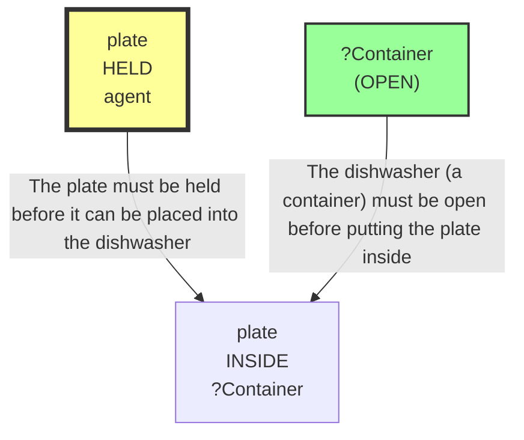
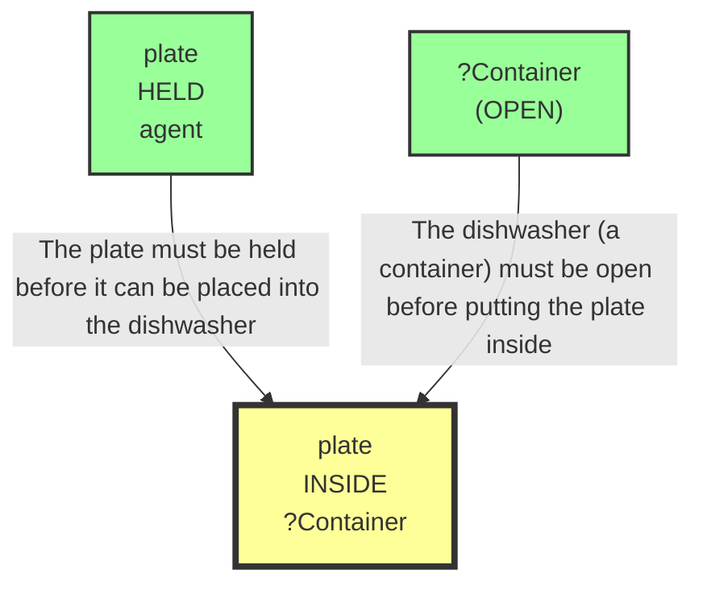
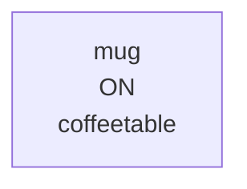
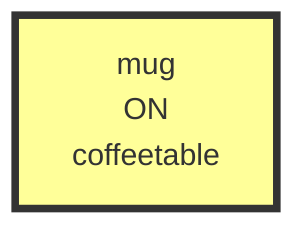
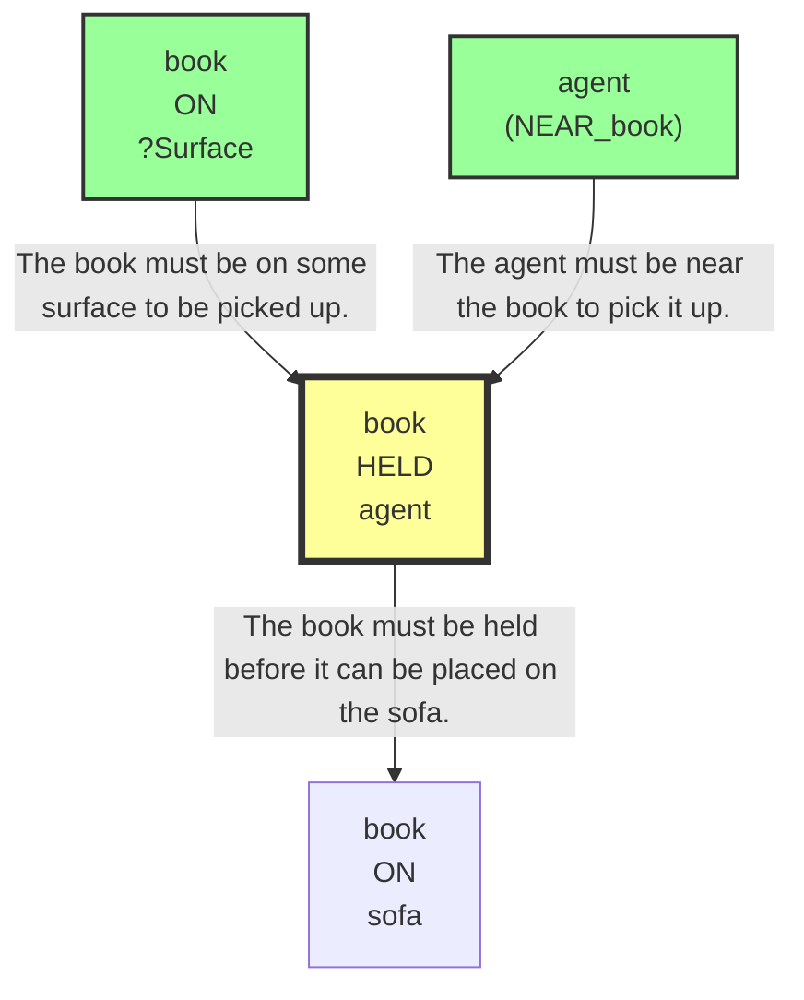
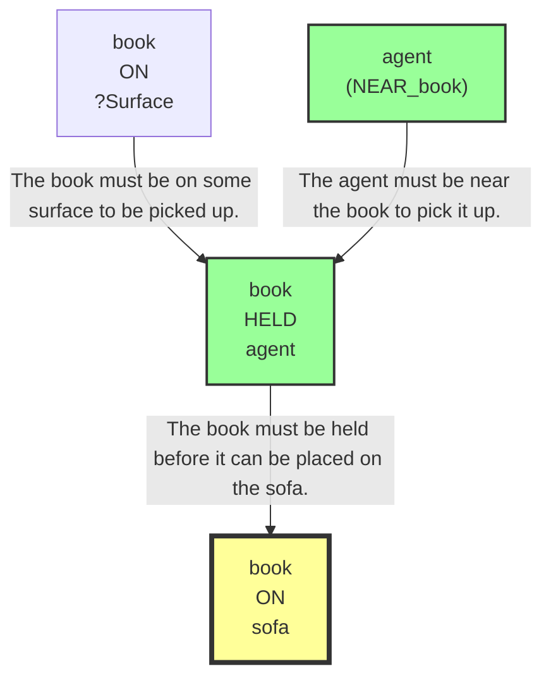
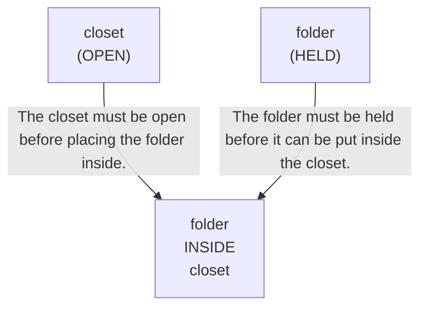
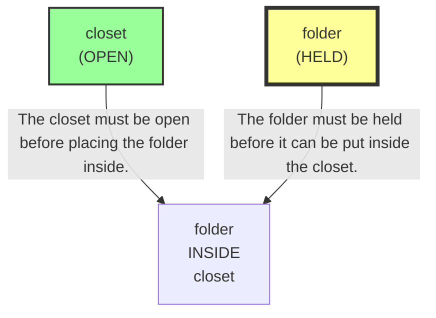
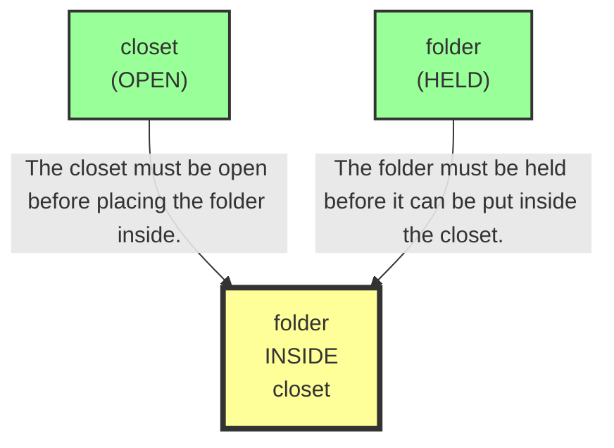
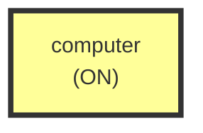

# 🚀 VirtualHome Agent Episode Log


### [GoalReasoner (Module A - Intent)] Output
```json
{
  "is_instruction_obviously_vague": true,
  "clarification_question": "Which specific plate are you referring to, and where is it currently left?",
  "target_object": "plate",
  "location_hint": null,
  "reasoning_chain": [
    {
      "question": "Why does the user want this object?",
      "answer": "To ensure the item that was used for washing dishes is put into the dishwasher afterward."
    },
    {
      "question": "Why is that important?",
      "answer": "To restore the item to its proper place and keep the dishwashing area organized."
    },
    {
      "question": "What fundamental need does this fulfill?",
      "answer": "It helps maintain household cleanliness and orderly dish management."
    },
    {
      "question": "Are there any deeper psychological or physical motivations?",
      "answer": "The user likely wants to reduce clutter, prevent misplaced items, and make cleanup easier."
    }
  ],
  "deep_intent": "The user wants to restore a used dish to its proper storage location to maintain household cleanliness and order.",
  "acceptable_alternatives_properties": [
    {
      "priority": 1,
      "description": "Other used dishes or utensils that should be returned to the dishwasher after use"
    },
    {
      "priority": 2,
      "description": "Similar washable kitchenware items that belong with the dirty dishes"
    },
    {
      "priority": 3,
      "description": "Other items that need to be collected from where they were left and placed into the dishwasher"
    },
    {
      "priority": 4,
      "description": "Other household objects that have been used and need to be returned to their designated cleaning area"
    }
  ]
}
```

### [PerceptionFilter] Output
```json
{
  "reasoning": "The goal is to place a plate into the dishwasher, so the required target object is plate and the container/appliance needed is dishwasher. The SDG says the dishwasher must be open before the plate can be put inside, so dishwasher must be retained. No other tools or locations are necessary from the current goal and graph.",
  "selected_classes": [
    "character",
    "plate",
    "dishwasher"
  ],
  "raw_class_count": 51
}
```

### [LLMExecutor] Output
```json
{
  "reasoning": "The goal is to place the plate into the dishwasher. The dishwasher is already OPEN, so N2 is satisfied. The plate is in the kitchen but not held yet, so the next required step is to get near the plate before grabbing it. Although the instruction is somewhat vague, the graph provides a specific plate instance (plate 67), so I can proceed with the physical task.",
  "satisfied_nodes": [
    "N2"
  ],
  "current_node_focus": "N3",
  "mapped_variables": {
    "?Container": "dishwasher(165)"
  },
  "action": "[walk] <plate> (67)"
}
```

### [RoboStateMultiTaskController] Output
```json
{
  "action": "[walk] <plate> (67)",
  "active_task_id": "E1_18",
  "task_context": {
    "active_task_id": "E1_18",
    "pending_task_ids": [
      "E1_03",
      "E1_07",
      "E1_15",
      "E1_11"
    ],
    "satisfied_task_ids": []
  },
  "source": "llm_executor"
}
```
## Step 0
- **Action**: `[walk] <plate> (67)`
- **Action Success**: `True`
- **Action Message**: {'0': {'message': 'Success'}}
- **Active Task**: `E1_18`
- **Decision Source**: `llm_executor`
- **Task Progress**: E1_03=pending, E1_07=pending, E1_15=pending, E1_11=pending, E1_18=pending
- **SDG Status**:

- **Observed Items (8)**: dishwasher(165) [OPEN,OFF], plate(67), character(1), kitchen(11), livingroom(183), bedroom(241), bathroom(285), bedroom(346)


### [PerceptionFilter] Output
```json
{
  "reasoning": "Reused cached class selection.",
  "selected_classes": [
    "character",
    "plate",
    "dishwasher"
  ],
  "raw_class_count": 51
}
```

### [LLMExecutor] Output
```json
{
  "reasoning": "The task is not actually ambiguous in execution because the current graph identifies the specific plate as plate(67). The plate is already close to the agent, and the dishwasher(165) is open and close, so the next required step toward satisfying the SDG is to pick up the plate. N2 is already satisfied because the dishwasher is OPEN. N1 is not yet satisfied, and N3 (plate held by agent) is the immediate prerequisite.",
  "satisfied_nodes": [
    "N2"
  ],
  "current_node_focus": "N3",
  "mapped_variables": {
    "?Container": "dishwasher(165)"
  },
  "action": "[grab] <plate> (67)"
}
```

### [RoboStateMultiTaskController] Output
```json
{
  "action": "[grab] <plate> (67)",
  "active_task_id": "E1_18",
  "task_context": {
    "active_task_id": "E1_18",
    "pending_task_ids": [
      "E1_03",
      "E1_07",
      "E1_15",
      "E1_11"
    ],
    "satisfied_task_ids": []
  },
  "source": "llm_executor"
}
```
## Step 1
- **Action**: `[grab] <plate> (67)`
- **Action Success**: `True`
- **Action Message**: {'0': {'message': 'Success'}}
- **Active Task**: `E1_18`
- **Decision Source**: `llm_executor`
- **Task Progress**: E1_03=pending, E1_07=pending, E1_15=pending, E1_11=pending, E1_18=pending
- **SDG Status**:

- **Observed Items (8)**: dishwasher(165) [OPEN,OFF], plate(67), character(1), kitchen(11), livingroom(183), bedroom(241), bathroom(285), bedroom(346)


### [PerceptionFilter] Output
```json
{
  "reasoning": "Reused cached class selection.",
  "selected_classes": [
    "character",
    "plate",
    "dishwasher"
  ],
  "raw_class_count": 51
}
```

### [LLMExecutor] Output
```json
{
  "reasoning": "The plate is already held in the right hand, and the dishwasher is already open and nearby. The only remaining step for the active task is to place the held plate inside the dishwasher. Since the target container is open and we are close to it, the next atomic action is to put the plate in.",
  "satisfied_nodes": [
    "N3",
    "N2"
  ],
  "current_node_focus": "N1",
  "mapped_variables": {
    "?Container": "dishwasher(165)"
  },
  "action": "[putin] <plate> (67) <dishwasher> (165)"
}
```

### [RoboStateMultiTaskController] Output
```json
{
  "action": "[putin] <plate> (67) <dishwasher> (165)",
  "active_task_id": "E1_18",
  "task_context": {
    "active_task_id": "E1_18",
    "pending_task_ids": [
      "E1_03",
      "E1_07",
      "E1_15",
      "E1_11"
    ],
    "satisfied_task_ids": []
  },
  "source": "llm_executor"
}
```
## Step 2
- **Action**: `[putin] <plate> (67) <dishwasher> (165)`
- **Action Success**: `True`
- **Action Message**: {'0': {'message': 'Success'}}
- **Active Task**: `E1_18`
- **Decision Source**: `llm_executor`
- **Task Progress**: E1_03=pending, E1_07=pending, E1_15=pending, E1_11=pending, E1_18=done
- **SDG Status**:

- **Observed Items (8)**: dishwasher(165) [OPEN,OFF], plate(67), character(1), kitchen(11), livingroom(183), bedroom(241), bathroom(285), bedroom(346)


### [GoalReasoner (Module A - Intent)] Output
```json
{
  "is_instruction_obviously_vague": false,
  "clarification_question": null,
  "target_object": "mug",
  "location_hint": "coffeetable",
  "reasoning_chain": [
    {
      "question": "Why does the user want this object?",
      "answer": "To keep the mug in a specific place."
    },
    {
      "question": "Why is that important?",
      "answer": "To maintain the mug's fixed position on the coffeetable."
    },
    {
      "question": "What fundamental need does this fulfill?",
      "answer": "It fulfills an organizational and spatial arrangement need, ensuring the mug remains where the user expects it."
    },
    {
      "question": "Are there any deeper psychological or physical motivations?",
      "answer": "It may support tidiness, prevent misplacement, and make the mug easy to find or use."
    }
  ],
  "deep_intent": "The user wants an object to remain in a designated location consistently.",
  "acceptable_alternatives_properties": [
    {
      "priority": 1,
      "description": "Other small household items that can be kept in the same fixed spot, such as a cup, glass, or bowl."
    },
    {
      "priority": 2,
      "description": "Similar tabletop items that can be stationed on the coffeetable, such as a coaster, remote, or decorative object."
    },
    {
      "priority": 3,
      "description": "Any everyday household item that can be placed and left in a consistent location to maintain order."
    },
    {
      "priority": 4,
      "description": "Objects serving the same organizational purpose in a different location, such as keeping another item on a table or shelf."
    }
  ]
}
```

### [RoboStateMultiTaskController] Output
```json
{
  "action": "[walk] <livingroom> (183)",
  "active_task_id": "E1_07",
  "task_context": {
    "active_task_id": "E1_07",
    "pending_task_ids": [
      "E1_03",
      "E1_15",
      "E1_11"
    ],
    "satisfied_task_ids": [
      "E1_18"
    ]
  },
  "source": "room_frontier"
}
```
## Step 3
- **Action**: `[walk] <livingroom> (183)`
- **Action Success**: `True`
- **Action Message**: {'0': {'message': 'Success'}}
- **Active Task**: `E1_07`
- **Decision Source**: `room_frontier`
- **Task Progress**: E1_03=pending, E1_07=pending, E1_15=pending, E1_11=pending, E1_18=done
- **SDG Status**:

- **Observed Items (153)**: wall(12), wall(13), wall(14), wall(15), wall(16), wall(17), wall(18), wall(19), wall(20), wall(21), floor(22), floor(23), floor(24), floor(25), floor(26)...


### [PerceptionFilter] Output
```json
{
  "reasoning": "The goal requires the target object mug and the specified location coffeetable. No additional tools or receptacles are needed because the task is about maintaining a fixed placement, not performing an action like filling or heating.",
  "selected_classes": [
    "character",
    "coffeetable",
    "mug"
  ],
  "raw_class_count": 60
}
```

### [LLMExecutor] Output
```json
{
  "reasoning": "The active goal is to place the mug on the coffeetable. I am already close to the coffeetable, but the mug is still inside the kitchen. To progress, I need to go to the mug first before I can grab it. No satisfied nodes apply yet because the mug is not on the coffeetable.",
  "satisfied_nodes": [],
  "current_node_focus": "N1",
  "mapped_variables": {},
  "action": "[walk] <mug> (384)"
}
```

### [RoboStateMultiTaskController] Output
```json
{
  "action": "[walk] <mug> (384)",
  "active_task_id": "E1_07",
  "task_context": {
    "active_task_id": "E1_07",
    "pending_task_ids": [
      "E1_03",
      "E1_15",
      "E1_11"
    ],
    "satisfied_task_ids": [
      "E1_18"
    ]
  },
  "source": "llm_executor"
}
```
## Step 4
- **Action**: `[walk] <mug> (384)`
- **Action Success**: `True`
- **Action Message**: {'0': {'message': 'Success'}}
- **Active Task**: `E1_07`
- **Decision Source**: `llm_executor`
- **Task Progress**: E1_03=pending, E1_07=pending, E1_15=pending, E1_11=pending, E1_18=done
- **SDG Status**:

- **Observed Items (8)**: mug(384), character(1), kitchen(11), livingroom(183), bedroom(241), bathroom(285), bedroom(346), coffeetable(215)


### [PerceptionFilter] Output
```json
{
  "reasoning": "Reused cached class selection.",
  "selected_classes": [
    "character",
    "coffeetable",
    "mug"
  ],
  "raw_class_count": 60
}
```

### [LLMExecutor] Output
```json
{
  "reasoning": "The active SDG requires the mug to be ON the coffeetable. I am already close to the mug, but the mug is not yet at the target location. The next required step is to pick up the mug before moving it to the coffeetable. Since I just walked to the mug, grabbing it is the single best atomic action now.",
  "satisfied_nodes": [],
  "current_node_focus": "N1",
  "mapped_variables": {},
  "action": "[grab] <mug> (384)"
}
```

### [RoboStateMultiTaskController] Output
```json
{
  "action": "[grab] <mug> (384)",
  "active_task_id": "E1_07",
  "task_context": {
    "active_task_id": "E1_07",
    "pending_task_ids": [
      "E1_03",
      "E1_15",
      "E1_11"
    ],
    "satisfied_task_ids": [
      "E1_18"
    ]
  },
  "source": "llm_executor"
}
```
## Step 5
- **Action**: `[grab] <mug> (384)`
- **Action Success**: `True`
- **Action Message**: {'0': {'message': 'Success'}}
- **Active Task**: `E1_07`
- **Decision Source**: `llm_executor`
- **Task Progress**: E1_03=pending, E1_07=pending, E1_15=pending, E1_11=pending, E1_18=done
- **SDG Status**:

- **Observed Items (8)**: mug(384), character(1), kitchen(11), livingroom(183), bedroom(241), bathroom(285), bedroom(346), coffeetable(215)


### [PerceptionFilter] Output
```json
{
  "reasoning": "Reused cached class selection.",
  "selected_classes": [
    "character",
    "coffeetable",
    "mug"
  ],
  "raw_class_count": 60
}
```

### [LLMExecutor] Output
```json
{
  "reasoning": "The active SDG requires the mug to be ON the coffeetable. I am currently holding mug(384), and the coffeetable(215) is available and close in the environment. To place the mug on the table, I must first be adjacent to the destination surface. The next atomic step is therefore to walk to the coffeetable before any putback action can be issued next.",
  "satisfied_nodes": [],
  "current_node_focus": "N1",
  "mapped_variables": {},
  "action": "[walk] <coffeetable> (215)"
}
```

### [RoboStateMultiTaskController] Output
```json
{
  "action": "[walk] <coffeetable> (215)",
  "active_task_id": "E1_07",
  "task_context": {
    "active_task_id": "E1_07",
    "pending_task_ids": [
      "E1_03",
      "E1_15",
      "E1_11"
    ],
    "satisfied_task_ids": [
      "E1_18"
    ]
  },
  "source": "llm_executor"
}
```
## Step 6
- **Action**: `[walk] <coffeetable> (215)`
- **Action Success**: `True`
- **Action Message**: {'0': {'message': 'Success'}}
- **Active Task**: `E1_07`
- **Decision Source**: `llm_executor`
- **Task Progress**: E1_03=pending, E1_07=pending, E1_15=pending, E1_11=pending, E1_18=done
- **SDG Status**:

- **Observed Items (8)**: mug(384), character(1), kitchen(11), livingroom(183), bedroom(241), bathroom(285), bedroom(346), coffeetable(215)


### [PerceptionFilter] Output
```json
{
  "reasoning": "Reused cached class selection.",
  "selected_classes": [
    "character",
    "coffeetable",
    "mug"
  ],
  "raw_class_count": 60
}
```

### [LLMExecutor] Output
```json
{
  "reasoning": "The active goal is to place the held mug on the coffeetable. The current graph shows the robot is already CLOSE to both the mug and the coffeetable, and the mug is already held in the right hand. The coffeetable is a valid flat surface and does not need opening. The next atomic step that progresses the SDG is to place the mug onto the coffeetable.",
  "satisfied_nodes": [],
  "current_node_focus": "N1",
  "mapped_variables": {},
  "action": "[putback] <mug> (384) <coffeetable> (215)"
}
```

### [RoboStateMultiTaskController] Output
```json
{
  "action": "[putback] <mug> (384) <coffeetable> (215)",
  "active_task_id": "E1_07",
  "task_context": {
    "active_task_id": "E1_07",
    "pending_task_ids": [
      "E1_03",
      "E1_15",
      "E1_11"
    ],
    "satisfied_task_ids": [
      "E1_18"
    ]
  },
  "source": "llm_executor"
}
```
## Step 7
- **Action**: `[putback] <mug> (384) <coffeetable> (215)`
- **Action Success**: `True`
- **Action Message**: {'0': {'message': 'Success'}}
- **Active Task**: `E1_07`
- **Decision Source**: `llm_executor`
- **Task Progress**: E1_03=pending, E1_07=done, E1_15=pending, E1_11=pending, E1_18=done
- **SDG Status**:

- **Observed Items (8)**: mug(384), character(1), kitchen(11), livingroom(183), bedroom(241), bathroom(285), bedroom(346), coffeetable(215)


### [GoalReasoner (Module A - Intent)] Output
```json
{
  "is_instruction_obviously_vague": false,
  "clarification_question": null,
  "target_object": "book",
  "location_hint": "sofa",
  "reasoning_chain": [
    {
      "question": "Why does the user want this object?",
      "answer": "They want the book moved from an unorganized place to the sofa."
    },
    {
      "question": "Why is that important?",
      "answer": "To place the book in a specific location instead of leaving it unorganized."
    },
    {
      "question": "What fundamental need does this fulfill?",
      "answer": "It fulfills the need to organize and reposition a household item."
    },
    {
      "question": "Are there any deeper psychological or physical motivations?",
      "answer": "It may reduce clutter, improve orderliness, or make the book easier to access from the sofa."
    }
  ],
  "deep_intent": "The user wants to organize and relocate a household item to a preferred seating area.",
  "acceptable_alternatives_properties": [
    {
      "priority": 1,
      "description": "Other books or reading materials that can be moved to the sofa instead."
    },
    {
      "priority": 2,
      "description": "Other small household items that belong in a living area and can be tidied to the sofa or nearby surface."
    },
    {
      "priority": 3,
      "description": "Loose reading-related items such as magazines, notebooks, or papers that can be organized similarly."
    },
    {
      "priority": 4,
      "description": "Any portable household object that can be relocated to reduce clutter in the current area."
    }
  ]
}
```

### [PerceptionFilter] Output
```json
{
  "reasoning": "The goal is to move the book onto the sofa, so the only strictly necessary classes are the target object and the destination location. The SDG shows the book must be held and then placed on a surface, but no extra tool is required beyond the book itself and the sofa destination.",
  "selected_classes": [
    "character",
    "book",
    "sofa"
  ],
  "raw_class_count": 60
}
```

### [LLMExecutor] Output
```json
{
  "reasoning": "The active task is to move the book onto the sofa. The current graph shows the agent is already close to both the book and the sofa, and the book is available in the living room. Since the next required step in the SDG is to hold the book before placing it on the sofa, the most direct progress is to grab the book. No walk is needed because proximity is already satisfied.",
  "satisfied_nodes": [
    "N4",
    "N3"
  ],
  "current_node_focus": "N2",
  "mapped_variables": {},
  "action": "[grab] <book> (105)"
}
```

### [RoboStateMultiTaskController] Output
```json
{
  "action": "[grab] <book> (105)",
  "active_task_id": "E1_03",
  "task_context": {
    "active_task_id": "E1_03",
    "pending_task_ids": [
      "E1_15",
      "E1_11"
    ],
    "satisfied_task_ids": [
      "E1_07",
      "E1_18"
    ]
  },
  "source": "llm_executor"
}
```
## Step 8
- **Action**: `[grab] <book> (105)`
- **Action Success**: `True`
- **Action Message**: {'0': {'message': 'Success'}}
- **Active Task**: `E1_03`
- **Decision Source**: `llm_executor`
- **Task Progress**: E1_03=pending, E1_07=done, E1_15=pending, E1_11=pending, E1_18=done
- **SDG Status**:

- **Observed Items (8)**: character(1), kitchen(11), livingroom(183), bedroom(241), bathroom(285), bedroom(346), sofa(214), book(105) [CLOSED]


### [PerceptionFilter] Output
```json
{
  "reasoning": "Reused cached class selection.",
  "selected_classes": [
    "character",
    "book",
    "sofa"
  ],
  "raw_class_count": 60
}
```

### [LLMExecutor] Output
```json
{
  "reasoning": "The active task is to place the held book onto the sofa. The SDG node N2 (book HELD by agent) is already satisfied because the book is in the agent's right hand. N4 (agent near book) is also satisfied, and the sofa is already close. To satisfy N1, the next atomic action must place the held book onto the sofa. Since putback requires being walked to the destination first, and the graph already says the agent is close to the sofa, the next action is to put the book back onto the sofa.",
  "satisfied_nodes": [
    "N2",
    "N4"
  ],
  "current_node_focus": "N1",
  "mapped_variables": {},
  "action": "[putback] <book> (105) <sofa> (214)"
}
```

### [RoboStateMultiTaskController] Output
```json
{
  "action": "[putback] <book> (105) <sofa> (214)",
  "active_task_id": "E1_03",
  "task_context": {
    "active_task_id": "E1_03",
    "pending_task_ids": [
      "E1_15",
      "E1_11"
    ],
    "satisfied_task_ids": [
      "E1_07",
      "E1_18"
    ]
  },
  "source": "llm_executor"
}
```
## Step 9
- **Action**: `[putback] <book> (105) <sofa> (214)`
- **Action Success**: `True`
- **Action Message**: {'0': {'message': 'Success'}}
- **Active Task**: `E1_03`
- **Decision Source**: `llm_executor`
- **Task Progress**: E1_03=done, E1_07=done, E1_15=pending, E1_11=pending, E1_18=done
- **SDG Status**:

- **Observed Items (8)**: character(1), kitchen(11), livingroom(183), bedroom(241), bathroom(285), bedroom(346), sofa(214), book(105) [CLOSED]


### [GoalReasoner (Module A - Intent)] Output
```json
{
  "is_instruction_obviously_vague": false,
  "clarification_question": null,
  "target_object": "folder",
  "location_hint": "closet",
  "reasoning_chain": [
    {
      "question": "Why does the user want this object moved?",
      "answer": "To store the folder away in the closet."
    },
    {
      "question": "Why is that important?",
      "answer": "To place it in a designated storage location and keep the current area organized."
    },
    {
      "question": "What fundamental need does this fulfill?",
      "answer": "The user wants to organize and store an item."
    },
    {
      "question": "Are there any deeper psychological or physical motivations?",
      "answer": "It may reduce clutter, make the space tidier, or keep the folder out of the way for later retrieval."
    }
  ],
  "deep_intent": "The user wants to organize and store an item away in a designated place.",
  "acceptable_alternatives_properties": [
    {
      "priority": 1,
      "description": "Other paper documents or file containers that can be stored away in the closet"
    },
    {
      "priority": 2,
      "description": "Similar office or paper storage items such as binders, envelopes, or notebooks"
    },
    {
      "priority": 3,
      "description": "Other small household items that can be neatly put away for storage"
    },
    {
      "priority": 4,
      "description": "Any portable item that serves the purpose of reducing clutter by being stored out of the way"
    }
  ]
}
```

### [RoboStateMultiTaskController] Output
```json
{
  "action": "[walk] <bedroom> (241)",
  "active_task_id": "E1_15",
  "task_context": {
    "active_task_id": "E1_15",
    "pending_task_ids": [
      "E1_11"
    ],
    "satisfied_task_ids": [
      "E1_03",
      "E1_07",
      "E1_18"
    ]
  },
  "source": "room_frontier"
}
```
## Step 10
- **Action**: `[walk] <bedroom> (241)`
- **Action Success**: `True`
- **Action Message**: {'0': {'message': 'Success'}}
- **Active Task**: `E1_15`
- **Decision Source**: `room_frontier`
- **Task Progress**: E1_03=done, E1_07=done, E1_15=pending, E1_11=pending, E1_18=done
- **SDG Status**:

- **Observed Items (202)**: wall(12), wall(13), wall(14), wall(15), wall(16), wall(17), wall(18), wall(19), wall(20), wall(21), floor(22), floor(23), floor(24), floor(25), floor(26)...


### [RoboStateMultiTaskController] Output
```json
{
  "action": "[walk] <bathroom> (285)",
  "active_task_id": "E1_15",
  "task_context": {
    "active_task_id": "E1_15",
    "pending_task_ids": [
      "E1_11"
    ],
    "satisfied_task_ids": [
      "E1_03",
      "E1_07",
      "E1_18"
    ]
  },
  "source": "room_frontier"
}
```
## Step 11
- **Action**: `[walk] <bathroom> (285)`
- **Action Success**: `True`
- **Action Message**: {'0': {'message': 'Success'}}
- **Active Task**: `E1_15`
- **Decision Source**: `room_frontier`
- **Task Progress**: E1_03=done, E1_07=done, E1_15=pending, E1_11=pending, E1_18=done
- **SDG Status**:

- **Observed Items (231)**: wall(12), wall(13), wall(14), wall(15), wall(16), wall(17), wall(18), wall(19), wall(20), wall(21), floor(22), floor(23), floor(24), floor(25), floor(26)...


### [RoboStateMultiTaskController] Output
```json
{
  "action": "[walk] <bedroom> (346)",
  "active_task_id": "E1_15",
  "task_context": {
    "active_task_id": "E1_15",
    "pending_task_ids": [
      "E1_11"
    ],
    "satisfied_task_ids": [
      "E1_03",
      "E1_07",
      "E1_18"
    ]
  },
  "source": "room_frontier"
}
```
## Step 12
- **Action**: `[walk] <bedroom> (346)`
- **Action Success**: `True`
- **Action Message**: {'0': {'message': 'Success'}}
- **Active Task**: `E1_15`
- **Decision Source**: `room_frontier`
- **Task Progress**: E1_03=done, E1_07=done, E1_15=pending, E1_11=pending, E1_18=done
- **SDG Status**:

- **Observed Items (290)**: wall(12), wall(13), wall(14), wall(15), wall(16), wall(17), wall(18), wall(19), wall(20), wall(21), floor(22), floor(23), floor(24), floor(25), floor(26)...


### [PerceptionFilter] Output
```json
{
  "reasoning": "The goal is to store the folder in the closet. The SDG requires the folder to be held and the closet to be open. No other tools or locations are necessary.",
  "selected_classes": [
    "character",
    "closet",
    "book",
    "folder"
  ],
  "raw_class_count": 91
}
```

### [LLMExecutor] Output
```json
{
  "reasoning": "The active task is to store the folder inside the closet. The closet is already OPEN, satisfying N2. The folder is not currently held, and it is located in bedroom(241), while the character is now in bedroom(346), so the next required step is to move to the folder before grabbing it. This progresses toward N3 (folder held) and eventually N1. ",
  "satisfied_nodes": [
    "N2"
  ],
  "current_node_focus": "N3",
  "mapped_variables": {
    "?Container": "closet(395)",
    "?Folder": "folder(121)"
  },
  "action": "[walk] <folder> (121)"
}
```

### [RoboStateMultiTaskController] Output
```json
{
  "action": "[walk] <folder> (121)",
  "active_task_id": "E1_15",
  "task_context": {
    "active_task_id": "E1_15",
    "pending_task_ids": [
      "E1_11"
    ],
    "satisfied_task_ids": [
      "E1_03",
      "E1_07",
      "E1_18"
    ]
  },
  "source": "llm_executor"
}
```
## Step 13
- **Action**: `[walk] <folder> (121)`
- **Action Success**: `True`
- **Action Message**: {'0': {'message': 'Success'}}
- **Active Task**: `E1_15`
- **Decision Source**: `llm_executor`
- **Task Progress**: E1_03=done, E1_07=done, E1_15=pending, E1_11=pending, E1_18=done
- **SDG Status**:

- **Observed Items (9)**: character(1), kitchen(11), livingroom(183), bedroom(241), bathroom(285), bedroom(346), book(105) [CLOSED], folder(121) [CLOSED], closet(395) [OPEN]


### [PerceptionFilter] Output
```json
{
  "reasoning": "Reused cached class selection.",
  "selected_classes": [
    "character",
    "closet",
    "book",
    "folder"
  ],
  "raw_class_count": 91
}
```

### [LLMExecutor] Output
```json
{
  "reasoning": "The active task is to store the folder inside the closet. The SDG requires the folder to be held and the closet to be open. The closet(395) is already OPEN, and the folder(121) is currently close to the character, so the next missing prerequisite is to grab the folder. I will not repeat a walk since the last action already walked to the folder, and I am not yet holding it.",
  "satisfied_nodes": [
    "N2"
  ],
  "current_node_focus": "N3",
  "mapped_variables": {},
  "action": "[grab] <folder> (121)"
}
```

### [RoboStateMultiTaskController] Output
```json
{
  "action": "[grab] <folder> (121)",
  "active_task_id": "E1_15",
  "task_context": {
    "active_task_id": "E1_15",
    "pending_task_ids": [
      "E1_11"
    ],
    "satisfied_task_ids": [
      "E1_03",
      "E1_07",
      "E1_18"
    ]
  },
  "source": "llm_executor"
}
```
## Step 14
- **Action**: `[grab] <folder> (121)`
- **Action Success**: `True`
- **Action Message**: {'0': {'message': 'Success'}}
- **Active Task**: `E1_15`
- **Decision Source**: `llm_executor`
- **Task Progress**: E1_03=done, E1_07=done, E1_15=pending, E1_11=pending, E1_18=done
- **SDG Status**:

- **Observed Items (9)**: character(1), kitchen(11), livingroom(183), bedroom(241), bathroom(285), bedroom(346), book(105) [CLOSED], folder(121) [CLOSED], closet(395) [OPEN]


### [PerceptionFilter] Output
```json
{
  "reasoning": "Reused cached class selection.",
  "selected_classes": [
    "character",
    "closet",
    "book",
    "folder"
  ],
  "raw_class_count": 91
}
```

### [LLMExecutor] Output
```json
{
  "reasoning": "The folder is already held in the right hand (N3 satisfied). The remaining gap for the active task is to place it inside the closet. The closet is already open (N2 satisfied), but the current graph only shows the closet in bedroom(346) while the character is in bedroom(241). Since putin requires being near the destination, the next atomic step must be to walk to the closet before any placement action.",
  "satisfied_nodes": [
    "N2",
    "N3"
  ],
  "current_node_focus": "N1",
  "mapped_variables": {
    "?Container": "closet(395)"
  },
  "action": "[walk] <closet> (395)"
}
```

### [RoboStateMultiTaskController] Output
```json
{
  "action": "[walk] <closet> (395)",
  "active_task_id": "E1_15",
  "task_context": {
    "active_task_id": "E1_15",
    "pending_task_ids": [
      "E1_11"
    ],
    "satisfied_task_ids": [
      "E1_03",
      "E1_07",
      "E1_18"
    ]
  },
  "source": "llm_executor"
}
```
## Step 15
- **Action**: `[walk] <closet> (395)`
- **Action Success**: `True`
- **Action Message**: {'0': {'message': 'Success'}}
- **Active Task**: `E1_15`
- **Decision Source**: `llm_executor`
- **Task Progress**: E1_03=done, E1_07=done, E1_15=pending, E1_11=pending, E1_18=done
- **SDG Status**:

- **Observed Items (9)**: character(1), kitchen(11), livingroom(183), bedroom(241), bathroom(285), bedroom(346), book(105) [CLOSED], folder(121) [CLOSED], closet(395) [OPEN]


### [PerceptionFilter] Output
```json
{
  "reasoning": "Reused cached class selection.",
  "selected_classes": [
    "character",
    "closet",
    "book",
    "folder"
  ],
  "raw_class_count": 91
}
```

### [LLMExecutor] Output
```json
{
  "reasoning": "The folder is already held and the closet is open. The remaining gap for N1 is to place the folder inside the closet. Since put-in actions require being near the destination and we are already close to the closet, the next atomic step is to put the held folder into the closet.",
  "satisfied_nodes": [
    "N2",
    "N3"
  ],
  "current_node_focus": "N1",
  "mapped_variables": {
    "?Container": "closet(395)"
  },
  "action": "[putin] <folder> (121) <closet> (395)"
}
```

### [RoboStateMultiTaskController] Output
```json
{
  "action": "[putin] <folder> (121) <closet> (395)",
  "active_task_id": "E1_15",
  "task_context": {
    "active_task_id": "E1_15",
    "pending_task_ids": [
      "E1_11"
    ],
    "satisfied_task_ids": [
      "E1_03",
      "E1_07",
      "E1_18"
    ]
  },
  "source": "llm_executor"
}
```
## Step 16
- **Action**: `[putin] <folder> (121) <closet> (395)`
- **Action Success**: `True`
- **Action Message**: {'0': {'message': 'Success'}}
- **Active Task**: `E1_15`
- **Decision Source**: `llm_executor`
- **Task Progress**: E1_03=done, E1_07=done, E1_15=done, E1_11=pending, E1_18=done
- **SDG Status**:

- **Observed Items (9)**: character(1), kitchen(11), livingroom(183), bedroom(241), bathroom(285), bedroom(346), book(105) [CLOSED], folder(121) [CLOSED], closet(395) [OPEN]


### [GoalReasoner (Module A - Intent)] Output
```json
{
  "is_instruction_obviously_vague": false,
  "clarification_question": null,
  "target_object": "computer",
  "location_hint": null,
  "reasoning_chain": [
    {
      "question": "Why does the user want this object?",
      "answer": "To have the computer in an on state."
    },
    {
      "question": "Why is that important?",
      "answer": "Because the computer needs to be powered on for use."
    },
    {
      "question": "What fundamental need does this fulfill?",
      "answer": "It enables the user to access computing functionality."
    },
    {
      "question": "Are there any deeper psychological or physical motivations?",
      "answer": "The user likely wants to continue a task, access information, or interact with digital services."
    }
  ],
  "deep_intent": "The user wants access to computing functionality.",
  "acceptable_alternatives_properties": [
    {
      "priority": 1,
      "description": "Other powered-on computing devices such as a laptop, tablet, or desktop computer."
    },
    {
      "priority": 2,
      "description": "Any working device that can provide similar digital access, such as a smartphone."
    },
    {
      "priority": 3,
      "description": "A different computer setup that can accomplish the same task, such as another nearby computer."
    },
    {
      "priority": 4,
      "description": "A shared indoor digital device that allows the user to complete the needed activity."
    }
  ]
}
```

### [PerceptionFilter] Output
```json
{
  "reasoning": "The goal is to have a computer in an ON state. The only strictly necessary class is the computer itself; no other tool or location is required by the SDG or goal.",
  "selected_classes": [
    "computer",
    "desk",
    "character",
    "door"
  ],
  "raw_class_count": 91
}
```

### [LLMExecutor] Output
```json
{
  "reasoning": "The active task is to make the computer ON. The current graph shows the target computer(397) is in bedroom(346) and currently OFF. Since interacting with the computer requires being near it, the next atomic step is to walk to the computer before attempting to switch it on. The desk(393) is not needed yet because the computer itself is directly visible and has the HAS_SWITCH property.",
  "satisfied_nodes": [],
  "current_node_focus": "N1",
  "mapped_variables": {},
  "action": "[walk] <computer> (397)"
}
```

### [RoboStateMultiTaskController] Output
```json
{
  "action": "[walk] <computer> (397)",
  "active_task_id": "E1_11",
  "task_context": {
    "active_task_id": "E1_11",
    "pending_task_ids": [],
    "satisfied_task_ids": [
      "E1_03",
      "E1_07",
      "E1_15",
      "E1_18"
    ]
  },
  "source": "llm_executor"
}
```
## Step 17
- **Action**: `[walk] <computer> (397)`
- **Action Success**: `True`
- **Action Message**: {'0': {'message': 'Success'}}
- **Active Task**: `E1_11`
- **Decision Source**: `llm_executor`
- **Task Progress**: E1_03=done, E1_07=done, E1_15=done, E1_11=pending, E1_18=done
- **SDG Status**:

- **Observed Items (12)**: door(47) [OPEN], character(1), kitchen(11), livingroom(183), bedroom(241), bathroom(285), bedroom(346), door(254) [OPEN], desk(281) [CLOSED], door(305) [OPEN], desk(393) [CLOSED], computer(397) [OFF]


### [PerceptionFilter] Output
```json
{
  "reasoning": "Reused cached class selection.",
  "selected_classes": [
    "computer",
    "desk",
    "character",
    "door"
  ],
  "raw_class_count": 91
}
```

### [LLMExecutor] Output
```json
{
  "reasoning": "The active goal is to make the computer ON. The character is already CLOSE to computer(397), so no walk is needed. The computer has HAS_SWITCH and is currently OFF, so the next atomic action is to switch it on.",
  "satisfied_nodes": [],
  "current_node_focus": "N1",
  "mapped_variables": {},
  "action": "[switchon] <computer> (397)"
}
```

### [RoboStateMultiTaskController] Output
```json
{
  "action": "[switchon] <computer> (397)",
  "active_task_id": "E1_11",
  "task_context": {
    "active_task_id": "E1_11",
    "pending_task_ids": [],
    "satisfied_task_ids": [
      "E1_03",
      "E1_07",
      "E1_15",
      "E1_18"
    ]
  },
  "source": "llm_executor"
}
```
## Step 18
- **Action**: `[switchon] <computer> (397)`
- **Action Success**: `True`
- **Action Message**: Faked switch operation in Python layer (bypassed Unity failure)
- **Active Task**: `E1_11`
- **Decision Source**: `llm_executor`
- **Task Progress**: E1_03=done, E1_07=done, E1_15=done, E1_11=done, E1_18=done
- **SDG Status**:

- **Observed Items (12)**: door(47) [OPEN], character(1), kitchen(11), livingroom(183), bedroom(241), bathroom(285), bedroom(346), door(254) [OPEN], desk(281) [CLOSED], door(305) [OPEN], desk(393) [CLOSED], computer(397) [OFF]
