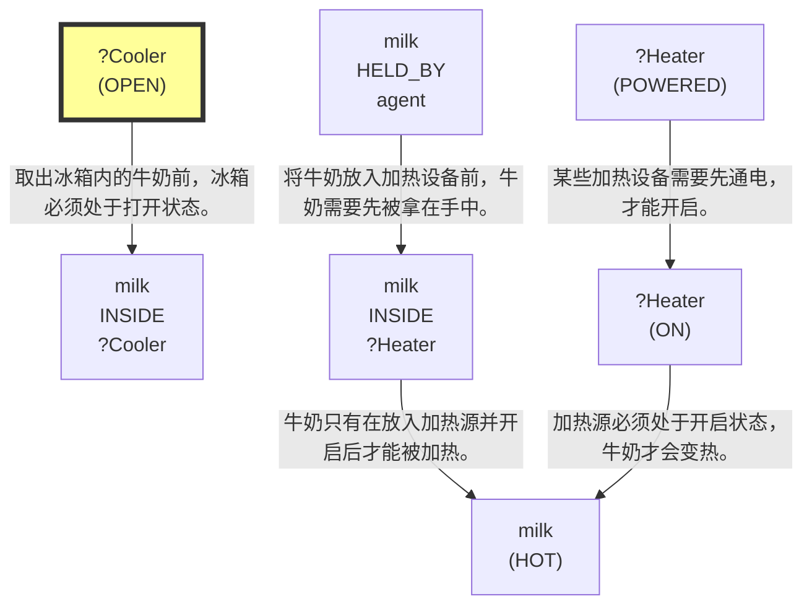
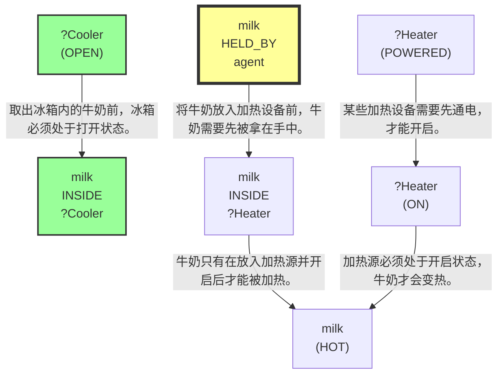
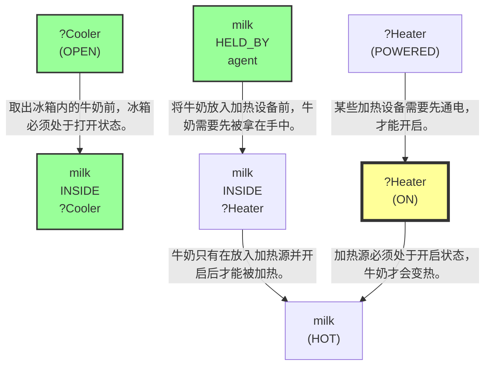
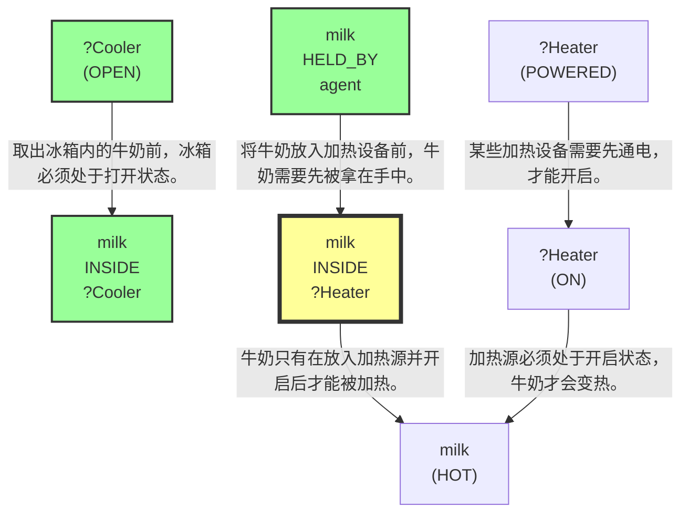
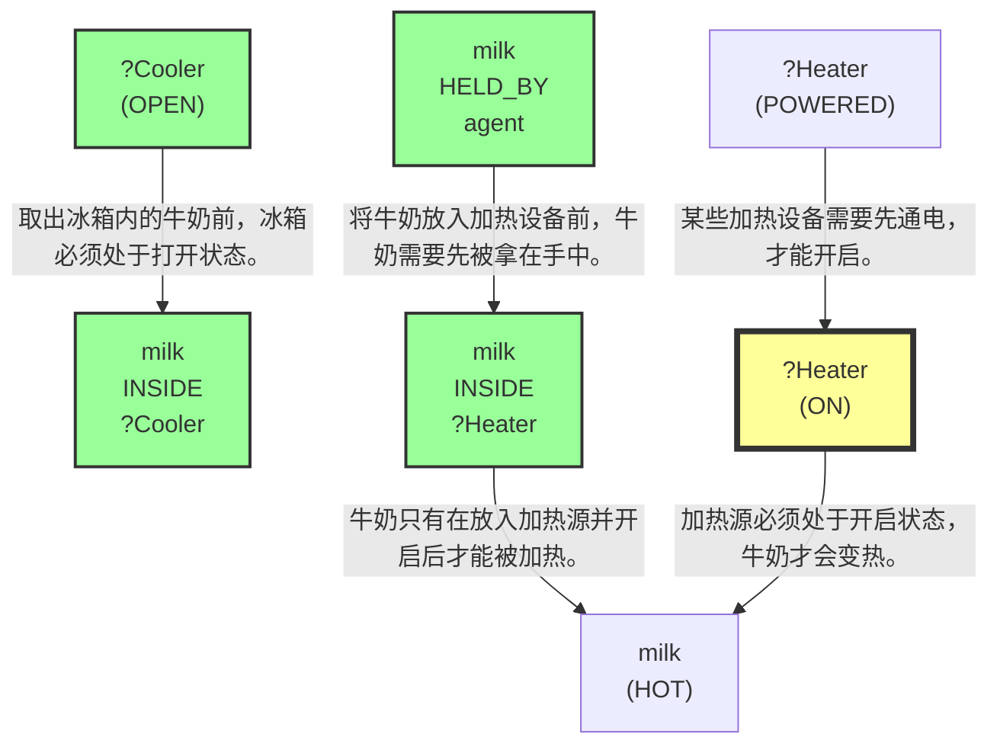
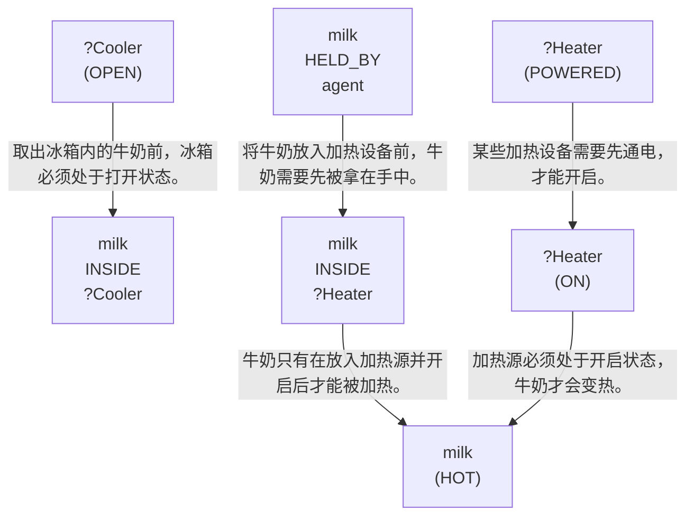

# 🚀 VirtualHome Agent Episode Log


### [GoalReasoner (Module A - Intent)] Output
```json
{
  "is_instruction_obviously_vague": false,
  "clarification_question": null,
  "target_object": "牛奶",
  "location_hint": "冰箱",
  "reasoning_chain": [
    {
      "question": "Why does the user want this object?",
      "answer": "They want the milk to be warmed in a microwave so it can be consumed."
    },
    {
      "question": "Why is that important?",
      "answer": "Warm milk is more suitable or comfortable to drink than cold milk."
    },
    {
      "question": "What fundamental need does this fulfill?",
      "answer": "It helps the user obtain a warm beverage for drinking."
    },
    {
      "question": "Are there any deeper psychological or physical motivations?",
      "answer": "The user may be seeking comfort, convenience, or a way to reduce thirst while having a warmed drink."
    }
  ],
  "deep_intent": "The user wants a warm drink for consumption.",
  "acceptable_alternatives_properties": [
    {
      "priority": 1,
      "description": "Other drinkable dairy or non-dairy beverages that can be safely heated, such as soy milk, oat milk, or diluted cocoa drink."
    },
    {
      "priority": 2,
      "description": "Other ready-to-heat beverages in the fridge that provide a similar warm drinking experience, such as packaged milk drinks or drinkable yogurt if heating is appropriate."
    },
    {
      "priority": 3,
      "description": "Room-temperature or chilled beverages that can be heated into a warm drink, such as juice or coffee drink if suitable for microwaving."
    },
    {
      "priority": 4,
      "description": "Any typical indoor beverage that can satisfy the need for a comforting warm liquid, if milk is unavailable."
    }
  ]
}
```

### [PerceptionFilter] Output
```json
{
  "reasoning": "Need the target milk, the fridge as the implied cooler/location to retrieve it from, and the microwave as the heating tool. Also keep the stove as a functional backup heating alternative per instruction. The milk must be selected because it is the target object.",
  "selected_ids": [
    177,
    162,
    171,
    163
  ],
  "raw_item_count": 153
}
```

### [LLMExecutor] Output
```json
{
  "reasoning": "The milk is currently inside the fridge, and the fridge is closed. To progress toward getting the milk warm, the first missing prerequisite is opening the fridge so the milk can later be retrieved. The fridge is the best binding for ?Cooler because it is the only available container holding the milk.",
  "satisfied_nodes": [],
  "current_node_focus": "N2",
  "mapped_variables": {
    "?Cooler": "fridge(162)",
    "?Heater": "microwave(171)"
  },
  "action": "[walk] <fridge> (162)"
}
```
## Step 0
- **Action**: `[walk] <fridge> (162)`
- **SDG Status**:

- **Observed Items (5)**: fridge(162) [CLOSED], stove(163) [OFF,CLOSED], microwave(171) [CLOSED,OFF], milk(177) [CLOSED], character(1)


### [PerceptionFilter] Output
```json
{
  "reasoning": "Need the target milk, the cooler (fridge) where it is stored, and a heater for warming it. The SDG also requires the milk to be held by the agent before moving it. Since alternatives/backups must be retained, I include all visible heaters that could warm milk: microwave, stove, and coffeemaker if usable as a heating appliance.",
  "selected_ids": [
    177,
    162,
    171,
    163,
    169
  ],
  "raw_item_count": 153
}
```

### [LLMExecutor] Output
```json
{
  "reasoning": "The milk is inside the fridge and the fridge is currently closed, so the next prerequisite toward extracting and heating the milk is to open the fridge. I am already adjacent to the fridge from the previous walk, so I should not repeat walking.",
  "satisfied_nodes": [],
  "current_node_focus": "N2",
  "mapped_variables": {
    "?Cooler": "fridge(162)"
  },
  "action": "[open] <fridge> (162)"
}
```
## Step 1
- **Action**: `[open] <fridge> (162)`
- **SDG Status**:

- **Observed Items (6)**: fridge(162) [CLOSED], stove(163) [OFF,CLOSED], coffeemaker(169) [OFF], microwave(171) [CLOSED,OFF], milk(177) [CLOSED], character(1)


### [PerceptionFilter] Output
```json
{
  "reasoning": "Needed items are the milk target, the fridge as the cooler/location to retrieve it from, and the microwave as the heating device. Alternatives retention requires keeping all plausible heating tools present; here microwave is the relevant heater, and the fridge is necessary for the initial INSIDE relation.",
  "selected_ids": [
    162,
    171,
    176,
    177
  ],
  "raw_item_count": 154
}
```

### [LLMExecutor] Output
```json
{
  "reasoning": "The fridge is already open, and the current graph shows milk(176) is the milk actually INSIDE the fridge and CLOSE to the agent. The next missing prerequisite for heating is to get the milk held by the agent, so I should grab the correct milk instance now. This advances N7 (HELD_BY agent) toward later placing it in the microwave.",
  "satisfied_nodes": [
    "N2",
    "N1"
  ],
  "current_node_focus": "N7",
  "mapped_variables": {
    "?Cooler": "fridge(162)",
    "?Heater": "microwave(171)"
  },
  "action": "[grab] <milk> (176)"
}
```
## Step 2
- **Action**: `[grab] <milk> (176)`
- **SDG Status**:

- **Observed Items (5)**: fridge(162) [OPEN], microwave(171) [CLOSED,OFF], milk(177) [CLOSED], character(1), milk(176) [CLOSED,COLD]


### [PerceptionFilter] Output
```json
{
  "reasoning": "Need the target milk, the fridge as the implied cooler/storage location, and a heating appliance for warming it. Since alternatives must be retained, keep all viable heaters present: microwave, stove, and coffeemaker if used as a warming tool. The milk must also be included in duplicate if multiple IDs exist for the same visible milk object.",
  "selected_ids": [
    162,
    163,
    169,
    171,
    176,
    177
  ],
  "raw_item_count": 155
}
```

### [LLMExecutor] Output
```json
{
  "reasoning": "The goal is to heat the milk. The current graph indicates the agent is already holding milk(176), but the microwave(171) is still CLOSED and OFF. Since putting the milk into the heater is only possible after opening the microwave, the next prerequisite is to open the microwave. I should not walk again because the past action already placed the agent near the fridge, and the microwave is the relevant heater to bind for ?Heater.",
  "satisfied_nodes": [
    "N1",
    "N2",
    "N7"
  ],
  "current_node_focus": "N3",
  "mapped_variables": {
    "?Cooler": "fridge(162)",
    "?Heater": "microwave(171)"
  },
  "action": "[open] <microwave> (171)"
}
```
## Step 3
- **Action**: `[open] <microwave> (171)`
- **SDG Status**:

- **Observed Items (8)**: fridge(162) [OPEN], stove(163) [OFF,CLOSED], coffeemaker(169) [OFF], microwave(171) [CLOSED,OFF], milk(177) [CLOSED], character(1), milk(176) [CLOSED,COLD], milk(176) [CLOSED,COLD]


### [PerceptionFilter] Output
```json
{
  "reasoning": "Need the milk target, the fridge as the implied cooler/storage location to retrieve it from, and a heater option to warm it. Since alternatives must be retained, include both microwave and stove as possible heating tools. Milk appears in multiple IDs, so keep all milk IDs visible.",
  "selected_ids": [
    162,
    163,
    171,
    176,
    177
  ],
  "raw_item_count": 157
}
```

### [LLMExecutor] Output
```json
{
  "reasoning": "The current goal requires the held milk to be placed inside the heater and then heated. The microwave(171) is already OPEN and the agent is CLOSE to it, so the next missing prerequisite is to place the held milk into the microwave. The held milk instance is milk(176), which is already in the agent's right hand, satisfying N7. This action progresses directly toward N5 (milk inside heater).",
  "satisfied_nodes": [
    "N1",
    "N2",
    "N7"
  ],
  "current_node_focus": "N5",
  "mapped_variables": {
    "?Cooler": "fridge(162)",
    "?Heater": "microwave(171)"
  },
  "action": "[putin] <milk> (176) <microwave> (171)"
}
```
## Step 4
- **Action**: `[putin] <milk> (176) <microwave> (171)`
- **SDG Status**:

- **Observed Items (7)**: fridge(162) [OPEN], stove(163) [OFF,CLOSED], microwave(171) [OPEN,OFF], milk(177) [CLOSED], character(1), milk(176) [CLOSED,COLD], milk(176) [CLOSED,COLD]


### [PerceptionFilter] Output
```json
{
  "reasoning": "Need the milk target, the fridge as the implied cooler/location to retrieve it from, and the heating alternatives needed by the SDG: microwave and stove are both valid heaters/backups. If milk is unavailable, the visible juices are acceptable drink alternatives for a warm beverage, so keep them too.",
  "selected_ids": [
    162,
    163,
    171,
    176,
    177,
    173,
    174
  ],
  "raw_item_count": 156
}
```

### [LLMExecutor] Output
```json
{
  "reasoning": "The required milk instance for the goal is milk(176), which is already inside the microwave(171). The microwave is open but still OFF, so the next missing prerequisite toward making the milk HOT is to turn the heater on. Because the agent is already close to the microwave, no additional walk is needed.",
  "satisfied_nodes": [
    "N1",
    "N2",
    "N7",
    "N5"
  ],
  "current_node_focus": "N3",
  "mapped_variables": {
    "?Cooler": "fridge(162)",
    "?Heater": "microwave(171)"
  },
  "action": "[switchon] <microwave> (171)"
}
```
## Step 5
- **Action**: `[switchon] <microwave> (171)`
- **SDG Status**:

- **Observed Items (8)**: fridge(162) [OPEN], stove(163) [OFF,CLOSED], microwave(171) [OPEN,OFF], juice(173), juice(174), milk(177) [CLOSED], character(1), milk(176) [CLOSED,COLD]


### [PerceptionFilter] Output
```json
{
  "reasoning": "Need the target milk, the fridge as the specified cooler/location to retrieve it from, and all plausible heating tools from the SDG and alternatives retention: microwave, stove, and coffeemaker as a possible beverage heater. Also keep the milk IDs because there are two visible milk instances.",
  "selected_ids": [
    162,
    163,
    169,
    171,
    176,
    177
  ],
  "raw_item_count": 156
}
```
## Step 7
- **Action**: `FINISH (Goal Reached)`
- **SDG Status**:

- **Observed Items (7)**: fridge(162) [OPEN], stove(163) [OFF,CLOSED], coffeemaker(169) [OFF], microwave(171) [OPEN,ON], milk(177) [CLOSED], character(1), milk(176) [CLOSED,HOT]

