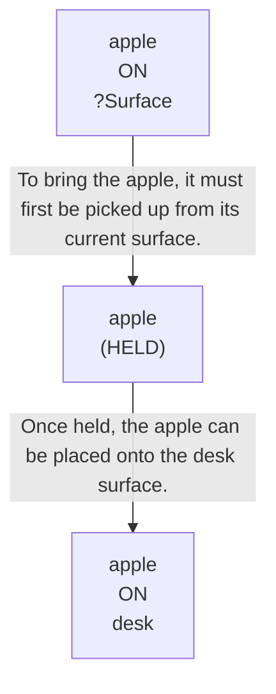
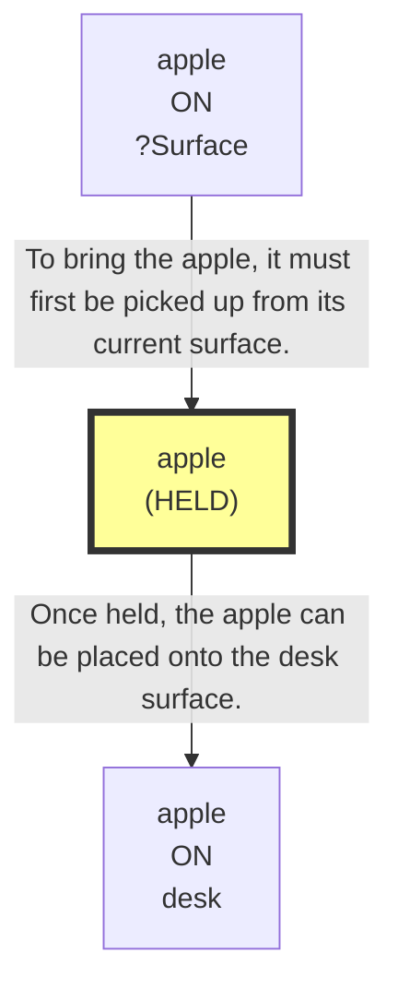
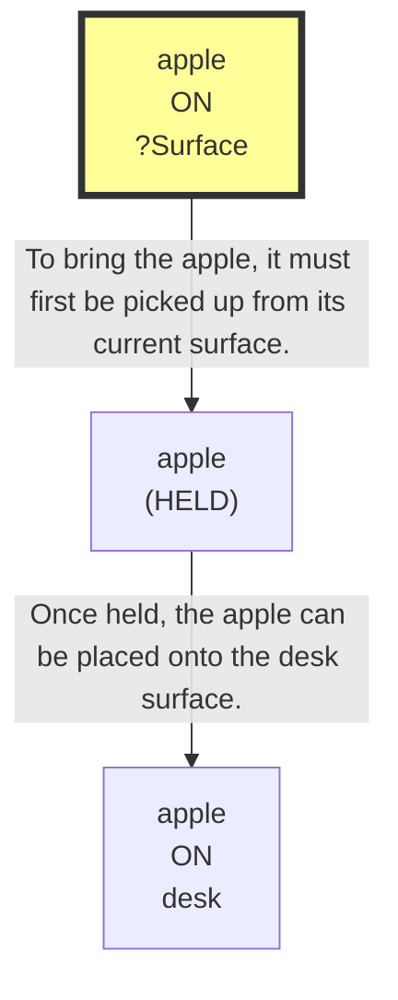
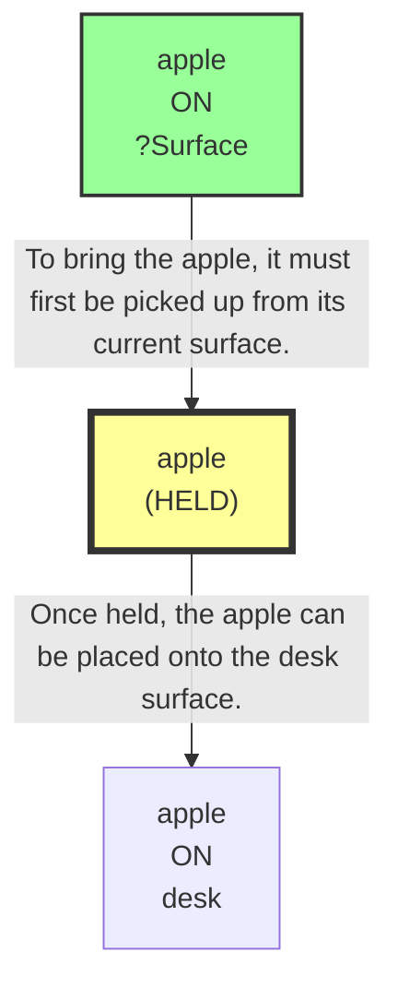
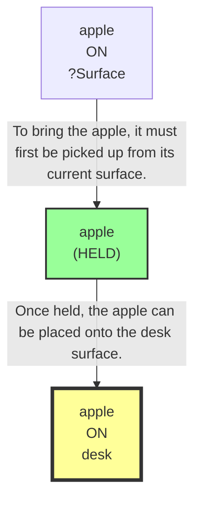

# 🚀 VirtualHome Agent Episode Log


### [GoalReasoner (Module A - Intent)] Output
```json
{
  "is_instruction_obviously_vague": false,
  "clarification_question": null,
  "target_object": "apple",
  "location_hint": "desk",
  "reasoning_chain": [
    {
      "question": "Why does the user want this object?",
      "answer": "To have the apple available at their desk."
    },
    {
      "question": "Why is that important?",
      "answer": "So they can access or use the apple from their desk location."
    },
    {
      "question": "What fundamental need does this fulfill?",
      "answer": "To make a desired item conveniently available in the user's workspace."
    },
    {
      "question": "Are there any deeper psychological or physical motivations?",
      "answer": "It likely supports convenience, possible snacking, or keeping needed items within reach while working."
    }
  ],
  "deep_intent": "The user wants a desired item made conveniently accessible at their workspace.",
  "acceptable_alternatives_properties": [
    {
      "priority": 1,
      "description": "Other ready-to-eat fruits kept in the home, such as a banana, orange, or pear"
    },
    {
      "priority": 2,
      "description": "Other handheld snack foods, such as crackers, granola bars, or a sandwich"
    },
    {
      "priority": 3,
      "description": "Any similarly portable food item that can be placed on the desk for easy access"
    },
    {
      "priority": 4,
      "description": "Other convenient consumables for a workspace, if the apple is unavailable"
    }
  ]
}
```

### [RoboStateMultiTaskController] Output
```json
{
  "action": "[walk] <bathroom> (11)",
  "active_task_id": "task_1",
  "task_context": {
    "active_task_id": "task_1",
    "pending_task_ids": [],
    "satisfied_task_ids": []
  },
  "source": "room_frontier"
}
```
## Step 0
- **Action**: `[walk] <bathroom> (11)`
- **Action Success**: `True`
- **Action Message**: {'0': {'message': 'Success'}}
- **Active Task**: `task_1`
- **Decision Source**: `room_frontier`
- **Task Progress**: E1_02=pending
- **SDG Status**:

- **Observed Items (74)**: floor(74), floor(75), floor(76), floor(77), floor(78), floor(79), floor(80), floor(81), floor(82), wall(83), wall(84), wall(85), wall(86), wall(87), wall(88)...


### [RoboStateMultiTaskController] Output
```json
{
  "action": "[walk] <kitchen> (205)",
  "active_task_id": "task_1",
  "task_context": {
    "active_task_id": "task_1",
    "pending_task_ids": [],
    "satisfied_task_ids": []
  },
  "source": "room_frontier"
}
```
## Step 1
- **Action**: `[walk] <kitchen> (205)`
- **Action Success**: `True`
- **Action Message**: {'0': {'message': 'Success'}}
- **Active Task**: `task_1`
- **Decision Source**: `room_frontier`
- **Task Progress**: E1_02=pending
- **SDG Status**:

- **Observed Items (135)**: floor(74), floor(75), floor(76), floor(77), floor(78), floor(79), floor(80), floor(81), floor(82), wall(83), wall(84), wall(85), wall(86), wall(87), wall(88)...


### [PerceptionFilter] Output
```json
{
  "reasoning": "The goal requires the apple and the desk surface where it should be placed. The SDG also implies the apple must be held before being moved, so no extra tool is needed beyond the target object and destination surface. Since the intent allows ready-to-eat alternatives if needed, no additional tools or receptacles are strictly necessary for this placement task.",
  "selected_classes": [
    "apple",
    "crackers",
    "character",
    "desk"
  ],
  "raw_class_count": 92
}
```

### [LLMExecutor] Output
```json
{
  "reasoning": "The apple is present in the kitchen and is the target object needed to satisfy N1 by picking it up. I am already in the kitchen, so the next required step is to grab the apple. After that, I can later move it to the desk to satisfy N3.",
  "satisfied_nodes": [],
  "current_node_focus": "N2",
  "mapped_variables": {},
  "action": "[grab] <apple> (437)"
}
```

### [RoboStateMultiTaskController] Output
```json
{
  "action": "[walk] <apple> (437)",
  "active_task_id": "task_1",
  "task_context": {
    "active_task_id": "task_1",
    "pending_task_ids": [],
    "satisfied_task_ids": []
  },
  "source": "llm_executor_repaired"
}
```
## Step 2
- **Action**: `[walk] <apple> (437)`
- **Action Success**: `True`
- **Action Message**: {'0': {'message': 'Success'}}
- **Active Task**: `task_1`
- **Decision Source**: `llm_executor_repaired`
- **Task Progress**: E1_02=pending
- **SDG Status**:

- **Observed Items (8)**: desk(108) [CLOSED], character(1), bathroom(11), bedroom(73), kitchen(205), livingroom(335), crackers(332), apple(437)


### [PerceptionFilter] Output
```json
{
  "reasoning": "Reused cached class selection.",
  "selected_classes": [
    "apple",
    "crackers",
    "character",
    "desk"
  ],
  "raw_class_count": 92
}
```

### [LLMExecutor] Output
```json
{
  "reasoning": "The apple is already close to the character in the kitchen and is the correct target object for the task. The next SDG node to satisfy is N2 (apple held). Since I am near the apple and not yet holding it, I should grab it now. The desk placement goal (N3) will come after the apple is in hand.",
  "satisfied_nodes": [],
  "current_node_focus": "N2",
  "mapped_variables": {
    "?Surface": "apple(437)"
  },
  "action": "[grab] <apple> (437)"
}
```

### [RoboStateMultiTaskController] Output
```json
{
  "action": "[grab] <apple> (437)",
  "active_task_id": "task_1",
  "task_context": {
    "active_task_id": "task_1",
    "pending_task_ids": [],
    "satisfied_task_ids": []
  },
  "source": "llm_executor"
}
```
## Step 3
- **Action**: `[grab] <apple> (437)`
- **Action Success**: `False`
- **Action Message**: temporary_unavailable: target disappeared; wait or search and retry
- **Active Task**: `task_1`
- **Decision Source**: `llm_executor`
- **Task Progress**: E1_02=pending
- **SDG Status**:

- **Observed Items (8)**: desk(108) [CLOSED], character(1), bathroom(11), bedroom(73), kitchen(205), livingroom(335), crackers(332), apple(437)


### [PerceptionFilter] Output
```json
{
  "reasoning": "Reused cached class selection.",
  "selected_classes": [
    "apple",
    "crackers",
    "character",
    "desk"
  ],
  "raw_class_count": 92
}
```

### [LLMExecutor] Output
```json
{
  "reasoning": "The previous grab attempt on apple(437) failed because it temporarily disappeared, which indicates another person may be using it. Per the disappearing-object strategy, I should wait in place and retry after the temporary unavailability clears. N1 is not yet satisfied because the apple is not yet confirmed on any surface relative to the task, and N2/N3 are not satisfied.",
  "satisfied_nodes": [],
  "current_node_focus": "N1",
  "mapped_variables": {},
  "action": "[wait]"
}
```

### [RoboStateMultiTaskController] Output
```json
{
  "action": "[wait]",
  "active_task_id": "task_1",
  "task_context": {
    "active_task_id": "task_1",
    "pending_task_ids": [],
    "satisfied_task_ids": []
  },
  "source": "llm_executor"
}
```
## Step 4
- **Action**: `[wait]`
- **Action Success**: `True`
- **Action Message**: Time passes. You waited for a while.
- **Active Task**: `task_1`
- **Decision Source**: `llm_executor`
- **Task Progress**: E1_02=pending
- **SDG Status**:

- **Observed Items (8)**: desk(108) [CLOSED], character(1), bathroom(11), bedroom(73), kitchen(205), livingroom(335), crackers(332), apple(437)


### [PerceptionFilter] Output
```json
{
  "reasoning": "Reused cached class selection.",
  "selected_classes": [
    "apple",
    "crackers",
    "character",
    "desk"
  ],
  "raw_class_count": 92
}
```

### [LLMExecutor] Output
```json
{
  "reasoning": "The apple has reappeared in the kitchen and is currently close to the character, so the temporary unavailability is resolved. Since grabbing requires being near the object and the last walk to the apple already occurred, the next step should be to attempt the grab again to satisfy N2 (apple HELD).",
  "satisfied_nodes": [],
  "current_node_focus": "N2",
  "mapped_variables": {},
  "action": "[grab] <apple> (437)"
}
```

### [RoboStateMultiTaskController] Output
```json
{
  "action": "[grab] <apple> (437)",
  "active_task_id": "task_1",
  "task_context": {
    "active_task_id": "task_1",
    "pending_task_ids": [],
    "satisfied_task_ids": []
  },
  "source": "llm_executor"
}
```
## Step 5
- **Action**: `[grab] <apple> (437)`
- **Action Success**: `False`
- **Action Message**: temporary_unavailable: target is temporarily hidden
- **Active Task**: `task_1`
- **Decision Source**: `llm_executor`
- **Task Progress**: E1_02=pending
- **SDG Status**:

- **Observed Items (8)**: desk(108) [CLOSED], character(1), bathroom(11), bedroom(73), kitchen(205), livingroom(335), crackers(332), apple(437)


### [PerceptionFilter] Output
```json
{
  "reasoning": "Reused cached class selection.",
  "selected_classes": [
    "apple",
    "crackers",
    "character",
    "desk"
  ],
  "raw_class_count": 92
}
```

### [LLMExecutor] Output
```json
{
  "reasoning": "The apple is currently visible in the kitchen and the previous grab attempts failed because it was temporarily unavailable/hidden. Since the object is now still present and the task requires holding the apple before placing it on the desk, the best next step is to try grabbing the apple again while already in the kitchen and close to it. N1 is not yet satisfied because the apple is not on any surface we can confirm, and N2/N3 are not satisfied.",
  "satisfied_nodes": [],
  "current_node_focus": "N2",
  "mapped_variables": {},
  "action": "[grab] <apple> (437)"
}
```

### [RoboStateMultiTaskController] Output
```json
{
  "action": "[grab] <apple> (437)",
  "active_task_id": "task_1",
  "task_context": {
    "active_task_id": "task_1",
    "pending_task_ids": [],
    "satisfied_task_ids": []
  },
  "source": "llm_executor"
}
```
## Step 6
- **Action**: `[grab] <apple> (437)`
- **Action Success**: `False`
- **Action Message**: temporary_unavailable: target is temporarily hidden
- **Active Task**: `task_1`
- **Decision Source**: `llm_executor`
- **Task Progress**: E1_02=pending
- **SDG Status**:

- **Observed Items (8)**: desk(108) [CLOSED], character(1), bathroom(11), bedroom(73), kitchen(205), livingroom(335), crackers(332), apple(437)


### [RoboStateMultiTaskController] Output
```json
{
  "action": "[walk] <livingroom> (335)",
  "active_task_id": null,
  "task_context": {
    "active_task_id": null,
    "pending_task_ids": [
      "task_1"
    ],
    "satisfied_task_ids": []
  },
  "source": "loop_recovery_room_revisit"
}
```
## Step 7
- **Action**: `[walk] <livingroom> (335)`
- **Action Success**: `True`
- **Action Message**: {'0': {'message': 'Success'}}
- **Decision Source**: `loop_recovery_room_revisit`
- **Task Progress**: E1_02=pending
- **SDG Status**:
No SDG active.
- **Observed Items (243)**: floor(74), floor(75), floor(76), floor(77), floor(78), floor(79), floor(80), floor(81), floor(82), wall(83), wall(84), wall(85), wall(86), wall(87), wall(88)...


### [PerceptionFilter] Output
```json
{
  "reasoning": "The goal is to place the target apple on the desk. The SDG requires the apple itself, the desk as the destination surface, and a held state to move it. No other tools or locations are necessary because the task is only to relocate the apple to the desk.",
  "selected_classes": [
    "apple",
    "crackers",
    "character",
    "desk"
  ],
  "raw_class_count": 101
}
```

### [LLMExecutor] Output
```json
{
  "reasoning": "The current target apple(438) is in the livingroom and is close to the character, matching the remembered apple that became available after the temporary disappearance. The next required SDG step is to satisfy N2 by picking up the apple. I am already in the livingroom and close to apple(438), so I should attempt to grab it now. No other nodes are satisfied yet because the apple is not held and not on the desk.",
  "satisfied_nodes": [],
  "current_node_focus": "N2",
  "mapped_variables": {},
  "action": "[grab] <apple> (438)"
}
```

### [RoboStateMultiTaskController] Output
```json
{
  "action": "[grab] <apple> (438)",
  "active_task_id": "task_1",
  "task_context": {
    "active_task_id": "task_1",
    "pending_task_ids": [],
    "satisfied_task_ids": []
  },
  "source": "llm_executor"
}
```
## Step 8
- **Action**: `[grab] <apple> (438)`
- **Action Success**: `False`
- **Action Message**: temporary_unavailable: target disappeared; wait or search and retry
- **Active Task**: `task_1`
- **Decision Source**: `llm_executor`
- **Task Progress**: E1_02=pending
- **SDG Status**:

- **Observed Items (10)**: desk(108) [CLOSED], character(1), bathroom(11), bedroom(73), kitchen(205), livingroom(335), crackers(332), apple(437), desk(373) [CLOSED], apple(438)


### [RoboStateMultiTaskController] Output
```json
{
  "action": "[walk] <bedroom> (73)",
  "active_task_id": null,
  "task_context": {
    "active_task_id": null,
    "pending_task_ids": [
      "task_1"
    ],
    "satisfied_task_ids": []
  },
  "source": "loop_recovery_room_revisit"
}
```
## Step 9
- **Action**: `[walk] <bedroom> (73)`
- **Action Success**: `True`
- **Action Message**: {'0': {'message': 'Success'}}
- **Decision Source**: `loop_recovery_room_revisit`
- **Task Progress**: E1_02=pending
- **SDG Status**:
No SDG active.
- **Observed Items (316)**: floor(74), floor(75), floor(76), floor(77), floor(78), floor(79), floor(80), floor(81), floor(82), wall(83), wall(84), wall(85), wall(86), wall(87), wall(88)...


### [PerceptionFilter] Output
```json
{
  "reasoning": "Reused cached class selection.",
  "selected_classes": [
    "apple",
    "crackers",
    "character",
    "desk"
  ],
  "raw_class_count": 101
}
```

### [LLMExecutor] Output
```json
{
  "reasoning": "The current goal is to place an apple on the desk. The apple in the bedroom is not present, but there are two visible apples: apple(437) in the kitchen and apple(438) in the living room. Since apple(438) is currently CLOSE to the character in the living room and is grabbable, it is the best substitute/object to progress the SDG. The next required step is to grab the apple, which will satisfy the held state node N2 after the previous walk to the bedroom has already placed us in a different room; however, to comply with proximity rules, I should first move to the apple's current location before grabbing. Because the last action was already a walk and we are now in the bedroom, the next atomic action should be to walk to the reachable apple(438) in the living room.",
  "satisfied_nodes": [],
  "current_node_focus": "N1",
  "mapped_variables": {
    "?Surface": "desk(108)"
  },
  "action": "[walk] <apple> (438)"
}
```

### [RoboStateMultiTaskController] Output
```json
{
  "action": "[walk] <apple> (438)",
  "active_task_id": "task_1",
  "task_context": {
    "active_task_id": "task_1",
    "pending_task_ids": [],
    "satisfied_task_ids": []
  },
  "source": "llm_executor"
}
```
## Step 10
- **Action**: `[walk] <apple> (438)`
- **Action Success**: `False`
- **Action Message**: temporary_unavailable: target is temporarily hidden
- **Active Task**: `task_1`
- **Decision Source**: `llm_executor`
- **Task Progress**: E1_02=pending
- **SDG Status**:

- **Observed Items (10)**: desk(108) [CLOSED], character(1), bathroom(11), bedroom(73), kitchen(205), livingroom(335), crackers(332), apple(437), desk(373) [CLOSED], apple(438)


### [RoboStateMultiTaskController] Output
```json
{
  "action": "[walk] <bathroom> (11)",
  "active_task_id": null,
  "task_context": {
    "active_task_id": null,
    "pending_task_ids": [
      "task_1"
    ],
    "satisfied_task_ids": []
  },
  "source": "loop_recovery_room_revisit"
}
```
## Step 11
- **Action**: `[walk] <bathroom> (11)`
- **Action Success**: `True`
- **Action Message**: {'0': {'message': 'Success'}}
- **Decision Source**: `loop_recovery_room_revisit`
- **Task Progress**: E1_02=pending
- **SDG Status**:
No SDG active.
- **Observed Items (316)**: floor(74), floor(75), floor(76), floor(77), floor(78), floor(79), floor(80), floor(81), floor(82), wall(83), wall(84), wall(85), wall(86), wall(87), wall(88)...


### [PerceptionFilter] Output
```json
{
  "reasoning": "Reused cached class selection.",
  "selected_classes": [
    "apple",
    "crackers",
    "character",
    "desk"
  ],
  "raw_class_count": 101
}
```

### [LLMExecutor] Output
```json
{
  "reasoning": "The goal is to make the apple available on the desk. The current Filtered Graph shows apple(438) is in the livingroom and close to the character, so this is the best memory-aligned candidate for the target apple. I am already in the bathroom, so I must first move to the apple before I can grab it. The desk target exists in the bedroom, but N2 (apple held) is not yet satisfied, so the next step must progress toward picking up the apple.",
  "satisfied_nodes": [],
  "current_node_focus": "N1",
  "mapped_variables": {},
  "action": "[walk] <apple> (438)"
}
```

### [RoboStateMultiTaskController] Output
```json
{
  "action": "[walk] <apple> (438)",
  "active_task_id": "task_1",
  "task_context": {
    "active_task_id": "task_1",
    "pending_task_ids": [],
    "satisfied_task_ids": []
  },
  "source": "llm_executor"
}
```
## Step 12
- **Action**: `[walk] <apple> (438)`
- **Action Success**: `True`
- **Action Message**: {'0': {'message': 'Success'}}
- **Active Task**: `task_1`
- **Decision Source**: `llm_executor`
- **Task Progress**: E1_02=pending
- **SDG Status**:

- **Observed Items (10)**: desk(108) [CLOSED], character(1), bathroom(11), bedroom(73), kitchen(205), livingroom(335), crackers(332), apple(437), desk(373) [CLOSED], apple(438)


### [PerceptionFilter] Output
```json
{
  "reasoning": "Reused cached class selection.",
  "selected_classes": [
    "apple",
    "crackers",
    "character",
    "desk"
  ],
  "raw_class_count": 101
}
```

### [LLMExecutor] Output
```json
{
  "reasoning": "The apple candidate currently closest and already verified near the character is apple(438), which is temporally available and should now be grabbable. N2 requires the apple to be HELD before it can be placed on the desk. Since we are already close to apple(438) and there is no need for clarification, the next step is to attempt the grab to satisfy the held-state prerequisite.",
  "satisfied_nodes": [
    "N1"
  ],
  "current_node_focus": "N2",
  "mapped_variables": {},
  "action": "[grab] <apple> (438)"
}
```

### [RoboStateMultiTaskController] Output
```json
{
  "action": "[grab] <apple> (438)",
  "active_task_id": "task_1",
  "task_context": {
    "active_task_id": "task_1",
    "pending_task_ids": [],
    "satisfied_task_ids": []
  },
  "source": "llm_executor"
}
```
## Step 13
- **Action**: `[grab] <apple> (438)`
- **Action Success**: `False`
- **Action Message**: temporary_unavailable: target disappeared; wait or search and retry
- **Active Task**: `task_1`
- **Decision Source**: `llm_executor`
- **Task Progress**: E1_02=pending
- **SDG Status**:

- **Observed Items (10)**: desk(108) [CLOSED], character(1), bathroom(11), bedroom(73), kitchen(205), livingroom(335), crackers(332), apple(437), desk(373) [CLOSED], apple(438)


### [PerceptionFilter] Output
```json
{
  "reasoning": "Reused cached class selection.",
  "selected_classes": [
    "apple",
    "crackers",
    "character",
    "desk"
  ],
  "raw_class_count": 101
}
```

### [LLMExecutor] Output
```json
{
  "reasoning": "The goal is to get an apple onto the desk. The current graph shows apple(437) in the kitchen and apple(438) in the living room close to the character. Since the most accessible valid apple is apple(438), the next step is to grab it. I should not walk again because the current graph already marks it CLOSE to the character, and the previous walk to the apple has just succeeded.",
  "satisfied_nodes": [
    "N1"
  ],
  "current_node_focus": "N2",
  "mapped_variables": {},
  "action": "[grab] <apple> (438)"
}
```

### [RoboStateMultiTaskController] Output
```json
{
  "action": "[grab] <apple> (438)",
  "active_task_id": "task_1",
  "task_context": {
    "active_task_id": "task_1",
    "pending_task_ids": [],
    "satisfied_task_ids": []
  },
  "source": "llm_executor"
}
```
## Step 14
- **Action**: `[grab] <apple> (438)`
- **Action Success**: `False`
- **Action Message**: temporary_unavailable: target is temporarily hidden
- **Active Task**: `task_1`
- **Decision Source**: `llm_executor`
- **Task Progress**: E1_02=pending
- **SDG Status**:

- **Observed Items (10)**: desk(108) [CLOSED], character(1), bathroom(11), bedroom(73), kitchen(205), livingroom(335), crackers(332), apple(437), desk(373) [CLOSED], apple(438)


### [RoboStateMultiTaskController] Output
```json
{
  "action": "[walk] <kitchen> (205)",
  "active_task_id": null,
  "task_context": {
    "active_task_id": null,
    "pending_task_ids": [
      "task_1"
    ],
    "satisfied_task_ids": []
  },
  "source": "loop_recovery_room_revisit"
}
```
## Step 15
- **Action**: `[walk] <kitchen> (205)`
- **Action Success**: `True`
- **Action Message**: {'0': {'message': 'Success'}}
- **Decision Source**: `loop_recovery_room_revisit`
- **Task Progress**: E1_02=pending
- **SDG Status**:
No SDG active.
- **Observed Items (316)**: floor(74), floor(75), floor(76), floor(77), floor(78), floor(79), floor(80), floor(81), floor(82), wall(83), wall(84), wall(85), wall(86), wall(87), wall(88)...


### [PerceptionFilter] Output
```json
{
  "reasoning": "Reused cached class selection.",
  "selected_classes": [
    "apple",
    "crackers",
    "character",
    "desk"
  ],
  "raw_class_count": 101
}
```

### [LLMExecutor] Output
```json
{
  "reasoning": "The current goal is to make an apple available on the desk. The SDG requires first holding an apple, then placing it on the desk. In the current graph, apple(438) is close to the character in the living room, but the character is now in the kitchen, so that apple is no longer the best immediate target. Apple(437) is present in the kitchen and grabbable, matching the target object exactly. Since I am already in the kitchen and must be near the object before grabbing, the next step should be to walk to apple(437) to satisfy the proximity requirement before attempting to grab it.",
  "satisfied_nodes": [],
  "current_node_focus": "N1",
  "mapped_variables": {
    "?Surface": "desk(108)"
  },
  "action": "[walk] <apple> (437)"
}
```

### [RoboStateMultiTaskController] Output
```json
{
  "action": "[walk] <apple> (437)",
  "active_task_id": "task_1",
  "task_context": {
    "active_task_id": "task_1",
    "pending_task_ids": [],
    "satisfied_task_ids": []
  },
  "source": "llm_executor"
}
```
## Step 16
- **Action**: `[walk] <apple> (437)`
- **Action Success**: `True`
- **Action Message**: {'0': {'message': 'Success'}}
- **Active Task**: `task_1`
- **Decision Source**: `llm_executor`
- **Task Progress**: E1_02=pending
- **SDG Status**:

- **Observed Items (10)**: desk(108) [CLOSED], character(1), bathroom(11), bedroom(73), kitchen(205), livingroom(335), crackers(332), apple(437), desk(373) [CLOSED], apple(438)


### [PerceptionFilter] Output
```json
{
  "reasoning": "Reused cached class selection.",
  "selected_classes": [
    "apple",
    "crackers",
    "character",
    "desk"
  ],
  "raw_class_count": 101
}
```

### [LLMExecutor] Output
```json
{
  "reasoning": "The target apple candidate is apple(437) in the kitchen and it is already CLOSE to the character, so the next required step in the SDG is to pick it up. The desk goal surface exists as desk(108) in the bedroom, but we should not move there until the apple is held. I will attempt to grab the nearby apple(437).",
  "satisfied_nodes": [
    "N1"
  ],
  "current_node_focus": "N2",
  "mapped_variables": {},
  "action": "[grab] <apple> (437)"
}
```

### [RoboStateMultiTaskController] Output
```json
{
  "action": "[grab] <apple> (437)",
  "active_task_id": "task_1",
  "task_context": {
    "active_task_id": "task_1",
    "pending_task_ids": [],
    "satisfied_task_ids": []
  },
  "source": "llm_executor"
}
```
## Step 17
- **Action**: `[grab] <apple> (437)`
- **Action Success**: `True`
- **Action Message**: {'0': {'message': 'Success'}}
- **Active Task**: `task_1`
- **Decision Source**: `llm_executor`
- **Task Progress**: E1_02=pending
- **SDG Status**:

- **Observed Items (10)**: desk(108) [CLOSED], character(1), bathroom(11), bedroom(73), kitchen(205), livingroom(335), crackers(332), apple(437), desk(373) [CLOSED], apple(438)


### [PerceptionFilter] Output
```json
{
  "reasoning": "Reused cached class selection.",
  "selected_classes": [
    "apple",
    "crackers",
    "character",
    "desk"
  ],
  "raw_class_count": 101
}
```

### [LLMExecutor] Output
```json
{
  "reasoning": "The active apple object currently being held is apple(437), which satisfies the SDG prerequisite N2 (apple HELD). The final goal N3 is to place this apple on the desk. The character is currently in the kitchen, while the desired desk surface is desk(108) in the bedroom. Per the proximity rule, I must first walk to the destination surface before I can put the held apple onto it. The desk is a flat surface, so the correct placement action will be putback after reaching it.",
  "satisfied_nodes": [
    "N2"
  ],
  "current_node_focus": "N3",
  "mapped_variables": {},
  "action": "[walk] <desk> (108)"
}
```

### [RoboStateMultiTaskController] Output
```json
{
  "action": "[walk] <desk> (108)",
  "active_task_id": "task_1",
  "task_context": {
    "active_task_id": "task_1",
    "pending_task_ids": [],
    "satisfied_task_ids": []
  },
  "source": "llm_executor"
}
```
## Step 18
- **Action**: `[walk] <desk> (108)`
- **Action Success**: `True`
- **Action Message**: {'0': {'message': 'Success'}}
- **Active Task**: `task_1`
- **Decision Source**: `llm_executor`
- **Task Progress**: E1_02=pending
- **SDG Status**:

- **Observed Items (10)**: desk(108) [CLOSED], character(1), bathroom(11), bedroom(73), kitchen(205), livingroom(335), crackers(332), apple(437), desk(373) [CLOSED], apple(438)


### [PerceptionFilter] Output
```json
{
  "reasoning": "Reused cached class selection.",
  "selected_classes": [
    "apple",
    "crackers",
    "character",
    "desk"
  ],
  "raw_class_count": 101
}
```

### [LLMExecutor] Output
```json
{
  "reasoning": "The active task is to have an apple on the desk. The SDG is partially satisfied: N2 (apple HELD) is satisfied for apple(437), and we are already close to desk(108). The next required step is to place the held apple onto the desk surface. Because putback requires being near the destination, and we are already close to desk(108), the correct next atomic action is to put the apple down on the desk.",
  "satisfied_nodes": [
    "N2"
  ],
  "current_node_focus": "N3",
  "mapped_variables": {},
  "action": "[putback] <apple> (437) <desk> (108)"
}
```

### [RoboStateMultiTaskController] Output
```json
{
  "action": "[putback] <apple> (437) <desk> (108)",
  "active_task_id": "task_1",
  "task_context": {
    "active_task_id": "task_1",
    "pending_task_ids": [],
    "satisfied_task_ids": []
  },
  "source": "llm_executor"
}
```
## Step 19
- **Action**: `[putback] <apple> (437) <desk> (108)`
- **Action Success**: `True`
- **Action Message**: {'0': {'message': 'Success'}}
- **Active Task**: `task_1`
- **Decision Source**: `llm_executor`
- **Task Progress**: E1_02=done
- **SDG Status**:

- **Observed Items (10)**: desk(108) [CLOSED], character(1), bathroom(11), bedroom(73), kitchen(205), livingroom(335), crackers(332), apple(437), desk(373) [CLOSED], apple(438)

