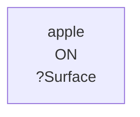
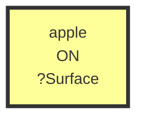

# 🚀 VirtualHome Agent Episode Log


### [GoalReasoner (Module A - Intent)] Output
```json
{
  "is_instruction_obviously_vague": false,
  "clarification_question": null,
  "target_object": "apple",
  "location_hint": "desk",
  "reasoning_chain": [
    {
      "question": "Why does the user want this object?",
      "answer": "They want the apple brought to their desk."
    },
    {
      "question": "Why is that important?",
      "answer": "So the apple is available in the location where they want to use or access it."
    },
    {
      "question": "What fundamental need does this fulfill?",
      "answer": "It fulfills the need to have a desired item conveniently within reach at the desk."
    },
    {
      "question": "Are there any deeper psychological or physical motivations?",
      "answer": "The underlying motivation is likely convenience, accessibility, or preparing to eat or use the item without needing to retrieve it later."
    }
  ],
  "deep_intent": "The user wants a desired item made conveniently accessible at their workspace.",
  "acceptable_alternatives_properties": [
    {
      "priority": 1,
      "description": "Other small ready-to-handle fruit items that can be placed on a desk, such as a pear or orange"
    },
    {
      "priority": 2,
      "description": "Other similar single-serving edible items that are easy to carry and keep on a desk, such as a banana or plum"
    },
    {
      "priority": 3,
      "description": "Any small snack or personal item that can be conveniently brought to and used at the desk"
    },
    {
      "priority": 4,
      "description": "A different convenient desk-side item that serves the same purpose of keeping something accessible nearby"
    }
  ]
}
```

### [RoboStateMultiTaskController] Output
```json
{
  "action": "[walk] <bathroom> (11)",
  "active_task_id": "task_1",
  "task_context": {
    "active_task_id": "task_1",
    "pending_task_ids": [],
    "satisfied_task_ids": []
  },
  "source": "room_frontier"
}
```
## Step 0
- **Action**: `[walk] <bathroom> (11)`
- **Action Success**: `True`
- **Action Message**: {'0': {'message': 'Success'}}
- **Active Task**: `task_1`
- **Decision Source**: `room_frontier`
- **Task Progress**: E1_02=pending
- **SDG Status**:

- **Observed Items (74)**: floor(74), floor(75), floor(76), floor(77), floor(78), floor(79), floor(80), floor(81), floor(82), wall(83), wall(84), wall(85), wall(86), wall(87), wall(88)...


### [RoboStateMultiTaskController] Output
```json
{
  "action": "[walk] <kitchen> (205)",
  "active_task_id": "task_1",
  "task_context": {
    "active_task_id": "task_1",
    "pending_task_ids": [],
    "satisfied_task_ids": []
  },
  "source": "room_frontier"
}
```
## Step 1
- **Action**: `[walk] <kitchen> (205)`
- **Action Success**: `True`
- **Action Message**: {'0': {'message': 'Success'}}
- **Active Task**: `task_1`
- **Decision Source**: `room_frontier`
- **Task Progress**: E1_02=pending
- **SDG Status**:

- **Observed Items (135)**: floor(74), floor(75), floor(76), floor(77), floor(78), floor(79), floor(80), floor(81), floor(82), wall(83), wall(84), wall(85), wall(86), wall(87), wall(88)...


### [PerceptionFilter] Output
```json
{
  "reasoning": "The goal is to place the apple on a desk, so the only strictly necessary objects are the target apple and the desk as the required surface/location. No other tools or appliances are needed for this simple placement task.",
  "selected_classes": [
    "apple",
    "character",
    "desk"
  ],
  "raw_class_count": 92
}
```

### [LLMExecutor] Output
```json
{
  "reasoning": "The goal is to make the apple be ON a desk. The apple is currently in the kitchen, while the target desk is in the bedroom and is a movable surface. Since I am already in the kitchen and the apple is accessible here, the next required step is to move to the apple before grabbing it. I should not repeat a walk to the kitchen because I am already there.",
  "satisfied_nodes": [],
  "current_node_focus": "N1",
  "mapped_variables": {
    "?Surface": "desk(108)"
  },
  "action": "[walk] <apple> (437)"
}
```

### [RoboStateMultiTaskController] Output
```json
{
  "action": "[walk] <apple> (437)",
  "active_task_id": "task_1",
  "task_context": {
    "active_task_id": "task_1",
    "pending_task_ids": [],
    "satisfied_task_ids": []
  },
  "source": "llm_executor"
}
```
## Step 2
- **Action**: `[walk] <apple> (437)`
- **Action Success**: `True`
- **Action Message**: {'0': {'message': 'Success'}}
- **Active Task**: `task_1`
- **Decision Source**: `llm_executor`
- **Task Progress**: E1_02=pending
- **SDG Status**:

- **Observed Items (7)**: desk(108) [CLOSED], character(1), bathroom(11), bedroom(73), kitchen(205), livingroom(335), apple(437)


### [PerceptionFilter] Output
```json
{
  "reasoning": "Reused cached class selection.",
  "selected_classes": [
    "apple",
    "character",
    "desk"
  ],
  "raw_class_count": 92
}
```

### [LLMExecutor] Output
```json
{
  "reasoning": "The apple is already close to the character in the kitchen, so the next required step toward placing it on the desk is to pick it up. The desk is in the bedroom and is the intended surface for the final ON relation, but I cannot put it there until I am holding the apple and have walked to the desk. The current node N1 is unsatisfied because the apple is not on any surface yet.",
  "satisfied_nodes": [],
  "current_node_focus": "N1",
  "mapped_variables": {
    "?Surface": "desk(108)"
  },
  "action": "[grab] <apple> (437)"
}
```

### [RoboStateMultiTaskController] Output
```json
{
  "action": "[grab] <apple> (437)",
  "active_task_id": "task_1",
  "task_context": {
    "active_task_id": "task_1",
    "pending_task_ids": [],
    "satisfied_task_ids": []
  },
  "source": "llm_executor"
}
```
## Step 3
- **Action**: `[grab] <apple> (437)`
- **Action Success**: `False`
- **Action Message**: temporary_unavailable: target disappeared; wait or search and retry
- **Active Task**: `task_1`
- **Decision Source**: `llm_executor`
- **Task Progress**: E1_02=pending
- **SDG Status**:

- **Observed Items (7)**: desk(108) [CLOSED], character(1), bathroom(11), bedroom(73), kitchen(205), livingroom(335), apple(437)


### [PerceptionFilter] Output
```json
{
  "reasoning": "Reused cached class selection.",
  "selected_classes": [
    "apple",
    "character",
    "desk"
  ],
  "raw_class_count": 92
}
```

### [LLMExecutor] Output
```json
{
  "reasoning": "The apple is now visible again in the kitchen and is close to the character, so the previous temporary unavailability has resolved. To satisfy the SDG goal of having the apple ON some surface, I need to pick it up first before moving it to the desk. Since I just walked to the apple previously, I should not repeat walking; the next atomic step is to grab the apple while nearby.",
  "satisfied_nodes": [],
  "current_node_focus": "N1",
  "mapped_variables": {},
  "action": "[grab] <apple> (437)"
}
```

### [RoboStateMultiTaskController] Output
```json
{
  "action": "[grab] <apple> (437)",
  "active_task_id": "task_1",
  "task_context": {
    "active_task_id": "task_1",
    "pending_task_ids": [],
    "satisfied_task_ids": []
  },
  "source": "llm_executor"
}
```
## Step 4
- **Action**: `[grab] <apple> (437)`
- **Action Success**: `False`
- **Action Message**: temporary_unavailable: target is temporarily hidden
- **Active Task**: `task_1`
- **Decision Source**: `llm_executor`
- **Task Progress**: E1_02=pending
- **SDG Status**:

- **Observed Items (7)**: desk(108) [CLOSED], character(1), bathroom(11), bedroom(73), kitchen(205), livingroom(335), apple(437)


### [RoboStateMultiTaskController] Output
```json
{
  "action": "[walk] <livingroom> (335)",
  "active_task_id": null,
  "task_context": {
    "active_task_id": null,
    "pending_task_ids": [
      "task_1"
    ],
    "satisfied_task_ids": []
  },
  "source": "loop_recovery_room_revisit"
}
```
## Step 5
- **Action**: `[walk] <livingroom> (335)`
- **Action Success**: `True`
- **Action Message**: {'0': {'message': 'Success'}}
- **Decision Source**: `loop_recovery_room_revisit`
- **Task Progress**: E1_02=pending
- **SDG Status**:
No SDG active.
- **Observed Items (243)**: floor(74), floor(75), floor(76), floor(77), floor(78), floor(79), floor(80), floor(81), floor(82), wall(83), wall(84), wall(85), wall(86), wall(87), wall(88)...


### [PerceptionFilter] Output
```json
{
  "reasoning": "The goal is to place the apple on a desk. The SDG only requires the apple and some surface to put it on, so the minimal necessary classes are the target object and the explicit location/furniture class desk.",
  "selected_classes": [
    "apple",
    "plum",
    "character",
    "desk"
  ],
  "raw_class_count": 101
}
```

### [LLMExecutor] Output
```json
{
  "reasoning": "The goal is to place an apple on a desk surface. We are currently in the livingroom and there is an apple (438) close to the character, but the target desk object is in the bedroom. Since putting an object onto a surface requires being near the destination first, the next step should be to walk to the desk that will serve as the goal surface. The apple is not yet held, so this step focuses on positioning for the required grab-and-place sequence.",
  "satisfied_nodes": [],
  "current_node_focus": "N1",
  "mapped_variables": {
    "?Surface": "desk(108)"
  },
  "action": "[walk] <desk> (108)"
}
```

### [RoboStateMultiTaskController] Output
```json
{
  "action": "[walk] <desk> (108)",
  "active_task_id": "task_1",
  "task_context": {
    "active_task_id": "task_1",
    "pending_task_ids": [],
    "satisfied_task_ids": []
  },
  "source": "llm_executor"
}
```
## Step 6
- **Action**: `[walk] <desk> (108)`
- **Action Success**: `True`
- **Action Message**: {'0': {'message': 'Success'}}
- **Active Task**: `task_1`
- **Decision Source**: `llm_executor`
- **Task Progress**: E1_02=pending
- **SDG Status**:

- **Observed Items (11)**: desk(108) [CLOSED], character(1), bathroom(11), bedroom(73), kitchen(205), livingroom(335), apple(437), desk(373) [CLOSED], apple(438), plum(443), plum(444)


### [PerceptionFilter] Output
```json
{
  "reasoning": "Reused cached class selection.",
  "selected_classes": [
    "apple",
    "plum",
    "character",
    "desk"
  ],
  "raw_class_count": 101
}
```

### [LLMExecutor] Output
```json
{
  "reasoning": "The goal is to have the apple on a desk. We are already close to a valid apple candidate: apple(438) is in the livingroom and close to the character, while desk(108) is the most likely target desk in the current room context and is also close. Since the apple must be held before it can be placed, the next atomic step should be to grab the nearby apple that is currently accessible. Apple(437) is in the kitchen and was temporarily unavailable earlier, so apple(438) is the better immediate candidate to satisfy the apple-on-desk goal.",
  "satisfied_nodes": [],
  "current_node_focus": "N1",
  "mapped_variables": {},
  "action": "[grab] <apple> (438)"
}
```

### [RoboStateMultiTaskController] Output
```json
{
  "action": "[grab] <apple> (438)",
  "active_task_id": "task_1",
  "task_context": {
    "active_task_id": "task_1",
    "pending_task_ids": [],
    "satisfied_task_ids": []
  },
  "source": "llm_executor"
}
```
## Step 7
- **Action**: `[grab] <apple> (438)`
- **Action Success**: `True`
- **Action Message**: {'0': {'message': 'Success'}}
- **Active Task**: `task_1`
- **Decision Source**: `llm_executor`
- **Task Progress**: E1_02=pending
- **SDG Status**:

- **Observed Items (11)**: desk(108) [CLOSED], character(1), bathroom(11), bedroom(73), kitchen(205), livingroom(335), apple(437), desk(373) [CLOSED], apple(438), plum(443), plum(444)


### [PerceptionFilter] Output
```json
{
  "reasoning": "Reused cached class selection.",
  "selected_classes": [
    "apple",
    "plum",
    "character",
    "desk"
  ],
  "raw_class_count": 101
}
```

### [LLMExecutor] Output
```json
{
  "reasoning": "The active goal is to place the apple on the desk. I am already holding apple(438), and the current Filtered Graph shows desk(108) is close to the character. To satisfy the SDG relation ON apple ?Surface, the next step is to place the held apple onto the desk. Because putback requires being explicitly walked to the destination first, and I am already close to desk(108), the correct immediate action is to put the apple back onto the desk surface.",
  "satisfied_nodes": [],
  "current_node_focus": "N1",
  "mapped_variables": {
    "?Surface": "desk(108)"
  },
  "action": "[putback] <apple> (438) <desk> (108)"
}
```

### [RoboStateMultiTaskController] Output
```json
{
  "action": "[putback] <apple> (438) <desk> (108)",
  "active_task_id": "task_1",
  "task_context": {
    "active_task_id": "task_1",
    "pending_task_ids": [],
    "satisfied_task_ids": []
  },
  "source": "llm_executor"
}
```
## Step 8
- **Action**: `[putback] <apple> (438) <desk> (108)`
- **Action Success**: `True`
- **Action Message**: {'0': {'message': 'Success'}}
- **Active Task**: `task_1`
- **Decision Source**: `llm_executor`
- **Task Progress**: E1_02=done
- **SDG Status**:

- **Observed Items (11)**: desk(108) [CLOSED], character(1), bathroom(11), bedroom(73), kitchen(205), livingroom(335), apple(437), desk(373) [CLOSED], apple(438), plum(443), plum(444)

